# Microarchitecture of the Apple M6 Neural Engine: An Empirical Study Based on Compiled Artifacts, Execution Traces, and Power Measurements

## Abstract

The Apple M6 chip integrates two Apple Neural Engines (ANEs) on a single die, but their program format, on-chip storage, clocks, and power have not been publicly documented. Under the constraints that models are executed only through the public Core ML interfaces and that no modified program is executed, this report characterizes the microarchitecture of the M6 ANE along the lifecycle of a single inference call. The characterization combines analysis of compiled artifacts, firmware timestamps, performance counters, SMC power-rail measurements, and read-only analysis of the compiler, driver, and firmware. The entire report is organized around one thesis: the practical performance of the ANE is determined jointly by the static arrangements made by the compiler, the resources shared by the two engines, and the dynamic management performed by the host. The results show that each engine contains 16 NEs, that each NE completes 256 FP16 or 512 INT8 multiply-accumulate operations per cycle, that the full-load clock is 2.58 GHz, and that the measured FP16 throughput of a single engine is 20.6 TFLOPS. The weight-read bandwidth is about 150 GB/s and is shared by the two engines. FP16 multiply-accumulate operations use a Q15.16 fixed-point accumulator. Compressed and pruned weights are read in compressed format, and the compute array skips zero weights but not zero activations. The compiler generates both single-ANE and dual-ANE programs for each model. When computation is the limiting factor, the dual-engine speedup is 1.92×, but when weight reading is the limiting factor, it is only about 1.4×, and row-wise splitting yields no speedup. The DVFS state of the ANE is determined by the CLPC in the host kernel, which maintains the busy fraction of the ANE at about 77% when calls are spaced closely together. Host overhead therefore directly affects ANE speed. This report also finds that the power rail that can be used to measure ANE power also supplies the CPU, and it gives a subtraction method and a power decomposition. On practical tasks, the M6 ANE is 1.4–2.7× faster than the M4 ANE. On this basis, the report summarizes deployment principles and compiles 14 suspected defects and 10 undocumented behaviors. All experimental tools, raw data, and analysis scripts of this report are publicly available at <https://github.com/751K/Apple-Neural-Engine-Microarchitecture-Study-M6>.

## 1. Introduction

### 1.1 Research Background

Since the A11 chip in 2017, Apple has integrated a dedicated neural network accelerator, the Apple Neural Engine (ANE), into its SoCs. The original A11 had only two cores and was not open to third-party developers. Starting with the A12, the ANE was expanded to eight cores and became accessible through Core ML [8]. On the Mac, the ANE has been a standard component of every chip generation since the M1. The M1 ANE has 16 cores, with an advertised throughput of 11 TOPS, and by the M4 the core count remains 16 while the advertised throughput has risen to 38 TOPS [8]. On chips such as the M1 Ultra, which is assembled from two dies, the ANE core count doubles with the die count to 32 [8]. When the Core ML framework loads a model, it assigns suitable models, or parts of their operations, to the ANE for execution.

As generative models increasingly migrate to on-device execution, the importance of the ANE grows further. Compared with the CPU and GPU, the ANE has a clear advantage in energy efficiency, which makes it suitable for running tasks such as large language models and image generation continuously on battery-powered devices. However, these workloads place different demands on hardware than conventional convolutional networks do. In the decoding phase of a large language model, every generated token requires reading all of the weights, while the amount of computation is small. Performance therefore depends mainly on the bandwidth for reading weights and on the compressed format of the weights. On-device interactive inference usually proceeds intermittently, and the idle periods between calls in turn affect the DVFS state of the hardware and the energy consumed by each inference. Consequently, to deploy such models efficiently on the ANE, developers need to understand more than the peak compute of the ANE. They also need to understand its storage hierarchy, data paths, and data formats, as well as its scheduling and frequency-scaling behavior.

For developers, however, the ANE has long remained opaque and can be invoked only as a black box. The information Apple publishes is limited to the number of cores in each ANE generation and its peak compute, and since the M5 even the peak compute has no longer been published. The program format, on-chip storage, data paths, clocks, and power of the ANE are all undisclosed, and Apple provides no interface for programming the ANE directly. Developers can use the ANE only indirectly, through Core ML. The `MLComputePlan` interface of Core ML can query which devices each operation supports and which device it prefers. However, developers cannot confirm whether each call actually executes on the ANE, and they cannot analyze how the time of one inference is distributed among scheduling, computation, and data movement. This opacity makes it difficult for developers to optimize models for the ANE and makes it difficult for researchers to evaluate its design.

The generational evolution of the ANE aggravates this problem further. The clock, bandwidth, supported data formats, and compiler strategy of each ANE generation change, so knowledge gained on one chip generation may not apply to the next, and these changes are likewise undocumented. The M6 introduces the largest structural change visible to software since the M1: it integrates two complete ANEs on a single die (Section 4.3). The compiler generates both single-ANE and dual-ANE programs for each model, and the driver must distribute requests between the two engines (Chapters 5 and 6). Unlike Ultra-series chips, which have a set of ANEs on each of two dies, the two engines of the M6 are located on the same die and can jointly execute the same model. Apple has not explained how the two engines cooperate, when a model can use both engines at once, how much speedup the second engine can bring, or what limits that speedup. Existing studies have not yet made measurements on the M6.

### 1.2 Prior Work and Its Limitations

Few public resources can be drawn on to answer these questions. Apple's own deployment guide gives several recommendations for deploying Transformers on the ANE, such as using channel-first tensor layouts and replacing fully connected layers with convolutions [24], but it does not explain the hardware reasons behind these recommendations. Community-maintained documentation records mainly Core ML-level behavior, such as which layers can run on the ANE [8]. Only two systematic studies examine the ANE internals in depth: maderix's series of articles on the M4 [1–4], and Bryngelson's survey covering the A11 through the M5 [5]. The former modifies compiled artifacts and executes them on the device, reconstructing the task descriptor (TD), on-chip storage, and data formats of the M4. The latter combines decompilation of the compiler with measurements on the M1 and M5, and gives the architecture and performance characteristics of several ANE generations. Chapter 2 describes these works in detail.

Measured against the requirements stated in Section 1.1, these studies leave gaps in three respects.

First, the hardware parameters of the ANE remain incomplete. Even for the M4, the most thoroughly studied generation, maderix did not measure the width or clock frequency of the MAC array. The author did not determine how the MAC array, the planar engine (PE), and DMA overlap, and did not determine the DMA topology [4]. The measurements in Bryngelson's survey were conducted mainly on the M1 and M5, and most of its descriptions of newer generations derive from decompilation or prediction. Its description of the H18 generation does not agree with the M6 [5]. For the weight-read bandwidth, activation bandwidth, and data formats that developers care about most, existing sources provide only scattered numbers.

Second, cooperation between the two engines has not been studied at all. maderix estimated the peak performance of the M6 only from public information, and listed as open questions whether the two engines share on-chip storage and whether a single graph can execute across both engines [4]. On the basis of the kernel driver of an earlier product, Bryngelson analyzed how requests are allocated in multi-die chips. The analysis found that requests are dispatched as whole submissions to idle dies and that dies do not exchange data [5]. However, this describes request-level allocation. Whether the two engines of the M6 can cooperate at the program level to execute the same model, and what the cost and benefit of such cooperation are, remain unanswered.

Third, the host-side effects on the ANE have been overlooked. Existing studies all measure the ANE as an independent accelerator and treat the overhead of each call as a fixed figure [2, 4, 5]. None of them systematically studies how the host driver allocates requests, how the state of the CPU affects call overhead, or how power management selects the DVFS state of the ANE. In intermittent on-device workloads, however, precisely these factors determine which DVFS state the ANE actually runs in and how much energy each inference consumes. In terms of power measurement, this report also finds that the SMC power rail that can be used to measure ANE power also supplies the CPU (Chapter 13). Existing power data must therefore be interpreted with caution.

### 1.3 Research Objectives and Questions

To address the three gaps described above, the objective of this report is to characterize the microarchitecture of the M6 ANE completely, using only publicly available execution paths. This includes how its two engines cooperate and how host-side software affects its performance and energy consumption.

The core thesis of this report is that the practical performance of the ANE is not determined by its compute array alone. It is jointly determined by three aspects. The first is the static arrangements made by the compiler at compile time: how a program is partitioned, how weights are read in, and whether both engines are used. The second is the resources shared by the two engines: the weight-read bandwidth, the shared cluster clock, and shared power. The third is the dynamic management performed by the host at run time: how requests are submitted and dispatched, and how the DVFS state is selected. Therefore, explaining why an inference is fast or slow, and why it consumes more or less energy, requires analyzing these three aspects together rather than examining the ANE in isolation. The subsequent chapters present measurements of the program format, compute and storage bandwidth, dual-engine scaling, frequency scaling, and power, and these measurements serve as evidence for this thesis. Section 15.1 returns to the thesis on the basis of all results.

To achieve this objective, this report organizes the study along the complete lifecycle of a single inference call. This main line is adopted because the practical performance and energy consumption of the ANE are the joint result of each stage in this process. A call first passes from the program generated by the compiler, through the driver and firmware, to the hardware. It then executes in the compute array and storage paths, and the speed of execution is determined by the DVFS state and ultimately manifests as power consumption. Only by measuring stage by stage along this process can time and energy be attributed to specific stages, and only then can the ANE be studied without separating it from the host. Following this main line, the research questions of this report fall into three groups. These groups correspond to the three gaps of Section 1.2 in an overlapping rather than one-to-one manner (see below). The lifecycle determines only the order in which the questions are developed. The three aspects of the core thesis are used for a comprehensive interpretation based on all results, and the two do not correspond chapter by chapter, because the results of a single chapter often involve several of these aspects at once.

The first group of questions concerns how a program reaches the hardware. It asks what program the compiler translates a model into, and how a program on a dual-engine chip differs from one on a single-engine chip (Chapter 5). It also asks how an inference call passes through the host driver and the ANE firmware to the hardware, where the time is spent, and how multiple requests run concurrently (Chapter 6). This group also addresses the second and third gaps, because the generation of dual-engine programs and the allocation of requests both take place in this stage.

The second group of questions concerns how the hardware computes and moves data internally. It asks how many multiply-accumulate operations the compute array completes per cycle, and which shapes and precisions can exploit its capability (Chapter 7). It asks how the numerical behavior of the ANE differs from that of the CPU (Chapter 8), how large the on-chip storage is, and what the bandwidths of the weight and activation paths are (Chapter 9). It also asks how the two engines cooperate, how much speedup the second engine brings, and what limits that speedup (Chapter 10). This group mainly addresses the first and second gaps.

The third group of questions concerns what determines speed and energy consumption. It asks which clock domains the ANE has, and at what frequency it runs at full load (Chapter 11). It asks by whom, and according to what rules, the DVFS state is determined (Chapter 12), and how much power the ANE consumes and where that power goes (Chapter 13). This group mainly addresses the third gap.

After answering these three groups of questions, this report also tests the conclusions on practical application workloads. It examines how the microarchitectural characteristics obtained above manifest on large language models, image classification, and text recognition tasks. It identifies the tasks on which the M6 ANE is markedly faster than the M4 and the tasks on which its speedup is limited, and it asks whether the causes can be explained by the conclusions of the earlier chapters (Chapter 14). To this end, Chapter 14 first derives observable expectations from the conclusions of the earlier chapters, then tests them group by group, and identifies the factors that application benchmarks cannot separate. Relating the conclusions of microbenchmarks to practical applications is also something that existing studies lack.

### 1.4 Methods and Constraints

This report combines four classes of methods to answer the questions above. First, it calls the compilation interface within its own process, compiling without executing, comparing the artifacts of each compilation target byte for byte, and performing read-only disassembly of the compiler. Second, it executes models only through the public interfaces of Core ML and observes execution with timing, IOReport counters, SMC power rails, and kdebug firmware events. Third, it performs read-only static analysis of the kernelcache and the ANE firmware. Fourth, it runs application benchmarks with real models on two machines, the M6 and the M4. It monitors the busy fraction, memory read bandwidth, and power of the ANE using anemon [27], an ANE monitoring program that we developed, together with `powermetrics` and SMC power rails. This report observes the following constraints. It does not use private execution interfaces, and it does not load or execute any modified compiled artifacts. System observation is performed in read-only mode, and firmware and kernelcache are subjected only to read-only analysis and are not redistributed. This report also does not modify any system security settings. The details of the methods and the definitions of the evidence categories are given in Chapter 3, and the limitations arising from these constraints are discussed in Chapter 16.

### 1.5 Main Contributions

The main findings of this report comprise nine items. Most of them each support the thesis above from one of three aspects: the compiler, shared resources, and the host. The numerical behavior in item five is a relatively independent finding. Item eight tests the thesis on practical applications, and its results are consistent with it. Item nine summarizes the questions raised by these findings, together with the reusable tools and data.

First, for hardware parameters, this report establishes by measurement that each neural engine core (NE) completes 256 FP16 multiply-accumulate operations or 512 INT8 multiply-accumulate operations per cycle. It back-calculates a full-load clock of 2.58 GHz from firmware timestamps. It also measures a weight-read bandwidth of about 150 GB/s and an activation bandwidth of about 35–40 GB/s per ANE. For on-chip storage, this report determines the 64 KiB resident-weight limit that the compiler sets for each NE, and the L2 that the compiler uses for each ANE with a 2 MiB budget. The physical capacities of these structures cannot be read directly (Chapters 7, 9, and 11). The multiply-accumulate width and the clock frequency are quantities that maderix did not measure on the M4.

Second, for weight compression and sparsity, this report establishes by measurement that W8, 2–6-bit palettized, and pruned weights are all read in compressed format. The execution time of weight-read-bound layers therefore shortens approximately in proportion to the number of bytes, at 0.32× the FP16 time for 4-bit palettization and 0.16× for 90% pruning. It finds that the compute arrays of both the M6 and the M4 skip multiply-accumulate operations on zero weights. At 90% pruning, this corresponds to 53.6 TFLOPS when normalized to the dense multiply-accumulate count. This behavior does not require structured sparsity, but zero activations are not skipped. The report also indicates that block-wise int4 quantization and vector palettization cannot be compiled for the ANE with the generation parameters used in this report (Chapter 7).

Third, for dual-engine cooperation, this report finds that each compiled artifact of the M6 contains both single-ANE and dual-ANE programs. It reverse-engineers the cost model that the compiler uses to decide whether to split a layer, and it measures a dual-engine speedup of 1.92× when computation is the limiting factor, corresponding to a scaling efficiency of about 96%. It identifies two causes that limit scaling: the two engines share the weight-read bandwidth, and work partitioning across tiles is uneven. The report also finds that asynchronous requests to the same model from the same process can be dispatched to both engines, with throughput reaching about 2.8× that of synchronous calls when weights are resident on chip. Synchronous calls issued from multiple threads are serialized (Chapters 5, 6, and 10).

Fourth, for the program format and compiler parameters, this report determines that a TD is a sequence of register-write packets. It decodes the encodings of the header word, the address packets, and the base address register (BAR) slots, and it determines the correspondence between the TD layout versions of each generation. It finds that the compiler parameter table used by the M6 is identical to that of the next-generation H19. It infers, from layouts in the compiler that have not yet been named, the data formats that future ANEs will support. The report also reproduces the segmentation rules that Core ML uses to decide which operations are assigned to the ANE. From the ahead-of-time compilation driver, it infers that the M6 inherits the cost model of the M4 (Chapters 5 and 15).

Fifth, for numerical behavior, this report finds that the FP16 multiply-accumulate path uses a Q15.16 fixed-point accumulator, and that the bias is the initial value of the accumulator. It determines the specific behavior of overflow, rounding, subnormal products, and the lookup tables for activation functions (Chapter 8).

Sixth, for host-side scheduling and frequency scaling, this report analyzes the three-layer scheduling structure of the driver and firmware, and finds that the completion-side overhead of each call depends on the idle depth of the host CPU. It shows by measurement that the closed-loop performance controller (CLPC) in the host kernel stabilizes the ANE busy fraction at about 77% when inter-call intervals are short. It also gives an approximate model describing the behavior of the CLPC during long idle periods (Chapters 6 and 12).

Seventh, for power, this report finds that the SMC power rail PP0b supplies both the ANE and the S-cores and P-cores of the CPU. It proposes a measurement method that subtracts the power of the CPU clusters. On this basis, it decomposes the shared overhead of the two engines, the energy per multiply-accumulate and per byte, and the effect of the DVFS state on the energy consumed by each inference (Chapter 13).

Eighth, for practical applications, this report compares the M4 and M6 ANEs on three classes of practical tasks: large language models, image classification, and text recognition. It finds that the M6 is 1.8–2.7× faster on compute-dense tasks, whereas tasks with a small amount of work per call achieve only about a 1.4× speedup. The directions of these differences are consistent with the expectations derived from dual-engine scaling, weight-read bandwidth, and fixed call overhead. A custom model that reduces the number of calls is likewise consistent with the deployment principles of this report. At the same time, we identify factors that application benchmarks cannot separate (Chapter 14).

Ninth, this report compiles 14 suspected defects or contested designs and 10 undocumented behaviors, and it summarizes deployment principles for developers (Chapter 15). Apart from the application benchmark data in Chapter 14, all experimental tools, raw data, and analysis scripts are released with this report (Appendices A and B).

### 1.6 Organization of This Report

Chapter 2 reviews related work. Chapter 3 describes the experimental platform, the observation methods, and the evidence categories. Chapter 4 presents the overall structure of the M6 ANE as a reference for the subsequent chapters. Chapters 5–13 follow the lifecycle of a single inference call. Chapter 5 studies the compiler and the program format. Chapter 6 studies scheduling and execution. Chapters 7–9 study the compute array, numerical behavior, and storage hierarchy. Chapter 10 studies dual-engine cooperation. Chapters 11–13 study clock domains, dynamic frequency scaling, and power. Chapters 5, 6, and 10 all involve the two engines, and the division of labor among them is as follows. Chapter 5 explains how the compiler decides what each of the two engines does. Chapter 6 explains how the runtime submits, schedules, and completes requests. Chapter 10 tests how much speedup these arrangements actually deliver and why the ideal effect is not reached. Chapter 14 tests the conclusions of the preceding chapters with practical applications such as large language models, image classification, and text recognition. On this basis, Chapter 15 comprehensively discusses the design characteristics of the M6 ANE, deployment recommendations, comparison with earlier products, and the defects identified. Chapter 16 discusses the limitations and unresolved issues of this report, and Chapter 17 summarizes the report. The appendices provide the tools and reproduction methods, a data index, a corrections log, a defect list, and a glossary.

## 2. Related Work

Public research on the ANE can be broadly divided into five categories: two systematic studies of the ANE internals, by maderix and by Bryngelson; community-maintained documentation and open-source drivers; application studies aimed at deploying or training models on the ANE; Apple's own deployment guides; and studies of NPUs from other vendors, which provide comparison references and methodological inspiration for this report. This chapter introduces these works in sequence. It focuses on the conclusions each work reached, the methods it used, and the questions it left open, and it concludes by explaining how this report relates to them.

### 2.1 The maderix M4 Series

The series *Inside the M4 Apple Neural Engine* by maderix [1–4] uses the M4 Mac mini as its platform. It examines the ANE in four parts, progressing from shallow to deep, and it is the most thorough analysis of a single ANE generation to date. The author published the code used in the first three parts. The parameter-table reading tool and the program-generation tool used in the fourth part were not published.

#### 2.1.1 Software Stack and Private Interfaces

Part 1 [1] reviews the software stack of the ANE. By listing the Objective-C classes in private frameworks and intercepting Core ML's calls to private interfaces through method replacement, the author determined that below Core ML, the `_ANEClient` in the AppleNeuralEngine framework is responsible for compiling, loading, and executing models. The author reproduced the complete workflow, from establishing a connection, through compiling and loading (which returns a program handle with a queue depth of 127), to creating IOSurface inputs and outputs and submitting requests. The author analyzed the MIL intermediate representation of Core ML. The author found that the compiled binaries of a 1024×1024 matrix multiplication and a 128×128 matrix multiplication are almost the same size (2688 and 2680 bytes), and inferred from this that the compiled artifacts store configuration parameters rather than instructions. The author also found a private interface for compiling MIL directly in memory, recorded several pitfalls in its use, and noted that compilation results are cached in the application's cache directory. The first compilation takes about 20–40 ms. Part 1 concludes by listing interfaces that had not yet been explored, including request chaining, shared events, and performance statistics.

#### 2.1.2 Performance Measurements

Part 2 [2] measures the performance of the ANE by calling private interfaces directly. In a scan over matrix multiplication sizes, a 256×256 matrix multiplication takes about 0.101 ms, of which about 0.095 ms is scheduling overhead. At 2048×2048 the throughput reaches 5.7 TFLOPS, and at 4096×4096 it falls to 4.0 TFLOPS. The author attributed this decline to the total size of the three matrices (96 MB) exceeding the on-chip storage, and on this basis inferred that the SRAM is about 32 MB. The author also found that writing a matrix multiplication as a 1×1 convolution is about 3× faster. A single matrix multiplication can use only about 30% of peak, and only deep networks of 16–64 layers approach peak. For small operators, Core ML is 2–4× slower than direct calls to the private interface. This part also reports that INT8 shows no speedup over FP16, and that the energy efficiency of the ANE is about 6.6 TFLOPS/W, computed at 2.8 W. Both of these conclusions were later corrected in Part 4.

#### 2.1.3 On-Device Training

Part 3 [3] implements training of a small language model on the ANE. Because the ANE does not support branching, indexing by runtime values, or in-place modification, the author split attention into three steps: computing QKᵀ on the ANE, computing the mask and softmax on the CPU, and multiplying by V back on the ANE. Weight gradients and the optimizer are computed on the CPU. The author compared three schemes. In the first, the weights are hard-coded into the program, which requires 72 recompilations per batch, and a process fails after about 119 compilations because of resource leaks. In the second, moving more operations onto the ANE actually increased the number of compilations. In the third, passing the weights as IOSurface inputs requires only one compilation at startup. Ultimately, the author completed 50,000 steps of training of the Stories110M model on the ANE, and reported that the ANE draws about 2.8 W during training, while CPU training requires 15–20 W. This part also measures about 160 µs per XPC dispatch, and it finds that merging 12 layers into a single program is about 3× faster than splitting them into 24 calls.

#### 2.1.4 Hardware Structure

Part 4 [4] is the core of the series. The author proceeded from MIL-level experiments to the compiled artifacts and to the hardware itself. The author adopted two complementary paths. One is "MIL → compiler → ANE", which is used to observe operator support, whole-graph performance, and compiler strategy. The other is "compiled artifact → loader → ANE", which modifies fields in compiled artifacts and then executes them on the device, and confirms the meaning of a field by whether the output or timing changes as expected. The author used a debugger in a running compiler process to read out a 2360-byte hardware parameter table, and ultimately generated from scratch a program that is byte-for-byte identical to the compiler's output, reaching 98.8% of the measured peak.

Based on these methods, Part 4 presents the following main conclusions. In terms of storage, the compiler compares each operand with the 2 MiB threshold in the parameter table. Operands that do not exceed the threshold reside on chip in their entirety, while larger operands are tiled and streamed with double buffering. On-chip storage consists of 64 banks interleaved at 16 bytes, and the compiler chooses a row stride that is coprime with 64 to avoid conflicts. Weights have a 64 KiB resident space, and up to 16 MiB can be streamed in 16 blocks. This conclusion corrects the "SRAM of about 32 MB" inference of Part 2. In terms of compute, the author concluded from the parameter table that the ANE consists of eight compute groups of eight accumulators each, that it assigns work by output channel, and the author gave a method for computing the output-channel-group size. In terms of operator support, the author counted about 50 hardware layer types. Elementwise operations are controlled by a single opcode byte. Activation functions such as sigmoid are implemented by 33 FP16 sample points stored in the weight segment, with linear interpolation between them. The author verified this mechanism by replacing the sample points with x³, after which the hardware gave correct results. In terms of precision, the author found that W8A8 (weights and activations both quantized to 8-bit integers) is a property of the whole chain. The mode word and DMA word of intermediate blocks must change together, and quantizing only the weights to INT8 yields no speedup. The throughput of W8A8 is 1.95× that of FP16, and its power is 2.7×. In terms of performance and power, the author measured that 64-layer 1×1 convolutions reach 18.77 TFLOPS and that W8A8 reaches 36.01 TOPS. FP16 full-load power is 4.57 W, W8A8 is 12.25 W, and idle power is 0. In terms of scheduling, the author measured an overhead of about 90 µs per call, and submitting two requests simultaneously saves only about 16% of the time. In terms of limits, the author found that 383 blocks of 128 KiB per tensor can be compiled and executed, but at 384 blocks the compiler service disconnects. The compiled artifact contains only four record types, namely DMA, compute, synchronization, and termination, and it contains no branches. The FP8 (E4M3) capability bit of the M4 is 0.

Part 4 also discusses the M6 specifically. Based on the public information that the M6 has two 16-core engines and a memory bandwidth of 170 GB/s, the author estimated its peak at about 38 TFLOPS (FP16) and 76 TOPS (W8A8). The author listed open questions, including whether the two engines share SRAM, whether one inference is scheduled once or twice, and whether one graph can execute across both engines. The author explicitly states that no M6 was available for testing.

#### 2.1.5 Corrections and Open Issues across the Parts

The series corrected several early conclusions in subsequent articles, so citations should follow Part 4. Table 2-1 lists these corrections.

*Table 2-1. Conclusions corrected in the maderix series*

| Item | Earlier claim | Part 4 claim |
| --- | --- | --- |
| INT8 | No speedup (Part 2) | W8A8 about 1.95×; no speedup when only the weights are quantized |
| Power | About 2.8 W (Parts 2 and 3) | FP16 4.57 W, W8A8 12.25 W; 2.8 W is the reading in low-power mode |
| Energy efficiency | 6.6 TFLOPS/W | 4.1 TFLOPS/W |
| Scheduling overhead | 95 µs (Part 2); 160 µs (Part 3) | About 90 µs |
| On-chip storage | About 32 MB (inferred from performance decline) | Replaced by a description based on the 2 MiB single-operand threshold and the bank structure; no total capacity is given |

The closing section of Part 4 lists problems that the author did not resolve. These include the maximum length of a program (383 blocks is only a compiler limit); how the MAC array, the planar engine, and DMA overlap within the same task (the independent branches the author measured save only about 1.1%, and all of these are whole-graph timings); the number of DMA engines and their queue depth; the number of channels and the clock frequency of the MAC array; the scope of effect of sync records; and the dual-engine design of the M6 [4]. Chapters 5, 6, 7, 9, 10, and 11 of this report answer most of these questions.

### 2.2 Bryngelson's Multi-Generation Survey and ANEForge

#### 2.2.1 Scope and Method

Bryngelson's *Apple Neural Engine: Architecture, Programming, and Performance* [5] is a 302-page survey covering multiple generations of products, from the A11 to the A18 and from the M1 to the M5. It is currently the broadest literature on the ANE. The method of the book has two notable features. First, the compiler has a built-in constructor for each architecture generation, so the hardware parameter table of any generation can be obtained on any machine. The author used this to obtain the parameter tables of 28 targets and compare them byte by byte, and then determined the meaning of the fields by decompiling the read functions that take the parameter table as an argument. Second, every conclusion in the book is labeled as measured, decompiled, or predicted. Measurements were made only on the M1 and M5 platforms, with a small number of measurements on the M2, and the conclusions for intermediate generations derive from decompilation or prediction.

#### 2.2.2 Main Conclusions

Table 2-2 summarizes, by object of study, the main conclusions of the book that are relevant to this report.

*Table 2-2. Principal conclusions of Bryngelson [5]*

| Subject | Conclusion |
| --- | --- |
| Software stack | Below Core ML and the Espresso runtime lie the AppleNeuralEngine framework and the daemon aned. The kernel contains the ANE driver, a multi-die load balancer, and clock and power management. The interior of the ANE is driven by a control core running RTKit. The host only writes to mailboxes and rings the doorbell, and does not access compute registers directly. |
| Program | A program is a static sequence of task descriptors, with no program counter, microcode, or data-dependent branches (decompilation). There are 14 versions of the task descriptor, and the M5 uses v20. The driver executes only one command at a time. On the M1, two threads submitting simultaneously are only 1.04× faster (measured). |
| Compute | Core counts come in two conventions, marketing and architectural. The architectural count is 4 for the M1 and 16 for the M5. Each core outputs 4 FP16 channels per cycle, or 8 when INT8 is packed (decompilation). The first level of the reduction tree is radix-4 FP16 partial sums, and the second level is an FP32-class accumulator (measured on the M1). The accumulator file has depth 8. On the M1, when the output channels increase from 192 to 256, the time jumps from 20 µs to 61 µs (measured). Each layer has a fixed overhead of about 44 cycles. The MAC array and the planar engine can issue at the same time. Winograd supports two variants, F(2×2,3×3) and F(4×4,3×3). |
| Clock | The M1 runs at about 1.14 GHz and the M5 at about 1.89 GHz (measured). The ANE itself has no DVFS table, and its frequency is determined by SoC power management. The M1 does not reduce its frequency during 210 s of continuous operation. |
| Storage | The single-operand limit is 2 MB, the same across generations. The threshold measured by timing is 2.28–2.34 MB on the M1 and 4.72 MB on the M5. The L2 has 64 banks with 16-byte interleaving. Resident weights are 64 KB, and streamed weights are up to 16 MB. On-chip storage is managed by the compiler and is not a cache. |
| Bandwidth | On the M1, the DRAM ceiling is 85 GB/s, the weight stream is 51 GB/s, and the activation stream is 24 GB/s. On the M5, the weight stream is about 145 GB/s and the activation stream is about 24 GB/s (measured). |
| Scheduling overhead | On the M1, each call takes about 190 µs. This comprises about 25 µs in user space and the runtime, about 16 µs for building the firmware request, 2–3 µs for ringing the doorbell, about 130 µs for the firmware round trip, and about 10 µs for kernel completion processing. Each call involves about two interrupts (measured). |
| Power | The entire block is powered off when idle. The power domains consist of an always-on base domain and several compute clusters that power up on demand. On the M1, the first call after 5 s of idleness takes about 260 ms. The firmware contains no temperature or throttling logic. |
| Numerics | The accumulator is FP32-class. Output rounding is round-half-to-even, and input NaNs become +inf. On the M1, the accumulation stage flushes subnormal numbers to zero, whereas the M5 preserves them. The M1 and the A14 saturate at 32768, whereas the M5 does not saturate. Activation functions are 33-point piecewise-linear lookup tables. |
| Program format | The compiled artifact is a Mach-O file containing segments for the task-descriptor stream, the weights and lookup tables, and the input and output declarations. The version information records the full set of compilation parameters. |

The book also infers the dataflow of the ANE from the names of the 24 hardware performance counters of each task descriptor. Data enters L2 or the weight storage from the fabric, is computed by the NEs and written back to L2, and then, after processing by the planar engine, is written back to DRAM. These counters cannot be read in user space.

#### 2.2.3 Multi-Die and Multi-Engine Designs

The book's analysis of multi-die products is the most relevant to the M6. At the kernel level, the load balancer supports up to four dies and dispatches requests to the most idle die as whole submissions, with no tensor exchange between dies (decompilation). At the firmware level, the firmware first attempts the endpoint of the second engine and falls back to the first engine on failure. At the compiler level, there is an intermediate representation for collective communication, including `all_reduce` and `all_gather`, and cross-die transfers go through a dedicated DMA. However, the enable bit for this function is 0 on all 28 targets, and the corresponding setter functions are assertions. That is, the function exists but is not enabled.

#### 2.2.4 Differences from the M6 and Inconsistencies in the Book

The book contains no data for the M6, and its description of the H18 generation does not agree with the observations of this report on the M6. The book holds that H18 is a single-die product with four cores per engine, that its FP8 (E4M3) capability bit is 1, and that its multi-die conflict-tracking and remote-dependency capability bits are 0. By contrast, each engine of the M6 has 16 NEs, and the two engines can cooperate to execute the same program (Chapters 4 and 10). The book's conclusions about the accumulator and rounding also differ from the measurements of this report on the M4 and M6 (Section 8.6). In addition, the book contains several internal inconsistencies. The size of the parameter table is given as both 0x938 and 0x348. The generation in which the MAC saturation problem was fixed is given as A15 in one place and M5 in another. The maximum width of FP16 convolution kernels is given as 16 starting from A14 in one place and as 15 starting from A16 in another. The base model of the M5 is described inconsistently. The measured slope of about 12 TFLOPS on the M1 also exceeds what the expression "4 cores × 4 output channels per cycle × 1.14 GHz" can account for. Section 5.4 of this report also finds that the parameter-table layout of the compiler version used here differs from the book's. The offsets in the book must be increased by displacements ranging from 0x8 to 0xb8 in different sections.

#### 2.2.5 ANEForge

The same author's ANEForge [6] is a Python tool that computes directly on the ANE. It compiles a lazily evaluated tensor compute graph into a single ANE program, covering 58 fused operators and 19 native bridging operators. It supports training, native fused attention, and Int8, Int4, and sparse weights. Programs are submitted through the private `e5rt` interface of Espresso to aned and the kernel driver for execution. On the M5 Pro, the author measured a scheduling floor of about 70 µs per call. ResNet-18 takes 0.33 ms per inference on the ANE, compared with 2.0 ms on the GPU and 6.0 ms on the CPU. Under sustained load, the ANE power rail is about 4.5 W. The author also points out the limitations of the ANE. It exposes only one hardware channel, so requests execute in sequence. Moreover, FP16's range prevents the sampling loop of diffusion models from converging correctly [6].

### 2.3 Community Documentation and Open-Source Drivers

The neural-engine documentation [8] maintained by Matthijs Hollemans since 2020 is the earliest and most frequently cited community resource on the ANE. It summarizes the ANE core counts of product generations from the A11 to the M5, and the official compute figures up to the M4. It lists known Core ML layer types that cannot run on the ANE, such as custom layers, recurrent networks, gather, dilated convolutions, pooling with kernels larger than 13 or strides larger than 2, and upsampling by more than 2×. It also introduces methods for determining whether a model executes on the ANE, such as observing the `H11ANEServicesThread` thread, setting a breakpoint on `-[_ANEModel program]`, or using the time profiler in Instruments. The documentation holds that the ANE uses FP16 throughout internally, and it found no evidence that convolutions execute natively with quantized weights. Its author states that no one outside Apple truly understands the internal workings of the ANE, and that some conclusions about unsupported layers are speculative.

Eileen Yoon's ANE driver for Asahi Linux [9] is the only public implementation that can drive the ANE under Linux. It supports the M1, M1 Pro, M1 Max, and M1 Ultra, and its last commit was in 2023. It consists of three parts: a kernel module based on the DRM accelerator framework, a user-space library, and Python bindings with matrix multiplication and super-resolution tests. Its source code reveals the hardware submission interface of the ANE on the M1. Buffers are mapped through DART, and the address window begins at 0x4000. A submission request carries the task size and the number and size of the task descriptors, and it fills in addresses for up to 32 buffer slots. The program and the weights are placed in a single buffer aligned to 16 bytes. The task manager and the task queues are located at fixed offsets of the engine. There are eight task queues in total, with priority values from 1 to 6 and two reserved values. The driver waits for the engine to become idle by polling, and it suspends automatically after one second of idleness. It is worth noting that this driver writes the task-manager registers directly and does not go through the ANE firmware. The eight job queues and six priority levels that this report observes in the M6 firmware (Section 6.4) are consistent with this driver, whereas on macOS these queues are managed by the RTKit firmware.

There are two smaller reverse-engineering efforts as well. geohot's ANE experiments in the tinygrad project [26] parse the format of compiled artifacts and the register fields in them. They describe the ANE as "a convolution-centric DMA engine" and record constraints, such as that the stride must be a multiple of 0x40 and that UInt8, Int8, and FP16 are supported. Full execution requires authorization or modification of the kernel. The `ane` repository by mdaiter [23] analyzed, in early 2026, the layer-description structures, compiler passes, and daemons in ANECompiler, Espresso, and the AppleNeuralEngine framework. It found that when the corresponding authorization is missing, compilation and loading calls silently return empty values. Neither of these works involves hardware-level measurement.

### 2.4 Application Studies on Deployment and Training

Kumaresan's Orion [7] takes the M4 Max as its platform and bypasses Core ML. It calls the private `_ANEClient` and `_ANECompiler` interfaces directly, compiles MIL text into ANE programs, and is used for training and inference of large language models. The author compiled 20 usage constraints on the ANE. Of these, 14 are reported for the first time, such as inputs and outputs being ordered alphabetically by name, IOSurface buffers having a minimum size of about 49 KB, the size rules for buffers with multiple inputs and outputs, and the problem that output variables may disappear after optimization. The other six agree with earlier reports, such as a process being able to compile about 119 times, SDPA silently ignoring the causal mask, and 1×1 convolution being about 3× faster than matrix multiplication. The author implemented a compiler with five passes, namely dead-code elimination, identity elimination, cast fusion, SRAM annotation, and constraint checking. By patching weights rather than recompiling, the author reduced the per-step recompilation time during training from 4.2 s to 0.49 s. The author reports a decoding speed for GPT-2 124M of more than 170 tokens per second, a measured FP16 peak of about 19 TFLOPS, and a per-dispatch overhead of about 0.095 ms.

Some constraints reported in Orion, such as "gelu is not supported" and "convolution bias is not supported", differ from the results obtained through Core ML compilation in this report. In our experiments, gelu is implemented by a 33-point lookup table (Section 8.5), and convolution bias participates in the computation as the initial value of the accumulator (Section 8.2.3). We speculate that this difference arises from the two different paths by which the models enter the compiler, and that the constraints listed by Orion belong to its direct-call path 〔inferred〕. The constraints of Orion arise mainly at the software and compiler level, and they do not cover microarchitecture, clocks, frequency scaling, or power.

### 2.5 Apple's Deployment Guides

Apple's article *Deploying Transformers on the Apple Neural Engine* [24], published in 2022, and the accompanying ml-ane-transformers code repository [25] are among the earliest public materials Apple released on ANE deployment. In 2024, Apple published *Deploying Attention-Based Vision Transformers to Apple Neural Engine* [29], which discusses the deployment of vision Transformers on the ANE. For Transformers, the articles give a concrete set of recommendations. They recommend changing the tensor layout from (B, S, C) to a channel-first four-dimensional layout (B, C, 1, S), and replacing fully connected layers with two-dimensional convolutions. They recommend making the last dimension contiguous and aligned to 64 bytes, because otherwise padding can increase memory usage by 32–64×. They recommend splitting the Q, K, and V of attention by head, so that they remain in L2 and use more cores, and avoiding reshapes and transposes. Finally, they recommend treating this class of workloads as bandwidth-limited, and alleviating the limit by increasing the batch size or by quantization and pruning. After rewriting according to these recommendations, distilbert's speed increased by up to about 10×, and its peak memory decreased to about 1/14. On an iPhone 13, with sequence length 128 and batch size 1, each inference takes about 3.47 ms at a power of about 0.454 W [24].

These recommendations are corroborated by several findings of this report. The hardware assigns a layer to the NEs by output channel (Section 5.6). The 1×1 convolution is the most direct use of the MAC array (Chapter 7). The compiler pads the strides of tensors to avoid bank conflicts (Section 9.2.3). Whether intermediate results can remain in L2 has a large effect on performance, and the bandwidth for reading weights and activations is the bottleneck of many workloads (Chapter 9). However, the guide gives only practices. It does not explain their hardware rationale, and it does not address multiple engines, clocks, or power.

### 2.6 Studies of Other NPUs and Methodological Inspiration

Among NPUs from other vendors, public research mainly appears in papers published by chip designers. Google's TPU papers [12, 13] describe a data-center accelerator centered on a systolic array, and report measured power. Mobile NPU papers by Samsung and MediaTek, published at ISSCC and ISCA [14–16], describe phone NPUs that exploit techniques such as sparsity and reconfigurable dataflow, and they report chip-level energy efficiency. Eyeriss [21] proposes the row-stationary dataflow and is representative of research on dataflow accelerators. These works are written by the designers and can directly report internal structure and per-component power. This report, by contrast, is an empirical study conducted from outside on a commercial accelerator, so the methods and the available information differ between the two. Section 13.7 uses the data from these papers to compare the energy efficiency of the M6 ANE.

Methodologically, reverse-engineering studies of undisclosed processors provide inspiration for this report. Dougall Johnson's work on the Apple G13 GPU instruction set [10] recovered the instruction set and execution model of an undisclosed GPU by systematically compiling test programs, comparing the generated binaries, and measuring execution results. The Asahi Linux ANE driver [9] shows that the ANE hardware interface can be understood from the driver level. This report adopts the approach of compiling, comparing, and measuring. However, because of the constraints of the study, it does not execute any modified program.

### 2.7 Relationship between This Report and Prior Work

Table 2-3 compares the coverage of maderix [4], Bryngelson [5], and this report, by object of study.

*Table 2-3. Comparison of this report with the two main prior works*

| Object of study | maderix [4] | Bryngelson [5] | This report |
| --- | --- | --- | --- |
| Platform | M4 | A11–M5 (M1 and M5 measured) | M6 (partial control experiments on the M4) |
| Execution path | Private interfaces; executes modified compiled artifacts | Private interfaces and decompilation | Executes only through Core ML; compiled artifacts are compiled but not executed |
| Program format | Segment structure, W8A8 configuration word, field-modification experiments | TD versions, register groups | Encoding of register-write packets and BARs; correspondence of TD layout versions; dual-ANE programs |
| Scheduling | About 90 µs per call; two concurrent requests save about 16% | Breakdown of scheduling overhead; a single pending execution queue | Three-layer structure of driver and firmware; time breakdown by stage; influence of host CPU idle depth; concurrency across processes and programs |
| Compute | Peak throughput; output-channel grouping; W8A8 | Output-channel grouping; core allocation; Winograd | Multiply-accumulate operations per NE per cycle; convolution-kernel shapes and rewriting; hardware Winograd; PE throughput |
| Numerics | 33-point lookup table | FP32-class accumulator; rounding; saturation | Q15.16 fixed-point accumulator; bias; exponent rules for subnormal products; INT8 accumulator; lookup-table structure |
| Storage | 2 MiB rule; 64 banks | On-chip thresholds; bandwidth | L2 capacity and tiling rules; bank padding; bandwidth of weight and activation paths; DRAM structure |
| Dual engine | Speculative (not measured) | Request allocation across multiple dies (decompilation) | Split cost model; scaling efficiency; shared bandwidth and uneven work partitioning |
| Clocks and frequency scaling | Not measured | Frequencies of the M1 and M5 | Back-calculation of full-load frequency; shared cluster clock; CLPC utilization control and approximate model |
| Power | Full-load power of the M4 | Not systematically measured | Measurement method that subtracts the CPU cluster; power decomposition; DVFS state and energy |
| Applications | On-device training (Part 3); comparison with GPU and CPU | ResNet-18 and attention in ANEForge | Comparison of large language models, image classification, and text recognition on the M4 and M6, interpreted with microarchitectural conclusions |

Compared with existing work, this report has four distinctive features. First, it is the first systematic study of the M6 and its dual-engine structure. Second, under the constraint of not executing any modified program, it combines compiled artifacts, firmware timestamps, and power-rail measurements to measure the multiply-accumulate width and clock frequency that maderix could not measure. Third, it extends the scope of study from the ANE itself to the host side. Driver scheduling, CPU idle depth, and the CLPC frequency control jointly determine the practical performance and energy consumption of the ANE, and existing work has not systematically studied this part. Fourth, it relates conclusions from microbenchmarks to practical workloads such as large language models, image classification, and text recognition, and it uses the former to explain phenomena in the latter.

## 3. Platform and Methodology

This chapter describes the experimental platforms, research constraints, observation methods, and measurement protocols of this report, and it defines the evidence categories used throughout the report. The evidence category annotated for each conclusion in Chapters 4–13, and the measurement protocol followed by each experiment, are defined in this chapter.

### 3.1 Experimental Platform

All microbenchmark measurements in this report were performed on one M6, with one M4 serving as a control. Table 3-1 lists the configurations of the two machines. The application benchmarks in Chapter 14 were run on two Mac mini systems of the same model and system version, one M6 and one M4, each with 16 GB of memory and 256 GB of storage.

*Table 3-1. Experimental platforms*

| Item    | M6 (subject of study)                                                                                                                  | M4 (control)                   |
| ------- | -------------------------------------------------------------------------------------------------------------------------------------- | ------------------------------ |
| SoC     | T8152                                                                                                                                  | T8132                          |
| Process | 2 nm                                                                                                                                   | 3 nm                           |
| ANE architecture | h18g, 2 engines, 16 NEs each                                                                                                  | h16g, 1 engine, 16 NEs         |
| CPU     | 2 S cores, 4 P cores, 6 E cores                                                                                                        | 4 P cores, 6 E cores           |
| Memory  | 16 GB; the system reports the type as LPDDR5 (inferred to be an LPDDR5X-class part from the 10656 MT/s rate), 8 channels, single rank | 16 GB, 8 channels, about 7467 MT/s |
| Operating system | macOS 27.0.1 (26A434)                                                                                                         | macOS 27.0.1 (26A434)          |
| ANE compiler | `zin_ane_compiler v10.26.6`                                                                                                        | `zin_ane_compiler v10.26.6`    |
| Model generation | coremltools 9.0, PyTorch 2.7                                                                                                  | coremltools 9.0, PyTorch 2.7   |

The two machines serve different purposes. The M4 is used to write tools, analyze data, and write this report. The M6 is used to generate models and to compile and run all experiments. The experimental tools are maintained on the M4, synchronized to the M6 for compilation and execution, and the results are copied back to the M4 for analysis. Experiments that require a control on the M4, such as the numerical tests of Chapter 8, the power-rail checks of Chapter 13, and the graph-depth tests of Section 5.10, are repeated on the M4 with the same programs. The zero-activation power measurement on the M4 in Section 13.3 is an exception. The control M4 carried out routine work during the measurement period, which disturbed the SMC readings too strongly, so this set of measurements was performed instead on a second, idle M4 MacBook Air (Mac16,12) that uses the same SoC. The Core ML operator-dispatch experiment of Section 5.2 was also performed on this M4 laptop, and its results for the M6 target were cross-checked against the ahead-of-time compilation driver built into Espresso. In addition, compiler-debugging experiments that involve compilation but not execution (Sections 5.7.8, 5.8.3, 5.9, 7.8, and 15.3) were performed on the M4 with the M6 target h18g. The two machines run the same compiler version, and the artifacts we checked matched the results on the M6. For example, the size of the HWX in Section 5.9 is exactly identical to that on the M6.

### 3.2 Research Constraints

This report adheres to the following four constraints. First, models are executed only through the public interfaces of Core ML, and private execution interfaces such as `_ANEClient` are not used. Second, the compilation interface `ANECCompile` is used only for compilation, and the resulting compiled artifacts are only read and compared; no modified compiled artifact is loaded or executed. Third, system observation is read-only: IOReport, SMC, and IORegistry are only read, and kdebug only records events. Fourth, the ANE firmware and kernelcache are subjected only to static, read-only analysis. Apart from static analysis, the compiler is observed only through debugger observation within this report's own compilation process (see below). The firmware and kernelcache themselves, as well as the compiler's disassembly, are not redistributed with this report.

Under these constraints, three special cases require explanation. First, in the microbenchmark experiments, the steps that require root privileges fall into only five categories: starting a kdebug tracing session, reading the kernel log, terminating the relevant system processes after a compilation service crashes or runs out of control, extracting from the cache directory of aned the Core ML models that are handed to the compiler (Section 5.9), and debugging this report's own compilation process read-only with `sudo lldb` to determine the output switch of the performance-model CSV (see the third case below). The application benchmarks in Chapter 14 additionally run `powermetrics` as root. All of these steps are executed with `sudo`, and the tracing scripts run the workloads internally as an ordinary user.

Second, to obtain the compiler's per-TD estimates of the performance model (Sections 7.1 and 7.8), we used a dynamic library to treat the compiler's internal-build checks as true within this report's own compilation process. To obtain the Core ML segmenter's estimates for other chips (Section 5.2), we ran, within this report's own process, the ahead-of-time compilation driver built into Espresso in a mode that performs only segmentation and does not invoke the ANE compiler. We used a dynamic library to intercept the estimates that it writes to the system log. To make the segmenter output these estimates, we temporarily wrote into the user's global defaults domain a key that enables cost logging. The key was effective for all processes of that user during the experiments and was deleted when the experiments ended. Apart from this temporary defaults key, these measures act only on this report's own processes and do not modify any system file or system security setting. The resulting compiled artifacts were likewise only read and not executed.

Third, we used lldb to debug this report's own compilation process on the M4, targeting h18g, for four kinds of analysis: recording the parameters with which the compiler writes TD fields (Section 5.7.8), verifying the rules of the dual-ANE split (Section 5.8.3), tracing the file and memory-mapping calls made during compilation (Section 5.9), and determining the causal relationship between a field of the HAL parameter table and a compilation decision (Section 15.3). For the last of these, the individual fields in the process's memory were changed to the values of a parameter table from another generation before the compiler copied the table. To this end, we added a debugging-permitting signature (`get-task-allow`) to the `anecc` we compiled ourselves, which requires neither root privileges nor developer mode. These operations likewise act only on that process, and the resulting compiled artifacts are read only and not executed. In addition, to determine the output switch of the performance-model CSV (Section 7.1), we once debugged this report's own compilation process with `sudo lldb` on the M6. We only set breakpoints and read registers and memory, and we rewrote nothing (Appendix A).

These constraints serve two purposes. The first is to ensure that the research relies only on public, stable execution paths, so that its conclusions can be reproduced by others using the same methods. The second is to avoid the system instability that executing modified programs could cause. The limitations they introduce are discussed in Section 16.1.

### 3.3 Observation Methods

Under the above constraints, this report observes the ANE at both the software and hardware levels. Table 3-2 summarizes the observation methods and their purposes.

*Table 3-2. Observation methods*

| Method | Observed quantity | Root required | Main tools |
| --- | --- | --- | --- |
| Core ML timing | Per-call latency; per-layer execution time obtained from the slope of latency against layer count | No | [chain.py](../tools/common/chain.py), [bondrun.m](../tools/common/bondrun.m), [runall.sh](../tools/common/runall.sh) |
| IOReport | Per-ANE interrupt counts (identifying which ANE is used and whether execution falls back to the CPU); DRAM link bandwidth; CPU cluster power histograms; clock-on time; voltage-domain states; throttling events | No | [bondrun.m](../tools/common/bondrun.m), [anewho.c](../tools/common/anewho.c), [iorlist.c](../tools/common/iorlist.c), [pclus.c](../tools/common/pclus.c) |
| kdebug firmware events | Timestamps of ANE task start and end, driver submission, firmware messages, interrupts, driver completion, and return to the user thread | Yes | `*_ktrace.sh` scripts under `tools/*/` and the corresponding analysis scripts |
| SMC power rails | PP0b (the ANE and the `PACC0` cluster of the CPU, that is, the S and P cores), memory power rail, whole-system power | No | [smcpower.c](../tools/common/smcpower.c) |
| Device tree and IORegistry | ANE device nodes, frequency tables, power domains, memory channels | No | `ioreg` |
| Read-only compiler calls | Hardware parameter tables and SoC parameters; compiled artifacts obtained by direct compilation | No | [dump2.c](../tools/re/dump2.c), [socfreq.c](../tools/re/socfreq.c), [anecc.m](../tools/common/anecc.m) |
| Core ML segmentation analysis | Per-backend latency estimated by the segmenter for each operation, the selected backend, and the segmentation results | No | [opd_ana.sh](../tools/03_compile/opd_ana.sh), [computeplan.swift](../tools/common/computeplan.swift), [aotdrv.cpp](../tools/common/aotdrv.cpp), [oslogtap.c](../tools/common/oslogtap.c) |
| Compiled-artifact parsing | Segment structure, TD sequences, register-write packets, convolution configuration words, weight splits | No | [hwx_parse.py](../tools/lib/hwx_parse.py), [tdpkt.py](../tools/lib/tdpkt.py), [tdwalk.py](../tools/lib/tdwalk.py), [td_widths.py](../tools/lib/td_widths.py) |
| Static reverse engineering | Machine code, call relations, address references, and jump tables of compiler functions; readers of parameter-table fields; strings and functions in the kernelcache and firmware | No | [tools/re/](../tools/re/) (including [immscan2.c](../tools/re/immscan2.c)) |
| Compiler debugger observation | Parameters of the TD field-write functions, and file and memory-mapping calls, in this report's own compilation process; changes to individual fields of the in-process HAL parameter table to observe changes in compilation decisions (performed on the M4; for the output switch of the performance-model CSV, a single read-only debugging session with `sudo lldb` was run on the M6) | No (except the one run on the M6) | [tdtrace_lldb.py](../tools/03_compile/tdtrace_lldb.py), [swaptrace_lldb.py](../tools/03_compile/swaptrace_lldb.py), [halpatch_lldb.py](../tools/re/halpatch_lldb.py) |
| Numerical comparison | Constructing inputs and weights and comparing the outputs of the ANE and the CPU | No | [tools/06_numerics/](../tools/06_numerics/) |
| GPU comparison | GPU memory bandwidth, used in experiments in which the ANE and the GPU share DRAM | No | [membw.swift](../tools/common/membw.swift) |
| Application benchmark monitoring | ANE busy fraction and memory read bandwidth during actual application runs; power of each unit and of the whole system (Chapter 14) | Partially | anemon [27], `powermetrics`, SMC |

These methods complement each other in temporal resolution and in the level of observation. Core ML timing is the easiest to obtain and requires no privileges, but it measures the duration of the entire call, which includes host-side overhead. The firmware events from kdebug, given at the resolution of a 24 MHz timer, provide the start and end times of ANE tasks and the times of the host's stages, so that the execution time of the ANE itself can be separated from the call. However, they require root privileges, and in some experiments the task-start events of single-ANE programs were either not recorded or largely absent (Section 6.1). IOReport and SMC provide counters and power at second-level resolution and are suited to observing average steady-state behavior. Device trees, compiler parameters, and compiled artifacts provide static structural information that is used to explain the measured results. A conclusion that is supported by both static information and measured results is the most credible, and Section 7.1 gives a specific illustration of this.

The experiments in this report are grouped by number, corresponding to the records in the laboratory notes. Group A covers static structure, Group B the compute array, Group C storage and bandwidth, Group D scheduling, Group E power, Group F numerics, Group G summaries, and Group H supplementary experiments outside the original plan. The tools, data, and root requirements of each experiment group are listed in Appendix A.

### 3.4 Measurement Protocol

All experiments follow the measurement protocol below. The protocol was developed step by step in response to specific disturbances encountered during the experiments.

For model generation, test models are constructed by scripts in MIL or PyTorch and converted to Core ML models with coremltools (primary tool: [chain.py](../tools/common/chain.py)). During conversion, the default loading step of coremltools is disabled. Otherwise, generating a model would compile the ANE program one additional time, and the cache of that compilation would not be reused by later loads. Each model is generated in a separate process. To separate weight reads from computation, models of the same shape are usually built in two versions: one in which all layers share a single set of weights, and one in which each layer has different weights.

For confirmation of execution, every experiment reads the interrupt counts of each of the two ANEs from IOReport, in order to confirm that the model is actually executed on the ANE and to distinguish which ANE is used. This step is necessary because Core ML silently executes small models, standalone softmax or relu operations, and some sampling-type operations on the CPU without giving any indication (Section 5.2 gives the segmenter's decision rules). For numerical experiments, we add to the model, after the test operation, a convolutional branch unrelated to the test, so that the entire model is assigned to the ANE. We execute the same model in `CPU_ONLY` mode as a control (Section 8.1).

For timing, throughput and per-layer time are always obtained with the slope method. The shape of the layers is fixed, only the number of layers is varied, and the slope of time against layer count is taken as the marginal time per layer. This subtracts the fixed overhead of each call, which consists of about 30 µs of submission-side overhead and 130–325 µs of completion-side overhead (Sections 6.5 and 7.1). Before each measurement, a baseline of idle time is recorded. The model is then called continuously for at least 1 s as warm-up, and no idle period is inserted between the warm-up and the measurement. This is because the NE clock typically takes 100–200 ms to rise from the lowest state to above 2448 MHz; after an idle period, recovering the steady state takes about 0.25–0.36 s; the clock domain of the PE needs about 0.5–0.8 s; and idle time between calls causes the CLPC to lower the state (Chapters 11 and 12). Each point is measured in at least two rounds, and the 10th percentile and the median are checked for agreement. The difference between two rounds is usually less than 1%. For any measurement that needs to exclude host overhead, the ANE task duration obtained from kdebug is used instead.

For power, ANE power is obtained by subtracting the power of the CPU `PACC0` cluster from PP0b, and then subtracting the same difference measured with the ANE powered off (Section 13.1). Because SMC refreshes roughly once per second, each workload runs continuously for about 12 s, and the average from 4 s after the workload starts until just before it ends is taken.

The application benchmarks in Chapter 14 adopt the application-benchmark protocol. Both machines are plugged into power, other applications and iCloud sync are turned off, and the same model file, verified by SHA256, is used. Each test is run formally once. Repeats built into the tool are recorded as usual, and when an anomaly occurs, the test is rerun and the cause is recorded. Speed tests run without any monitoring enabled. When the busy fraction and power are needed, a separate run with monitoring is performed, so speeds under monitoring are reported for reference only. When energy efficiency is compared, the whole-system power minus the idle power is used as the primary basis (Section 14.1).

On system state, the M6 has only 16 GB of memory, so large-scale experiments are not run in parallel, and sufficient free storage is kept available. The compiler service occasionally crashes when compiling very deep graphs, after which all subsequent model loads are blocked (defect A2). When this happens, the aned process must be terminated before the experiment is restarted.

### 3.5 Evidence Categories

At the end of each conclusion, this report indicates its evidence category in tortoise-shell brackets 〔〕; for example, " 〔HWX, HAL〕". Here HWX refers to the compiled artifacts emitted by the ANE compiler (file extension .hwx), and HAL refers to the hardware parameter tables built into the compiler. The compiler names these parameter tables HAL, which we speculate is an abbreviation of hardware abstraction layer. A conclusion may have several kinds of evidence. Table 3-3 defines the evidence categories used throughout this report.

*Table 3-3. Evidence categories*

| Label | Evidence source | Notes |
| --- | --- | --- |
| timing | Call timing through the public Core ML interfaces | Usually corrected for the fixed overhead with the slope method |
| kdebug | ANE firmware and driver event timestamps in kdebug | Requires root; records events only |
| IOReport | Counters and statistics from IOReport | Interrupt counts, bandwidth, power histograms, voltage and frequency states, and similar; no root required |
| SMC | Power readings of the SMC power rails | ANE power has the CPU cluster subtracted |
| HWX | Contents of compiled artifacts | Compiled but not executed; includes byte-wise comparison of artifacts for different models or targets |
| HAL | Hardware parameter tables built into the compiler | Field meanings are inferred from the functions that read them |
| compiler | Disassembly and internal parameters of the ANE compiler, and the output of the Core ML segmenter | Includes the performance model's estimates, SoC parameters, the effects of compilation options, and the segmenter's per-operation estimates and segmentation results |
| firmware | Static analysis of the ANE firmware | Strings, assertions, and a small amount of disassembly |
| kernel | Static analysis of the driver and CLPC in the kernelcache, and the kernel log | Same as above |
| ioreg | Properties in the device tree and IORegistry | Read-only |
| numerical | Constructing inputs and comparing the outputs of the ANE and the CPU | See Section 8.1 |
| inferred | Deduced from the evidence above but not directly measured | The reasoning is explained in the text |

Conclusions drawn from the literature are labeled with reference numbers and receive no separate evidence category. For conclusions supported by multiple kinds of evidence, we list the direct evidence first. Any conclusion labeled "inferred" should be understood as an explanation that awaits further verification rather than as an established fact.

### 3.6 Data and Tools

All experimental tools, raw data, and analysis scripts of this report are stored in the code repository that is published together with it. The `data/` and `tools/` directories of the repository are each divided into subdirectories by research topic. The subdirectory numbers differ from the chapter numbers. For example, `05_compute` corresponds to the compute-array experiments of Chapter 7, and `10_clpc` corresponds to the frequency-scaling experiments of Chapter 12. In addition, `tools/common/` holds the runners and samplers shared across chapters, `tools/lib/` holds the parsing libraries for compiled artifacts, and `tools/re/` holds read-only reverse-engineering tools. The data and tools cited in the text are all given as relative links. Large raw files, such as compiled artifacts and raw kdebug traces, are published separately as compressed archives. The compiler's disassembly, raw exports of the parameter tables, and the firmware and kernelcache are derived from Apple binaries and are not distributed with the repository. Readers can regenerate them on their own machines with the tools in `tools/re/`. The data from the application benchmarks in Chapter 14 are currently kept in our benchmark records and have not yet been organized into the code repository. Appendix A lists the tools and reproduction commands for each experiment by section, and Appendix B gives an index of the data directories.

## 4. Architecture Overview

This chapter presents the overall structure of the M6 ANE as a reference for the chapters that follow. The arguments in this chapter rely mainly on device-tree (IORegistry) information, the hardware parameter tables built into the compiler, and compiled artifacts. The detailed measurements and analyses are developed in Chapters 5–13. In summary, the M6 integrates two complete ANEs, each containing 16 NEs. The two ANEs are located on the same die and each has its own power gating, but in the observations of this report the two are always powered on and off together (Section 12.5). The compiler generates two programs for every model, one single-ANE and one dual-ANE, and the runtime selects one of them for execution. The DVFS state of the ANE is adjusted by the CLPC in the host kernel according to utilization. We have found no evidence that the ANE itself or its firmware participates in selecting the state (Section 6.4).

### 4.1 Principal Parameters

Table 4-1 summarizes the principal parameters measured or derived in this report, and it indicates the evidence category and the section in which each is discussed in detail. The row "theoretical peak" is obtained by multiplying the number of multiply-accumulate operations per NE per cycle, the number of NEs, and the clock frequency at full load. The row "measured marginal throughput" is obtained from the slope of time against layer count for a fixed shape with varying layer count, and it does not include the fixed overhead of each call.

*Table 4-1. Principal parameters of the M6 ANE*

| Item | Value | Evidence | Section |
| --- | --- | --- | --- |
| Number of engines | 2 (`ane`, `ane1`), on the same die, each with its own power gating | ioreg | 4.3 |
| NEs per engine | 16 | ioreg, HAL, HWX | 4.3, 5.6 |
| Multiply-accumulate operations per NE per cycle | FP16: 256; INT8: 512 | timing, kdebug, compiler | 7 |
| NE clock | 32 DVFS states, with an effective range of 852–2580 MHz | ioreg, kdebug | 11 |
| Theoretical peak (direct convolution) | FP16: 21.1 TFLOPS per ANE, 42.3 TFLOPS for two ANEs; INT8: 42.3 TOPS per ANE, 84.5 TOPS for two ANEs | Derived from the data above | 7 |
| Measured marginal throughput (FP16) | 512-channel 1×1 convolution chain with shared weights: 20.6 TFLOPS for one ANE and 39.5 TFLOPS for two ANEs, a ratio of 1.92; a 32×32 chain with different weights in each layer reaches about 40.9 TFLOPS (Section 7.7) | timing | 7, 10 |
| On-chip storage | The compiler sets a 64 KiB resident-weight limit per NE and uses 2 MiB of each ANE's L2, which is divided into 64 banks; the physical capacity is unknown | HAL, HWX, timing | 7, 9 |
| Data movement | Each TD reads at most two and writes at most one DRAM tensor; activation movement is about 35–40 GB/s per ANE; weight reads are about 150 GB/s (145–159 GB/s measured across experiments) | kdebug, timing | 7, 9 |
| Memory | 8 channels, 10656 MT/s, theoretical bandwidth 170.5 GB/s | ioreg, IOReport, compiler | 9 |
| Accumulator | 32-bit fixed-point (Q15.16) on the FP16 path; 32-bit integer on the INT8 path | numerical | 8 |
| Frequency scaling | The CLPC scales frequency according to utilization. When the idle time between calls is at most about 1 ms, the busy fraction settles at about 77%. Rising from the lowest state to above 2448 MHz typically takes 100–200 ms, and falling from the top state to the lowest takes about 140–170 ms, so the two proceed at comparable speeds | kdebug, kernel | 12 |
| Power at full load | Single ANE 6.2 W; dual-ANE 10.8 W. About 0.58 pJ per FP16 multiply-accumulate after subtracting shared overhead (0.72–0.79 pJ without subtraction) | SMC, IOReport | 13 |
| Idle power | 0 W; the ANE as a whole is powered off about 5.7 s after the last inference ends | SMC, IOReport, kernel | 12 |

### 4.2 Naming Hierarchy

The ANE of the M6 appears under different names at different levels of the system. These names belong to six levels: product, SoC, ANE architecture, compiler parameter set, kernel driver, and instruction format. The names are easily confused. Table 4-2 lists the meaning of each name and where it appears.

*Table 4-2. Identifiers associated with the M6 ANE*

| Identifier | Level | Source |
| --- | --- | --- |
| M6 | Product name | — |
| T8152 | SoC model | Kernel version `RELEASE_ARM64_T8152`; power-management and CLPC drivers `AppleT8152PMGR` and `AppleT8152CLPC` |
| h18g | Architecture name of the ANE, also the compilation target name | ioreg property `ArchitectureTypeStr`; compiler target class `TargetH18g` |
| 2026BaseLine | Parameter set used by the compiler for h18g; its hardware parameter table has the same contents as that of H19 (Section 5.4) | Hardware parameter table `ZinIrHal2026BaseLine`; SoC parameters (frequency tables, number of DRAM channels, and similar) `ZinIrSocVariantParams::Soc2026BaseLine` |
| H18 | Single-engine target of the generation before h18g (subtype 10, TD v20), and its parameter set | Compiler target class `TargetH18`, parameter table `ZinIrHalH18`, SoC parameters `ZinIrSocVariantParams::H18` |
| H11ANE, AppleH16ANEInterface | Device class name and driver bundle name in the kernel | `H11ANE` and `H11ANE1` in ioreg; driver `com.apple.driver.AppleH16ANEInterface` |
| TD v24 | Register-layout version of the task descriptor | Result of the lookup in the compiler function `ZinCpuSubtypeToArchValue` (Section 5.7.7) |

Two points need to be noted. First, although h18g and H18 have similar names, they are two distinct targets in the compiler. The constructor of `TargetH18g` calls `Soc2026BaseLine` rather than the SoC parameters of `H18`, and its hardware parameter table is `ZinIrHal2026BaseLine` rather than `ZinIrHalH18`. By the compiler's `ArchCompareValue`, H18 (subtype 10, TD v20) has the value 9, whereas h18g and h19 (subtype 11, TD v24) have the value 10. The H18 parameter set therefore describes the single-engine target of the previous generation, not a single-engine version of the M6 generation 〔compiler〕. Second, the "H11" and "H16" in the driver class names are inherited from earlier products and do not indicate the hardware generation. The hardware generation should be determined from `ArchitectureTypeStr` (h18g) and the TD layout version (v24) 〔ioreg, compiler〕.

### 4.3 Dual-Engine Design

In the IORegistry device tree, the M6 has two parallel ANE device nodes. Under each node, there are, in sequence, an ASC wrapper layer (`AppleASCWrapV8ANE`), a firmware coprocessor proxy running RTKit (`RTBuddy(ANE)` and `RTBuddy(ANE1)`), and an ANE device object (`H11ANE` and `H11ANE1`, both of class `H11ANEIn`). Both devices are managed by the same kernel driver bundle. The two share one address translation unit node, `dart-ane@19800000`, which has nine mappers in total: `mapper-ane`, `mapper-ane-iso1` through `mapper-ane-iso7`, and `mapper-ane-mpm`. Table 4-3 compares the main properties of the two devices (data: [m6_ioreg_ane_20261002.md](../data/02_overview/m6_ioreg_ane_20261002.md)) 〔ioreg〕.

*Table 4-3. Properties of the two ANE devices*

| Property | ANE0 | ANE1 |
| --- | --- | --- |
| Device node | `ane@19600000` | `ane1@81600000` |
| `ArchitectureTypeStr` | h18g | h18g |
| `NumANECores` | 16 | 16 |
| `ANEVersion` / `ANEVersionMinor` | 240 / 17 | 240 / 17 |
| `ANECPUSubType` | 11 | 11 |
| `HWBoardType` / `HWBoardSubType` | 784 / 0 | 784 / 1 |
| `ane-id` / `die-id` / `die-ane-id` | 0 / 0 / 0 | 1 / 0 / 1 |
| `ane-type` / `ane-subtype` | 0x310 / 0 | 0x310 / 1 |
| `power-gates` | 0x1e, 0x1f | 0x20, 0x21 |
| `clock-ids` | 0x149, 0x148, 0x177 | 0x149, 0x148, 0x177 |
| `BondedModeSupported` | 1 | 1 |
| `SurfaceSharedEventAgentMask` | 128 | 256 |

Four conclusions follow from Table 4-3. First, the `die-id` of both ANEs is 0, and their `die-ane-id` values are 0 and 1, which indicates that they are on the same die rather than stitched together from two dies. Second, their `power-gates` differ, which indicates that their power can be gated separately. In our experiments, when only one ANE executes tasks, the other is also briefly powered on, and the power-off timing of the two is synchronized. The basis for this is the firmware-processor states and kernel driver logs of both ANEs recorded during idle periods (Section 12.5). Third, their `clock-ids` are identical, which indicates that their clocks have the same source. However, in the CLPC, each ANE has an independent performance domain (8 for ANE0 and 29 for ANE1), and the corresponding frequency tables `voltage-states8` and `voltage-states29` in the device tree each have 32 states with identical contents. Fourth, `ANECPUSubType` is 11 for both, which is the same as the Mach-O CPU subtype of h18g compiled artifacts (Section 5.5). This is consistent with the M6 executing h18g-format programs 〔inferred〕. The values of `SurfaceSharedEventAgentMask` (128 and 256) each occupy one bit on the two devices. We speculate that they distinguish the originator of each shared event 〔inferred〕.

Each ANE contains 16 NE units, which is shown in three respects. First, the ioreg property `NumANECores` has the value 16. Second, the field at offset 0x00c in the compiler parameter table is read by the functions `DetermineNumNesToUse`, `ComputeOcgSize`, and `ComputeNumActiveCoeffDMA`, and it gives the number of NEs per ANE. This field is 2 on the compiler target M9 (the A11 phone chip), 8 on H11 and H12, and 16 from H13 onward. Third, in the compiled artifact, the weights of each layer are split into exactly 16 parts, one per NE (Section 5.6) 〔ioreg, HAL, HWX〕. maderix [4] concluded from the "8 compute groups" in the parameter table that the ANE of the M4 consists of 8 compute units. In this version of the compiler's parameter table, the field with the value 8 (at offset 0x014) is read by `ComputeMaxOcgSize` and `HasAccDoubleBuffering`. It indicates the accumulator depth of each NE rather than the number of NEs. The relationship between this field and output-channel grouping is discussed in Chapter 7 〔HAL〕.

### 4.4 Platform Parameters in the Compiler

The compiler has a built-in set of SoC parameters for each target, which are used by the performance model and by memory allocation. Table 4-4 lists the `Soc2026BaseLine` parameters used for the M6 and compares them with those of the M4 (H16g) and with H18, the single-engine target of the previous generation (subtype 10, TD v20) (data: `socfreq*.txt` under [data/09_clock/](../data/09_clock/); tool: [socfreq.c](../tools/re/socfreq.c)) 〔compiler〕.

*Table 4-4. SoC parameters built into the compiler*

| Parameter set | Target | MCache (i.e., SLC) | DRAM channels | NE frequency table | Top DRAM state | DMA frequency table |
| --- | --- | --- | --- | --- | --- | --- |
| H16g | M4 | 16 MiB | 8 | 26 states, 504–2364 MHz | 3.733 GHz | 534 / 712 / 1068 MHz |
| H18 | Single-engine h18 | 16 MiB | 4 | 30 states, 396–2172 MHz | 3.75 GHz | 450 / 600 / 900 / 1150 MHz |
| Soc2026BaseLine | M6 (h18g) | 16 MiB | 8 | 32 states, 804–2508 MHz | 5.328 GHz | 534 / 712 / 1068 / 1150 / 1308 MHz |

The top DRAM state of the M6 is 5.328 GHz, which corresponds to about 10656 MT/s at double data rate. The theoretical bandwidth of eight 16-bit channels is about 170.5 GB/s, which is consistent with the record of eight DCS (DRAM channel) entries in the device tree (Chapter 9). The first 24 states of the compiler's NE frequency table are identical to the frequency table in the device tree, but the last eight differ. The top state of the compiler is 2508 MHz, while that of the device tree is 2580 MHz. Section 11.2.2 fits the full-load frequency to the steps in kdebug task duration during frequency ramp-up. The result agrees with the device-tree top state of 2580 MHz and not with the compiler's top state of 2508 MHz, from which we infer that the compiler's frequency table is used only for its performance model 〔inferred〕. The "DMA frequency table" in the table is the compiler's internal name (function `GetValidDMAFrequencies`). Section 11.4 infers, from the fact that the frequency table of the Fabric DVFM module in the CLPC driver contains exactly the same five values, that the table actually describes the five frequency states of the SoC fabric.

### 4.5 Structural Diagrams

Figure 4-1 and Figure 4-2 are structural diagrams drawn from all results of this report. Figure 4-1 shows the hardware organization and data paths, and Figure 4-2 shows how an inference request travels from the application through system services, the kernel driver, and ANE firmware to the hardware. The values and positions of the components in the diagrams are determined to different degrees. The multiply-accumulate width, bandwidth, and clock states come from measurement. The 2 MiB of L2 and the 64 KiB per NE are the amounts used by the compiler, not physical capacities. The placement of L2 in the clock domain of the shared cluster is inferred, and the figures note this. Below, Figure 4-1 is explained first in four aspects (computation, data movement, dual-engine cooperation, and clocks and power), and the control path is then described with reference to Figure 4-2.

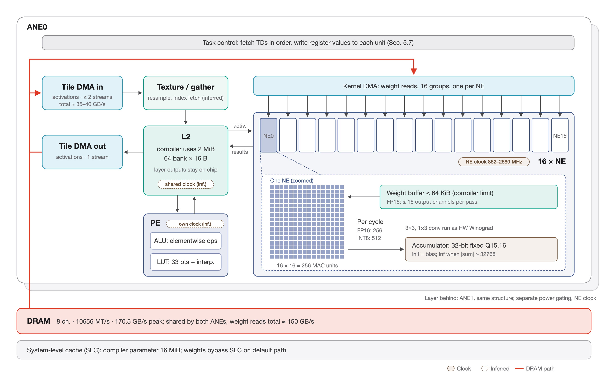

*Figure 4-1. Hardware structure of the M6 ANE. ANE0 is drawn in expanded form, and ANE1, shown behind it, has the same structure. The lower part shows the DRAM and system-level cache shared by the two ANEs. Red lines denote the DRAM read and write paths; orange labels mark clock domains, and dashed labels indicate speculation. The 16×16 grid in the enlarged box only illustrates 256 FP16 multiply-accumulate operations per NE per cycle and does not represent the physical arrangement of the multiply-accumulate units. Purple denotes computation, blue denotes on-chip storage, green denotes data movement, and red denotes off-chip storage.*

In terms of computation, the 16 NEs form a multiply-accumulate array, and each NE completes 256 FP16 multiply-accumulate operations or 512 INT8 multiply-accumulate operations per cycle. The compiler sets a resident-weight limit of 64 KiB per NE. In FP16 mode, each NE computes at most 16 output channels per pass, so the 16 NEs compute at most 256 per pass. When the number of output channels increases from 256 to 272, an additional pass is required, and the latency shows a clear step (Section 7.3.2). Elementwise operations are performed by the separate PE. In the programs tested in this report, no overlap was observed between PE operations and multiply-accumulate operations when they belonged to different TDs (Chapter 6). The activation function is implemented by a 33-point lookup table with linear interpolation. The accumulator of the FP16 path is in fact a 32-bit fixed-point number (Q15.16), and the accumulator of the INT8 path is a 32-bit integer. This determines several numerical behaviors of the ANE. For example, the accumulation becomes infinite once its absolute value reaches 32768 (Chapter 8).

In terms of data movement, the Tile DMA moves activations. Each TD has at most two input paths and one output path, and the two input paths share a bandwidth of about 35–40 GB/s. The Kernel DMA moves weights; each NE has its own set, and the weight-read bandwidth is about 150 GB/s. Intermediate results between layers are stored in the L2 of each ANE, which the compiler uses as 2 MiB. The L2 is divided into 64 banks, and the compiler pads the row stride of tensors to avoid bank conflicts. Below the L2 are the system-level cache (SLC) and an 8-channel DRAM. On the default Core ML path, weight reads do not use the SLC (Section 9.3.3).

In terms of dual-engine cooperation, the compiler generates both a single-ANE (nonbonded) and a dual-ANE (bonded) program for each model. A cost model decides whether to split subgraphs across the two ANEs, and the split is either spatial (by rows, or by columns when the height is 1) or by output channels. When executing on two ANEs, the two ANEs of a row split each read a complete copy of the weights, whereas in an output-channel split each reads half of them, and the two share the DRAM bandwidth. As a result, compute-bound networks obtain a speedup of about 1.92×, whereas weight-read-bound networks gain little: about 1.4× for convolution chains with different weights in each layer, and no speedup with row splitting (Chapter 10).

In terms of clocks and power, the NE clock of each ANE has 32 states, with an effective working range of 852–2580 MHz, and the state is selected by the CLPC. The PE clock is scheduled independently of the NE clock. The CLPC contains a further "shared cluster" that is shared by the two ANEs, and we speculate that the PE and L2 are located in it. The absolute frequency of this clock cannot be read. It is known to ramp up slowly and to be pulled down when the GPU is busy. The SoC fabric has five frequency states (Chapter 11). At full load, the power of a single ANE is 6.2 W and that of the dual-ANE configuration is 10.8 W. At idle, the power is 0 (Chapter 13).

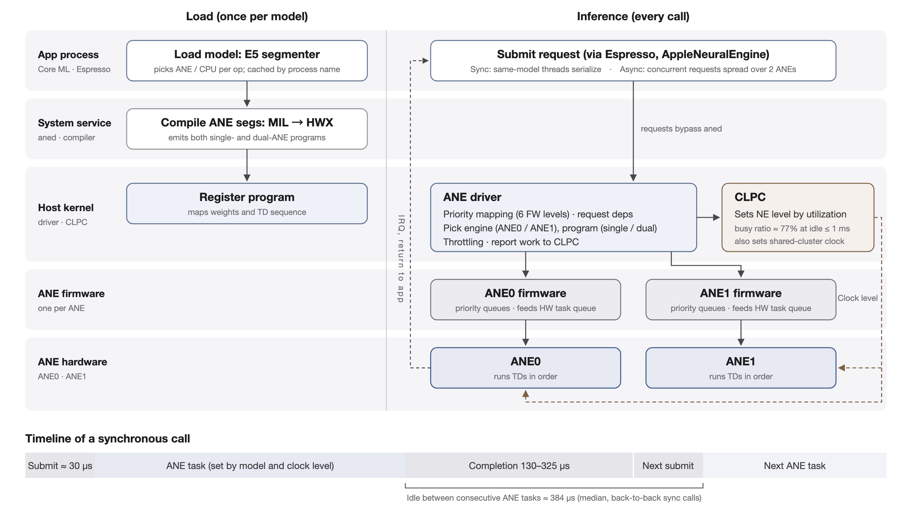

*Figure 4-2. From software invocation to hardware execution. The left side shows the loading path, which occurs once per model; within it, the E5 segmenter of Espresso first decides which operations are assigned to the ANE. The right side shows the execution path of each inference. Below, the time composition of a synchronous call is shown: the idle period of about 384 µs between two adjacent ANE tasks includes the completion-side overhead and the submission overhead of the next call.*

On the control path (Figure 4-2), a model first passes through Espresso, the Core ML runtime framework. At load time, the E5 module of Espresso uses the segmenter to select an ANE or CPU backend for each operation, and only the ANE segments are handed to the compiler service of the daemon aned for compilation. The compilation results are cached by process name (Section 5.9). At inference time, requests are submitted through Espresso and the AppleNeuralEngine framework to the kernel driver. According to the observation of maderix [4] on the M4, they do not pass through aned (Section 6.2). The ANE compiler translates each layer of the network into one or more TDs. Each TD is a sequence of register writes with a header, and the program of each ANE is a TD sequence whose order is scheduled by the compiler (Chapter 5). In the programs tested in this report, no overlap was observed between mutually independent TDs either (Chapter 6).

After an inference request reaches the kernel driver, the driver maps the priority of the request, selects which ANE to use and whether to use a single-ANE or dual-ANE program, and throttles the request when necessary. The request is then passed to the firmware in the ANE. The firmware queues requests in six priority levels and places tasks into the hardware task queues, each of which has two slots. Based on firmware strings, we infer that a high-priority task can preempt a low-priority task that is executing. The hardware fetches TDs from the queue, decodes them, and writes the register values into the configuration of each functional unit. Each call has a fixed host-side overhead: submission takes about 30 µs, and completion notification takes about 130–325 µs. Under the synchronous call mode, the ANE is idle for about 384 µs between two consecutive calls (Chapter 6). The CLPC, which determines the ANE's DVFS state, is not inside the ANE but in the host kernel (Chapter 12).

### 4.6 Comparison with the M4

Table 4-5 compares the ANEs of the M4 and the M6. The data in the M4 column are taken from maderix [4] and from this report's control experiments on the M4.

*Table 4-5. Comparison of the ANE on the M4 and the M6*

| Item | M4 | M6 |
| --- | --- | --- |
| Architecture | h16g (Mach-O subtype 7) | h18g (Mach-O subtype 11) |
| Number of engines | 1 | 2, on the same die |
| NEs per engine | 16 (Apple's count); maderix counts 8 compute groups | 16 (consistent across ioreg, the parameter table, and the weight split) |
| Compiled artifacts | One program set | Single-ANE and dual-ANE program sets |
| TD layout version | v17 | v24 |
| NE frequency table (compiler) | 26 states, top 2364 MHz | 32 states, top 2508 MHz (actual hardware top 2580 MHz) |
| DRAM | 8 channels, about 7467 MT/s | 8 channels, about 10656 MT/s |
| FP16 throughput | About 18.5 TFLOPS (48 layers, 1024 channels, 64×64, including call overhead) [4] | Comparable basis (512 channels, 32×32), 48 layers: 25.6 TFLOPS (Table 7-12); slope method: 20.6 TFLOPS for one ANE and 39.5 TFLOPS for two ANEs |

The largest change in the M6 relative to the M4 is the addition of a complete second engine, and the resulting compilation scheme of "one model, two programs." The remaining aspects, including the TD mechanism, 16 NEs per engine, and the fixed-point accumulator, are inherited from the M4. We repeated the basic numerical tests of the FP16 multiply-accumulate path from Chapter 8 on the M4, and the results were the same as on the M6. A complete comparison across product generations is given in Chapter 15.

### 4.7 Summary

The ANE of the M6 consists of two engines with identical structure, each with its own power gating. Each engine contains 16 NEs. The two sit on the same die and share one address translation unit. The compiler describes this platform with the `2026BaseLine` parameter set, and its NE frequency table is inconsistent with the actual hardware frequency table in the top eight states.

This chapter gives only an outline of the structure. Two points recur in later chapters and merit noting at the outset. First, two engines do not mean twice the speed. Whether a single request can use the second engine is decided by the compiler (Chapter 5), how multiple requests are distributed is decided by the driver (Chapter 6), and the actual speedup obtained depends on whether the workload is limited by resources shared by the two engines (Chapter 10). Second, the running speed of the ANE depends to a large extent on the host side. The DVFS state is selected by the CLPC in the host kernel, and the more sparsely the host submits requests, the lower the state to which the ANE is assigned (Chapter 12). All measurements in this report were performed on one M6 with 16 GB of memory and one macOS version. Under other memory configurations or system versions, the DRAM states and compiler policies may differ. The usage recommendations derived from these structural characteristics are given in Section 15.2.

## 5. Compiler and Program Format

This chapter follows the order in which a model is compiled. First, the Core ML segmenter decides which operations are assigned to the ANE. Next, the ANE compiler translates these operations into programs that can execute on the hardware, including the split of work between the two engines. Last, the chapter examines the cost of compilation. We read the analysis files written by the segmenter, and we obtain the compiled artifacts for each compilation target by compiling without executing. We determine the format of the programs by comparing the artifacts byte for byte and by disassembling the compiler. The main conclusions of this chapter are four. First, each ANE segment incurs a fixed cost of 0.25–0.375 ms, so small models and small segments are placed on the CPU by the segmenter, and int32 operations, some mathematical functions, and sequence-type operations cannot be placed on the ANE. Second, each compiled artifact contains both a single-ANE program and a dual-ANE program. Each program consists of a sequence of task descriptors, and each task descriptor is a series of register-write packets that contain no instructions or branches. Third, whether a subgraph is split across the two ANEs is determined by a latency model that assumes the two engines do not interfere with each other and does not account for tiles of unequal size; the splitting rule leaves the two engines with unequal workloads for some models. Fourth, the step that generates dual-ANE programs makes compilation time grow superlinearly with the number of elementwise layers. On the 1×1 convolution chains we measured, it causes the compiler to crash from 387 layers onward, and it makes the disk footprint of large models proportional to the number of layers.

### 5.1 Method

In this chapter, this report calls the compilation interface `ANECCompile` directly ([anecc.m](../tools/common/anecc.m)), supplying an MIL file, a target name, and compilation options, to generate compiled artifacts in HWX format and analyze them. This interface only compiles and does not access the hardware. It therefore allows the same model to be compiled into five targets, h16g (M4), h17s (H17 generation), h18, h18g (M6), and h19 (A20), and the resulting artifacts to be compared byte for byte. The name h17s is not the compilation target actually used by the M5. On a MacBook Air equipped with the M5, the compilation target read from the device properties of the ANE driver service in the IORegistry is h17, and the measured target on the A18 Pro (iPhone 16 Pro) is also h17 〔ioreg〕, whereas Bryngelson [5] labels M5 as H17s. This report selects h17s only to represent the compiler parameters of the H17 generation. Accordingly, the results for h17s in this chapter (Tables 5-4 and 5-17) and in Section 7.4.1 cannot be taken directly as the behavior of the M5, and this report has not systematically compared h17 and h17s. The compilation options are passed as a dictionary. They include several switches that control dual-ANE behavior, such as `EnableForcedMaximalBondedSplit` and `ForceAllToANE0OnBondedProcedure`, which this chapter uses to construct controlled experiments.

All models in this chapter are executed through Core ML, and no modified HWX is loaded or executed. This constraint distinguishes the method of this report from that of maderix [4]. maderix modified fields in the HWX and executed the result on the hardware, confirming the meaning of each field from changes in output and latency. This report can only observe which words of an artifact change when one property of the model is altered, and it combines these observations with the compiler's disassembly to infer the meanings of the fields. The disassembly of the compiler was obtained as follows. On the M6, we loaded the ANECompiler framework into our own process, located the unexported functions through the symbol table, exported their machine code, and disassembled it with system tools (tools: [syms.c](../tools/re/syms.c), [fnbytes.c](../tools/re/fnbytes.c), [xref.c](../tools/re/xref.c)). Consequently, the conclusions in this chapter about field meanings are labeled 〔HWX〕 or 〔compiler〕, and none has been directly verified through execution.

The baseline model used in this chapter is a three-layer, 64-channel 1×1 convolutional network. Each convolution is followed by relu as the activation function. The input tensor has shape [1, 64, 64, 64] and data type FP16 (MIL source: [model.mil](../data/03_compile/hwx/model.mil); generation script: [mk.py](../data/03_compile/hwx/mk.py)). The compiled artifacts for each target are stored in [data/03_compile/hwx/](../data/03_compile/hwx/), and the parser is [hwx_parse.py](../tools/lib/hwx_parse.py). Several specially constructed models are used in the remaining sections of this chapter; each is described where it is used.

### 5.2 Operator Dispatch in Core ML

When a model is loaded through Core ML, the runtime framework Espresso is responsible for assigning the complete operators. Within Espresso, the compilation and execution module E5 first uses a segmenter to choose a backend for each operation: the ANE, BNNS (the CPU neural network implementation in the Accelerate framework), or the classical CPU implementation. It then partitions the graph into several segments, and only the segments assigned to the ANE are passed to the ANE compiler. This step determines the extent to which a model actually uses the ANE, and it also determines which operations never enter the compilation path described below.

For each operation under test, we generated two models: one containing only that operation, and another in which the operation is preceded and followed by two layers of 3×3 convolution or linear layers. A separate set of boundary-scan models was also generated. Each model was loaded once in an independent cache directory, and we read the analysis file `analytics.mil` that the segmenter writes to the E5 cache. This file records, for each operation, the available backends, the estimated latency of each backend, and the selected backend. It agrees operation by operation with the preferred device reported by the public interface `MLComputePlan`, with no discrepancies. Apart from a few models that could not be parsed or were folded, analysis files were obtained for 482 models (tools: [opdispatch_gen.py](../tools/03_compile/opdispatch_gen.py), [opd_all.sh](../tools/03_compile/opd_all.sh), [opd_ana.sh](../tools/03_compile/opd_ana.sh), [computeplan.swift](../tools/common/computeplan.swift); data: [opdispatch/](../data/03_compile/opdispatch/)) 〔compiler〕. These experiments were performed on the M4 (Mac16,12) through Core ML, and their applicability to the M6 is discussed at the end of this section.

The segmenter's decisions can be reproduced with a very simple model. Each operation takes the estimated latency that the segmenter itself gives for each backend. A single ANE segment adds a fixed startup cost of 0.125 ms; when two adjacent segments use different backends, a switching cost of 0.125 ms is added; and when the output of the graph lies on the ANE, a further 0.125 ms is added. Under this model, the segmentation with the lowest cost is computed and then compared with the actual selection. If the BNNS and classical CPU implementations are merged into a single CPU class, and only whether each operation lies on the ANE or on the CPU is compared, 440 of the 482 models agree exactly with the actual selection, 41 are ties of equal cost, and only 1 disagrees. If the three backends are distinguished, only 261 models agree completely, the number of ties rises to 220, and the number of disagreements remains 1. The additional 179 ties all involve a choice between the two CPU backends, where the actual selection differs from the model even though the computed cost is the same (tool: [opdispatch_fit.py](../tools/03_compile/opdispatch_fit.py)) 〔compiler〕. Therefore, this model reproduces the dispatch of operations between the ANE and the CPU, not the choice between the two CPU backends. In addition, the model treats the operations in the analysis file, in the order of their appearance, as a single chain and computes the shortest path; for graphs with multiple inputs or branches, this is only an approximation 〔inferred〕. The startup and switching constants are recorded in the function header of the analysis file, and they are 2⁻³ ms in all models. The graph-output term has no corresponding field in the function header; it was added during fitting, and its value equals the switching cost 〔compiler, inferred〕. It follows that an ANE segment at the head or tail of the graph must save at least 0.25 ms of estimated latency relative to the CPU in order to be selected, and an ANE segment in the middle of the graph must save at least 0.375 ms 〔inferred〕. Table 5-1 lists the estimated latencies of several operations.

*Table 5-1. Estimated latency of individual operations from the segmenter (M4, µs)*

| Operation | ANE | CPU (BNNS) |
| --- | --- | --- |
| 3×3 convolution, 64 → 64 channels, 32×32 | 4.67 | 100.06 |
| 1×1 convolution, same | 1.17 | 21.62 |
| Matrix multiplication, 1×128×256 with 256×128 | 2.24 | 11.12 |
| Bilinear upsampling ×2 | 3.31 | 499.64 |
| Concatenation along channels | 2.62 | 22.79 |
| Scaled dot-product attention, 1×8×128×64 | 7.18 | 8.62 |
| softmax, layer_norm (64×32×32) | 3.59 | 4.31 |
| relu | 2.62 | 2.62 |

Compared with these estimates, the fixed cost of 0.25–0.375 ms is considerable, so small models and small segments within networks are almost always placed on the CPU. For example, a single 3×3 convolution with 64 channels at 32×32 saves only about 0.095 ms, so the layer is placed on the CPU. Four such layers save about 0.38 ms, which exceeds 0.25 ms, and only then are they placed on the ANE. When two convolution layers are separated by an operation that can execute only on the CPU, the segmenter must choose between switching twice and placing the whole graph on the CPU; for small networks, the entire graph remains on the CPU 〔compiler, inferred〕. Operations dominated by memory access differ by only about 17% in estimated cost between the two backends, and when they appear alone, they always remain in a CPU segment. Therefore, operations placed on the CPU in a model with context are not all operations that cannot execute on the ANE.

The operations that the ANE does not support fall into four main categories 〔compiler〕. The first category comprises any operation on int32 tensors, including int32 addition, multiplication, and matrix multiplication; type conversions to and from int32; argmax and argsort with int32 output; and the complete index preprocessing required by gather and scatter with dynamic indices. The second category is a subset of mathematical functions: asin, acos, tan, sinh, cosh, atanh, mod, reduce_prod, and cumsum. The third category comprises sequence and structural operations: lstm, gru, rnn, band_part, one_hot, non_zero, range_1d, random_normal, sliding_windows, crop_resize, and slices whose starting index is dynamic. The fourth category consists of size limits, as shown in Table 5-2. These operations offer no ANE option at the segmentation step and are placed on the CPU; the remaining operations are then segmented according to the cost rules described above. The segmenter does not call all 50 layer-validation functions exported by the ANE compiler directly. Espresso imports only 23 of them (convolution, matrix multiplication, pooling, softmax, reduction, gather, topk, and so on). Scaled dot-product attention, layer_norm, elementwise operations, and activation functions have no corresponding imported validation function, yet they can also be placed on the ANE, and their eligibility is determined through a different path, which this report did not trace 〔compiler〕. Common CNN and Transformer operations can be placed on the ANE. These include convolutions (one-dimensional, three-dimensional, grouped, dilated, transposed, and with dynamic weights); matrix multiplication (including batched, broadcast, and dynamic inputs); scaled dot-product attention; layer_norm; instance_norm; softmax; three variants of GELU; topk; gather with static indices; reductions other than reduce_prod; various upsampling and scaling operations; various padding modes; pixel rearrangement; transposition; and concatenation. FP32 inputs are placed on the ANE after a type conversion is inserted 〔compiler〕.

*Table 5-2. Size limits of the ANE (as judged by Core ML on the M4; direct compilation for h16g and h18g agrees with these, but only the 16×16 square kernel remained unconfirmed, because its compilation exceeded 8 GB of memory)*

| Item | Supported | Not supported |
| --- | --- | --- |
| Square kernel K×K | ≤ 16 (16 by the segmenter's judgment only) | 17 |
| Horizontal kernel 1×K | ≤ 15 | 16 |
| Vertical kernel K×1 | ≤ 31 | 32 |
| max_pool kernel K×K | ≤ 8 | 9 |
| Inner dimension of matrix multiplication | ≤ 32768 | 40000 and above |
| Single dimension of a tensor | ≤ 65536 | 65537 |

These limits originate in the ANE compiler itself. We compiled 62 boundary and control models separately to h16g and h18g with `ANECCompile`. Apart from topk, the success or failure of each model is the same for both targets, and the outcomes for h16g agree with Core ML's judgment on the M4. The 16×16 square kernel was aborted on both targets because its compilation exceeded 8 GB of memory, so whether it can be compiled rests only on the segmenter's judgment. The limit of 15 for horizontal kernel width agrees with the result obtained from the configuration word in Section 7.4.1 (tool: [opd_arch.sh](../tools/03_compile/opd_arch.sh); data: [arch_h16g_h18g.tsv](../data/03_compile/opdispatch/arch_h16g_h18g.tsv)) 〔compiler〕. Querying the dispatch itself can also be expensive. When `MLComputePlan` is called for a single 16×16 convolution (64 channels, 32×32), the query triggers a full ANE compilation, which took 212–229 s, and the combined peak memory of the compiler-service processes was about 11.4 GiB. A 13×13 convolution required only 2–23 s 〔timing〕.

topk is the only exception. When a single topk is compiled directly, h16g fails the RCAS validation, whereas h18g compiles successfully; this is consistent with the observation in Section 5.7.8 that RCAS fields appear only in topk 〔compiler〕. Core ML on the M4 nevertheless still places topk in an ANE segment. In a model with four 256-channel 3×3 convolution layers before and after the topk, the segmenter places the entire graph in a single ANE segment, and topk makes the call take 6.0 ms longer than a control of the same shape (along width, k = 4) and 10.1 ms longer (along channels, k = 256). The segmenter's estimates for these operations were only 0.03 and 0.06 ms, underestimating them by a factor of about 170–200. As a result, placing the whole graph on the ANE is slower than using the CPU alone (8.00 vs. 6.23 ms, and 12.59 vs. 11.08 ms) (tools: [topk_ctx.py](../tools/03_compile/topk_ctx.py), [predict.swift](../tools/common/predict.swift); data: [topk_timing.txt](../data/03_compile/opdispatch/topk_timing.txt)) 〔timing, inferred〕. These timings were obtained after a single warm-up and use the median of 20 calls. They do not follow the continuous warm-up and interrupt-count reading procedure specified in Section 3.4. Therefore, neither whether all topk operations executed on the ANE nor the source of the additional time has been directly confirmed. This report also did not measure whether topk is equally slow on the M6.

The dispatch conclusions above can be extended to the M6, but this extension rests on the compiler rather than on measurements on the M6. Espresso includes an ahead-of-time (AOT) driver that can target any E5 platform. E5 platform names are written as H16G, H18G, and so on, which correspond to the ANE compilation targets h16g and h18g; H18G is the t8152 of the M6. In a process of our own, we ran this driver in a mode that performs only segmentation and does not invoke the ANE compiler. We processed all 490 models with H16G and with H18G as targets (two nms models could not be parsed and produced no output). A dynamic library captured the per-operation estimates that the segmenter wrote to the system log (Section 3.2; tools: [aotdrv.cpp](../tools/common/aotdrv.cpp), [oslogtap.c](../tools/common/oslogtap.c), [opd_aotcost.sh](../tools/03_compile/opd_aotcost.sh); data: [aotfull/](../data/03_compile/opdispatch/aotfull/), [aotcost/](../data/03_compile/opdispatch/aotcost/)) 〔compiler〕. The per-operation estimates and segmentation results for the two targets are identical byte for byte.

As a control, we compared other platforms on 16 of these models. H13G, H17G, and H19 each have estimates for some operations that differ from those of H16G, mainly for convolution and matrix multiplication. For example, the ANE estimate for the 3×3 convolution in the table above is 6.52 µs on H13G, 4.67 µs on H16G and H18G, 8.77 µs on H17G, and 5.43 µs on H19. This shows that the cost model does distinguish platforms, but H18G reuses the parameters of H16G 〔compiler〕. Of the 6489 nonzero estimates that Core ML produced in actual compilation on the M4, 6483 appear in the output of the AOT driver targeting H16G. The six that do not appear are all estimates for input-side type conversions. This indicates that the AOT driver's results represent actual behavior 〔compiler〕.

On this basis, we infer that Core ML's dispatch on the M6 is the same as on the M4 〔compiler, inferred〕. This inference also implies the premise that the M6 runtime uses the H18G platform, which we have not directly confirmed on the M6. Because the segmenter does not know that the M6 has two engines and a higher clock, it still uses the M4 estimates to decide which operations are placed on the ANE. For M6, this threshold is therefore conservative, and some small segments that would already be cost-effective on the ANE of the M6 are still placed on the CPU 〔inferred〕.

### 5.3 The ANE Compiler Pipeline

In the compilation pipeline, the compiler service spawned by the daemon aned is responsible for passing the segments that the segmenter assigns to the ANE to the ANE compiler. The remaining sections of this chapter study precisely this step: into what the compiler translates the program it receives, and which additional steps and costs the dual-engine chip introduces. Experiments of this kind bypass segmentation and call the compilation interface directly (Section 5.1), so that the programs handed to the ANE compiler can be controlled.

The ANE compiler takes MIL (Model Intermediate Language), the intermediate representation of Core ML, as its input. A MIL program is a typed static single-assignment form, declared with `program(1.3)` and `func main<ios18>`, and its tensors use the NCHW layout. The compiler first uses a set of validation functions to check whether each operation can be mapped to a hardware layer of the ANE. On the M6, the compiler exports 50 such functions (`_ANECValidate*Layer`), covering convolution, matrix multiplication, elementwise operations, reductions, softmax, layer normalization, scaled dot-product attention (SDPA), gather, sorting, Top-K, and various shape transformations. There are 33 activation function types (`ZinIrNeuronType`), including several variants of relu, as well as sigmoid, tanh, gelu, swish, exp, log2, sin, cos, rsqrt, and others (list: [compiler_layers_neurons_m6.txt](../data/03_compile/compiler_layers_neurons_m6.txt)) 〔compiler〕.

After validation, the compiler fuses adjacent operations into hardware layers (for example, fusing a convolution, a bias addition, and a relu into one layer). It legalizes and tiles the layers subject to the capacity limits in the hardware parameter table, allocates L2 and DRAM space for tensors, generates the TD sequence, and finally packs everything into an HWX file. For the h18g target, after tiling, the compiler performs a set of steps specific to dual-ANE compilation: identification of subgraphs that can be split (`BondedSplitSubgraphIdentification`), search for parallel branches (`ZinMirFindInherentParallelism`), estimation of split latency (`LatencyInfo::ComputeSplitLatencyBonded`), and code generation for dual-engine asynchronous groups (`CodegenAsyncGroupsForBonded`). The roles and costs of these steps are discussed in Sections 5.8 and 5.9 〔compiler〕.

The `LC_IDENT` load command of an HWX file records the compiler version and the compilation options actually used. The compiler version used in this report is `zin_ane_compiler v10.26.6`. For compilation to h18g, the recorded options include `-t h18g`, `--fno-fold-scale=true`, `--fdram-allocator=ffreuse`, and `--fdram-tensor-priority=sizebyliverange`. When a model is loaded through Core ML, the kernel log also shows options such as `--ne-frequency=-1.000000` and `--pstate-soc=-1`, where −1 indicates that the compiler adopts the architecture's default value 〔HWX, kernel〕.

### 5.4 Compilation Targets and the Hardware Parameter Table

Each compilation target in the compiler corresponds to a target class (for example, `TargetH18g`). When it is constructed, the target class selects one hardware parameter table (the HAL parameter table described in Section 3.5) and one set of SoC parameters. The HAL parameter table is a static constant table for each ANE generation, 0xa10 bytes in size, and it records capacity limits, alignment requirements, feature switches, and performance-model constants. We exported these tables from each generation by calling its `GetParams()` function within a process. By disassembly, we traced the reads of the table in 3233 functions that take the table as a parameter, and we found readers for 293 offsets (tools: [dump2.c](../tools/re/dump2.c), [hal_readers.py](../tools/re/hal_readers.py)). Because the parameter tables and the disassembly are derived from Apple binaries, the raw exports are not distributed with the repository. Readers can regenerate them on their own machines with the tools above 〔HAL〕.

The layout of the parameter table in this version of the compiler differs from the layout described by Bryngelson [5]. The compiler has inserted new fields into the table, so the offsets given in that work must be shifted by amounts ranging from 0x8 to 0xb8, depending on the section. Table 5-3 lists the fields relevant to later chapters, with the offsets given in that work for comparison.

*Table 5-3. Fields of the HAL parameter table relevant to this report (the 2026BaseLine table used by h18g)*

| Offset in this version | Offset in [5] | Value | Main readers | Meaning |
| --- | --- | --- | --- | --- |
| 0x008 | — | 11 | — | HWX CPU subtype; determines the TD layout version |
| 0x00c | — | 16 | `DetermineNumNesToUse` | NEs per ANE |
| 0x014 | 0x0c | 8 | `ComputeMaxOcgSize`, `HasAccDoubleBuffering` | Accumulator depth per NE |
| 0x1d8 | 0x1b8 | 2 MiB | `HandleL2Config`, `LowerNEMatMulToNEConv` | On-chip residency limit for a single operand |
| 0x1e0 | 0x1c0 | 16 | `GetL2Alignment` | DRAM and L2 access alignment (bytes) |
| 0x1e8 | 0x1c8 | 64 | `ZinMirBankConflictOptimizer` | Number of L2 banks |
| 0x210 | 0x1f0 | 256 KiB | — | L2 residency threshold |
| 0x220 | 0x200 | 64 KiB | `GetKernelTensorBatchSplitFactor`, and others | Resident-weight limit per NE |
| 0x230 | 0x210 | 16 MiB | `OptimizeCoutBatchtoFitInKBuf` | Limit for streamed weight reads |
| 0x2a0 | — | 64 | `PERasterization::GetWorkunitSize` | PE work unit |
| 0x330 | — | 16 | `SetChainBufferNEWorkUnit` | NE work unit |

We compared the parameter tables of each generation and found that the tables of the variants within the same generation (for example, H16, H16g, H16s, and H16c) are numerically identical byte for byte, differing only in the name pointer in the table header and in the addresses of several vectors. Therefore, in this version of the compiler, the information that distinguishes variants of the same generation (such as the number of NEs and the number of engines) is no longer in this table. Whether dual-ANE programs are generated is controlled by compilation options (such as `EnableBondedNetworks`), not by variants recorded in the parameter table, which provides only capability switches. For example, dual-ANE splitting requires the bit at offset 0x73c to be set (Section 5.8.3) 〔HAL, compiler〕.

From H17 (the M5 generation) to H18, the values in the parameter table related to the size of the multiply-accumulate array, L2 capacity, and bandwidth remain unchanged. The changes are concentrated in execution modes and data formats (for other switches, such as dual Int8 mode, see Section 15.3). First, the partitioning of work units is more flexible: a half-work-unit mode is added (offset 0x55c, read by `CanUseHalfWorkUnitMode`), and the non-power-of-two work-unit candidate values 16 and 20 are added (offsets 0x5a0 and 0x5a8). Second, more data formats are supported: the number of natively supported weight formats increases from 13 to 21 (vector at offset 0x8a0); 3-bit palettized weights no longer need to be promoted to 4 bits; and new data-format switches for inputs, outputs, and weights are added (offsets 0x5ff and 0x600) 〔HAL〕. Vector palettization with vectors of length at most 4 (offsets 0x72f and 0x730) had already appeared in the H17 generation 〔HAL〕.

We compared the three tables 2026BaseLine, H18, and H19 byte by byte. 2026BaseLine and H19 are identical except for the name pointer in the table header and the addresses of the vectors, and the contents of each vector are also identical. In contrast, 2026BaseLine differs from H18, the single-engine target of the previous generation (subtype 10, TD v20), in several fields. The two do not belong to the same generation, so this difference does not contradict the rule above that variants of the same generation are byte-identical. Examples include the multi-palette mode (offsets 0x5c7 and 0x5c8), the double-rate mode (offset 0x5f7), the FIFO buffer size (offset 0x888), and the dimension limits for gather and texture operations (offsets 0x1a8–0x1b8). These fields are enabled or relaxed in 2026BaseLine and H19 but not in H18 〔HAL〕. In other words, from the compiler's perspective, the hardware parameters of the M6 are those of H19. The only difference between the two in the compiler lies in the SoC parameters (frequency table, number of DRAM channels, and so on; Section 4.4). This agrees with the finding in Section 5.7.7 that h18g and h19 use the same TD layout (v24) and nearly identical instruction streams.

### 5.5 The HWX Format and the Two Programs

HWX is a file in Mach-O format. Table 5-4 compares the compiled artifacts of the baseline model on the five targets (data: [data/03_compile/hwx/](../data/03_compile/hwx/)) 〔HWX〕.

*Table 5-4. Artifact formats for the five compilation targets*

| Target | CPU subtype | File size | Load commands | Format | Dual-ANE program |
| --- | --- | --- | --- | --- | --- |
| h16g (M4) | 7 | 96 KB | 14 | Legacy format | No |
| h17s (H17 generation) | 9 | 96 KB | 14 | Legacy format | No |
| h18 | 10 | 96 KB | 14 | Legacy format | No |
| h18g (M6) | 11 | 128 KB | 8 | New format, with a `__RUNTIME` segment | Yes |
| h19 | 11 | 128 KB | 8 | New format, with a `__RUNTIME` segment | Yes |

The HWX of the M4 adopts the legacy format described by maderix [4]: the `__TEXT` segment stores a single TD sequence, the `__KERN_0` segment stores the weights, and two `__FVMLIB` segments describe the inputs and outputs. The HWX of the M6 adopts the new format, which adds a `__RUNTIME` segment, and its `__TEXT` segment contains three TD sequences, as shown in Table 5-5.

*Table 5-5. Segment layout of the h18g compiled artifact (baseline model)*

| Segment | Virtual address | Contents |
| --- | --- | --- |
| `__RUNTIME` | 0x30000000 | Runtime operation graph (RTGraph), 0x102c bytes |
| `__TEXT` | 0x30004000 | Single-ANE program: uses only ANE0 |
|  | 0x30008000 | Portion of the dual-ANE program executed by ANE0 |
|  | 0x3000c000 | Portion of the dual-ANE program executed by ANE1 |
| `__TEXT,__const` | — | Constants |
| `__KERN_0` | 0x30014000 | Weights, 0x6c00 bytes; shared by both programs and both ANEs |
| `LC_IDENT` | — | Compiler version and compilation options |
| `LC_NOTE` | — | Source model information (`src model info`) and runtime version (`rt.version`) |
| `LC_SYMTAB` | — | 111 symbols |

The `__RUNTIME` segment describes the operations that the runtime must perform when executing each program, and its contents can be read directly from the symbol names. The `main__nonbonded` procedure maps the weights, maps the inputs and outputs, and maps the TD sequence of ANE0, and then starts ANE0 once through `rt_op_ane_kick_…_ane_0`. The `main__bonded` procedure maps the same weights to ANE0 and ANE1 separately, then maps the inputs, outputs, and TD sequences of each, and finally starts the two ANEs once each, through `rt_op_ane_kick_…_ane_1` and `rt_op_ane_kick_…_ane_0`. The `main` procedure is the entry point of the entire compiled program 〔HWX〕.

Among the five compilation targets, only the artifacts of h18g and h19 adopt this new format, and the two belong to the same generation, whose ArchCompareValue is 10 (subtype 11, TD v24). h18 belongs to the previous generation, and its artifacts remain in the legacy format and contain no dual-ANE program 〔HWX, compiler〕. Therefore, in the compiler, the "two programs" appear together with this ANE generation, and h19 also generates dual-ANE programs. The compiled artifacts alone cannot determine whether two engines are unique to the M6; how many engines the A20 actually has must be confirmed on the device 〔HWX, inferred〕.

It should be noted that the choice of which program to execute occurs at runtime, whereas the way each segment of a dual-ANE program is split (across both ANEs or kept entirely on ANE0) is already determined at compile time. If the compiler decides not to split, the dual-ANE program contains no TD sequence for ANE1, and even if the runtime selects the dual-ANE program, the request uses only ANE0. The interrupt counts in Section 6.3.2 indicate that, as long as the dual-ANE program contains a TD sequence for ANE1, Core ML selects the dual-ANE program for execution.

### 5.6 Weight Splitting

In the artifact of the baseline model, the weights of each layer are split into 16 blocks in the `__KERN_0` segment. The symbol names are `K<sha256>_ne_0` through `K<sha256>_ne_15`, and each block is 0x240 (576) bytes. This size can be derived from the shape of the layer. The 64 output channels are divided evenly among the 16 NEs, so each NE is responsible for 4 output channels. Four output channels × 64 input channels × 2 bytes equals 512 bytes; adding the bias and aligning to 64 bytes gives 576 bytes. Each TD also contains 16 consecutive configuration words (for example, `00000021` and `00010021`), whose number equals the number of NEs. We speculate that these are the weight-DMA configurations of the individual NEs 〔inferred〕. These facts indicate that the hardware distributes the computation of a layer over 16 NEs by output channel, which is consistent with the `NumANECores = 16` entry in ioreg 〔HWX〕.

When the weights required by each NE exceed 64 KiB, the compiler has two ways of handling them. When the input is large, the compiler splits the layer into multiple TDs by output channel, so that the weights per NE in each TD do not exceed 64 KiB; the number of TDs per layer is approximately ⌈weights per NE ÷ 64 KiB⌉. We examined artifacts for several convolution kernel shapes on a 16×32 input (256 channels), and most agree with this relation. For example, a 3×3 convolution requires about 72 KiB of weights per NE and has 2 TDs per layer; a 5×5 convolution requires about 200 KiB and has 4 TDs per layer; and a 1×9 convolution after rewriting (Section 7.4.1) requires about 154 KiB and has 3 TDs per layer, whose output channels are 64, 96, and 96. A 1×9 convolution on a 32×32 input likewise has 3 TDs per layer. There are also exceptions. A 7×7 convolution requires about 392 KiB, which by the formula above would give 7 TDs, but there are actually 8; a rewritten 1×15 convolution requires about 256 KiB, which should give 4 TDs, but there are actually 6 (Table 7-6) 〔HWX〕. We speculate that this is because the compiler splits by whole groups of output channels, so that each TD often does not fully use 64 KiB 〔inferred〕.

When the input is small, the compiler can also place all output channels in a single TD and read the weights in a streaming manner during execution. We observed both cases among the artifacts of 288 shapes (data: [bsdecide.txt](../data/08_bonded/bsdecide.txt)). On a 4×32 input, all convolution kernels, including 3×3, 5×5, and 15×1, have only one TD per layer, although most of them require more than 64 KiB of weights per NE. On an 8×32 input, natively executed kernels still conform to the rule above (3×3 and 9×1 have 2 TDs, and 5×5 has 4 TDs), whereas rewritten 1×9 to 1×15 convolutions have only one TD per layer 〔HWX〕. The choice the compiler makes between these two methods has not been determined in this report. Section 7.4.2 shows that, under both methods, these layers re-read the weights in every layer, and in both cases the latency is determined by the weight-reading stages.

The 64 KiB boundary agrees with the value of the resident-weight limit at offset 0x220 in the HAL parameter table (64 KiB), and it also agrees with the result obtained from output-channel grouping in Chapter 7. On this basis, we can determine that the compiler uses a weight buffer of 64 KiB per NE. Whether the physical capacity is larger cannot be read directly in this report 〔HWX, HAL, inferred〕. This capacity determines that the output-channel grouping for large convolution kernels shrinks as the number of input channels decreases (Section 7.3.1). By contrast, the step in output channel count from 256 to 272 in Section 7.3.2 results from the limit of at most 256 output channels per round across the 16 NEs, and it is unrelated to weight capacity.

Figure 5-1 summarizes the two splitting methods described in this section. The weights of a layer are divided evenly by output channel among 16 NEs. When each NE's weights exceed 64 KiB, a layer with a large input is further split into multiple TDs by output channel.

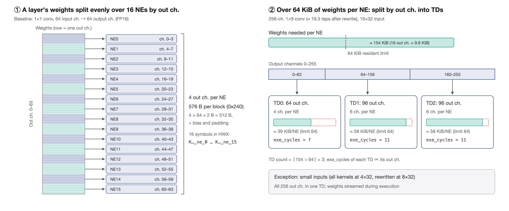

*Figure 5-1. Weight splitting. Left: the weights of the baseline model (1×1 convolution, 64 → 64 channels) are divided evenly by output channel among 16 NEs, with one 576-byte block per NE. Right: a 1×9 convolution with 256 channels on a 16×32 input requires about 154 KiB of weights per NE after rewriting, and it is split by output channel into three TDs with 64, 96, and 96 channels. When the input is small (all convolution kernels on a 4×32 input, and the rewritten kernels on an 8×32 input), all output channels are placed in a single TD.*

### 5.7 Format of the Task Descriptor

maderix [1] observed that the compiled artifacts store configuration parameters rather than instructions. The analysis in this report further shows that a TD is in effect a sequence of register-write packets. Each TD sequence begins with a sequence header of four words (values 1, 0, 0, 0). Each TD begins with a 12-word task header, followed by several write packets, each consisting of a packet header and data, and ends with several address packets. Figure 5-2 illustrates this structure. The following subsections discuss, in order, the task header, the encoding of write packets, the grouping of registers, the convolution configuration word, the opcodes of elementwise operations, address packets, and the layout version.

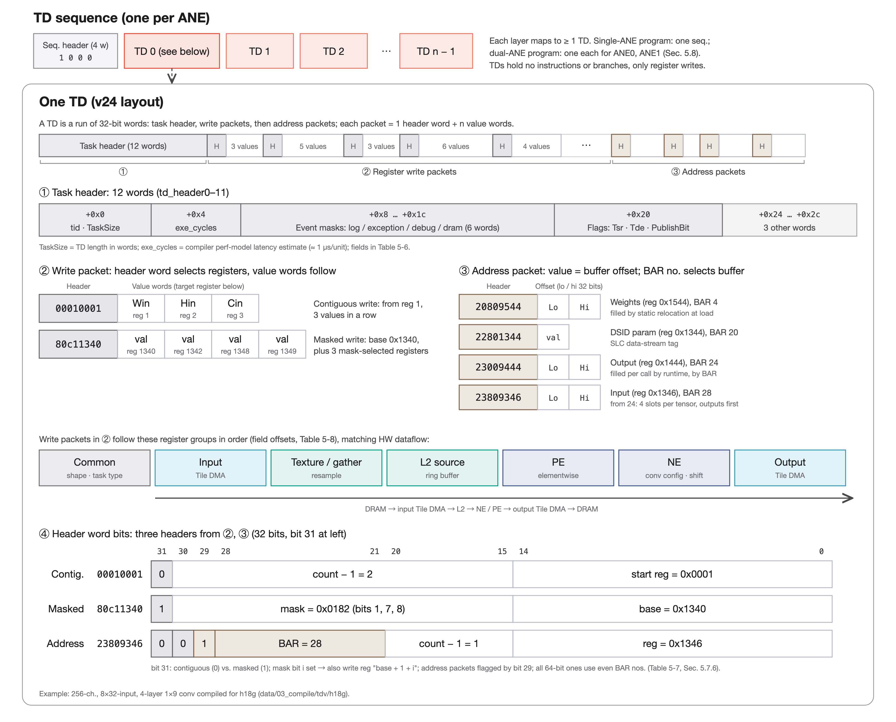

*Figure 5-2. Structure of a TD (v24 layout). At the top is the TD sequence of one ANE. Below it, one TD is expanded: ① the task header, ② the write packets arranged by register group, and ③ the address packets at the end. The register groups of the write packets are arranged in the direction of data flow. ④ gives the bit format of the packet header words, illustrated by three header words from ② and ③. The example is taken from the artifact of a 1×9 convolution with 256 channels, an 8×32 input, and four layers on h18g.*

#### 5.7.1 Task Header

The compiler's assertion strings refer to the 12 words of the task header as `td_header0` through `td_header11`. We disassembled the field-reading function for the v24 layout (`ZinGetRegisterProgramming<24>`) and the functions that write the task header (`HandleTdHeader`, `SetEventFlags`, and others), and we compared them with the actual values in the artifacts. This yielded the field meanings listed in Table 5-6 〔compiler, HWX〕.

*Table 5-6. TD task header (v24)*

| Offset | Field | Writer | Observed values and notes |
| --- | --- | --- | --- |
| +0x0 | `tid` (low 16 bits); `TaskSize` (bits 16–26, in words) | `SetField` | TD number and length. For example, `0x006d0000` denotes TD 0 with a length of 109 words |
| +0x4 | `exe_cycles` (low 16 bits) | `HandleTdHeader` → `CalculateExeCycles` | The compiler's estimate of the layer's latency, in units of about 1 µs, with an upper limit of 0xffff; 0 for layers whose input is read in a chain from L2 |
| +0x8 | `log_events` | `SetEventFlags` | 0x68 for the first TD, 0x04000000 for the last TD, and 0 for the others |
| +0xc | `exception` | — | 0 |
| +0x10 | `debug_log_events` | `SetEventFlags` | 0x00fff800; the low bits of the first and last TDs are additionally set |
| +0x14 | `debug_exception` | — | 0 |
| +0x18 | `dram_log_events` | `SetEventFlags` | 0 |
| +0x1c | `dram_log_events` (second word) | `SetField` | Mask for segment changes, such as 0x1ff and 0x1ff0 |
| +0x20 | Flag word | `SetLdtid`, `SetPublishBit`, and others | Bit 0 is `Tsr`, bit 1 is `Tde`, bit 3 is set only in the last TD, bit 4 enables performance tracing, bit 5 is `Xtde`, and bit 6 is `PublishBit`; bits 16–18 are 5 in convolution TDs and 0 in elementwise TDs |

Two fields are analyzed further in later sections. The first is the `exe_cycles` field, which is written by the function `CalculateExeCycles` in units of about 1 µs. For example, the values for the three TDs of a 1×9 convolution with 256 channels on a 16×32 input are 7, 11, and 11, which are proportional to the output channel counts 64, 96, and 96. The value for a 1×1 FP16 convolution TD agrees with the time obtained by converting at 20.6 TFLOPS. For dense layers, `exe_cycles` agrees with the per-TD estimates of the compiler's performance model. For pruned sparse layers, it does not agree, and the algorithm responsible has not been determined in this report (Section 7.8). The second is the three groups of event masks, which determine at which moments during TD execution the firmware records which events. Because the masks of the first and last TDs differ from those of the other TDs, we can obtain the task-start and task-end timestamps of each invocation from kdebug traces. Chapter 6 uses these timestamps to decompose the time of each invocation, and Chapter 11 uses them to infer clock frequency 〔compiler, HWX〕.

#### 5.7.2 Encoding of Write Packets

The content after the task header consists of three kinds of packets, whose encodings are shown in Table 5-7 〔HWX, compiler〕.

*Table 5-7. The three kinds of packets in a TD*

| Type | Encoding | Example |
| --- | --- | --- |
| Contiguous write | Bit 31 is 0; the low 15 bits are the word address of the starting register; bits 15–30 hold the number of writes minus 1; the packet header is followed by the corresponding number of values | `00010001`: writes three values (Win, Hin, Cin) starting at register 1. `000f1559`: writes 31 values starting at register 0x1559, including the weight offsets of 16 NEs |
| Masked write | Bit 31 is 1; the low 15 bits are the base; bits 15–30 hold a 16-bit mask; the packet writes the base register itself and, for each bit i set in the mask, the register "base + 1 + i"; the header is followed by 1 + popcount(mask) values | `80c11340`: base 0x1340, mask 0x182, writes the four registers 0x1340, 0x1342, 0x1348, and 0x1349 |
| Address packet | Same format as a contiguous write, with bit 29 as a marker; bits 21–28 are the BAR number | See Section 5.7.6 |

The word immediately after the input-channel count in a convolution TD is the masked-write packet header. Its value varies with the model. Most convolutions, such as 1×1 and 1×3, have `0x91498005`; 1×8 convolutions and dilated convolutions have `0x93498005`; and 3×3 convolutions in W8A8 mode have `0xb3498005` (samples: [xword_samples.txt](../data/03_compile/xword_samples.txt)). Decoded according to the masked-write format, `0x91498005` denotes base register 5 (Wout) and mask 0x2293, and it writes seven registers in order: Wout, Hout, Cout, the convolution configuration word, TileHeight, the task information word, and register 19. It follows that this word is not a register value; it is a packet header generated during serialization according to which fields must be written. The differences between models can be explained on this basis. In W8A8 mode, one additional register must be written (base + 15, that is, register 20), so the mask gains one more bit, corresponding to bit 29. When the same layer is split into several TDs, register 16 is written in some TDs and omitted in others, so the bit corresponding to bit 25 in the mask varies from TD to TD 〔HWX, compiler〕. The TD parsing tool is [tdpkt.py](../tools/lib/tdpkt.py).

#### 5.7.3 Register Groups and the Pipeline

For each TD layout version, the compiler defines a class `ZinAneTdHw_vN`. Field-reading functions are named `ZinGetRegisterProgramming<N>::GetXxx`, and each function reads one word at a certain offset of the TD object and extracts several bits. We disassembled all of the reading functions and obtained the offset and bit width of each field (summary: [td_field_offsets.txt](../data/03_compile/td_field_offsets.txt)). Arranged by offset, the groups of fields appear in the order shown in Table 5-8 〔compiler〕.

*Table 5-8. Order of the field groups in a TD (by object offset in v31 and v36)*

| Order | Field group | Representative fields |
| --- | --- | --- |
| 1 | Task header | `TaskSize`, `Tsr`, `Tde`, `PublishBit` |
| 2 | Common: shape and task type | Win, Hin, Cin, Din, Wout, Hout, Cout, Dout (17 bits each); `NumGroups`; broadcast and transpose; `CommonTaskType` |
| 3 | Input Tile DMA | Enables for Src1 and Src2, `DoubleRate`, format, interleaving, compression, vertical cropping offset |
| 4 | Texture and gather unit | `TextureMode`; index dimensions for gather; texture source size |
| 5 | L2 source and ring buffer | `Ephemeral` for Src1 and Src2 and the L2 DMA `DoubleRate`; `Ephemeral` for the result; ring-buffer configuration |
| 6 | PE | `PEIndexingEnabled` |
| 7 | NE | `NEAccBiasShift` (starting at bit 11); `NEPostRightShift` (bits 19–23) |
| 8 | Output Tile DMA | Enable, format, interleaving, compression, vertical cropping offset |

This order is consistent with the direction of data flow in the hardware. Data is read from DRAM by the input Tile DMA, enters the NE and PE through L2, and is written back to DRAM by the output Tile DMA. It also agrees with the data flow that Bryngelson [5] derived from the M1 register groups (DRAM → L2 → NE → L2 → PE → DRAM). The NE field group contains an accumulator bias-shift field and a 5-bit output right-shift field, which are the configuration required by fixed-point accumulators: accumulation takes place in a fixed-point format, and the output is right-shifted and converted to FP16. Chapter 8 directly measures the accumulator as a Q15.16 fixed-point format with constructed inputs, which is consistent with these fields. The `DoubleRate` fields of the input Tile DMA and the L2 DMA have existed since v24. The `CanEnableDoubleRateMode` switch in the parameter table (offset 0x5f7) should be the condition for enabling these fields; it is 0 in H18 and 1 in 2026BaseLine, which M6 uses, and in H19. Nevertheless, neither the FP16 nor the INT8 models used in this report triggered double-rate mode 〔compiler, HAL, inferred〕.

#### 5.7.4 Convolution Configuration Word

The geometry of a convolution is encoded together in a 32-bit configuration word (offset 0x2a0 in the compiler's object; register 10). We disassembled the 13 functions that write this word (`ZinAneTd<31>::SetCommonConvCfg*`, and others) and obtained the bit definitions listed in Table 5-9. The parameters of a three-dimensional convolution have a second configuration word (offset 0x2a4), in which Kd occupies bits 0–4, Sz bits 6–7, Pz bits 8–11, and Oz bits 13–14 〔compiler〕.

*Table 5-9. Bit definitions of the convolution configuration word*

| Bits | 0–5 | 6–11 | 12 | 13–14 | 15–16 | 17–21 | 22–26 | 27 | 28–29 | 30–31 |
| --- | --- | ---- | --- | ----- | ----- | ------- | ------ | --- | ----- | ----- |
| Field | Kw | Kh | Reserved | Sx | Sy | PadLeft | PadTop | Reserved | Ox | Oy |

For example, the configuration word of a 1×3 convolution is `0x5002a043`, which decodes to Kw = 3, Kh = 1, Sx = 1, Sy = 1, PadLeft = 1, Ox = 1, and Oy = 1. The configuration word of a 3×3 convolution is `0x5042a0c3`. In all compiled artifacts, bits 12 and 27 are 0, and the functions that write this word do not modify these bits, so they are reserved. Ox and Oy denote the number of output pixels produced per input stride. Field tracing (Section 5.7.8) shows that Ox and Oy are 2 for transposed convolutions and upsampling, which are implemented as an ordinary convolution with interleaved output, writing every other position 〔compiler, HWX〕. Although the kernel-width field has 6 bits, the largest kernel width that the compiler encodes directly with stride 1 is 8. For kernel widths of 9–15, the compiler rewrites the convolution in the form Sx = 2 and Ox = 2, sets the output-width field to half the actual width, and stores the weights as two sets of kernels offset by one position. Section 7.4.1 compares the configuration words and weight volumes for different kernel widths and gives the full justification for this rewriting rule (data: [convcfg_scan.txt](../data/03_compile/convcfg_scan.txt); tool: [convcfg.py](../tools/03_compile/convcfg.py)) 〔compiler, HWX〕.

#### 5.7.5 Opcodes of Elementwise Operations

maderix [4] reports that ALU operations are controlled by an opcode byte, with 256 possible values. To confirm the encoding of opcodes on the M6, we compiled a fused layer consisting of a 1×1 convolution followed by a two-input elementwise operation, using five operations: addition, subtraction, multiplication, maximum, and minimum. The TD sequences of the five artifacts have the same length (0x294 bytes), and they differ in substance only in a single word at offset 0x240 within the sequence, as shown in Table 5-10 〔HWX〕.

*Table 5-10. Encoding of elementwise operations*

| Operation | Value of this word | bits 2–3 | bit 18 |
| --- | --- | --- | --- |
| add | 0x00080000 | 0 | 0 |
| sub | 0x000c0000 | 0 | 1 |
| mul | 0x00080004 | 1 | 0 |
| maximum | 0x00080008 | 2 | 0 |
| minimum | 0x0008000c | 3 | 0 |

Table 5-10 shows that, in this fused layer, the operation type is encoded in a 2-bit field (0 for addition, 1 for multiplication, 2 for maximum, and 3 for minimum), and subtraction is implemented as addition with the second input negated (bit 18). The TD sequence of division (real_div) is longer (0x338 bytes). We speculate that it is split into two steps, a reciprocal (computed with a lookup table and interval reduction) and a multiplication 〔HWX, inferred〕. This experiment covers only this one type of fused layer. Other layer types may use more encodings, so the results of this report do not contradict the 256 opcodes described by maderix.

#### 5.7.6 Address Packets and BARs

Address packets are located at the end of each TD. Each address packet writes an offset within a buffer into a base register, and its BAR number indicates which buffer the offset is relative to. We counted more than 1600 address packets and found that they write only five groups of registers (tool: [hwxreloc.py](../tools/03_compile/hwxreloc.py)). To determine the buffer corresponding to each register group, we constructed a model with two inputs and two outputs: o1 = relu(conv(x) + y), o2 = relu(conv(y)) (generation script: [io2.py](../tools/03_compile/io2.py); artifacts: [l2hwx/io2](../data/03_compile/l2hwx/io2/)). Table 5-11 gives the results of the analysis 〔HWX, compiler〕.

*Table 5-11. Registers written by address packets and their BAR numbers*

| Register | Field name in the compiler | BAR number | Notes |
| --- | --- | --- | --- |
| 0x1544 / 0x1545 | `KernelSrcBaseAddrLo / Hi` | 4 | Weights; the `__TEXT` segment has an 8-byte static relocation entry pointing to `__KERN_0` |
| 0x1346 / 0x1347 | Tile DMA `Src1BaseAddrLo / Hi` | Assigned per tensor | First input; x is 32 in the io2 model |
| 0x134c / 0x134d | Tile DMA `Src2BaseAddrLo / Hi` | Assigned per tensor | Second input; y is 36 in the io2 model |
| 0x1444 / 0x1445 | Tile DMA `DstBaseAddrLo / Hi` | Assigned per tensor | Output; o1 is 24 and o2 is 28 in the io2 model |
| 0x1344, 0x1345, 0x1442 | DSID of Src1, Src2, and Dst | 20 | Data-flow tags of the system-level cache |

From Table 5-11, the BAR numbering rule can be summarized as follows. Slot 4 is for weights, and slot 20 is for DSID parameters. Slots starting from 24 are assigned to the tensors in sequence, outputs first and then inputs, with four slots for each tensor. All 64-bit address packets use even BAR numbers, which is consistent with the assertion string in the compiler, "64-bit relocation, BarIdx must be even". The base address of the weights is determined at load time through static relocation. The base addresses of inputs and outputs have no relocation entries; instead, the runtime fills them in on each invocation according to the BAR number, and mapping entries such as `x` and `o1@output` in the `__RUNTIME` segment describe this correspondence. The values in address packets are offsets within buffers. For example, in a dual-ANE program, the offset carried by the input address packet of ANE1 points to row 32 (Section 5.8.1). In the artifacts of h18 (v20 layout), the same register uses a different BAR number (for example, 28 for weights), which shows that the BAR layout varies across versions 〔HWX〕.

#### 5.7.7 Layout Versions

The register layout of the TD changes with the architecture. We determined the layout version for each target along the following path. The constructor of `ZinAneTd<N>` is inlined into the function `CodegenCreateInstructions<N>`. The sole caller of the latter, `arch_dispatch<CodegenCreateInstructionsDispatcher>`, uses `AneArchEnum − 1` as an index into a 36-entry jump table, in which entry N jumps to `CodegenCreateInstructions<N>`. It follows that the template parameter N is the value of `AneArchEnum`. `AneArchEnum` is in turn obtained from the CPU subtype of the HWX by the function `ZinCpuSubtypeToArchValue` (tools: [adrref.c](../tools/re/adrref.c), [jtab.c](../tools/re/jtab.c), [tblread.c](../tools/re/tblread.c)). Table 5-12 lists the relevant part of the lookup results 〔compiler〕.

*Table 5-12. Correspondence between CPU subtype and TD layout version*

| CPU subtype | Layout version | Compilation target |
| --- | --- | --- |
| 4 | v7 | H13 (M1), T1 |
| 6 | v8 | H15 |
| 7 | v17 | All of H16 (M4 is h16g) |
| 9 | v19 | All of H17 (M5 is h17) |
| 10 | v20 | h18 |
| 11 | v24 | h18g (M6), h19 |
| 12, 14, 16 | v31, v36, v28 | No externally visible target name in this compiler version |
| 17 | v26 | M12 (internal target name in the compiler) |

To verify Table 5-12, we compiled the same model (256-channel 1×9 convolution, 8×32 input, four layers) to all available targets and compared the register addresses written by each target (data: [data/03_compile/tdv/](../data/03_compile/tdv/)). The results show that changes in register layout correspond one-to-one with changes in the version number. v17 and v19, relative to v8, changed the DMA register groups. v20, relative to v19, inserted two registers in the register groups related to L2. v24, relative to v20, inserted one register after the first NE register; the write addresses of the NE group change from 0x1240, 0x1241, and 0x1244 to 0x1240, 0x1242, and 0x1245. The TD sequences of h18g and h19 are almost identical word for word. They total 17948 bytes, and the differences are confined to one field in the task header and one command word at the end of a TD. In addition, the positions and bit definitions of the shape fields, the convolution configuration word, TileHeight, TileOverlap, and the task information word are exactly the same in v19, v20, v24, and v31. Therefore, the decoding results for the v31 functions in Section 5.7.4 also apply to the M6 〔compiler, HWX〕.

Of the four layout versions in Table 5-12 with numbers larger than v24, v26 corresponds to the target named M12 internally by the compiler, which should not be confused with the M-series chips. Its ArchCompareValue is the same as that of v24, so v26 is more likely a variant of the same architecture generation on another product line. v28, v31, and v36 are the architectures newer than the M6, and Section 15.3 discusses the fields they add 〔compiler, inferred〕. The lookup results of this report differ from Bryngelson [5] in two places. First, Bryngelson records the layout of the M1 as v10, whereas the lookup in this report gives v7 for H13 (M1). In this version of the compiler, v10 belongs to target M11, whose ArchCompareValue equals that of v8 for H15. Second, Bryngelson states that the M5 uses the v20 layout, whereas the lookup in this report gives v19 for H17 (the M5 generation) and v20 for h18. Both differences may arise from different compiler versions, because the layout version number is an internal template parameter of the compiler, and different compiler versions may assign different numbers to the same architecture. Without the corresponding compiler version and device, this report does not verify this further. Chapter 15's comparison table uniformly adopts the lookup results of this report and notes the notation used in the literature.

#### 5.7.8 Dynamic Tracing of Fields

By tracing the calls to field functions dynamically, we can further understand how each field is actually read and assigned. On the M4, we compiled a batch of small models for h18g with the same version of the compiler. We used lldb to set breakpoints in the 403 field-setting functions of the TD class `ZinAneTd<24>` for the v24 layout. We recorded the arguments and callers of each call, as well as the changes in register values in the TD object before and after each call (Section 3.2; tools: [tdtrace_gen.py](../tools/03_compile/tdtrace_gen.py), [tdtrace_lldb.py](../tools/03_compile/tdtrace_lldb.py), [tdtrace.sh](../tools/03_compile/tdtrace.sh), [tdtrace_fit.py](../tools/03_compile/tdtrace_fit.py)) 〔compiler〕. The correspondence between register addresses and object offsets was taken from the disassembly of `ZinAneTdHw_v24::GetRegisterValueFromAddress`. The first batch of 35 models covers various convolution kernels, strides, dilation, grouping, transposed convolutions, activation functions, normalization, sparse and quantized weights, matrix multiplication, elementwise operations, pooling, reductions, softmax, concatenation, transposition, padding, upsampling, and dual-ANE programs. Across these models, 226 setter functions were called 47508 times in total. The register values reconstructed from the trace agree with the actual values in the HWX in 89% of cases. The disagreements are concentrated in address-type registers, which are rewritten by address allocation and relocation after TD generation. We then extracted from the disassembly the bits that each setter clears and sets ([tdstatic.py](../tools/re/tdstatic.py)), and merged them with the trace results and the actual HWX values on a "register → bit field" basis ([tdmanual.py](../tools/03_compile/tdmanual.py)). This yielded 312 bit fields: 104 vary with the model, 86 are constant, and 122 do not appear in this batch of models. For these 122 bit fields, we designed a second batch of 32 models by field name, and we added several variants with compilation options. This reduced the number of bit fields that do not appear to 79 〔compiler, HWX〕. Because this field table is derived from the compiler, this report provides only field names and value patterns, and it does not distribute the field table itself. Table 5-13 lists the fields relevant to other sections of this report.

*Table 5-13. Selected fields determined by dynamic tracing (v24 layout)*

| Register and bits | Setter function | Pattern of values |
| --- | --- | --- |
| 0x000f, bits 4–7 | `SetCommonTaskType` | Task type: convolution 0, pooling 1, data movement such as concatenation 2, elementwise add and multiply 3, reductions (layernorm, reduce_mean) 4–6 |
| 0x000f, bit 27 | `Set1DWinogradMode` | 1 for ordinary and grouped 3×3 convolutions in the traced models (also 1 for artifacts of 1×3 convolutions); 0 for depthwise convolutions, 5×5, dilated convolutions, stride-2 convolutions, and pruned 3×3 (Section 7.4.3) |
| 0x0010, bits 0–2 | `SetNEOcgSize` | log₂ of the output-channel group size (Section 7.3.1): depthwise 0, grouped convolution 1, W8A8 3 |
| 0x0010, bit 6 | `SetNEHalfWUMode` | 1 only in W8A8 |
| 0x000a, bits 28–31 | `SetCommonConvCfgOx`, `Oy` | 2 for transposed convolutions and upsampling; Ox = 2 for rewritten kernels with kernel width 9–15 (Section 7.4.1) |
| 0x0013, bits 21–28 | `SetNID` | 0 for pure PE operations (elementwise, pooling), 1 for others; presumably indicates whether the NE is used |
| 0x1240, bit 8 | `SetKernelSparseFmt` | 1 for pruned weights, rewritten kernels with kernel width 9–15, dilated convolutions, stride-2 convolutions, and bilinear upsampling (Section 7.4.2) |
| 0x1240, bit 16 | `SetKernelAlignmentFormat` | 1 for matrix multiplication with two dynamic inputs and for softmax, that is, one activation tensor is fed to the NE as weights |
| 0x1240, bit 28 | `SetKernelDetectZeros` | Zero-weight detection (Section 7.5) |
| 0x1242 | `SetNENonLinearMode` | 0 for no activation, 1 for ReLU, 2 for sigmoid, tanh, GELU, and similar functions (table lookup, Section 8.5.1) |
| 0x1242 | `SetNEBinaryPoint`, `SetNEPostScale` | Binary point −4 for FP16 and 0 for Int8; post-scaling is used only in Int8 |
| 0x1340 onward | Tile DMA source | Default cache hint 2; 4 for dual-ANE programs; in dual-ANE programs, the vertical cropping offset of ANE1 points to the starting row it is responsible for |
| 0x1540, bit 6 | `SetKernelDmaSrcEnable` | 1 when weights are present; 0 for elementwise, pooling, and layernorm |

The second batch of models also revealed several hardware functions not treated in other sections of this report 〔compiler, inferred〕. Gather-type operations (gather, gather along an axis, and embedding) write the entire group of texture fields (0x1372–0x137a, `TextureMode` = 1), indicating that the ANE's gather borrows the texture sampling unit. This corresponds to the "accelerated texture sampling" switch newly added to the 2026BaseLine parameter table (Section 15.3). A group of fields named RCAS (0x1246) appears only in topk. Combined with strings such as `rcas_kernel` and `ne_supports_rcas` in the compiler, we speculate that it is a comparison-and-selection unit inside the NE. Large mirror (reflect) padding is implemented with circular-addressing fields (0x1059–0x105a). 3D convolutions use the depth-dimension shape fields and the three-dimensional configuration word described in Section 5.7.4, and they are natively supported operations. The compiler option `ForcePerfTracerRegisters` writes seven groups of performance-tracing configuration for L2, PE, NE, Tile DMA source and destination, and weight DMA, indicating that the hardware has per-unit performance counters. Under the constraints of this report, however, these counters cannot be read (Section 16.1).

The 79 bit fields that still do not appear are mostly features that this version of the compiler does not use by default on h18g: activation compression (about 30 bit fields, which the compilation option `EnableIntermediateCompression` also fails to make appear), weight coefficient DMA (about 12), multiple palettes (5), static circular addressing and index addressing for L2 and PE (about 15), and `TileOverlap` and stochastic rounding (`StochasticRound`). In other words, the TD layout reserves fields for these features, but neither the existing compiler nor the coremltools models use them. This agrees with the observation in Section 15.3 that a capability opened in the parameter table is not necessarily used 〔compiler, inferred〕.

### 5.8 Dual-ANE Programs

This section examines three properties of dual-ANE programs: how the TD sequences of the two ANEs differ from those of a single-ANE program; how the two ANEs share data and synchronize when data must be exchanged; and what the compiler relies on to decide whether to split. This section discusses only the compiler's decisions. How the runtime selects between the two programs is described in Section 6.3.2, and the speedup actually achieved by splitting is described in Chapter 10.

Figure 5-3 summarizes the main content of this section.

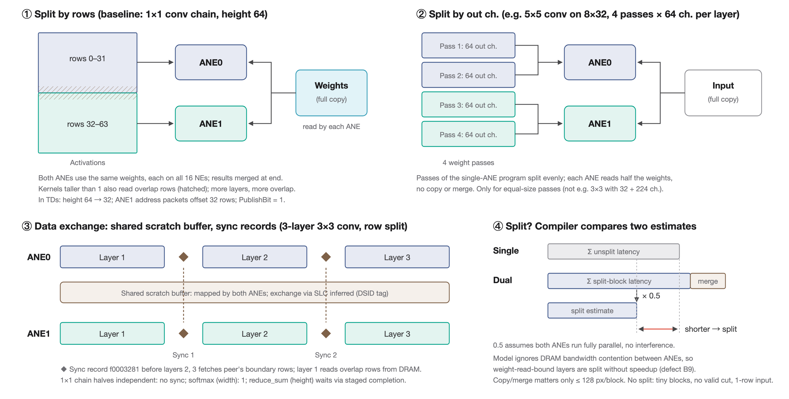

*Figure 5-3. Splitting, synchronization, and the split decision for dual-ANE programs. ① Split by rows: the two ANEs each process half of the rows and each read a complete copy of the weights (Section 5.8.1). ② Split by output channel: the passes already present in the single-ANE program are divided evenly between the two ANEs (Section 5.8.3). ③ When data must be exchanged, the two ANEs map the same shared scratch buffer, and sync records are inserted before the corresponding layers (Section 5.8.2). ④ The compiler compares latency estimates before and after splitting to decide whether to split; the factor × 0.5 assumes that the two ANEs do not interfere with each other (Section 5.8.3).*

#### 5.8.1 Differences at the TD Level

For the baseline model, the single-ANE program and each of the two TD sequences of the dual-ANE program contain three TDs, with about 0x4ac bytes per sequence. A word-by-word comparison of the three sequences yields the differences listed in Table 5-14 〔HWX〕.

*Table 5-14. Differences between the TDs of the single-ANE and dual-ANE programs for the baseline model*

| Location | Single ANE | Dual ANE, ANE0 | Dual ANE, ANE1 | Interpretation |
| --- | --- | --- | --- | --- |
| Height field in each TD | 64 | 32 | 32 | Output height halved |
| Data-volume field in each TD | 0x82000 | 0x41000 | 0x41000 | Data volume halved |
| Count fields in each TD | 4 / 2 / 6 | 2 / 1 / 3 | 2 / 1 / 3 | Counts halved |
| Offset of the input address packet | — | — | 32 rows | ANE1 starts reading at row 32 |
| Offset of the output address packet | — | — | 32 rows | ANE1 starts writing at row 32 |
| Bit 6 of the flag word (`PublishBit`) | 0 | 1 | 1 | Set only in dual-ANE programs |
| 16 NE configuration words | 0x00000021 | 0x00010021 | 0x00010021 | Bit 16 is set in dual-ANE programs |
| `tid` | Starts at 0 | Starts at 0x70 | Starts at 0x75 | TD numbers of the two ANEs do not overlap |

As Table 5-14 shows, for this pointwise convolution chain, the dual-ANE program splits the tensor into upper and lower halves along height. ANE0 computes rows 0–31, and ANE1 computes rows 32–63. Both use the same weights, and each uses all 16 NEs. Each row of a pointwise convolution depends only on the same row of the input, so no data needs to be exchanged between the two ANEs, and accordingly the TD sequences contain no cross-ANE sync records 〔HWX〕.

#### 5.8.2 Shared Scratch Buffer and Sync Records

To study cases that require exchanging data, we compiled four use cases: a three-layer 64-channel 1×1 convolution, a three-layer 64-channel 3×3 convolution, a reduce_sum along height, and a softmax along width (generation script: [bonded_cases.py](../tools/lib/bonded_cases.py); summary tool: [hwx_bonded.py](../tools/lib/hwx_bonded.py); artifacts: [hwx_cases/](../data/03_compile/hwx_cases/)). Except for the 1×1 convolution, the dual-ANE procedures of the other three use cases contain three additional classes of runtime operations. `rt_op_alloc_bss_for_ane16383_P_main__bonded` allocates a scratch buffer, where 16383 (0x3fff) should be a mask denoting all ANEs. `rt_op_map_shared_bss__ane0` and `__ane1` map this buffer to the two ANEs, respectively. `rt_param_main__bonded_ane_{0,1}_hi_replaceable_dsid_usage_dsid_relocation` supplies each ANE with a DSID relocation parameter. Because the DSID is a tag that the SoC's system-level cache assigns to data flows, and because the compiler contains a symbol named `McacheHiBondedKernelReadDSID`, we infer that data exchange between the two ANEs is related to the system-level cache 〔HWX, inferred〕. Whether a dedicated channel also exists, and the specific role of the DSID in the exchange, cannot be determined in this report (Section 16.2). In the reduce-along-height use case, the input and output are mapped only to ANE0. ANE1 maps only the shared scratch buffer and its own TD sequence; that is, ANE1 computes the partial sums for half of the tensor and writes them to the shared scratch buffer, and ANE0 performs the final merge.

In the TD sequences of these use cases, we counted the words whose top four bits are 0xf. `ffc01540` appears at a fixed position in every convolution TD and is a fixed field of the TD. `f0003211` appears at the end of every sequence and exists in both single-ANE and dual-ANE programs, and it should be the stage-end record. `f0003281` appears only in dual-ANE sequences that exchange data. Table 5-15 lists the number of occurrences of `f0003281` 〔HWX〕.

*Table 5-15. Number of occurrences of cross-ANE sync records*

| Use case | Occurrences of `f0003281` per ANE | Notes |
| --- | --- | --- |
| 1×1 convolution, 3 layers | 0 | The two halves do not depend on each other |
| 3×3 convolution, 3 layers | 2 | Before layers 2 and 3 begin, the boundary rows computed by the other ANE must be obtained; layer 1 reads the input, with overlapping rows, directly from DRAM |
| softmax, along width | 1 | — |
| reduce_sum, along height | 0 | ANE0 has three `f0003211` words and ANE1 has one; waiting is done through staged end records |

The number of occurrences of `f0003281` agrees with the number of times data must be exchanged between the two ANEs. The words surrounding this record have a fixed format: `c0301440 010N00e1 00000400 00010000 f0003281`, where N is the sequence number of the sync point, and the low byte 0xe1 marks a cross-ANE sync. The corresponding word in an ordinary end record has low byte 0x21. In ANE1, both kinds of records are followed by two additional words, `00001457 00000020`, which we speculate are the semaphore number and count used when ANE1 notifies ANE0. On this basis, we infer that `f0003281` is a cross-ANE sync record, corresponding to what maderix [4] and Bryngelson [5] call WAIT_EXT. Because we did not execute a modified program, this conclusion rests only on the position and number of occurrences of this record 〔HWX, inferred〕.

#### 5.8.3 Cost Model for Splitting

When generating dual-ANE programs, the compiler must decide, for each subgraph, whether to split it across the two ANEs or to keep it entirely on ANE0. The spatial-splitting steps (`ZinMirSpatialSplitter` and `BondedSplitSubgraphIdentification`) are responsible for this decision. They first identify splittable subgraphs, then use `ClusterSplitCostModel::FindOptimalSplit` to evaluate candidate splitting schemes, and finally use `IsCurrentGraphMinLatencyInBonded` to compare latencies before and after splitting. We disassembled the latter and the `LatencyInfo::ComputeSplitLatencyBonded` it calls, and we obtained the following criterion:

```
Latency after splitting = (Σ compute latency of each tile after splitting + Σ copy-and-merge latency) × 0.5
Splitting is performed if and only if Σ latency before splitting > latency after splitting, and the split is not worse than further subdivision
```

In these formulas, all three terms are per-layer estimates from the performance model. They are stored at offsets 0x150, 0x168, and 0x1b0 of the subgraph-split information object, and they are summed by accumulating over layers. The coefficient 0.5 implies that the model assumes the two ANEs run completely in parallel without interference. None of the three terms accounts for contention between the two ANEs for DRAM bandwidth, and none accounts for tiles of unequal size. The criterion considers only the sum of the latencies of the tiles, not the larger of them 〔compiler〕.

To validate this criterion on actual artifacts, we used the `exe_cycles` values in the TD headers, because these shapes are all dense layers and `exe_cycles` agrees with the performance-model estimate. The sum of `exe_cycles` over the TDs of a single-ANE program equals the latency before splitting. When splitting is forced with the option `EnableForcedMaximalBondedSplit`, the sum of `exe_cycles` over the TDs of a dual-ANE program equals the compute latency of the tiles after splitting. Combined with whether splitting actually occurred, this allows the range of values of the copy-and-merge latency term to be inferred back. We performed this analysis for 288 shapes with 256 channels; height × width of 4×32, 8×32, and 16×32; and depths from 2 to 24 layers (tool: [bsdecide.py](../tools/08_bonded/bsdecide.py); data: [bsdecide.txt](../data/08_bonded/bsdecide.txt)). The main results are as follows 〔compiler, HWX〕.

On the chain of 8×32, 256 channels, and convolution kernels from 1×2 to 1×8, there is a clear threshold for splitting: a single-ANE program is not split when the sum of `exe_cycles` is 44 or less, and it is split when the sum reaches 48. For example, for a 1×4 convolution with four layers, the sum is 24 and no splitting occurs; with eight layers, the sum is 48 and splitting occurs. For a 1×7 convolution with four layers, the sum is 44 and no splitting occurs; with eight layers, the sum is 88 and splitting occurs. By back-calculation, the copy-and-merge latency for this class of shapes lies between 44 and 48, about 45. A 1×1 convolution chain is split as early as 16 layers, although the sum of its `exe_cycles` is only 17. The reason is that most layers of the 1×1 chain are read in a chain from L2, and their `exe_cycles` are recorded as 0, so the total significantly underestimates the actual latency.

Further experiments show that whether the copy-and-merge latency is counted depends on the number of pixels in each tile after splitting (it is counted only when a tile has no more than 128 pixels). When it is counted, its size is roughly proportional to the number of activation bytes, as shown in Table 5-16 (tools: [bs_split3.py](../tools/08_bonded/bs_split3.py), [ioch.py](../tools/common/ioch.py)) 〔compiler, HWX〕.

*Table 5-16. Inferred copy-and-merge latency (1×4 convolution chain)*

| Model | Activation size | Per-tile size after splitting | Pixels per tile | Copy-and-merge latency |
| --- | --- | --- | --- | --- |
| 8×32, 160–384 channels | 80–192 KiB | 4×32 | 128 | About 30–70, roughly proportional to the number of channels |
| 4×64, 256 channels | 128 KiB | 2×64 | 128 | 34–46 |
| 8×33, 256 channels | 132 KiB | 4×33 | 132 | Less than 6 |
| 9×32, 256 channels | 144 KiB | 5×32 and 4×32 | 160 and 128 | Less than 8 |
| 8×64, 128 channels | 128 KiB | 4×64 | 256 | At most 8 |
| 8×64 or 16×32, 256 channels | 256 KiB | 4×64 or 8×32 | 256 | Less than 14 |
| 8×32, 512 channels (split by output channel) | 256 KiB | — | — | About 0 |

As Table 5-16 shows, the model counts a substantial copy-and-merge latency only when every tile after splitting has no more than 128 pixels, and its magnitude is about 0.35 units per KiB of activation. As soon as any tile exceeds 128 pixels, this term approaches zero, and chains of one or two layers are split. We excluded the following alternative explanations: whether the merged tensor hits the system cache (the threshold is 16 MiB, far larger than these tensors); whether the sum of the subgraph's inputs and outputs exceeds the 256 KiB L2 residency threshold in the HAL; whether the activations are no larger than 128 KiB; and whether the weights per NE exceed 64 KiB.

The compiler adopts two splitting methods. The first is split by rows. The entire convolution chain is fused into several tiles, each ANE executes all layers on the rows it is responsible for, and the results are finally merged. When the tensor height is 1, the compiler splits along width instead; for example, a 1×256 tensor is split into two 1×128 tensors. The cost of splitting by rows is that convolution kernels with a vertical size greater than 1 must read adjacent overlapping rows (halo), and the more layers there are, the more overlap there is. In addition, each of the two ANEs reads a complete copy of the weights. For example, after a 3×1 convolution chain on a 16×32 input is split, each ANE reads 9–10 input rows and outputs 8–9 rows. The second is split by output channel. If a layer in the single-ANE program has already been split into several passes because of weight-buffer capacity, and the passes have the same size, the compiler divides these passes evenly between the two ANEs. For example, a 13×1 convolution on an 8×32 input has 2 passes of 128 channels per layer in the single-ANE program; after splitting, each ANE executes one pass. A 5×5 convolution has 4 passes of 64 channels per layer; after splitting, each ANE executes two passes. This method requires no copying and merging 〔HWX〕.

We further disassembled the flow of spatial splitting and verified it in a compilation process of our own with lldb (Section 3.2), obtaining the specific rules for splitting 〔compiler〕. Only the "global refinement" path generates dual-ANE splits. `ZinMirSpatialSplitter::Tile` enters `TileWithGlobalRefinement` when the top-level option `GlobalRefinementInSpatialSplit` is enabled (the default), and it requires that the program be dual-ANE and that the bit at offset 0x73c of the HAL parameter table be set (it is 1 for 2026BaseLine). When this option is turned off, the compiler uses only the single-engine tiling criterion and performs no dual-ANE splitting at all, so the dual-ANE program degrades to executing entirely on ANE0 (Section 5.9).

Spatial splitting occurs at two levels 〔compiler, inferred〕. For subgraphs whose intermediate tensors must be tiled to fit the L2 capacity (Section 9.2.2), a tiling grid of T tiles is first obtained, and the tiles are then assigned to the two ANEs. When the layers in the subgraph have not designated an engine, tile i is assigned to ANE1 when i ≥ T/2 and to ANE0 otherwise, with T/2 rounded down. Therefore, when the number of tiles is odd, the extra tile necessarily goes to ANE1. This is the direct cause of the uneven work partition discussed in Section 10.5 (defect B8). The remaining subgraphs are split by the dual-ANE splitting step into exactly two tiles along one dimension. A tensor of height 1 is split along width; otherwise it is split along height. Cut points are aligned to 256 bytes, that is, to 128 columns of FP16 (or 64 columns when the width is too small). The first tile takes half of the width, rounded up to a multiple of 128. If the remaining part is then less than 128 columns, the rounding is changed to round down. For example, a width of 300 is split into 128 and 172, 375 into 128 and 247, and 640 into 384 and 256.

Refinement uses an iterative scheme based on a worklist of subgraphs. If the current overall splitting scheme has already reached a better result, further refinement stops. Otherwise, the subgraphs are divided further at candidate cut points, and the newly created subgraphs are added back to the worklist until it is empty. In addition, to bound compilation time, the compiler terminates refinement early when the splitting gain is less than 2% and the product of the number of layers and the number of tiles exceeds a preset threshold 〔compiler, inferred〕. Notably, this criterion does not explicitly consider load imbalance, so the compiler may still accept a scheme even when the benefit of splitting is very small. This behavior can be observed in a 16-layer 1×1 convolution chain with 512 channels and height 1. When the input width is 128, the estimated latencies of the unsplit and split schemes are 0.0550 ms and 0.1022 ms, respectively. Splitting significantly increases latency, so the compiler keeps execution on a single ANE. When the width increases to 256, the estimated latencies of the two schemes are 0.10454 ms and 0.10374 ms. Although splitting yields an estimated performance improvement of only about 0.8%, the compiler still accepts the scheme and divides the computation across the two ANEs. This explains the phenomenon in Chapter 10: at width 128, the model uses only a single ANE, while at width 256, both ANEs are enabled.

#### 5.8.4 Cases Without Splitting

Among the 288 shapes, the cases without splitting can all be explained by the criteria above. The first class is where each tile after splitting is too small. All 4×32 shapes are not split, because each ANE would receive only two rows, and the gain is offset by the copy-and-merge latency. The second class is where no usable splitting method exists. The 1×9 to 1×15 convolutions on 8×32 stream their weights within a single TD, so there are no passes to distribute, and splitting by rows would not be faster. The two passes of 3×3 and 9×1 convolutions contain 32 and 224 channels, respectively; these are very unequal and cannot be split by channel, while splitting by rows would require overlapping rows. The two passes of 11×1 convolutions contain 96 and 160 channels, with the same problem. The 3×1 to 7×1 convolutions have no more than 64 KiB of weights per NE, so they have only one pass, and splitting by rows would again require overlapping rows. The third class is where the spatial size is too small. Tensors with very few spatial pixels (such as 1×64 and 1×1), and matrix multiplications with constant weights (M = 1, K = N = 2048, and M = 64, K = N = 1024), have TD sequences only for ANE0 in the dual-ANE program. M = 1 matrix multiplication is the typical shape of the decoding phase of large language models, which implies that matrix multiplication for a single small batch does not become faster because the M6 has two ANEs 〔HWX〕. It is the size of the tensor, not the number of rows, that determines whether splitting occurs. A 1×1 convolution chain with 512 channels and height 1 is not split at widths 64 and 128, but it is split along width at width 256. Likewise, shapes that contain the same 4096 pixels (1×4096, 2×2048, up to 64×64) are all split 〔HWX〕.

The cost model above also does not consider the weight-reading stage that the two ANEs share. Under splitting by rows, each ANE reads a complete copy of the weights, yet the model expects the post-split latency to be halved. Section 10.4 shows that on layers limited by weight reads, such splitting does not yield a speedup (defect B9).

### 5.9 Compilation Cost

Generating dual-ANE programs requires the additional steps listed in Section 5.3. h18 is one generation earlier than h18g, but the differences between their parameter tables lie mainly in capability switches and a few limit fields (Section 5.4), and the main difference between the two in the compilation workflow is whether dual-ANE programs are generated. Therefore, the difference in compilation time between them can be approximately regarded as the cost of generating dual-ANE programs. Table 5-17 gives the compilation times and artifact sizes of three models on five targets (data: [h7_compile_time.txt](../data/03_compile/h7_compile_time.txt)) 〔timing〕.

*Table 5-17. Compilation time on five targets*

| Model | h16g | h17s | h18 | h18g | h19 | Artifact size (h18 → h18g) |
| --- | --- | --- | --- | --- | --- | --- |
| 1×1 convolution chain, 64 channels, width 1024, 256 layers | 0.67 s | 0.68 s | 0.68 s | 1.19 s | 1.19 s | 160 KB → 352 KB |
| Elementwise operations, 64 steps (128 elementwise layers) | 0.09 s | 0.09 s | 0.09 s | 1.10 s | 1.10 s | 80 KB → 144 KB |
| Two 1×1 convolution layers, intermediate tensor 16 MB | 0.03 s | 0.03 s | 0.03 s | 0.05 s | 0.05 s | 176 KB → 224 KB |

The three single-engine targets span three generations, yet their compilation times are identical, which shows that the generation itself does not change the compilation time. The compilation times of h18g and h19 are also identical. We therefore infer that the additional time comes from generating dual-ANE programs 〔timing, inferred〕. To determine how compilation time scales with model size, we constructed an elementwise chain y ← y·u + u, in which each step contains one multiplication and one addition. We varied the number of steps n and compiled the chain separately to h18 and h18g. The results are shown in Table 5-18. Table 5-18 and Table 5-17 come from different measurement rounds, and the timings for the same model differ by less than 0.03 s 〔timing〕.

*Table 5-18. Compilation time of the elementwise chain*

| Steps | Elementwise layers | h18 | h18g | Ratio |
| --- | --- | --- | --- | --- |
| 32 | 64 | 0.06 s | 0.18 s | 3 |
| 64 | 128 | 0.10 s | 1.13 s | 11 |
| 96 | 192 | 0.14 s | 4.57 s | 33 |
| 128 | 256 | 0.18 s | 13.1 s | 73 |
| 192 | 384 | 0.28 s | 61.3 s | 219 |
| 256 | 512 | 0.39 s | 178.6 s | 458 |

The compilation time of the single-engine version grows linearly with the number of steps, at about 1.5 ms per step. The compilation time of h18g is approximately proportional to the 3.5–3.8 power of the number of steps: when the number of steps increases from 64 to 128, the compilation time increases 11.6 times, and from 128 to 256, it increases 13.6 times. In contrast, the compilation time of the convolution chain grows slowly; the 256-layer chain takes only 0.5 s longer than on the single-engine target. This indicates that the elementwise layers trigger a search in one of the dual-ANE steps whose complexity grows superlinearly 〔timing, inferred〕. Figure 5-4 plots this difference on log-log axes.

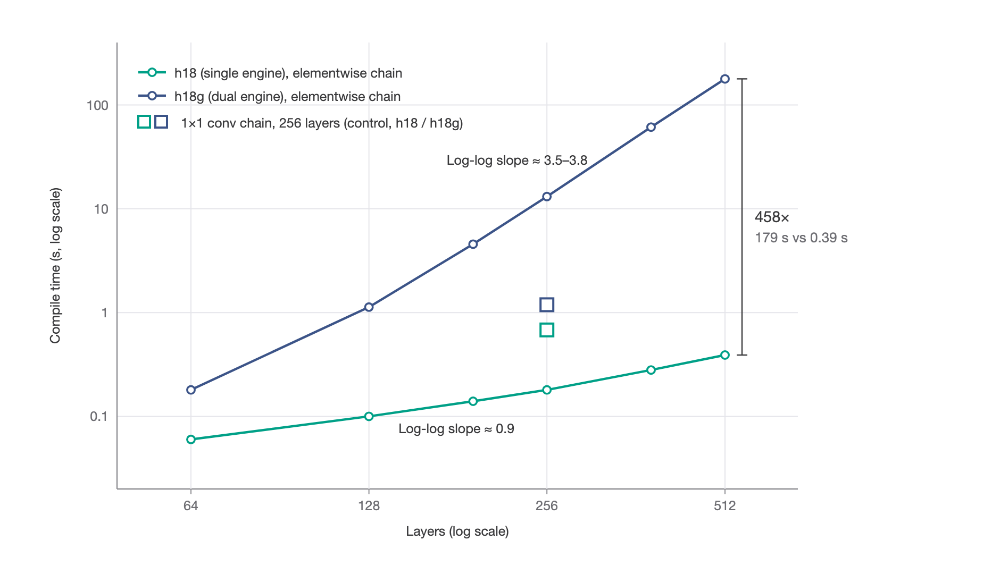

*Figure 5-4. Compilation time as a function of the number of layers (log-log axes). Circles show the compilation time of the elementwise chain y ← y·u + u (two elementwise layers per step) compiled to h18 (single engine) and to h18g (dual engine); squares show the control, a 256-layer 1×1 convolution chain. The time for h18 is approximately proportional to the number of layers, whereas h18g scales approximately with the 3.5–3.8 power of the number of layers, a 458-fold difference at 512 layers. The convolution chain takes only about 0.5 s longer on h18g (data: [h7_compile_time.txt](../data/03_compile/h7_compile_time.txt)).*

When a model is first loaded through Core ML, compilation is a further 2.7 times slower. We used a tool that times only the `MLModel` loading process ([cmload.m](../tools/common/cmload.m)), together with the system log of the compiler service and the busy time of each CPU core in IOReport, to compare the compilation time of a 128-step elementwise chain under different methods. The results are shown in Table 5-19 (data: [cm_load_vs_compile.txt](../data/03_compile/cm_load_vs_compile.txt)) 〔timing, IOReport〕.

*Table 5-19. Compilation time under different methods (128-step elementwise chain, h18g)*

| Method | Time | Cores that ran the compilation |
| --- | --- | --- |
| In-process direct compilation, default priority | 12.65 s | Not recorded (single-threaded; inferred to be S cores) |
| In-process direct compilation, `taskpolicy -c utility` | 12.66 s | Not recorded (inferred to be S cores) |
| In-process direct compilation, `taskpolicy -b` (background) | 83.9 s | E cores (low frequency) |
| First Core ML load, client QoS default, utility, user-initiated, or user-interactive | 33.7–34.3 s | E cores: the six E cores were busy for about 30 s in total, and the S cores for about 0.2 s |
| First Core ML load, client QoS background | 98.8 s | E cores (low frequency) |

The log of the compiler service shows that only one compilation was performed during Core ML loading, taking 34.05 s, and that the remaining steps of loading took less than 0.3 s in total. The ratio of 34.05 s to 12.65 s is 2.7, which is comparable to the ratio of single-thread performance between S and E cores. Therefore, the main reason compilation becomes slower is that the compiler service runs on E cores, not a difference in compilation options 〔timing, inferred〕. The mechanism is as follows. The launchd configuration of the daemon aned sets `ProcessType = Adaptive`, so that it runs at background priority when idle. The compiler service (`ANECompilerService.xpc`) is spawned by aned and inherits this role. Although it is elevated in priority when the client requests compilation (the log shows `clientQos=21 threadQos=21`), its threads are still scheduled onto E cores. The executable of the compiler service contains no code that binds it to a CPU cluster or actively lowers its priority, so this is the scheduling policy the system applies to XPC services spawned by daemons. The client adjusting QoS can only make compilation slower, not place it on S cores 〔timing, inferred〕. Compilation results are cached, so the above overhead occurs only on first loading.

The compilation cost for real models is even more pronounced. Taking the Whisper large-v3-turbo Core ML package released by WhisperKit as an example, we used [cmload.m](../tools/common/cmload.m) under a new process name to force first-time loading of its four submodels, because the Core ML and aned compilation caches are keyed by process name. At the same time, we recorded the available disk space and the CPU utilization of the compiler service once per second (tools: [whisper_load.sh](../tools/03_compile/whisper_load.sh), [whisper_tmp.sh](../tools/03_compile/whisper_tmp.sh); data: [whisper_compile/](../data/03_compile/whisper_compile/)). On the M6, the mel spectrogram (0.39 s), the context prefill (0.04 s), and the 328 MB text decoder (2.29 s) were all compiled quickly, and when loaded again under the same process name, the compilation results could be reused (0.01–0.08 s). However, the 1.2 GB audio encoder had not finished compiling after 438 s. The disk footprint had increased by about 44 GB, and we aborted the compilation because the available space fell below 15 GB. During compilation, the compiler service, running as root, wrote swap files named `anecompiler.swap.*` into the cache directory of aned, and its CPU utilization was about 200%. The same encoder, loaded for the first time through Core ML on the M4 (h16g), took only 80 s, with a peak disk footprint of about 1.3 GB and no swap files. Both machines have 16 GB of memory 〔timing〕.

To rule out the influence of Core ML, after compilation had started, we retrieved from the cache directory the model that Core ML handed to the ANE compiler (15849 operations, including 5120 einsum operations, which WhisperKit splits by head and by block to fit the ANE). We then compiled it directly in our own process with `anecc` (tools: [whisper_capture.sh](../tools/03_compile/whisper_capture.sh), [whisper_anecc.sh](../tools/03_compile/whisper_anecc.sh)). Compiling to h16g and to single-engine h18 both took 41 s, with a peak disk footprint of 3.8 GB. When compiling to h18g, `anecc` wrote the same swap file into the output directory; after about 220 s, the disk footprint had reached 44 GB, while the peak memory was only about 6 GB 〔timing〕. We then truncated the model to its first N encoder layers ([whisper_trunc.py](../tools/03_compile/whisper_trunc.py)), with the results shown in Table 5-20.

*Table 5-20. Compilation cost of the Whisper encoder truncated to its first N layers (`anecc`)*

| Number of encoder layers | 1 | 2 | 4 | 8 | 16 |
| --- | --- | --- | --- | --- | --- |
| h18g time | 12 s | 21 s | 47 s | 88 s | 182 s |
| h18g peak disk usage | 2.7 GB | 4.7 GB | 10.0 GB | 19.4 GB | 39.0 GB |
| h18 time (disk usage 0) | 5 s | 6 s | 8 s | 13 s | 23 s |

The disk footprint of h18g is proportional to the number of layers, at about 2.4 GB per layer, which is about 60 times the weights of that layer (about 39 MB). By extrapolation, the complete 32-layer encoder would require about 78 GB. Compilation through Core ML is even slower. In the evaluation, loading through Core ML took about 24 minutes, which is 3–4 times the time extrapolated for `anecc` (about 6 minutes) and larger than the 2.7-fold difference measured above 〔timing, inferred〕. The 16-layer model was finally compiled, which indicates that this is a resource problem proportional to the number of layers rather than an infinite loop. During compilation, memory was capped at 5–6 GB while the disk kept growing. This indicates that the compiler deliberately stores this data in files, rather than that the system swaps it out when memory is insufficient.

Stack sampling of the h18g compilation of a 4-layer model shows that 97% of the samples lie in `ZinMirSplitSpatially → ZinMirSpatialSplitter::TileWithGlobalRefinement → MirOpt::MergeConvolutions → MirOpt::CreateMergedNEConvLayer` 〔compiler〕. To find out what the swap file contains, we compiled one encoder layer on the M4 with the same version of the compiler, targeting h18g. The model graph was taken from the real model captured on the M6, while the weights were generated as fake data in the MIL storage format, because the real weights reside only on the M6. The resulting HWX size (73,089,024 bytes) and the peak drop in remaining disk space (2725 MB) both agree with the results on the M6. We then used lldb to record the file creation, deletion, extension, and memory-mapping calls of the compilation process, together with their call stacks (tools: [swaptrace_lldb.py](../tools/03_compile/swaptrace_lldb.py), [whisper_fakeweights.py](../tools/03_compile/whisper_fakeweights.py); data: [swaptrace/](../data/03_compile/whisper_compile/swaptrace/)) 〔compiler〕.

The results show that the swap file comes from the compiler's file-backed allocator `ZinIrFileBacking`. When compilation starts, the compiler first creates a file named `anecompiler.swap.*` in the output directory, then immediately removes its directory entry while keeping the file handle open, and it continuously allocates space through file extension and memory mapping. This space is used mainly to store constant data converted to float32, so FP16 weights occupy about twice the storage after conversion. The allocator supports only space allocation and provides no mechanism for independently freeing allocated regions, so the backing file keeps growing throughout compilation. There were 104 extensions in total, and the file size grew from 8 MB to 2656 MB; the space was released only after compilation finished. Because the directory entry is removed right after creation, this space usage does not appear in the output directory and can be observed only through changes in the system's free disk space 〔compiler〕. Of the 2644 MB of mappings, 2372 MB come from `MirOpt::CreateMergedNEConvLayer`. During global refinement, one encoder layer generated 101 merged convolution layers, each creating three float32 weight blocks of about 7.7 MB. A large number of convolution merges arises from earlier weight sharding: a large convolution is first split into multiple weight shards by output channel, and during global refinement these shards are further split as independent subgraphs. After graph rewriting, several small convolutions sharing the same input appear within the same spatial block, and MergeConvolutions then merges them back into one larger convolution and generates the corresponding concatenated weights. This process causes significant inflation of the weight data. For a one-layer encoder, the weights generated by merging in each program are about 307 MB, while the original weights are only about 39 MB 〔compiler, inferred〕. By contrast, single-engine h18 does not undergo global refinement, so it does not trigger the above convolution merging and does not produce the corresponding swap file.

Global refinement is also a necessary step for this model to be split across the two ANEs. When the top-level compilation option `GlobalRefinementInSpatialSplit` is set to false, the h18g compilation of the 4-layer model returns to 8 s with zero disk usage. However, the resulting dual-ANE program contains only the ANE0 TD sequence, which means that the compiler abandoned splitting. Therefore, disabling this option does not solve the problem 〔HWX〕. Even under the default settings, splitting itself is unbalanced. By the sum of `exe_cycles` estimated by the compiler itself, ANE1 is 1.36–1.48 times ANE0 (for 1 layer, 7074 versus 4783; for 4 layers, 20244 versus 14875), which is 15–19% longer than the critical path under an even split 〔HWX〕. This is the result of several rules in Section 5.8.3 operating together, not a deliberate division of labor. The attention portion has a tile width of 375, and aligning to 128 columns can only split it into 128 and 247. When a tensor of width 1500 is split into three tiles, the extra tile goes to ANE1, becoming 512 and 988. The compiler's cost model does not explicitly consider such imbalance. An attention head group has an estimated gain of −14% when executed on a single engine, but in the dual-ANE split evaluation this cost is simply multiplied by 0.5, so it is still judged to benefit from splitting 〔compiler〕.

When loading through Core ML, two peripheral problems further magnify the compilation cost into a condition in which the whole machine becomes unusable. Ending the loading process does not stop the compiler service, so the swap file keeps growing, and only ending `ANECompilerService` as root releases it. In addition, the compiler does not check the remaining disk space. During the evaluation, the compiler service filled the system disk until only 121 MB remained. The system then purged the ANE compilation cache, after which the next load of every model required recompilation (Section 14.4). We record the disk cost of global refinement as defect A3, and the continued operation of the compiler service after the client exits, which fills the disk, as defect A4 (Appendix D).

### 5.10 Compilation Depth Limit of Convolution Chains

On one class of convolution chains tested in this report, the dual-ANE compilation path also causes the compiler to crash when the number of layers is large. Following the setup of maderix [4], we used a 1×1 convolution chain with 64 channels and width 1024 (each tensor 128 KiB, with weights shared across layers). After changing the number of layers, we compiled the chain with `ANECCompile` for three targets, with the results shown in Table 5-21 (data: [h9_depth_compile.txt](../data/03_compile/h9_depth_compile.txt); generation script: [chain.py](../tools/common/chain.py)) 〔timing〕.

*Table 5-21. Compilation results at different depths*

| Layers | h16g | h18 | h18g |
| --- | --- | --- | --- |
| 384, 386 | Success, 208 KB | Success, 208 KB | Success, 512 KB |
| 387, 388, 400, 512 | Success | Success | Crash, return code 138 (SIGBUS) |

The crash reports show that the exception occurred on the guard page of the thread stack, which indicates a stack overflow. The call stack shows that `ZinIrOpLayerGraphScheduler::Schedule` recurses once for each layer of the network, and finally exhausts the thread stack in the call chain `ZinIrScheduleGraph::CompressAttentionBlockBranches` → `ZinIrParallelExecutionOpportunityFinder::FindIntraANEParallelism` → `FindAllAttentionBranchesInRegion` → `ZinIrNgraph::TopologicalSortImpl`. The step that searches for parallel attention branches is executed only on h18g, so h16g and h18 do not crash even when compiled to 512 layers. From this it can be determined that the 386-layer limit of this convolution chain on the M6 originates from the recursive implementation of the compiler rather than from a hardware limit 〔timing, compiler〕. This limit is not a layer-count bound that holds for all graphs: the chain with 512 elementwise layers in Table 5-18 of Section 5.9 can be compiled on h18g. The crash occurs in the step that searches for parallel attention branches, and how deep the recursion can go may depend on the structure of the graph and the compilation path taken, not only on the number of layers 〔inferred〕.

*Table 5-22. Behavior when loaded through Core ML*

| Layers | M6 | M4 |
| --- | --- | --- |
| 64–386 | Executes on the ANE (interrupts observed on both ANEs), 191–330 µs per invocation | Layers 383, 384, and 386 execute on the ANE |
| 387, 392 | Loading hangs permanently: the calling process waits for more than 11 minutes, CPU usage is 0, and the compiler service is idle; there is neither an error nor a fallback to the CPU | Layer 387 executes on the ANE |
| 388, 400–1024 | Silently falls back to CPU execution (zero ANE interrupts), 27–70 ms per invocation, more than 100 times slower than the ANE | Layers 388, 400, and 448 execute on the ANE |

Under Core ML loading of the same group of models, the behavior of the system is not consistent. Table 5-22 compares the M6 and the M4 when loading the same `.mlmodelc` under the same macOS version (data: [d5_depth_run.txt](../data/04_schedule/d5_depth_run.txt), [d5_depth_m4.txt](../data/04_schedule/d5_depth_m4.txt)) 〔timing, IOReport〕. When the compiler service crashes or is terminated, aned keeps waiting for its reply, and all ANE model loading in every process is blocked from then on until aned is restarted. The above two problems are recorded as defects A1 and A2, respectively (Appendix D).

### 5.11 Comparison with the M4

Table 5-23 compares the compiled artifacts and compilation behavior of the M4 and the M6.

*Table 5-23. Compiled artifacts and compilation behavior of the M4 and the M6*

| Item | M4 (h16g) | M6 (h18g) |
| --- | --- | --- |
| HWX structure | One TD sequence and weights | Runtime operation graph, three TD sequences, and shared weights |
| TD layout version | v17 | v24 |
| Resident-weight limit per NE | 64 KiB (HAL) | 64 KiB (HAL); when the input is large, the number of TDs per layer is approximately ⌈weights per NE ÷ 64 KiB⌉ (one or two more for some shapes); when the input is small, the weights may be read in a streaming manner within a single TD |
| Compilation time for 512 elementwise layers | Not measured; in Table 5-17, h16g and h18 take the same time, presumably of the same order as the 0.39 s of h18 | 178.6 s |
| Compilation depth limit for 1×1 convolution chains (64 channels, width 1024) | maderix [4]: 383 blocks can be executed, and the compilation service disconnected at 384 blocks; in this report on macOS 27: at least 448 layers | 386 layers (compiler stack overflow); chains of 512 elementwise layers can be compiled |

maderix [4] reported on an earlier system version that on the M4 the compilation service disconnected at 384 blocks, which may be a compiler crash of the same type. On macOS 27, used in this report, the same model on the M4 can reach at least 448 layers, whereas on the M6 it fails to compile from 387 layers onward, because the recursion of the dual-ANE path becomes too deep.

### 5.12 Summary

This chapter has addressed how compilation arranges work: which operations are handed to the ANE, what the ANE programs look like, and what each of the two engines does. The Core ML segmenter selects a backend for each operation under a fixed cost. An ANE segment must save at least 0.25–0.375 ms before it is selected, and on the basis of the AOT driver, we infer that the M6 retains the cost model of the M4. The ANE compiler generates, for each model, a single-ANE and a dual-ANE program that share one copy of the weights. The programs consist of TD sequences that contain no instructions or branches. The weights of each layer are divided evenly among the 16 NEs by output channel. When the weights exceed 64 KiB per NE, they are split into multiple TDs, or they are read continuously within a single TD. Whether a subgraph is split across the two ANEs is determined by a latency model that assumes the two ANEs do not interfere with each other and does not consider tiles of unequal size. Cut points are aligned to 128 columns, and the extra tile of an odd count is assigned to ANE1. When data must be exchanged, the two ANEs cooperate through a shared scratch buffer and through dedicated words that we infer to be cross-ANE sync records. In terms of compilation cost, the dual-ANE compilation path causes superlinear compilation time, compiler crashes from 387 layers onward, and disk usage proportional to the number of layers (defects B1, A1, and A3).

This chapter establishes only how the compiler arranges work. The questions it leaves open are answered in later chapters: how these programs are selected and submitted at runtime (Chapter 6), and how much the splitting cost model, which ignores shared resources and workload imbalance, actually loses (Chapter 10). The deployment recommendations derived from the conclusions of this chapter are collected in Section 15.2 (Table 15-1).

## 6. Scheduling and Execution

Chapter 5 described the programs generated by the compiler and how the compiler decides what each of the two engines does. This chapter examines how the runtime Espresso submits, schedules, and completes requests, and what overhead each call incurs. How much speedup these arrangements actually deliver is examined in Chapter 10. We combine three kinds of data. Read-only analysis of the kernelcache and the ANE firmware gives the structure of scheduling; firmware and driver events in kdebug give timestamps for each stage; and Core ML timing together with IOReport interrupt counts give the concurrency behavior. This chapter has four main conclusions. First, scheduling has three layers: the ANE driver in the host kernel handles priority, the selection of engine and program variant, and throttling; the ANE firmware queues requests by priority and dispatches tasks; and the NE DVFS state is determined by the CLPC in the host kernel. Second, for synchronous calls, each call incurs about 30 µs of submission-side overhead and 130–325 µs of completion-side overhead in addition to the ANE task. The completion-side overhead depends on how deeply the CPU that waits for the result sleeps, and it does not depend on the number of layers in the program. Third, in the programs measured, mutually independent branches do not overlap; whole-graph timing cannot distinguish whether this arrangement results from the compiler or from a hardware limitation. The fixed overhead per layer is at most about 13 ns. Fourth, within a single request, whenever a dual-ANE program contains work for ANE1, the runtime executes that work. Across multiple requests, requests from multiple threads that synchronously call the same program are serialized, whereas requests to different programs, requests from different processes, and multiple asynchronous requests to the same program are all assigned to both ANEs.

### 6.1 Methods

This chapter uses four methods to analyze the scheduling and execution of programs.

The first method uses kdebug events. Within the kdebug tracing facility of the macOS kernel, events of class 0x06 and subclass 0x1b are produced by the ANE driver and firmware. In tracing sessions started as root, we recorded only events of this subclass (scripts: [d1b_ktrace.sh](../tools/04_schedule/d1b_ktrace.sh), [sw_ktrace.sh](../tools/07_memory/sw_ktrace.sh)). By comparing these events with call timing, we determined the meanings of the events listed in Table 6-1. The event names are assigned by this report based on the times at which the events occur and on their parameters; Apple has not published definitions for these events 〔kdebug, inferred〕.

*Table 6-1. kdebug events used in this chapter (class 0x06, subclass 0x1b)*

| Event ID  | Meaning                  | Notes                                                                                                                              |
| --------- | ------------------------ | ---------------------------------------------------------------------------------------------------------------------------------- |
| `61b01a9` | Driver receives submission | One per call                                                                                                                     |
| `61b0125` | ANE task start           | Missing in some experiments for single-ANE programs (see below); the CPU column reads 36 for ANE0 and 33 for ANE1                  |
| `61b0126` | ANE task end             | Appears in both single-ANE and dual-ANE programs                                                                                   |
| `61b00b8` | Firmware posts message   | Count equals the interrupt count                                                                                                   |
| `61b0020` | Interrupt handling       | —                                                                                                                                  |
| `61b00a0` | Completion marker        | The event whose first argument is 1 is used                                                                                        |
| `61b0170` | Driver completion handling ends | —                                                                                                                           |
| `61b0024` | User thread returns      | Synchronous return from the Core ML call                                                                                           |

In some experiments, the task-start events for single-ANE programs were not recorded or were largely missing, and the cause has not been determined. In the experiments of Chapters 11 and 12, this event is complete. For consistency, we split each call of a single-ANE program into two segments: "submission to task end" and "task end to next submission." The former segment includes the submission latency and the task itself.

The second method uses IOReport interrupt counts. The `Interrupt Statistics` group of IOReport provides one subgroup for each ANE (`ane` and `ane1`), and the first-level interrupt-handling counts within these subgroups can be read without root privileges. We use these counts to determine which ANE a request is assigned to and whether a model actually executes on the ANE (tools: [bondrun.m](../tools/common/bondrun.m), [mtrun.m](../tools/common/mtrun.m)) 〔IOReport〕. We calibrated the ANE interrupt counters with a set of control experiments. First, in an idle window of 0.5 s, the interrupt counts of both ANEs are zero. For a dual-ANE program that, after compilation, contains a TD sequence only on ANE0 (for example, a 1×64 1×1 convolution), each model call corresponds to about 3.8 interrupts on ANE0, while ANE1 remains at zero. For a program that contains TD sequences on both ANEs, the counts on the two sides are essentially equal, at about 2–3.5 per call. As a further control, when Core ML executes a model entirely on the CPU (for example, with constant weights, or a matrix multiplication with M = 1), the interrupt counts of both ANEs remain zero. These results indicate that the counter reflects the actual activity of the two ANEs and can be used to determine whether each ANE participates in computation during model execution 〔IOReport〕. Raw data are in bond_calib_run.txt. Accordingly, this counter can reliably distinguish the two ANEs. Because the IOReport counts are system-wide, in multi-process experiments each process reads the total interrupt count summed over all processes.

The third method uses Core ML timing. All models were executed through the public Core ML interface, with the compute units set to `CPUAndNeuralEngine`. Each model was first called continuously for at least 1 s as a warm-up, then called 500–1000 times in succession, and the median or the 10th percentile is reported. Each data point was measured in at least two rounds 〔timing〕.

The fourth method is static analysis. We extracted the kernelcache and the ANE firmware image from the system files of the M6; the firmware is a Mach-O file in RTKit format. The analysis relies mainly on text strings in these files, including the log format strings and assertion messages of the driver and firmware. Where data structures or the conditions of a check must be confirmed, we disassembled the relevant functions (tools: [kcdis.py](../tools/re/kcdis.py), [fwref.py](../tools/re/fwref.py), [fwfunc.py](../tools/re/fwfunc.py)). The firmware and kernelcache are Apple binaries and are not distributed with the repository 〔firmware, kernel〕.

### 6.2 Software Stack and Three-Layer Scheduling Structure

On the host side, a Core ML inference passes successively through Core ML, the Core ML runtime framework Espresso, the AppleNeuralEngine framework, and the ANE driver in the kernel. Within Espresso, the E5 module selects a backend for each operation and partitions the graph into segments when the model is loaded (Section 5.2). During inference, the segments are invoked in order according to the resulting execution plan, and the ANE segments are submitted through the AppleNeuralEngine framework. Model compilation and loading are performed by the daemon aned and the compiler service it spawns (Chapter 5). The compilation results of E5 are cached in directories distinguished by process name, so loading the same model under a new process name triggers recompilation (Section 5.9). maderix [4] observed on the M4 that execution requests do not pass through aned; instead, the client process submits them directly to the kernel driver. The driver hands requests to the firmware inside the ANE through a mailbox, and the firmware dispatches tasks to the hardware. The events in Table 6-1 cover each node along this path.

Based on the analysis of the kernelcache and the firmware, the scheduling of the M6 can be divided into three layers, as shown in Table 6-2 〔kernel, firmware〕.

*Table 6-2. Three-layer scheduling structure of the M6 ANE*

| Layer       | Component                                                                                                                                  | Responsibilities                                                                                                                                                                                  |
| ----------- | ------------------------------------------------------------------------------------------------------------------------------------------ | ------------------------------------------------------------------------------------------------------------------------------------------------------------------------------------------------- |
| Host kernel | ANE driver (`H11ANEInUserClient`; driver bundle `AppleH16ANEInterface`)                                                                    | Priority mapping; selection of engine (ANE0 or ANE1) and program variant (dual-ANE or single-ANE); handling of inter-request dependencies; throttling; power control; reporting work to the CLPC |
| Host kernel | The CLPC (`AppleCLPC`, including modules `ane_job_tracking`, `ane_perf_sampler`, `ane_forced_idle_limiter`, and others)                    | Determines the DVFS state and the throttling ratio of the ANE                                                                                                                                     |
| ANE         | Firmware (source paths `sne/aneEngine/exeLoop`, `sne/drivers/tm`, `itq`, `PowerControlService`, `CLoadMonitor`, and others)                | Queues requests by priority; dispatches requests to hardware task queues; dynamic power gating; reporting the load of the firmware processor itself                                              |

This structure is largely consistent with Bryngelson's [5] description of an earlier product, but there is one important difference. The IORegistry of the M6 does not contain the multi-engine arbitration component `AppleANELoadBalancer` that Bryngelson describes; the selection of engines is performed by the ANE driver itself (Section 6.3). The driver and firmware layers are discussed in turn below, and the behavior of the CLPC is discussed in Chapter 12.

### 6.3 Driver: Priority, Engine Selection, and Throttling

The ANE driver sits between the client and the two compute engines. It is the intermediate layer that connects upper-level requests to the underlying execution resources, and it therefore has visibility into all pending requests and into the running state of both engines. Once a request enters the driver, the driver is responsible for determining the following: the priority at which the request should execute; the engine to which it should be assigned and the program variant it should execute; and, during execution, whether it must be limited because of power, temperature, or firmware load. In addition, the driver reports the execution of each request to the CLPC, which uses this information as the basis for frequency scaling. This section analyzes the mechanisms of the driver in this order. The evidence in this section comes mainly from function names, log format strings, and assertions in the driver. These show which mechanisms the driver has and which factors each mechanism considers, but they generally cannot give specific weights or thresholds.

#### 6.3.1 Determination of Priority

Each request carries a logical priority and a QoS value; the driver's log format `programHandle … priority: %u, qos: %u` records both values. The logical priority is an abstraction exposed to clients, whereas the firmware maintains only its own six-level priority scheme (Section 6.4). For this reason, the driver first maps the logical priority to a firmware priority through `applyFirmwarePriorityMapping`. The mapping table differs by SoC. If a logical priority has no corresponding firmware priority on the current SoC, the driver logs `Logical priority %u has no firmware mapping for this SoC` and truncates the request to the highest available level. On the M6, the highest firmware priority, `kANEFirmwareProgramPriority0`, is marked as not yet supported by the firmware, so requests that would use this level fall back to a lower level. Higher priorities are not open to all clients. Real-time and system-reserved priorities require the entitlements `com.apple.ane.realtime-priority-client` and `com.apple.ane.allow-system-reserved-priorities`, respectively, and ordinary applications that submit requests through Core ML do not hold these entitlements 〔kernel〕.

Strict priority scheduling could leave low-priority requests unexecuted for long periods, so the driver also implements an anti-starvation mechanism. The driver sets a starvation threshold for low-priority requests (log `Low-priority starvation threshold set to %u ms`). When the waiting time of a low-priority request exceeds this threshold, the function `shouldYieldToLowerPriorityRequest` causes higher-priority requests to yield temporarily. To support this decision, the driver counts submitted requests and their execution time separately for each priority 〔kernel〕.

#### 6.3.2 Request Placement: Dependencies, Engines, and Program Variants

After the priority is determined, the driver must decide when a request can be dispatched and which engine will execute it. Dependencies between requests determine when a later request may be dispatched. The driver supports two forms of dependency (fences). In the `LocalFast` form, a later request may be submitted to the firmware while the earlier request is still executing; in the `LocalStrict` form, a later request is held in the driver and is submitted only after the earlier request completes 〔kernel〕.

Next is the selection of the engine. The driver function `SelectBestANECore` computes a composite score for each engine every time a request is placed, and selects the engine with the best score. Its log lists six components that enter the computation, shown in Table 6-3 〔kernel〕.

*Table 6-3. Components used by the driver to select an engine*

| Component    | Meaning                                                                                                   | Factor             |
| ------------ | --------------------------------------------------------------------------------------------------------- | ------------------ |
| `WRK`        | Work already queued on the engine                                                                         | Load               |
| `HOL`        | Head-of-line blocking ratio for this priority on the engine (normalized and weighted from `holRatio`)     | Load               |
| `CLPC`       | Available clusters recommended by the CLPC (`allowedClusters`)                                            | Power management   |
| `THROT`      | Percentage of the engine currently throttled                                                              | Power management   |
| `PWR`        | Whether the engine is powered on                                                                          | Power management   |
| `clientPref` | Client's preference hint for ANE0 or ANE1                                                                 | Client preference  |

These six components fall into three groups of factors. `WRK` and `HOL` reflect the load of the engine and favor placing a request on a less busy engine. `CLPC`, `THROT`, and `PWR` reflect the state of power management and favor engines that the CLPC allows, that are not throttled, and that are already powered on. Judging from their names, these components appear intended to avoid unnecessarily waking the other engine, although Section 12.5 observes that the other engine is also powered on briefly when only one ANE is used 〔inferred〕. `clientPref` allows clients to express a preference. Clients can supply only a preference; the final choice is made by the driver, which combines the load and power states.

Once an engine is selected, the driver uses `ANEProcedureVariantSelector` to choose, from the compiled artifact, whether to execute the dual-ANE program or the single-ANE program (Section 5.5). If a client requires that only one designated ANE be used, and the program has no single-ANE variant, the driver reports `requires program to have single-ANE variant` 〔kernel〕. From this we speculate that the compiled artifacts of the M6 retain single-ANE programs as well, and that one purpose is to keep a program available when a request is restricted to a single engine 〔inferred〕.

The actual selection between the two sets of programs by the runtime Espresso can be verified through the interrupt counts described in Section 6.1. Across all models tested, whenever a dual-ANE program contains an ANE1 sequence, both ANEs produced the same number of interrupts during execution; whenever a dual-ANE program contains only an ANE0 sequence, the ANE1 interrupt count was zero during execution 〔HWX, IOReport〕. We conclude that, within a single request, whenever work for ANE1 actually exists in the dual-ANE program, the Core ML runtime executes the dual-ANE program, so that one request uses both ANEs at once. Otherwise, each request executes on only one ANE, and synchronous calls always use ANE0. Accordingly, whether a model can use both ANEs within a single request depends on the compiler's split decisions (Sections 5.8.3 and 5.8.4). How multiple requests are distributed is a separate mechanism, which is discussed below and in Section 6.7.

The mechanisms above can explain the concurrency experiments in Section 6.7. When two processes simultaneously submit requests for a single-ANE model, ANE0 already has queued work, so the `WRK` and `HOL` terms should cause the driver to place the request from the other process on ANE1; this is consistent with the observation that the two engines work in parallel 〔inferred〕. When multiple threads in one process synchronously call the same program, requests always execute on ANE0 in sequence; the location of this serialization is described in Section 6.7.2.

#### 6.3.3 Limits During Execution

After a request is placed, the driver may limit its execution for two reasons.

The first reason is throttling caused by power or temperature. The throttling percentage is determined by the CLPC and enforced by the driver. The driver first queries the CLPC for the current throttling percentage; the query result carries a cache and an expiration time. The driver then converts this percentage into duty-cycle windows, which it logs with the format `Duty cycle windows calculated: throttle=%d%% active=%ums inactive=%ums period=%llums`. In each period, the driver permits ANE work for the active milliseconds and then stops dispatching for the inactive milliseconds. Stopping and resuming are controlled by the pulse timer `ANEHWThrottlePulseTimer`, together with an adaptive budget; when the budget is exhausted, the driver logs `budget exhausted … setting inactive` and enters the stop phase 〔kernel〕. Therefore, ANE throttling on the M6 has two mechanisms: the CLPC lowers the DVFS state, and the driver lets the ANE pause intermittently according to a duty cycle. In our experiments, five minutes of continuous full load did not trigger any throttling (in the sustained-load test of Section 12.6, the variation in per-call time was less than 0.3%, and the counts of all frequency-reduction event types in IOReport were zero). We therefore did not observe the practical effect of duty-cycle throttling.

The second reason is the load of the firmware processor. The ANE firmware runs on a general-purpose processor, and if the host dispatches commands too quickly, this processor itself can become a bottleneck. The firmware reports the CPU load of this processor to the driver through the `CLoadMonitor` module, and the driver runs `ANECPULoadThrottler` on the basis of this report. When the load is above the high-water mark, the driver suspends dispatch on high-priority channels; when the load is at a medium level, the driver limits the number of concurrently dispatched requests to 1; when the load is low, the driver applies no limit 〔kernel, firmware〕. The purpose of this mechanism is to prevent the firmware processor from receiving an excessive number of tasks in a short time, and it is unrelated to the NE DVFS state.

#### 6.3.4 Interaction with the CLPC

The CLPC perceives the ANE workload through two kinds of information: the start and end of each job reported by the driver, and the sampling of the ANE performance counters and frequency-reduction counts by the CLPC's own `ane_perf_sampler` module. At startup, the driver registers as a performance-control client of the CLPC (log `Registering with PerfControl with %u tokens`; on registration failure, it logs `running without CLPC`). Thereafter, for each request, the driver calls `submitWorkToPerfController`, `workBeginForThrottling`, and `notifyPerfController` in turn, to report the submission, start, and completion of the work, respectively. For work known to be forthcoming, the driver can also announce it in advance through `notifyPerfControllerOfFutureWork` 〔kernel〕. The `ane_job_tracking` module of the CLPC tracks these jobs, estimates ANE utilization from them, and selects the DVFS state (Chapter 12).

Clients can also pass information to the CLPC through the driver. The driver accepts session-start, session-stop, and session-abort hints (`kANEClientHintTypeSessionStart`, `Stop`, `Abort`), as well as a hint that marks a workload as energy-efficient (`ANEClientEnergyEfficientWorkload`). A client can also set a timer that powers down the engine after it becomes idle; passing 0 disables this timer (log `Client passed 0 … disabling sleep timer`) 〔kernel〕. Judging from their names, the session hints appear to let the CLPC adjust the DVFS state in advance for a continuous inference session, and the energy-efficiency hint appears to let the CLPC select a lower state. However, this report has not verified the effects of these hints experimentally 〔inferred〕. We did not find settings in the public Core ML interface that correspond to these hints, and it is not known whether ordinary applications can use them.

In summary, the driver holds a decision-making position throughout the lifetime of a request. It determines the priority, the engine, and the program variant of the request, enforces throttling, and provides the CLPC with the load information needed for frequency scaling. The controls that developers can directly influence are mainly the manner of submission, for example synchronous or asynchronous, and the use of one process or several. For the various hints supported by the driver, we did not find corresponding interfaces at the Core ML level.

### 6.4 Firmware: Queues, Slots, and Preemption

The ANE firmware runs on the RTKit coprocessor attached to each ANE. Assertions in the firmware show that firmware priority has six levels (`fwPriority < 6`). There are eight job queues, plus one additional queue for the ANE network used by the image signal processor (AFPP), with the assertion written as `foundQueue == 8 + 1` 〔firmware〕.

The firmware maintains a scheduling information table indexed by queue number (`scheduleInfo[queueId]`). After it finds an available queue and slot according to priority, it places the request into a hardware task queue (TQ). Each TQ has two slots (`reqRunning[index][0/1]`, log `check HW slot … [0]=%d, [1]=%d`): a request in one slot is executing, while the next request may be placed in advance in the other slot. This amounts to double buffering at the firmware level, allowing two requests to run back to back on the hardware 〔firmware〕. However, Section 6.5 shows that under the synchronous call mode of Core ML, the next request is submitted only after the previous request returns; in practice, this double buffering is not utilized.

The firmware supports switching between requests of different priorities. Related strings include `Clear switched out req`, `should not have switched out request when ANE is idle`, and `Pending deprioritize commands present for dsid`; the hardware task manager driver class is named `CSneTMDrvH18g`. The driver sends the firmware a "context-switch latency threshold" (`CSNE_CMD_ANE_DEFAULT_SETTING_SET for setting Ctx Switch Latency Threshold`), and the kernel also maintains a histogram of context-switch latency. From this we infer that, when a high-priority request arrives, the firmware can swap out the executing low-priority request at a TD boundary 〔firmware, kernel, inferred〕. In addition, the firmware has a low-latency direct path, whose assertion is `Direct path should be executed when everything is idle`, meaning that it is used only when the engine is completely idle 〔firmware〕.

The firmware does not select the NE DVFS state. In the firmware, we found only the generic RTKit power-state voting interface (`_getPowerStateVote`), which is used to switch the ANE's own power domains; a `PerfMode` property written by the driver; and a lookup function that translates latency requirements into state numbers (on failure, it outputs `Latency to P State Translation Failed`). The table of this function is populated at runtime, and we did not find any connection between it and the NE clock. The firmware also contains no frequency table for the NE 〔firmware〕. Combining the driver analysis in Section 6.3 with the measurements in Chapter 12, we found no evidence that the firmware takes part in selecting states; the NE DVFS state should therefore be determined by the CLPC on the host side 〔inferred〕.

### 6.5 Time Breakdown of a Single Call

#### 6.5.1 Overall Composition

We first used kdebug to measure the ANE task duration and the time outside ANE tasks for three models under back-to-back calls. The results are shown in Table 6-4 (tool: [d1_trace.sh](../tools/04_schedule/d1_trace.sh); data: [d1_out/](../data/04_schedule/d1_out/)) 〔kdebug〕.

*Table 6-4. Composition of time per call*

| Model                                              | Per call | ANE task duration          | Outside ANE tasks | Share outside ANE tasks |
| -------------------------------------------------- | -------- | -------------------------- | ----------------- | ----------------------- |
| 1×1 convolution, 512 channels, 1×128, 16 layers, single ANE | 218 µs   | 58 µs                      | 160 µs            | 73%                     |
| Same as above, 384 layers, single ANE              | 1605 µs  | 1269 µs                    | 336 µs            | 21%                     |
| 1×1 convolution, 512 channels, 1×256, 384 layers, dual ANE | 1676 µs  | 1310 µs (both engines concurrently) | 367 µs   | 22%                     |

The slope of ANE task duration with respect to layer count is 3.29 µs per layer, which agrees with the marginal cost of 3.26 µs obtained from timing by the slope method in Chapter 10. This agreement indicates that the slope method indeed measures ANE execution time. For small models, the time outside ANE tasks accounts for most of each call. The time outside ANE tasks for dual-ANE programs is about 30 µs longer than for single-ANE programs; we speculate that this reflects the startup and synchronization overhead between the two engines. Each call produces 2–3.8 interrupts, and the exact count varies with the idle depth of the host CPU and with the model (Section 6.5.3). In the table, each engine produces 2 interrupts for each of the two 384-layer models 〔kdebug, IOReport〕.

The time outside ANE tasks increases from 160 µs to 336 µs in Table 6-4. This increase may be related to the layer count or to the task duration. To distinguish the two, we designed a set of control experiments.

#### 6.5.2 Separating Layer Count from Task Duration

We constructed two groups of single-ANE 1×1 convolution chains (width 128, with layers sharing weights). Group A has 512 channels and 16–384 layers; group B has 1024 channels and 4–96 layers, with each layer requiring four times the computation of a group A layer. As a result, the two groups span the same range of task durations, but at equal task duration, the layer counts differ by a factor of four. If a fixed per-layer overhead exists, group A should be slower than group B at equal computation; if the overhead depends only on task duration, the two groups should agree. Table 6-5 gives the measurement results (tools: [d1b_ktrace.sh](../tools/04_schedule/d1b_ktrace.sh), [d1b_stages.py](../tools/04_schedule/d1b_stages.py); data: [d1b_kt/](../data/04_schedule/d1b_kt/), [d1b_stages.txt](../data/04_schedule/d1b_stages.txt)) 〔kdebug〕.

*Table 6-5. Call-time breakdown of the two model groups (units: µs; group A / group B; each column gives the median, and the sum of the two parts may differ from the per-call time by a few microseconds)*

| Computation | Model                 | Per call        | Submission to task end | Task end to next submission | of which driver completion handling | of which user-thread return |
| ----------- | --------------------- | --------------- | ---------------------- | --------------------------- | ----------------------------------- | --------------------------- |
| 1.07 GFLOP  | A 16 layers / B 4 layers   | 227 / 212       | 80.2 / 80.9            | 147 / 131                   | 21 / 21                             | 81 / 64                     |
| 2.15 GFLOP  | A 32 layers / B 8 layers   | 263 / 268       | 134.6 / 136.4          | 128 / 129                   | 32 / 32                             | 51 / 50                     |
| 4.29 GFLOP  | A 64 layers / B 16 layers  | 371 / 422       | 243.7 / 252.3          | 127 / 167                   | 32 / 33                             | 47 / 88                     |
| 6.44 GFLOP  | A 96 layers / B 24 layers  | 503 / 550       | 351.2 / 361.3          | 153 / 183                   | 41 / 55                             | 60 / 81                     |
| 8.59 GFLOP  | A 128 layers / B 32 layers | 710 / 752       | 448.4 / 472.2          | 255 / 278                   | 88 / 92                             | 111 / 134                   |
| 12.88 GFLOP | A 192 layers / B 48 layers | 992 / 1012      | 664.4 / 692.8          | 326 / 317                   | 109 / 108                           | 156 / 155                   |
| 17.18 GFLOP | A 256 layers / B 64 layers | 1200 / 1233     | 869.1 / 912.6          | 325 / 320                   | 109 / 109                           | 156 / 155                   |
| 25.77 GFLOP | A 384 layers / B 96 layers | 1618 / 1676     | 1292.8 / 1358.2        | 324 / 318                   | 106 / 105                           | 157 / 154                   |

Table 6-5 supports three conclusions.

First, the ANE side has no measurable fixed overhead per layer (an upper bound is given in Section 6.6.2). The segment from submission to task end has a strictly linear relationship with computation. Group A gives 30.8 µs + 49.0 µs/GFLOP (equivalent to 20.4 TFLOPS), and group B gives 27.5 µs + 51.6 µs/GFLOP (equivalent to 19.4 TFLOPS); the residuals are all within ±5 µs.

Second, the overhead after task end varies with task duration, not with layer count, and it saturates. When the task duration does not exceed about 350 µs, this overhead is about 127–183 µs (the 16- and 24-layer points of group B are higher). As the task duration continues to increase, the overhead rises; when the task duration reaches about 660 µs or more, the overhead stabilizes at about 320 µs. At the same task duration, groups A and B have nearly identical overhead: the 192-, 256-, and 384-layer points of group A are all about 325 µs, and the 48-, 64-, and 96-layer points of group B are all about 318 µs (Figure 6-2).

Third, the growth occurs entirely on the host side. We further split "task end to next submission" into the six stages listed in Table 6-6.

*Table 6-6. Stages after task end (group A, units: µs)*

| Stage                 | Start and end events | 16 layers | 64 layers | 128 layers | 384 layers |
| --------------------- | -------------------- | --------- | --------- | ---------- | ---------- |
| Firmware posts message | `0126` → `00b8`    | 7.4       | 18.5      | 20.5       | 19.9       |
| Interrupt handling    | `00b8` → `0020`      | 22.3      | 15.0      | 14.2       | 17.6       |
| Completion marker     | `0020` → `00a0`      | 7.5       | 4.9       | 7.5        | 11.4       |
| Driver completion handling | `00a0` → `0170` | 20.9      | 32.4      | 87.8       | 105.5      |
| User-thread return    | `0170` → `0024`      | 81.2      | 46.5      | 111.3      | 157.0      |
| Next submission       | `0024` → `01a9`      | 7.0       | 6.8       | 7.7        | 7.8        |

The three stages of firmware message posting, interrupt handling, and completion marking together take about 35–50 µs and are essentially independent of task duration. The driver completion handling increases from about 21–32 µs to about 106 µs, and the user-thread return increases from about 50 µs to about 157 µs. Both of these segments execute on the host CPU. We speculate that they slow down because the CPU waiting for the result enters a deeper idle state during task execution, so that the time needed to wake it is longer 〔inferred〕; the next subsection examines this case.

#### 6.5.3 Effect of Host CPU Idle Depth

To verify this explanation, we ran 12 spinner processes at nice 20 in the background, which prevents the CPU from entering deep idle, and then repeatedly measured the group A models with 16, 96, and 384 layers. Under this condition, the overhead after task end for the 384-layer model decreased from 324 µs to 215 µs, and the driver completion handling decreased from 106 µs to 41 µs. The user-thread return decreased only from 157 µs to 126 µs, because the spinner processes compete with the test thread for the CPU. For the 16-layer and 96-layer models, whose task durations are below the threshold, the overhead was already at the level of shallow idle, and the spinner processes could not reduce it further. The user-thread return of the 96-layer model instead increased from 60 µs to 108 µs, again as a result of CPU contention (Figure 6-2; data: [d1b_stages.txt](../data/04_schedule/d1b_stages.txt)) 〔kdebug〕. A second set of experiments gave consistent results. For a model with a task duration of about 370 µs, slightly above the threshold, increasing the number of spinner processes from 0 to 12 reduced the 10th-percentile per-call time from 580 µs to 519 µs, and the number of interrupts per call returned from 2.0 to 3.2, that is, to the characteristics of the shallow-idle state (data: [sw_spinner.txt](../data/07_memory/sw_spinner.txt)) 〔timing, IOReport〕.

When the task duration is close to the threshold, the idle state of the CPU is not deterministic. The CPU idle governor predicts the length of the next idle period from the lengths of the most recent idle periods and selects a sleep depth accordingly. When the task duration approaches about 350 µs, the two choices alternate, so the same model may fall into the fast or the slow state in different measurement rounds. For example, a model with a task duration of about 355 µs produces an average of 2.4–2.6 interrupts per call, between the shallow-idle state (3 interrupts) and the deep-idle state (2 interrupts), which indicates that its calls mix the two states. Models with task durations of about 343 µs and about 370 µs are stable at 3 and 2 interrupts, respectively (data: [sw_ktrace_sum.txt](../data/07_memory/sw_ktrace_sum.txt)) 〔kdebug, IOReport, inferred〕. Consequently, in the range where the task duration is near about 350 µs, the timing slope incorporates state transitions on the host side (Section 9.3.2).

Synthesizing the above results, the time per call for synchronous calls can be written as:

```
Per call ≈ 30 µs (submission side) + ANE task duration + 130–325 µs (completion side; increases as the task duration grows between about 350 and 660 µs)
```

This overhead has a direct effect on ANE utilization. For the model used in Chapter 12 (about 1.27 ms per task), with back-to-back synchronous calls, the median idle gap between adjacent ANE tasks is 384 µs, and this value varies with task duration (data: [gov_kt/](../data/10_clpc/gov_kt/)). Moreover, no next request is submitted before a task has ended 〔kdebug〕. This implies that the two-slot task queue of the firmware is never filled under synchronous calls, that the ANE is necessarily idle between two calls, and that the busy fraction is bounded above by about 77%. How this idle time affects the DVFS state is described in Section 12.2. Figure 6-1 shows the timeline of one synchronous call.

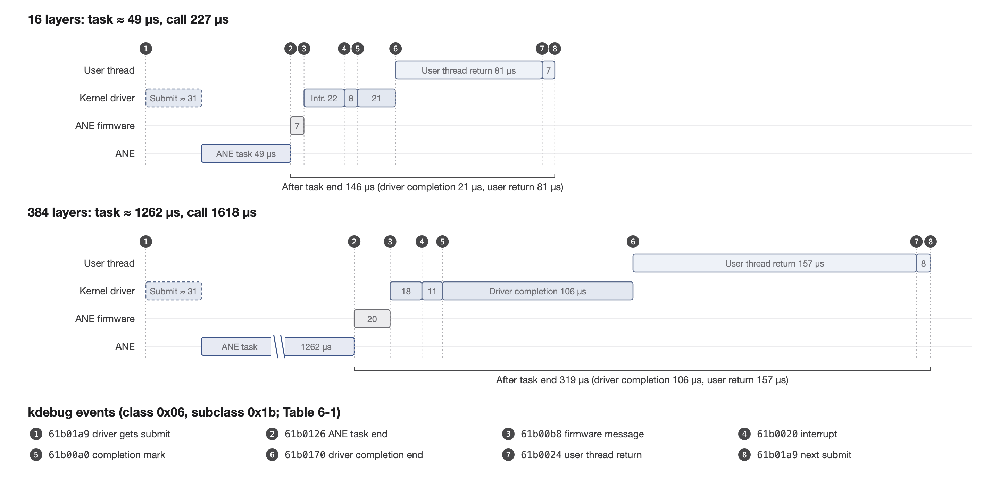

*Figure 6-1. Timeline of one synchronous call (single ANE, 1×1 convolution, 512 channels, 1×128; data: [d1b_stages.txt](../data/04_schedule/d1b_stages.txt)). The upper panel shows 16 layers and the lower panel shows 384 layers. Circled numbers mark kdebug events, and horizontal lengths are drawn to scale in time (the task segment of the 384-layer case is truncated). The submission segment is drawn using the intercept of the linear fit of "submission to task end" against task duration (dashed box, about 31 µs). The overhead after task end increases from 146 µs to 319 µs. The increase is concentrated in the driver completion handling and user-thread return segments, that is, on the host side.*

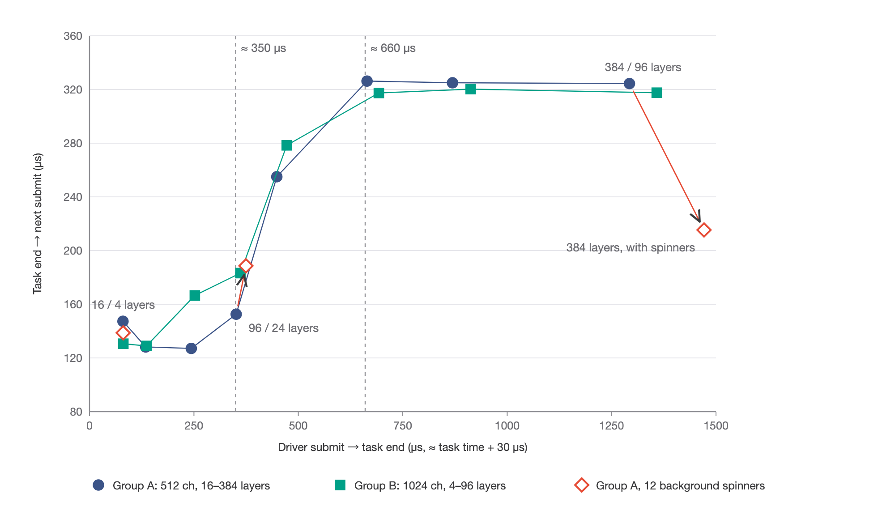

*Figure 6-2. Host overhead after task end as a function of task duration (each point is a median). The horizontal axis is the time from driver submission to task end, which is approximately the task duration plus about 30 µs of submission-side overhead; the vertical axis is the time from task end to the next submission. Group A has 512 channels and 16–384 layers; group B has 1024 channels and 4–96 layers. Each pair of models with equal computation differs in layer count by a factor of four, and the labels give the layer counts for several pairs. The overhead in both groups varies with task duration: it begins to rise above about 350 µs and stabilizes at about 320 µs above about 660 µs, independent of layer count. Hollow diamonds denote group A with 12 spinner processes running in the background, which prevent the CPU from entering deep idle. The overhead for 384 layers falls from 324 µs to 215 µs. The 16-layer and 96-layer models were already in shallow idle, so the spinner processes cannot lower their overhead; the 96-layer model increases slightly because of CPU contention (data: [d1b_stages.txt](../data/04_schedule/d1b_stages.txt)).*

### 6.6 Execution Order Within a Program

#### 6.6.1 Execution Order of Independent Branches

To test whether mutually independent work within one program can execute in parallel, we placed two mutually independent branches in the same model and compared the execution time with that of each branch executed alone. Except for D, the tensors of all branches have shape [1, 512, 1, 128]. There are four kinds of branch. A is a 1×1 convolution chain that mainly occupies the MAC array. B is an elementwise chain, y ← y·u + u, that mainly occupies the PE. T performs bilinear 2× upsampling followed by average pooling and is presumed to occupy the resampling unit. D is a transpose of a 32 MB input that contains almost no computation and mainly occupies the DMA (models generated by [overlap.py](../tools/04_schedule/overlap.py) and [texprobe.py](../tools/04_schedule/texprobe.py)). Each call has a fixed overhead of about 150 µs, so the predicted time when the two branches are fully serialized is X + Y − 150 µs, and the predicted time when they fully overlap is max(X, Y). Table 6-7 gives the results of two rounds of measurement, with each model called 500 times per round (data: [d3_overlap_run.txt](../data/04_schedule/d3_overlap_run.txt), [d3_overlap_run2.txt](../data/04_schedule/d3_overlap_run2.txt)) 〔timing〕.

*Table 6-7. Latency of two independent branches placed side by side (units: µs; 10th percentile)*

| Combination                      | Branch X alone | Branch Y alone | Predicted, full overlap | Predicted, full serialization | Measured    |
| -------------------------------- | -------------- | -------------- | ----------------------- | ----------------------------- | ----------- |
| MAC array + PE (A64 + B64)       | 374            | 224            | 374                     | 448                           | 486–490     |
| MAC array + resampling (A64 + T64) | 374          | 305            | 374                     | 529                           | 542–583     |
| DMA + PE (transpose + B64)       | 1167           | 224            | 1167                    | 1241                          | 1277–1341   |
| DMA + MAC array (transpose + A64) | 1167          | 374            | 1167                    | 1391                          | 1387–1391   |

In all combinations, the measured time equals or is slightly higher than the fully serialized prediction, and no combination approaches the fully overlapped prediction. For the DMA + MAC array combination, the difference from the serialized prediction is within 4 µs. Some combinations are slower than the serialized prediction. This may be because the side-by-side structure adds an output that must be written back, or because the compiler changes the dual-ANE split after the branches are placed side by side: B64 and T64 use both ANEs when executed alone, but only one ANE when combined. As a control, when the output of A64 is fed into B64 to form a truly serial structure, the measured time is 455–456 µs, consistent with the fully serialized prediction.

We also examined the case that Bryngelson [5] inferred from the compiler, in which the MAC array and the PE run simultaneously, namely softmax in parallel with convolution. Because a standalone softmax chain is placed on the CPU by Core ML, we used as the baseline a serial structure in which the output of a convolution chain feeds a softmax. In two rounds of measurement, the 10th-percentile times were 446.0 µs for the parallel structure and 445.6 µs for the serial structure, which are identical (data: [group1_run.txt](../data/04_schedule/group1_run.txt)) 〔timing〕. In the structures tested in this report, this kind of simultaneous parallelism was not observed.

The interpretation of these results needs to distinguish between conclusions that the experiments directly support and mechanisms that cannot be further determined. What the experiments directly show is the execution behavior of the programs tested: in these programs, the time for two independent branches equals the sum of their individual times, and the branches do not overlap. Two levels of cause are possible. The first is compiler scheduling. Each ANE program is a linear TD sequence (Section 5.7), and when the compiler places two branches into the same sequence, it has already fixed their order; this report found no option that causes the compiler to generate parallel TDs. The second is hardware capability. Even if two adjacent TDs in the TD sequence are mutually independent, the hardware may be able to execute them only one at a time. Whole-graph timing cannot distinguish these two cases. Therefore, the experiments in this section cannot establish that the hardware executes only one TD at a time, and they cannot exclude cross-TD parallelism under other program structures or other compilation methods. The dual-slot task queue of the firmware (Section 6.4) shows only that one request can have the next request queued in advance while it executes, which is a mechanism for chaining requests end to end. It likewise cannot establish whether TDs within a program can execute in parallel 〔inferred〕.

What can be established is that, in all programs tested in this report, no cross-TD overlap was observed within a program. The overlaps that were observed all occur within the pipeline inside a single TD. Convolution, bias addition, and ReLU are fused into one hardware layer. The DMA that reads weights overlaps with computation (evidence in Section 7.4.2: a 3×3 convolution on 4×32 must re-read its weights for every layer, the weight-read rate reaches 148–150 GB/s, and the MAC efficiency remains at about 90%; if the two were serialized, the efficiency would be only about half of this). Long chains are fused block by block, so intermediate results are not written back to DRAM. This result agrees with the measurement of maderix [4] on the M4, which found that independent branches save only about 1.1% of the time. Both are whole-graph timings and therefore share the same limitation.

#### 6.6.2 Fixed Overhead per Layer

To estimate the fixed overhead incurred per executed TD, we constructed convolution chains whose computation is negligible: 1×1 convolutions with 32 channels and spatial size 1×32, with layers sharing weights. The computation per layer is 65.5 KFLOP, which at about 21 TFLOPS for a single ANE takes only about 3 ns. Table 6-8 gives the time per call at different layer counts (data: [d6_tiny.txt](../data/04_schedule/d6_tiny.txt)) 〔timing, IOReport〕. The 64-layer model is executed by Core ML on the CPU (ANE0 interrupt count zero), and it is therefore not listed.

*Table 6-8. Latency of convolution chains with negligible computation*

| Layers | Per-call median (two rounds) | ANE0 interrupts (per call) |
| ------ | ---------------------------- | -------------------------- |
| 128    | 163.6 / 164.1 µs             | 1.93                       |
| 256    | 166.0 / 166.4 µs             | —                          |
| 384    | 167.5 / 167.5 µs             | 2.01                       |

From 128 to 384 layers, each call increases by only 3.4 µs, so the marginal time per layer is about 13 ns. Of this, the computation itself accounts for about 3 ns or more, since 32 output channels cannot fill all 16 NEs. Converted at the full-clock frequency of 2.58 GHz, the fixed overhead per layer is at most about 34 cycles, which is of the same order as the 44 cycles that Bryngelson [5] read from the compiler cost model of the M1. Because the ANE is idle for most of the time in such models, the clock may not be at its top state; the time-based upper bound (about 13 ns) is therefore more reliable than the cycle-based bound.

### 6.7 Concurrency

#### 6.7.1 Multiple Processes

The experiment used a model that executes only on ANE0. The model consists of 384 layers of 1×1 convolution with input size 1×128 and 512 channels, with layers sharing weights, and the dual-ANE program generated by its compilation also contains only the ANE0 TD sequence. Two independent processes then simultaneously called this model, with the results shown in Table 6-9 (data: [d2_concurrency.txt](../data/04_schedule/d2_concurrency.txt)) 〔timing, IOReport〕.

*Table 6-9. Two processes calling a single-ANE model simultaneously*

| Case                                                | Per-call median   | ANE0 interrupts (per call) | ANE1 interrupts (per call) |
| --------------------------------------------------- | ----------------- | -------------------------- | -------------------------- |
| Single process                                      | 1598 µs           | 2.00                       | 0                          |
| Two processes, same model file                      | 1795 / 1799 µs    | about 2.84                 | about 2.83                 |
| Two processes, two model files                      | 1796 / 1799 µs    | about 2.84                 | about 2.84                 |
| Two processes, two different models (384 and 256 layers) | 1825 / 1388 µs | present                    | present                    |

When run alone, all requests of this model are handled by ANE0, and the ANE1 interrupt count is zero. When the two processes execute simultaneously, ANE1 shows as many interrupts as ANE0, while each call is only about 12% slower. The combined throughput of the two processes is about 1.78 times that of a single process (2 × 1598 / 1797). This indicates that the driver assigns requests from different processes to the two engines, which execute in parallel. The weights of this model are resident on chip. For how much gain can be obtained on weight-read-bound models, see Section 10.7. This report does not decompose how the 12% per-call slowdown is apportioned among host-side overhead, DRAM contention, and firmware overhead.

#### 6.7.2 Multiple Threads in One Process

We further used multiple threads in the same process to call the model simultaneously. Each thread may share one `MLModel` object, or each may load its own copy. All threads first warmed up for 1 s each, then started together, and called the model continuously for 5 s. Three models were used. A is the single-ANE model described above (384 layers; 1619 µs when run alone). C is a model of the same structure with 256 layers (single ANE; 1195 µs). B is a model with width 256 and 384 layers, whose dual-ANE program uses both ANEs (1691 µs). The results are shown in Table 6-10. Each case was measured in two rounds, and the difference between the two rounds is less than 0.5% (tool: [mtrun.m](../tools/common/mtrun.m); data: [h15_mt.txt](../data/04_schedule/h15_mt.txt), [h15_mt2.txt](../data/04_schedule/h15_mt2.txt)) 〔timing, IOReport〕.

*Table 6-10. Concurrency within one process*

| Case                                  | Combined throughput (calls/s) | Per-call median        | ANE1 interrupts        |
| ------------------------------------- | ----------------------------- | ---------------------- | ---------------------- |
| A, 1 thread                           | 616                           | 1619 µs                | 0                      |
| A, 2 threads, sharing one object      | 616                           | 3237 µs                | 0                      |
| A, 2 threads, one object each         | 617                           | 3237 µs                | 0                      |
| A, 4 threads, one object each         | 617                           | 6476 µs                | 0                      |
| B, 1 thread                           | 587                           | 1691 µs                | Same as ANE0           |
| B, 2 threads                          | 587                           | 3390 µs                | Same as ANE0           |
| A and C, 1 thread each                | 1249 (541 + 708)              | 1823 / 1371 µs         | Comparable to ANE0     |
| B and A, 1 thread each                | 762 (381 + 381)               | 2626 / 2626 µs         | More than ANE0         |
| Control: two processes, each running A | 1117 (2 × 558)               | 1781 µs                | Same as ANE0           |

Table 6-10 shows that, within one process, when multiple threads synchronously call the same compiled program, only one request executes at any instant. Whether the number of threads is increased, or each thread loads its own `MLModel` object, the combined throughput remains unchanged; the per-call time increases in proportion to the number of threads; all requests execute on ANE0; and the number of calls completed by each thread differs by less than one call. By contrast, two different programs (A and C) in the same process can execute in parallel. Their combined throughput is 86% of the sum of their standalone throughputs (616 + 843 calls/s), and each call is about 13% slower, consistent with the 12% observed in the multi-process experiment. The same model in different processes can also execute in parallel; its combined throughput is 1.81 times that of a single process.

Accordingly, when multiple threads synchronously call the same program, the requests are serialized. However, the experiments in Section 10.7 show that asynchronous calls to the same `MLModel` object within one process (`predictionFromFeatures:completionHandler:`) are assigned to both engines and execute in parallel when two or more requests are kept in flight. Therefore, serialization is not a restriction on "the same program" imposed by the driver; it occurs on the path of synchronous calls, and this report has not determined its specific location 〔inferred〕. This behavior is recorded as defect B3 (Appendix D).

When a dual-ANE model and a single-ANE model execute together (B and A), the combined throughput is 762 calls/s, about 25–30% higher than the throughput of the two models run alone (587 and 616 calls/s), and ANE1 shows more interrupts than ANE0. This indicates that some requests of the single-ANE model are assigned to ANE1. We speculate that these requests fill the idle time left by the asymmetric workload of the two ANEs in the dual-ANE program, as well as the firmware overhead between tasks 〔timing, IOReport, inferred〕.

### 6.8 Comparison with the M4 and Other Products

Table 6-11 compares the results of this chapter with data for other products reported in the literature.

*Table 6-11. Comparison of scheduling overhead and concurrency behavior*

| Item                          | M1 (Bryngelson [5])                                  | M4 (maderix [2–4])                                                     | M5 Pro (ANEForge [6])                  | M6 (this report)                                                                                                                                                                                                                                 |
| ----------------------------- | ---------------------------------------------------- | ---------------------------------------------------------------------- | -------------------------------------- | ------------------------------------------------------------------------------------------------------------------------------------------------------------------------------------------------------------------------------------------------ |
| Fixed overhead per call       | About 190 µs, of which the firmware round trip accounts for about 130 µs | About 90 µs (Part 4); 95 µs (Part 2); 160 µs (Part 3)                  | Lower bound of about 70 µs             | Submission side about 30 µs; completion side 130–325 µs                                                                                                                                                                                          |
| Fixed overhead per layer      | 44 cycles (compiler cost model)                      | —                                                                      | —                                      | At most about 13 ns (about 34 cycles)                                                                                                                                                                                                            |
| Overlap of independent branches | —                                                  | Saves about 1.1%                                                       | —                                      | No overlap in the programs measured                                                                                                                                                                                                              |
| Two requests submitted together | 1.04×                                              | Saves about 16%                                                        | Exposes only one hardware channel      | Multithreaded synchronous calls to the same program: 1.00×; two processes: 1.78–1.81× (relative to a single process); two different programs in one process: 86% of the sum of their standalone throughputs; asynchronous calls to the same program: up to 2.8× (relative to synchronous calls, Section 10.7) |

The per-call overheads of the products are consistent in order of magnitude, all lying between about 0.07 and 0.36 ms. The studies define and measure overhead differently, so these values should not be compared directly. maderix calls private interfaces directly and times with host time; Bryngelson reports a stage-by-stage decomposition; and this report uses firmware timestamps to divide the overhead into a submission part and a completion part, finding that the completion-part overhead depends on the idle depth of the host CPU. In terms of concurrency, the fundamental difference between the M6 and single-engine products is that, whenever multiple requests are in flight, the driver can assign them to the second ANE. The resulting throughput varies with load (see Section 10.7). This applies to requests from different programs or different processes, and also to asynchronous requests to the same program within one process (Section 10.7). Only when multiple threads synchronously call the same program are requests serialized (Section 6.7.2), which resembles the observation on the M1 that only one command executes at any instant.

### 6.9 Summary

This chapter analyzed the runtime execution and scheduling mechanisms of the ANE and obtained three basic conclusions that support the subsequent analysis. First, scheduling decisions are made on the host side: the ANE driver selects the priority, engine, and program variant and enforces throttling; the CLPC determines the DVFS state; and the firmware handles queuing and dispatch, although we found no evidence that it participates in selecting states. Second, synchronous calls incur host overhead of about 0.16–0.36 ms outside the ANE task. The completion-side part of this overhead varies with the sleep depth of the host CPU and is independent of layer count, and it necessarily leaves the ANE idle between two calls. Third, whether a single request can use both engines depends on the compiler, whereas the distribution of multiple requests is decided by the driver; requests are serialized only when multiple threads synchronously call the same program. Within the programs measured, mutually independent branches within one program do not overlap.

This chapter has established how requests are scheduled, rather than how much benefit these arrangements bring. How much throughput rises when requests are assigned to two engines, and why the gain on weight-read-bound workloads is far below twofold, are examined in Chapter 10. How the idle time between calls affects the DVFS state is examined in Chapter 12. Still unresolved are the specific location of the serialization on the synchronous-call path (defect B3), the firmware context-switch threshold and the actual latency of preemption, and whether the nonoverlap of independent branches results from compiler scheduling or from a hardware limitation. Deployment recommendations derived from the conclusions of this chapter are concentrated in Section 15.2 (Table 15-1).

## 7. Compute Array

This chapter studies the compute portion of the ANE, namely the multiply-accumulate array formed by 16 NE cores and the planar engine (PE) that performs elementwise operations. It asks how many MACs each NE completes per cycle, which factors limit the utilization of the array, and how convolution kernel shape, data precision, and network depth affect the realized throughput. The evidence comes from three sources: throughput measured with the slope method on Core ML timings and with firmware timestamps from kdebug, the shape fields and output-channel groupings of the TDs in compiled artifacts, and the parameters of the compiler's performance model. The chapter reaches six main conclusions. First, each NE completes 256 FP16 or 512 INT8 MACs per cycle, and the FP16 direct-convolution peak of a single ANE is 21.1 TFLOPS, against a measured marginal throughput of 20.6 TFLOPS. Second, the compiler sets a resident-weight limit of 64 KiB per NE; with FP16, each pass computes at most 16 output channels, and the time steps up when the number of output channels increases from 256 to 272. Third, convolutions with kernel widths of 9 to 15 are rewritten into a stride-2 form whose time is proportional to the number of weight elements; 3×3 convolutions are executed by the hardware Winograd path, which gives an effective throughput of up to 1.47× the direct-convolution peak. Fourth, W8A8 is about 1.8 to 2 times faster than FP16 on compute-dense convolutions (exactly 2 times for 3×3 convolutions), but on 1×1 convolution chains it is limited by the activation path; quantizing only the weights does not raise the MAC peak; compressed weights are read in compressed form, and the compute array skips the MACs of zero weights but not those of zero activations. Fifth, the PE operates in an independent clock domain, and its throughput for single-input operations is about 61 G elements/s per ANE. Sixth, the compiler's performance model is accurate to about 5% for dense, compute-bound layers, but it does not account for Winograd or sparse zero skipping, and it is optimistic about the bandwidth of weight reads and activation DMA.

### 7.1 Test Methodology

The quantity of interest in this chapter is the performance of the MAC array and the PE, but through Core ML only the total time of each call can be observed. That total time includes, besides the computation itself, a fixed overhead of one to two hundred microseconds, which consists of host-side time for submission and completion notification together with the CPU wake-up time that varies with task duration, as described in Chapter 6. When the number of layers is small, this overhead can also overlap with the computation. If the total time of a single model is divided by its amount of compute, the resulting throughput is severely depressed by the fixed overhead and varies with model size. We therefore need a method that separates the per-layer computation time from the total time that the Core ML interface provides.

We use the slope method. Specifically, within each test the shape of every layer is held fixed while only the number of layers is varied. The slope of per-call time against the number of layers serves as the marginal time per layer, and the marginal throughput is then computed from the number of MACs per layer. Because the fixed overhead is independent of the number of layers, it cancels in the slope. To ensure that the measured marginal time reflects only computation, unless stated otherwise, all layers of a model share one set of weights, which keeps the weights resident on chip and thereby eliminates the influence of weight-read bandwidth (model generation: [chain.py](../tools/common/chain.py); timing: [runall.sh](../tools/common/runall.sh), [bondrun.m](../tools/common/bondrun.m)) 〔timing〕.

The slope method is valid only when all points in a set of measurements are in the same execution state. On the ANE, however, four conditions break this premise, and each must be excluded experimentally. First, each call has a floor of about 160 µs. A model whose total workload falls below this floor has a time that barely varies with the number of layers, so the slope obtained from it is meaningless; we therefore use only layer counts whose total workload clearly exceeds the floor. Second, the ANE requires a ramp-up period to go from idle to full speed. Section 11.2.3 measures that the NE clock rises from 852 MHz to above 2448 MHz over about 124–146 ms of ANE execution time, and Chapter 12 explains that the CLPC controls this process. If sampling occurs during ramp-up, models with different numbers of layers sit at different clock states, so before each measurement we run at least 1 s of continuous calls as a warm-up. Third, when the number of layers is varied, the compiler may switch between single-ANE and dual-ANE programs (Section 5.8). The two points on either side of such a switch cannot be used together to fit a slope, so we use the per-ANE interrupt counts in IOReport to confirm the number of engines used at each point. Fourth, Core ML sometimes runs an entire model, or part of its operations, on the CPU without giving any indication. We therefore treat an ANE interrupt count of zero as the identifying flag and discard those points 〔IOReport〕.

Even when these conditions are met, host-side time can still contaminate the timed slope. Section 6.5 shows that the host wake-up overhead after task completion increases with task duration, and task duration increases with the number of layers, so this overhead also appears as a per-layer time. For such measurements, we instead use the firmware-recorded timestamps in kdebug, taking either the interval between ANE task-end events or the "submit → task end" duration (Table 6-1). This gives the execution time of the ANE itself directly 〔kdebug〕. Wherever this chapter reports a result obtained from firmware timestamps, the text says so.

Measurements show how fast the array runs, but they do not directly explain why it runs at that speed. To interpret the measurements, we collected two kinds of evidence from the compiler side. The first is the compiled artifact itself. From each convolution TD in the HWX, one can read the input and output shapes, the size of the output-channel group, and `exe_cycles` (Chapter 5). These fields reflect how the compiler allocates a layer across the 16 NE cores. The second is the compiler's built-in per-TD performance model. Its estimates are normally emitted only on Apple-internal builds of the system. The compile option `DebugMask` passes through a check, `os_variant_has_internal_content("com.apple.ane")`, before it is parsed, and on retail systems this check returns false, so the option is ignored. We wrote a dynamic library ([anevariant.c](../tools/common/anevariant.c)) that, injected through `DYLD_INSERT_LIBRARIES`, makes this check return true only inside our own compilation process. This yields the performance-model estimate for each TD (tool: [perfcsv.py](../tools/05_compute/perfcsv.py); data: [perfcsv/](../data/05_compute/perfcsv/)) 〔compiler〕.

The two kinds of evidence are used together in this chapter. The compiler side supplies the structural parameters of the hardware and the compiler's performance expectations, and the measurement side tests whether these parameters and expectations hold. Only conclusions on which both sides agree are stated as properties of the hardware. Content that appears only in the compiler, and that cannot be verified by measurement through Core ML, is explicitly marked as supported by compiler evidence alone. An example is the higher MAC tier described in Section 7.2.3.

### 7.2 Multiply-Accumulate Operations per NE per Cycle

#### 7.2.1 FP16

We measure the FP16 throughput of a single ANE with a 1×1 convolution chain (512 channels, spatial extent 1×128, with weights shared across layers). This shape is not split across two ANEs, its weights are resident in the NE weight buffer, and its activations remain in L2, so the throughput is limited only by the MAC array. When the number of layers increases from 256 to 384, the marginal time per layer is 3.26 µs, corresponding to a marginal throughput of 20.6 TFLOPS. When the width is doubled to 256, the compiler splits each layer across the two ANEs. The workload per ANE is the same as in the single-ANE case, the marginal time per layer is 3.40 µs, and the marginal throughput is 39.5 TFLOPS, which is 1.92× the single-ANE value (data: [bond_ksweep_run.txt](../data/08_bonded/bond_ksweep_run.txt); Chapter 10) 〔timing〕. The relation between ANE task duration and amount of compute measured with kdebug is 49.0 µs per GFLOP, equivalent to 20.4 TFLOPS, which agrees with the timing slope (Section 6.5.2) 〔kdebug〕.

To convert the measured throughput into a number of MACs per NE per cycle, the full-load clock frequency of the ANE is also required. The system does not provide a frequency reading for the ANE. We obtain this value in Section 11.2.2 from a separate, independent measurement. The ANE starts from idle and runs the same model continuously, and we record the steps in kdebug task duration during ramp-up. Using only the five lowest DVFS states, which are identical in both frequency tables, we fit "duration = constant ÷ frequency + fixed term" and constrain the fit with an independently estimated fixed term limited to 5–12 µs. We then extrapolate to the full-load state, obtaining 2578–2584 MHz. This fit uses only the inverse relation between task duration and frequency and does not depend on any assumption about MAC width made in this section, so using it to convert MAC width does not constitute circular reasoning. Taking 2.58 GHz, the number of MACs per NE per cycle is 20.6 × 10¹² ÷ (2 × 16 × 2.58 × 10⁹) ≈ 249.5. This value differs from 256 by 2.5%, whereas it differs greatly from other candidate values such as 128 or 512. We therefore infer that each NE completes 256 FP16 MACs per cycle, so the direct-convolution peak of a single ANE is 16 × 256 × 2 × 2.58 GHz = 21.1 TFLOPS, and the measured throughput reaches 97.5% of this peak 〔timing, kdebug, inferred〕. The compiler-side estimate is consistent with this value. At the base tier described in Section 7.2.3, the performance model assumes 256 FP16 MACs per NE per cycle. The `exe_cycles` of a 1×1, 512-channel, 64×64 FP16 TD is 104, which, converted at the measured 20.6 TFLOPS, corresponds to almost exactly 104 µs 〔compiler〕.

#### 7.2.2 INT8

The MAC width for INT8 can be inferred from the following three lines of evidence.

First, the compiler's performance model contains the function `perfmodel::GetNumOutputChannelsPerAccumulator`, which returns the number of output channels computed simultaneously by each accumulator. We disassembled this function and `ToPerfHwParams`, which supplies its arguments, and obtained the logic listed in Table 7-1 〔compiler〕.

*Table 7-1. Number of output channels computed simultaneously by each accumulator (compiler performance model)*

| Condition | Source of value | Value |
| --- | --- | --- |
| Non-convolution operations | HAL 0x440 | 1 |
| Small-input mode 3 / 2 | HAL 0x420 | 16 / 8 |
| Small-input mode 1 | HAL 0x430 | 4 |
| Int8 format, or half-work-unit mode | HAL 0x430 | 2 |
| Other (FP16 convolution) | HAL 0x440 | 1 |

Table 7-1 shows that each accumulator computes one output channel for FP16 convolution and two for INT8 convolution. These parameters take the same values on H16, H17, H18, and H19.

Second, the `exe_cycles` values of the TDs in the compiled artifact and the TD shapes give the same ratio. We compiled the same single-layer convolution (3×3, 512 channels, 64×64) into three versions, FP16, W8 (weights-only quantization), and W8A8, and computed the number of MACs per unit of `exe_cycles` for each convolution TD. The values are 10.3 M for both FP16 and W8, and 20.8 M for W8A8, approximately twice the former (tools: [macw.py](../tools/05_compute/macw.py), [macw_td.py](../tools/05_compute/macw_td.py); data: [macw_td.txt](../data/05_compute/macw_td.txt)) 〔compiler, HWX〕. The fact that W8 matches FP16 indicates that, when only the weights are quantized, the INT8 weights are converted to FP16 before they enter the MAC array.

Third, the measured throughput exceeds the FP16 limit. To avoid interference from the hardware Winograd path and from activation bandwidth, we select only 1×1 convolutions (with at least 1024 channels, so that each byte of activation corresponds to enough MACs) and 3×3 convolutions with dilation rate 2, which do not use Winograd. We convert the throughput to MACs per NE per cycle using the number of engines, the 16 NE cores, and 2.58 GHz. The results are shown in Table 7-2 (tools: [mac3.py](../tools/05_compute/mac3.py), [mac3_fit.py](../tools/05_compute/mac3_fit.py); data: [mac3_run.txt](../data/05_compute/mac3_run.txt)) 〔timing〕.

*Table 7-2. MACs per NE per cycle for FP16 and W8A8 (measured)*

| Shape | FP16: engines, time per layer, MACs per NE per cycle | W8A8: engines, time per layer, MACs per NE per cycle | W8A8 ÷ FP16 |
| --- | --- | --- | --- |
| 1×1, 2048 channels, 16×16 | Dual, 77.6 µs, 168 | Single, 60.8 µs, 428 | — |
| 1×1, 1024 channels, 32×32 | Dual, 71.2 µs, 183 | Dual, 40.4 µs, 322 | 1.76 |
| 3×3 dilated 2, 512 channels, 32×32 | Dual, 171.4 µs, 171 | Dual, 91.6 µs, 319 | 1.87 |
| 1×1, 2048 channels, 32×32 | Dual, 257.5 µs, 202 | Dual, 212.4 µs, 245 | 1.21 |

The first row is the most important. The W8A8 version uses only one ANE and reaches 428 MACs per NE per cycle, which is 35.4 TOPS for a single ANE. A 1×1 convolution does not use Winograd, so the FP16 limit is 256, and the INT8 MAC width must therefore be greater than 256. The value 428 corresponds to 84% of 512. The last row is only 1.21× faster because the compiler assigns the W8A8 version to the two ANEs in a ratio of roughly 1:2. In the dual-ANE program, the sums of `exe_cycles` for the two ANEs are 434 and 880. Calculated on ANE1, which carries the larger workload, the value is 326 MACs per NE per cycle. The DRAM read bandwidths of the two ANEs are only 7.8 and 15.6 GB/s, respectively, so neither is bandwidth-limited (defect B8) 〔HWX, timing〕. On the two shapes where both ANEs participate and the split is even, W8A8 is 1.76 to 1.87 times FP16. The utilization of each format against its own limit (512 and 256, respectively) is also similar, at 62–63% and 67–72%.

Combining the three lines of evidence, we infer that with INT8 each NE completes 512 MACs per cycle. In other words, the number of cells in the MAC array is unchanged, and each accumulator computes two output channels at INT8. Accordingly, the direct-convolution peak of a single ANE is 42.3 TOPS for INT8, and that of two ANEs is 84.5 TOPS 〔compiler, HWX, timing, inferred〕. This conclusion is consistent in ratio with the description given by Bryngelson [5], in which INT8 packing outputs "8 channels per core per cycle" and FP16 outputs 4.

#### 7.2.3 Higher Tiers in the Performance Model

The CSV of the performance model shows that the compiler assumes a higher MAC width for some shapes: 512 MACs per NE per cycle for FP16 and 1024 MACs per NE per cycle for INT8. After analyzing the CSVs of 56 single-layer convolutions and several chained models, we found that the tier depends on the work unit (WU) size that the compiler selects for the TD. The number of MACs per NE per cycle is approximately twice the number of pixels per WU, and this relation holds identically for FP16 and INT8. For FP16, a WU of 128 pixels gives 256 MACs and a WU of 256 pixels gives 512 MACs. For INT8, a WU of 256 pixels gives 512 MACs and a WU of 512 pixels gives 1024 MACs. The larger the spatial size, the more likely the compiler is to select a large WU (data: [perfcsv/](../data/05_compute/perfcsv/)) 〔compiler〕.

We attempted to verify the higher tiers by measurement, and the result was negative. Measuring ANE task duration with kdebug, an FP16 2×2 convolution (256 channels, 32×64) gives 257 MACs per NE per cycle, and the same shape in INT8 gives 413 (data: [hi_kt/](../data/05_compute/hi_kt/); tool: [hi_fit.py](../tools/05_compute/hi_fit.py)) 〔kdebug〕. The reason is that these models all execute as dual-ANE programs at run time, with row-wise splitting, so each ANE receives only half of the rows and its WU is halved accordingly. The rows of the CSV that correspond to dual-ANE programs give precisely the base tier (256 for FP16, 512 for INT8), which agrees with the measurements. We did not find any shape for which Core ML executes a single-ANE program with a large WU. After splitting, every block of these shapes exceeds 128 pixels, and under the cost model of Section 5.8.3 the compiler always chooses to split. When two processes execute the same model simultaneously, the driver lets the two processes take turns using the two ANEs, and the programs still execute as dual-ANE programs; the driver did not reassign them to single-ANE programs (data: [hi2_kt/](../data/05_compute/hi2_kt/)) 〔kdebug〕. Therefore, the higher tier exists only for large-WU shapes in single-ANE programs. On the M6, all programs actually executed through Core ML fall at the base tier.

### 7.3 Weight Buffer and Output-Channel Grouping

#### 7.3.1 Output-Channel Grouping

The number of output channels that each NE computes per pass is called the output channel group (OCG) size. A TD may execute multiple passes, so the OCG differs from the number of output channels of the TD. We disassembled the function in the v24 layout that configures the NE and determined that register 0x10 is the NE configuration register. Its bits 0–2 record the OCG size as a base-2 logarithm, and bit 6 is the half-work-unit mode. Field tracing shows that the half-work-unit mode is enabled only in W8A8, and that the OCG of depthwise and grouped convolutions is 1 and 2, respectively (Table 5-13). We then compiled single-layer convolutions with kernel shapes 1×1, 1×3, 3×1, 2×2, 3×3, 5×5, and 7×7, input channels from 16 to 512, and precisions FP16 and W8A8 (spatial size 32×32), and read the OCG of each TD. Table 7-3 gives the FP16 results (tool: [ocg.py](../tools/05_compute/ocg.py); data: [ocg_table.txt](../data/05_compute/ocg_table.txt)) 〔compiler, HWX〕.

*Table 7-3. OCG size for FP16 convolution*

| Kernel | Cin = 16 | 64 | 256 | 512 |
| --- | --- | --- | --- | --- |
| 1×1, 3×1, 2×2 | 16 | 16 | 16 | 16 |
| 5×5 | 16 | 16 | 4 | 2 |
| 7×7 | 16 | — | 2 | 1 |
| 3×3, 1×3 (Winograd) | 1 | 1 | 2 | 2 |

Except for Winograd convolutions, the OCG values in Table 7-3 all satisfy the following relation:

```
OCG = min(16, the largest power of 2 such that OCG × Cin × kH × kW × 2 B ≤ 64 KiB)
```

For example, a 2×2 convolution with 512 channels has exactly 16 × 512 × 4 × 2 B = 64 KiB. The OCG for W8A8 is likewise limited by 64 KiB, except that each weight is counted as 1 byte. This is a further independent piece of evidence that each NE has a 64 KiB weight buffer. It agrees with the conclusion drawn in Section 5.6 from the number of TDs for larger inputs, and with the 64 KiB "resident-weight limit" in the HAL parameter table. Winograd convolutions have very small OCGs (1–2) and are not limited by the weight buffer. For a 3×3 convolution with 256 channels, the transformed weights amount to only 2 × 256 × 16 × 2 B = 16 KiB per NE per pass. We conjecture that they are limited by accumulator capacity, because each output must accumulate a 4×4 block in the transform domain 〔inferred〕.

The upper limit of 16 for the OCG agrees with the NE work unit of 16 in the HAL. From this one may conjecture that the 256 MACs per NE per cycle are organized as 16 output channels × 16 input channels (or 16 pixels), but this report cannot distinguish between the two possibilities 〔inferred〕. The accumulator file depth of "8" reported by Bryngelson [5] has no direct counterpart in the M6 OCG, and the units of the two may differ.

#### 7.3.2 Steps in the Output-Channel Count

Because the OCG upper limit is 16 and each ANE contains 16 NE cores, a single pass can cover at most 256 output channels. When the number of output channels exceeds 256, the computation must be completed in multiple passes, and the input data are reread in each pass. To verify this, we measured the per-call time of a 1×1 convolution chain (spatial extent 1×128, single ANE, weights shared across layers) as the channel count C increases from 192 to 1024 in steps of 16. For each channel count we measured two models, with 32 and 160 layers (data: [b2b_run.txt](../data/05_compute/b2b_run.txt)) 〔timing〕. The models with these two layer counts often fall in two different host wake-up states described in Section 6.5, in which the interrupt count per call is about 2 for one and about 3 for the other. Computing the per-layer time from the difference of two points incorporates the difference in overhead caused by the state switch, so the absolute value obtained is too large. For example, at 512 channels it is 4.69 µs, whereas Section 7.2.1 measures 3.26 µs for the same shape over the 256–384-layer range, where both points are in the same state. We therefore do not use the difference of two points. Instead, we compare only measurement points in the same state. For C from 192 to 352, the interrupt count per call of the 160-layer model is about 3 throughout, so these points are in the same state, and their per-call times are given in Table 7-4.

*Table 7-4. Per-call time of the 160-layer 1×1 convolution chain versus channel count (same host wake-up state)*

| C | Per-call time | Increment relative to previous step | Interrupts per call |
| --- | --- | --- | --- |
| 192 | 217.1 µs | — | 3.16 |
| 208 | 253.0 µs | +35.9 µs | 3.02 |
| 224 | 262.6 µs | +9.6 µs | 3.03 |
| 240 | 293.8 µs | +31.2 µs | 3.04 |
| 256 | 302.7 µs | +8.9 µs | 3.02 |
| 272 | 359.7 µs | +57.0 µs | 3.06 |
| 288 | 371.6 µs | +11.9 µs | 3.01 |
| 304 | 383.5 µs | +11.9 µs | 3.05 |
| 320 | 394.9 µs | +11.4 µs | 3.04 |
| 336 | 411.5 µs | +16.6 µs | 3.04 |
| 352 | 423.1 µs | +11.6 µs | 3.04 |

In Table 7-4, when C increases from 256 to 272, the per-call time increases by 57.0 µs, which is the largest increment up to 352. The steps from 272 to 352 each add only 11–17 µs per 16 channels, whereas the increments below 256 alternate between about 9 µs and 31–36 µs. The position of this step corresponds exactly to the limit of 256 output channels per pass, and it is consistent with the output-channel grouping of the compiled artifact (Section 7.3.1). However, the increments below 256 themselves alternate between about 9 µs and 31–36 µs. This report has not explained the source of this alternation, and the existing data cannot fully exclude that part of the increment at 272 comes from the same alternation. Therefore, the correspondence between the step and 256 channels per pass remains an inference 〔timing, HWX, inferred〕. Because the existing data cannot yield an accurate per-layer time, this report does not give the magnitude of the step as a percentage. Bryngelson [5] reports that on the M1 the time becomes 3 times larger when the output-channel count increases from 192 to 256, and the M6 shows no such steep step. We conjecture that the reason is that the input tensor of this shape is very small (256 KB when C = 1024), fully resides in L2, and the cost of rereading the input is small 〔inferred〕. Figure 7-1 shows the per-call time of the 160-layer model as a function of channel count.

The case above 352 cannot be judged by the same method. The three steps from 368 to 400 remain in the same wake-up state (interrupt counts 3.00–3.26), but their increments are generally larger: 352 → 368 is +51.4 µs and 384 → 400 is +68.1 µs, both larger than 256 → 272. This report does not provide an analysis of the cause at present. Therefore, the only supportable statement is that the 256 → 272 step is prominent within 352, not that it is the only step over the entire range 〔timing〕. At 400 → 416, the interrupt count of the 160-layer model drops from 3.00 to 2.03, and thereafter it is largely in another wake-up state (with the exception of C = 832, where the interrupt count is 3.01). Increments across this switch cannot be compared directly. The 512 → 528 and 768 → 784 points also show large increments, but the 160-layer models happen to lie between two states at these points (interrupt counts 2.34 and 2.08, respectively, and C = 960 shows a similar situation), so it cannot be confirmed whether they are real steps.

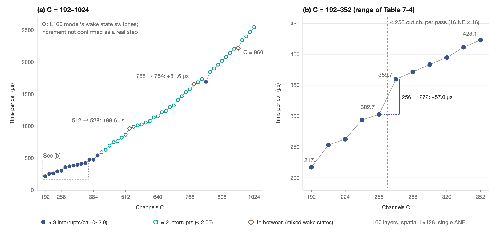

*Figure 7-1. Per-call time of the 160-layer 1×1 convolution chain (1×128, single ANE) as a function of channel count C. (a) C = 192–1024. Markers distinguish host wake-up states by the interrupt count per call; at the diamonds, the two states are mixed, and the increments on either side cannot be confirmed as real steps. (b) Enlarged view of the range of Table 7-4. When C increases from 256 to 272, the per-call time increases by 57.0 µs (data: [b2b_run.txt](../data/05_compute/b2b_run.txt)).*

#### 7.3.3 Utilization with Few Output Channels

The compiler divides a layer across the 16 NE cores by output channel. We measured the marginal throughput of 1×1 convolution chains with 32–256 channels at a very large spatial extent (1×8192, split across two ANEs): 14.3 TFLOPS at 32 channels, 23.6 TFLOPS at 64 channels, 31.6 TFLOPS at 96 channels, and 35.7 TFLOPS at 192 channels (data: [group1_run.txt](../data/04_schedule/group1_run.txt)) 〔timing〕. The compiled artifacts show that at 16, 32, and 64 channels the weights are split into 16 parts, and at 16 channels each NE receives one output channel. In other words, as long as the number of output channels is at least 16, all 16 NE cores are enabled. When the number of channels is small, the throughput is low. We conjecture that the reason is the small workload per NE and the short accumulation length, not that any NE is idle 〔HWX, timing, inferred〕.

For layers with few channels and a large spatial extent, array utilization is generally low, so one may consider rearranging the data to convert the spatial dimension into the channel dimension, thereby improving utilization. The space_to_depth (S2D) transformation is such a rearrangement. Table 7-5 compares the throughput before and after the transformation for a 32-layer 1×1 convolution chain with 64 channels and a 128×128 spatial extent, and it compares these results with the M4 results of maderix [4] (tool: [s2d.py](../tools/05_compute/s2d.py); data: [b8_s2d_run.txt](../data/05_compute/b8_s2d_run.txt)) 〔timing〕.

*Table 7-5. Effect of space_to_depth on throughput (32-layer 1×1 convolution chain)*

| Model | Time | M6 throughput | M4 throughput [4] |
| --- | --- | --- | --- |
| 64 channels, 128×128, direct execution | 450 µs | 9.5 TFLOPS | 3.92 TFLOPS |
| S2D(4) → 1024 channels, 32×32 → D2S(4) | 2168 µs | 31.7 TFLOPS | 16.37 TFLOPS |
| Direct input of 1024 channels, 32×32 | 2149 µs | 32.0 TFLOPS | — |
| S2D(2) → 256 channels, 64×64 → D2S(2) | 876 µs | 19.6 TFLOPS | — |
| Direct input of 256 channels, 64×64 | 874 µs | 19.7 TFLOPS | — |

S2D(4) raises throughput to 3.3× the original. Compared with a model whose input is directly the transformed shape, the overhead of S2D and D2S is about 0.9% for block = 4 and about 0.2% for block = 2. maderix [4] reports that on the M4 the compiler implements S2D(2) as a convolution with one-hot weights, with an overhead of 2.8–3.1%; this problem does not occur on the M6.

The models before and after transformation in Table 7-5 are not equivalent. The 1×1 convolution after S2D(4) acts on 1024 channels, so each layer has 16 times the compute of the original model (1024² × 32² versus 64² × 128²) and 256 times the weights. The semantics of the model also change: it mixes all channels within each 4×4 block of pixels, whereas the original model mixes channels only within a single pixel. Therefore, although throughput increases by 3.3×, the total time increases from 450 µs to 2168 µs. To implement the original model exactly with S2D, the transformed convolution weights must form a block-diagonal matrix composed of 16 identical 64×64 blocks. Executed as an ordinary convolution, this still requires 16 times the compute, and the total time does not shorten; using a grouped convolution instead keeps the amount of compute unchanged. The conclusion supported by Table 7-5 is therefore the following. On the ANE, shapes with many channels and small spatial extent utilize the MAC array better than shapes with few channels and large spatial extent, and the overhead of S2D and D2S themselves is negligible. Table 7-5 does not show that inserting S2D into an existing model speeds it up. The conclusion is more meaningful for model design. For example, when designing a network, one may replace an early high-resolution, few-channel stage with a structure that first reduces resolution and then increases the number of channels, such as patch embedding 〔timing, inferred〕.

### 7.4 Convolution Kernel Shape

#### 7.4.1 Directly Encoded Kernel Widths and Compiler Rewriting

From the convolution configuration word (Table 5-9), we read the Kw, Sx, and Ox fields for different kernel shapes. The results are shown in Table 7-6 (tool: [convcfg.py](../tools/03_compile/convcfg.py); data: [convcfg_scan.txt](../data/03_compile/convcfg_scan.txt), [ks4_hwx/](../data/05_compute/ks4_hwx/)) 〔HWX〕. The per-layer TD counts in the table are for a 16×32 input. For smaller inputs such as 4×32 and 8×32, a rewritten kernel has only one TD per layer (Section 5.6).

*Table 7-6. Encoding of different kernel shapes (256 channels, 16×32)*

| Kernel | Kw in configuration word | Sx | Ox | TDs per layer | Treatment |
| --- | --- | --- | --- | --- | --- |
| 1×3 to 1×8 | 3–8 | 1 | 1 | 1 | Native execution |
| 1×9 | 10 | 2 | 2 | 3 | Rewritten |
| 1×11 | 12 | 2 | 2 | 4 | Rewritten |
| 1×15 | 16 | 2 | 2 | 6 | Rewritten |
| 1×16, 1×17 | — | — | — | — | Compilation failure |
| 7×1, 9×1, 15×1 | 1 | 1 | 1 | 1, 2, 2 | Native execution |
| 3×3, 5×5, 7×7 | 3, 5, 7 | 1 | 1 | 2, 4, 8 | Native execution |

Table 7-6 shows that the largest kernel width that the compiler encodes directly with stride 1 is 8. Below, such kernels are called "native kernels." For kernel widths of 9–15, the compiler rewrites the convolution into a form with horizontal stride 2. The Kw in the configuration word is the kernel width plus one, padded to an even number (9 → 10, 10 → 12, ..., 15 → 16), Sx = 2, and Ox = 2. Each step therefore produces two adjacent output pixels. The output-width field correspondingly becomes half of the actual width, and the weights are stored as two kernel sets offset by one position. After rewriting, the weight amount per input–output channel pair is about 2 × (kernel width + 1). For example, a 1×9 convolution after rewriting corresponds to about 19.3 taps on average. This value is obtained by dividing the weight-segment byte count by (input channels × output channels × 2 B), so it is not an integer number of taps. The values for 1×9, 1×10, and 1×12 (19.3, 21.5, and 25.8) are all below 2 × Kw (20, 24, and 28), which indicates that the two offset kernel sets are not stored in full at these widths. For 1×15 the value is 32.05, comparable to 2 × 16 〔HWX〕. This is because the rewritten kernels use a sparse weight format, in which the zeros produced by padding do not need to be physically stored in the weight segment (Section 7.4.2). When the kernel width reaches 16, the rewritten Kw would exceed 16, and `ANECCompile` returns an error for 1×16 and 1×17 convolutions. Under Core ML execution, the segmenter determines at the segmentation step that such convolutions cannot be placed on the ANE (Section 5.2), and it places them on the CPU without reporting an error at load time. The test models in this section that consist of such convolutions therefore execute entirely on the CPU, and their per-layer time is 4–7 times that of a 1×15 convolution 〔HWX, timing〕. The upper limit of 15 on FP16 convolution kernel width given by Bryngelson [5] corresponds, in the compiled artifact, to direct stride-1 encoding up to width 8, and to a stride-2 rewrite up to width 15. No such limit applies vertically: kernels of height up to 15 are all encoded directly with stride 1, and 17×1 convolutions also compile. The M4 compilation target h16g and the H17-generation target h17s likewise rewrite 1×9 convolutions into the form Sx = 2, Ox = 2, except that the Kw in the configuration word is written as 9 (`0x6008c049`). Starting with h18, it is written as 10 (`0x6008c04a`) (data: [tdv/](../data/03_compile/tdv/)) 〔HWX〕.

The limits above are all derived from the compiler's encoding scheme. The two boundaries of 8 and 16 indicate that the compiler considers the hardware not to support kernels wider than 8 at stride 1, and not to support Kw above 16 at stride 2. We have not executed programs with Kw greater than 8 at stride 1, so we cannot rule out that the hardware itself supports wider kernels and that the compiler chooses rewriting for efficiency or other reasons 〔compiler, inferred〕.

#### 7.4.2 Kernel Shape and Efficiency

To determine the effect of kernel shape on efficiency, we measured chains of 2–24 layers (256 channels, weights shared across layers) for 24 kernel types (1×1 through 1×15, odd-sized kernels from 3×1 through 15×1, 3×3, and 5×5) at four spatial sizes: 4×32, 8×32, 16×32, and 32×32. Because the firmware's task-start events were not recorded in this group of single-ANE experiments, we timed every run uniformly from "submission → last task end," and we fit slopes using only layer counts with the same engine mode (tools: [ks4_ktrace.sh](../tools/05_compute/ks4_ktrace.sh), [ks4_fit.py](../tools/05_compute/ks4_fit.py); data: [ks4_fit.txt](../data/05_compute/ks4_fit.txt), [ks4_kt/](../data/05_compute/ks4_kt/)) 〔kdebug〕. Table 7-7 lists the efficiency of selected kernel shapes relative to the direct-convolution peak (21.1 TFLOPS for a single ANE and 42.3 TFLOPS for two ANEs).

*Table 7-7. Efficiency of different kernel shapes relative to the direct-convolution peak*

| Kernel | Single ANE, 4×32 | Single ANE, 8×32 | Dual ANE, 16×32 | Dual ANE, 32×32 |
| --- | --- | --- | --- | --- |
| 1×1 | 91% | — | 75% | 78% |
| 3×1 | 94% | 94% | 61% | 79% |
| 1×3 | 136% | 130% | 132% | 121% |
| 1×5 | 94% | 88% | 91% | 96% |
| 1×8 | 94% | 84% | 97% | 99% |
| 1×9 | 42% | 85% | 43% | 86% |
| 1×12 | 42% | 85% | 76% | 88% |
| 1×15 | 42% | 85% | 42% | 86% |
| 9×1 | 91% | 92% | 73% | 83% |
| 15×1 | 91% | — | 96% | 98% |
| 3×3 | 90% | 131% | 79% | 114% |
| 5×5 | 90% | — | 97% | 95% |

Table 7-7 shows that the kernel shape by itself does not reduce efficiency. Native kernels (horizontal kernels with width no greater than 8, and vertical kernels with height up to 15) reach 90–95% efficiency at the single-ANE 4×32 shape and 84–98% at 8×32. The 1×3 and 3×3 convolutions, whose efficiency exceeds 100%, use the hardware Winograd path (Section 7.4.3). The 1×1 and 3×1 convolutions have lower efficiency in dual-ANE mode (61–79%). Compared with the ideal value obtained by scaling the single-ANE result by the number of rows, the dual-ANE 16×32 shape incurs an additional overhead of about 0.4 µs per layer for 1×1 and 2.8 µs for 3×1. These are much larger than the approximately 0.14 µs cited in Section 10.3, so they cannot be explained by a general cooperation overhead. Possible sources include the overlapping rows read by vertical kernels after row splitting (Section 5.8.3), and other overheads when the computation per layer is small 〔inferred〕. The 9×1 and 3×3 convolutions also reach only 73% and 79% on the dual-ANE 16×32 shape. A "—" in the table indicates that no measurement point exists for this shape in this engine mode, because the compiler selected another mode.

Rewritten kernels (1×9 through 1×15) show a completely different pattern: the time per layer is proportional to the amount of weights and independent of the number of rows. For example, the 1×9 convolution has the same per-layer time at 4×32 and at 8×32 (17.00 µs and 16.89 µs, respectively), so its efficiency at 4×32 is only half of that at 8×32. Using the per-layer time and a weight-read bandwidth of 150 GB/s to back-calculate the number of taps per channel pair, we obtain 19.3, 23.5, and 32.0 for 1×9, 1×11, and 1×15, respectively. These differ from the weight amounts read from the compiled artifact by less than 0.5%. Rewriting doubles the weight amount per layer, to 2.5–4.2 MB, which far exceeds the 64 KiB per-NE resident limit, so the weights must be reread for every layer.

However, these layers are not limited by DRAM weight-read bandwidth. After quantizing the weights of the 1×9 convolution to Int8, the per-layer time does not shorten (Section 7.5). Therefore, the time of the rewritten kernels is proportional to the number of weight elements rather than to the number of weight bytes. The bottleneck is a stage metered per weight element, at a rate of about 75 billion weights per second. The relation "FP16 weight bytes ÷ 150 GB/s" agrees with the measurement only because, when converted at FP16, this rate happens to be close to the weight-read bandwidth 〔kdebug, HWX, inferred〕. Sections 10.4 and 10.7 show that when both engines execute this type of layer simultaneously, they slow each other down, which indicates that the stage is shared by the two engines.

Native kernels whose weights exceed 64 KiB likewise must be reread for every layer. For example, 3×3, 5×5, and 11×1 through 15×1 convolutions at 4×32 imply back-calculated weight-read rates of 148–150 GB/s. For native kernels, the 2048-channel 1×1 convolution of Section 7.5 confirms that the time does vary with the number of weight bytes. The efficiency of these shapes is almost exactly 90%, because 4×32 (128 pixels) lies at the balance point between computation and weight reading: each FP16 weight read supports 128 MACs, and full-speed computation requires about 165 GB/s of weight-read bandwidth.

Field tracing and disassembly of the compiler offer a possible explanation for this bottleneck. When deciding the weight format, the compiler computes the fraction of zeros introduced by rewriting, and it switches to a sparse weight format when this fraction exceeds 1/7. There are also cases, such as dilated convolution, in which the upstream stage directly marks the layer as "must compress." According to the estimate of the compiler function `CalculateSparsityFromPadding`, the padding fraction after rewriting a stride-2 convolution is 0.4375, and that of the rewritten kernel of width 9 is 0.55. Both exceed the threshold. This is the ratio that the compiler derives from the rewriting method. When back-calculated from the size of the weight segment in the compiled artifact, the padding zeros amount to only about 6–10% of the elements actually stored by the rewritten kernel (for 1×9, 2 of 20 elements). This shows that the decision is based on the estimated value, not on the zeros actually stored. Ordinary 3×3 and 5×5 convolutions have no padding and do not use the sparse format 〔compiler〕. In other words, rewritten kernels of width 9–15, dilated convolutions, stride-2 convolutions, and bilinear upsampling all execute sparse weights on the hardware, relying on the zero-skipping hardware described in Section 7.5 to avoid the padding zeros. This explains two phenomena of rewritten kernels: their weight segments are smaller than two full kernel sets, and the throughput of dilated convolution is markedly lower than that of an ordinary 3×3 convolution (Section 7.4.3). We further conjecture that the shared stage described above, metered per weight element, is the decoding stage of the sparse weights. It processes compressed weights on an element basis, so quantizing to Int8 cannot speed it up, and it contends between the two ANEs when both are in use 〔inferred〕. This conjecture is compatible with the observation in the pruning experiments of Section 7.5 that the speedup does not reach the non-zero fraction. In this decision, the compiler considers only the zeros introduced by rewriting and does not scan the weights for zeros. Zero weights written as ordinary constants therefore do not trigger the sparse format (Section 7.5).

Under dual-ANE execution, the efficiency of rewritten kernels depends on the splitting method. The 1×9, 1×10, 1×11, and 1×15 convolutions at 16×32 are split by rows, so both ANEs read a full copy of the weights and share the above bottleneck, and their efficiency is only 42–43%. The 1×12 through 1×14 convolutions are split by output channel, with efficiency of 73–77% (Section 10.4, defect B9).

#### 7.4.3 Hardware Winograd

On a 3×3 convolution chain with 512 channels and a 16×16 spatial extent, the FP16 marginal throughput of a single ANE reaches 31.0 TFLOPS, which is 1.47× the direct-convolution peak. By contrast, a 3×3 convolution with dilation rate 2, which cannot use Winograd, achieves only 14.6 TFLOPS per ANE, about 70% of the direct-convolution peak (data: [h10_w8a8_k3.txt](../data/05_compute/h10_w8a8_k3.txt), [h10_dilation.txt](../data/05_compute/h10_dilation.txt)) 〔timing〕. The weight-segment size in the compiled artifact is exactly 512 × 512 × 9 × 2 bytes, which means that the raw 3×3 weights are stored and the Winograd transform is performed in hardware. This is consistent with the conclusion, reached by Bryngelson [5] through reverse engineering, that the Winograd transform matrices are fixed in hardware 〔HWX〕. F(2×2, 3×3) would theoretically reduce the number of multiplications to 1/2.25, and the measurement achieves about 65% of this theoretical speedup. 1×3 convolutions also exceed the direct-convolution peak, corresponding to the one-dimensional Winograd bit (`1DWinograd`, bit 27) in the TD task information word 〔HWX〕.

The compiler's performance estimation model does not take the Winograd transform into account. For the TD of a 3×3 convolution with 512 channels and 16×16, `exe_cycles` is 58 per layer, and the performance model estimates 58.8 µs per layer. The measured value, obtained in this section and in Section 7.5 over two rounds, is 39–44 µs per layer. This is about 1.3–1.5 times faster, which is comparable to the speedup from Winograd (Section 7.8) 〔compiler, timing〕. Furthermore, Winograd is not enabled for all 3×3 convolutions. Field tracing shows that, among the 3×3-type convolutions traced, the Winograd bit in the task information word is 1 only for ordinary 3×3 and grouped 3×3 convolutions. Depthwise convolution, 5×5, dilated convolution, and stride-2 convolution all have 0 (Table 5-13), which is consistent with the measured results for dilated convolution above 〔compiler, timing〕. However, on a 3×3 convolution chain with 256 channels and an 8×16 spatial extent, the marginal throughput is only 15.3 TFLOPS. This indicates that even for ordinary 3×3 convolutions, some shapes do not use Winograd. The conditions that determine this for the shape are not established in this report.

### 7.5 Low-Precision and Compressed Weights

We used coremltools to generate two low-precision models. The W8A8 model quantizes the activations with `linear_quantize_activations` using calibration, and simultaneously quantizes the weights to Int8. The W8 model quantizes only the weights to Int8 and leaves the activations in FP16 (tool: [w8a8.py](../tools/05_compute/w8a8.py)). Table 7-8 gives the marginal throughput of W8A8 and FP16 for three shapes (data: [h10_w8a8_slope.txt](../data/05_compute/h10_w8a8_slope.txt), [h10_w8a8_k3.txt](../data/05_compute/h10_w8a8_k3.txt)) 〔timing, IOReport〕.

*Table 7-8. Marginal throughput of W8A8 and FP16*

| Shape | Engines | FP16 | W8A8 | W8A8 ÷ FP16 | DRAM read bandwidth per ANE under W8A8 |
| --- | --- | --- | --- | --- | --- |
| 1×1, 512 channels, 1×128 | Single | 20.6 TFLOPS (17.6–18.4) | 27.5 TOPS | 1.34 (1.5) | 22–28 GB/s |
| 1×1, 512 channels, 1×256 | Dual | 39.5 TFLOPS (Section 10.3) | 38.6 TOPS | 0.98 | 23.5 GB/s |
| 3×3, 512 channels, 16×16 | Single | 31.0 TFLOPS | 62.1 TOPS | 2.0 | 20–27 GB/s |

In the compute-dense 3×3 convolution, the throughput of W8A8 is exactly 2 times that of FP16, which agrees with the INT8 MAC width inferred in Section 7.2.2. Including Winograd, the effective throughput of W8A8 on a single ANE reaches 62.1 TOPS. However, this 2× advantage does not extend to the 1×1 convolution chain. On a single ANE, W8A8 is only about 1.3–1.5 times faster than FP16, and on dual ANEs it is essentially equal to FP16. The range of the single-ANE speedup arises from differences in fitting intervals. The W8A8 throughput slope is fitted from data over 128–384 layers, whereas the FP16 throughput of 20.6 TFLOPS given above uses data over 256–384 layers, which corresponds to a speedup of about 1.3. If the fit uniformly uses 128–384 layers, the FP16 throughput in the same data file is 17.6–18.4 TFLOPS (the values in parentheses in the table), which corresponds to a speedup of about 1.5. Because the measurement points at 128 and 384 layers lie in different host wake-up states (Section 6.5.3), both conventions carry a certain degree of error. Both yield speedups clearly below the ideal 2× (data: h10_w8a8_slope.txt). The IOReport bandwidth data provide a clue to this difference. The DRAM read bandwidth in the FP16 test is nearly zero, which indicates that the activation tensors can remain resident in the on-chip cache. By contrast, the W8A8 convolution chain produces a sustained DRAM read traffic of about 22–28 GB/s per ANE. Because the layers share weights and the total weight amount is only about 260 KB, this traffic is unlikely to come mainly from weight reads. Further, back-calculating from the read bandwidth and the single-layer execution time, each ANE reads about 64–81 KB per layer, which is of the same order as the 64 KB of Int8 activation data that one layer processes. The compiled artifact further shows that each W8A8 layer is split into three types of TD: input quantization (PE), convolution, and output dequantization. Combined with the above bandwidth characteristics, we infer that quantization and dequantization break the on-chip activation residency of the FP16 convolution chain, so activations pass through DRAM between layers. The performance of 1×1 convolutions is therefore progressively limited by activation data movement, and it cannot fully realize the 2× throughput advantage of the INT8 MAC array 〔timing, IOReport, HWX, inferred〕.

However, this explanation does not fully close quantitatively. The measured read bandwidth of 22–28 GB/s is still below the activation-path limit measured in Section 9.4.2 (about 35–40 GB/s per ANE), and the write traffic in IOReport is close to the noise floor. This does not fully match a simple model in which activation data must be written back to DRAM in full. Therefore, the existing evidence supports that the W8A8 1×1 convolution is affected by additional data-movement overhead, but it is not sufficient to determine the complete path of these traffic streams or their specific bottleneck.

Quantizing only the weights (W8) does not raise the MAC peak. The compiler's performance model gives W8 the same MAC efficiency as FP16 (Section 7.2.2), so on compute-bound layers W8 gives no speedup. On a 1×1 convolution chain with 512 channels and 32×32 (about 32 KiB of weights per NE, resident on chip), W8 and FP16 take nearly identical time (1011–1012 µs for 48 layers each). This agrees with the above performance model and with the conclusion of maderix [4] on the M4 (260.4 µs for Int8 weights and 260.5 µs for FP16 weights) (data: [b6_q8_run.txt](../data/05_compute/b6_q8_run.txt)) 〔timing〕. The effect of W8 is to reduce the number of bytes read for weights and the occupancy of the weight buffer. A 3×3 convolution with 512 channels can accommodate 224 output channels per TD under W8, but only 96 under FP16. Under W8, each NE takes 14 × 512 × 9 × 1 B = 63 KiB per pass, which remains within 64 KiB. Under FP16, each NE has only 6 output channels per pass (54 KiB), whereas 64 KiB would allow 7 〔HWX〕. However, "not raising the MAC peak" does not mean "not improving model speed." For weight-read-bound layers, a narrower weight format may shorten the weight-reading time in proportion to the number of bytes.

To measure this gain directly, we constructed a weight-read-bound native shape: a 1×1 convolution with 2048 input and 2048 output channels, a spatial extent of 32 pixels, and distinct weights in each layer. The FP16 weights of each layer amount to about 8.4 MB, of which each NE receives 512 KiB, far exceeding the 64 KiB resident limit. At about 150 GB/s, reading the weights takes about 56 µs, whereas the computation takes only about 13 µs. Using coremltools, we generated several versions from the same FP16 weights: W8, 6-, 4-, 3-, and 2-bit palettization, grouped-channel palettization (4-bit), int4 block-wise quantization, and vector palettization (`cluster_dim` of 2 and 4). For each version we took 16 and 32 layers and obtained the per-layer time from the difference in kdebug task duration (tools: [wfmt_gen.py](../tools/05_compute/wfmt_gen.py), [wfmt.sh](../tools/05_compute/wfmt.sh), [wfmt_fit.py](../tools/05_compute/wfmt_fit.py), [hwx_kern.py](../tools/05_compute/hwx_kern.py); data: [wfmt.txt](../data/05_compute/wfmt/wfmt.txt)). The results are shown in Table 7-9 〔kdebug, HWX〕.

*Table 7-9. Effect of weight format on weight-read-bound layers (1×1 convolution, 2048 channels, 32 pixels, distinct weights per layer)*

| Weight format | Weights per layer (HWX) | Time per layer | Relative to FP16 | Weight-read bandwidth from weight bytes | Engines used |
| --- | --- | --- | --- | --- | --- |
| FP16 | 8.39 MB | 52.8 µs | 1.00 | 159 GB/s | ANE0 |
| W8 | 4.20 MB | 30.8 µs | 0.58 | 136 GB/s | ANE0 |
| 6-bit palettization | 3.15 MB | 23.6 µs | 0.45 | 134 GB/s | ANE0 |
| 4-bit palettization | 2.10 MB | 16.8 µs | 0.32 | 125 GB/s | ANE0 |
| 4-bit grouped-channel palettization | 2.11 MB | 16.7 µs | 0.32 | 126 GB/s | Two ANEs |
| 3-bit palettization | 3.15 MB (1.57 MB per ANE) | 12.0 µs | 0.23 | See text | Two ANEs |
| 2-bit palettization | 2.10 MB (1.05 MB per ANE) | 8.4 µs | 0.16 | See text | Two ANEs |
| int4 block-wise quantization | Compilation failed | — | — | — | Entire model on CPU |
| Vector palettization (2-D, 4-D) | Compilation failed | — | — | — | Entire model on CPU |

Table 7-9 shows that, on weight-read-bound native layers, the hardware reads the compressed weights directly. The weights in the compiled artifact remain in compressed form, and the single copy stored by one ANE shrinks exactly in proportion to the bit width. The per-layer time decreases with the number of weight bytes. For the formats that use only one ANE, the bandwidth computed from weight bytes lies between 125 and 159 GB/s, which is comparable to the weight-read bandwidth measured in Section 9.3. This shows that the weights are not expanded to FP16 before being read. Compared with FP16, W8 shortens the per-layer time by 42%, 4-bit palettization by 68%, and 2-bit palettization by 84% 〔kdebug, HWX〕. The equivalent bandwidth of the compressed formats (125–136 GB/s) is slightly lower than that of FP16 (159 GB/s). This indicates that the compressed formats carry a small amount of additional per-layer time that does not scale with byte count, possibly from table lookup or dequantization. This report does not decompose it further 〔inferred〕. The 2-bit, 3-bit, and grouped palettization models are split by the compiler across two ANEs, whereas the FP16, W8, 4-bit, and 6-bit models of the same shape use only ANE0. For the 2-bit and 3-bit palettization, the compiled artifacts store a complete copy of the weights for each engine, so the weight segment per layer is twice the size of a single copy. The weight segment of the grouped palettization is not doubled, which we conjecture reflects output-channel splitting (data: [kern_all_h18g.txt](../data/05_compute/wfmt/kern_all_h18g.txt)) 〔HWX, inferred〕.

This raises an unresolved contradiction. If both engines read their own complete copy from DRAM, the combined read rate implied by the per-layer times of 8.4 µs (2-bit) and 12.0 µs (3-bit) is 250–262 GB/s. This exceeds the theoretical DRAM bandwidth of 170.5 GB/s (Section 9.5), which is impossible. Therefore, either each engine reads only part of its own copy, or one of the copies is served from on-chip storage or the SLC. This report has not determined which. If computed per single copy, the effective bandwidth is 125–131 GB/s, comparable to that of the compressed format on a single engine 〔kdebug, inferred〕.

The models with int4 block-wise quantization and vector palettization can be generated normally at the Core ML level, but the ANE compiler cannot compile them. Core ML therefore places the entire model on the CPU, at about 66 µs per layer, which is even slower than FP16 on the ANE. The HAL parameter table enables vector palettization for the M6 (Section 15.3), but with the generation parameters we used it cannot be used. This report has not exhaustively determined whether other block sizes or parameters can be compiled 〔HWX, timing〕.

As a control, we performed the same comparison on the rewritten kernel of Section 7.4.2 (1×9 convolution, 256 channels, 4×32). W8 reduces the per-layer weight amount from 2.54 MB to 1.33 MB, and the lower bound of DRAM read bandwidth from IOReport is also nearly halved. However, the per-layer time changes from 17.0 µs to 17.8 µs, that is, it does not shorten (data as above) 〔kdebug, IOReport〕. This indicates that the bottleneck of the rewritten kernel is not DRAM byte bandwidth. Section 7.4.2 discusses the implications of this result.

We also examined the effect of sparsity, addressing three questions: whether pruned weights are read in compressed form, whether the compute array skips the MACs of zero weights, and whether it skips zero activations. The models start from the same FP16 baseline weights. coremltools' `prune_weights` generates unstructured pruning at 50%, 75%, and 90%, as well as structured 2:4 and 1:4 versions. For the weight-read-bound m2048, we additionally apply joint compression of "50% pruning followed by 4-bit palettization." The compute-bound shapes are a 1×1 convolution chain with weights resident on chip (512 channels, 1×128) and a 3×3 convolution chain (512 channels, 16×16). On the M6, the slope is computed from the "driver submission → task end" duration in kdebug. On the M4, the slope is computed from per-call time. Each machine was tested in two rounds (tools: [sparse_gen.py](../tools/05_compute/sparse_gen.py), [sparse.sh](../tools/05_compute/sparse.sh), [sparse_fit.py](../tools/05_compute/sparse_fit.py), [sparse_err.py](../tools/05_compute/sparse_err.py); data: [sparse.txt](../data/05_compute/sparse/sparse.txt)) 〔kdebug, HWX, timing〕.

First, pruned weights are stored and read in compressed form. The weight segment in the compiled artifact consists of non-zero values plus a mask of 1 bit per element. At 50%, 75%, and 90% pruning, the segment is 0.56, 0.31, and 0.16 times the size of the dense segment, respectively. On the weight-read-bound m2048, the per-layer time is proportional to the compressed byte count. The weight-read bandwidth computed from bytes is about 150 GB/s on the M6 and about 67 GB/s on the M4, which coincide with the weight-read limits of the two machines. On the M6, the per-layer time at 90% pruning is 0.16 times that of the dense version, and 50% pruning combined with 4-bit palettization gives 0.24 times, so the two kinds of compression can be combined 〔HWX, kdebug〕. Figure 7-2 plots the per-layer time against the compressed weight bytes for the various weight formats. The quantization, palettization, and pruning points all lie close to a single weight-read limit line, whereas the rewritten kernel does not lie on it.

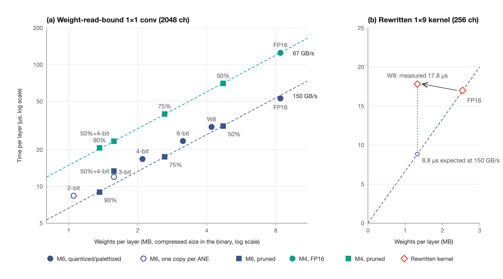

*Figure 7-2. Per-layer time of weight-read-bound layers as a function of per-layer weight bytes. (a) 1×1 convolution (2048 channels, 32 pixels, distinct weights per layer) on log–log axes. The horizontal axis is the compressed weight-segment size per layer in the compiled artifact, and the dashed line is the time predicted from the weight-read limit (about 150 GB/s on the M6 and about 67 GB/s on the M4). The 2- and 3-bit palettizations are split across two ANEs, and each engine stores a complete copy of the weights, so the horizontal axis uses the single-copy size (open markers). (b) Rewritten 1×9 kernel (256 channels, 4×32): W8 halves the weight bytes but leaves the time unchanged, differing by a factor of two from the 8.8 µs predicted from bytes (Section 7.4.2). The M6 times come from kdebug (firmware task duration for quantization and palettization; driver submission to task end for pruning), and the M4 times are Core ML per-call times. All are slopes over 16 and 32 layers (data: [wfmt.txt](../data/05_compute/wfmt/wfmt.txt), [sparse.txt](../data/05_compute/sparse/sparse.txt)).*

Second, the compute arrays of both the M6 and the M4 skip the MACs of zero weights. Table 7-10 lists the results for the 1×1 convolution chain with weights resident on chip.

*Table 7-10. Effect of pruning on a compute-bound 1×1 convolution chain (512 channels, 1×128, weights resident on chip). The dense version takes 3.45 µs per layer, about 6% slower than the 3.26 µs of Section 7.2.1. The two values come from different rounds and use different timing conventions. Here the values are the slopes, over 32 and 128 layers, of the submission-to-task-end duration in kdebug.*

| Weights | M6 time per layer | Relative to dense | Equivalent throughput based on dense MAC count | M4 relative to dense | M4 equivalent throughput based on dense MAC count |
| --- | --- | --- | --- | --- | --- |
| FP16 dense | 3.45 µs | 1.00 | 19.5 TFLOPS | 1.00 | 15.5 TFLOPS |
| Pruned 50% or 2:4 | 2.27–2.28 µs | 0.66 | 29.5 TFLOPS | 0.68 | 22.7 TFLOPS |
| Pruned 75% or 1:4 | 1.43–1.44 µs | 0.42 | 46.8 TFLOPS | 0.44 | about 35 TFLOPS |
| Pruned 90% | 1.25 µs | 0.36 | 53.6 TFLOPS | 0.33 | about 47 TFLOPS |

Based on the original dense MAC count, the equivalent throughput of the M6 at 75% and 90% pruning reaches 46.8 and 53.6 TFLOPS, which is 2.2 and 2.5 times the single-engine direct-convolution peak of 21.1 TFLOPS. Because the weights in this test are resident on chip, the performance gain cannot be explained by a reduction in weight reads. It therefore indicates that the compute array itself skips the MACs that correspond to zero weights. The zero-skipping efficiency has no clear relation to whether pruning is structured. At 50% pruning, 2:4 and unstructured pruning give essentially the same performance; at 75% pruning, 1:4 and unstructured pruning likewise match. On the other hand, the speedup is not inversely proportional to the non-zero fraction. When the non-zero fraction decreases from 0.5 to 0.25 and 0.1, the relative time decreases only from 0.66 to 0.42 and 0.36. This deviation may come from imbalance in the compressed weight length allocated to each NE, from fixed per-layer overheads, and from the decoding throughput limit of sparse weights 〔inferred〕.

The compiled artifact further confirms the zero-skipping mechanism of the hardware. Register 0x1240 in the convolution TD is the weight configuration word. Checking it bit by bit against the functions in the compiler that write each field, bits 0–1 specify the weight data type, bit 2 and bits 4–7 control the palettization and its bit width, bit 8 (KernelSparseFmt) indicates the use of the sparse weight format, and bit 28 (KernelDetectZeros) controls runtime zero-weight detection. After pruning, this register changes from 0x10000082 to 0x182. That is, KernelSparseFmt is set and KernelDetectZeros is cleared. The corresponding sparse-format flag also appears in the weight DMA configuration register 0x1540. This shows that the pruned model does not dynamically detect zeros in dense weights. Instead, the weights are encoded in sparse format at compile time, and the hardware directly executes the compressed weight stream.

This change is also reflected in the weight layout and the execution cycles. The dense model assigns each NE a fixed 32 KiB of weights, whereas after pruning each NE receives a compressed weight segment of different length. At the same time, `exe_cycles` in the TD header drops from 3 to 1 per layer, although the per-TD estimate of the performance model does not change accordingly (Section 7.8) 〔HWX, compiler〕.

The premise for skipping zero weights is that the weights are supplied to the compiler in sparse format, and the pruning interface of coremltools generates this format. If the zeros in the weights are written into the model as ordinary dense constants, the compiler does not switch to the sparse format even when 50%–100% of the weights are zero. The weight segment, register 0x1240, and estimated cycles are then identical to those of random weights (tool: [kfmt_gen.py](../tools/05_compute/kfmt_gen.py)) 〔HWX, compiler〕. Dense-format layers have an additional zero-weight detection bit, which the compiler decides per layer. On the M6's target h18g, dense convolutions with weights resident on chip (including W8 and palettization) set this bit, whereas m2048, whose weights differ per layer and are read from DRAM, does not. On the M4's target h16g, the compiler does not set this bit for any convolution. The switch that determines this is the bit at offset 0x72c in the HAL parameter table, which has been 1 since H17 (the M5 generation) (Section 15.3) 〔HWX, compiler〕. We measured on the M4 that dense models with 50%–100% zero weights are only 4–8% faster per layer than models with random weights, whereas the sparse format at 75% pruning takes about half the time. Because the M4 does not enable zero-weight detection, this result only shows that dense zero weights barely speed up without zero-weight detection 〔timing〕.

The 3×3 convolution behaves differently. After pruning, the compiler no longer uses Winograd. The Winograd bit in the task information word is cleared, the output-channel grouping changes from 2 to 16, and the number of TDs per layer changes from 6 to 2. The compiler instead uses direct convolution plus zero skipping. Therefore, 50% pruning is slower than the dense version by 5–15%, and benefits appear only at 75% pruning or above. At 90% pruning, the time is 0.32–0.34 times that of the dense version, equivalent to about 87 TFLOPS by dense MAC count 〔HWX, kdebug〕. Part of the weights of the 3×3 convolution chain must be read from DRAM, and a few tasks take significantly longer, which raises the mean task duration by 5–25%. The comparisons above use medians. When means are used, the order of the versions by speed does not change 〔kdebug〕.

Figure 7-3 plots the results of both convolutions on the M6 and the M4 together.

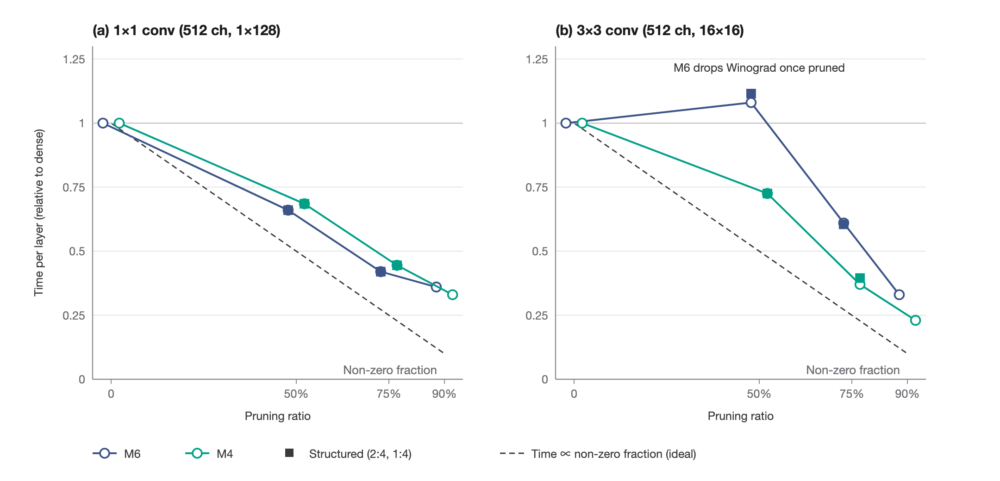

*Figure 7-3. Pruning ratio and per-layer relative time for compute-bound layers with weights resident on chip (average of the two passes of the second round). (a) 1×1 convolution chain: both the M6 and the M4 shorten time as the pruning ratio increases. Unstructured (circles) and structured (squares) pruning nearly coincide, but both are slower than the ideal case (dashed) in which time scales with the non-zero fraction. (b) 3×3 convolution chain: once pruned, the M6 no longer uses hardware Winograd, so 50% pruning is 5–15% slower than dense, and benefits appear only at 75% pruning or above. On the M4, pruning yields benefits from 50% onward. Whether the dense 3×3 convolution on the M4 uses Winograd is not determined in this report (data: [sparse.txt](../data/05_compute/sparse/sparse.txt)).*

Third, the compute array does not skip zero activations, although zero activations substantially reduce power consumption (see Section 13.3). Changing only the input cannot measure this, because zeros in the input are mixed away after the first convolution. For this reason, we introduce after each convolution a fixed mask shared across layers. The mask directly controls the fraction of zeros in the next layer's input, while the graph structure and the weights remain unchanged. Multiplying by the mask itself adds about 1 µs of fixed overhead per layer (the 1×1 chain on the M6 takes about 4.4–4.5 µs per layer, whereas the dense version in Table 7-10 takes 3.45 µs). Masked models are therefore compared only with one another. Whether the fraction of zeros in each layer's input increases from 0% to 90%, or half of the channels are entirely zero, the time is the same. On the M6, the 1×1 chain differs by only about 2.4% between "with zeros" and "without zeros," and this difference is independent of the fraction. The differences for the M4 and for the 3×3 chain are both within measurement noise 〔kdebug〕. The 3×3 chain is sensitive to the order of measurement. To reduce the systematic drift caused by measurement order, we executed the complete test sequence in forward and in reverse order, thereby eliminating drift due to measurement order 〔kdebug〕. The ANE outputs of all pruned models agree with the results of running the same pruned models on the CPU, with an error no greater than that of the dense versions.

In summary, weight-only quantization, palettization, and pruning all leave the dense peak of the MAC array unchanged. However, on native layers limited by DRAM weight-read bandwidth, each can shorten the time approximately in proportion to the compressed byte count. Pruning can additionally skip the MACs of zero weights on compute-bound layers, without requiring a structured sparsity pattern. For workloads such as large language model decoding, reducing the bit width per weight or removing some weights can shorten the time of weight-read-bound layers in proportion to byte count. However, end-to-end decoding is also limited by call count and host overhead (Section 14.3), so this is only one route to speedup.

### 7.6 Planar Engine

#### 7.6.1 Throughput

To measure the throughput of the PE, we constructed chains that contain only elementwise operations, and we confirmed that all data remain in L2. In the compiled artifact, the TDs other than the first layer carry no DMA address packets, and at run time the DRAM reads and writes of the two ANEs amount only to a noise floor of about 0.5 GB/s. Because these models are all split across the two ANEs, we measured the task duration of each ANE with kdebug. Table 7-11 gives the results for 256 channels and five spatial sizes (tools: [pe_ktrace.sh](../tools/05_compute/pe_ktrace.sh), [pe_kt.py](../tools/05_compute/pe_kt.py); data: [pe_kt/](../data/05_compute/pe_kt/), [pe_kt_fit.txt](../data/05_compute/pe_kt_fit.txt)) 〔kdebug〕. The compiler merges single-input operations (abs, multiplication by −1, and relu) into one task per two operations.

*Table 7-11. Task duration of PE operations (per ANE)*

| Elements per ANE | Single input: per task (two operations) | Dual input x + y: per layer |
| --- | --- | --- |
| 131 072 (32×32) | 2.38 µs | 4.55 µs |
| 204 800 (40×40) | 3.88 µs | 4.39 µs |
| 294 912 (48×48) | 5.22 µs | 5.19 µs |
| 401 408 (56×56) | 6.86 µs | 11.94 µs |
| 524 288 (64×64) | 8.98 µs | 18.49 µs |

The task durations of single-input operations are closely linear in the number of elements (maximum residual 0.17 µs). Each task has a fixed part of about 0.35 µs. By the number of elements processed per task (each task contains two operations), the throughput is about 61 G elements/s per ANE. Each element reads 2 bytes and writes 2 bytes, which is equivalent to about 243 GB/s of L2 read and write traffic. Addition and multiplication take the same time, and alternating between them also takes the same time, which indicates that the throughput is not limited by the operation type.

Dual-input operations do not exhibit linear behavior. From 32×32 to 48×48, each layer stays at 4.4–5.2 µs. At 56×56 and 64×64 it jumps to 11.9 µs and 18.5 µs, respectively, and in this range the marginal throughput is much lower than that of single-input operations. A field of the HAL parameter table (offset 0x5f6, read by `ZinMirInterleaveInitializer::IsDualInputsPEWithSingleDMAEngine`) is 1 on H16 through H19. Judging by its name, it indicates that dual-input PE operations have only one DMA engine. We conjecture that, when the data reside in L2, the two inputs are likewise read in sequence by one engine. This is consistent with the observation that the unit cost per element of dual-input operations is higher. From 56×56 onward, each of the three tensors on an ANE amounts to about 0.75–1 MiB, and the total exceeds the 2 MiB of L2 used by the compiler, so additional constraints may also apply 〔HAL, kdebug, inferred〕.

#### 7.6.2 Clock and Width

The clock of the PE is independent of the NE clock, and it is very likely located in the shared cluster common to the two ANEs. Section 11.3 gives the complete argument. Only the frequency estimate is used here. The ratio of the PE clock at full load to its lowest state is 2.63. Starting from the low end of the compiler's L2 frequency table, 684–720 MHz, the full-load PE clock is estimated at about 1.8–1.9 GHz (Section 11.3.2) 〔inferred〕.

At this frequency, the PE processes about 61 G ÷ 1.8–1.9 GHz ≈ 32 FP16 elements per cycle. That is, it reads 64 bytes and writes 64 bytes per cycle, which is consistent with the PE work unit of 64 in the HAL (in bytes) 〔inferred〕. It should be emphasized that this width depends on a clock derived from the frequency range of the compiler's L2 table, and it is not a directly measured result.

In the programs tested in Section 6.6.1, PE operations and multiply-accumulate operations in different TDs show no overlap. This report cannot determine whether the hardware can run the two in parallel across different TDs. The activation function fused after a convolution is implemented by the lookup-table mode in the NE configuration, as a 33-point lookup table with linear interpolation (Section 8.5.1). Its numerical behavior is discussed in Chapter 8.

### 7.7 Throughput and Network Depth

maderix [4] gives data on M4 throughput as a function of chain depth. For comparison, we used a similar shape on the M6 (512 channels, 32×32, distinct weights per layer) and adopted the same convention as maderix, namely overall throughput including the fixed overhead of each call. This shape is split across two ANEs on the M6. The results are shown in Table 7-12 (data: [chains_run2.txt](../data/05_compute/chains_run2.txt), [b6_q8_run.txt](../data/05_compute/b6_q8_run.txt)) 〔timing〕.

*Table 7-12. Throughput versus chain depth (including the fixed overhead per call)*

| Layers | M6 FP16 | M6 W8A8 | M4 FP16 [4] | M4 W8A8 [4] |
| --- | --- | --- | --- | --- |
| 1 | 2.8 TFLOPS | 2.6 TOPS | 5.4 | 5.9 |
| 4 | 8.9 | 9.8 | 9.8 | 12.4 |
| 8 | 12.6 | 13.7 | 12.3 | 18.6 |
| 16 | 21.0 | 22.7 | 11.7 | 22.4 |
| 32 | 19.1 | 37.5 | 16.1 | 27.4 |
| 48 | 25.6 | 35.5 | 18.5 (1024 channels, 64×64) | 36.0 (1024 channels, 64×64) |

Within 8 layers, the M6 is not faster than the M4, because the total time is dominated by the fixed overhead per call. For FP16, the M6 is clearly faster starting at 16 layers. W8A8 is clearly faster only at 32 layers (37.5 versus 27.4 TOPS), and at 16 layers the two are essentially the same. At 48 layers, both M4 data points are for 1024 channels and 64×64, a shape different from that on the M6. The FP16 comparison of 25.6 versus 18.5 TFLOPS and the W8A8 comparison of 35.5 versus 36.0 TOPS can therefore only serve as a reference. After subtracting the fixed overhead, the FP16 time for 36 layers and above can be described by a straight line of about 13.1 µs per layer, equivalent to about 40.9 TFLOPS (see below). The measurement at 16 layers deviates from this line because of differing host-side overhead, so the marginal throughput should not be obtained by subtracting the 16-layer and 48-layer points. Figure 7-4 shows the variation of throughput with chain depth on the M6 and the M4.

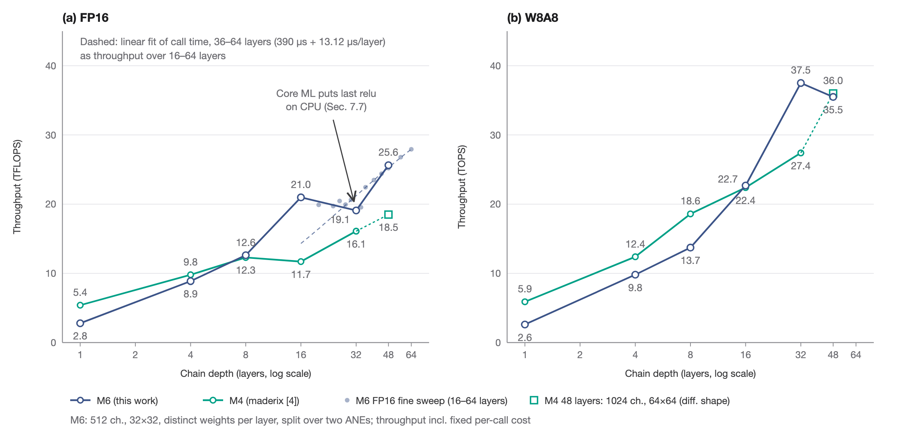

*Figure 7-4. Overall throughput (including the fixed overhead per call) of the M6 and M4 as a function of chain depth: (a) FP16, (b) W8A8. The M6 uses 1×1 convolution chains of 512 channels and 32×32, with distinct weights per layer. The M4 data are taken from maderix [4], whose 48-layer point has 1024 channels and 64×64. The scattered points in (a) are a fine sweep over 16–64 layers. The dashed line is the throughput corresponding to a straight-line fit of per-call time over 36 or more layers (data: [chains_run2.txt](../data/05_compute/chains_run2.txt), [b6_q8_run.txt](../data/05_compute/b6_q8_run.txt), [b6x_sweep.txt](../data/05_compute/b6x_sweep.txt)).*

Table 7-12 contains an anomaly: the FP16 throughput at 32 layers is lower than at 16 layers. After re-measuring with finer steps over 16–64 layers, we found that the per-call time for 36 layers and above can be described by a single straight line. The fit gives about 390 µs + 13.12 µs per layer, a least-squares fit using, for each layer count, the smaller of the two rounds' values. When the task-duration column is used instead, the fit gives about 376 µs + 13.21 µs per layer. Measurement points below 36 layers deviate from this line (data: [b6x_sweep.txt](../data/05_compute/b6x_sweep.txt), [b6_kt/](../data/05_compute/b6_kt/), [effA_kt/](../data/05_compute/effA_kt/)) 〔timing, kdebug〕. The deviation has two independent causes. Models with fewer layers are faster than the line predicts, while the 32- and 34-layer models are slower than the line predicts.

For the former, the 16-layer model is 184 µs faster than the line predicts. Firmware timestamps show that the ANE task duration stays on the line. The entire difference comes from host-side overhead after task completion, which rises gradually from about 166 µs at 16 layers to about 355 µs at 28 or more layers. This is the host CPU idle-depth effect described in Section 6.5.

For the latter, the 32- and 34-layer models are about 100 µs slower than the line predicts. The execution plans in the E5 cache of Core ML (Section 5.2) show that, of the 28 models in this experiment, only the FP16 32- and 34-layer models have a plan that includes a CPU segment. Its content is "type conversion → last-layer relu → type conversion," meaning that Core ML placed the final relu on the CPU, with the execution plan `AneInference → Cast → CpuInference → Cast` (data: [b6_sample_top.txt](../data/05_compute/b6_sample_top.txt), [b6_pcpu.txt](../data/05_compute/b6_pcpu.txt)) 〔timing, inferred〕. Compiling the complete 32-layer model directly with `ANECCompile` causes no problem, so this partition was made by the Core ML segmenter and not by the ANE compiler rejecting the operation. According to the cost rule of Section 5.2, the estimated time of the final relu is the same on the ANE and on the CPU. Placing it on the ANE costs 0.125 ms for the graph output, and placing it on the CPU costs 0.125 ms for one switch, so the total cost of the two choices is equal, which is a tie. In a tie, on which side the operation falls is not determined. This phenomenon may be related to that tie. However, the equality of the two sides is derived from data for a 64-channel relu on the M4, and the tie alone does not explain why this partition appears only at 32 and 34 layers and only for FP16 〔inferred〕. The 32-layer W8 and W8A8 models are not affected by this effect.

### 7.8 Comparison of the Compiler Performance Model with Measurements

The performance-model CSV described in Section 7.1 lists, for each TD, the bytes of weight reads, activation reads, and activation writebacks, the NE cycle count, and the estimated time. We used the models from the sparse experiments and the field-tracing experiments to re-export these CSVs on the M4 with h18g as the target (data: [perfcsv2/](../data/05_compute/perfcsv2/)), and we reverse-engineered the compiler's timing formula TD by TD 〔compiler〕. The compute part is estimated as NE cycles divided by 2.508 GHz, the highest state of the compiler's frequency table; the measured full-load clock is 2.58 GHz (Chapter 11). Weight reads overlap with computation, and the larger of the two is taken. Weights are assumed to be read at 167.4 GB/s, and every weight-read-bound TD back-calculates to exactly this value, which is close to the theoretical DRAM bandwidth of 170.5 GB/s. Activation reads and writebacks are assumed at 116.0 GB/s and 83.7 GB/s, respectively, and TDs that merely move data, such as elementwise addition, pooling, and softmax, back-calculate to exactly these values. For a TD with only one work unit, activation reads and writes are added directly to the computation. For a large TD with many work units, activation reads and writes are almost entirely hidden behind the computation. The exact rule for cases in between has not been decomposed by us 〔compiler〕. Table 7-13 compares this estimate with the M6 measurements.

*Table 7-13. Per-layer estimate of the compiler performance model versus M6 measurements*

| Scenario | Compiler estimate | M6 measurement | Deviation and cause |
| --- | --- | --- | --- |
| Weight-read-bound (m2048, FP16, 8.39 MB per layer) | 50.1 µs | 52.8–55.5 µs | Optimistic by 5–10%: with weights at 167 GB/s, two rounds of measurement give 151–159 GB/s (Table 7-9 and the sparse experiments) |
| Same, pruned 75% (2.62 MB per layer) | 15.7 µs | 17.5 µs | Optimistic by about 11%: weights are counted in compressed bytes, which agrees with measurement, but the bandwidth is again too high |
| Compute-bound (512-channel 1×1, FP16) | 3.27 µs | 3.45 µs | Optimistic by about 5%: computed with 256 MACs per NE per cycle and 2.508 GHz |
| Same, pruned 75% | 3.27 µs | 1.44 µs | Pessimistic by 2.3×: NE cycle count does not account for zero skipping at all (Section 7.5) |
| 3×3, FP16 | 58.8 µs | 39–44 µs | Pessimistic by about 1.4×: computed as direct convolution, without hardware Winograd (Section 7.4.3) |
| 3×3, pruned 50% / 90% | 66.2 / 62.5 µs | 46 / 13.9 µs | Pessimistic by 1.4× / 4.5×: zero skipping is not counted, but the cost of losing Winograd after pruning is counted |
| Activation reads and writes | Read 116, write 83.7 GB/s | About 35–40 GB/s per ANE (Section 9.4.2) | Optimistic by about 3× |

Table 7-13 shows that the compiler's performance model is quite accurate for compute-bound dense convolutions that do not use Winograd, with an error of about 5%. It is optimistic by about 10% for weight reads and about 3× for activation DMA. It does not consider at all the two acceleration features of the M6, namely hardware Winograd and sparse zero skipping, and it therefore systematically overestimates the time of 3×3 convolutions and pruned layers 〔compiler, kdebug〕. These deviations directly affect the compiler's decisions. Dual-ANE splitting and global refinement (Section 5.8.3) both rely on this estimate. The splitting decisions for 3×3 layers and pruned layers are based on times overestimated by 1.4–4.5×, and the optimistic estimate of activation DMA causes the compiler to underestimate the cost of copy-and-merge after splitting 〔inferred〕. It should further be noted that `exe_cycles` in the TD header of the HWX and the CSV estimate are not the same quantity. The per-layer `exe_cycles` of a pruned 1×1 convolution is about 1 (3 when dense), whereas the CSV estimate remains 3.27 µs. The algorithm that produces `exe_cycles` has not been determined in this report.

### 7.9 Comparison with the M4

Table 7-14 summarizes the comparison of the compute arrays of the M4 and the M6.

*Table 7-14. Compute arrays of the M4 and M6*

| Item | M4 | M6 |
| --- | --- | --- |
| NEs per engine | 16 (maderix regards these as 8 compute groups [4]) | 16 |
| MACs per NE per cycle | Not measured | FP16 256, INT8 512 |
| NE full-load clock | Not measured (highest entry in the compiler table, 2364 MHz) | 2580 MHz (highest entry in the compiler table, 2508 MHz) |
| FP16 peak (single engine) | About 19 TFLOPS [4] | Direct convolution 21.1 TFLOPS (measured 20.6); 3×3 with Winograd, effective 31.0 TFLOPS |
| INT8 / W8A8 peak (single engine) | About 38 TOPS (W8A8) [4] | Direct convolution 42.3 TOPS; 3×3 effective 62.1 TOPS |
| Zero-weight skipping | Yes (measured in this report on the M4; 90% pruning gives 0.33 times dense); does not skip zero activations | Yes (90% pruning gives 0.36 times dense); does not skip zero activations |
| Weight-only quantization | No speedup [4] | MAC peak unchanged, compute-bound layers not accelerated; on weight-read-bound native layers, W8 shortens time by 42% and 4-bit palettization by 68% |
| Weight buffer per NE | 64 KiB resident (HAL) [4] | 64 KiB (HAL, TD counts for larger inputs, and OCG, all in agreement) |
| S2D(2) | One-hot convolution, overhead 2.8–3.1% [4] | Overhead about 0.2% |

The HAL parameter tables of the M4 and the M6 take the same values in the fields related to the MAC array and the weight buffer (Section 5.4). The compute arrays of the two generations should therefore be structurally identical. The increase in the single-engine peak of the M6 should derive mainly from its higher NE clock, while the doubling of the overall peak comes from the second engine 〔HAL, inferred〕.

### 7.10 Summary

This chapter analyzed the peak computational capability of the ANE compute array and the conditions for achieving it. Each ANE has 16 NE cores, and each NE completes 256 FP16 or 512 INT8 MACs per cycle. At the full-load clock of 2.58 GHz, the direct-convolution peak of a single ANE is 21.1 TFLOPS for FP16 and 42.3 TOPS for INT8. Whether the peak can be approached depends on shape and precision. The resident-weight limit of 64 KiB per NE determines the output-channel grouping, and the time steps up when the output-channel count just exceeds 256. Kernel widths of 9–15 are rewritten into a form that doubles the weight amount, and widths of 16 and above are placed on the CPU. The 3×3 and 1×3 convolutions are executed by hardware Winograd, with effective throughput reaching about 1.47× the direct-convolution peak. W8A8 is about 1.8–2× FP16 on compute-dense convolutions, and exactly 2× for 3×3 convolutions. Compressed weights are read in compressed form, and layers limited by weight reads have their time shortened in proportion to byte count. The compute array skips zero weights stored in sparse format but does not skip zero activations. The PE is in an independent clock domain, and single-input operations run at about 61 G elements/s. The compiler's performance model is accurate to about 5% for dense, compute-bound layers, but it does not account for Winograd or zero skipping.

The single-engine peaks in this chapter form the baseline against which Chapter 10 evaluates dual-engine scaling and against which Chapter 14 states its expectations. Still undetermined are how the 256 MACs are organized (16 output channels multiplied by 16 input channels, or 16 pixels), whether the higher MAC tier in the performance model can be reached, which stage is the bottleneck of rewritten kernels, and why the speedup from pruning falls below the non-zero fraction (Section 16.2). The deployment recommendations derived from the conclusions of this chapter are concentrated in Section 15.2 (Table 15-1).

## 8. Numerical Behavior

Chapter 7 concerns the compute performance of the ANE, and this chapter turns to its numerical precision and internal arithmetic behavior. The inputs and outputs of the ANE are both FP16, but this is only the storage format of data in DRAM and L2. It does not reveal the format in which the multiply-accumulate array accumulates internally, how overflow is handled, or how results are rounded, and these details determine whether a network can obtain results on the ANE that agree with those on the CPU. We constructed specific inputs and weights, compared the outputs of the ANE and the CPU, and determined each of these behaviors item by item. The main conclusions of this chapter are four. First, the accumulator for FP16 convolutions and matrix multiplications is a 32-bit fixed-point number (Q15.16); at any point during accumulation, if its absolute value reaches 32768, the result becomes infinity and does not recover. Second, the bias is the initial value of this fixed-point accumulator, rather than being added in floating point to the output. Third, the INT8 path uses a separate 32-bit integer accumulator, elementwise operations take a floating-point path, and neither path has the 32768 limit. Fourth, activation functions are implemented by a 33-point lookup table with linear interpolation, and the table values for some functions are fitted values rather than exact samples of the function. The basic behavior of the FP16 multiply-accumulate path was retested on the M4, and the results are identical to those on the M6 (Section 8.1).

### 8.1 Test Methodology

To determine the behavior of the accumulator, we need to control precisely each product that participates in the accumulation. For this purpose we designed a 1×1 test convolution whose input x has the shape [1, 64, 1, 256], that is, 64 input channels and a width of 256 columns. For a 1×1 convolution, the value of output channel 0 at column j equals the sum of the products of the 64 input values in that column with the 64 weights of output channel 0, that is, Σ_c x[c, j] · w[c], and it is independent of the other columns. We therefore need only set the weights of output channel 0 to the numerical values under test and fill each column with different inputs; each column then constitutes an independent test case, so that a single model can check 256 cases at once (tools: [numerics2.py](../tools/06_numerics/numerics2.py) through [numerics6.py](../tools/06_numerics/numerics6.py)).

However, a convolution this small is placed on the CPU by Core ML, and what would be measured is then no longer the behavior of the ANE. To make the model actually execute on the ANE, we zero-padded the output channels to 2048 and added to the model an unrelated "companion" branch (four convolution layers followed by ReLU), so that Core ML assigns the entire model to the ANE. The raw output of the test convolution is read out as a separate model output. We confirmed that the model actually executed on the ANE by two means. First, we observed ANE interrupts during execution (tool: [anewho.c](../tools/common/anewho.c)). Second, we executed the same model once more in `CPU_ONLY` mode, and its results differ from those of the ANE 〔IOReport, numerical〕.

The expected value of each case is determined from both the FP16 result of the CPU and the exact float64 value. Elementwise operations were tested by the same method. The test methods for the INT8 path and for activation functions are described in Sections 8.3 and 8.5, respectively. All numerical experiments were completed on the M6. Among them, a set of basic tests examining the range, overflow, subnormal inputs, rounding and scale of the FP16 multiply-accumulate path was repeated once on the M4 with the same program (data: [numerics2_m6.txt](../data/06_numerics/numerics2_m6.txt), [numerics2_m4.txt](../data/06_numerics/numerics2_m4.txt)).

### 8.2 FP16 Multiply-Accumulate Path: Fixed-Point Accumulator

#### 8.2.1 Range and Overflow

We first test the range of the accumulated result. Table 8-1 lists representative cases (data: [numerics2_m6.txt](../data/06_numerics/numerics2_m6.txt), [numerics3_m6.txt](../data/06_numerics/numerics3_m6.txt)) 〔numerical〕.

*Table 8-1. Range and overflow of the FP16 multiply-accumulate path*

| Case                                             | ANE   | CPU   |
| ------------------------------------------------ | ----- | ----- |
| 32752 (single input, weight 1)                   | 32752 | 32752 |
| 32768                                            | inf   | 32768 |
| 16384 + 16376 (sum 32760, rounded to 32768 in FP16) | 32768 | 32768 |
| 16384 + 16384                                    | inf   | 32768 |
| 16384 + 16384 − 16384 − 16384 + 1                | inf   | 1     |
| 16384 + 2⁻¹⁶ − 16384                             | 2⁻¹⁶  | 0     |
| 16384 + 2⁻¹⁸ − 16384                             | 0     | 0     |

Table 8-1 illustrates three properties of the accumulator. First, the absolute value of an accumulated result is bounded by 2¹⁵: the case with a sum of 32760 is output correctly (rounded to 32768 in FP16 at the output), whereas the case whose sum is exactly 32768 becomes infinity. Second, overflow is irreversible: once the value at some point during accumulation reaches 32768, the final result remains infinity even if subsequent products reduce it to a smaller value. Third, the accumulator retains precision that FP16 cannot represent. Adding 2⁻¹⁶ to 16384 and then subtracting 16384 yields 2⁻¹⁶ on the ANE, whereas the FP16 computation on the CPU yields 0. This shows that the resolution during accumulation reaches 2⁻¹⁶, much finer than the resolution of FP16 near 16384 (16).

Together, these three properties indicate a 32-bit fixed-point accumulator with 1 sign bit, 15 integer bits and 16 fractional bits, in which the least significant bit (LSB) is 2⁻¹⁶ and the representable absolute value is below 2¹⁵. To confirm that this scale is fixed, we set the weight to 1, 16, 256 and 4096 and repeated the above tests. The overflow point remained 32768, and the LSB remained 2⁻¹⁶. This indicates that the compiler does not adjust the scale of the accumulator on a per-layer basis 〔numerical〕. Section 5.7.3 states that the NE field group of the TD contains an "accumulator bias shift" field and a 5-bit "output right shift" field. These fields may serve other data formats, and in the FP16 convolutions tested in this report the scale did not change 〔compiler, inferred〕.

We also examined whether partial sums in FP16 occur during accumulation. Bryngelson [5] reports that the first level of the reduction tree on the M1 sums in FP16 with radix 4. If the M6 does the same, a +1 inserted in the range ±2048 would be discarded in an FP16 partial sum, because the resolution of FP16 near 2048 is 2. In measurements, the +1 was not discarded regardless of where it was placed, which indicates that the M6 accumulation contains no intermediate partial sums stored at FP16 precision 〔numerical〕. Figure 8-1 gives the data formats of the FP16 multiply-accumulate path.

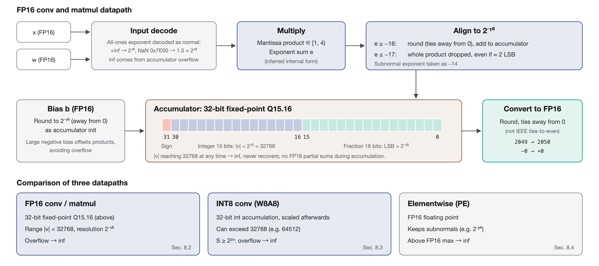

*Figure 8-1. Data formats of the FP16 multiply-accumulate path. The upper two rows show the computation of FP16 convolutions and matrix multiplications: input decoding, multiplication, alignment of the products to 2⁻¹⁶ according to the sum of exponents, Q15.16 fixed-point accumulation with the bias as the initial value, and rounding of the output. The "mantissa product and exponent sum" is an internal representation speculated from measurements. The next row compares the numerical formats of three paths: FP16 multiply-accumulate, INT8 multiply-accumulate, and elementwise operations.*

#### 8.2.2 Alignment of Tiny Products

The fixed-point accumulator can represent only integer multiples of 2⁻¹⁶, so each product must be aligned to 2⁻¹⁶ before it enters the accumulator. We found that whether a product is retained during alignment depends not on its actual magnitude but on the sum of the exponents of its two factors. To distinguish between these two possibilities, we specifically constructed cases whose exponent sum is −17 but whose mantissa product is close to 2. The results are shown in Table 8-2 (tools: [numerics5.py](../tools/06_numerics/numerics5.py) and [numerics6.py](../tools/06_numerics/numerics6.py); data: [numerics5_m6.txt](../data/06_numerics/numerics5_m6.txt), [numerics6_m6.txt](../data/06_numerics/numerics6_m6.txt)) 〔numerical〕.

*Table 8-2. Treatment of products with small exponent sums (actual product value within 2 LSB)*

| Weight w      | Input x                  | Exponent sum | Actual product value | ANE output |
| ------------- | ------------------------ | ------------ | -------------------- | ---------- |
| 1.875 × 2⁻³   | 1.875 × 2⁻¹⁴             | −17          | 1.76 LSB             | 0          |
| 1.99 × 2⁻³    | 1.99 × 2⁻¹⁴              | −17          | 1.98 LSB             | 0          |
| 1.5 × 2⁻⁴     | 1.9 × 2⁻¹³               | −17          | 1.43 LSB             | 0          |
| 0.2           | 0.99 × 2⁻¹⁴ (subnormal)  | −17          | 0.79 LSB             | 0          |
| 0.125         | 1.5 × 2⁻¹³               | −16          | 1.5 LSB              | 2 LSB      |
| 0.25          | 0.5 × 2⁻¹⁴ (subnormal)   | −16          | 0.5 LSB              | 1 LSB      |

Table 8-2 shows that the rule depends on exponents. When the sum of the exponents of x and w (with the exponent of a subnormal number counted as −14) is not less than −16, the product is aligned to 2⁻¹⁶ with rounding, with halfway cases rounded away from zero. When the exponent sum is not greater than −17, the entire product is discarded, even though its actual value is close to 2 LSB. We speculate that the multiplier outputs the mantissa product (lying in the interval [1, 4)) and the exponent sum, and that the alignment shifter retains a rounding bit only for products whose exponent sum is not less than −16, while smaller products are shifted out directly 〔inferred〕. This rule implies that when a very small activation is multiplied by a small weight, it is truncated, and the amount truncated is at most close to 2 LSB (about 3 × 10⁻⁵). This is coarser than conventional rounding, in which a product is discarded only when it is smaller than half an LSB.

#### 8.2.3 Bias

A convolution bias can be added at two positions: as the initial value of the accumulator, or as a floating-point addition after accumulation is complete and the result has been converted to FP16. The two approaches behave differently with respect to overflow and rounding, so they can be distinguished experimentally. We set all weights to 1, so that output channel 0 equals Σx + bias. The results are shown in Table 8-3 (data: [numerics5_m6.txt](../data/06_numerics/numerics5_m6.txt)) 〔numerical〕.

*Table 8-3. Positions at which the bias is added*

| bias   | Input         | ANE   | CPU        | Note                                                                 |
| ------ | ------------- | ----- | ---------- | -------------------------------------------------------------------- |
| −16384 | 16384 + 16384 | 16384 | 16384      | No overflow: the bias is already in the accumulator when accumulation begins |
| −16384 | 16384 × 3     | inf   | 32768      | Still overflows when the final value reaches 32768                   |
| +32    | 32736         | inf   | 32768      | Bias and products are both subject to the ±32768 limit               |
| 2⁻²⁰   | 0             | 0     | 9.5 × 10⁻⁷ | The bias is first quantized to 2⁻¹⁶                                  |
| 2⁻¹⁷   | 0             | 2⁻¹⁶  | 2⁻¹⁷       | 0.5 LSB rounded away from zero                                       |
| 2⁻¹⁷   | 2⁻¹⁷ (weight 1) | 2⁻¹⁵ | 2⁻¹⁶      | Each term is rounded to 1 LSB before addition                        |

The first row is the most instructive. The sum of two 16384 values would be expected to overflow in the accumulator, but with a bias of −16384 the result is correct and does not overflow. This is possible only if the bias enters the accumulator before the products. The subsequent rows further show that the bias is rounded away from zero to 2⁻¹⁶ before it enters the accumulator. It follows that the bias is the initial value of the fixed-point accumulator 〔numerical〕. This design has two consequences. A large bias combined with large activations is more likely to overflow. Conversely, a large negative bias can offset part of the positive products, so that the intermediate value does not overflow.

#### 8.2.4 Input Decoding and Output Rounding

After accumulation completes, the fixed-point result is converted to the FP16 output. This conversion rounds to nearest, with halfway cases rounded away from zero, rather than using the IEEE 754 default of rounding halfway cases to even. For example, 2049 is output as 2050, −2049 as −2050, 4098 as 4100, and 1 + 2⁻¹¹ as 1 + 2⁻¹⁰. Under round-half-to-even, these values would be 2048, −2048, 4096 and 1, respectively. The output for −0 is +0 〔numerical〕.

Input decoding also has a nonstandard feature: FP16 values whose exponent field is all ones (that is, inf and NaN) are decoded as ordinary numbers. +inf is decoded as 2¹⁶, the NaN 0x7E00 as 1.5 × 2¹⁶, and 0x7FFF as 131008. These decoded values exceed the range of the accumulator and therefore cause the result to overflow to inf. Bryngelson [5] reports that NaN becomes +inf on the ANE, and the decoding described above explains the cause of this phenomenon. On the other hand, large inputs within the normal range do not overflow ahead of the accumulator: 65504 × 2⁻⁴ yields the correct 4094 〔numerical〕.

### 8.3 INT8 Path: 32-Bit Integer Accumulator

The accumulator of the INT8 path cannot be tested by the method of Section 8.1, because activation quantization in coremltools requires calibration, so the scaling factors are not under control. Instead, we manually constructed in MIL the structure "quantize, dequantize, then convolve with Int8 weights", so that the quantized inputs and weights are all the same Int8 value (127 or −128). In this way, the integer accumulated sum S at each output point can be computed exactly. The scaling factors of both the inputs and the weights are taken as 2⁻ᵏ, so the theoretical output is S × 2⁻²ᵏ. Each model was executed in both `CPU_AND_NE` and `CPU_ONLY` modes. Throughout each group of runs, the IOReport interrupt count was used to confirm that the ANE took part in the computation (tool: [numerics_i8.py](../tools/06_numerics/numerics_i8.py); data: [numerics_i8/](../data/06_numerics/numerics_i8/)) 〔numerical, IOReport〕. The interrupt count is aggregated over a group, so it cannot indicate on which device each model executed. Agreement between ANE and CPU outputs also cannot serve as a criterion that a model fell back to the CPU, because a correct ANE result may happen to equal the CPU result. Table 8-4 lists only those models whose ANE output differs from their `CPU_ONLY` output. Their results cannot have come from the CPU, and therefore they were certainly computed by the ANE. For the models not listed, the basis of judgment is the dispatch rule of Section 5.2 rather than the outputs. A model with an input channel count N of 120000 or more has a tensor dimension exceeding the 65536 limit of Table 5-2 and cannot be placed on the ANE, while a model with N not exceeding 1024 is so small in computation that the segmenter's cost rule would place it on the CPU 〔inferred〕. The model with N = 2080 is an example in which the outputs agree but which need not have executed on the CPU. Both the ANE and the CPU output 2048, which is the correct rounding of the theoretical value 2047.6. It is most likely computed by the ANE, and its result merely coincides with the CPU result. The conclusions of Table 8-4 do not depend on these points. In addition, to reach S = 2³¹ on the ANE without being limited by the channel-count ceiling, we switched to kh×1 convolutions with N = 65536. Table 8-4 gives the results 〔numerical〕.

*Table 8-4. Accumulation range of the INT8 path*

| Convolution                         | Integer accumulated sum S | Scaling      | Theoretical output | ANE output  |
| ----------------------------------- | ------------------------- | ------------ | ------------------ | ----------- |
| 1×1, N = 4096–16384, 127 × 127      | 2²⁶–2²⁸                   | 2⁻¹²         | 16129–64516        | 16128–64512 |
| 1×1, N = 65536, (−128) × (−128)     | 2³⁰                       | 2⁻¹⁶ / 2⁻¹⁸  | 16384 / 4096       | Accurate    |
| 2×1, N = 65536                      | 2³¹                       | 2⁻¹⁶ / 2⁻¹⁸  | 32768 / 8192       | inf         |
| 3×1, alternating signs (partial sums not exceeding about 2³⁰) | 1.008 × 2³⁰ | Same as above | 16512 / 4128 | Accurate |

Table 8-4 shows that the accumulator of the INT8 path is a 32-bit signed integer: the result is accurate when S = 2³⁰, and it overflows when S = 2³¹ (that is, one more than the maximum value of int32). Overflow is independent of the magnitude of the output value. With a scaling of 2⁻¹⁸, the output corresponding to S = 2³¹ is only 8192, and it still overflows. As on the FP16 path, the overflowed result is infinity rather than saturation. The output of the first row reaches 64512, exceeding the 32768 ceiling of the FP16 path. This indicates that accumulation on the INT8 path is performed in the integer domain, with scaling applied at the end, and does not pass through the fixed-point accumulator of the FP16 path 〔numerical〕. The maximum of an Int8 × Int8 product is 2¹⁴, so an output point must accumulate about 130,000 maximum products before it overflows. The product of the input channel count and the kernel area in common networks is far smaller than this quantity, so overflow on the INT8 path almost never occurs in practice.

### 8.4 Element-Wise Operations: Floating-Point Path

Elementwise operations are executed by the PE. We tested addition and multiplication by the method of Section 8.1, and the results are shown in Table 8-5 (data: [numerics3_m6.txt](../data/06_numerics/numerics3_m6.txt), [numerics4_m6.txt](../data/06_numerics/numerics4_m6.txt)) 〔numerical〕.

*Table 8-5. Numerical behavior of elementwise operations*

| Case          | ANE   | CPU   | Note                                                                 |
| ------------- | ----- | ----- | -------------------------------------------------------------------- |
| 2048 + 1      | 2050  | 2048  | Rounding is the same as in the multiply-accumulate path: halfway cases rounded away from zero |
| 65504 + 0     | 65504 | 65504 | No 32768 limit                                                       |
| 16384 + 16384 | 32768 | 32768 | —                                                                    |
| 2⁻²⁴ + 0      | 2⁻²⁴  | 2⁻²⁴  | Subnormal number preserved                                           |
| 2⁻¹² × 2⁻¹²   | 2⁻²⁴  | 2⁻²⁴  | —                                                                    |
| 256 × 256     | inf   | inf   | Overflows only when the FP16 range is exceeded                       |
| NaN + 1       | inf   | NaN   | Input decoding is the same as in the multiply-accumulate path        |

Table 8-5 shows that the results of elementwise operations differ from those of the multiply-accumulate path in two respects. In range, the result of elementwise addition can exceed 32768. For example, 65504 + 0 yields the correct 65504, and overflow to infinity occurs only when the result exceeds the maximum value of FP16. In precision, subnormal numbers such as 2⁻²⁴ are preserved in full, whereas the resolution of the multiply-accumulate path is only 2⁻¹⁶. Neither property is consistent with the Q15.16 fixed-point accumulator; both are consistent with the behavior of FP16 floating-point arithmetic. We therefore infer that the PE operates in FP16 floating-point format and uses a different arithmetic unit from the one used by the MAC array 〔numerical, inferred〕. This is consistent with the division of labor described by Bryngelson [5], in which the NE performs multiply-accumulate and the PE performs elementwise operations. On the other hand, the two paths share the same rounding method (halfway cases rounded away from zero) and the same input decoding method (inf and NaN are decoded as ordinary numbers), and we speculate that the two paths share the same format-conversion logic 〔inferred〕.

### 8.5 Activation Functions

#### 8.5.1 Structure of the Lookup Tables

maderix [4] found on the M4 that activation functions such as sigmoid are implemented by 33 FP16 sampled points stored in the `__KERN_0` segment, combined with linear interpolation. To obtain the complete implementation of each function on the M6, we compiled for each activation function a small model consisting of "a 1×1 convolution plus the activation function", and read the non-weight data from the `__KERN_0` segment of the compiled artifacts (tool: [opvariants.py](../tools/06_numerics/opvariants.py); artifacts: [opv_hwx/](../data/06_numerics/opv_hwx/)). The table for sigmoid and similar functions is located at offset 0x8 from the beginning of the segment. The tables for sqrt, rsqrt, inverse, log and floor have separate symbols of the form `K<hash>_actlut`. Field tracing shows that, in the NE configuration, the nonlinearity mode distinguishes only three classes, "none", "ReLU" and "table lookup". Sigmoid, tanh, GELU and others are all written as the same "table lookup" value (Table 5-13), and which function is implemented is determined entirely by the table contents 〔compiler〕. Table 8-6 summarizes the table contents of each function 〔HWX〕.

*Table 8-6. Contents of the activation-function lookup tables (33 FP16 values each)*

| Function             | Table contents                                                                                     | Implementation                                                                 |
| -------------------- | -------------------------------------------------------------------------------------------------- | ------------------------------------------------------------------------------ |
| relu, abs, sign, square | No table                                                                                        | Computed directly by the ALU                                                   |
| sigmoid              | σ(−8), σ(−7.5), …, σ(8)                                                                            | 33 equally spaced points on [−8, 8], storing exact sampled values              |
| tanh                 | tanh(0), tanh(0.125), …, tanh(4)                                                                   | Only the positive half-axis is stored; odd symmetry is exploited               |
| erf                  | erf(0), erf(1/16), …, erf(2)                                                                       | Only the positive half-axis is stored; odd symmetry is exploited               |
| sin                  | sin(0), sin(π/64), …, sin(π/2)                                                                     | Only a quarter period is stored; the rest is obtained from symmetry            |
| exp                  | 2^(0/32), 2^(1/32), …, 2^(32/32)                                                                   | Converted to powers of 2: the integer part is written into the floating-point exponent, and the table covers only the fractional part within [0, 1] |
| log                  | 4 special values, followed by log₂(0.5) through log₂(0.9375) at spacing 1/64                       | Range reduction: log₂(mantissa) plus exponent, then multiplied by ln 2         |
| sqrt, rsqrt          | 4 special values, followed by 25 function values for arguments 0.5 to 2.0 at spacing 1/16; other positions are 0 | Range reduction, split by the parity of the exponent                  |
| inverse              | 4 special values, followed by 1/0.5 through 1/0.9375 at spacing 1/64                               | Range reduction                                                                |
| gelu                 | [−4, 4] at spacing 0.25; values are fitted (for example, gelu(0.25) should be 0.1497, but the table contains 0.1436) | Fitted to reduce the overall error                               |
| silu                 | [−8, 8] at spacing 0.5; values are fitted (silu(0.5) should be 0.311, but the table contains 0.296) | Fitted to reduce the overall error                              |
| floor                | The header entries are −inf and inf; the others are 0                                              | Mechanism differs from ordinary table lookup                                   |

All table-lookup functions use linear interpolation between 33 sampling points, but the sampling grids differ among functions. The compiler uses two techniques to let the limited 33 points cover as high a precision as possible. For functions with symmetry (tanh, erf, sin), only part of the interval is stored, and the rest is obtained from symmetry. For exp, log, sqrt, rsqrt and inverse, the input is first reduced to one octave, the exponent part is handled separately, and the table covers only the reduced interval. In addition, the table values for gelu and silu are not exact sampled values of the functions. They are results fitted to minimize the error over the entire interval 〔HWX〕.

#### 8.5.2 Errors

We took about 16,000–20,000 distinct FP16 inputs over the domain of each function (using a logarithmic grid for functions defined on positive inputs), used the exact float64 values as reference, and compared the errors of the ANE and of the CPU (FP16). The results are shown in Table 8-7 and Figure 8-2 (tools: [lut_err.py](../tools/06_numerics/lut_err.py), [lut_plot.py](../tools/06_numerics/lut_plot.py); data: [f3_lut_m6.txt](../data/06_numerics/f3_lut_m6.txt), [lut_m6/](../data/06_numerics/lut_m6/)) 〔numerical〕.

*Table 8-7. Errors of the activation functions (reference: exact float64 values)*

| Function              | Test interval | Distinct input points | ANE max. absolute error | ANE max. relative error (ulp) | CPU max. absolute error | Points where ANE and CPU results differ |
| --------------------- | ------------- | --------------------- | ----------------------- | ----------------------------- | ----------------------- | --------------------------------------- |
| sigmoid               | [−12, 12]     | 18092                 | 3.4 × 10⁻³              | 811                           | 7.0 × 10⁻⁴              | 81.9%                                   |
| tanh                  | [−6, 6]       | 18092                 | 1.6 × 10⁻³              | 11.0                          | 9.6 × 10⁻⁴              | 85.0%                                   |
| gelu (EXACT)          | [−8, 8]       | 18432                 | 6.2 × 10⁻³              | 12632                         | 1.7 × 10⁻³              | 81.0%                                   |
| gelu (TANH approximation) | [−8, 8]   | 18432                 | 6.2 × 10⁻³              | 12632                         | 3.9 × 10⁻³              | 92.6%                                   |
| silu                  | [−12, 12]     | 18092                 | 1.5 × 10⁻²              | 28560                         | 4.8 × 10⁻³              | 88.7%                                   |
| erf                   | [−4, 4]       | 18432                 | 8.6 × 10⁻⁴              | 3.0                           | 9.8 × 10⁻⁴              | 58.0%                                   |
| sin                   | [−8, 8]       | 18432                 | 6.3 × 10⁻⁴              | 45.3                          | 2.4 × 10⁻⁴              | 34.8%                                   |
| exp                   | [−12, 10]     | 18084                 | 1.0 × 10²               | 9.1                           | 1.0 × 10¹               | 47.9%                                   |
| log                   | [2⁻¹⁰, 1000]  | 20433                 | 6.6 × 10⁻³              | 91.0                          | 2.0 × 10⁻³              | 51.2%                                   |
| sqrt                  | [2⁻¹⁰, 1000]  | 20433                 | 1.8 × 10⁻²              | 1.2                           | 7.8 × 10⁻³              | 22.8%                                   |
| rsqrt                 | [2⁻⁶, 1000]   | 16337                 | 8.1 × 10⁻³              | 2.1                           | 2.2 × 10⁻²              | 79.2%                                   |
| inverse               | [2⁻⁶, 1000]   | 16337                 | 4.4 × 10⁻¹              | 13.5                          | 5.9 × 10⁻¹              | 78.4%                                   |

The table reports both absolute and ulp errors. The absolute error is the absolute value of the difference between the ANE output and the exact value. The ulp error divides this difference by the distance between two adjacent FP16-representable numbers within the exponent interval containing the exact value, and so measures the error in units of FP16 representation intervals. Specifically, when |exact value| ∈ [2ᵉ, 2ᵉ⁺¹), 1 ulp = 2ᵉ⁻¹⁰; when |exact value| < 2⁻¹⁴, 1 ulp = 2⁻²⁴. The size of the ulp therefore varies piecewise with the exponent interval, consistent with how NumPy's spacing function defines it for FP16 (tool: lut_ulp.py; data: lut_ulp_m6.txt). The two metrics reflect error scales of different magnitudes and must be interpreted together with the output characteristics of each function. For functions whose outputs are bounded and approach zero over some intervals (sigmoid, gelu, silu), the FP16 ulp is extremely small when the exact value is close to zero. Even when the absolute error is small, it may correspond to hundreds or even thousands of ulps, so the absolute error better reflects the practical deviation. For example, the maximum error of sigmoid reaches 811 ulps, occurring at x ≈ −9.94. There the exact value is only about 4.8 × 10⁻⁵, while the ANE saturates directly to 0 for inputs outside [−8, 8]. Conversely, for functions with a large dynamic range of outputs (exp, sqrt, rsqrt, inverse), the spacing of FP16 representable values grows as the output magnitude increases. A larger absolute error therefore does not necessarily indicate lower numerical precision, and the ulp error is more comparable. For example, the maximum absolute error of exp can reach 100, but after conversion it is only 9.1 ulps.

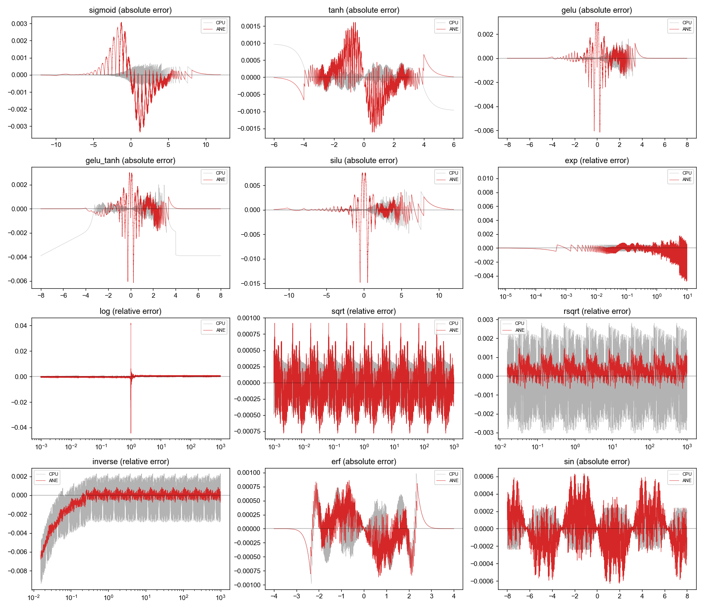

*Figure 8-2. Errors of the activation functions on the ANE (tool: [lut_plot.py](../tools/06_numerics/lut_plot.py); data: [lut_m6/](../data/06_numerics/lut_m6/)).*

The distribution of errors corroborates the structure of Table 8-6, and Figure 8-3 enlarges the error curves of four of these functions. The error of sigmoid drops to its minimum at each sampling point, and at the sampling points the error is only 4–11% of the error at the midpoint of the adjacent interval, a typical feature of equally spaced sampling with linear interpolation. Beyond ±8, the output of sigmoid saturates directly. The discontinuity of tanh at ±4 arises precisely because the table covers only [0, 4], and values beyond that range saturate directly. The ANE output of silu agrees with x multiplied by the ANE sigmoid(x) at only 38% of points, indicating that silu uses its own lookup table rather than being composed from sigmoid. The zeros of the error of gelu and silu do not lie on the equally spaced grid, which is a consequence of the table values being fitted. The errors of sqrt and rsqrt do not exceed 1.2 and 2.1 ulps, respectively. maderix [4] concluded from errors of this kind that these functions are computed by dedicated hardware. The results of this report show that range reduction alone is sufficient for a 33-point lookup table to reach this accuracy, so dedicated hardware is not necessarily required 〔HWX, numerical, inferred〕. One further point deserves attention. On the ANE, the EXACT mode and the TANH approximation mode of gelu use the same table, and their outputs are bit-identical, whereas on the CPU the two modes differ at 78% of points. Consequently, the choice of gelu mode on the ANE does not affect the result.

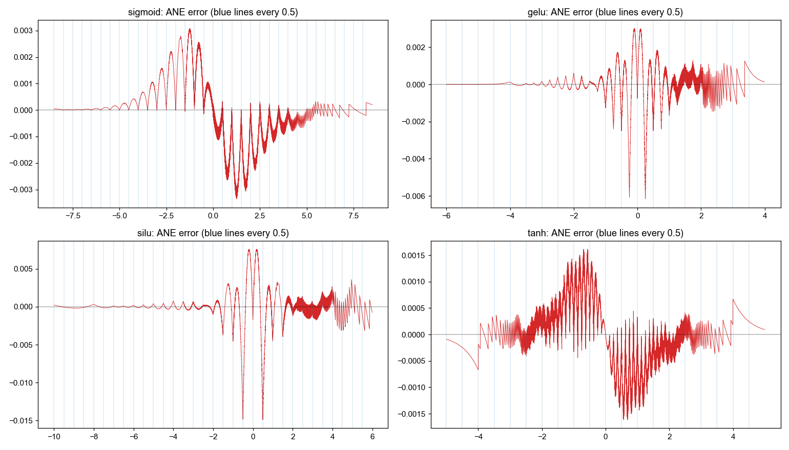

*Figure 8-3. Close-up of the absolute errors of sigmoid, gelu, silu and tanh on the ANE (ANE output minus the exact float64 value). The light blue vertical lines mark intervals of 0.5, corresponding to the grids of the sigmoid and silu lookup tables; the grids of tanh and gelu are 0.125 and 0.25, respectively (tool: [lut_plot.py](../tools/06_numerics/lut_plot.py); data: [lut_m6/](../data/06_numerics/lut_m6/)).*

### 8.6 Comparison with the M4 and the Literature

We repeated the basic tests of the FP16 multiply-accumulate path on the M4 (h16g). These tests covered the overflow points for a single input and for the sum of two numbers, the retention and discarding of subnormal inputs, output rounding, and the scaling under different weights. The results are identical item by item to those on the M6 (data: [numerics2_m4.txt](../data/06_numerics/numerics2_m4.txt)) 〔numerical〕. This shows that the Q15.16 fixed-point accumulator and the rounding method have remained unchanged since at least the H16 generation. The decoding of inf and NaN was not tested separately on the M4. The bias, the exponent rule for tiny products, the INT8 path, elementwise operations and activation functions were tested only on the M6. Table 8-8 compares the results of this report with the description by Bryngelson [5].

*Table 8-8. Comparison of numerical behavior with the literature*

| Item              | Bryngelson [5]                                  | M6 and M4 (this report)                                                  |
| ----------------- | ----------------------------------------------- | ------------------------------------------------------------------------ |
| Accumulator       | FP32-class wide accumulator                     | 32-bit fixed point, Q15.16                                               |
| Behavior near 32768 | M1 and A14 saturate at 32768; M5 does not saturate | Reaching 32768 gives inf, which persists as inf                        |
| Reduction order   | First level on M1 is FP16 partial sums with radix 4 | No FP16 partial sums                                                 |
| Subnormal numbers | M1 flushes to zero; M5 preserves them           | The multiply-accumulate path decides retention by the exponent sum; the elementwise path preserves them |
| Output rounding   | Halfway cases rounded to even                   | Halfway cases rounded away from zero                                     |
| NaN input         | Becomes +inf                                    | Decoded as a large ordinary number, causing the accumulator to overflow to inf |

The differences between the two may have two sources. First, hardware of different product generations may actually differ. Second, the test methods may differ. For example, the saturation at 32768 described by Bryngelson and the overflow to inf at 32768 reported in this report point to the same bound, 2¹⁵, and this bound is exactly the limit of the integer part of the Q15.16 fixed-point format.

### 8.7 Summary

This chapter addressed how the ANE computes numerical results on its different arithmetic paths. The FP16 convolution and matrix multiplication use a 32-bit fixed-point accumulator (Q15.16). Its absolute value overflows to infinity upon reaching 32768, its resolution is 2⁻¹⁶, the bias is the initial value of the accumulator, and the final result is rounded to FP16 with halfway cases rounded away from zero. The INT8 convolution uses a 32-bit integer accumulator, and scaling is performed after accumulation completes. Elementwise operations use FP16 floating-point arithmetic that preserves subnormal numbers. The overflow results of all three paths are infinity rather than saturation. Activation functions are implemented by lookup tables with 33-point linear interpolation, and the maximum errors of commonly used activation functions are on the order of 10⁻³ to 10⁻². The basic behavior of the FP16 multiply-accumulate path was retested on the M4, and the results are identical.

The conclusions of this chapter are all measured on individual operators. The accumulation test uses a 1×1 convolution with 64 input channels, which completes accumulation within a single pass. For layers that require multiple passes or multiple TDs to complete accumulation, we did not test whether partial sums are relayed through FP16, and this report does not evaluate how these numerical behaviors accumulate in a complete network. In Chapter 14, when images are processed one at a time, the top-1 results disagree with the GPU, and the conclusions of this chapter can only rule out the summation order within a single pass as a cause. Whether the M1 and M5 likewise use a fixed-point accumulator, and whether the difference from the "FP32-class accumulator" in the literature arises from hardware or from test methods, remain to be verified (Section 16.2). The deployment recommendations derived from the conclusions of this chapter are collected in Section 15.2 (Table 15-1).

## 9. Memory Hierarchy and Data Movement

Chapter 7 measured the capability of the compute array under the conditions that weights are resident and activations stay on chip. In actual networks, data often must be moved between DRAM and on-chip storage, and the capacity and bandwidth of the data paths likewise determine performance. The data moved by the ANE falls into two categories. Weights are the parameters of the model; they are determined at compile time, and the Kernel DMA reads them from DRAM into the weight buffer of each NE during each inference. Activations are tensors that flow through the network and vary with the input of each inference. The input and output of the network reside in DRAM and are moved between DRAM and L2 by the Tile DMA. Intermediate results between layers remain in L2 when L2 capacity permits and when the compiler can execute adjacent layers together; otherwise they are written back to DRAM and read back by the next layer. This chapter examines, in turn, L2, the weight path, the activation path and DRAM. The main conclusions are four. First, the compiler uses the L2 of each ANE as exactly 2 MiB. When an intermediate tensor exceeds 2 MiB, it is split into several tiles, and each tile executes the complete chain in succession, so intermediate results do not leave the chip. Second, the bandwidth at which native kernels read weights is about 150 GB/s, independent of the size of each layer's weights and of the kernel shape (rewritten kernels are limited by another stage measured per weight element; Section 7.4.2). A single ANE already approaches the upper limit of DRAM bandwidth, and two ANEs together cannot substantially exceed it. Third, the bandwidth of the activation path is only about 35–40 GB/s per ANE, and each TD reads at most two and writes at most one DRAM tensor. Fourth, the theoretical DRAM bandwidth is 170.5 GB/s; the ANE alone can reach about 150–159 GB/s, and when the ANE is used concurrently with the GPU, the two roughly share the bandwidth equally.

### 9.1 Test Methodology

The questions in this chapter fall into two categories, which require different methods. The first category concerns the capacity and organization of on-chip storage: how large L2 is, how intermediate tensors are tiled, and how banks are mapped. This information is directly reflected in the compiler's memory allocation, and timing experiments can provide little useful information for it. As will be seen below, when the intermediate tensor grows from 0.5 MB to 16 MB, the time per pixel decreases rather than increasing, with no inflection point at all. For this category of question, we therefore mainly compare compiled artifacts. By changing the tensor size or the compilation options, we observe how the length of the TD sequence, the number of tiles and the address registers change (tools: [anecc.m](../tools/common/anecc.m), [td_widths.py](../tools/lib/td_widths.py)) 〔HWX, HAL〕.

The second category concerns the bandwidth of each data path. Such questions must be answered by direct measurement, but the data-movement time must be separated from the compute time and the host overhead. For the weight path, we construct a model with very little computation (for example, a chain of 1×1 convolutions of width only 16), so that the time to read weights is much greater than the compute time. We then compare two versions: one in which the weights differ for each layer, and one in which all layers share a single set of weights. In the latter, the weights remain resident on chip, so the difference in time between the two versions is the cost of reading weights. For the activation path, we construct a model that contains only elementwise operations and has tensors large enough that reading and writing activations becomes the bottleneck. Chapter 6 shows that the total call time of Core ML contains a host wake-up overhead that varies with task duration. This overhead would mix into the timing slope and cause the bandwidth to be underestimated. Therefore, the bandwidth figures in this chapter are determined from the ANE task duration obtained from kdebug firmware timestamps, and results obtained from timing are used only as a reference 〔kdebug, timing〕. In addition, we use the DRAM bandwidth and frequency-state statistics in IOReport to observe the state of the memory controller. We also have the GPU read memory at the same time, measuring the sharing of DRAM between the ANE and the GPU 〔IOReport〕.

### 9.2 L2

#### 9.2.1 Capacity

The physical capacity of L2 cannot be read directly, but how the compiler uses L2 can be probed through compilation options. `ANECCompile` accepts an option named `L2Size` (in units of kB, where 1 kB is taken as 1024 bytes), which is passed to `setL2Size` of the compiler parameter object. We compiled the same model with different values and compared the resulting TD sequences. The reason for comparing only the TD sequences, rather than entire files, is that the version information in a file records the compilation options themselves. Table 9-1 gives the results (data: [l2sz/](../data/07_memory/l2sz/); model generation: [l2res.py](../tools/07_memory/l2res.py)) 〔HWX〕.

*Table 9-1. Changes in the TD sequence under different values of `L2Size`*

| Model                                                    | ≤ 1024 kB       | 1280 kB         | 1536–2047 kB                 | 2048 kB                     | ≥ 2049 kB                   |
| -------------------------------------------------------- | --------------- | --------------- | ---------------------------- | --------------------------- | --------------------------- |
| 1×1 convolution chain, 4 MiB tensors                     | Longer sequence | Longer sequence | Same as default              | Same as default             | Same as default             |
| Residual block, 1 MiB tensors, multiple tensors live simultaneously | Longer sequence | Longer sequence | Same length, different content | Word-for-word identical to default | Word-for-word identical to default |
| Residual block, 2 MiB tensors                            | —               | Longer sequence | Same length, different content | Word-for-word identical to default | Word-for-word identical to default |

Two points in Table 9-1 deserve attention. First, for the residual blocks in which multiple tensors are simultaneously live, the TD sequence is word-for-word identical to the default compilation only when the value is not less than 2048 kB. At 2047 kB it already differs, which indicates that the default value is exactly 2048 kB. A single convolution chain is identical to the default already at 1536 kB and above, which is not sufficient to discriminate. Second, when the value is increased from 2049 kB to 4 GB, the TD sequence remains identical to the default. This indicates that the effective value is capped at 2 MiB, or that the allocator cannot exploit a larger space.

Comparing the default compilation with the residual-block product compiled at `L2Size = 2047` shows that the compiler indeed uses the top of the 2 MiB range. The two differ in 48 words, located mainly in a group of address registers in the 0x10xx range (for example, 0x1044, 0x1052 and 0x1053). We infer that this group of registers describes addresses and strides within L2 〔inferred〕. In the default compilation, a 0.5 MiB buffer is placed at offset 0x180000, occupying the interval [1.5 MiB, 2 MiB) and exactly reaching the boundary 0x200000. When the L2 capacity is reduced by 1 kB, that address interval can no longer accommodate the buffer, and the compiler therefore reallocates it to offset 0x080000 〔HWX〕. This result is consistent with two further lines of evidence. In the v24 layout, the L2 address and stride fields occupy 17 bits from bit 4 upward; at a granularity of 16 bytes, the addressable limit is exactly 2²¹ bytes, that is, 2 MiB. In the HAL parameter table, the on-chip limit for a single operand is 2 MiB (offset 0x1d8), and the maximum L2 stride is 2 MiB − 16 (offset 0x218) 〔compiler, HAL〕.

Taken together, we conclude that the compiler uses the L2 of each ANE as exactly 2 MiB and fills this space, so that the two ANEs together total 4 MiB. maderix [2] earlier inferred from a performance drop near 24–32 MB on the M4 that the on-chip SRAM is about 32 MB. The author later described it in Part 4 [4] using a 2 MiB per-operand threshold, and the results of this report agree with the latter.

#### 9.2.2 Tiling of Intermediate Tensors

For intermediate tensors that exceed 2 MiB, the experiments described below reveal the tiling behavior of the compiler. We first used timing measurements to determine the time per layer of a 1×1 convolution chain (256 channels, height 1, width 1024–32768, intermediate tensors 0.5–16 MB). The results are given in Table 9-2 (data: [c12_run.txt](../data/07_memory/c12_run.txt)) 〔timing〕.

*Table 9-2. Intermediate tensor size and time per layer (1×1 convolution chain with 256 channels, dual-ANE)*

| Intermediate tensor | Time per layer | Time per thousand pixels | Marginal throughput |
| ------------------- | -------------- | ------------------------ | ------------------- |
| 0.5 MB              | 5.4 µs         | 5.27 µs                  | 24.9 TFLOPS         |
| 2 MB                | 19.0 µs        | 4.63 µs                  | 28.3 TFLOPS         |
| 4 MB                | 32.7 µs        | 3.99 µs                  | 32.9 TFLOPS         |
| 8 MB                | 61.5 µs        | 3.75 µs                  | 34.9 TFLOPS         |
| 16 MB               | 114.0 µs       | 3.48 µs                  | 37.7 TFLOPS         |

As the tensor becomes larger, the time per pixel instead becomes shorter, and no inflection point appears at 2 MiB. If the 16 MB intermediate tensor were written back to DRAM and read again at every layer, the required bandwidth would be about 280 GB/s, which exceeds the bandwidth that DRAM can provide. This indicates that the intermediate results do not enter DRAM.

The compiled artifacts reveal the mechanism behind this behavior. We built the same models in single-layer and two-layer versions, compiled them without executing them, and compared the lengths of the TD sequences (data: [c1_hwx/](../data/03_compile/c1_hwx/)). The TD sequence of the single-layer model is always 0x1d8 bytes long, independent of tensor size, which indicates that the input and output of a single-layer model reside directly in DRAM and that no tiling is required. The two-layer model behaves differently. When the intermediate tensor is 0.5 MB or 1 MB, the TD sequence of the single-ANE program is 0x340 bytes long; starting at 2 MB, each additional 2 MiB increases the sequence by 0x320 bytes, that is, one additional TD for each of the two layers. We therefore derive the number of tiles as follows:

```
number of tiles = ⌊intermediate tensor size ÷ 2 MiB⌋ + 1
```

That is, every tile must be strictly smaller than 2 MiB: a 2 MB tensor is split into 2 tiles, a 4 MB tensor into 3 tiles, and a 16 MB tensor into 9 tiles (about 1.78 MB each) 〔HWX〕. This rule was derived from a two-layer model with a single intermediate tensor. In longer chains, the input and output intermediate tensors of a layer must reside in L2 simultaneously, and the tiles are therefore finer. The 256-channel chains with widths 6144, 8192, 12288 and 14336 in Table 10-4 of Section 10.5 (intermediate tensors of 3–7 MiB) are split into 4, 5, 7 and 8 tiles per layer, respectively, which is consistent with a number of tiles equal to ⌊intermediate tensor size ÷ 1 MiB⌋ + 1 〔HWX, inferred〕. Tile widths are integer multiples of 128 columns and are kept as equal as possible. After tiling, each tile executes all layers of the complete chain in succession before the next tile is processed, and intermediate results remain in L2 throughout. This is why no inflection point is visible in the timing experiments: tiling changes only the order of execution and requires no additional DRAM reads or writes. This rule is consistent with the 2 MiB per-operand limit in the HAL parameter table, and also with maderix [4], who reports that tensors exceeding 2 MiB are processed in streamed tiles. Figure 9-1 illustrates the tiling of intermediate tensors.

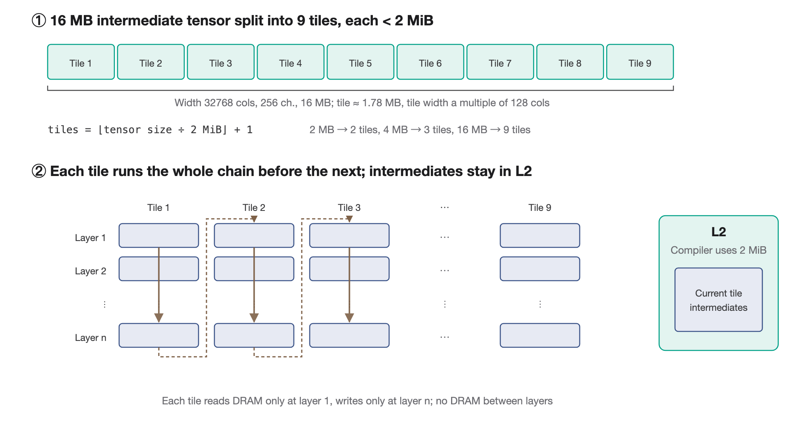

*Figure 9-1. Tiling of intermediate tensors. (1) A 16 MB intermediate tensor (256 channels, width 32768 columns) is split into 9 tiles of about 1.78 MB each. (2) Each tile executes the complete chain in succession, intermediate results remain in L2, and data is read from DRAM only at the first layer and written to DRAM only at the last layer.*

In a dual-ANE program, the compiler retains the tiling grid used for the single ANE and then assigns the list of whole tiles to the two ANEs. When the number of tiles is odd, the workloads of the two ANEs cannot be divided equally, and the extra tile is always assigned to ANE1. This causes the execution time of the dual-ANE program to be determined by ANE1. Across the widths measured, the execution time is at most about 19% longer than an even split, which corresponds to a throughput reduction of about 16%. This problem is discussed in detail in Chapter 10.

#### 9.2.3 Banks and Row Stride

maderix [4] found on the M4 that the SRAM consists of 64 banks interleaved at 16 bytes, and that the compiler selects an appropriate row stride to avoid bank conflicts. To verify this on the M6, we compiled 3×3 convolution chains (64 or 128 channels, height 16, width 8–136). Each model was compiled once with the default options and once with bank-conflict optimization disabled (`DisableL2BankConflictOpt=true`), and we compared the stride registers of L2 tensors (tool: [l2bank.py](../tools/07_memory/l2bank.py); data: [l2bank_table.txt](../data/07_memory/l2bank_table.txt)) 〔HWX〕.

With the optimization disabled, the values of registers such as 0x1044 and 0x1053, which we infer are the channel strides of L2 tensors, are all integer multiples of 1024 bytes. In the default compilation, the compiler adds 512 or 768 bytes to these values, and the two alternate with width. 1024 bytes is exactly 64 banks × 16 bytes, that is, the length of one cycle of the bank mapping. If the stride of each channel plane is an integer multiple of 1024 bytes, all planes start at the same bank, and accesses to adjacent channels conflict. Adding 512 or 768 bytes offsets the starting points of the planes by 32 or 48 banks. This result agrees with the bank count (64, offset 0x1e8) and access granularity (16 bytes, offset 0x1e0) in the HAL parameter table, and it provides evidence from M6 compiled artifacts for the structure of 64 banks with 16-byte interleaving 〔HWX, HAL〕. The `exe_cycles` values of the two compilations are exactly identical, which indicates that the compiler's performance model does not assign a penalty for bank conflicts on these shapes.

### 9.3 Weight Path

#### 9.3.1 Storage of Weights

Sections 5.6 and 7.3.1 have already described that the compiler sets a resident-weight limit of 64 KiB for each NE, so that 16 NEs total 1 MiB. Weights exceeding this capacity must be read from DRAM at every call. To confirm this, we compared two versions on a 1×1 convolution chain with 512 channels and width 16: one with weights that differ for each layer, and one in which all layers share a single set of weights (0.5 MB per layer). The results are shown in Table 9-3 (data: [c2b_run.txt](../data/07_memory/c2b_run.txt)) 〔timing〕.

*Table 9-3. Time for independent and shared weights (512 channels, width 16, single ANE)*

| Layers | Total weights | Independent weights | Shared weights | Difference |
| ------ | ------------- | ------------------- | -------------- | ---------- |
| 16     | 8 MB          | 195 µs              | 163 µs         | 33 µs      |
| 32     | 16 MB         | 264 µs              | 164 µs         | 100 µs     |
| 64     | 32 MB         | 382 µs              | 195 µs         | 187 µs     |
| 128    | 64 MB         | 733 µs              | 271 µs         | 462 µs     |

When the total weight is 8 MB, the version with independent weights is already 33 µs slower than the version with shared weights. The difference grows with the total weight, roughly in proportion to it (about 4–7 µs per MB). This timing includes host-side effects, and the exact weight-read bandwidth is given by the firmware timestamps in Section 9.3.2. The difference indicates that the weights cannot reside on chip as a whole and must be streamed in from DRAM at every call. The 16 MiB "streaming weight limit" in the HAL parameter table (offset 0x230) should describe the upper bound on the weights that the compiler streams in at one time, rather than the on-chip capacity 〔timing, HAL, inferred〕.

#### 9.3.2 Bandwidth

The differences in Table 9-3 are derived from Core ML call times, which contain host wake-up overhead that varies with task duration (Section 6.5). Computing bandwidth directly from these differences would underestimate the bandwidth of the weight path. We therefore determined this bandwidth from the ANE task duration recorded by kdebug. For the shapes used in Table 9-3, the ANE task duration grows smoothly with the amount of weights, at about 6.9 µs per MiB, that is, about 152 GB/s, with no step between 48 MiB and 52 MiB (data: [sw_ktrace_sum.txt](../data/07_memory/sw_ktrace_sum.txt)) 〔kdebug〕.

The measurements above cover only the narrow range of 48–52 MiB. To confirm that this bandwidth still holds when the amount of weights is much larger, we selected a structure with a very large amount of weights that, in practical applications, is limited by weight-read bandwidth: the multilayer perceptron of the decoding phase of a large language model. In the decoding phase, the full set of weights must be read once for every generated token, while the amount of computation is small, so it is a typical weight-read-bound workload on the ANE. We constructed a multilayer perceptron with the shape 2560 → 9216 → 2560, in which each pair of linear layers has about 94 MB of weights, and chained 1 to 4 such pairs, giving total weights of 94–377 MB. Each call of these models takes about 1 ms or longer. According to Section 6.5.2, at this duration the host-side completion overhead has saturated and no longer varies with task duration, so the timing slope can be used directly to obtain the bandwidth. The slope of time against the amount of weights gives 152 GB/s, consistent with the firmware-timestamp result (data: [bw_mlp_run.txt](../data/07_memory/bw_mlp_run.txt)) 〔timing〕. The total weights of this group of models far exceed the on-chip storage and the 16 MiB system-level cache, so the value of about 150 GB/s reflects the rate at which weights are read from DRAM.

The read-weight bandwidth measured from the Core ML timing slope is only about 130 GB/s when the total weight is small, and a step of about 55 µs appears near 48–50 MiB. Firmware timestamps show that the ANE task itself does not change before or after the step. The step and the lower slope both arise entirely from the host wake-up overhead described in Section 6.5. When the task duration exceeds about 350 µs, the CPU waiting for the result enters a deeper idle state, and the completion-side overhead of each call increases accordingly. This overhead grows with the number of layers and is mixed into the timing slope.

The bandwidth for reading weights is independent of the size of each layer's weights and of the kernel shape. With the total weight held fixed, changing the weights per layer from 128 KB to 8 MB (a factor of 64) gives timing-slope bandwidths between 127 and 133 GB/s, and the total times of the four partitionings are also nearly identical (data: [bw_blocksize_run.txt](../data/07_memory/bw_blocksize_run.txt)). On the small 8×8 spatial size, 3×3, 9×1 and 1×1 (1536 channels) convolutions, each with 4.5 MB of weights per layer, are all weight-read-bound, and the time per layer for each is about 33.4 µs (data: [bw_kshape_run.txt](../data/07_memory/bw_kshape_run.txt)) 〔timing〕. It follows that a weight block of 128 KB is already sufficient for the path to reach full speed.

#### 9.3.3 Weights and the System-Level Cache

The M6 SoC contains a system-level cache (SLC) shared by the CPU, GPU and ANE (called MCache in the compiler, with a capacity of 16 MiB given in the parameter table). Whether weights pass through the SLC affects the bandwidth for reading weights and the interference with other processors. Two lines of evidence indicate that, on the default Core ML path, weights do not use the SLC. First, the Core ML runtime compilation parameters recorded in the kernel log include `--disable-cache-prefetch-mask=1` and `--enable-memcache-kernel-allocation=false`, that is, weight cache prefetching and cache allocation are disabled. The driver implements complete SLC prefetch logic, but it is not enabled on this path 〔kernel〕. Second, if the total weights were smaller than the SLC capacity (16 MiB) and could hit in the SLC, models with small amounts of weights should be read faster. No such tendency was observed in the measurements, as the timing slope in the 8–32 MB range is not higher than that for larger amounts of weights 〔timing〕. In a dual-ANE program, when data is exchanged between the two ANEs, the compiler sets a DSID parameter for each ANE. We speculate that in this case the data exchange passes through the SLC (Section 5.8.2), but this does not mean that weights can be read from the SLC.

#### 9.3.4 Sharing of Weight Bandwidth Between Two ANEs

In a dual-ANE program, each of the two ANEs reads its own copy of the weights (Section 5.8.3). If the two ANEs each had independent weight-read bandwidth, a dual-ANE program should also obtain nearly a twofold speedup when it is limited by weight reads, and measurements do not support this. First, when a single ANE reads weights it already reaches about 150–159 GB/s (Sections 9.3.2 and 7.5), which is about 90% of the theoretical DRAM bandwidth of 170.5 GB/s (Section 9.5). Even if the second engine had an independent path, it could obtain only a small part of the remainder. Second, on native kernels, when the convolution chain is changed to use different weights at each layer, the combined weight-read rate of the two engines in dual-ANE mode is about 140 GB/s. The speedup relative to a single ANE falls from about 1.9× with shared weights to about 1.4× (Section 10.4) 〔timing〕. Finally, each ANE has two DRAM links (L0 and L1) in IOReport, and when weights are read, the two links each carry half, with the ratio not varying with the load (data: [pmp_L96.txt](../data/07_memory/pmp_L96.txt), [pmp_L100.txt](../data/07_memory/pmp_L100.txt)) 〔IOReport〕. Therefore, the bottleneck of weight reads does not lie on the link of a single ANE but on the DRAM side or on the path shared by the two ANEs 〔inferred〕.

Two other groups of experiments cannot be used to judge the sharing of DRAM bandwidth. For rewritten kernels with kernel widths 9–15 that are split by rows, each ANE processes only half of the rows, and the time per layer is twice that of a single ANE processing the same number of rows, so the overall throughput equals that of a single ANE (Sections 7.4.2, 10.4 and 10.7). The bottleneck of these kernels, however, is a stage whose cost is measured per weight element, and what it shows is that the two engines share this stage. For the 2-bit and 3-bit palettized models split across two ANEs in Section 7.5, each of the two engines stores a complete copy of the weights, and how much each engine actually reads from DRAM remains unclear.

### 9.4 Activation Path

#### 9.4.1 Inputs and Outputs per TD

The Tile DMA moves activation tensors between DRAM and L2. Section 5.7.6 states that the registers of the Tile DMA are divided into three groups: the first input (Src1), the second input (Src2) and the output (Dst). This register structure implies that a single TD can read and write at most three DRAM tensors directly. To determine how the compiler handles more inputs and outputs, we compiled a group of elementwise operation models and listed, TD by TD, the Tile DMA address packets written by each TD. The results are shown in Table 9-4 (tool: [tdma.py](../tools/07_memory/tdma.py)) 〔HWX〕.

*Table 9-4. TD structure of elementwise operation models*

| Model                    | TD structure                                                                                                                                                       |
| ------------------------ | ------------------------------------------------------------------------------------------------------------------------------------------------------------------ |
| a + b, a × b, a + a      | One TD: Src1, Src2, Dst                                                                                                                                            |
| x × 1.5                  | One TD: Src1, Dst                                                                                                                                                  |
| a + b + c                | Two TDs per channel block: the first reads a and b, and its result remains in L2; the second reads c as Src2, chains in the other operand from L2, and writes the result as Dst |
| a + b + c + d            | Three TDs per channel block, which read a and b, then c, then d in turn; the last TD writes the output                                                             |
| o1 = a + b, o2 = a − b   | Two TDs, each with one Dst                                                                                                                                         |
| o1 = a + b, o2 = relu(o1) | Two TDs; the second reads o1 back from DRAM as Src1                                                                                                              |

Table 9-4 shows that each TD reads at most two tensors from DRAM and writes at most one. This is a restriction that the compiler always observes, and we speculate that it derives from the structure of the hardware 〔HWX, inferred〕. When there are more than two inputs, the compiler splits the operation into several TDs, with intermediate results passed along a chain through L2. When there is more than one output, a separate TD must be started.

#### 9.4.2 Bandwidth

To measure the bandwidth of the Tile DMA, we constructed elementwise operation models with FP16 tensors of shape [1, 256, H, W] (H = W = 128, 192 and 256, that is, 8, 18 and 32 MB), and measured the task duration of each ANE with kdebug. All of these models were split by rows across the two ANEs, each processing half, with the two tasks fully overlapping. Table 9-5 gives the combined read and write bandwidth of each ANE (tool: [tdma_ktrace.sh](../tools/07_memory/tdma_ktrace.sh); data: [tdma_kt/](../data/07_memory/tdma_kt/)) 〔kdebug〕.

*Table 9-5. Activation read and write bandwidth per ANE*

| Model                      | 8 MB    | 18 MB   | 32 MB   | Slope from 18 to 32 MB |
| -------------------------- | ------- | ------- | ------- | ---------------------- |
| x × 1.5 (1 read, 1 write)  | 79 GB/s | 52 GB/s | 42 GB/s | 33.7 GB/s              |
| a + b (2 reads, 1 write)   | 56 GB/s | 41 GB/s | 38 GB/s | 35.7 GB/s              |
| a × b                      | 56 GB/s | 41 GB/s | 39 GB/s | 35.8 GB/s              |
| a + a (counted as two reads) | 62 GB/s | 50 GB/s | 43 GB/s | 35.9 GB/s            |

Computed from the slope between 18 MB and 32 MB, the combined read and write bandwidth per ANE for single-input and two-input operations lies between 34 and 36 GB/s and is nearly identical. If the two inputs each had their own path, the time for a + b should be close to that for x × 1.5. In the measurements, however, the time for a + b is 1.6–2.1 times that for x, which exceeds the ratio of the bytes read and written (1.5 times). This indicates that the two inputs do not add their bandwidths, and that a single TD having two inputs is only a compiler-level structure that does not correspond to two independent bandwidths. A field in the HAL parameter table (offset 0x5f6, read by `IsDualInputsPEWithSingleDMAEngine`) is 1 on H16 through H19. This indicates that a two-input operation has only one DMA engine, which serves the two inputs in a time-multiplexed manner 〔kdebug, HAL〕. The result for a + a also shows that when the same tensor is used as both inputs, it is read twice, and the compiler does not merge the two reads.

Small tensors achieve noticeably higher bandwidth; single-input operations reach 79 GB/s at 8 MB. We speculate that this is because the inputs have just been written by the CPU, and a portion of them is still located in the SLC. The larger the tensor, the closer the bandwidth approaches 35–40 GB/s 〔inferred〕. It follows that the bandwidth of the Tile DMA is about 35–40 GB/s per ANE, and about 70–80 GB/s for the two ANEs together. This is far below the approximately 150 GB/s of the weight path, and also below the bandwidth that DRAM can supply to the ANE. The limit therefore lies in the Tile DMA path itself, not in DRAM. Operations involving multiple TDs (two outputs or multiple inputs) show a further decline in bandwidth at 32 MB, to 14–27 GB/s.

This result is consistent with the absence of speedup for the W8A8 1×1 convolution chains in Section 7.5, although the quantitative agreement is not yet fully reconciled (see Section 7.5). In a W8A8 chain, the activations of every layer pass through DRAM, and the bandwidth of the activation path is only about one quarter of that of the weight path. Layers of low compute density, such as 1×1 convolutions, are therefore limited by activation bandwidth. The result also shows the importance of layer fusion and tiling (Section 9.2.2): as long as intermediate results remain in L2, they are not limited by Tile DMA bandwidth.

### 9.5 DRAM

#### 9.5.1 Structure and Frequency

We read the memory structure of the M6 (16 GB) from the device tree. The memory is a Micron product, and the type reported by the system is LPDDR5 (this applies only to the test machine we used). Because 10656 MT/s exceeds the highest rate of the LPDDR5 standard, the memory more likely belongs to the LPDDR5X class, although the type name reported by the system does not distinguish this 〔inferred〕. The memory is managed by one memory controller (AMCC). Under the controller there are eight DCS channels, all enabled. Each channel has the identifier of one DRAM die, and 16 GB divided by 8 equals one 2 GB die per channel, that is, a single-rank configuration. ECC is enabled 〔ioreg〕. The DRAM has eight available voltage and frequency states (device-tree `voltage-states2`, corresponding to DCS F2 through F9 in IOReport), but the frequency fields are omitted from the device tree. The SoC parameters in the compiler, the constant region of the CLPC driver, and the firmware of the PMP (Power Measurement Processor, as written in the Asahi Linux documentation [28]) each contain a DRAM frequency table. The three are consistent, with the highest state being 5328 MHz, that is, 10656 MT/s 〔compiler, kernel, firmware〕.

Under three workloads (the ANE alone reading weights, the GPU alone reading memory, and both running at the same time), IOReport shows that the residency fraction of the DCS F9 state exceeds 99.8% in each case (tool: [dramco.sh](../tools/07_memory/dramco.sh); data: [dramco/](../data/07_memory/dramco/)) 〔IOReport〕. Therefore, at full load the DRAM operates at the highest state, 10656 MT/s, and the theoretical bandwidth of the eight 16-bit channels is 170.5 GB/s.

#### 9.5.2 Bandwidth and Sharing

Table 9-6 gives the bandwidth of the ANE and the GPU, both alone and when reading memory simultaneously. The bandwidth of the ANE is derived from firmware timestamps, and that of the GPU is measured by a read-only Metal kernel (tools: [membw.swift](../tools/common/membw.swift), [bwco_ktrace.sh](../tools/07_memory/bwco_ktrace.sh); data: [bwco_kt/](../data/07_memory/bwco_kt/), [membw64_alone.txt](../data/07_memory/membw64_alone.txt), [membw64_co.txt](../data/07_memory/membw64_co.txt)) 〔kdebug, timing〕.

*Table 9-6. DRAM bandwidth of the ANE and the GPU*

| Condition            | ANE read of weights | GPU read          | Combined            |
| -------------------- | ------------------- | ----------------- | ------------------- |
| ANE alone            | About 153 GB/s      | —                 | About 153 GB/s      |
| GPU alone            | —                   | About 143–146 GB/s | About 145 GB/s     |
| Concurrent execution | About 78 GB/s       | About 85–90 GB/s  | About 163–168 GB/s  |

When the two run at the same time, the combined bandwidth reaches about 163–168 GB/s, which is about 96–99% of the theoretical value, showing that the memory channels themselves do not lose speed. However, each processor alone reaches only about 84–90% of the theoretical bandwidth. In this group of experiments, the ANE reached at most about 153 GB/s and the GPU about 143–146 GB/s. When both run concurrently, they roughly divide the total bandwidth equally. The row for concurrent execution combines ANE and GPU data from two different runs, so the combined value is given only as a range. The 32 GB version of the M6 has two ranks per channel, and interleaved access may improve the access efficiency of each processor, but this report does not have a 32 GB machine and cannot verify this 〔inferred〕.

This result has a direct consequence for the use of the ANE. When the ANE and the GPU concurrently execute workloads that are limited by read bandwidth, the ANE's weight-read bandwidth falls to about half.

### 9.6 Comparison with the M4 and the Literature

Table 9-7 compares the results of this chapter with the results of maderix [4] on the M4 and with the data of Bryngelson [5].

*Table 9-7. Comparison of memory and data-movement parameters*

| Item                    | M4 (maderix [4], except where otherwise noted)                | M5 (Bryngelson [5])            | M6 (this report)                                                                                                    |
| ----------------------- | ------------------------------------------------------------- | ------------------------------ | ------------------------------------------------------------------------------------------------------------------- |
| On-chip limit per operand | 2 MiB (HAL)                                                 | —                              | 2 MiB (HAL and compiled artifacts; L2 used as 2 MiB)                                                                |
| L2 banks                | 64, interleaved at 16 bytes                                   | —                              | 64, interleaved at 16 bytes; strides padded by 512 or 768 bytes                                                     |
| Beyond the limit        | Streamed in tiles, with double buffering                      | Timing inflection at about 4.72 MB | In two-layer models, number of tiles = ⌊size ÷ 2 MiB⌋ + 1; for longer chains, about ⌊size ÷ 1 MiB⌋ + 1; each tile executes the entire chain in succession, with no inflection in timing |
| Resident weights per NE | 64 KiB; up to 16 MiB streamed in 16 blocks                    | —                              | 64 KiB; the excess is read from DRAM at each call                                                                   |
| Weight-read bandwidth   | About 67 GB/s (measured on the M4 in this report, Section 7.5) | About 145 GB/s                 | About 150 GB/s (shared between two ANEs)                                                                            |
| Activation bandwidth    | Each additional input plane slows execution by about 995 µs   | About 24 GB/s                  | About 35–40 GB/s per ANE                                                                                            |
| DRAM                    | 120 GB/s (Apple's published specification)                    | —                              | 8 channels, 10656 MT/s, theoretical 170.5 GB/s                                                                      |

The on-chip storage organization of the M4 and the M6 (the 2 MiB per-operand limit, 64 banks, and the 64 KiB resident-weight limit) is completely identical in compiler parameters. This is consistent with the conclusion in Section 5.4 that the relevant fields of the HAL parameter table did not change. The changes in the M6 lie mainly outside L2. The DRAM bandwidth rises from 120 GB/s to 170.5 GB/s, and the weight-read bandwidth of a single ANE is about 150 GB/s. maderix reports that each additional independent input plane costs about 995 µs, and notes at the end that this figure reflects compiler scheduling rather than the width of the DMA. Table 9-4 of this report provides an explanation for this: each TD has at most two inputs, and additional inputs must be split into extra TDs.

### 9.7 Summary

This chapter addressed where data is stored, through which paths it is moved, and what the bandwidths are. Viewed from the way the compiler uses the hardware, the storage hierarchy consists of the 64 KiB resident-weight space of each NE, the L2 of each ANE used as 2 MiB, the system-level cache, and 8-channel DRAM. When an intermediate tensor exceeds 2 MiB, the compiler splits it into tiles; each tile executes the complete chain in succession, and intermediate results do not leave the chip. Weights and activations are moved through two different paths. The weight-read bandwidth is about 150 GB/s; a single ANE already approaches the upper limit of DRAM bandwidth, and two ANEs together cannot substantially exceed it. The activation path provides only about 35–40 GB/s per ANE, and each TD reads at most two and writes at most one DRAM tensor. DRAM operates at 10656 MT/s, and when the ANE and the GPU are used together, they roughly divide the bandwidth equally.

The conclusion that the two engines share the weight-read bandwidth is the main basis for the explanation in Chapter 10 of why dual-engine acceleration falls short. What remains undetermined is the physical capacity of the on-chip storage, the effect of bank conflicts on actual execution time, the cause of the decline in activation bandwidth for operations requiring multiple TDs on large tensors, and the bandwidth of machines with other memory configurations (Section 16.2). The deployment recommendations derived from the conclusions of this chapter are collected in Section 15.2 (Table 15-1).

## 10. Dual-Engine Cooperation

Compared with the M4, a principal architectural change in the M6 is the integration of two complete ANEs on the same die (Section 4.3). Chapters 5 and 6 have already described two mechanisms by which the second ANE is used. Within a single request, the compiler splits part of a subgraph across the two ANEs and generates the corresponding dual-ANE program (Section 5.8). Across multiple concurrent requests, the driver assigns requests to the two engines, and for dual-ANE programs that have already been generated, the runtime executes the work assigned to ANE1 (Sections 6.3.2 and 6.7). This chapter does not revisit these mechanisms themselves. Instead, it examines the practical performance gains they produce, focusing on two questions: how much speedup the second ANE can provide, and why the practical speedup falls short of the ideal factor of two. To this end, we first derive the expected performance from the mechanisms described above (Section 10.2). We then verify each expectation experimentally, and we use the compilation, scheduling and hardware structure described earlier to explain the differences between prediction and measurement.

This chapter reaches four main conclusions. First, for compute-bound networks, the performance of dual-ANE programs broadly matches expectations: their marginal throughput reaches 1.92× that of a single ANE, and the gap from the ideal factor of two mainly corresponds to a dual-engine cooperation overhead of about 0.14 µs per layer. Second, for weight-read-bound networks, the practical performance deviates most clearly from the ideal case. The two ANEs share a weight-read bandwidth of about 150 GB/s, and the compiler's cost model does not account for this limit. When row split is used, the two engines must each read a complete copy of the weights. As a result, convolution chains whose layers use different weights obtain only about 1.4× speedup, while rewritten kernels using row split show almost no speedup. Third, the compiler assigns work to the two ANEs in units of complete tiles and cannot split an individual tile further. When the number of tiles is odd, the resulting load imbalance increases execution time by 12.5–19% relative to an ideal even split, and it reduces throughput by 11–16%. Fourth, the benefit of request-level concurrency likewise depends on where the bottleneck lies. For weight-resident models, the two engines deliver throughput close to twice that of one engine. For weight-read-bound models, total throughput increases by only about 1.4×, and this gain comes mainly from filling host-side idle time between synchronous calls; the second engine itself contributes only about 4% additional processing capacity. The term "weight-read-bound" in this chapter covers two cases. In the first, native operators are limited by the DRAM bandwidth for weight reads. In the second, rewritten kernels are limited by the weight data path shared by the two engines (Section 7.4.2).

### 10.1 Method

This chapter uses the interrupt counts reported by IOReport to determine which ANEs actually participate in executing each call. The calibration method is described in Section 6.1 (tool: [bondrun.m](../tools/common/bondrun.m)) 〔IOReport〕. For experiments that require the execution duration of each engine, we use the task start and end events of kdebug. When the CPU column of these events is 36, they denote ANE0; when it is 33, they denote ANE1 (Table 6-1) 〔kdebug〕.

A methodological limitation of this chapter is that we cannot execute the same model separately in single-ANE and dual-ANE form. The program set that runs is determined by the runtime, and Core ML provides no option for selecting it. We therefore compare two models of similar shape that lie on either side of the compiler's splitting threshold. Specifically, we fix the number of channels and the layer structure and vary only the width. For a 1×1 convolution chain (512 channels, height 1) with width 128, the dual-ANE program has only a single sequence on ANE0. When the width is 256, the compiler splits each layer into two halves along the width, so that each ANE is responsible for exactly 128 columns. The total work is then identical to that of the single-ANE model with width 128 (tool: [bond_sweep.py](../tools/08_bonded/bond_sweep.py); data: [bond_wsweep_run.txt](../data/08_bonded/bond_wsweep_run.txt)) 〔timing, IOReport〕. In this way, the work of each engine is the same in both models, so the difference in execution time reflects the overhead of dual-engine cooperation. We measure the throughput of both models with the slope method (Section 7.1), using 600–1000 calls per point and two measurement rounds, which differ by less than 1%.

### 10.2 Expected Speedup

The expectations examined in this chapter follow from the mechanisms of Chapters 5 and 6. At the program level, the compiler decides whether to split according to "latency after splitting = (Σ block latencies + Σ copy-and-merge latencies) × 0.5" (Section 5.8.3). In other words, the latency of the split subgraph is expected to be halved. At runtime, the work of ANE1 is executed whenever a dual-ANE program contains it (Section 6.3.2). Consequently, once the compiler decides to split, this expectation is either fulfilled or unfulfilled on every request. At the request level, the driver assigns concurrently in-flight requests to the two engines (Sections 6.3.2 and 6.7). If the two engines do not interfere with each other, their combined throughput should be twice that of a single engine.

Both expectations rest on several implicit assumptions. This chapter tests four of these five assumptions. The fourth is left open because no control model is available. First, the coordination overhead of the two engines is negligible (Section 10.3). Second, the two engines do not contend for shared resources. Third, the two engines receive equal workloads, whereas the cost model considers only the sum of block latencies and not the largest block (Section 10.5). Fourth, the cost of synchronization is small when data must be exchanged (Section 10.6). Fifth, the gain from request-level parallelism is attributed entirely to the second engine; however, under synchronous calls, a single engine already spends about 23% of its time waiting for the host (Section 6.5), so these two components must be separated (Section 10.7).

### 10.3 Scaling Efficiency When Compute-Bound

This section examines the first assumption. If coordination incurs no overhead, the marginal throughput of a dual-ANE program should be twice that of a single ANE. Table 10-1 compares the latency of 1×1 convolution chains with width 128 (single ANE) and width 256 (dual ANE) at several layer counts. The layers in both groups of models share the same weights, which are resident on chip, so throughput is limited only by computation (data: [bond_ksweep_run.txt](../data/08_bonded/bond_ksweep_run.txt)) 〔timing〕.

*Table 10-1. Latency of single-ANE and dual-ANE programs (512-channel 1×1 convolution chain, shared weights, median)*

| Layers | Single ANE (width 128) | Dual ANE (width 256) |
| --- | --- | --- |
| 16 | 229 µs | 227 µs |
| 48 | 330 µs | 388 µs |
| 128 | 718 µs | 806 µs |
| 256 | 1178 µs | 1234 µs |
| 384 | 1595 µs | 1669 µs |

In the range of 256 to 384 layers, where the chain is longest and most linear, the marginal latency of a single ANE is 3.26 µs per layer, corresponding to 20.6 TFLOPS. The dual ANE takes 3.40 µs per layer. Because each layer of the dual-ANE model performs twice the computation of the single-ANE model, this corresponds to 39.5 TFLOPS, which is 1.92× that of a single ANE. The speedup is therefore 1.92, and the scaling efficiency of the two engines (speedup ÷ number of engines) is about 96%. The dual ANE takes 0.14 µs (about 4%) more per layer than the single ANE. The work of each engine is the same in the two groups of models, so this portion represents extra time incurred by the cooperation of the two engines. It is simply the difference between the marginal latencies of the two groups, and this report does not decompose it further. After the convolution chain is split by width, the two engines need not exchange data, and the TD sequence contains no cross-ANE sync records (Sections 5.8.2 and 10.6). This time therefore should not be attributed to inter-layer synchronization. Possible sources include contention between the two engines for shared resources, and a difference in NE DVFS state between the two programs (3.40 ÷ 3.26 ≈ 1.04; a frequency difference of about 4% would suffice to explain it) 〔timing, inferred〕. The firmware timestamps in Section 6.5.1 also indicate that a dual-ANE program spends about 30 µs more per call outside tasks than a single-ANE program, which we speculate is used for startup and completion synchronization of the two engines. Both of these overheads are small. Consequently, on compute-bound networks, dual-ANE programs achieve a speedup close to the ideal factor of two. Figure 10-1 shows how the latency of single-ANE and dual-ANE programs varies with the number of layers.

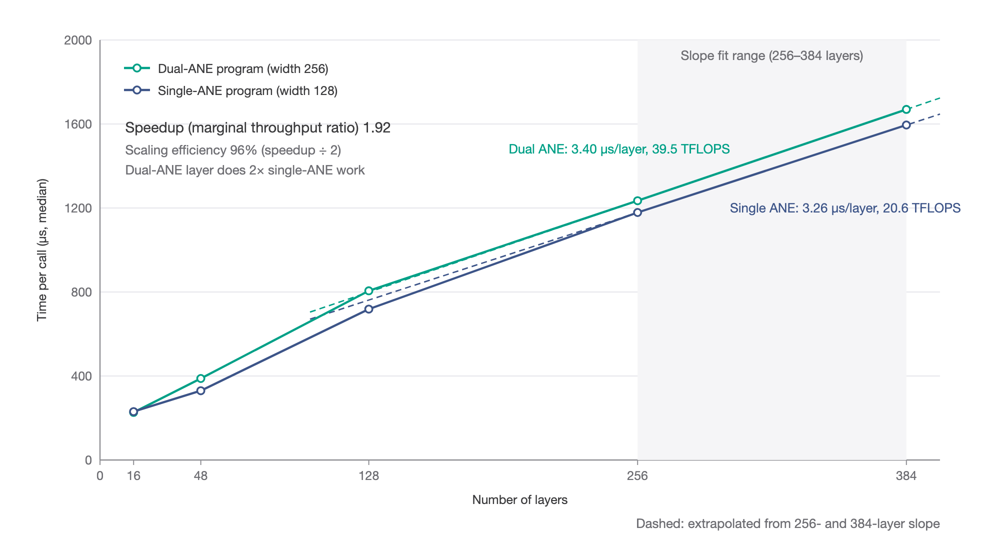

*Figure 10-1. Time per call as a function of the number of layers for a single-ANE program (width 128) and a dual-ANE program (width 256), each a 512-channel 1×1 convolution chain with shared weights. The dashed line is the extrapolation from the slope between the 256- and 384-layer points. The dual-ANE layer performs twice the computation of the single-ANE layer, yet the latency increases by only 0.14 µs per layer; the speedup computed from the ratio of marginal throughputs is 1.92 (data: [bond_ksweep_run.txt](../data/08_bonded/bond_ksweep_run.txt)).*

At small layer counts, the latency differences between the two groups of models in Table 10-1 cannot be directly attributed to cooperation overhead. For example, at 16 layers the latencies of the dual ANE and the single ANE are nearly identical, whereas at 48 layers the dual ANE is 58 µs slower. In this range, each call takes only a few hundred microseconds, and the host wake-up overhead described in Section 6.5 is in a regime that varies with task duration. Because the task durations of the two groups differ, this overhead is mixed into the latency differences. Therefore, this section relies only on the slopes above 256 layers as the basis for the scaling efficiency.

### 10.4 Scaling Efficiency When Weight-Read-Bound

The compiler's cost model expects latency to be halved after splitting, but it does not account for the weight-read stage that the two ANEs share (Section 5.8.3). Section 9.3.4 notes that a single ANE already reaches about 90% of the DRAM bandwidth when reading weights. Even if the second engine has an independent path, it can obtain only a very small share of the remaining bandwidth. Moreover, with row split, each of the two ANEs reads a complete copy of the weights, so the weight traffic doubles. The two groups of experiments in this section test this inference separately on rewritten kernels and on native kernels. Accordingly, when a network is limited by weight reads, we expect the computing capability of the second engine to translate into speedup only to a very limited extent, and this is especially true under row split.

The long-strip convolution experiment in Section 7.4.2 provides the most direct evidence. On a 1×9 convolution chain of 256 channels with a 16×32 shape, the compiler chooses row split, with each ANE responsible for 8 rows and all 256 output channels. Firmware timestamps show that the tasks of the two ANEs start and end at the same time and have equal busy durations. However, the latency per layer is 33.0 µs, which is exactly twice the latency of a single ANE processing the same number of rows. The prediction calculated as "two copies of the weights ÷ 150 GB/s" is 33.7 µs, which differs from the measurement by about 2%. In other words, the two engines run fully in parallel, but the overall throughput is identical to that of a single ANE, so the second engine provides no speedup at all. According to the analysis in Section 7.4.2, the two engines here share a bottleneck of the rewritten kernel that is measured in weight elements. For native kernels, the sharing instead arises from the DRAM bandwidth ceiling (Section 9.3.4) (data: [ks4_fit.txt](../data/05_compute/ks4_fit.txt); tool: [ks4_engines.py](../tools/05_compute/ks4_engines.py)) 〔kdebug, HWX〕. Convolutions of 1×12 to 1×14 at the same spatial size are split by output channel, so each ANE reads only half of the weights; the latency per layer is 24.9–30.4 µs, corresponding to an efficiency of 73–77% relative to the direct-convolution peak of the dual ANE. For the 32×32 shape, increasing the number of rows roughly balances computation against weight reads, and the efficiency of row split recovers to 86–89% (for all shapes from 1×9 to 1×15, Table 7-7 lists only some of them; data: [ks4_fit.txt](../data/05_compute/ks4_fit.txt)). We record this phenomenon as defect B9 (Appendix D).

This trend also appears in conventional convolution chains. We changed the models of Section 10.3 so that each layer uses different weights (0.5 MB per layer). Between 48 and 128 layers, the marginal latency per layer of a single ANE changes only slightly, from 4.85 µs with shared weights to 5.1 µs. For the dual ANE, it increases from 5.2 µs to 7.3 µs (data: [bond_dsweep_run.txt](../data/08_bonded/bond_dsweep_run.txt)) 〔timing〕. In dual-ANE mode, the two engines each read 0.5 MB, for a total of 1 MB per layer. Reading this amount in 7.3 µs corresponds to about 140 GB/s, which is already close to the upper limit of the weight-read bandwidth. Normalized by the computation per layer, the speedup of the dual ANE relative to the single ANE falls from about 1.9× with shared weights to about 1.4×. The timing slope in this range may include host wake-up overhead, so the specific multiples are for reference only. The direction of the conclusion, however, agrees with the firmware-timestamp results in the preceding paragraph.

These results indicate that, for workloads limited by weight reads, such as the decode stage of large language models, the benefit of using two ANEs is limited. If the compiler chooses row split, each of the two ANEs reads a copy of the weights, so the second engine not only fails to provide speedup but also consumes additional DRAM bandwidth. For such workloads, a better choice for the compiler is to split by output channel, so that each ANE reads only half of the weights, or simply not to split at all, which saves the power of the second engine (Chapter 13 measures that the second engine adds about 4.6 W at full load). Because users cannot control the compiler's splitting decisions, this improvement can only be implemented by the compiler.

### 10.5 Work Partitioning with Tiling

The compiler's cost model evaluates a split by summing the latencies of the computation blocks after splitting, and it does not consider the critical path determined by the largest block (Section 5.8.3). That is, it assumes by default that the two engines receive equal amounts of work. Section 9.2.2 notes that when an intermediate tensor exceeds 2 MiB, the compiler divides the tensor into several tiles, and each tile executes the complete chain in succession. In dual-ANE programs, this tiling scheme interacts with the division of work between the two engines. This interaction invalidates the default assumption and produces a measurable loss.

We measured the task durations of the two ANEs separately with kdebug. The model is a 1×1 convolution chain with 256 channels and height 1, in which all layers share weights, with widths from 6144 to 16384. Table 10-2 gives the results for 40 layers (tools: [asym_ktrace.sh](../tools/08_bonded/asym_ktrace.sh), [asym_split.py](../tools/08_bonded/asym_split.py); data: [asym_kt/](../data/08_bonded/asym_kt/)) 〔kdebug〕.

*Table 10-2. Task durations of the two ANEs under tiling (256-channel 1×1 convolution chain, 40 layers; the median is reported separately for each column)*

| Width | ANE0 task | ANE1 task | ANE1 ÷ ANE0 | ANE1 finishes later than ANE0 |
| --- | --- | --- | --- | --- |
| 6144 | 845 µs | 846 µs | 1.00 | −0.5 µs |
| 8192 | 913 µs | 1341 µs | 1.47 | 427 µs |
| 12288 | 1478 µs | 1903 µs | 1.29 | 420 µs |
| 16384 | 2041 µs | 2466 µs | 1.21 | 421 µs |

The task start times of the two ANEs are essentially the same. However, once the width reaches 8192, the ANE1 task becomes clearly longer than the ANE0 task, and the total call time is determined by ANE1. To identify the cause, we used [td_widths.py](../tools/lib/td_widths.py) to count, for an 8-layer model, the number of TDs and the number of columns processed per layer by each engine. The results are shown in Table 10-3 (data: [align_hwx.txt](../data/07_memory/align_hwx.txt)) 〔HWX〕.

*Table 10-3. Workload assigned to the two ANEs (8-layer model)*

| Model | ANE0 TDs | ANE1 TDs | Total column count ÷ 8 (ANE0 / ANE1) | Column-count ratio | Measured time ratio |
| --- | --- | --- | --- | --- | --- |
| 256 channels, width 6144 | 28 | 28 | 7680 / 7680 | 1.00 | 1.00 |
| 256 channels, width 8192 | 28 | 42 | 8320 / 12160 | 1.46 | 1.41–1.47 |
| 256 channels, width 12288 | 42 | 56 | 13440 / 17280 | 1.29 | 1.28–1.29 |
| 128 channels, width 24576 | 42 | 56 | 26880 / 34560 | 1.29 | 1.23–1.29 |

The "total column count ÷ 8" in the table is the sum of the numbers of columns processed by all TDs of each engine, divided by the number of layers. Because some TDs process the columns of two tiles at once (for example, 3328 = 2 × 1664), this value does not equal the width of each layer. It is used only to compare the relative workloads of the two engines. The column counts assigned to the two ANEs sum to the total of the single-ANE program, but the distribution is unbalanced. At width 12288, ANE0 and ANE1 carry about 44% and 56%, respectively, and at width 8192 they carry about 41% and 59%. The ratio of column counts agrees with the measured time ratio, so the asymmetry in time is fully explained by the asymmetry in workload.

The distribution of tile widths within each engine further reveals the source of the load imbalance. The dual-ANE program reuses the tiling grid of the single-ANE program and divides the tile list into two groups only at tile boundaries. Taking width 12288 as an example, the tile-width distribution of the single-ANE program equals the sum of the tile-width distributions of ANE0 and ANE1. When the number of tiles in a layer is odd, the tile list cannot be divided evenly, and the extra tile is always assigned to ANE1. The corresponding rule in the compiler assigns tile i to the ANE numbered (i ≥ T/2) (Section 5.8.3). Table 10-4 lists the split and the assignment for each layer at each width 〔HWX〕. Figure 10-2 shows the tile assignment of the dual-ANE program.

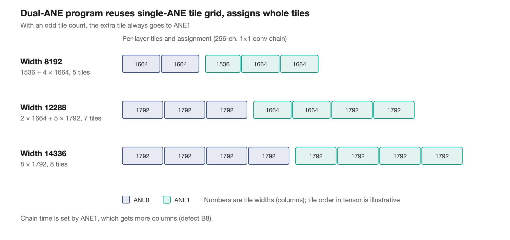

*Figure 10-2. Tile assignment of the dual-ANE program (256-channel 1×1 convolution chain). The dual-ANE program reuses the tiling grid of the single-ANE program and assigns whole tiles to the two ANEs; when the number of tiles is odd, the extra tile always goes to ANE1. The numbers in the boxes are tile widths (columns); the positions of the tiles in the tensor are schematic.*

*Table 10-4. Tiling of each layer and assignment to the two ANEs*

| Width | Split per layer | Tiles | ANE0 / ANE1 | Predicted time ratio | Measured |
| --- | --- | --- | --- | --- | --- |
| 6144 | 4 × 1536 | 4 | 2 / 2 tiles | 1.00 | 1.00 |
| 8192 | 1536 + 4 × 1664 | 5 | 2 / 3 tiles | 1.46 | 1.41–1.47 |
| 10752 | 6 × 1792 | 6 | 3 / 3 tiles | 1.00 | TD counts equal on both sides |
| 12288 | 2 × 1664 + 5 × 1792 | 7 | 3 / 4 tiles | 1.29 | 1.29 |
| 14336 | 8 × 1792 | 8 | 4 / 4 tiles | 1.00 | TD counts equal on both sides |

The assignment rule above implies that the parity of the number of tiles directly affects the load balance of the two ANEs. An even number of tiles can be divided equally, whereas an odd number necessarily gives one engine an additional computation tile. Measurements confirm this prediction. At width 14336 (8 tiles), the amount of computation is 17% larger than at width 12288 (7 tiles), yet the latency per layer is 2% smaller (49.3 µs versus 50.3 µs), so the throughput is about 19% higher (data: [bsplit_even.txt](../data/08_bonded/bsplit_even.txt)) 〔timing〕. Ideally, the latency of a dual ANE program equals half of the total workload. The actual latency, however, is determined by the share of ANE1. At width 12288, ANE1 carries 56.25% of the columns, so the latency is 12.5% longer than an even split, and the corresponding throughput is 1 ÷ 1.125 of the ideal value, that is, about 11% lower. At width 8192, ANE1 carries 59.4% of the columns, so the latency is about 19% longer than an even split, and the throughput is about 16% lower. Neither of the compilation options `DisableNetworkImbalanceAnalysis` and `EnableForcedMaximalBondedSplit` changes this partition (data: [bsplit_flags.txt](../data/08_bonded/bsplit_flags.txt)). We record this problem as defect B8 (Appendix D). A more extreme example appears in the 2048-channel, 32×32 W8A8 1×1 convolution chain, where the compiler divides the work between the two ANEs at about 1 : 2. As a result, the speedup of W8A8 relative to FP16 falls from 1.76–1.87× on balanced shapes to 1.21× (Table 7-2).

### 10.6 Data Exchange Between the Two Engines

Different operators have different cross-engine communication requirements after dual-ANE splitting. For pointwise convolution chains split by row, each engine can execute independently and need not exchange intermediate data. In contrast, operations such as 3×3 convolution, reduction along the height dimension, and softmax require data exchange across engines. For this purpose, dual-ANE programs use a scratch buffer shared by the two ANEs and cross-ANE sync records. For example, each ANE of a three-layer 3×3 convolution synchronizes once before layers 2 and 3 begin (Section 5.8.2).

This report does not directly measure the cost of this data exchange. The reason is that, for operations that require data exchange, we could not find a control model with the same workload that does not require exchange. Moreover, these operations are split differently in dual-ANE programs than in single-ANE programs (for example, after a 3×3 convolution is split, each ANE must read one additional row of overlapping input), so the latency difference cannot be attributed to synchronization alone. In the convolution chain of Section 10.3, which does not require data exchange, the cost is only about 0.14 µs per layer. However, that figure is the difference between the marginal latencies of two groups of models. It does not isolate synchronization itself, and it cannot be generalized to operations that require data exchange. Therefore, it cannot serve as a lower bound on the cost of data exchange.

### 10.7 Comparison of Two Parallel Modes

Section 6.7 shows that the driver assigns requests from different processes and different programs to the two engines. According to the expectation in Section 10.2, if the two engines do not interfere with each other, their combined throughput should be twice that of a single engine. The 1.78–1.81× measured in Section 6.7 is close to this expectation, but it was obtained with 1×1 convolution chains whose weights are resident on chip, a workload that reads almost no weights from DRAM. To determine whether request-level concurrency can circumvent the shared weight-read bandwidth described in Section 9.3.4, we followed the method of Section 6.7. We invoked a weight-read-bound model simultaneously in two processes and recorded the task times of the two engines with kdebug (tools: [d2_wbound.sh](../tools/04_schedule/d2_wbound.sh), [d2_wbound_fit.py](../tools/04_schedule/d2_wbound_fit.py); data: [d2_wbound.txt](../data/04_schedule/d2_wbound.txt)). The test model is an 80-layer chain of 1×9 convolutions with 256 channels, with input shapes of 4×32 or 8×32. Neither shape is split across the two ANEs (Section 5.8.4), and each layer re-reads 2.54 MB of weights within one TD. Strictly speaking, this rewritten kernel is limited by a stage shared by the two engines that is measured in weight elements rather than by DRAM byte bandwidth (Section 7.4.2). However, like native layers limited by DRAM weight reads, its combined rate does not increase when the two engines run simultaneously, so this chapter refers to both collectively as weight-read-bound. The control group is the original model from Section 6.7. The results are shown in Table 10-5 〔timing, kdebug, IOReport〕. The requests of the two processes were indeed assigned to the two engines: each engine had about two interrupts per call, and the results were identical whether the two processes used the same model file or separate model files. The combined throughput of the control group is 1.89×, which reproduces the result of Section 6.7 (slightly higher than 1.78×, mainly because the single-process latency was longer in this round). The two weight-read-bound models achieve only 1.36×. The results for 8×32 are almost identical to those for 4×32, which indicates that at this number of layers both are completely limited by weight reads, rather than being in an intermediate regime in which computation and weight reads each account for about half.

*Table 10-5. Weight-read-bound models invoked simultaneously from two processes*

| Model | Per-call time, single process | Per-call time, two processes | Combined throughput | Single task duration (single process → two processes) | Average rate converted from FP16 weight bytes |
| --- | --- | --- | --- | --- | --- |
| 1×9, 4×32, 80 layers | 1821 µs | 2686 / 2678 µs | 1.36× | 1391 → 2103 µs | 111 → 151 GB/s |
| 1×9, 8×32, 80 layers | 1826 µs | 2682 / 2683 µs | 1.36× | 1397 → 2104 µs | 111 → 151 GB/s |
| Control: 1×1, 512 channels, 1×128, 384 layers (weight-resident) | 1749 µs | 1853 / 1851 µs | 1.89× | 1326 → 1334 µs | — |

The kdebug task times explain the origin of the 1.36×. The rates below are all converted from FP16 weight bytes. Section 7.4.2 shows that the bottleneck of the 1×9 rewritten kernel is actually a shared stage measured in weight elements rather than DRAM byte bandwidth, so these figures reflect the rate of that stage. When a single engine runs alone, the rate of each task, converted from 2.54 MB × 80 layers, is about 145 GB/s. When the tasks of the two engines overlap, each engine achieves only about 76–78 GB/s, for a combined rate of about 150–156 GB/s. This is only about 3–8% higher than a single engine running alone, so the duration of each individual task increases from about 1390 µs to about 2100 µs. The combined throughput remains above 1.0× because, in single-process operation, the ANE spends about 23% of its time waiting for the host to submit the next request (Section 6.5). The two processes fill these gaps for each other, and the time during which both engines are idle drops to 0–2%. The average read bandwidth converted from weights therefore rises from 111 GB/s to 151 GB/s, and this ratio of 1.36 matches the combined throughput exactly 〔kdebug, inferred〕. In other words, the gain comes mainly from eliminating host-side idle time, not from additional processing capacity provided by the second engine. For native layers limited by DRAM weight-read bandwidth, we would expect the same outcome, because a single engine is already close to the upper limit of DRAM bandwidth (Section 9.3.4) 〔inferred〕. For the control group, whose weights are resident on chip, the duration of each task barely changes while the two engines run simultaneously, so the combined throughput approaches 2×.

Because the gain stems from eliminating host idle time, keeping multiple requests in flight within a single process should produce the same effect. To verify this, we used [asyncrun.m](../tools/common/asyncrun.m) to invoke the same `MLModel` object in one process in three ways: synchronous calls one at a time; asynchronous calls through `predictionFromFeatures:completionHandler:` with K requests kept in flight; and `predictionsFromBatch:`, which submits B inputs at a time. Each mode ran continuously for 8 s, two rounds were measured, and the tasks of the two engines were recorded with kdebug (tools: [d2_async.sh](../tools/04_schedule/d2_async.sh), [d2_async_fit.py](../tools/04_schedule/d2_async_fit.py); data: [d2_async.txt](../data/04_schedule/d2_async.txt)). Table 10-6 lists the main results 〔timing, kdebug, IOReport〕.

*Table 10-6. Throughput of different submission modes within a single process (range over two rounds)*

| Model | Submission mode | Throughput (relative to synchronous) | Busy fraction of the two engines | Single task duration |
| --- | --- | --- | --- | --- |
| 1×9, 4×32, 80 layers (weight-read-bound) | Synchronous | 1.00 (521–526 calls/s) | 77–78% / 0% | 1396–1398 µs |
| | Asynchronous, 2 in flight | 1.40–1.41 | 79% / 79% | about 2115 µs |
| | Asynchronous, 4 in flight | 1.41–1.42 | 100% / 100% | 2660–2671 µs |
| | Batched, 8 per batch | 1.35–1.37 | 83–85% / 84–85% | about 2660 µs |
| | Two processes, 2 asynchronous calls in flight each | 1.41–1.42 | 100% / 100% | 2667–2674 µs |
| 1×1, 512 channels, 384 layers (weight-resident) | Synchronous | 1.00 (523 calls/s) | 77% / 0% | 1326 µs |
| | Asynchronous, 2 in flight | 2.05–2.06 | 72% / 72% | about 1333 µs |
| | Asynchronous, 4 in flight | 2.82–2.83 | 100% / 100% | 1328–1338 µs |
| | Batched, 8 per batch | 2.46 | 76–78% / 78% | about 1330 µs |
| | Two processes, 2 asynchronous calls in flight each | 2.82 | 100% / 100% | 1330–1342 µs |

Figure 10-3 plots the throughput of the two models under seven submission modes together with the busy fractions of the two engines.

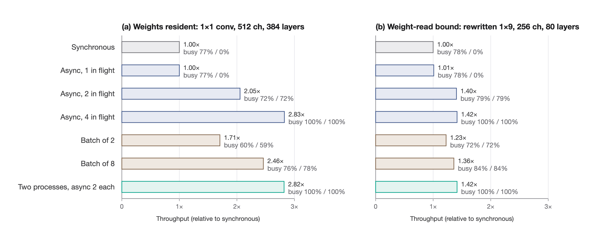

*Figure 10-3. Throughput of different submission modes within a single process (relative to synchronous calls; the average of two rounds, which differ by no more than 0.05×). (a) Weight-resident 1×1 convolution chain; (b) weight-read-bound rewritten 1×9 kernel. The second line beside each bar gives the busy fractions of ANE0 / ANE1. With synchronous calls, only ANE0 works, and it waits for the host for about 23% of the time. Once two or more requests are kept in flight, both engines begin to work. For weight-resident models, throughput reaches about 2.8× that of synchronous calls; for weight-read-bound models, it reaches only about 1.4×, and both engines are already 100% busy, so the gain comes almost entirely from eliminating host-side idle time (data: [d2_async.txt](../data/04_schedule/d2_async.txt)).*

Table 10-6 raises three points. First, under asynchronous calls, the requests for the same `MLModel` object in the same process are assigned to both engines. As long as two or more requests are in flight, both engines have tasks. This differs from the result of Section 6.7.2, in which requests from multiple threads that synchronously call the same model are serialized. This indicates that the serialization there occurs on the synchronous-call path (defect B3). Second, for weight-read-bound models, the saturated throughput of single-process asynchronous calls is identical to that of two processes (about 742 calls per second, or about 150 GB/s when converted from FP16 weight bytes), so adding a second process does not make it faster. At saturation, both engines are 100% busy, and each receives only about half of the rate (about 76 GB/s). The duration of each single task therefore increases from 1.40 ms to 2.66 ms. Compared with about 145 GB/s for a single engine running alone, the two engines together add only about 4% (3–8% in the two-process experiment of Table 10-5). If one engine ran alone with no host idle time, the throughput would be about 1.37× that of synchronous calls, and the measured value is 1.41×. Therefore, the gain of about 1.4× comes almost entirely from eliminating host idle time 〔kdebug, inferred〕. The synchronous baseline of this group (521–526 calls/s) is about 5% slower than in the experiment of Table 10-5, and synchronous throughput fluctuates by 5–8% across time periods, whereas the absolute saturated throughput is identical each time. The 1.41× here is therefore not inconsistent with the 1.36× of Table 10-5.

Third, for weight-resident models, single-process asynchronous calls with 4 requests in flight reach 2.82–2.83× the throughput of synchronous calls. If task execution speed were unchanged, two fully loaded engines relative to one engine that is 77% busy would yield only 2 ÷ 0.77 ≈ 2.60×, and the surplus comes from the fact that tasks are themselves slower under synchronous calls. The task durations in Table 10-6 are medians, whereas the busy fraction is the ratio of the sum of task durations to the time window, which is equivalent to using means. Following the pairing method of [d2_async_fit.py](../tools/04_schedule/d2_async_fit.py), we recomputed the statistics from the same kdebug records and the same time window (about 7.5 s per segment after discarding the first 1.5 s). Under synchronous calls, the number of tasks corresponds to 524 per second, consistent with the 523 measured by asyncrun. The median task duration is 1326 µs, but the mean is 1472 µs, and the 90th percentile reaches 1887 µs, meaning that about one tenth of the tasks are noticeably slower. With 4 asynchronous calls in flight, the mean is 1353 µs, close to the median of 1329–1336 µs. Thus 2.83 ≈ (2 ÷ 0.77) × (1472 ÷ 1353) ≈ 2.60 × 1.09, where the two factors correspond, respectively, to the elimination of host idle time and to the speed-up of individual tasks 〔kdebug〕.

Weight-read-bound models also satisfy the same relation. Under synchronous calls, the mean task duration is 1473 µs and the median is 1396 µs. Under saturated asynchronous calls, the mean is about 2695 µs. (2 ÷ 0.77) × (1473 ÷ 2695) ≈ 1.42, which agrees with the measured 1.41–1.42×.

The shortening of individual task durations under asynchronous concurrency can be explained by the frequency-scaling mechanism of the CLPC analyzed in Chapter 12. The statement that the CLPC stabilizes the busy fraction of the ANE at about 77% presupposes that host-induced idle time exists between tasks. Tasks that are slower under synchronous calls most likely run at a lower DVFS state. Once two or more requests are kept in flight, tasks run back to back. The mean and the median then differ by less than 2%, which indicates that almost all tasks run at the same DVFS state 〔kdebug, inferred〕.

Batched submission is less effective than asynchronous submission. With 8 per batch, it achieves only 2.46×, and measured by the sum of task durations, the two engines still have about 20% idle time. In batched submission, about one tenth of the tasks lack the firmware start event, so the paired task durations are biased toward shorter values, and this proportion may be too high 〔timing, kdebug〕.

Table 10-7 summarizes the ways of using two ANEs and compares the measured results with the expectations of Section 10.2.

*Table 10-7. Ways of using two ANEs: expectation, measurement and gap*

| Approach | Condition | Expectation | Measurement | Main cause of the gap |
| --- | --- | --- | --- | --- |
| Dual-ANE program, compute-bound | Compiler decides to split; spatial dimensions are large enough | 2× | 1.92× (marginal; scaling efficiency about 96%) | Cooperation time of about 0.14 µs per layer (Section 10.3) |
| Dual-ANE program, weight-read-bound and row-split (rewritten kernel) | Same as above | 2× | About 1.0× | The two engines share a rewritten-kernel stage measured in weight elements, and each reads a copy of the weights (Sections 7.4.2 and 10.4) |
| Dual-ANE program, weight-read-bound (native kernel, different weights per layer) | Same as above | 2× | About 1.4× (timing slope, including host-side effects) | The two engines share the weight-read path (Sections 9.3.4 and 10.4) |
| Dual-ANE program, data exchange required | Same as above | Synchronization cost is small | Not measured | No control model with equal workload (Section 10.6) |
| Dual-ANE program, odd number of tiles | Intermediate tensor exceeds 2 MiB | 2× | 11–16% below the ideal value | Whole-tile assignment; ANE1 receives an extra tile (Section 10.5) |
| Two processes running the same model, weight-resident | Driver assigns requests to two ANEs | 2× | 1.78–1.89× | About 6–12% longer per call (across rounds); not decomposed in this report (Section 6.7.1; Table 10-5) |
| Two processes running the same model, weight-read-bound | Same as above | 2× | 1.36× | The two engines together still reach about 150 GB/s; the gain comes almost entirely from filling host idle time |
| Two different programs in the same process | Same as above | Sum of the two running alone | 86% of the sum of the two running alone | Each call about 13% slower; not decomposed in this report (Section 6.7.2) |
| Multithreaded synchronous calls to the same program in one process | Requests serialized on the synchronous-call path | — | 1.0× | Serialization (Section 6.7.2; defect B3) |
| Asynchronous calls to the same program in one process, 2 or more in flight | Requests assigned to both ANEs | About 2.6× relative to synchronous (2 ÷ 0.77) | Weight-resident 2.8×; weight-read-bound 1.4× | Weight-resident: some tasks are slower under synchronous calls; weight-read-bound: the weight stage shared by the two engines (rewritten kernel) |
| Mixed dual-ANE and single-ANE programs | Requests for single-ANE programs fill idle time | — | 25–30% higher than running the two separately | — |

In the "measurement" column of the table, values are throughput relative to a single engine unless otherwise noted. The asynchronous-call row is relative to synchronous calls (data: Section 6.7 and this chapter) 〔timing, IOReport〕.

Dual-ANE programs and request-level parallelism serve two different optimization goals: the latency of a single call and the overall throughput. Dual-ANE programs suit situations in which a single request is latency-sensitive and the network computation is compute-bound, such as convolutional network inference on a single image. They can shorten the computation time of a single call by nearly half, but users cannot control whether the compiler splits, and weight-read-bound networks obtain only limited speedup. Request-level parallelism suits situations in which throughput matters, such as processing multiple inputs at the same time. It does not depend on the compiler. It can be achieved by keeping several requests in flight asynchronously within a single process, without requiring multiple processes, but it does not reduce the latency of a single call. For weight-read-bound networks, request-level parallelism faces the same limitation as dual-ANE programs. Tables 10-5 and 10-6 show that, when the two engines read weights simultaneously, the combined rate remains about 150 GB/s, and the gain of about 1.4× comes almost entirely from eliminating host-side idle time.

### 10.8 Comparison with the Literature

Without access to M6 hardware, maderix [4] estimated, from public information such as dual 16-core engines and a memory bandwidth of 170 GB/s, that the M6 has a peak compute capability of 38 TFLOPS (FP16) and 76 TOPS (W8A8). maderix also raised three questions that could not yet be confirmed: whether the two engines share SRAM, whether one inference requires one or two dispatches, and whether a single compute graph can execute across the two engines. The experiments in this chapter provide further measured results for these estimates and questions. In terms of performance, the theoretical direct-convolution peak of the two engines combined is 42.3 TFLOPS (FP16) and 84.5 TOPS (INT8), both higher than maderix's estimates. This difference may arise mainly from the NE operating frequency of about 2.58 GHz measured in this report 〔inferred〕. The measured marginal throughput for FP16 is 39.5 TFLOPS. In terms of storage, each of the two engines has its own 2 MiB L2, allocated independently by the compiler, whereas data exchange across engines uses a shared scratch buffer allocated by the runtime. In terms of scheduling, the compiler can partition a single compute graph across the two engines and generate the corresponding dual-ANE program. When such a program is executed once, the runtime starts ANE0 and ANE1 once each. Therefore, a single compute graph can execute across the two engines, but its cross-engine partition is determined at compilation time.

Bryngelson [5] speculated, based on the kernel driver of an earlier product, that multi-die products dispatch requests to the least busy die in units of whole submissions, and that tensors are not exchanged between dies. The compiler contains an implementation of collective communication, but it is not enabled on any target. The M6 differs from this picture. Its two ANEs are on the same die, and they cooperate within a single submission, exchanging data, through dual-ANE programs. Meanwhile, the driver also dispatches requests for different programs to different engines in units of whole submissions (Section 6.3.2). In other words, the M6 combines the request-level dispatch described by Bryngelson with a new program-level cooperation.

### 10.9 Summary

This chapter tested by measurement the dual-engine mechanisms of Chapters 5 and 6. Ideally, both ways of using the two engines should double performance: the compiler's cost model assumes that latency is halved after splitting, and request-level parallelism expects the two engines to double the combined throughput. The gap between measurement and expectation depends on the workload. On compute-bound networks, the marginal throughput of a dual-ANE program is 1.92× that of a single engine, a gap of only about 4%, corresponding to a cooperation time of about 0.14 µs per layer. Request-level parallelism also approaches a twofold gain on weight-resident models, and asynchronous calls within a single process reach 2.8× the throughput of synchronous calls when four requests are kept in flight. The largest gap occurs for weight-read-bound networks. The two ANEs share a weight-read bandwidth of about 150 GB/s, which the compiler's cost model does not account for, and under row split each reads a copy of the weights. As a result, convolution chains whose layers use different weights achieve only about 1.4×, and rewritten kernels using row split show no speedup. Request-level parallelism on these models is likewise limited to about 1.4×, and its gain comes almost entirely from eliminating host-side idle time. Another gap arises from work partitioning. The compiler reuses the tiling grid of the single-engine program and assigns whole tiles. When the number of tiles is odd, ANE1 receives an extra tile, which lengthens the execution time by 12.5–19% relative to an even split and reduces the throughput by 11–16% relative to the ideal. Overall, these gaps all stem from the same kind of simplification in the mechanisms. The compiler treats the two engines as resources that do not interfere with each other and have equal workloads, whereas in fact they share the weight-read path, and the workloads assigned to them are not necessarily equal.

This chapter, together with Chapters 5 and 6, completes the argument for the dual engines. Chapter 5 explains how compilation arranges the work, Chapter 6 explains how execution proceeds at runtime, and this chapter gives the actual gains and their differences from expectation. Questions that remain are the synchronization cost of operations that require data exchange, and whether the approximately 0.14 µs per layer of cooperation time stems from resource contention or from differences in NE DVFS state. The former requires a control model with equal workload but a different number of exchanges, and the latter requires reading out the NE DVFS states under the two programs (Section 16.2). The power cost of the second engine is covered in Chapter 13. Deployment recommendations derived from the conclusions of this chapter are concentrated in Section 15.2 (Table 15-1).

## 11. Clock Domains

The preceding discussion relied on two assumptions. Chapter 7 converted peak throughput using the full-load clock of 2.58 GHz, and Section 7.6 relied on the conclusion that the PE clock is independent of the NE clock. This chapter provides the justification for both. It examines how many independent clock domains the ANE has, which DVFS states each domain has, what frequency each actually runs at under full load, and whether the frequencies assumed by the compiler agree with the hardware. The system provides no readout of the ANE's "current frequency," so we can infer frequency only from changes in task duration. The main conclusions of this chapter are four. First, the NE clock of each ANE has 32 DVFS states, with an operating range of 852–2580 MHz, and it runs at 2580 MHz under full load, rather than at the top state of 2508 MHz in the compiler's frequency table. Second, the PE sits in an independently scheduled clock domain. It ramps up slowly, and it is repeatedly pushed back to low states when the GPU is active simultaneously. If the compiler's mapping table is followed, the PE runs at about 1.8–1.9 GHz under full load, although this estimate is not independent (Section 11.3.2). We speculate that this clock domain is the shared cluster used by both ANEs, and that the L2 is likely located within it. Third, we infer that the five states of the table that the compiler calls the "DMA frequency table" actually describe the frequencies of the SoC interconnect. The ANE has no voltage domain of its own. Instead, it votes on the SoC voltage domain to obtain the voltage it requires. Fourth, the DRAM runs at its top state of 10656 MT/s when the ANE is at full load.

### 11.1 Measurement Method

The ANE clock frequency has no directly readable system interface, so indirect methods are required. We examined all possible sources. The ANE driver node in the IORegistry records only the power state. Among the 8288 channels of IOReport, the memory controller, the CPU and the GPU all report residency times for each state, whereas the ANE reports only the PLL switching, the total time its clock is enabled, and counts of ramp-down events. The ANE has hardware performance counters, but they can be read only through a private interface that attaches a statistics buffer when a request is submitted, which exceeds the constraints of this report 〔ioreg, IOReport, kernel〕. Therefore, we can measure frequency only indirectly.

The indirect measurement exploits the inverse relation between execution time and clock frequency for a fixed workload. For a task with a fixed amount of computation whose data all reside on chip, the execution time T and the clock frequency f satisfy T = C / f + D, where C is the number of clock cycles required by the task and D is a fixed time that does not depend on frequency. If task durations can be measured at different DVFS states and the frequencies of those states are known, C and D can be fitted. The full-load frequency can then be inferred back from the task duration at full load. When the ANE starts work from idle, its clock steps up from low states to high states one at a time. This behavior is controlled by the CLPC, and Chapter 12 studies its pattern. The process thus provides an opportunity to measure the same task at multiple states. Task durations are obtained from the task start and end events that the firmware records in kdebug (Table 6-1), with a time resolution of one period of the 24 MHz timer 〔kdebug〕.

The frequency values of the states come from three mutually independent static sources: the frequency tables of the power-management nodes in the device tree, the SoC parameters built into the compiler (Section 4.4), and the constant regions of the CLPC and power-management drivers in the kernelcache 〔ioreg, compiler, kernel〕. For clock domains that have no frequency table, we determined whether different functional units belong to the same clock domain by comparing how their task durations change over time. We observed the state of the interconnect with the SoC voltage-domain state statistics reported by IOReport 〔kdebug, IOReport〕.

### 11.2 NE Clock

#### 11.2.1 Frequency Table

The two properties `voltage-states8` and `voltage-states29` of the power-management node in the device tree each list the frequencies of 32 states, and their contents are identical 〔ioreg〕. Table 11-1 lists these 32 frequencies.

*Table 11-1. ANE frequency table in the device tree (MHz)*

| States 1–8 | States 9–16 | States 17–24 | States 25–32 |
| --- | --- | --- | --- |
| 804 | 1188 | 1716 | 2280 |
| 828 | 1248 | 1788 | 2352 |
| 852 | 1308 | 1872 | 2364 |
| 960 | 1368 | 1908 | 2436 |
| 996 | 1404 | 1968 | 2448 |
| 1032 | 1476 | 2052 | 2484 |
| 1092 | 1548 | 2112 | 2508 |
| 1128 | 1632 | 2196 | 2580 |

The correspondence between voltage tables and performance domains in the device tree is recorded in the `perf-domains` property: `voltage-states8` corresponds to ANE0, and `voltage-states29` corresponds to ANE1. This agrees with the two performance domains (8 and 29) of the ANEs in the CLPC described in Section 4.3 〔ioreg〕. In other words, the NE clock of each ANE is an independent performance domain with its own 32-state frequency table, whereas the other parts of the ANE have no voltage table of their own in the device tree. The ANE frequency table used by the CLPC in the kernelcache (`_anePerfStateFrequenciesMHz`, 32 states) is provided at runtime by the power-management driver and is consistent with the device tree 〔kernel〕.

The compiler's NE frequency table (`Soc2026BaseLine`, Section 4.4) also has 32 states. Its first 24 states are identical to those of the device tree, entry by entry, while the last 8 differ. The device tree lists 2280 to 2580 MHz for these states, whereas the compiler lists 2244 to 2508 MHz. The compiler's top state of 2508 MHz corresponds only to state 31 of the device tree 〔compiler, ioreg〕.

#### 11.2.2 Full-Load Frequency

We measured this with a single ANE, in which all layers share weights and DRAM is not read: a 1×1 convolution with 512 channels, a 1×128 shape, and 384 layers. In each round, the ANE is first left idle for 2.5 s so that its clock drops to a low state. It then executes 800 calls in succession, and we record the complete ramp of the clock from a low state to full load. Six rounds were measured in total, yielding 4920 tasks (tools: [freq_ktrace.sh](../tools/09_clock/freq_ktrace.sh), [freq_fit.py](../tools/09_clock/freq_fit.py); data: [freq_kt/](../data/09_clock/freq_kt/)) 〔kdebug〕.

The task duration in each round begins at about 3809 µs, passes through a series of steps, and finally stabilizes at 1267.5 µs. The steady segment accounts for 79% of all tasks, and the medians of the steady segments across the six rounds differ by no more than ±0.7 µs. To avoid presupposing which frequency table is correct, we fitted only the five lowest major steps. We excluded the step at about 1188 MHz, which has very few tasks. The states corresponding to these five steps are identical in the two tables. The fit results are shown in Table 11-2.

*Table 11-2. Fit of the low-state steps (T = C / f + D)*

| Step duration | Tasks | Corresponding state | Fit deviation |
| --- | --- | --- | --- |
| 3809.1 µs | 25 | 852 MHz | +0.29% |
| 2382.1 µs | 24 | 1368 MHz | +0.06% |
| 2108.3 µs | 45 | 1548 MHz | −0.02% |
| 1904.7 µs | 43 | 1716 MHz | −0.11% |
| 1748.9 µs | 27 | 1872 MHz | −0.22% |

This fit first requires the range of the fixed time D to be constrained. If D is unconstrained, the deviations of the five-step fit keep decreasing as D increases (reaching only 0.02% at D ≈ 27 µs), so the solution is not unique. Such solutions would convert the full-load duration of 1267.5 µs to about 2598 MHz, which does not appear in any frequency table. The value of D can be estimated from an independent measurement. In the first round of experiments in Chapter 6, the mean task durations of models of the same shape with 16 and 384 layers were 58.1 µs and 1269.5 µs, respectively. The intercept at zero layers obtained by linear extrapolation is about 5.4 µs (data: [d1_out/](../data/04_schedule/d1_out/)) 〔kdebug〕. We take this intercept as the lower bound and relax the upper bound to about twice that value, so that D is constrained to 5–12 µs. The upper bound is chosen to accommodate the measurement error of the intercept and has no other basis. Within this range, the best fit has an RMS deviation of 0.17–0.24%, and the solution is unique (the suboptimal solution has a deviation of 0.57%). Each task corresponds to about 3.24–3.26 × 10⁶ cycles, which varies slightly with D within this range 〔kdebug, inferred〕.

Based on this fit, the duration of a full-load task would be 1269.5 µs at 2580 MHz and 1305.6 µs at 2508 MHz. The measured value is 1267.5 µs, which implies a full-load frequency of 2578–2584 MHz. This result cannot be explained by a limitation from another bottleneck at full load, because such a limitation would only make tasks longer than predicted. The measured value, by contrast, is about 3% shorter than the prediction at 2508 MHz.

Clustering by task duration shows that the six rounds pass through more steps than the 10 in the typical trajectory listed in Section 11.2.3. Some rounds also pass through states near 1034, 1128, 1509, 1786 and 2045 MHz, and the paths of the rounds are not entirely the same. We tested both frequency tables using the 13 steps that contain at least 20 tasks. Three of these steps (1390.8, 1397.7 and 1409.0 µs) all correspond to 2352 MHz, two (1493.9 and 1505.7 µs) correspond to 2196 MHz, and two (1267.5 and 1275.6 µs) correspond to 2580 MHz, so fewer than 13 states are actually involved. With D at a small value, the device-tree table plus 2580 MHz gives an RMS deviation of 0.62%, whereas the compiler table plus 2508 MHz gives 1.13%. As a control, the 1st percentile of the deviations for randomly selected steps is 0.8%. If D is allowed to reach about 60 µs, the deviation of the compiler table can be reduced to 0.41%, which is actually lower than that of the device-tree table. However, a fixed time of 60 µs differs by an order of magnitude from the intercept of about 5.4 µs given above, so we consider it untenable. Therefore, under the premise that D is a few microseconds, the NE clock runs at the top state of the device-tree table, 2580 MHz, under full load 〔kdebug, inferred〕. Figure 11-1 shows the steps in task duration when calls are issued continuously from idle.

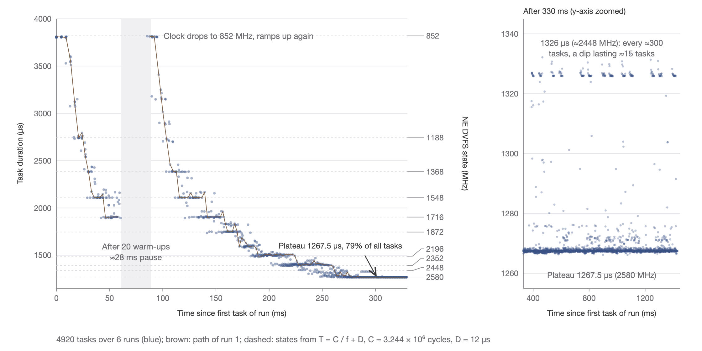

*Figure 11-1. Task duration measured with kdebug as a function of time when the same model (1×1 convolution, 512 channels, 1×128, 384 layers) is called continuously after each round's 2.5 s idle period (6 rounds, 4920 tasks). The left panel shows the first 330 ms, with the device-tree states converted from T = C / f + D on its right-hand scale. After 20 warm-up calls, a pause of about 28 ms returns the clock to 852 MHz, and the clock then steps up to 2580 MHz (1267.5 µs). The right panel shows the steady segment after 330 ms, with an enlarged vertical axis, where brief dips to about 1326 µs occur about once every 300 tasks (data: [freq_kt/](../data/09_clock/freq_kt/)).*

This result also yields the conversion used in Section 7.2.1. The model requires about 8450–8480 cycles per layer and performs 33.55 million MAC operations, that is, about 3960–3970 MACs per cycle, or about 247–248 MACs per cycle per NE. This is about 97% of 256. The timing slope in Section 7.2.1 gives 249.5 MACs per cycle (97.5%). The two values come from cycle-count fitting and timing-slope methods, respectively, and from measurements in different rounds, and they differ by less than 1%.

#### 11.2.3 Operating Range

The states encountered during ramp-up, in order, are 852, about 1188, 1368, 1548, 1716, 1872, 2196, 2352, 2448 and 2580 MHz 〔kdebug〕. At the start of each round, the measurement tool first executes 20 warm-up calls (about 60 ms, during which the clock rises only to about 1716 MHz). It then pauses for about 28 ms to establish the timing window, and during the pause the clock falls back to 852 MHz. In subsequent full ramps, rising from 852 MHz to 2448 MHz requires 69–85 tasks and 124–146 ms of ANE execution time (wall-clock time 152–181 ms), and rising to 2580 MHz requires 158–189 ms of wall-clock time 〔kdebug〕. This is consistent with the step-wise ramp-up measured under the same host idle conditions in Section 12.3, which also shows that the speed of ramp-up depends on the host idle time between calls. Once the steady segment is reached, a brief dip occurs about every 300 tasks, consisting of about 15 tasks at about 2448 MHz (1326 µs) 〔kdebug〕. Notably, the ramp-up starts from state 3 (852 MHz), not from the lowest state in the table, 804 MHz. In Section 12.2, when the steady state is measured with a sleep of more than 400 µs before each call, the lowest state selected by the CLPC is likewise 852 MHz. Therefore, the actual operating range of the NE clock is 852–2580 MHz, and the two lowest states (804 and 828 MHz) never appeared in the experiments of this report.

IOReport shows that each ANE has two PLLs. When the ANE is idle, both PLLs are off. They turn on within about 0.1 s after work begins and remain on throughout full load 〔IOReport〕. Because the PLLs are already on during the ramp-up, the ramp-up proceeds state by state within the frequency table, rather than through a transition of the PLLs from off to on.

### 11.3 Clock of the Shared Cluster

#### 11.3.1 The PE Is Not in the NE Clock Domain

The compiler's performance model places the PE in a clock domain different from that of the NE. For a pure-PE TD, the estimated latency equals the number of PE cycles divided by 1.812 GHz. For this purpose, the compiler has a built-in table mapping NE frequency to L2 frequency (`GetMapNEToL2Frequencies`). The M6 mapping table has 32 entries, corresponding one-to-one to the NE frequency table. The L2 frequency is about 0.72–0.85 times the NE frequency, and at 2508 MHz for the NE it corresponds to 1812 MHz (data: [socfreq_ne2l2.txt](../data/09_clock/socfreq_ne2l2.txt); tool: [socfreq_map.c](../tools/re/socfreq_map.c)) 〔compiler〕. According to this mapping table, the PE clock should vary in step with the NE clock.

Measurement rejects this assumption. We alternately started the convolution model and the PE model from the idle state and recorded the task durations of both. The convolution task dropped from 3810 µs to 1267.5 µs, a ratio of 3.01, consistent with the ratio of the NE clock at 2580 MHz to that at 852 MHz (3.03). The PE portion (the difference between the 96-layer and 32-layer models, that is, 64 PE operations) dropped from 754.5 µs to 287.2 µs, a ratio of only 2.63. When three processes were executed interleaved, there were also cases in which the convolution had reached full load while the PE was still in the lowest state, and cases in which the convolution was still in a low state while the PE had already sped up (data: [pefreq_kt/](../data/09_clock/pefreq_kt/), [pefreq_kt2/](../data/09_clock/pefreq_kt2/), [pefreq_kt3/](../data/09_clock/pefreq_kt3/); tools: [pefreq_fit.py](../tools/09_clock/pefreq_fit.py), [pefreq_fit3.py](../tools/09_clock/pefreq_fit3.py)) 〔kdebug〕. These results establish that the PE clock is scheduled independently, and that the compiler's mapping table is merely an assumption of its performance model.

Symbols and strings in the CLPC driver in the kernelcache provide corroborating evidence for this conclusion. In addition to the performance domains of the two ANEs, the CLPC manages an "ANE shared cluster" (`ANE Shared Cluster`, `aneshared`, `SharedANEClusterMask`), which frequency-scales the parts shared by the two ANEs as a single independent cluster. The frequency table of each cluster is provided at runtime by the power-management driver (`dvfm table provided by PMGR for %s cluster %u`) 〔kernel〕. We speculate that the PE and the L2 are located in this shared cluster 〔inferred〕.

#### 11.3.2 Frequency and Scheduling Behavior

Unlike the NE clock, the system provides no direct readout that determines the absolute frequency of the shared cluster. We found no frequency table for it in the device tree, the compiler, the power-management driver, the CLPC driver, the ANE firmware or the PMP firmware. In the device tree, the frequency fields of three voltage tables (`voltage-states0`, `2` and `11`) are withheld. Of these, 0 corresponds to the SoC voltage domain, 2 to DRAM, and 11 to the display, and none of them is the ANE shared cluster 〔ioreg, kernel, firmware〕. We can therefore only estimate its frequency. The ratio of the PE clock from its lowest state to full load is 2.63. The lower end of the compiler's L2 frequency mapping table is 684–720 MHz. Multiplying this starting point by 2.63 gives about 1.8–1.9 GHz under full load 〔inferred〕. It should be noted that this estimate is not independent of the mapping table. The ratio from the low end to the high end (1812 MHz) of the mapping table is about 2.5–2.65, which is close to the measured 2.63, so the result is in effect close to the high-end value of the mapping table. The only measured fact that can be established is the 2.63-fold ramp ratio; the absolute frequency remains unknown.

Although the absolute frequency cannot be determined, the dynamic frequency-scaling behavior of the shared cluster can still be observed indirectly through PE task durations. At the same time, we need to exclude another possibility: the slowdown of the PE may be due not to a reduction in the clock of the shared cluster, but to insufficient supply voltage on the SoC. The SoC voltage domain has five voltage levels, the lowest being VMIN and the highest VOVD2. Each component on the SoC can vote separately to request a voltage no lower than a given level. IOReport reports both the actual level of the voltage domain and the individual votes, as well as the lower bound after aggregation. The actual level is not lower than this bound but may be higher. For example, when idle, the lower bound is VMIN, while the actual level is mostly VMAX. For this purpose, we wrote a sampling tool that reads, about every 25 ms, the actual level of the SoC voltage domain, the lower bound aggregated from all votes, and the votes that the ANE casts for interconnect bandwidth. At the same time, kdebug records the duration of each PE task. The two data sets are aligned by the system time base, so that the order of changes in PE speed and SoC voltage can be compared (tools: [socsamp.c](../tools/common/socsamp.c), [socpe_ktrace.sh](../tools/09_clock/socpe_ktrace.sh), [socpe_fit.py](../tools/09_clock/socpe_fit.py); data: [socpe_kt/](../data/09_clock/socpe_kt/)) 〔kdebug, IOReport〕. The results show three points.

First, the shared cluster ramps up very slowly. When only the PE model is executed, PE task durations remain at the lowest state (about 1193 µs) for about 0.4–0.5 s after a cold start before speeding up. During the speed-up, task durations oscillate between 496 and 1012 µs, and only after about 0.8 s do they settle at 466 µs at full load. For comparison, under the same conditions the NE clock reaches full speed within about 150–200 ms (Section 11.2.3).

Second, when the GPU is active simultaneously, the shared cluster is repeatedly pushed back to low states. We first let the GPU read memory for 1.5 s, and then cold-started the PE model. The PE likewise stays in a low state for 0.3–0.7 s. After it speeds up, it is pushed back into the low state, and this repeats many times. Throughout the measurement round (about 1 s), it never stabilizes at full load.

Third, the state of the SoC voltage domain does not determine the speed of the PE. In the second case, the SoC voltage domain stays at the top state, VOVD2, throughout, yet the PE is still held in the low state. In the first case, the SoC voltage domain rises to VOVD2 only after the PE has sped up. This indicates that the rise in SoC voltage is not the cause of the PE speed-up and is more likely its result 〔inferred〕. Figure 11-2 puts these three points together.

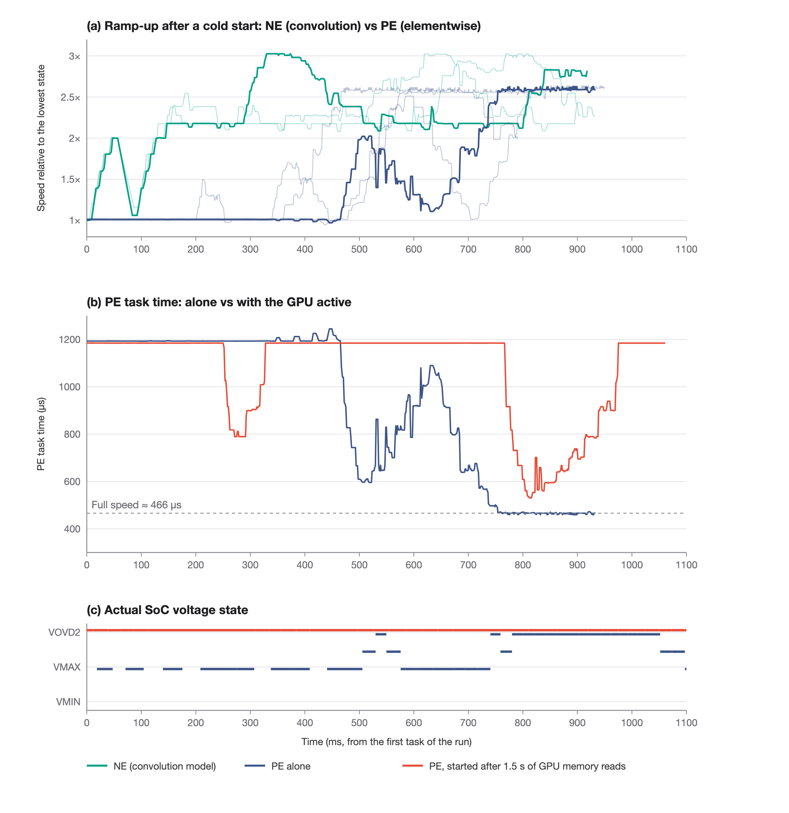

*Figure 11-2. Frequency-scaling behavior of the shared cluster (PE). (a) Ramp-up after a cold start, with speed measured relative to the first task of the round (lowest state): the NE, running the convolution model, exceeds twofold speed within about 150 ms and then varies between 2.2× and 3× under control of the CLPC; the PE, running a model containing only elementwise operations, stays in the lowest state for about 0.45 s and stabilizes at the full-load duration of 466 µs only after about 0.8 s. Thick lines are representative rounds; thin lines are the other rounds of the same kind. (b) PE task durations: when run alone, they stabilize at full load after about 0.8 s; when started after the GPU has read memory for 1.5 s, both speed-ups of the PE are pushed back to the lowest state, and the PE never stabilizes at full load during the round. (c) Actual SoC voltage-domain state aligned with (b) (sampled about every 25 ms; blank where there is no residency record in the window): while the GPU is active, the voltage stays at the top state VOVD2 throughout, yet the PE remains in a low state; when run alone, the voltage rises to VOVD2 only after the PE has sped up. Each curve is a sliding median over 5 tasks (data: [socpe_kt/](../data/09_clock/socpe_kt/)).*

These behaviors agree with the independent scheduling of the shared cluster in the CLPC and with the existence of the fabric power limiter (`fabric_power_limiter`, `FabricComputePowerRatio`). We speculate that, when the GPU is active simultaneously, the power budget of the interconnect is occupied by the GPU, which confines the shared cluster to low states 〔kernel, inferred〕. The practical consequence is that inferences lasting less than about 0.5 s run their PE portion (elementwise operations, activation functions, normalization, and so on) largely in low states. In applications where the ANE and the GPU are active at the same time, the PE portion is slowed by up to about 2.6× in our measurements, whereas convolutions and matrix multiplications on the NE are unaffected. This problem is recorded as defect B10 (Appendix D).

### 11.4 SoC Interconnect and Voltage

The compiler's SoC parameters include a five-state frequency table (534, 712, 1068, 1150 and 1308 MHz), which the compiler labels "DMA frequency" in the function `GetValidDMAFrequencies`. We found exactly the same five values in the constant region of the CLPC driver. There they appear in the table of the Fabric DVFM module (source file `fabric_dvfm_table.cpp`), immediately adjacent to the DRAM transfer-rate table 〔kernel〕. The SoC voltage domain also happens to have five voltage levels (VMIN to VOVD2). From this we infer that the so-called "DMA frequency table" in the compiler actually describes the five frequency states of the SoC interconnect, and that each frequency state corresponds to one voltage level of the SoC voltage domain 〔inferred〕.

The ANE has no voltage domain of its own. The voltage domains managed by the PMP firmware are only three: DRAM (DCS), the SoC and the display. The ANE requests a voltage floor from the SoC voltage domain through the vote items visible in IOReport 〔ioreg, IOReport, firmware〕. We compared the state of the SoC voltage domain under three kinds of load, and the results are shown in Table 11-3 (tool: [iorlist.c](../tools/common/iorlist.c)) 〔IOReport〕.

*Table 11-3. State of the SoC voltage domain under different loads*

| Item | Idle | PE chain (256 × 64²) | Convolution chain (1×1, 512 channels, 384 layers) |
| --- | --- | --- | --- |
| Actual SoC state | Mostly VMAX | VOVD2, 93–99% of the time | VMAX, 97% of the time |
| ANE interconnect bandwidth votes (`ANE0-AF-BW`, `ANE1-AF-BW`) | VMIN | VOVD2, 89% of the time | VNOM, 97–98% of the time |
| ANE's own SoC floor votes (`SOC Floor / ANE0`, `ANE1`) | 0 | 0 | 0 |

The ANE's own direct votes for the SoC voltage floor are always 0. What actually raises the voltage floor is the bandwidth vote between the ANE and the SoC interconnect. The two kinds of load behave markedly differently. Although the DRAM read/write traffic of the PE chain is only about 0.5 GB/s, it is enough to push the SoC voltage to its top state. By contrast, the convolution chain raises the voltage floor only to the intermediate VNOM state. From this we infer that the PE chain continuously uses the data path between the ANE and the SoC interconnect, whereas convolutional computation depends much less on this path. Combined with the structural analysis above, this phenomenon further supports the speculation that the data paths of the L2 and the PE connect to the SoC interconnect, or that the L2 itself lies on the interconnect side 〔IOReport, inferred〕. It is also consistent with the structural judgment that the PE and the L2 belong to the ANE shared cluster rather than to the interior of either ANE.

### 11.5 DRAM

Section 9.5.1 has already shown that, when the ANE reads weights alone, when the GPU reads memory alone, and when both run simultaneously, the residency fraction of DRAM in state F9 is above 99.8%. F9 corresponds to 5328 MHz, that is, 10656 MT/s. The DRAM frequency tables in the compiler, the CLPC driver and the PMP firmware agree. The lowest state (732 MHz) corresponds to F1, which is never used. Therefore, when the ANE is at full load, DRAM does not impose a frequency limitation 〔IOReport, compiler, kernel, firmware〕.

### 11.6 Compiler Frequency Assumptions

The results above show that the frequencies used in the compiler's performance model disagree with the hardware in two respects. First, the compiler takes 2508 MHz as the highest frequency of the NE, whereas the hardware runs at 2580 MHz under full load, so the compiler's estimate is about 3% slow. The partitioning decision in Section 5.8.3 compares the latencies before and after splitting for the same model, so the two latencies deviate by the same proportion. The effect of this discrepancy on splitting decisions should therefore be very small. It may simply be a conservative value in the performance model, or an input error when the model was built 〔inferred〕. This problem is recorded as defect B6 (Appendix D). Second, the compiler assumes that the frequencies of the L2 and the PE vary with the NE frequency under a fixed mapping. In fact, the shared cluster is scheduled independently and may remain in a low state even when the NE is already at full load. In such cases, the compiler's latency estimates for PE-class operations are markedly optimistic.

When a model is loaded through Core ML, the compilation options recorded in the kernel log include `--ne-frequency=-1.000000`, `--pstate-soc=-1` and `--pstate-dcs=-1`. These indicate that the architectural default values are used for the NE frequency and for the SoC and DRAM states 〔kernel〕. When we call `ANECCompile` directly and set `NeFrequency` to 1308 MHz, the `exe_cycles` of the same TD rise from 176 to 338, which shows that this option does enter the performance model 〔compiler〕. In other words, the compiler's performance model estimates latency at a fixed full-load frequency and does not consider the state that the CLPC actually selects at runtime.

### 11.7 Comparison with the M4 and the Literature

maderix [4] did not measure the clock frequency on the M4, and listed the number of channels of the MAC array and the clock frequency as open questions. The NE frequency table built into the compiler for the M4 (H16g) has 26 states, with a maximum of 2364 MHz (Section 4.4). If the M4 hardware, like the M6, also runs at frequencies higher than those in the compiler table, then the number of MACs per NE per cycle derived from the compiler table would be overestimated. This has yet to be verified on the M4. Bryngelson [5] reports that the ANE firmware contains no temperature or throttling logic, and that these functions are handled by SoC power management. This report likewise found no frequency table or state-selection logic in the M6 firmware (Section 6.4). The NE clock and the shared-cluster clock are both managed by the CLPC in the host kernel, which is consistent with that report.

### 11.8 Summary

The ANE of the M6 involves four kinds of clock domain. The NE clock of each ANE is an independent performance domain with 32 DVFS states, and its operating range is 852–2580 MHz. Under the premise that the fixed time of a task is a few microseconds, it runs at the top state of the device-tree frequency table, 2580 MHz, under full load. This is about 3% higher than the 2508 MHz assumed by the compiler. Measurements show that the PE is located in an independently scheduled clock domain. We speculate that this clock domain is the shared cluster used by both ANEs in the CLPC, and that the L2 is likely also within it 〔inferred〕. Its absolute frequency cannot be read. If the compiler's mapping table is followed, it is about 1.8–1.9 GHz under full load. It ramps up slowly and is repeatedly pushed back to low states when the GPU is active simultaneously. The SoC interconnect has five frequency states, corresponding to the five voltage levels of the SoC voltage domain, and the ANE indirectly influences them through interconnect bandwidth votes. DRAM runs at its top state of 10656 MT/s when the ANE is at full load. All of these clocks are managed by the CLPC and the power-management driver in the host kernel, and we found no evidence that ANE firmware participates.

The question of who selects the NE DVFS state, and according to what rule, is addressed in Chapter 12. Still undetermined are the absolute frequency of the shared cluster and the number of elements the PE processes per cycle (Section 16.2). Deployment recommendations derived from the conclusions of this chapter are concentrated in Section 15.2 (Table 15-1).

## 12. Dynamic Frequency Scaling

Chapter 11 established the NE DVFS states, and the static analysis in Chapter 6 indicated that the CLPC in the host kernel selects these states. This chapter examines the rules by which the CLPC selects states: which signals it uses to scale frequency, which state it holds the ANE at in steady state, how quickly it responds to changes in load, and how the ANE is ramped down and powered off after it becomes idle. The code of the CLPC is not public, so we treat it as a black box and determine its behavior by controlling the cadence at which the host submits requests and observing the NE DVFS state of the ANE. The main conclusions of this chapter are four. First, the CLPC scales frequency according to utilization. When the idle time between calls is no more than about 1 ms, it holds the busy fraction of the ANE at about 77%. When the idle time is longer, the busy fraction decreases monotonically with idle length, while the DVFS state remains far from the lowest state. This behavior can be approximated by an exponential moving average (EWMA) of utilization with a time constant of about 6.5 ms and a target of about 80%. Second, under synchronous calls, ramp-up and ramp-down proceed at comparable speeds, and raising the state above 2448 MHz from the lowest state typically requires 100–200 ms. The shorter the host idle time between calls, the faster the ramp-up. Third, the ANE is ramped down to the lowest state about 100 ms after it becomes idle, both ANEs are powered off simultaneously about 5.7 s after the last inference ends, and a subsequent call requires about 50 ms to restart the firmware. Fourth, sustained full load for 5 minutes triggered no ramp-down and no throttling.

### 12.1 Measurement Method

To study the CLPC as a black box, we need two measured quantities: one that we can vary and that affects the decisions of the CLPC, which serves as the input of the experiment, and one that reflects the outcome of those decisions, which serves as the output. The inputs of the CLPC cannot be set directly, but they can be influenced indirectly. Section 6.3.4 indicates that the main way the CLPC learns about the load on the ANE is through the submission, start, and end of each job reported by the driver. The utilization that the CLPC observes should therefore depend on the cadence at which the host submits requests, and this cadence is under our control. Concretely, before each synchronous Core ML call, we put the calling thread to sleep for a fixed time G, and vary G to change the idle time between two tasks on the ANE (tools: [gov_sweep.sh](../tools/10_clpc/gov_sweep.sh); the timing program is [bondrun.m](../tools/common/bondrun.m)). The model used is the same as in Section 11.2.2 (single ANE, 1×1 convolution, 512 channels, 1×128, 384 layers, with weights shared across layers), and its task duration depends only on the clock frequency of the NE.

The output of the CLPC is the NE DVFS state. The system does not provide a readout of the state, but Section 11.2.2 has already established the relationship between task duration and frequency for this model, T = C / f + D, so the state in which each task runs can be inferred from its duration. Task durations and the idle gaps between tasks are both obtained from firmware events in kdebug, and the busy fraction of the ANE is defined as the sum of task durations divided by the total time (tools: [gov_ktrace.sh](../tools/10_clpc/gov_ktrace.sh), [gov_fit.py](../tools/10_clpc/gov_fit.py)) 〔kdebug〕. To observe the dynamic response, we alternate G periodically between two values and record the change of the DVFS state over time (tools: [gov_step.sh](../tools/10_clpc/gov_step.sh), [gov_step_fit.py](../tools/10_clpc/gov_step_fit.py)). For ramp-down and power-off after idleness, we measured the latency of the first call after idle periods of different durations on the one hand. On the other hand, we used IOReport to record the power state of the ANE firmware processor, and we used the system log to record driver events (tool: [coldwake.m](../tools/common/coldwake.m)) 〔timing, IOReport, kernel〕.

### 12.2 Steady State: Utilization Target

We first observe the effect of G on the per-call time using timing alone, and the results are shown in Table 12-1 (data: [gov/](../data/10_clpc/gov/)) 〔timing〕.

*Table 12-1. Sleep time before each call and per-call time*

| Sleep time G | Median per-call time | 10th–90th percentile | State |
| --- | --- | --- | --- |
| 0 | 1651 µs | 1645–1665 µs | At full load |
| 50 µs | 1567 µs | 1558–1581 µs | At full load |
| 100 µs | 1541 µs | 1536–1553 µs | At full load |
| 150 µs | 2126 µs | 1643–2456 µs | Oscillating between intermediate DVFS states |
| 200 µs | 3240 µs | 1915–3672 µs | Oscillating, mostly at low DVFS states |
| 300 µs | 3551 µs | 2552–4299 µs | Oscillating, mostly at low DVFS states |
| 400 µs | 4312 µs | 3664–4363 µs | At low DVFS states |
| 1000 µs | 4563 µs | — | At low DVFS states |
| 3000 µs | 4582 µs | — | At low DVFS states |

When the extra sleep time between calls exceeds about 150 µs, the per-call time rises noticeably. When the sleep time reaches 400 µs or more, the per-call time settles at about 4.3–4.6 ms, which is about 2.8 times slower than at full load. At G of 50 µs and 100 µs, calls are slightly faster than at G of 0. We speculate that a brief sleep allows the calling thread to respond to completion notifications more quickly, which is consistent with the host wake-up effect in Section 6.5 〔inferred〕.

However, the timing results show only that "a slightly longer sleep leads to a ramp-down"; they do not show the basis on which the CLPC makes its decisions. To address this, we used kdebug to measure the task duration, DVFS state, and busy fraction of the ANE at each G, and the results are shown in Table 12-2 (data: [gov_kt/](../data/10_clpc/gov_kt/)) 〔kdebug〕.

*Table 12-2. DVFS state and busy fraction of the ANE under different sleep times (measured in a different round from Table 12-1; G is the nominal sleep time, and the actual sleep may be longer, so the call periods at the same G do not fully agree between the two tables)*

| Sleep time G | Number of tasks | Median task duration | Median DVFS state | DVFS state distribution (top three) | Median idle time between tasks | ANE busy fraction |
| --- | --- | --- | --- | --- | --- | --- |
| 0 | 1529 | 1267.5 µs | 2580 MHz | 2580: 84%; 2448: 5%; 2112: 2% | 384 µs | 77% |
| 100 µs | 1425 | 1267.5 µs | 2580 MHz | 2580: 81%; 2448: 6% | 433 µs | 75% |
| 150 µs | 1558 | 1789 µs | 1788 MHz | 1872: 42%; 1548: 12%; 1716: 10% | 517 µs | 77% |
| 200 µs | 1561 | 2695 µs | 1188 MHz | 1188: 37%; 1548: 14%; 1368: 12% | 808 µs | 77% |
| 300 µs | 1504 | 3171 µs | 1032 MHz | 1032: 65%; 852: 19% | 975 µs | 77% |
| 400 µs | 1465 | 3807 µs | 852 MHz | 852: 63%; 1032: 31% | 1132 µs | 76% |
| 1000 µs | 1143 | 3807 µs | 852 MHz | 852: 95% | 2270 µs | 62% |

Table 12-2 does not include the case of G = 3000 µs in Table 12-1. The trace session for this set of experiments was fixed to record only 75 s, and the segment with G = 3000 µs began only at the 74th second. When the trace ended, the segment was still in the first 1 s, the warm-up phase of consecutive calls, and no task had been recorded during the phase of calls at 3000 µs intervals. Therefore only timing data are available for this case, and the idle length and busy fraction cannot be computed.

Comparing the DVFS-state and busy-fraction columns of Table 12-2 reveals a clear pattern. As G increases from 150 µs to 400 µs, the DVFS state falls steadily from about 1.8 GHz to 852 MHz, while the busy fraction of the ANE remains almost unchanged, staying at 76–77%. This indicates that the CLPC is a utilization controller: when the idle time between tasks lengthens and utilization drops, it lowers the NE DVFS state so that each task takes longer, thereby pulling utilization back to about 77% 〔kdebug〕. Section 12.4 will show that this conclusion holds only when the idle time per call is no more than about 1 ms. The busy fraction deviates from this target only in two cases. When G is no more than 100 µs, utilization reaches only about 77% even at the top state of 2580 MHz, and the DVFS state has already reached its upper limit. When G is 1000 µs, the DVFS state has fallen to the lowest state of 852 MHz and cannot fall further, and the busy fraction is only 62%. The lowest state, 852 MHz, is the third entry of the device-tree frequency table and is consistent with the starting point of ramp-up in Section 11.2.3. The two lowest entries of the table, 804 MHz and 828 MHz, were never selected in the experiments. Even in steady state, the DVFS state jitters among several adjacent states; for example, at G of 150 µs, all states between 1548 and 1872 MHz occur, which is normal jitter for a closed-loop control.

Table 12-2 also reveals an important fact: when G is 0, there is still an idle time of about 384 µs between two adjacent tasks. This idle time arises from host-side overhead under synchronous calls (Section 6.5). In all measurements, the next request was never submitted before the current task had ended. Therefore, for a model whose single task takes about 1.3 ms, the utilization of the ANE is only about 77% even if the host inserts no additional waiting, which lies just at the target of the CLPC. This coincidence allows "back-to-back synchronous calls" to sustain the top state. For a model with shorter single tasks, however, the fixed idle time of 384 µs accounts for a larger share, so utilization falls below 77% and the CLPC ramps down. In other words, the larger the host-side overhead, the lower the DVFS state assigned to the ANE.

### 12.3 Dynamic Response

Steady-state behavior reveals the target of the CLPC, whereas the dynamic response reveals how fast the CLPC reaches that target. We alternated G between two values about every 1.5 s, and recorded the DVFS state of each task (data: [gov_step/](../data/10_clpc/gov_step/)) 〔kdebug〕.

The measurement program switched G according to the number of calls. Group A consisted of 270 calls at G = 1000 µs and 900 calls at G = 0 in each cycle, for a total of 6 cycles; group B consisted of 440 calls at G = 200 µs and 900 calls at G = 0 in each cycle, for a total of 5 cycles. Because each call corresponds to exactly one task, the switching instants can be determined precisely from the task indices (tool: [gov_step_fit.py](../tools/10_clpc/gov_step_fit.py); results: [fit.txt](../data/10_clpc/gov_step/fit.txt)).

During the ramp-up after G is switched from 1000 µs to 0 (6 instances), the DVFS state starts from 852 MHz. The times to rise above 2448 MHz were 55, 101, 202, 149, 148, and 138 ms, respectively (median about 143 ms), and reaching 2580 MHz took 59–259 ms 〔kdebug〕. The median trajectory over the 6 instances is as follows: about 1032 MHz after 5 ms, 1368 MHz after 20 ms, 1548 MHz after 30 ms, 1716 MHz after 50 ms, about 2052 MHz after 100 ms, about 2484 MHz after 150 ms, and 2580 MHz after 200 ms. In the early phase, the ANE moves up one state every few milliseconds, and the closer it gets to the top state, the slower the ramp-up becomes. The first switch was clearly faster than the other five, and the host idle time in this switch was also clearly shorter. The median host idle time between two consecutive tasks after the switch was 192 µs, compared with 387–391 µs in the other five switches 〔kdebug〕. This difference can be explained by the utilization target. When the host idle time is about 390 µs, the busy fraction of the ANE at 852 MHz is about 91%, while at 2448 MHz and 2580 MHz it is only about 77% and 76%, respectively, which is already comparable to the target of about 77%. The closer the ANE is to the top state, the smaller the deviation that drives the CLPC to ramp up. When the host idle time is 192 µs, the busy fraction at 2580 MHz is still about 87%, so the deviation remains large and the ramp-up is much faster 〔timing, inferred〕.

During the ramp-down after G is switched from 0 to 1000 µs (6 instances), the CLPC first holds the DVFS state above 2448 MHz for 17–48 ms (in one switch, the state was only about 2112 MHz before the switch, so there was no such hold phase), and then steps down one state at a time. The median trajectory is about 2406 MHz after 30 ms, about 2238 MHz after 50 ms, about 1794 MHz after 75 ms, and 1548 MHz after 100 ms. It reaches 852 MHz at about 150 ms, and the final step often jumps directly from about 1548 MHz to the lowest state. Reaching the lowest state required 138–167 ms (94 ms in the one switch that did not start from the top state) 〔kdebug〕. Under these conditions, therefore, ramp-down and ramp-up proceed at comparable speeds.

Convergence is slower when the target lies at an intermediate state. During the switch from G = 0 to G = 200 µs, the DVFS state first stayed above 2448 MHz for 160–230 ms (in one of the five switches, it stayed only about 29 ms), and only then ramped down. After several hundred milliseconds it settled roughly between 1188 and 1548 MHz, oscillating within this range and occasionally moving outside it. Returning from an intermediate state to above 2448 MHz required 125–141 ms 〔kdebug〕.

We also measured the change in the DVFS state after the ANE becomes fully idle. Specifically, we ran the ANE at full load, left it idle for a period, and then resumed consecutive calls, and we observed the DVFS state of the first task after resumption. The results are shown in Table 12-3 〔kdebug〕.

*Table 12-3. DVFS state when calls resume after idle*

| Idle duration | DVFS state of the first task after resumption | Time to return above 2448 MHz |
| --- | --- | --- |
| 14 ms (gap after warm-up ended) | 2508 MHz | Immediate |
| 30 ms | 2196 MHz | About 110 ms |
| 60 ms | 1968 MHz | About 190 ms |
| 111 ms | 852 MHz | About 0.29–0.36 s |
| 212 ms | 852 MHz | About 0.25 s |

Table 12-3 shows that the DVFS state also decreases while the ANE is idle: it drops by 8 states in about 30 ms (from 2580 to 2196 MHz), and it reaches the lowest state at about 100 ms. Notably, ramp-up after idleness is slower than the step ramp-up described above. After idle periods of 111 ms and 212 ms, the ANE likewise starts from 852 MHz, but it requires about 0.25–0.36 s to return above 2448 MHz, whereas the median step ramp-up is about 0.14 s. This report does not identify the cause of this difference. In the approximate model with a time constant of about 6.5 ms in Section 12.4, the effect of an idle period of 100–200 ms decays within about 20 ms, so the model cannot explain why recovery is about twice as slow 〔inferred〕.

Taken together, the CLPC is a controller for the ANE that targets utilization. The speeds of both ramp-up and ramp-down depend on the deviation of the actual utilization from the target, rather than on a fixed step size. When the target lies at an intermediate DVFS state, convergence requires several hundred milliseconds and is accompanied by oscillation. We did not extract the specific gains and smoothing constants from the code. Figure 12-1 and Figure 12-2 show, respectively, the DVFS state and busy fraction of the ANE under different sleep times, and the step responses of ramp-up and ramp-down.

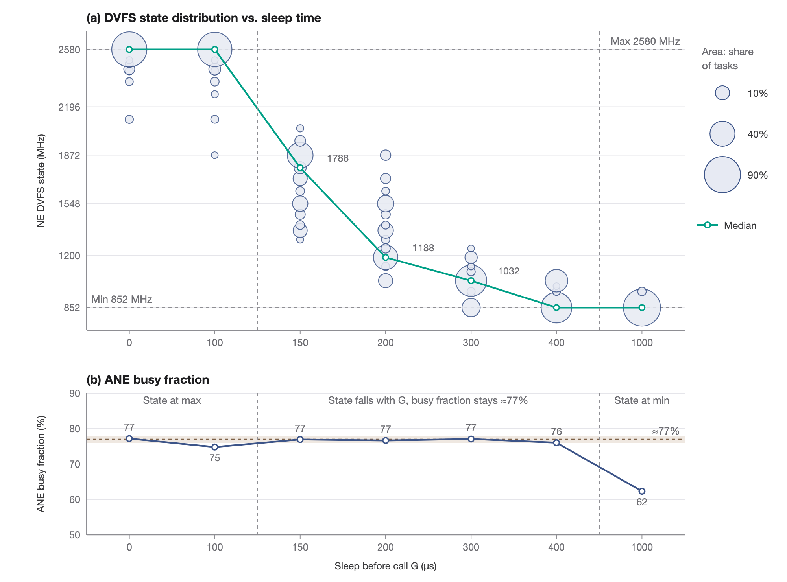

*Figure 12-1. DVFS state and busy fraction of the ANE under different sleep times G before each call. (a) Fraction of tasks at each DVFS state (circle area) and median DVFS state; (b) busy fraction of the ANE. For G of 150–400 µs, the DVFS state falls from about 1.8 GHz to 852 MHz while the busy fraction stays at 76–77%; for G ≤ 100 µs, the DVFS state has reached the top state, and for G of 1000 µs, it has reached the lowest state, where the busy fraction falls to 62% (data: [gov_kt/](../data/10_clpc/gov_kt/)).*

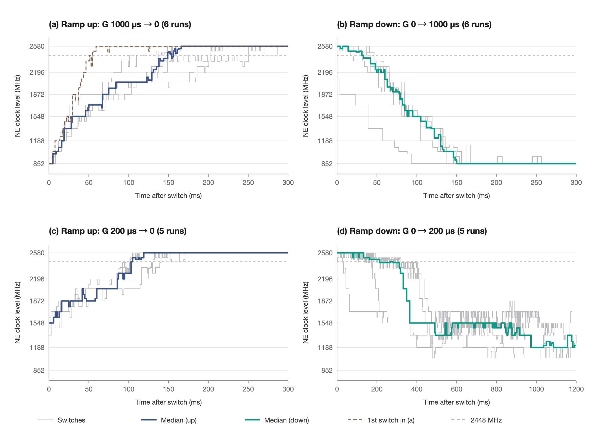

*Figure 12-2. Step response of the CLPC. (a), (b) Ramp-up and ramp-down when the sleep time G before each call is switched between 1000 µs and 0 (6 instances each); (c), (d) ramp-up and ramp-down when G is switched between 200 µs and 0 (5 instances each). Thin lines show the DVFS state trajectories after each switch, the thick line shows their median, the orange dashed line shows the first switch in (a), and the gray dashed line shows 2448 MHz (data: [gov_step/](../data/10_clpc/gov_step/)).*

### 12.4 Deviation at Long Idle Times and an Approximate Model

The experiments in Section 12.2 covered only one model (single task of about 1.3 ms) and short idle times (no more than about 2.3 ms). To test whether the target of about 77% holds more generally, we conducted three additional rounds of experiments. The models covered single-ANE and dual-ANE configurations, and both cases in which the weights remained resident on chip and cases in which they were read from DRAM in each call. The single-task duration at full clock was 1.3–5.3 ms, and the sleep time before each call was extended to more than ten milliseconds (tools: [gov_target.sh](../tools/10_clpc/gov_target.sh), [gov_target2.sh](../tools/10_clpc/gov_target2.sh), [gov_target3.sh](../tools/10_clpc/gov_target3.sh), [gov_target_fit.py](../tools/10_clpc/gov_target_fit.py), [gov_target2_fit.py](../tools/10_clpc/gov_target2_fit.py); data: [gov_tg/](../data/10_clpc/gov_tg/), [gov_tg2/](../data/10_clpc/gov_tg2/), [gov_tg3/](../data/10_clpc/gov_tg3/)). Each segment ran for a fixed 12–16 s, and the first 4 s were discarded. Table 12-4 summarizes the results by the idle length per call, excluding points where the DVFS state had reached the top state of 2580 MHz or the lowest state of 852 MHz 〔kdebug〕.

*Table 12-4. Idle length per call and busy fraction of the ANE (three rounds of experiments)*

| Idle time per call (including host overhead) | Busy fraction | Models involved |
| --- | --- | --- |
| No more than about 1 ms | 75–78% | All models; task duration after ramp-down 1.9–3.7 ms |
| 2.6–2.9 ms | 65–68% | Single ANE reading DRAM (2.7 ms); dual ANE (2.6 ms, 5.2 ms) |
| 3.5–4.1 ms | 60–64% | Single ANE reading DRAM (2.7 ms, 5.3 ms); dual ANE (2.6 ms, 5.2 ms) |
| 4.7–5.3 ms | 58–59% | Single ANE reading DRAM (5.3 ms); dual ANE (5.2 ms) |
| About 7 ms | 56% | Same as above |
| About 10 ms / about 14 ms | 53% / 50% | Dual ANE (5.2 ms); equivalent DVFS state about 1221 / 1009 MHz |

Table 12-4 shows that a busy fraction of about 77% holds only when the idle time per call is no more than about 1 ms. Within this range, the busy fraction remains stable at 75–78% regardless of whether the model uses one or two ANEs, whether it reads DRAM, or how long its tasks are, so the conclusion of Section 12.2 holds. When the idle time is longer, the busy fraction decreases monotonically with idle length, whereas the NE DVFS state is far from the lowest state. For example, for a dual-ANE model whose single task takes 5.2 ms at full clock, the busy fraction is only 56% at an idle time of about 7 ms per call, and the equivalent DVFS state, converted from task duration, is still about 1505 MHz. A controller that merely drove the busy fraction toward 77% would continue to ramp down in this situation, but the CLPC does not do so.

We ruled out two possible explanations. First, the deviation is not caused by reading DRAM: dual-ANE models with weights resident on chip and single-ANE models that read DRAM show the same degree of deviation. Second, the deviation depends mainly on the absolute length of the idle time, not on the ratio of idle time to task duration; for the same idle time, longer tasks yield a slightly higher busy fraction. When computed from the job intervals reported by the driver, the busy fraction is likewise not constant: it is 79–82% when the idle time is short and falls to about 57% as the idle time lengthens. The job intervals reported by the driver are longer than the task durations recorded by the firmware by about 80–180 µs.

To describe this behavior, we propose an approximate model. We assume that the CLPC computes an exponential moving average of the busy state of the ANE with time constant τ, reads this average at the moment each job ends, and compares it with the target value to decide whether to ramp up or ramp down. For a periodic load that is busy for d and idle for g, the average at the job-end instant is

```
r = (1 − e^(−d/τ)) / (1 − e^(−(d+g)/τ))
```

When g is much smaller than τ, r is close to the true busy fraction d / (d + g). When g is comparable to or longer than τ, most of the "not busy" time accumulated during the idle period has decayed, and the value read at the job end is markedly higher than the true busy fraction. Taking τ = 6.5 ms as an example, with a busy period of 1.27 ms and an idle period of 0.38 ms, the true busy fraction is 77% and r is 79%. With a busy period of 8.9 ms and an idle period of 7.0 ms, the true busy fraction is only 56%, yet r is still 82%. Consequently, the longer the idle time, the higher the utilization that the CLPC reads, and the earlier it stops ramping down. We jointly fitted this model to the 33 points from the last two rounds of experiments (gov_tg2 and gov_tg3) in which the DVFS state was not at either limit and the host calling thread did not stall. The fit yields a target of about 80% and a τ of about 6.5 ms, with a root-mean-square (RMS) error of 2.9%. As a control, when the true busy fraction itself is taken as the controlled variable, the RMS error is 9.0%; when the target is fixed at 77%, the optimal τ is about 8.2 ms, with an RMS error of 3.2% 〔kdebug, inferred〕. Figure 12-3 compares the individual points with the model.

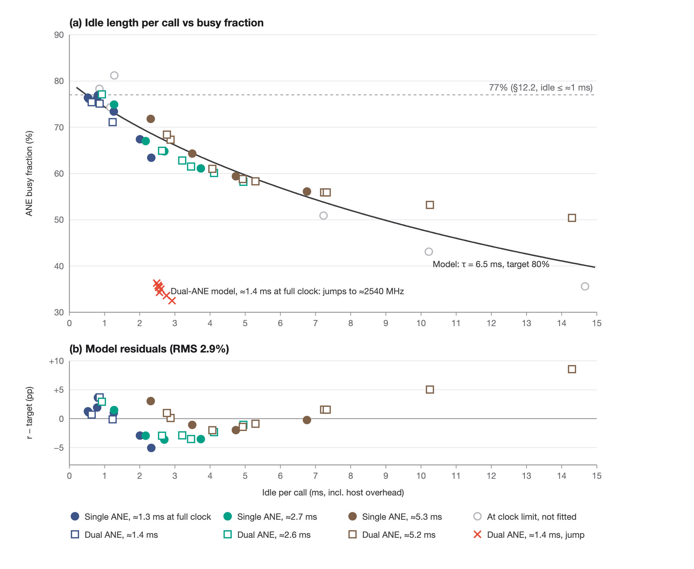

*Figure 12-3. Idle length per call and busy fraction of the ANE (last two rounds of experiments). (a) Colors indicate the task duration at full clock; filled markers denote single-ANE models and hollow markers denote dual-ANE models. Gray hollow points, whose DVFS state has reached the top state of 2580 MHz or the lowest state of 852 MHz, are excluded from the fit. Red crosses denote the dual-ANE model with a task of about 1.4 ms at full clock, which jumps to an operating state near 2540 MHz once the idle time exceeds about 2.5 ms; they are marked separately and are also excluded from the fit. The dashed line shows the 77% of Section 12.2, which holds only for idle times of no more than about 1 ms. The solid line shows the steady-state busy fraction given by the exponential moving average model sampled at job end (τ = 6.5 ms, target 80%). (b) Residuals, that is, the difference between the model reading r and the target, for each fitted point. Residuals are within ±5 percentage points at short idle times, while the two points at idle times of about 10 ms and 14 ms show +5 and +8.5, indicating that the model leaves unexplained components at very long idle times (data: [gov_tg2/](../data/10_clpc/gov_tg2/), [gov_tg3/](../data/10_clpc/gov_tg3/)).*

This model is only an approximation that gets the direction right, not the exact algorithm of the CLPC. For the two points at idle times of 10 ms and 14 ms, the residuals of the model are +5% and +8.5%, respectively. That is, at very long idle times the readings of the actual CLPC are not as high as the model predicts, which indicates that there are components not included in the model. We also observed an operating state that the model cannot explain. For a dual-ANE model with a single task of about 1.4 ms at full clock, once the idle time per call exceeds about 2.5 ms, the DVFS state inferred from the task duration settles near full clock at about 2540 MHz, while the busy fraction is only 32–36%. This occurred at all four sleep times, and one of them was repeated three times with identical results. By contrast, at an idle time of about 2.4 ms, the same model runs at about 910 MHz, inferred from task duration, with a busy fraction of 58%. Other models showed no such jump at comparable idle times, and the cause of this behavior is unknown.

These results can be understood as design trade-offs of the CLPC 〔inferred〕. When the idle time is short, the margin of about 20% can be understood as a compromise between the need to detect a rising load and the need to ramp down to save energy. If utilization were driven to 100%, a load that is just sufficient could not be distinguished in utilization from a load that exceeds the processing capacity. Moreover, when there are only a few hundred microseconds of idle time between tasks, the ANE remains powered on, and ramping down the frequency and voltage consumes less energy than completing the task quickly and then waiting idle. Section 13.4 measures that the ANE energy per inference at low states is about one-third of that at the top state. The schedutil frequency governor of the Linux kernel adopts a similar approach: it selects frequency as "utilization × 1.25," which corresponds to a utilization target of about 80% [11]. When the idle time is long, the exponential moving average sampled at the moment each job ends keeps the CLPC at a relatively high DVFS state for intermittent loads. This benefits the latency of each inference, but sacrifices some opportunity for energy saving. From the perspective of a user, this means that for intermittent inference with intervals of a few milliseconds, the CLPC does not ramp the DVFS state down as far as the steady-state utilization would suggest.

### 12.5 Idle and Power-Off

After the DVFS state has ramped down to the lowest state, if the ANE remains idle, the driver eventually powers off the ANE. We measured the latency of the first call after idle periods of different durations, and at the same time we used IOReport to record the power state of the ANE firmware processor (IOP). The results are shown in Table 12-5 (data: [e2_coldwake.txt](../data/10_clpc/e2_coldwake.txt), [e2_coldwake_states.txt](../data/10_clpc/e2_coldwake_states.txt)) 〔timing, IOReport〕.

*Table 12-5. Latency of the first call after idle (single ANE, 384 layers, steady state about 1.6 ms)*

| Idle duration | First call | Second call | First call ÷ steady state | IOP state during idle |
| --- | --- | --- | --- | --- |
| 2 ms | 1.73–1.84 ms | 1.64 ms | 1.08–1.15 | Running |
| 30 ms | 1.89–2.01 ms | 1.79–1.91 ms | 1.2–1.3 | Running |
| 100 ms | 5.4–5.7 ms | 3.9–4.4 ms | 3.4–3.5 | Running |
| 1 s | 5.9–6.1 ms | 4.6–4.7 ms | 3.7–3.8 | Running |
| 3 s | 6.1–6.4 ms | 4.8 ms | 3.8–4.0 | Running |
| 10 s | 53–56 ms | 4.0–4.3 ms | 32–35 | Powered off for part of the time |

The idle duration and the cost of the first call can be divided into three regimes. When the idle duration does not exceed about 30 ms, the cost is small, and the first call is only 8–30% slower. For idle durations of 0.1–3 s, the firmware processor remains running, but the DVFS state has already dropped to the lowest state. The first call therefore takes about 4 ms longer, and the ANE must then keep running for about another 0.25–0.36 s before it returns above 2448 MHz (Table 12-3). For idle durations of about 6 s or more, the firmware processor is powered off, and the next call must wait for the firmware to restart, which makes the first call about 50 ms longer.

To determine the exact moment of power-off, we recorded the states of the firmware processors of both ANEs at 100 ms intervals during idle periods, and we captured the kernel driver log at the same time (data: [h16_iop_trace.txt](../data/10_clpc/h16_iop_trace.txt), [h16_stream_raw.txt](../data/10_clpc/h16_stream_raw.txt)). The log shows that the driver has two timers, both of which are counted from the completion of the last inference 〔kernel, IOReport〕. The first is the power-off timer. It fires after 5.68 s of idle time (log entry `HWDevicePowerOffTimerTimeOut`), at which point both ANEs are deinitialized and the firmware processor is powered off. The second is the maintenance timer of the scheduler. It fires after 10.20 s of idle time, at which point both ANEs are powered on again (the firmware startup recorded in the log takes about 25 ms), the driver unloads the idle programs, and the driver then records `Not re-enabling maintenance timer`. At about 15.9 s, which is about 5.7 s after the maintenance timer fires, the power-off timer fires again, and the ANE remains powered off thereafter. Within the 40 s observation window, the maintenance wake-up occurred only once and was not periodic.

These two timers further divide the latency of the first call after idleness into four phases, as shown in Table 12-6 (data: [h16_idle_sweep.txt](../data/10_clpc/h16_idle_sweep.txt)) 〔timing〕.

*Table 12-6. Breakdown of idle duration and latency of the first call (same model, steady state about 1.68 ms)*

| Idle duration | State | First call | ÷ steady state |
| --- | --- | --- | --- |
| 4–5.5 s | Firmware processor running, program still in firmware | 6.6–6.8 ms | 4.0 |
| 6–9 s | Firmware processor powered off | 47–60 ms | 28–36 |
| 11–14 s | Firmware processor woken by maintenance timer, program unloaded | 9.1–9.6 ms | 5.4–5.7 |
| 16–25 s | Firmware processor powered off again | 53–58 ms | 32–35 |

Table 12-6 shows that the costly part is the cold start after the firmware has been powered off: the first call is about 50 ms longer, of which the firmware startup recorded in the log accounts for about 25 ms. Re-preparing a program after it has been unloaded takes only about 3 ms. The timers of the two ANEs are synchronized. Even when the model uses only ANE0, ANE1 is also powered off, powered on, and unloaded at the same moments, and the fraction of time that ANE1 is powered on during idle periods is nearly identical to that of ANE0 〔IOReport, kernel〕.

### 12.6 Sustained Load and Throttling

Section 6.3.3 indicates that the driver supports two throttling mechanisms: lowering the NE DVFS state through the CLPC, and making the ANE pause intermittently according to a duty cycle. To test whether sustained full load triggers throttling, we ran a dual-ANE model (1×1 convolution, 512 channels, 1×256, 384 layers, about 1.68 ms per call) for 180,000 consecutive calls, a total of about 302 s. We sampled the frequency-reduction event counts and the temperature-band counts in IOReport once every 10 s (data: [e4_sustained_series.txt](../data/10_clpc/e4_sustained_series.txt), [e4_sustained_ioreport.txt](../data/10_clpc/e4_sustained_ioreport.txt)) 〔timing, IOReport〕.

Over the full 5 minutes, the median per-call time in each 10 s segment stayed between 1674 and 1678 µs, varying by less than 0.3%, and the slowest single call took 2.2 ms. The counts of the nine classes of frequency-reduction events in IOReport (software, hardware, ADCLK, DITHER, PPT, and four external trigger sources) were zero in all 31 sampling windows. The temperature-band counts show that the SoC spent 2.3 s in band 1 in the first window, and thereafter remained in band 2 and never entered band 3. These results show that on this M6, at room temperature, the ANE sustaining full load for 5 minutes neither ramped down nor triggered any throttling, and its sustained performance equals its peak performance. This conclusion applies only to a duration of 5 minutes and room-temperature conditions. Behavior over longer durations or at higher ambient temperatures was not measured.

### 12.7 Comparison with the Literature

Bryngelson [5] reports that on the M1, the first call on the ANE after 5 s of idle takes about 260 ms, that it is about 0.5 ms longer after about 100 ms of idle, and that the ANE does not ramp down during 210 s of continuous operation. The cold-start cost on the M6 is about 50 ms, which is clearly smaller than on the M1. The cost after about 100 ms of idle is about 4 ms, which is larger than on the M1, because the CLPC of the M6 ramps the DVFS state down to the lowest state within about 100 ms of idle. The conclusion that there is no ramp-down under sustained load is consistent with the M1. maderix [1, 2] reports that the ANE draws zero power when idle and is powered off as a whole, and lists frequency-scaling trigger sources such as ANE_ADCLK_TRIG, ANE_DITHR_TRIG, and ANE_PPT_*. This report observes counters with the same names in the IOReport of the M6, and confirms that they remain at zero under sustained full load. Neither maderix nor Bryngelson measured the frequency-scaling behavior of the CLPC. The results of this report show that the NE DVFS state of the ANE is not determined by the load of the ANE itself. Rather, it is determined indirectly, through utilization, by the cadence at which the host submits requests.

### 12.8 Summary

The NE DVFS state of the M6 is selected by the CLPC in the host kernel, and the CLPC scales frequency according to utilization over a working range of 852–2580 MHz. When the idle time between calls does not exceed about 1 ms, it holds the busy fraction of the ANE at about 77%. When the idle time is longer, the busy fraction decreases monotonically with idle length to about 50%, whereas the DVFS state remains far from the lowest state. This behavior can be approximated as "an exponential moving average of utilization with a time constant of about 6.5 ms, read at the end of each job and compared with a target of about 80%." However, the high DVFS states observed for very long idle times and for the short-task dual-ANE model indicate that the actual algorithm includes other components. Under synchronous calls, the CLPC ramps up and ramps down at comparable speeds: reaching above 2448 MHz typically requires 100–200 ms, and ramping down from the top state to the lowest state takes about 140–170 ms. The speed of ramp-up depends on the host idle time, and when the target lies at an intermediate DVFS state, several hundred milliseconds are required for convergence. When the ANE is idle, the DVFS state falls to the lowest state in about 100 ms. The two ANEs are powered off simultaneously 5.68 s after the last inference completes, and a subsequent call requires about 50 ms to restart the firmware. At 10.2 s, the maintenance timer wakes the ANE once and unloads the programs. Sustained full load for 5 minutes triggers no throttling.

This chapter treats the CLPC as a black box, and what it obtains is an approximate model rather than the actual algorithm. The residuals of the approximate model at idle times above 10 ms, the reason that ramp-up is slower after 0.1–0.2 s of idle time, and the high DVFS state of the short-task dual-ANE model at longer idle times all remain unexplained (Section 16.2). The effect of the DVFS state on the energy per inference is discussed in Section 13.4. The deployment recommendations derived from the conclusions of this chapter are collected in Section 15.2 (Table 15-1).

## 13. Power and Energy Efficiency

This chapter analyzes the power characteristics of the ANE and its principal sources of energy consumption. Compared with the preceding chapters, this chapter faces a more fundamental difficulty: on the M6 there is no power rail that supplies only the ANE and can be read separately. We therefore first establish a measurement method, and then decompose the power into the parts attributable to multiply-accumulate (MAC) operations, elementwise operations, data movement, and the portion shared by the two ANEs. The main conclusions of this chapter are six. First, the SMC power rail PP0b supplies power to both the ANE and the S and P cores of the CPU. After the power of the CPU cluster is subtracted, a single ANE draws about 6.2 W at full load, two ANEs draw about 10.8 W at full load, and the ANE draws 0 W when idle. Second, there is a shared overhead of about 1.6 W between the two ANEs. After this portion is subtracted, an FP16 MAC consumes about 0.58 pJ, and an INT8 MAC consumes about 70–80% of that. Third, an elementwise operation consumes about 50–60 pJ per element, and reading data from DRAM consumes about 42 pJ/B. Fourth, when the CLPC selects a low state, the ANE energy per inference is about one-third of that at the top state. Fifth, when a small model is called at high frequency, most of the energy is consumed on the host CPU side rather than in the ANE itself. Sixth, when all activations of a convolution are zero, the ANE power decreases by about 58% on both the M6 and the M4 while the latency is unchanged. When the activations are partially zero, the power saving increases monotonically with the fraction of zeros, but it is lower than expected.

### 13.1 Measurement Method

#### 13.1.1 Locating the ANE Power Rail

`powermetrics` cannot report the power of the ANE on the M6 and macOS version used in this report. At full load, it reports a CPU power of 0 mW and has no entry for the ANE, and the energy model group of IOReport likewise reports only the energy of the GPU 〔IOReport〕. We therefore read the power rails in the SMC instead. The SMC provides 59 power keys beginning with P, which can be read through the AppleSMC user client without root privileges (tool: [smcpower.c](../tools/common/smcpower.c)) 〔SMC〕. Comparing the idle state with the state of dual-ANE full load, PP0b reads 0.00 W when idle and 11.3 W under dual-ANE full load, so it varies markedly with the ANE load.

However, PP0b is not a power rail dedicated to the ANE. While the ANE was idle, we ran several CPU threads in spin loops, and we simultaneously read PP0b, the energy histogram of the CPU clusters in IOReport, and the activity of each core. The results are shown in Table 13-1 〔SMC, IOReport〕.

*Table 13-1. PP0b readings with the CPU spinning (ANE idle)*

| Spinning threads | Cores on which the threads run | PACC0 cluster power | PP0b | PP0b − PACC0 |
| --- | --- | --- | --- | --- |
| 0 | — | 1.1 W | 0.0 W | −1.1 W |
| 1 | S core | 8.6 W | 7.5 W | −1.1 W |
| 2 | 2 S cores | 11.7 W | 10.3 W | −1.4 W |
| 3 | 2 S cores and 1 P core | 12.6 W | 10.8 W | −1.8 W |
| 4 | 2 S cores and 2 P cores | 15.2 W | 13.0 W | −2.2 W |
| 6 | 2 S cores and 4 P cores | 16.4 W | 14.4 W | −2.0 W |
| 6 (background priority) | 6 E cores | 1.2 W | 0.0 W | — |

When the ANE is completely idle, PP0b reaches 7.5 W as soon as a single thread spins on an S core, and it remains at 0 W when the threads are confined to E cores. This shows that PP0b supplies power to both the ANE and the `PACC0` cluster of the CPU. The CPU of the M6 contains 2 S cores, 4 P cores, and 6 E cores. The S cores and P cores belong to the `PACC0` cluster, whereas the E cores belong to a different cluster that is not on this power rail. No other SMC key contains a channel that varies with the ANE alone. We performed the same test on the M4, and the result was the same: PP0b supplies power to both the ANE and the P-core cluster 〔SMC, IOReport〕.

#### 13.1.2 Subtracting the Power of the CPU Cluster

On this basis, we compute the net power of the ANE as follows. Once per second, we read PP0b and the power histogram of the `PACC0` cluster in IOReport, with the histogram averaged using weights given by the residence time in each state. We take the difference between the two, and subtract the baseline of the same difference when the ANE is powered off (about −1.1 to −1.2 W) (tools: [pclus.c](../tools/common/pclus.c), [power_parts.py](../tools/11_power/power_parts.py), [power_parts_fit.py](../tools/11_power/power_parts_fit.py)):

```
ANE net power = (PP0b − PACC0 cluster power) − the same difference with the ANE powered off
```

This method has two sources of error. First, the power histogram in IOReport is quantized in 1 W steps, so the error of a single reading is about ±0.5 W, and the error is substantially reduced by long-term averaging. Second, Table 13-1 shows that the difference between PP0b and the `PACC0` cluster is not constant. It is about −1.1 to −1.4 W when only S cores are busy, and about −2 W when P cores are also busy. When the ANE is at full load and the calling thread is blocked for most of the time, the power of the `PACC0` cluster is only 1.2–1.4 W, and the error of the baseline is within ±0.3 W. If the CPU is also busy while the ANE is running, the error of the baseline may reach about 1 W. When reporting the results for each load, this chapter also gives the power of the `PACC0` cluster, so that readers can judge the magnitude of the error.

In addition, we read two auxiliary power rails. The sum of PP2b and PP4b rises markedly when DRAM is read: it is about 2 W when the workload is weight-read-bound and less than 0.1 W when it is compute-bound, with the PE workload as an exception (see Section 13.3). We speculate that this sum supplies power to the memory controller and DRAM, and we refer to it below as the memory power rail. PSTR is the power of the whole system 〔SMC, inferred〕. The SMC readings are refreshed only about once per second, so each workload was run continuously for about 12 s, and the average was taken from 4 s after the start of the workload to 0.3 s before its end. This chapter also uses another set of measurements that read only PP0b, during which the CPU cluster remained close to idle; we refer to these below as direct-read PP0b measurements. The energy per MAC is defined as the net power of the ANE divided by the effective MAC rate. The effective rate is calculated by dividing the amount of compute of the model by the time per call (including host overhead). The energy per MAC is therefore the total ANE energy, including all components inside the ANE, amortized over each effective MAC.

### 13.2 Power by Workload Class

Table 13-2 gives the net power of the ANE for each workload class after subtracting the power of the CPU cluster (data: [power_parts4/](../data/11_power/power_parts4/)) 〔SMC, IOReport〕.

*Table 13-2. Power of each workload class*

| Workload | Per call | ANE net power | PACC0 cluster | Memory power rail | Whole system | Effective rate |
| --- | --- | --- | --- | --- | --- | --- |
| Single ANE, FP16 convolution, shared weights (384 layers) | 1650 µs | 6.21 W | 1.25 W | 0.07 W | 9.9 W | 7.81 TMAC/s |
| Same as above, second round | 1652 µs | 6.12 W | 1.24 W | 0.12 W | 10.0 W | 7.80 TMAC/s |
| Dual ANE, FP16 convolution, shared weights (384 layers) | 1728 µs | 10.77 W | 1.28 W | 0.16 W | 16.8 W | 14.91 TMAC/s |
| Single ANE, W8A8 convolution, reading 100 MB of weights per call | 1045 µs | 7.31 W | 1.33 W | 2.19 W | 18.1 W | 12.34 T Int8 MAC/s |
| Single ANE, weight-read-bound (100 MB per call) | 1042 µs | 2.19 W | 1.33 W | 1.83 W | 11.0 W | 0.77 TMAC/s |
| Dual ANE, PE elementwise addition (data in L2) | 2218 µs | 2.47 W | 1.36 W | 1.14 W | 7.8 W | 45.4 G elements/s |
| Same as above, all inputs zero | 2220 µs | 2.04 W | 1.35 W | 0.68 W | 6.0 W | 45.4 G elements/s |
| Dual ANE, PE elementwise multiplication | 1626 µs | 2.65 W | 1.44 W | 1.11 W | 7.9 W | 41.3 G elements/s |
| Single ANE, FP16 convolution, 16 layers | 268 µs | 2.08 W | 7.29 W | 0.35 W | 14.0 W | 2.00 TMAC/s |
| Idle (ANE powered off) | — | 0 W | — | 0.02 W | 1.3 W | — |

Except for the small 16-layer model, the power of the `PACC0` cluster during each workload is only 1.2–1.4 W, close to the idle level, so the error in the ANE net power for these rows is within ±0.3 W. When compute-bound, the ANE power is about 6.2 W for a single ANE and about 10.8 W for dual ANEs. Based on the effective rate, the energy efficiency is about 2.5 TFLOPS/W for a single ANE and about 2.8 TFLOPS/W for dual ANEs. When idle, the ANE power is 0 W, consistent with the powered-off behavior described in Section 12.5.

Using direct-read PP0b measurements, we compared the energy efficiency of W8A8 and FP16 on the same network (48 layers, 512 channels, 32×32, with different weights in each layer, dual ANE; this is the 48-layer network in Table 7-12). In this round, the throughput of W8A8 was 54% higher than that of FP16. For the same network, Table 7-12 gives 39%; the two values come from different rounds and carry some error. The PP0b power was only about 10% higher, so the energy efficiency was about 1.4 times that of FP16 (3.4 TOPS/W versus 2.45 TFLOPS/W) (data: [power_smc.txt](../data/11_power/power_smc.txt)) 〔SMC〕. The CPU cluster was close to idle during these workloads. According to the analysis in Section 13.1.2, the difference between PP0b and the ANE net power is within ±0.3 W, so this comparison still holds.

### 13.3 Decomposition of Power

Because the ANE has no readable per-component power, we decompose the power by comparing differences between workloads. Each of the following items is an estimate based on differences 〔SMC, inferred〕.

We first consider the shared overhead between the two ANEs. The power under dual-ANE full load (10.77 W) is less than twice the power under single-ANE full load (6.21 W), with a difference of about 1.6 W. This indicates that as long as one ANE is working, about 1.6 W of power is shared by the two ANEs, and the second ANE does not need to incur it again. We speculate that this portion arises from the interconnect and clock shared by the two ANEs, or from the shared cluster in the CLPC (Section 11.3), but no per-component power readings are available to confirm this. After subtracting the shared overhead, the compute portion of each ANE is about 4.6 W, which amortizes to about 0.58 pJ per FP16 MAC. Without this subtraction, the single-ANE total is about 0.79 pJ/MAC and the dual-ANE total is about 0.72 pJ/MAC.

Next, we consider INT8 MACs. Each call of the W8A8 workload reads about 100 MB of weights from DRAM, so the power of reading weights must first be subtracted. The weight-read-bound workload reads the same amount of weights at a similar rate, and its ANE net power is about 2.2 W. Subtracting this from the W8A8 workload leaves about 5.1 W. Both workloads use only one ANE, so under the model above the shared overhead is present in both and cancels in the subtraction. The 5.1 W is therefore the power of the INT8 computation itself, which amortizes to about 0.42 pJ/MAC at 12.34 T Int8 MAC/s. This should be compared with the FP16 value of 0.58 pJ/MAC after the shared overhead has been subtracted; it is about 71% of that value. The weight-read-bound workload itself also contains a small amount of computation (0.77 TMAC/s), and the subtraction also removes the power of this computation. If we add back about 0.45 W, computed from 0.58 pJ per FP16 MAC, the INT8 value becomes about 0.45 pJ/MAC, which is 77% of FP16. The direct-read PP0b measurement gives about 77% under the same convention (adding back the computation in the weight-read workload) as well. As a cross-check, without any subtraction, the ANE net power of the W8A8 workload amortizes to 0.59 pJ per MAC, and that of FP16 to 0.79 pJ, giving a ratio of about 75%. Taken together, we estimate that the energy per INT8 MAC is about 70–80% of that of FP16. The INT8 throughput is about 1.58 times that of FP16, while the power is only about 18% higher, so the energy efficiency is about 1.3 times that of FP16. This is similar to the result above that the energy efficiency of W8A8 is about 1.4 times that of FP16, although the two sets of workloads differ.

The power of reading DRAM can be separated from the weight-read-bound workload. The weight-read-bound workload reads weights at about 96.6 GB/s, and the sum of the ANE net power and the memory power rail is about 4.0 W, which corresponds to about 42 pJ per byte. Of this, the memory power rail accounts for about 19 pJ/B, and the ANE net power (including DMA and a small amount of computation) accounts for no more than about 23 pJ/B.

Power measurement of elementwise operations requires separate treatment. In the experiment, the input and output data of the PE elementwise addition both reside in L2 and generate no significant DRAM traffic. The ANE net power for this row was computed using the powered-off baseline of an adjacent run in the same round, because the powered-off baseline recorded in this run itself (−1.71 W) deviates markedly from the other runs in the same round (−1.12 to −1.20 W) 〔SMC〕. The energy per element was computed as "the full-load reading minus the powered-on idle reading of the same run." The full-load reading and the powered-on idle reading share the same baseline, so this anomaly does not affect the result. The energy per element is about 53 pJ for elementwise addition and about 61 pJ for elementwise multiplication. Each element reads two operands from L2 and writes back one result, so this energy comes mainly from on-chip data movement. Relative to the 0.58 pJ per FP16 MAC after shared overhead is subtracted, it corresponds to about 90–105 FP16 MACs. The PE workload also increases the memory power rail by about 1.1 W, whereas IOReport shows that the DRAM read bandwidth is almost zero in this case; the reason is unclear. Combined with the observation in Section 11.4 that the PE workload raises the voltage of the SoC interconnect, this portion of power may come from traffic in the interconnect or the system-level cache 〔inferred〕.

The values of the input data also affect power. When all PE inputs are zero, the ANE power decreases by about 0.42–0.45 W (about 17%). This value agrees between the two alternating measurements in [power_parts2/](../data/11_power/power_parts2/) and in power_parts4, and the memory power rail decreases by about 40% at the same time. This is consistent with the rule that "dynamic power decreases when data do not toggle" 〔SMC〕.

When measuring the effect of zero activations, the bias of the model must be zero. With a nonzero bias and ReLU between layers, the activations converge after several tens of layers to a set of values determined by the bias, so an all-zero input affects only the first few layers. We therefore used a 1×1 convolution chain with zero bias (512 channels, 1×128, 128 layers; when the input is all zero, the input of every layer is zero). We alternated between random inputs, all-zero inputs, and inputs with "one nonzero constant per channel," with two rounds for each, and computed the power as in Table 13-2 (data: [power_zero/](../data/11_power/power_zero/)) 〔SMC, IOReport〕. With random inputs, each call took about 690 µs and the ANE net power was 5.11 W. With all-zero inputs, the latency was unchanged and the power decreased to 2.15–2.18 W, a reduction of about 58%. This corresponds to a decrease in energy per MAC from about 0.82 pJ to about 0.35 pJ. With one nonzero constant per channel, the power was 5.0–5.2 W, the same as with random inputs. These results show that the dynamic power of the ANE decreases substantially when it encounters zero operands, but it does not skip these MAC operations (Section 7.5). In other words, zero activations save power but not time. The saving comes from the zero values themselves, rather than from activations being spatially constant 〔SMC, timing〕.

We repeated this measurement on the M4 (data: [power_gate_m4/](../data/11_power/power_gate_m4/)). The SMC readings on the M4 are updated about once per second and are instantaneous, so they fluctuate widely under steady load. Each segment was therefore extended to 60 s, two passes were run in alternating reverse order, the machine was prevented from sleeping during the measurements, and the call latency was checked segment by segment to exclude ramp-down. Two segments with anomalous powered-off baselines were computed using the normal values of the same round 〔SMC, timing〕. The results agree with those of the M6. With random inputs, the ANE net power was 5.08–5.32 W, and with all-zero inputs it was 2.14–2.18 W, a reduction of about 58%. With inputs of all −0 (bit pattern 0x8000), the reduction was similarly about 58%. With one nonzero constant per channel, the power was the same as with random inputs 〔SMC〕.

When only part of the activations are zero, the ANE power generally decreases as the fraction of zeros increases. We used the masking model of Section 7.5, with the fraction of zeros in each layer's input and their spatial arrangement fixed (data: [power_gate_m4/](../data/11_power/power_gate_m4/), [power_pair_m4/](../data/11_power/power_pair_m4/)). Because the masking operation adds one multiplication per layer, the absolute power of this set of models is higher than in the all-zero experiments described above. However, the models share exactly the same graph structure and weights, and the single-call time of each segment is 718–738 µs, so the power at different zero fractions can be compared directly. For randomly distributed zeros, when the fraction of zeros in each layer's input is 0%, 50%, 75%, and 90%, the ANE net power is about 8.24 W, 5.99 W, 4.33 W, and 3.03 W, respectively. Extrapolated to 100% zeros, it is about 2.0 W. If the power difference between 0% and all-zero is taken as the saveable portion, then the zero fractions of 50%, 75%, and 90% realize about 36%, 63%, and 83% of the saveable power, respectively. These values are lower than the values expected from linear scaling with the zero fraction (50%, 75%, and 90%). The measured energy saving is about 7–14 percentage points below the linear expectation, and this deviation is more pronounced at lower zero fractions 〔SMC〕.

To test whether the power saving requires adjacent zeros to occur in pairs, we rearranged the zeros at a fixed 50% fraction in each layer. Zeros were paired along the channel or width direction, arranged either aligned (2k, 2k+1) or offset by one (2k+1, 2k+2). If the hardware gates in units of two elements, the aligned pairs should save about 1 W more than the offset pairs. If the circuit does not toggle only when the operands of two adjacent cycles are both zero, the paired zeros should save noticeably more power than randomly distributed zeros. The measured difference between aligned and offset arrangements is only 0.04–0.14 W, and the paired arrangement (5.78–5.92 W) is only 1–4% lower than the random arrangement (5.99 W). Both mechanisms can therefore be ruled out 〔SMC, inferred〕. Consequently, the power saving from zero activations is largely elementwise: each zero saves its own share, independently of neighboring elements. Additional savings appear only when zeros occur in large blocks. When half of the channels are entirely zero, the power is 5.07 W, about 0.9 W lower than with randomly distributed zeros at the same fraction. We speculate that the upstream data path or the L2 reads also save power in this case 〔inferred〕. The specific mechanism of the elementwise saving may be that the hardware turns off the clock of that lane upon detecting a zero, or that the multiplier rarely toggles internally when one multiplicand is zero. Power measurements alone cannot distinguish these possibilities. The compiler has a dedicated zero-weight detection mechanism on the weight side (Section 7.5), but on the activation side we have not found a corresponding field 〔compiler, inferred〕.

Finally, we consider the case where the ANE is powered on with no task. After the workload ends and before the firmware processor is powered off (Section 12.5), the ANE is powered on but has no task. In this state, the readings of the ANE net power lie between 0 and 0.6 W, which is within the measurement error. In the direct-read PP0b measurements, this reading does not exceed 0.05 W (data: [power_parts2/](../data/11_power/power_parts2/)). We speculate that the compute array turns off its clock or power quickly between tasks, and that the power of the firmware processor itself is below the resolution of the SMC 〔inferred〕. Figure 13-1 shows the breakdown of the ANE power.

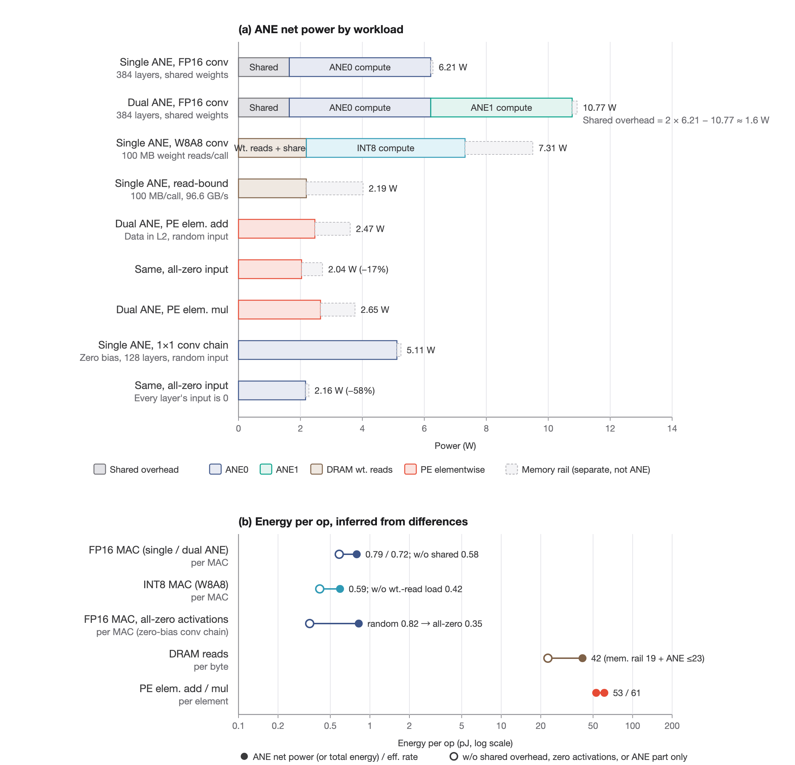

*Figure 13-1. Breakdown of ANE power. (a) ANE net power for each workload class after subtracting the CPU cluster; the dashed light-gray segment indicates the increase in the memory power rail over the same period, and for FP16 convolution, the difference between the dual-ANE power and twice the single-ANE power is separated as a shared overhead of about 1.6 W. (b) Energy per MAC, per byte read from DRAM, and per PE element, estimated from differences between workloads (data: [power_parts4/](../data/11_power/power_parts4/), [power_zero/](../data/11_power/power_zero/)).*

### 13.4 DVFS State and Energy per Inference

Chapter 12 shows that when the host inserts idle time between calls, the CLPC lowers the NE DVFS state of the ANE. Table 13-3 gives the power and the energy per inference of the same single-ANE model (1.29 × 10¹⁰ MACs per inference) at different sleep times. This set of data comes from direct-read PP0b measurements. In a re-measurement with the CPU cluster subtracted, we measured one point at a sleep time of 3200 µs, and the ANE net power was 0.43 W, which agrees with the value of 0.46 W in the table (data: [power_parts/](../data/11_power/power_parts/), [power_parts2/](../data/11_power/power_parts2/), [power_parts4/](../data/11_power/power_parts4/)) 〔SMC〕.

*Table 13-3. Sleep time before each call and ANE energy per inference*

| Sleep time | Per call | ANE power | Whole system | ANE energy per inference |
| --- | --- | --- | --- | --- |
| 0 | 1647 µs | 6.29 W | 10.0 W | 10.4 mJ |
| 100 µs | 1539 µs | 6.17 W | 9.8 W | 10.1 mJ |
| 300 µs | 3696 µs | 1.00 W | 2.8 W | 4.0 mJ |
| 800 µs | 4790 µs | 0.71 W | 2.3 W | 4.0 mJ |
| 1600 µs | 4562 µs | 0.61 W | 2.6 W | 3.7 mJ |
| 3200 µs | 4577 µs | 0.46 W | 2.1 W | 3.5 mJ |
| 6400 µs | 4615 µs | 0.31 W | 1.8 W | 3.4 mJ |

Once an idle gap of about 300 µs or more is inserted between calls, the CLPC no longer drives the ANE to the top state. The per-call time increases by a factor of 2.2–2.9, and the ANE energy per inference falls to between 1/2.6 and 1/3.1 of its value at the top state. According to the measurements in Section 12.2, at a sleep time of 300 µs the ANE runs at about 1032 MHz, and at longer sleep times it runs at the lowest state of 852 MHz. Under the rule that dynamic power is proportional to the product of frequency and the square of voltage, the energy per inference depends mainly on voltage, and the reduction in energy at low states comes mainly from the lower voltage. The factor by which energy decreases is close to the factor by which latency increases, but this similarity is a numerical coincidence 〔inferred〕. This result also indicates that the static power of the ANE is small. If static power accounted for a large share, running at a low state for a long time would accumulate static energy and cancel the savings from lower voltage, so that "finish quickly and power off" would save more energy. The measurements show the opposite. Figure 13-2 shows the ANE energy per inference and the call interval.

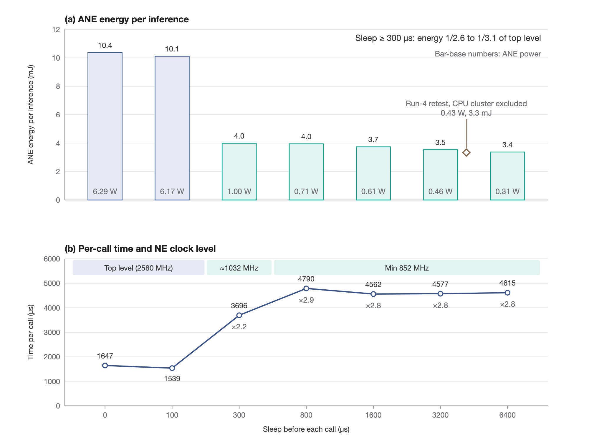

*Figure 13-2. ANE energy per inference and call interval. For the same single-ANE FP16 model with a sleep of 0–6400 µs before each call: (a) ANE energy per inference, computed as ANE power × (per-call time + sleep time); diamonds show the re-measurement at a sleep of 3200 µs with the CPU cluster subtracted; (b) per-call time and the corresponding NE DVFS state (data as in Table 13-3).*

### 13.5 Fixed Energy per Call

For small models called at high frequency, the distribution of energy differs entirely from that of large models. The 16-layer small model in Table 13-2 takes only 268 µs per call, or about 3700 calls per second. In this case the ANE net power is only 2.08 W, whereas the power of the `PACC0` cluster is as high as 7.29 W. In other words, the Core ML calling thread causes the CPU cluster to draw about 6 W more than when idle, which amortizes to about 1.6 mJ per call. On the other hand, using the value of about 0.79 pJ/MAC for the 384-layer model in Table 13-2, the computation of the 16-layer model requires about 0.43 mJ per call, whereas the actual ANE energy per call is about 0.56 mJ. The fixed overhead of the ANE itself per call is therefore about 0.13 mJ 〔SMC, IOReport〕. At this measurement point the CPU cluster was under high load. According to Section 13.1.2, the error of the baseline when the CPU cluster is subtracted may reach about 1 W, which amortizes to about ±0.27 mJ per call and is larger than the 0.13 mJ itself. Therefore, this value shows only that the fixed overhead of the ANE does not exceed about 0.4 mJ.

Accordingly, the reason that frequent small calls consume substantial energy lies mainly not in the ANE but in the calling overhead on the host CPU side. For each call, the CPU must prepare the request, wait for the completion notification, and wake the calling thread (Section 6.5). The energy of this work is at least about four times the fixed overhead of the ANE.

### 13.6 Power Model of the Compiler

The performance-model CSV described in Section 7.1 contains a column `power(W)`. We disassembled the function `perfmodel::EnginePerf::ComputePowerMetric` that generates this column, and found that it computes only the energy of memory accesses. The power equals the number of bytes accessed through the three paths of Tile DMA and the Kernel DMA, multiplied by the energy per byte, divided by the estimated execution time. The energy per byte takes only two values. When the data volume of a given path does not exceed the capacity of the system-level cache (16 MiB) and the cache flag is set, it is taken as 10 pJ/B (treated as a cache hit); otherwise it is taken as 50 pJ/B (treated as a DRAM access). These two constants are taken from offset 0x890 of the HAL parameter table 〔compiler, HAL〕. We checked this formula against specific rows of the CSV, and in each case the result was exactly 50.0 pJ/B. It follows that the compiler does not build power models for the MAC array, the L2, or the PE, so the `power(W)` column cannot be used to decompose the power of the ANE. On the other hand, the 50 pJ/B used by the compiler is consistent in order of magnitude with the total energy of reading DRAM measured in this report (about 42 pJ/B).

### 13.7 Comparison

This section compares the energy efficiency of the M6 ANE at three levels: comparison with the M4 ANE of the previous generation, comparison with the CPU and GPU on the same chip, and comparison with NPUs and accelerators from other vendors. The comparability decreases in this order, and attention must be paid to the measurement basis used in each comparison.

#### 13.7.1 Comparison with the M4

maderix [4] reports that the ANE of the M4 draws zero power when idle, 4.57 W at full load with FP16 (4.1 TFLOPS/W), and 12.25 W at full load with W8A8 (2.9 TOPS/W). That is, the throughput of W8A8 is 1.95 times that of FP16, while its power is 2.7 times that of FP16. The results of the M6 differ from these in two respects. First, on the M6, W8A8 is more energy-efficient than FP16 (about 1.4 times), whereas on the M4, W8A8 is less energy-efficient than FP16. Second, the FP16 energy efficiency of a single ANE on the M6 is about 2.5 TFLOPS/W, which is lower than the value for the M4 reported by maderix. Because this report found that PP0b on the M4 likewise supplies power to both the ANE and the CPU cluster, and because different studies use different power sources and subtraction methods, these values should not be compared directly. For reference, the ANE net power of the M4 ranges from about 5 to 9 W depending on the workload. The convolution models in Section 13.3 give 5.1–8.2 W, another FP16 convolution workload of a different shape gives about 8.7 W, and the ANE power reported by `powermetrics` over the same period is 9.6 W 〔SMC, IOReport〕. maderix reported a power of 2.8 W in Parts 2 and 3 of the series, which was later corrected in Part 4 to a reading taken with low-power mode enabled [2–4]. This also indicates that the power of the ANE is highly sensitive to the system state.

#### 13.7.2 Comparison with the CPU and GPU on the Same Chip

On the same chip, a comparison in which the energy of the CPU and GPU performing the same operations is measured with the same method is the most convincing, because it removes differences in process, packaging, and measurement basis. For reference, a previous study used `powermetrics` on the M1–M4 and measured an energy efficiency of 0.21–0.46 TFLOPS/W for FP32 matrix multiplication on the GPU [22], which corresponds to about 4–10 pJ per FP32 MAC. This figure differs by a factor of about 5–12 from the FP16 energy efficiency of the M6 ANE (about 2.5 TFLOPS/W). However, the precisions differ (FP32 versus FP16), and so do the measurement methods, so the comparison can indicate only the order of magnitude.

#### 13.7.3 Comparison with Other NPUs and Accelerators

Table 13-4 summarizes the energy efficiency of other NPUs and accelerators reported in the public literature. The data in the table all come from primary sources, including academic conference papers, vendor datasheets, and papers published by vendors. All values have been converted to TOPS/W and pJ/MAC, where one MAC is counted as two operations, so pJ/MAC = 2 ÷ TOPS/W. The "Basis" column of the table distinguishes two types of data: one is peak throughput divided by the rated power or thermal design power (TDP), and the other is measured power.

*Table 13-4. Energy efficiency of the M6 ANE and other NPUs and accelerators*

| Device | Process | Precision | Energy efficiency | pJ/MAC | Basis | Power range | Source |
| --- | --- | --- | --- | --- | --- | --- | --- |
| M6 ANE, single ANE | 2 nm | FP16 | 2.5 TFLOPS/W | 0.79 | Measured throughput ÷ measured power | PP0b minus PACC0 cluster, excluding DRAM | This report |
| M6 ANE, dual ANE | 2 nm | FP16 | 2.8 TFLOPS/W | 0.72 | Same as above | Same as above | This report |
| M6 ANE, shared overhead subtracted | 2 nm | FP16 | 3.4 TFLOPS/W | 0.58 | Difference-based estimate | Same as above | This report |
| M6 ANE, lowest state (852 MHz) | 2 nm | FP16 | 7.2 TFLOPS/W | 0.28 | Measured throughput ÷ measured power | Same as above | This report |
| M6 ANE, dual ANE | 2 nm | INT8 (W8A8) | 3.4 TOPS/W | 0.59 | Measured throughput ÷ measured power | PP0b (CPU cluster not subtracted) | This report |
| M4 ANE | — | FP16 / W8A8 | 4.1 TFLOPS/W / 2.9 TOPS/W | 0.49 / 0.69 | Measured | Subtraction method not stated | maderix [4] |
| Samsung Exynos 9820 NPU | 8 nm | INT8, exploiting sparsity | 11.5 TOPS/W | 0.17 | Chip measurement, best operating point | NPU core | Song et al. [14] |
| MediaTek 5G SoC APU | 7 nm | INT8, etc. | 3.4–13.3 TOPS/W | 0.15–0.59 | Chip measurement, varying with voltage and load | NPU core | Lin et al. [15] |
| Samsung Exynos 2100 NPU | 5 nm | INT8, exploiting sparsity | 13.6 TOPS/W | 0.15 | Chip measurement (Inception-v3) | NPU core | Jang et al. [16] |
| Google Edge TPU | — | INT8 | 2 TOPS/W | 1.0 | Peak ÷ rated power (4 TOPS, 2 W) | Module | Datasheet [17] |
| NVIDIA Jetson AGX Orin 64GB | 8 nm | INT8, dense | About 2.3 TOPS/W | About 0.87 | Peak ÷ maximum power (about 138 TOPS, 60 W) | Whole module, including CPU and DRAM | Datasheet [18] |
| Google TPU v1 | 28 nm | INT8 | 2.3 TOPS/W | 0.87 | Peak ÷ measured busy power (92 TOPS, 40 W) | Chip | Jouppi et al. [12] |
| Google TPU v4 | 7 nm | BF16 | 1.6 TFLOPS/W | 1.23 | Peak ÷ measured average power (275 TFLOPS, 170 W) | Chip and HBM | Jouppi et al. [13] |
| NVIDIA A100 SXM | 7 nm | FP16 / INT8, dense | 0.78 TFLOPS/W / 1.56 TOPS/W | 2.56 / 1.28 | Peak ÷ TDP (400 W) | Whole card | Datasheet [19] |
| NVIDIA H100 SXM | 4 nm | FP16 / INT8, dense | 1.41 TFLOPS/W / 2.83 TOPS/W | 1.42 / 0.71 | Peak ÷ TDP (700 W) | Whole card | Datasheet [20] |
| Eyeriss | 65 nm | 16-bit fixed-point | — | About 12 | Chip measurement (AlexNet convolutional layers) | Chip | Chen et al. [21] |

Mainstream NPUs in laptop and mobile platforms are not included in the table. These include the Hexagon NPU of the Qualcomm Snapdragon X Elite (45 TOPS), the NPU 4 of the Intel Lunar Lake (48 TOPS), the XDNA 2 of the AMD Ryzen AI 300 (50 TOPS), and the NPU of the MediaTek Dimensity 9400. The vendors have published only the peak INT8 throughput and the energy-efficiency ratios relative to predecessors or competitors, not the absolute power of the NPUs, so these values cannot be converted to TOPS/W. Google has also not published the throughput and power of the TPU in the Tensor chip. The MLPerf Mobile benchmark does not report energy, and it is likewise unusable for this comparison.

The values in Table 13-4 differ widely in their bases, and four points must be considered when comparing them. First, the difference between peak and measured values. The M6 data in this report are the effective throughput under realistic workloads divided by the measured power-rail power. The values in the vendor datasheets are peak throughput divided by the rated power or TDP. The former overestimates the throughput, and the latter usually overestimates the power, so the biases act in opposite directions and the net effect is uncertain. Among datacenter accelerators, the bases closest to that of this report are those of TPU v1 and TPU v4, which use measured power, but whose throughput is still peak. The ISSCC chips in the table measured both throughput and power, but the measurement scope was limited to the NPU core. Second, the difference between sparse and dense values. The TOPS values given prominently in NVIDIA datasheets are usually computed for structured sparsity, and the table converts them to dense values. The TOPS/W values in the Samsung ISSCC and ISCA papers count skipped zero-valued operations and should be regarded as best-case values. Third, the difference in power boundaries. The ISSCC papers report the power of the NPU core at the best voltage point, the Jetson figure is the power of the whole module, the TPU v4 figure includes HBM, and the net power of the ANE in this report (PP0b minus the PACC0 cluster) excludes DRAM. Relative to the TPU v4 and the Jetson, the basis of this report favors the M6. Relative to the ISSCC data, which count only the core, it disfavors the M6. Fourth, the difference in precision and process. Mobile NPU vendors mostly provide only INT8 data, and comparable FP16 data are scarce. From the 65 nm Eyeriss to modern NPUs at 4–8 nm, the energy per MAC has decreased by more than an order of magnitude, and most of this reduction comes from process advances.

Within these limitations, we can draw two conclusions with reservations.

First, the FP16 energy efficiency of the M6 ANE at the top state, about 2.5–2.8 TFLOPS/W, is of the same order as that of the H100 (1.41 TFLOPS/W) and the TPU v4 (1.6 TFLOPS/W) in datacenters, and higher than that of the A100 (0.78 TFLOPS/W). However, the INT8 energy efficiencies reported in three mobile NPU chip papers are generally higher than the measured INT8 value of the M6 at the top state (about 3.4 TOPS/W). Song et al. [14] reported at ISSCC 2019 that the NPU of the Samsung Exynos 9820 reaches 11.5 TOPS/W. Lin et al. [15] reported at ISSCC 2020 that the deep-learning accelerator in a 7 nm 5G mobile SoC from MediaTek reaches 3.4–13.3 TOPS/W. Jang et al. [16] reported at ISCA 2021 that the NPU of the Samsung Exynos 2100 reaches 13.6 TOPS/W on Inception-v3. All three values count the power of the NPU core only, and two of the Samsung papers also count skipped zero-valued operations. Part of the gap between these values and the M6 therefore arises from differences in basis.

Second, the energy efficiencies in ISSCC papers are often given as a range, such as 3.4–13.3 TOPS/W for Lin et al. [15]. Such a range reflects how the energy efficiency of the same accelerator varies with operating voltage, load, and data precision. The M6 shows a similar phenomenon: at the lowest state (852 MHz), the FP16 energy efficiency of the M6 is about 7.2 TFLOPS/W, about three times that at the top state (Section 13.4). This value falls within the range reported by Lin et al. [15]. However, the M6 value is a result at FP16 precision, and the values in that range are not necessarily at the same precision, so the two cannot simply be equated. Accordingly, a comparison of energy efficiency among NPUs depends largely on which operating point and which precision are compared. Therefore, when comparing with other NPUs, the energy efficiency of the M6 at both the top state and the lowest state should be given, with the precision stated.

### 13.8 Summary

The M6 has no readable power rail dedicated to the ANE. The SMC power rail PP0b supplies power to both the ANE and the S and P cores of the CPU, so the power of the ANE must be obtained after the power of the CPU cluster is subtracted. Using this method, a single ANE draws about 6.2 W at full load, dual ANEs draw about 10.8 W at full load, the shared overhead between them is about 1.6 W, and the ANE draws 0 W when idle. After the shared overhead is subtracted, an FP16 MAC consumes about 0.58 pJ, and an INT8 MAC consumes about 70–80% of that. An elementwise PE operation consumes about 50–60 pJ per element, mainly due to on-chip data movement, and reading data from DRAM consumes about 42 pJ/B. When all activations of a convolution are zero, the ANE power decreases by about 58% on both the M6 and the M4, while the latency is unchanged. When the activations are partially zero, the power saving increases monotonically with the fraction of zeros (but is lower than proportional expectation), is independent of whether the zeros occur in pairs, and yields additional savings when zeros occur in large blocks. When the CLPC selects a low state, the energy per inference is about one-third of that at the top state, which indicates that the static power of the ANE is small. For frequent small calls, most of the energy is consumed on the host CPU side, about 1.6 mJ per call, which is at least about four times the fixed overhead of the ANE. The power model of the compiler computes only the energy of memory accesses and cannot be used to decompose the power of the ANE.

The composition of the shared overhead of about 1.6 W remains undetermined, and so does whether the power saving of zero activations comes from clock gating or from fewer multiplier toggles. Both questions require per-component power readings (Section 16.2). Comparing the energy of the CPU, GPU, and ANE in performing the same operations on the same chip is likewise deferred to future work (Section 16.3). The deployment recommendations derived from the conclusions of this chapter are summarized in Section 15.2 (Table 15-1).

## 14. Application Benchmarks

Earlier chapters used purpose-built microbenchmarks to study the individual parts of the M6 ANE, from which several inferences about real workloads can be drawn. This chapter tests those inferences against practical application workloads. The data come from a set of application benchmarks that we ran on two Mac mini systems, M6 and M4, covering three types of task: large language model (LLM) workloads, image classification, and text recognition. Speech-to-text speed data were affected by a transient system state and are not used; only the compilation observations from that run are retained. The application benchmarks recorded only per-call time, ANE busy fraction, memory read rate, and power; they did not record firmware timestamps or per-engine interrupt counts. Moreover, the comparison spans two chip generations, so differences in clock, bandwidth, and host CPU are confounded with one another. Accordingly, what this chapter can test is whether the results agree in direction and approximate magnitude with the expectations. A phenomenon consistent with a mechanism does not validate that mechanism, and we point out, item by item, every factor that was not separated.

This chapter first derives five classes of observable expectations from the conclusions of earlier chapters (Section 14.2), and then reports the results group by group. Each group answers three questions: which expectation it matches, how far it can be explained, and what remains unseparated. This chapter has four main conclusions. First, on compute-dense tasks with large work per call, the M6 ANE is 1.8–2.7 times faster than the M4, far above the ratio of about 1.1 for a single engine's peak, which is consistent with the expectation that the second engine mainly benefits compute-dense tasks. However, the 2.69× of text detection exceeds the dual-engine peak ratio (about 2.2×), and this report cannot explain the excess. Second, the speedup narrows markedly on tasks with very little work per call; when processing one image at a time, the M6 is only 1.42× faster, in the direction expected from the growing share of host overhead. Calculated from the host overhead corresponding to the task duration, this accounts for about two-thirds of the additional time on the M6, while the remaining about 0.15 ms is not separated. Third, LLM decode is 1.86× faster on the M6, but the ratio of engine counts and the ratio of weight-read bandwidth are both about 2, so this factor by itself cannot show whether decode is limited by weight reads or by calls. When converted to weight-read volume, the M6 uses only about 60% of its weight-read bound, below the about 70% of the M4; reducing the number of calls raises speed by 31%. This agrees with the expectation that decode is limited by both weight reads and the number of calls per token, but the custom model also changes the weight bit width, so the effect of the number of calls is not separated on its own. Fourth, the model that reduces the number of calls draws about 0.3 W of host CPU power, below the about 1 W of the standard model, which is consistent with the expectation that energy shifts toward the host under frequent calls. In addition, the ANE is more energy-efficient than the GPU on the same machine for every task whose power was measured.

### 14.1 Test Setup

The application benchmarks were run on two Mac mini systems, each with 16 GB of memory and 256 GB of storage, both running macOS 27.0.1 (26A434). On both machines, other applications and iCloud sync were turned off, and the same model files, verified by SHA256 checksum, were used. Speed tests were run without monitoring. For ANE busy fraction, memory read bandwidth, and power, a separate run with monitoring was performed; monitoring data were obtained from anemon [27], `powermetrics`, SMC power rails, and IORegistry. Small-model tasks were run with Core ML, with the compute units set to `CPU_AND_NE`; for power comparisons, the same model files were also run with `CPU_AND_GPU` as a reference.

Power data must be interpreted with caution. As described in Chapter 13, the M6 has no readable power rail dedicated to the ANE, so the M6 ANE power in the benchmarks was estimated from SMC power rails. PP0b also supplies the S cores and P cores of the CPU, so this value is biased upward when the host-side runner occupies many CPU cores. In addition, the M4, which is used as a daily-use machine, often had background programs running during testing, and whole-system idle power varied between 7 and 15 W. Accordingly, Section 14.5 relies mainly on "whole-system power minus idle power" when comparing energy efficiency. The benchmark data of this chapter are kept in our benchmark records; at present, only the ANE resource curves used in Figure 14-1 have been organized into the code repository (Appendix B.3).

### 14.2 Testable Expectations

Based on the conclusions of the earlier chapters, we formulate five classes of expectations for practical workloads. To provide a comparison across the two chip generations, we give, where possible, the approximate magnitude of M6 relative to M4.

Expectation 1: compute-dense tasks with large work per call benefit most from the second engine. The FP16 direct-convolution peak of a single M6 engine is 21.1 TFLOPS, and that of the M4 is about 19 TFLOPS (Table 7-14), so the M6 is only about 10% higher; the two M6 engines together provide 42.3 TFLOPS, and on compute-bound networks the scaling efficiency is about 96% (Section 10.3). Therefore, if the compiler splits this class of task across both engines, the M6 should be about 2× faster than the M4, with an upper bound of about 2.2×, the peak ratio; if no split occurs, it should be only about 1.1× faster.

Expectation 2: the smaller the work per call, the smaller the speedup. Each synchronous call incurs about 0.16–0.36 ms of host overhead outside the ANE task, which grows with task duration (Section 6.5), and a dual-ANE program adds about 30 µs more (Section 10.3). This overhead does not shrink as the ANE gets faster; the shorter the task, the larger its share.

Expectation 3: decode of a large language model is limited by weight reads and also by the number of calls per token. Every generated token requires reading all weights, and the second engine does not add usable weight-read bandwidth (Sections 9.3.4, 10.4, and 10.7); the measured M = 1 matrix multiplications are also not split across two engines (Section 5.8.4). Therefore, decode speed should be determined by weight-read bandwidth (about 67 GB/s for the M4 and about 145–150 GB/s for the M6; Section 9.6) and reduced by the host overhead per call; reducing the number of calls per token should raise the ANE busy fraction.

Expectation 4: when some operations remain on the CPU, the ANE speedup of a model is diluted. Core ML places operations that the ANE does not support on the CPU (Section 5.2), so the overall speedup is limited by the CPU portion.

Expectation 5: under frequent calls, a substantial share of energy is spent on the host CPU (Section 13.5); reducing the number of calls should lower host-side power.

It should be noted that Expectations 1 and 3 both give a ratio of about 2 in the cross-generation comparison, so the M6 to M4 ratio alone cannot distinguish compute-bound from weight-read-bound behavior; auxiliary indicators such as the ANE busy fraction and memory read rate are needed. The following sections test each group in turn.

### 14.3 Large Language Models

#### 14.3.1 Standard Model

The test model is Qwen3.5-4B converted to Core ML format, with weights stored using 4-bit and 6-bit palettization; each generated token requires reading about 2.56 GB of weights. The model is split into 8 segments of 4 layers each, and each segment has two functions: per-token decode, and prefill in batches of 128 tokens (prefill, that is, processing a batch of input tokens at a time). Table 14-1 compares the speed of the two ANE generations.

*Table 14-1. Speed of Qwen3.5-4B on the ANE (tokens/s)*

| Test | M4 ANE | M6 ANE | M6 ÷ M4 |
| --- | --- | --- | --- |
| Prefill, 512 tokens (batches of 128 tokens) | 556.1 | 1016.4 | 1.83 |
| Prefill, 4096 tokens (batches of 128 tokens) | 569.5 | 1044.0 | 1.83 |
| Decode, 128 tokens (native argmax) | 18.63 | 34.72 | 1.86 |
| Decode, 128 tokens (output returned to Python for each token) | 16.07 | 27.51 | 1.71 |

Prefill processes 128 tokens at a time and is compute-dense; the M6 ANE is 1.83 times faster than the M4. In decode, one token is processed at a time; with native argmax, the M6 is 1.86 times faster. If the 248320-dimensional logits vector of every token is returned to Python for processing, both machines become slower, and the M6 speedup falls to 1.71 times, which shows that host-side processing directly affects ANE decode speed.

The ANE resource curves recorded in the application benchmarks reveal the bottleneck of the decode phase, as shown in Table 14-2.

*Table 14-2. ANE resource curves of Qwen3.5-4B (prefill 3072 tokens, decode 384 tokens)*

| Machine | Phase | Duration | ANE busy fraction | ANE memory read | ANE power |
| --- | --- | --- | --- | --- | --- |
| M4 | Prefill | 5.5 s | 81% (steady segment ≈91%) | 19.3 GB/s | 3.2 W |
| M4 | Decode | 24.9 s | 76% (fluctuating within 35–93%) | 44.1 GB/s | 1.6 W |
| M6 | Prefill | 3.1 s | 68% (steady segment ≈84%) | 21.7 GB/s | ≈5.5 W |
| M6 | Decode | 11.4 s | 85% (steady) | at least 82 GB/s | ≈3.2 W |

In the decode phase, for each generated token the runner calls the 8 segment models and the output layer in sequence, and the host writes the key-value (KV) cache back; that is, each token involves 9 ANE calls. Section 6.5 shows that each synchronous call incurs several hundred microseconds of host overhead outside the ANE task, and this overhead leaves the ANE idle between calls. During decode, the M4 ANE is idle for about a quarter of the time, and its busy fraction fluctuates widely, which may well be caused by this overhead 〔inferred〕.

Compared with the expectations in Section 14.2, the prefill phase is consistent with Expectation 1: the 1.83× speedup is far above the ratio of about 1.1× for a single engine's peak, which indicates that the second engine contributes; a memory read rate of only about 20 GB/s together with a high ANE busy fraction also indicates that this phase is compute-bound. However, the speedup is below the expected ratio of about 2×. The ANE busy fraction of the M6 in prefill in Table 14-2 (68%, steady segment ≈84%) is lower than that of the M4 (81%, steady segment ≈91%), which is compatible with the larger share of host overhead between calls after the M6 became faster (Expectation 2). The benchmarks did not record per-engine interrupt counts, so this report cannot confirm whether all segments of the prefill are split across the two engines.

The performance gain in decode cannot be explained by weight-read bandwidth alone. The 1.86× is of the same order as the weight-read bandwidth ratio (about 2.2), but it is also comparable to the ratio of engine counts, so this single ratio cannot distinguish the two explanations. More informative is the rate converted by the weight volume read. Each token reads 2.56 GB, so the M4's 18.63 tokens/s correspond to about 48 GB/s, about 70% of its weight-read bound, while the M6's 34.72 tokens/s correspond to about 89 GB/s, only about 60% of the bound. The M6 is farther from its bound, yet its ANE busy fraction (85%) is higher than that of the M4 (76%). This indicates that during decode, the M6 ANE is busy for part of the time without reading weights at full bandwidth; this part of the time may come from key-value cache reads and writes, the output layer, and the overhead of smaller layers 〔inferred〕. Therefore, the decode result is consistent with Expectation 3, but the 1.86× cannot be taken directly as evidence that decode is limited by weight reads. Figure 14-1 shows the busy fraction and memory read rate curves of the two chip generations during prefill and decode.

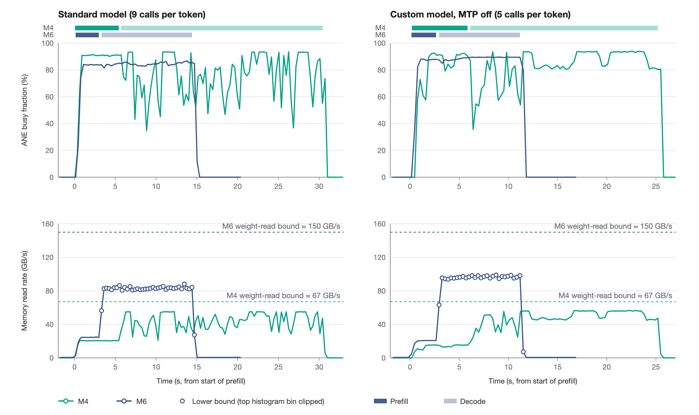

*Figure 14-1. Resource curves of Qwen3.5-4B running on the ANE (prefill 3072 tokens, decode 384 tokens; anemon samples about every 0.25–0.3 s). The left column shows the standard model and the right column the custom model (MTP off). The top row is the ANE busy fraction (for the M6, the average of the two ANEs), and the bottom row is the memory read rate. The color bars above mark the prefill (dark) and decode (light) periods of each machine, with the horizontal axis timed from the start of prefill. The M6 read bandwidth is derived from IOReport histograms; during decode, some samples fall in the top histogram bin, and hollow points indicate that the readings are lower bounds only. The M4 busy fraction fluctuates widely during decode, between 35% and 93%, whereas that of the M6 is steady. The memory read rate of the M6 during decode is still far below its weight-read bound (data: [ane_curve/](../data/12_apps/ane_curve/); extraction: [ane_curve_extract.py](../tools/12_apps/ane_curve_extract.py)).*

#### 14.3.2 Custom Model for M6

We also optimized a version specifically for the M6 ANE to examine the upper bound of running a large language model on the ANE. Compared with the standard model, it splits the model into 4 segments of 8 layers each, which reduces the ANE calls per token from 9 to 5; all weights are quantized to 4 bits; the prefill computation graph is segmented in 32-token units; and speculative decoding based on multi-token prediction (MTP) is added, verifying 3 candidate tokens per call. The output quality of this version is low: its agreement rate with the original BF16 model is 80.0%, and its perplexity rises by 9.6%. Table 14-3 gives its speed.

*Table 14-3. Speed of the custom model on the ANE (tokens/s)*

| Test | M4 ANE | M6 ANE | M6 ÷ M4 |
| --- | --- | --- | --- |
| Prefill, 512 tokens | 530.9 | 1093.1 | 2.06 |
| Prefill, 4096 tokens | 568.6 | 1164.5 | 2.05 |
| Plain decode | 22.62 | 45.64 | 2.02 |
| MTP decode (real Chinese prompt, mean 1.76 tokens per step) | 31.54 | 60.24 | 1.91 |

Compared with the standard model, the plain decode speed of the custom model on the M6 rises from 34.72 to 45.64 tokens/s, an increase of 31%; on the M4 it rises by 21%. The resource curves show that, during custom-model decode on the M6, the ANE busy fraction is about 89% and the memory read rate is at least 95 GB/s. With MTP enabled, the duration for the same 384 tokens falls from 8.4 s to 4.1 s, roughly halved, while ANE power remains essentially unchanged. The prompt in this test differs from that of Table 14-3, in which the MTP speedup is 1.32 times; the difference comes from the fact that the hit rate of speculative decoding varies with content. These results are consistent with the deployment principle of keeping the ANE busy, described in Section 15.2: reducing the number of calls per token reduces the host overhead and idle time between calls, so the ANE utilization rises, and the CLPC also more readily keeps the clock at high DVFS states (Chapter 12). Reducing the number of bits per weight (Section 7.5) and using speculative decoding to complete the work of several tokens in a single call are two other means. It should be noted that during custom-model decode, the ANE memory read rate is at least about 95 GB/s, about 63% of the weight-read bound, which is close to the about 60% of the standard model; therefore, the bottleneck cannot be said to have shifted to weight-read bandwidth. With respect to Expectation 3, after the number of calls was reduced, the ANE busy fraction of the M6 during decode rose from about 85% to about 89% (Figure 14-1), and the speed increased by 31%; the direction is consistent with the expectation. However, the custom model also quantizes all weights to 4 bits and changes the segmentation scheme at the same time. A weaker clue is that the change in weight bit width is the same on both machines: if decode were limited only by weight reads, the speedups on the two machines should be similar, whereas in fact the M6 improves by 31% and the M4 only by 21%. The M6 is faster, so the share of call overhead is larger, and the benefit of reducing the number of calls should also be larger; this is compatible with the number of calls playing a role 〔inferred〕. The prefill and decode of the custom model on the M6 are both about 2 times faster than on the M4, slightly higher than the 1.8 times of the standard model and closer to the about 2–2.2× given by Expectations 1 and 3; this is compatible with the explanation that "the fewer the calls, the more completely the difference between the two hardware generations is revealed" 〔inferred〕.

### 14.4 Vision and Speech Models

Table 14-4 summarizes the speeds of three classes of small-model tasks on the two ANE generations.

*Table 14-4. Speed of vision and speech models on the ANE*

| Task | M4 ANE | M6 ANE | M6 ÷ M4 |
| --- | --- | --- | --- |
| ResNet-50 image classification, batch of 16 (images/s) | 606.4 | 1412.2 | 2.33 |
| ResNet-50 image classification, one image per call (images/s) | 585.6 | 830 | 1.42 |
| EasyOCR text detection, CRAFT (images/s) | 22.7 | 61.0 | 2.69 |
| EasyOCR text recognition, batches of 16 lines (lines/s) | 177.8 | 251.2 | 1.41 |

The tasks in Table 14-4 fall into two classes. The first class consists of tasks with large work per call. The text detection network performs convolutions on the entire 736×1280 image; all 63 operators run on the ANE, the ANE busy fraction exceeds 90% during execution, and the M6 is 2.69 times faster than the M4. When ResNet-50 processes 16 images at a time, the M6 is 2.33 times faster than the M4. Such tasks have fixed shapes and are compute-dense, and the computation per call is large enough to mask the call overhead. In the text recognition network, two bidirectional LSTMs can run only on the CPU; the ANE busy fraction is only 13–21%, and the speedup is only 1.41 times.

Relative to Expectation 1, the speedups of text detection and of ResNet-50 at a batch of 16 are far above the ratio of about 1.1× for a single engine's peak, which is consistent with the expectation that the second engine benefits compute-dense tasks. However, both exceed the dual-engine expectation: the 2.33× of ResNet-50 is slightly above the peak ratio of 2.2×, and the 2.69× of text detection clearly exceeds it. The peak ratio already incorporates the clock increase, so the excess cannot be explained by the clock. Possible causes are that the M4 does not itself reach its peak on these shapes (for example, because of tiling or weight-read limits; Chapter 9), or that the hardware Winograd of the M6 provides additional effective throughput for 3×3 convolutions (Section 7.4.3). The text recognition result is consistent with Expectation 4.

The second class consists of tasks with very little work per call. When ResNet-50 processes one image at a time, in the repeat measurement the M6 takes about 1.2 ms per call, or 830 images per second, whereas the M4 takes about 1.7 ms, or 586 images per second. The M6 is only 1.42 times faster, far less than the 2.33 times at a batch of 16. This direction agrees with Expectation 2: the smaller the work per call, the larger the share of fixed call overhead in total time, and the harder it is for the advantages of the compute array and the second engine to appear 〔timing〕.

The magnitude, however, is only partly explained. Converting the throughput at a batch of 16, the M6 needs about 0.71 ms per image and the M4 about 1.65 ms. When processing one image at a time, the M4 incurs about 0.06 ms of extra time per call, which does not exceed the fixed overhead of 0.09–0.16 ms per call for the M4 reported in the literature (Table 6-11). The median extra time per call for the M6 is about 0.5 ms, and about 0.85 ms if calculated from the average throughput of 640 images per second; the difference comes from a few slow calls (see below). Host overhead increases with task duration (Section 6.5.3). For a call of about 1.2 ms, the time outside the task is about 0.34–0.37 ms (Table 6-4); after subtracting the share amortized per image at a batch of 16, it is about 0.34 ms. This can explain about two-thirds of the extra median time, and the remaining about 0.15 ms may come from the start-up and synchronization of the dual-ANE program (a model run one image at a time is split across two ANEs; see below), or from reduced per-layer efficiency at small batch sizes.

Another phenomenon, unrelated to the transient state described above and reproducible, is that when the M6 processes one image at a time, the top-1 classification result disagrees with the GPU result for 5.9% of images, whereas at a batch of 16 and in all cases on the M4, the results agree completely. The M6 runs the model executed one image at a time split across two ANEs 〔IOReport〕. We suspect that the split changes the execution of some layers, for example operation fusion, whether Winograd is used, or whether intermediate results pass through DRAM with type conversion, and that this changes the top-1 result for a few samples near the decision boundary 〔inferred〕. Chapter 8 shows that fixed-point accumulation within a single pass is independent of summation order; however, whether multi-pass accumulation passes through FP16 intermediates has not been tested, so an accumulation-related cause cannot be entirely excluded. Confirming this requires a layer-by-layer comparison of the ANE and GPU outputs. This phenomenon is not among the expectations in Section 14.2; the numerical conclusions of Chapter 8 can exclude summation order within a single pass but cannot give the cause.

The benchmarks also encountered the compilation problem described in Chapter 5. On the M6, each new process name requires recompiling the Whisper ANE program, which takes more than 20 minutes. The repeat test in Section 5.9 shows that almost all of this time comes from the 1.2 GB audio encoder: the global refinement of the dual-ANE spatial split writes weight copies into swap files, about 2.4 GB per encoder layer, so the full encoder requires about 78 GB of such writes, whereas the M4 compiles the same encoder in only 80 s, using about 1.3 GB (defect A3). After the program was terminated midway, the compiler service continued to run and kept writing to swap files; during the benchmarks, the system volume was filled until only 121 MB remained, and the system subsequently purged the ANE compilation cache, after which every load had to be recompiled (defect A4). Under the same process name, the compiled result could otherwise have been reused on loading; that every load was recompiled in the benchmarks is precisely the consequence of the purged cache. Large language models are likewise affected by compilation cost: the first compilation of a model with about 4B parameters takes about 80 minutes. These phenomena correspond to the superlinear cost of the dual-engine compilation path, the fact that the compiler service runs only on the E cores, and blocking after the compiler service runs out of control, as described in Sections 5.9 and 5.10 (defects A2, A3, A4, B1, and B2). They are a reproduction on practical workloads of the defects described in Chapter 5, rather than a test of the expectations above.

### 14.5 Power

Table 14-5 gives the power of several tasks running on the ANE, and uses the results of the GPU running the same model on the same machine as an energy-efficiency reference. Because the ANE's own power on the M6 can be estimated only from power rails (Section 14.1), the table relies primarily on energy efficiency computed as whole-system power minus idle power.

*Table 14-5. ANE power and energy efficiency (GPU as reference)*

| Task | Machine | ANE power | ANE whole-system efficiency (idle subtracted) | ANE efficiency ÷ GPU efficiency |
| --- | --- | --- | --- | --- |
| Qwen3.5-4B decode (standard model) | M4 | 1.39 W | 1.91 tokens/J | 1.5 |
| | M6 | ≈1.85 W | 2.55 tokens/J | 1.09 |
| Qwen3.5-4B decode (custom model, MTP) | M4 | 1.95 W | 4.55 tokens/J | 3.6 |
| | M6 | ≈2.65 W | 5.32 tokens/J | 2.3 |
| ResNet-50, batch of 16 | M4 | 2.4 W | 85.6 images/J | 8.3 |
| | M6 | ≈2.9 W | 82.0 images/J | 2.1 |
| EasyOCR text detection | M4 | — | 3.06 images/J | 11.8 |
| | M6 | — | 3.32 images/J | 4.3 |

Across these tasks, the whole-system energy efficiency of the ANE is higher than that of the GPU on the same machine: it is 1.5–11.8 times that of the GPU on the M4 and 1.09–4.3 times that of the GPU on the M6. The ANE power in Table 14-5 comes from a dedicated power comparison test, whereas the power in Table 14-2 comes from a resource-curve test with anemon monitoring; the load segments and measurement windows of the two differ, so the values should not be compared directly. The ANE's energy-efficiency advantage on the M6 is smaller than on the M4. This is partly because the energy efficiency of the M6 GPU has improved considerably (converted with the ratios of Table 14-5, the whole-system efficiency of the M6 GPU on these four tasks is about 1.8–3.8 times that of the M4), and partly because the M4 tests were affected by background programs, whose higher idle power also affected the "idle-subtracted" calculation. During LLM decode, the ANE power is only about 1.4–3.2 W. Because the custom model makes fewer ANE calls per token, its host-side CPU power is only about 0.3 W, compared with about 1 W for the standard model. However, the improvement in whole-system efficiency comes mainly from speed. Calculated from Table 14-5, the whole-system power after subtracting idle power during decode on the M6 is about 13.6 W for the standard model and about 11.3 W for the custom model (MTP), a reduction of only about 17%, while the speed increases by about 1.7 times. The ANE and the host CPU account for only a small part of this power, and the remainder comes from system components such as memory and the interconnect. The ANE's energy-efficiency advantage over the GPU is not among the expectations in Section 14.2; it is reported here only as an observation.

### 14.6 Comparison of Expectations with Results

Figure 14-2 first places the M6 ÷ M4 speedups of all tasks side by side, and Table 14-6 then compares the five expectations of Section 14.2 item by item with the application benchmark results.

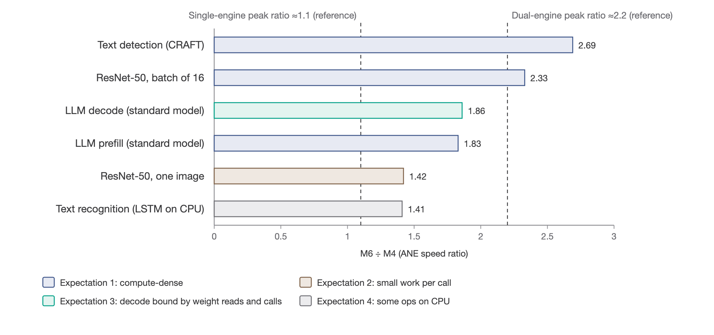

*Figure 14-2. M6 ÷ M4 speedups of the application tasks on the ANE (standard model). Colors correspond to the expectations in Section 14.2. The two dashed lines are reference values only: the single-engine FP16 peak ratio is about 1.1, and the dual-engine peak ratio is about 2.2 (the M4 peak values are themselves approximate; Table 7-14). Compute-dense tasks fall near the dual-engine reference, and text detection goes beyond it; tasks with small work per call and with some operations on the CPU are close to the single-engine reference (data: Table 14-1, Table 14-4).*

*Table 14-6. Comparison of expectations with results*

| Expectation | Result | Degree of agreement | Unseparated factors |
| --- | --- | --- | --- |
| Expectation 1: compute-dense tasks benefit most from the second engine (Sections 7.9 and 10.3) | Prefill 1.83×; ResNet-50 at batch of 16 2.33×; text detection 2.69× | Direction agrees; all far above the single-engine ratio of about 1.1× | The part of prefill below about 2×; the part of text detection above the peak ratio of 2.2×; whether all tasks are split across both engines |
| Expectation 2: the smaller the work per call, the smaller the speedup (Section 6.5) | One image per call only 1.42×; M6 prefill busy fraction lower than M4 | Direction agrees; the median extra ≈0.5 ms per call for the M6 at one image per call is about two-thirds explained by host overhead matching task duration (≈0.34 ms) | The remaining ≈0.15 ms: start-up and synchronization of the dual-ANE program; layer efficiency at small batch sizes |
| Expectation 3: decode is limited jointly by weight reads and call count (Sections 6.5, 9.3, and 10.4) | Standard model 1.86×; by weight volume, M6 uses about 60% of its weight-read bound and M4 about 70%; after reducing calls, M6 speeds up by 31% | Compatible; the ratio alone cannot distinguish compute-bound from weight-read-bound behavior | Separate effects of call count and weight bit width; whether decode uses only one engine; time when the ANE is busy without reaching full bandwidth |
| Expectation 4: speedup is diluted when some operations stay on the CPU (Section 5.2) | Text recognition LSTMs remain on the CPU; ANE busy 13–21%; speedup 1.41× | Direction agrees | Difference in CPU portions between the two generations |
| Expectation 5: under frequent calls, energy shifts toward the host (Section 13.5) | Custom model host CPU ≈0.3 W; standard model ≈1 W | Direction agrees | Separate effects of call count and weight bit width |
| Outside expectations | M6 at one image per call: top-1 disagrees with GPU for 5.9% | Chapter 8 excludes only summation order within a single pass | Which layer executions are changed by the split |
| Reproduction of Chapter 5 defects | First compilation of the large model takes tens of minutes; compiler service runs out of control; compilation cache purged | Consistent with Sections 5.9 and 5.10 | — |

Beyond Table 14-6, the benchmark records contain several ANE peak-performance figures measured on a basis different from that of this report, and these require explanation. First, the benchmarks, using anebench on the fastest shapes, measured the M6 ANE FP16 compute at 50.1 TFLOPS and its INT8 compute at about 90 TOPS (for the M4, 18.8 TFLOPS and 38.2 TOPS, respectively). The M6 FP16 figure exceeds the theoretical FP16 direct-convolution peak of this report (42.3 TFLOPS for the dual ANE; Section 7.2). The most likely explanation is that the hardware Winograd acceleration (Section 7.4.3) is counted, that is, the fastest shape selected in the benchmarks uses 3×3 convolutions. If the weights of the benchmark model contain many zero values, zero-weight skipping may also contribute (see below) 〔inferred〕.

The benchmarks also found that on the M6, results with all-zero input are inflated to 55.6 TFLOPS FP16 and 106 TOPS INT8, whereas the M4 is not affected. The compute array does not skip zero activations (Section 7.5), so this is not an effect of zero activations. One candidate explanation is zero-weight detection: zero weights stored densely trigger this function, which is enabled on the M6 and not on the M4 (Sections 7.5 and 15.3). If the weights of the benchmark tool are also all zero in this mode, this would explain the difference between the two machines. Zero weights stored in a sparse format cannot explain it, because the M4 also skips them 〔inferred〕.

Second, the ANE read-memory bandwidth estimated by the benchmarks from anemon's matrix-multiply-vector load is about 66 GB/s for the M4 and about 133 GB/s for the M6. The M4 value agrees with the about 67 GB/s measured in this report on the M4 (Section 7.5). The M6 value is lower than the about 150 GB/s measured in this report from firmware task duration (Section 9.3.2), because the former is computed from total call time, which includes host overhead. Third, the estimate in the benchmark records that the ANE on-chip cache is about 14 MB on the M4 and about 32 MB on the M6 differs from the value obtained in this report from the compiler, namely that the L2 of each ANE is used at 2 MiB. We consider the former to reflect the inflection point of a workload on a performance curve rather than the capacity of on-chip storage. The same situation arose with maderix, who earlier inferred SRAM capacity from a drop in performance and later corrected that inference (Section 2.1).

### 14.7 Summary

This chapter used practical application workloads to test the inferences of the earlier chapters. The benchmark results are directionally compatible with all five classes of expectation. Expectations 1 and 2 are supported by relatively strong evidence, whereas Expectations 3 to 5 cannot yet be distinguished from other explanations. Compute-dense tasks (prefill, batched image classification, and text detection) are 1.8–2.7 times faster on the M6 than on the M4, far above the single-engine figure of about 1.1×, and the most likely source is the second engine. When the work per call is very small, the speedup narrows to about 1.4×. LLM decode is limited jointly by weight reads and call count. For the model customized for the M6, which reduces both the number of calls and the weight bit width, the plain decode speed of the ANE is about 31% higher than that of the standard model (45.64 vs. 34.72 tokens/s), and with speculative decoding (MTP) added, it reaches about 1.7 times the standard model (60.24 tokens/s). When some operations remain on the CPU, the ANE speedup is diluted. Reducing the number of calls also lowers host-side power. Measured by whole-system power, the ANE is more energy-efficient than the GPU on the same machine for all of these tasks.

The benchmarks, however, can test only direction and magnitude. In the two-generation comparison, the ratio of engine counts and the ratio of weight-read bandwidth are both about 2, so the decode ratio alone cannot distinguish the two limiting factors. The 2.69× of text detection exceeds the peak ratio, and only about two-thirds of the extra time of the M6 at one image per call can be explained by host overhead; these two points are not fully explained in this report. The custom model changes the number of calls and the weight bit width at the same time, and their effects are not separated. The top-1 disagreement with the GPU at one image per call lies outside the expectations. To turn these compatible phenomena into validation of the mechanisms, one needs to record firmware timestamps and per-engine interrupt counts on practical models, and to change only one factor at a time.

## 15. Discussion

Chapters 4–13 follow the lifecycle of a single inference call and examine, in turn, the compilation, scheduling, computation, numerics, memory, dual-engine cooperation, clocking, frequency scaling, and power of the M6 ANE. Chapter 14 then tests these findings on application workloads. This chapter does not repeat the conclusions of the individual chapters. Instead, it considers three questions together: which overall characteristics of the M6 ANE design these results reveal; what these characteristics imply for deploying models on the ANE; and what the M6 changes from, and retains of, earlier generations. Finally, this chapter summarizes the defects and undocumented behaviors found in the experiments and analyzes their common root causes.

### 15.1 Design Characteristics of the M6 ANE

Taken together, the experimental results of the individual chapters support the overall judgment presented in Section 1.3. The M6 ANE can be summarized by three interrelated system characteristics. This grouping does not correspond item by item to the three aspects of Section 1.3; it is reorganized according to the experimental results. First, the static arrangements of the compiler and the dynamic management on the host side jointly determine how the ANE actually executes, so the two are discussed together as decision mechanisms outside the ANE. Second, the two ANEs are not fully independent; they share some key resources. Third, the compiler's model of hardware performance contains biases, so static scheduling itself can become a source of performance loss.

First, the ANE is a configuration engine that is statically scheduled by the compiler and dynamically managed by the host. At the execution level, the ANE makes almost no decisions of its own. A program is a sequence of register writes fixed at compile time, with no instructions and no branches (Chapter 5). The order of execution is determined by the task descriptor sequence arranged by the compiler. In the programs tested in this report, the parallelism that can be observed among functional units occurs only within the pipeline of a single task (Chapter 6; whole-graph timing cannot determine whether the hardware can overlap tasks). In dual-engine programs, the split scheme and the amount of work assigned to each engine are also fixed at compile time (Chapters 5 and 10). At the management level, decisions likewise lie outside the ANE. The priority of requests, the engine on which they execute, and the program variant are selected by the host driver. The DVFS state and the throttling ratio are determined by the CLPC in the host kernel, and the ANE firmware is responsible only for queuing and dispatch (Chapters 6 and 12). This division of labor allows the hardware to remain simple, but it also means that the practical performance of the ANE depends to a large extent on two external factors: the quality of the compiler's decisions and the manner in which the host submits requests.

Second, the two engines are independent in computation but share resources. Each ANE has its own 16 NEs, an L2 that the compiler uses at 2 MiB, and an independent NE clock performance domain. On compute-bound workloads, the two engines can reach a speedup of 1.92×, with a scaling efficiency of about 96% (Chapter 10). However, the two engines share more resources than their block diagrams suggest. The weight-read bandwidth (about 150 GB/s) is shared by both. The clock domain in which the PE resides is independent of the two NE clock schedules, and we speculate that it is the shared cluster that the CLPC treats as common to both ANEs. A difference-based estimate indicates that about 1.6 W of power is shared by both, and its source is unknown. The driver's power-off and maintenance timers also act on both engines in synchrony (Chapters 9, 11, 12, and 13). Accordingly, the "two ANEs" are closer to "two compute arrays on one memory system" than to two fully independent accelerators. For any workload limited by a shared resource, such as weight-read-bound LLM decoding, the benefit obtained from the second engine is very limited. A convolution chain with distinct weights per layer on a dual-ANE program gains about 1.4× (timing slope, including host-side effects), and rewritten kernels split by rows gain no speedup. Request-level concurrency yields about 1.4×, and nearly all of it comes from eliminating host idle time.

Third, there is a systematic gap between the compiler's cost model and the actual behavior of the hardware. The compiler assumes that the maximum NE frequency is 2508 MHz, whereas the hardware operates at 2580 MHz. It assumes that the L2 and the PE vary in frequency with the NE at a fixed ratio, whereas in measurements the PE clock is scheduled independently. It assumes that the two ANEs execute completely in parallel after splitting and do not interfere with each other, whereas in fact they share weight-read bandwidth. The performance model does not account for the hardware Winograd path or for sparse zero-skipping, so it overestimates the time of 3×3 and pruned layers by 1.4–4.5×. Its estimate of activation DMA bandwidth, by contrast, is optimistic by about 3× (Chapters 5, 7, 9, and 11; Table 7-13). Among these gaps, the assumption that "the two ANEs do not interfere with each other" has the most serious consequence: it leads the compiler to choose row splitting for weight-read-bound layers, so the second engine brings no speedup at all (defect B9). These gaps indicate that the compiler's cost model reads more like a simplified estimate than a precise model of the hardware, with deviations that do not point in a consistent direction across stages.

### 15.2 Recommendations for Model Deployment

The conclusions of the individual chapters can be condensed into three deployment principles: keep the ANE busy, keep data on chip, and keep computation on the shapes and precisions the hardware favors. Table 15-1 summarizes the concrete recommendations derived from these three principles, together with their basis.

*Table 15-1. Summary of deployment recommendations*

| Principle | Recommendation | Basis |
| --- | --- | --- |
| Keep the ANE busy | Keep two or more requests in flight asynchronously, or merge multiple inferences into one call, to reduce idle time between tasks; asynchronous calls are preferable to batched submission | Sections 6.5, 10.7, and 12.2 |
|  | When throughput is the priority, use asynchronous calls so that requests are distributed across both engines, rather than making synchronous calls to the same model from multiple threads within one process. Matrix multiplications with M = 1 and small tensors with few pixels are not split within a single request, so the second engine can be used for them only in this way; for weight-read-bound networks, this approach yields only about 1.4× | Sections 5.8.4, 6.7, 9.3.4, and 10.7 |
|  | In the programs measured, independent computations placed in the same model did not execute in parallel; to obtain parallelism, use multiple programs, multiple processes, or multiple asynchronous requests in flight for the same program | Sections 6.6.1 and 6.7 |
|  | For large language models, reduce the number of segments in the model to lower the number of ANE calls per token | Sections 6.5, 12.2, and 14.3.2 |
|  | Latency-sensitive applications should avoid idle periods longer than about 5.7 s, issuing warm-up calls in advance when necessary | Section 12.5 |
|  | A model whose work per call is too small is placed entirely on the CPU by Core ML; merge multiple inferences into a single call with more work | Section 5.2 |
|  | Performance tests should warm up for at least 1 s, insert no idle time between calls, and use a sufficiently deep network; models dominated by PE work require a longer warm-up; models whose task durations are near 350 µs should be measured over multiple rounds, with ANE time distinguished from host time; when measuring ANE power, the power of the CPU cluster must be subtracted | Sections 6.5.3, 7.1, 7.7, 11.3, 12.3, and 13.1 |
| Keep data on chip | Allow adjacent layers to be fused by the compiler, and avoid inserting operations into the middle of the network that force writes back to DRAM | Sections 9.2 and 9.4 |
|  | When tiling for the dual-ANE path, make the number of tiles per layer even | Section 10.5 |
|  | Weight-read-bound workloads obtain only limited benefit from the second ANE, and no benefit under row splitting | Sections 9.3 and 10.4 |
|  | Keep elementwise operations to at most two inputs | Section 9.4 |
|  | When the ANE and the GPU concurrently execute read-bandwidth-bound workloads, they roughly split the DRAM bandwidth between them; while both are active, PE-class operations may run in a low DVFS state, so latency-sensitive applications should stagger the high-load phases of the two | Sections 9.5.2 and 11.3.2 |
| Keep computation on the shapes and precisions the hardware favors | Avoid output-channel counts just above 256 (for example, 272; observed on the measured single-ANE 1×1 chains, the mechanism has not been fully confirmed) | Section 7.3 |
|  | Keep the horizontal kernel width at 8 or less; at a width of 16, the layer is placed on the CPU, and for small networks the entire model remains on the CPU | Sections 7.4 and 5.2 |
|  | When designing a model, if a 3×3 convolution and a 1×1 convolution are comparable in compute and accuracy, prefer the 3×3 convolution to exploit the hardware Winograd path (note that Winograd is not enabled for all shapes) | Section 7.4 |
|  | When designing a model, prefer shapes with many channels and small spatial dimensions. The overhead of S2D itself is negligible, but inserting S2D into an existing model changes its semantics and amount of computation, so it cannot by itself speed the model up | Section 7.3 |
|  | Apply W8A8 quantization to compute-dense layers such as 3×3 convolutions (1×1 convolution chains are limited by the activation path, so the benefit is small or absent; defect B4). Compress weights of weight-read-bound layers with W8, palettization, or pruning, whose latency shrinks approximately in proportion to byte count. Avoid int4 blockwise quantization and vector palettization, as they cause the model to fall back to the CPU | Sections 7.5, 9.3, and 13.3 |
|  | Pruning a 1×1 layer reduces both weight-read time and the number of multiply-accumulates, and unstructured pruning is sufficient, so structured patterns such as 2:4 are unnecessary. Pruning must be written into the model in a sparse format through the pruning interface of coremltools; setting weights to zero directly does not cause the compiler to switch to a sparse format. 3×3 layers lose Winograd eligibility after pruning, so the pruning ratio should be 75% or more | Section 7.5 |
|  | Intermediate accumulated values of convolutions and matrix multiplications (including bias) must not reach ±32768; scale the activations beforehand where necessary. For layers with a large activation range, W8A8 is safer than FP16 with respect to accumulator overflow | Sections 8.2 and 8.3 |
|  | When comparing ANE and CPU results, a rounding difference of 1 FP16 ulp is allowed for multiply-accumulate and elementwise operations. The error of common activation functions is on the order of 10⁻³ to 10⁻² (silu being the largest), and accuracy-sensitive applications should evaluate its effect | Sections 8.2.4 and 8.5.2 |
|  | Very deep networks (the 1×1 convolution chains tested in this report exceed 386 layers, that is, from 387 layers onward) may crash the compiler and fall back to the CPU; check whether the model executes on the ANE and, where necessary, split it into multiple segments | Section 5.10 |
|  | Models with many elementwise operations may take several minutes to load for the first time on the M6; load them during application startup and use the compilation cache. Large models with many convolution slices need tens of gigabytes of free disk space for their first compilation, and the loading process should not be terminated midway through compilation | Section 5.9 |
|  | Avoid int32 operations, mathematical functions such as asin, and sequence operations such as lstm in the middle of a network; they split the network into multiple segments, and for small networks they also keep the entire network on the CPU | Section 5.2 |

Of the three principles, the first is the most easily overlooked and has the greatest impact. Intuitively, the speed of the ANE should be determined by the model itself. However, Section 12.2 shows that host-side idle time inherent between synchronous calls causes a model whose tasks are shorter than about 1.3 ms to struggle to hold the top state, even under consecutive calls. In other words, how fast the same model runs on the ANE depends on how the host calls it. Chapter 13 further shows that the main energy cost of frequent small calls lies on the CPU side. The conclusions of both lines point in the same direction: reducing the number of calls and increasing the work per call improves speed and reduces energy.

On the other hand, there is a clear trade-off between energy efficiency and latency. When the CLPC selects a low DVFS state, the ANE energy per inference is about one third of that at the top state, while latency increases by about 2.2–2.9× (Section 13.4). For applications with relaxed latency requirements and sensitivity to energy, such as background processing or sustained inference on battery power, allowing the ANE to run in a low DVFS state is in fact the better choice. Applications need not do anything to achieve this: as long as there is sufficient idle time between requests, the CLPC steps down automatically.

### 15.3 Comparison with Earlier Generations

Table 15-2 compares the M6 with the M1, the M4, and the M5 across six aspects: structure, compute, memory, scheduling, numerics, and power. The data for the M1 and the M5 come from Bryngelson [5]. The data for the M4 come from maderix [4] and from control experiments on the M4 in this report, and the data for the M6 come from this report. Measurement methods differ across sources, particularly in the definitions of throughput and power, so the notes should be consulted when comparing across columns.

*Table 15-2. ANE comparison of the M1, M4, M5, and M6*

| Aspect | Item | M1 | M4 | M5 | M6 |
| --- | --- | --- | --- | --- | --- |
| Structure | Compilation target | h13 | h16g | h17 | h18g |
|  | Number of engines | 1 | 1 | 1 | 2, on the same die |
|  | TD layout version | v7 (recorded as v10 in [5]; see Section 5.7.7) | v17 | v19 (recorded as v20 in [5]) | v24 |
|  | Compiled artifact | One program | One program | One program | Two programs: single-ANE and dual-ANE |
| Compute | NE clock | ≈1.14 GHz [5] | Maximum in compiler table 2.364 GHz | ≈1.89 GHz [5] | Measured 2.58 GHz |
|  | FP16 throughput | ≈12 TFLOPS (slope) [5] | 18.5 TFLOPS (48 layers, including overhead) [4] | — | Single ANE 20.6, dual ANE 39.5 TFLOPS (slope) |
|  | W8A8 throughput | — | 36.0 TOPS (48 layers, including overhead) [4] | — | 35.5 TOPS (48 layers, including overhead); effective 62 TOPS for 3×3 on a single ANE |
|  | Weight-only quantization | No speedup [5] | No speedup [4] | — | No speedup for compute-bound layers; native weight-read-bound layers shortened by 42% |
| Memory | On-chip tiling threshold | Timing inflection at 2.28–2.34 MB [5] | 2 MiB rule [4] | Timing inflection at 4.72 MB [5] | Tiles smaller than 2 MiB; no timing inflection |
|  | Weight-read bandwidth | 51 GB/s [5] | ≈67 GB/s | ≈145 GB/s [5] | ≈150 GB/s |
|  | Activation bandwidth | ≈24 GB/s [5] | — | ≈24 GB/s [5] | ≈35–40 GB/s per ANE |
| Scheduling | Fixed overhead per call | ≈190 µs [5] | ≈90 µs [4] | ≈70 µs (M5 Pro) [6] | Submission side ≈30 µs, completion side 130–325 µs |
|  | Concurrency of two requests | 1.04× [5] | Saves ≈16% [4] | — | Two processes 1.78–1.81×; two different programs in one process reach 86% of the sum of separate runs |
|  | Compilation depth limit for 1×1 convolution chains | — | 383 blocks [4]; at least 448 layers measured in this report | — | 386 layers (elementwise chains of 512 layers still compile) |
| Numerics | Accumulator | FP32-class [5] | Q15.16 fixed-point | FP32-class [5] | Q15.16 fixed-point |
|  | Near 32768 | Saturates [5] | Overflows to inf | Does not saturate [5] | Overflows to inf |
|  | Output rounding | Ties to even [5] | Ties away from zero | — | Ties away from zero |
| Power | Cold-start cost | ≈260 ms [5] | — | — | ≈50 ms |
|  | Frequency reduction under sustained load | No reduction in 210 s [5] | — | — | No reduction over 5 minutes |
|  | Power | — | FP16 4.57 W, W8A8 12.25 W [4] | — | Single ANE 6.2 W, dual ANE 10.8 W (CPU cluster subtracted) |

As Table 15-2 shows, the changes in the M6 are concentrated in two areas. The first is an increase in scale: a second engine was added, the NE clock was raised to 2.58 GHz, and the DRAM bandwidth was raised to 170.5 GB/s, which in turn led to compilation of separate single-ANE and dual-ANE programs. The second is the software machinery built around the second engine: the compiler gained split and synchronization steps, and the driver gained engine selection and variant selection. At the same time, the core design inside the ANE has remained essentially unchanged. The 16 NEs per engine, the 64 KiB weight buffer per NE, the 2 MiB single-operand limit, the 64 L2 banks, and the Q15.16 fixed-point accumulator are all identical to those of the M4. The activation functions likewise have the same 33-point lookup-table structure (for the M4, according to maderix [4]). Constants in the HAL parameter table related to the MAC array, the L2, and bandwidth have also not changed from H16 to H18 (Section 5.4). The changes in the parameter tables from H17 to H18 are concentrated in the flexibility of work-unit partitioning and in the supported weight formats, which are discussed separately below.

Several differences in the table require careful interpretation. The accumulators of the M1 and the M5 are described as "FP32-class," whereas this report measured the M4 and the M6 as Q15.16 fixed-point. Because the test methods differ, and because the "saturation at 32768" reported by Bryngelson corresponds exactly to the upper limit of the integer part of Q15.16, we cannot determine whether this reflects a genuine change across generations or a difference in measurement convention (Section 8.6). The fixed overhead per call cannot be compared directly across generations either, because the studies define and time the overhead differently (Section 6.8). With respect to power, this report found that on the M4, PP0b likewise supplies both the ANE and the CPU cluster. The studies use different power sources and subtraction methods, so the power values of the M4 and the M6 should likewise not be compared directly (Section 13.7).

While the compute array and the memory structure remain unchanged, the data formats and execution modes supported by the ANE have continually increased across generations, which forms another thread running through the generations. Table 15-3 lists the values, in each generation, of the HAL parameter table fields that reflect this trend (the data come from raw exports of each generation's parameter table; see Section 5.4) 〔HAL〕.

*Table 15-3. Fields of the HAL parameter table related to data formats and execution modes*

| Parameter table | Corresponding product | Native weight formats (0x8a0) | Types fusable with dequantization (0x6a8) | Vector palettization (0x72f/0x730) | Half and non-power-of-two work units (0x55c, 0x5a0) | New data-format switches (0x5ff/0x600) | Multiple palettes (0x5c7/0x5c8) | Double rate (0x5f7) |
| --- | --- | --- | --- | --- | --- | --- | --- | --- |
| M9, H11 | Early products | 7 | 3 | None | None | None | None | None |
| H12 | — | 7 | 4 | None | None | None | None | None |
| H13, H14, H15 | M1 (H13) and the two subsequent generations | 13 | 4 | None | None | None | None | None |
| H16 | M4 generation | 13 | 5 | None | None | None | None | None |
| H17 | M5 generation | 13 | 5 | Yes, length up to 4 | None | None | None | None |
| H18 | Single-engine h18 | 21 | 6 | Yes, length up to 4 | Yes | Yes | None | None |
| H19 | h19 (no product yet) | 21 | 6 | Yes, length up to 4 | Yes | Yes | Yes, up to 16 | Yes |
| 2026BaseLine | M6 (h18g) | 21 | 6 | Yes, length up to 4 | Yes | Yes | Yes, up to 16 | Yes |

In the table, the first two columns are fields stored as lists, and the table gives the length of each list. The list at offset 0x8a0 is read by functions such as `NeedsUpcastingFrom3bitPaletteTo4bitPalette`, and we infer that it contains identifiers of the weight formats natively supported by the hardware. The list at offset 0x6a8 is read by `HandleL2Config` and `IsFusableToDequant`, and we infer that it lists the weight types that can be fused with dequantization operations 〔HAL, inferred〕. The remaining columns are capability switches in the parameter table, whose meanings are inferred from the names of the functions that read them.

Table 15-3 reveals three regularities. First, capabilities only accumulate: the lengths of both lists never decrease across generations, and each new generation's list contains all elements of the previous one. The number of native weight formats rises from 7 in early products to 13 in H13 and then to 21 in H18, and the number of types fusable with dequantization increases from 3 to 6 step by step. The names of the reading functions reveal a concrete consequence of the added formats: before H18, 3-bit palettized weights had to be upcast to 4-bit palettes before they could execute, a step that is no longer required from H18 onward. Second, new capabilities are introduced in batches across generations. Vector palettization appears in H17; half work units, non-power-of-two work units, and the new data-format switches appear in H18; and multiple palettes and double rate appear in H19. Beyond the fields listed in the table, H19 also relaxes the size of FIFO buffers (offset 0x888) and the dimension limits for gather and texture operations (offsets 0x1a8–0x1b8). Third, the 2026BaseLine parameter table used by the M6 matches H19 in all of these fields, rather than matching H18, the single-engine target of the same generation (Section 5.4). Consequently, in compiler parameters the M6 already matches the H19 generation, with switches for its full set of data formats and execution modes. Whether all of these capabilities can be used on the hardware is discussed below.

The combined effect of these changes is to make the ANE increasingly flexible in practical use. More native weight formats mean that more compressed models can execute directly on the ANE without upcasting, thereby reducing the amount of weight storage and weight reads. Chapters 9 and 10 show that weight-read bandwidth is precisely the bottleneck for workloads such as LLM decoding; therefore, extending weight formats matters more for such workloads than an increase in compute throughput. More flexible work-unit partitioning enables tensors of irregular shape and small size to use the 16 NEs more fully. The measurements in Section 7.5 provide direct support for this judgment. On weight-read-bound layers, W8 and 6-, 4-, 3-, and 2-bit palettes are all read in their compressed formats, and the time per layer shrinks approximately in proportion to the number of bytes; a 2-bit palette requires only 16% of the FP16 time. However, not every format enabled in the parameter table can be used. With the generation parameters adopted in this report, int4 blockwise quantization and vector palettization both cannot be compiled by the ANE compiler, and the double-rate mode was not triggered (Section 5.7.3). The MX format fields appear only in the newer v36 layout, and the v24 layout of the M6 has no corresponding fields; their practical benefit on the hardware remains to be measured.

Table 15-3 compares the fields one column at a time. To obtain a complete view of the changes from the M4 to the M6, we also compared the H16g parameter table used for the M4 with the 2026BaseLine parameter table used for the M6, byte by byte. The two differ in 81 8-byte words. Excluding pointers such as table names and list addresses, the field-reading functions of 41 fields had already been identified in Section 5.4, and for another 24 no reading function has been determined 〔HAL〕. We wrote a tool that scans the entire compiler code by offset, searching for load instructions of the form "base register plus this offset" ([immscan2.c](../tools/re/immscan2.c)), and it located reading functions for 14 of these fields 〔HAL, inferred〕. Beyond the formats and execution modes already listed in Table 15-3, these differences include three batches of switches. H17 (the M5 generation) added zero-weight detection (offset 0x72c, whose reading function is `EnableOnTheFlySparseEncodingIfPossible`), multicast (0x72b), and a new event format, and it removed several hardware-erratum workarounds that the M4 carried. H18 added a double-Int8 mode (0x55d, whose reading function is `CanUseDoubleInt8Mode`). The 2026BaseLine added accelerated texture sampling (0x7a0) and a group of new cache-prefetch DMA parameters (0x668–0x688 and two new configuration lists) 〔HAL, inferred〕.

The meanings of fields can usually be inferred only from the names of the functions that read them. For zero-weight detection, we performed a causal test (Section 3.2). When compiling for h18g on the M4, we restored to their M4 values the numerical fields in the in-process parameter table that differ from the M4, and the zero-weight detection bit of the convolution TD (Section 7.5) changed from 1 to 0. After bisection by group and by byte, only the single byte at offset 0x72c determines this result (tool: [halpatch_lldb.py](../tools/re/halpatch_lldb.py)) 〔compiler〕. Accordingly, zero-weight detection is enabled from H17 onward and is not enabled on the M4, which is consistent with the compilation results for the two targets in Section 7.5. The correspondence between other fields and measured behavior cannot yet be determined. For example, the double-Int8 mode is enabled only in parameter tables from H18 onward, yet the measured W8A8 throughput of a 48-layer, 1024-channel chain on the M4 (36.0 TOPS) is likewise about 2× that of FP16 for the same shape (18.5 TFLOPS) (Table 7-12, maderix [4]). The double-Int8 mode therefore does not account for the doubling of INT8 throughput, and its actual effect was not measured in this report. The meanings of fields such as those at offsets 0x72d, 0x820, 0x830, and 0x610 also remain unclear.

The compiler also reveals what hardware beyond the M6 may support. As described in Section 5.7.7, besides the v24 layout used by the M6 and H19, this version of the compiler implements four TD layouts: v26, v28, v31, and v36. By the compiler's internal ArchCompareValue, v24 and v26 are 10, v28 is 11, v31 is 12, and v36 is 14. Thus v28, v31, and v36 are architectures newer than the M6, whereas v26 belongs to the same generation as the M6. The v26 layout corresponds to the internal compiler target M12, while v28, v31, and v36 have neither an external target name nor a corresponding HAL parameter table 〔compiler〕. This version of the compiler contains no target named H20, so we cannot determine which of these layouts corresponds to H20. Nevertheless, the compiler defines a set of field-reading functions for each layout version (`ZinGetRegisterProgramming<N>::GetXxx`, Section 5.7.3), and comparing the functions added or removed between versions shows which hardware fields each new layout adds. Table 15-4 lists the results of this comparison.

*Table 15-4. Field-reading functions of each TD layout version in the compiler*

| Layout | ArchCompareValue | Corresponding target | Number of field-reading functions | Fields added relative to the previous version |
| --- | --- | --- | --- | --- |
| v20 | 9 | h18 | 53 | — |
| v24 | 10 | h18g (M6), h19 | 61 | `Tsr`, `Tde`, and `PublishBit` in the task header; dual-input PE tasks; double rate (`DoubleRate`) for L2 and Tile DMA |
| v26 | 10 | M12 | 58 | None added; excludes the three task-header fields of v24 |
| v28 | 11 | None | 61 | Output X-direction crop offset (`CropOffsetDstX`); atomic-write data type for output Tile DMA (`TileDmaDstAtomicDataType`); a field named `ENE` |
| v31 | 12 | None | 61 | Same as v24 |
| v36 | 14 | None | 67 | MX formats for the input, second input, and output (`IsMxInFmt`, `IsMxSrc2InFmt`, `IsMxOutFmt`); enable bits for the three Tile DMA paths |

Three inferences about subsequent hardware can be drawn from Table 15-4 〔compiler, inferred〕. First, the newest v36 layout contains fields for microscaling (MX) data formats, and the input, second input, and output can each specify a format independently. On this basis, we speculate that the corresponding hardware will support MX formats. MX is a family of block-scaled formats defined by the Open Compute Project (OCP), including MXFP8, MXFP6, MXFP4, and MXINT8, among others, in which each small block of elements shares one scale factor. Combined with the trend in Table 15-3 of native weight formats increasing with each generation, if this speculation holds, subsequent ANEs will be able to compute and read and write directly in floating-point formats of 8 bits or fewer, rather than only storing weights in low-bit-width formats. However, the fields in the compiler show only that code generation has been prepared for this; whether the hardware implements it, and when it will ship, cannot currently be confirmed. Second, the v28 layout adds an atomic-write data type for output Tile DMA, and we speculate that subsequent hardware may atomically accumulate results into the output tensor in DRAM. Section 5.8.2 shows that the dual-ANE program on the M6, when reducing along the height, requires ANE1 to write partial sums to a shared scratch buffer, after which ANE0 aggregates them. If outputs can be accumulated atomically, this kind of cross-engine reduction would no longer need to be performed centrally by one engine. The v28 layout also adds a crop offset for the output in the X direction, which corresponds to the capability "cropping of outputs not aligned in the X direction" added to the H18 parameter table. The meaning of the `ENE` field cannot be determined from its name. Third, the three fields added in v28 do not appear in the newer v31 and v36 layouts, and the set of field-reading functions in v31 is identical to that of v24. This shows that these layouts do not evolve strictly in sequence; v28 may belong to a separate product line, whereas v31 and v36 are more likely successors within the product line of the M6.

It should be emphasized that the field-reading functions cover only the fields that the compiler needs to read back, and they do not equal the full set of hardware registers. Table 15-4 can therefore establish only which fields the new layouts add, at a minimum, and it does not show that no other fields were added. Moreover, the HAL parameter tables corresponding to these layouts have not appeared in the compiler, so whether subsequent hardware changes its compute array, storage capacity, or bandwidth cannot currently be determined.

Taken together with Tables 15-2 to 15-4, the evolution of the ANE from the M1 to the M6 can be summarized in terms of Apple's design trade-offs. The following interpretation is based on data from this report and from the existing literature, and Apple has not publicly disclosed its design intent 〔inferred〕.

First, Apple has kept the compute core stable and placed performance improvements outside the core. Since H13 (the M1 generation), the number of NEs per engine in the HAL parameter table has remained 16, the per-NE resident-weight limit has remained 64 KiB, the on-chip limit for a single operand has remained 2 MiB, and the L2 has remained divided into 64 banks. The M4 and the M6 have identical fixed-point accumulator behavior, and their activation functions both use the 33-point lookup-table structure (for the M4, according to maderix [4]). The task-descriptor mechanism is essentially the same, with layout versions v17 and v24, respectively. During this period, performance growth came mainly from three sources: the NE clock rose from about 1.14 GHz [5] on the M1 to about 1.89 GHz [5] on the M5 and 2.58 GHz on the M6; the weight-read bandwidth rose from 51 GB/s [5] on the M1 to about 145 GB/s [5] on the M5 and about 150 GB/s on the M6; and the second engine was added in the M6. Keeping the core unchanged has two clear benefits. First, validated designs can be reused generation after generation, which reduces hardware risk. Second, most of the compiler's optimizations (tiling, bank allocation, output-channel grouping, and the performance model) can be carried over, so each generation's changes need only appear in a few registers of the TD layout, which the compiler absorbs (Section 5.7.7).

Second, Apple has chosen to expand compute by replicating engines rather than by widening the array. Instead of increasing the number of NEs in one engine from 16 to 32, the M6 places two complete 16-NE engines, adds split and synchronization steps to the compiler, and adds engine selection to the driver. This approach is consistent with Apple's practice of scaling CPUs and GPUs by replicating cores or dies. Its advantage is that the timing, power, and compiler models of an individual engine need not change. Its drawbacks, as shown in Chapter 10, are that the two engines share weight-read bandwidth and part of their power, that the benefit of the second engine depends on whether the workload is compute-bound, and that the compiler's dual-engine path is not yet mature. From the standpoint of power, the two engines each have their own power gating in the device tree (Section 4.3), so in principle only one needs to be powered on under light load, which matters for battery-powered devices. In measurements, however, when only one engine is in use, the other is also briefly powered on, and the power-off timers of the two are synchronized (Chapter 12). This potential is not fully exploited by the current software.

Third, Apple places growing emphasis on data formats rather than on peak compute. The number of natively supported weight formats has risen from 7 in early products to 13 in the M1 generation and 21 in the M6 generation. Compression methods such as palettization, vector palettization, and multiple palettes have been added generation by generation, and TD fields for MX formats have already appeared in the compiler, which suggests that such formats may be supported later (Tables 15-3 and 15-4). The measurements in Section 7.5 show that the M6 can already read 2–8-bit compressed weights directly and shorten weight-read time in proportion to the number of bytes. Meanwhile, the width of the MAC array has not changed, and on both the M4 and the M6 the INT8 peak is about twice the FP16 peak. This direction matches the requirements of on-device generative models. Chapters 9 and 10 show that workloads such as LLM decoding are limited by weight-read bandwidth, so reducing the number of bits per weight improves speed and reduces energy more effectively than adding MAC units does.

Fourth, Apple keeps the decisions on scheduling and frequency scaling on the host side. From the M1 to the M6, the ANE firmware has consistently been responsible only for queuing and dispatch, and the DVFS state is determined by the host's power management (Chapters 6, 11, and 12; Bryngelson [5] reports the same observation for the M1). With the M6, this is further reflected in the CLPC managing the clocks of the two engines and the shared cluster together, using utilization as its target. This design allows the ANE to be placed under the same power and thermal budget as the CPU and GPU, at the cost that the practical performance of the ANE is highly sensitive to how the host invokes it and to system load (Chapter 12).

Overall, the ANE from the M1 to the M6 has followed a path of "stable core, expanding periphery": while keeping the compute core and programming model unchanged, each generation raises the clock and bandwidth, extends the data formats, and, on the M6, doubles compute by replicating the engine. This path lowers the iteration cost of hardware and software, but it also shifts more of the complexity onto the compiler and host software. Most of the defects found in this report (Section 15.4) occur precisely in these newly added software stages.

### 15.4 Defects and Undocumented Behaviors

This report identified 14 suspected defects or contested designs in its experiments, as well as 10 behaviors that are not documented but are likely to be encountered by developers. The former are divided into two classes by severity. Class A comprises crashes, hangs, or silent errors, which are clearly not intended design. Class B comprises behaviors that function correctly but carry a high cost or cannot be controlled by the caller. Table 15-5 lists all Class A and Class B entries; Class C entries, together with the reproduction method for each item, are listed in Appendix D.

*Table 15-5. Suspected defects and contested designs*

| ID | Description | Section |
| --- | --- | --- |
| A1 | The dual-ANE compilation path crashes from a stack overflow when compiling 1×1 convolution chains from 387 layers onward | 5.10 |
| A2 | After the compiler service crashes, the result of Core ML loading is indeterminate and may hang permanently, blocking other processes | 5.10 |
| A3 | The global refinement of dual-ANE spatial splitting writes weight copies into swap files, with usage proportional to the number of layers (about 78 GB for the Whisper encoder) | 5.9 |
| A4 | After the client exits, the compiler service keeps running and fills the system disk, after which the ANE compilation cache is cleared | 5.9 |
| B1 | Compilation time of dual-ANE programs grows superlinearly with the number of elementwise layers | 5.9 |
| B2 | On first load by Core ML, compilation runs only on the E cores, about 2.7× slower | 5.9 |
| B3 | When multiple threads synchronously call the same compiled program, requests are serialized; asynchronous calls are unaffected | 6.7, 10.7 |
| B4 | In W8A8 1×1 convolution chains, activations pass through DRAM at every layer, and under dual-ANE they are on par with FP16 | 7.5 |
| B5 | When ANE task durations vary, host-side wake-up overhead increases progressively, by up to about 195 µs | 6.5 |
| B6 | The maximum NE frequency in the compiler's performance model does not match the hardware | 11.6 |
| B7 | At certain depths, Core ML silently moves the last operation to the CPU | 7.7 |
| B8 | When tiling, the work split across the dual ANEs is uneven: ANE1 carries 56–59% of the work, reducing throughput by 11–16% | 10.5 |
| B9 | A weight-read-bound layer is split by rows, and the second ANE brings no speedup | 10.4 |
| B10 | The clock of the shared cluster ramps up slowly and is repeatedly forced back to a low DVFS state while the GPU is working concurrently | 11.3 |

Although these issues are scattered across the chapters, most of them can be traced to three common root causes.

The first root cause is the immaturity of the dual-ANE compilation path. A1, A3, B1, B8, and B9 all arise in dual-ANE compilation steps that run only for the targets that generate dual-ANE programs (h18g and h19). The search for parallel branches is implemented recursively, which causes a stack overflow (A1). The global refinement of spatial splitting stores float32 weight copies newly created for merged convolutions in swap files that are allocated but never released (A3). A procedure in the dual-ANE compilation steps grows superlinearly with the number of elementwise layers, although the specific step has not been determined (B1). The work partition reuses the tiling grid of the single-engine path (B8). The cost model ignores contention between the two engines for weight-read bandwidth (B9). The single-engine target of the same generation, h18, does not execute these steps and does not exhibit these problems. This shows that dual-engine compilation support is a layer added on top of the single-engine compiler, and it has not yet been optimized to the same degree as the single-engine path.

The second root cause is a mismatch between host-side policies and the workload characteristics of the ANE. B2, B5, and B10 are not problems of the ANE hardware or the compiler. They are side effects of the host operating system's scheduling and power-management policies as applied to the ANE. The compiler service inherits the background scheduling role of a daemon and therefore runs only on E cores (B2). The CPU waiting for ANE results enters a deep idle state according to a general idle-prediction policy, which slows wake-up (B5). The clock of the shared cluster is scheduled independently by the CLPC; it ramps up slowly and is constrained by the interconnect power budget (B10). The statement in Chapter 12 that "the larger the host overhead, the lower the ANE DVFS state" also falls into this category. These policies may be reasonable for the CPU and GPU, but for ANE workloads that run only one or two milliseconds at a time and require frequent host involvement, they significantly affect performance.

The third root cause is that Core ML is insufficiently transparent to developers. A2, A4, B3, and B7, together with several Class C behaviors, share the property that the system changes its execution mode without giving any indication. A model that fails to compile silently falls back to the CPU or hangs permanently (A2). The compiler service has no timeout or disk budget, and it continues to run after its client exits, potentially filling the disk (A4). When multiple threads synchronously call the same model, requests are serialized (B3). Individual operations are placed on the CPU (B7). A layer is placed on the CPU when its convolution kernel width reaches 16 (C9). Developers can discover these situations only through indirect means such as IOReport interrupt counts, execution-plan caches, or sampling. For developers who target the ANE for deployment, this lack of transparency is harder to handle than the performance problems themselves.

### 15.5 Summary

The M6 ANE is a configuration engine that is statically scheduled by the compiler and dynamically managed by the host. Its two engines are independent in computation and share resources, and a systematic gap exists between the compiler's cost model and the hardware. The deployment principles derived from this are: keep the ANE busy, keep data on chip, and keep computation on the shapes and precisions at which the hardware performs well. Of these, the manner in which the host invokes the ANE has the greatest effect on speed and energy consumption, and it is the easiest to overlook. Keeping multiple requests in flight asynchronously both removes host idle time and allows requests for the same model to be spread across the two engines. Compared with earlier generations, the changes in the M6 are concentrated in the second engine and its software support, while the core design of the ANE remains essentially the same as that of the M4. At the same time, the compiler's parameter tables show that the number of weight formats natively supported by the ANE has risen from 7 in early products to 21 in the M6 generation, and that the partitioning of work units has become more flexible, which enables the ANE to execute a wider variety of compressed models directly in practical use. The measurements in Section 7.5 further show that compressed and pruned weights are both read at their compressed size in bytes, and that the compute array also skips multiply-accumulate operations on zero weights. These capabilities matter more for weight-read-bound workloads than dense peak throughput. Most of the defects found in the experiments stem from three sources: the dual-engine compilation path is not yet mature; host-side scheduling and power-management policies are mismatched with the workload characteristics of the ANE; and Core ML lacks transparency about changes to its execution mode.

## 16. Limitations and Open Questions

When stating their conclusions, the preceding chapters have each indicated the evidence category and the inferred component of the statement. This chapter brings these limitations together for discussion. It first states what the method of this report can and cannot fundamentally establish, then lists the hardware parameters and behaviors that remain undetermined, and finally proposes follow-up work that could answer these questions.

### 16.1 Limitations of the Method

The method of this report is subject to three kinds of constraint, which determine which conclusions can be measured directly and which can only be inferred indirectly.

First, the constraints of the research impose limits. This report executes models only through the public interfaces of Core ML, does not use private execution interfaces, and neither loads nor executes any modified compiled artifact (Chapter 3). This constraint keeps the study from depending on private interfaces that may stop working after a system update, and it avoids the system instability that could result from running modified programs, but it has three consequences. The first consequence is that the meaning of each field in a task descriptor can be inferred only by changing one property of the model, observing which words of the artifact change, and combining the result with disassembly. The fields cannot be verified on hardware by modifying them, as maderix [4] did (Chapter 5). The second is that the runtime decides whether a model executes as a single-ANE or a dual-ANE program, and we cannot make the same model execute in both ways. We can only compare models of similar shape on either side of the compiler's splitting threshold (Chapter 10). The third is that the higher MAC tiers that the compiler estimates for single-ANE programs appear only in programs that Core ML does not execute, so whether the hardware can reach these tiers cannot be verified (Section 7.2.3).

Second, the observation methods impose limits. The ANE does not expose a per-task-descriptor performance counter to user space. The TD does contain a per-component performance-tracing configuration (Section 5.7.8), but it can be written only through compilation options, and its results cannot be read through Core ML. kdebug provides only the start and end times of each task, and in some experiments the task-start events were either not recorded or largely missing (Chapter 6). Consequently, for any behavior inside a task, such as how much time the MAC array, the PE and the DMA each occupy within one task, this report can only infer it by constructing different models and comparing total durations. The system also provides no reading of the ANE clock frequency. The NE frequency is inferred backward from task durations, and the frequency of the shared cluster can only be estimated (Chapter 11). With respect to power, the M6 has no readable power rail dedicated to the ANE. The ANE power must be obtained by subtracting the power of the CPU cluster from PP0b, which also supplies the CPU. SMC readings are refreshed about once per second, and the power histogram of the CPU cluster uses 1 W bins. These factors limit the precision and temporal resolution of power measurements (Chapter 13).

Third, the sample is limited. Apart from the M4 control experiments, all measurements in this report were performed on a 16 GB M6 running macOS 27.0.1 with `zin_ane_compiler v10.26.6`. Machines with different memory configurations may have different DRAM channel organizations, and different compiler versions may have different splitting strategies and graph-depth limits; either may alter some of the numerical values in this report. The sustained-load test lasted only 5 minutes and was conducted at room temperature. Behavior over longer durations or at higher ambient temperatures was not measured. In the comparison with earlier generations, the M4 data come partly from control experiments on an M4 performed for this report, whereas the M1 and M5 data come entirely from the literature and were measured with methods different from those of this report (Section 15.3). The application benchmarks in Chapter 14 are a cross-generation comparison. They did not record firmware timestamps or the number of interrupts per engine, and only the resource curves have been organized into the code repository. Therefore they can test only the direction and order of magnitude of the conclusions.

In addition, static analysis has its own limitations. The analysis of the kernelcache and the ANE firmware relies mainly on strings and function names, and only a small number of key functions were disassembled. The meanings of the fields in the HAL parameter table were inferred from the names of the functions that read them. The linear scan used to locate readers does not follow branches or reads routed through memory, and it may therefore miss some readers (Section 5.4). All of these inferences are marked 〔inferred〕 in the body text.

### 16.2 Unresolved Questions

Table 16-1 summarizes the hardware parameters and behaviors that this report could not determine. The entries are grouped by object of study, and each entry states what is already known, what remains unknown, and the possible means of resolution.

*Table 16-1. Unresolved questions*

| Object | Known | Unknown | Possible approach |
| --- | --- | --- | --- |
| NE internal organization | 256 FP16 MACs per NE per cycle; at most 16 output channels per round for FP16 (Sections 7.2, 7.3) | Whether the 256 MACs are "16 output channels × 16 input channels" or "16 output channels × 16 pixels"; the relation between the "accumulator depth 8" in the HAL and the OCG | Microbenchmarks that vary the number of input channels and the number of pixels separately, and comparison of the positions of the latency steps |
| Physical capacity of on-chip storage | The compiler uses the L2 as 2 MiB, and the resident-weight limit per NE is 64 KiB (Section 9.2) | Whether the physical SRAM is larger (for example, for double buffering); the capacity of the input line buffer inside the NE | Requires direct access to on-chip storage or execution of custom programs, which lies beyond the constraints of this report |
| Compiler's higher MAC tiers | The performance model assumes 512 FP16 and 1024 INT8 MACs in single-ANE programs with large work units (Section 7.2.3) | Whether the hardware can reach these tiers | Requires executing single-ANE programs, which lies beyond the constraints of this report |
| Clock of the shared cluster | Scheduled independently; the ratio from the lowest state to full load is 2.63× (Section 11.3) | Absolute frequency; number of elements processed by the PE per cycle (about 32, which depends on the estimated frequency) | Find a frequency table or reading for the shared cluster |
| New formats and modes | W8 and 2–6-bit palettes shorten latency on weight-read-bound layers by byte count (Section 7.5); the parameter table enables vector palettes, multiple palettes and double-rate operation (Section 15.3) | Under which parameters vector palettization and int4 block-wise quantization can be compiled; the trigger conditions for double-rate operation; the output error of compressed formats | Sweep coremltools parameters such as block size and vector dimension, check the compilation results, and compare outputs |
| L2 bank conflicts | The compiler pads strides to avoid conflicts (Section 9.2.3) | The effect of conflicts on actual latency | Requires executing programs with the optimization disabled, which lies beyond the constraints of this report |
| Data exchange in dual-ANE programs | Structure of the shared scratch buffer and sync records (Section 5.8.2) | The actual cost of exchanging data; the role of the DSID and the system-level cache in the exchange | Construct models with the same amount of work that differ only in the number of exchanges |
| Cost model for dual-ANE programs | Criterion formula; the "copy-and-merge" overhead appears only when each block after splitting does not exceed 128 pixels (Section 5.8.3) | Where this condition is located concretely in the performance model | Further disassembly of the performance model |
| Activation path | About 35–40 GB/s per ANE (Section 9.4) | Why operations that require multiple TDs drop to 14–27 GB/s with large tensors | Measure each TD separately using firmware timestamps |
| PE | Single-input operations at about 61 G elements/s (Section 7.6) | Nonlinearity of two-input operations at large sizes; why PE load increases the memory power rail by about 1.1 W | Further measurement combined with IOReport interconnect bandwidth statistics |
| CLPC | When idle does not exceed about 1 ms, the busy fraction is about 77%; deviations at longer idle intervals can be approximated by an "exponential average sampled at job end, with a time constant of about 6.5 ms"; the speed of ramping up and down depends on the deviation of utilization from its target (Sections 12.2–12.4) | The exact control algorithm and gains; residuals of the approximate model at idle above 10 ms; why ramp-up after 0.1–0.2 s of idle is about 2× slower than a step ramp-up; why the short-task dual-ANE model settles at about 2540 MHz when idle exceeds about 2.5 ms | Scan idle length and task duration more finely; further analyze the CLPC driver |
| Firmware scheduling | Six priority levels, a two-slot task queue, and a priority-switching mechanism (inferred to switch at TD boundaries; Section 6.4) | Latency threshold of context switching; actual latency of preemption | Construct concurrent loads with different priorities and measure them |
| Core ML segmentation | The segmenter's cost rules (0.125 ms per ANE segment, and 0.125 ms each for switching backends and for graph outputs on the ANE), and the operators and size limits supported by the ANE; the ahead-of-time compilation driver yields the same estimates for H18G and H16G (Section 5.2) | Content of the decision tree used for latency estimation; whether the M6 runtime dispatch matches it; speed of topk on the M6 | Repeat the dispatch experiment of Section 5.2 and the topk timing on the M6 |
| Power details | Shared overhead of about 1.6 W; when all convolution activations are exactly zero, power falls by about 58% (the same on the M6 and the M4), with latency unchanged; power savings increase monotonically with the fraction of zeros but fall short of the proportional expectation (Section 13.3) | Composition of the shared overhead; whether elementwise power savings come from clock gating after zero detection or from fewer toggles in the multiplier itself; source of the additional savings when whole blocks are zero | Requires per-component power readings |
| Sparsity | Pruned weights are read in compressed format; the compute array skips zero weights but does not skip zero activations (Section 7.5) | Why the speedup is below the fraction of nonzero weights; effect of zero-weight detection on the speed and power of dense zero weights on the M6; why the apparent compute throughput is inflated under all-zero inputs in the application benchmarks | Compare the compressed weight length and latency of each NE; measure dense-zero-weight models on the M6; re-examine the weights used in the application benchmark |
| Memory configuration | The 16 GB model has 8 channels with a single rank (Section 9.5) | Whether the per-processor bandwidth is higher on 32 GB and other models | Repeat the measurements on machines with other memory configurations |
| Numerical behavior across generations | The M4 and M6 both use Q15.16 fixed-point accumulators (Section 8.6) | Whether the M1 and M5 do the same, and whether the difference from the "FP32-class accumulators" in the literature arises from hardware or from measurement methods | Run the tests of Chapter 8 on the M1 and M5 |
| Bottleneck of rewritten kernels | Latency of rewritten kernels with kernel widths 9–15 is proportional to the number of weight elements; quantization to Int8 does not speed them up; both engines share this stage (Section 7.4.2) | What this element-counted stage is (conjectured to be the decoding of sparse weights) | Compare the latency of sparse-format and dense-format layers at the same weight count |
| Unexplained parts of application benchmarks | The benchmark results are consistent in direction and magnitude with the expectations of Section 14.2 (Section 14.6) | The portion of text detection that exceeds the ratio to peak; the approximately 0.15 ms extra on the M6 at batch of 1; the individual effects of the number of calls and the number of weight bits; the reason top-1 disagrees with the GPU at batch of 1 | On practical models, record firmware timestamps and the number of interrupts per engine, varying only one factor at a time; compare ANE and GPU outputs layer by layer |
| Events and fields | Positions of the three groups of event masks in the task header (Section 5.7.1) | Meaning of each event bit; meaning of the `ENE` field in the v28 layout | Further disassembly of the firmware and compiler |

Among these questions, three have the greatest impact on developers. The first is the practical benefit of new formats and modes. Section 7.5 has already shown that palettization can shorten latency on weight-read-bound layers by byte count, but it remains unclear whether vector palettization, int4 block-wise quantization and double-rate operation can be used on the M6, and how much benefit they bring. This directly affects how large language models are deployed on device. The second is the control details of the CLPC. Chapter 12 shows that the actual speed of the ANE depends to a large extent on how the host invokes it, and a more precise control model would help developers predict performance under different invocation patterns. The third is the cost of data exchange between the two ANEs. It determines which types of networks can benefit from dual-ANE programs.

### 16.3 Future Work

Based on Table 16-1, the following work can be completed within the constraints of this report and is expected to answer the main questions among them. First, building on Section 7.5, sweep coremltools parameters such as block size and vector dimension to determine under which conditions vector palettization and int4 block-wise quantization can be compiled for the ANE, and check the output error of each compressed format, in order to fully evaluate the practical benefit of the data formats newly added to the M6. Second, sweep task duration and idle length over a wider range, in particular the discontinuity of the dual-ANE model with a single task of about 1.4 ms at full clock near an idle length of 2.4–2.5 ms, in order to refine the approximate model of Section 12.4 and to identify the trigger conditions of the high DVFS state close to full clock. Third, run the numerical tests of Chapter 8 on the M1 and M5 to confirm whether the fixed-point accumulator is present across generations. Fourth, repeat the bandwidth measurements of Section 9.5 on a 32 GB M6, and repeat the sustained-load test of Section 12.6 for longer durations and at higher ambient temperatures. Fifth, using field tracing, continue to determine the 79 bit fields in the TD that have not yet been observed, in particular the enabling conditions of activation compression and multiple palettes, and test the conjecture that "the bottleneck of rewritten kernels is the decoding stage for sparse weights", for example by comparing the latency of sparse-format and dense-format layers at the same weight count. Sixth, on the M6, separately measure the energy consumed by the CPU cluster and by the GPU when completing an amount of computation comparable to that of Section 13.2, using matrix multiplication with Accelerate and with Metal, and compare these directly with the ANE on the same chip (Section 13.7.2). Seventh, after new releases of the system and compiler, check whether the v28, v31 and v36 layouts have obtained externally visible target names and HAL parameter tables, in order to track subsequent changes in the ANE's compute array and storage. Eighth, on the practical models of Chapter 14, supplement the measurements of firmware timestamps and the number of interrupts per engine, vary only the number of calls or only the number of weight bits at a time, and turn the phenomena that are consistent with the application benchmarks into tests of the mechanism. At the same time, compare the ANE and GPU outputs layer by layer at batch of 1 to identify the source of the top-1 disagreement.

Other questions, such as the capacity of the physical SRAM, whether the higher MAC tiers can be reached, and the practical cost of bank conflicts, can be answered only by directly executing custom programs or by accessing the hardware counters of the ANE. These lie beyond the constraints adopted in this report. The approach of maderix [4] shows that, provided that the corresponding risks are accepted, modifying compiled artifacts and executing them on the hardware can directly verify the meaning of fields. Combining this approach with the compiler analysis and firmware timestamps of this report is expected to resolve most of the questions in Table 16-1.

### 16.4 Summary

The conclusions of this report are limited in three respects: the research constraints, the observation methods and the sample. Because modified programs are not executed, the meanings of the fields can only be inferred. Because there are no per-task hardware counters, frequency readings or dedicated power rails, the behavior inside tasks, the frequency of the shared cluster and the power of the ANE can be measured only indirectly. With only one machine and one system version, some numerical values may vary with configuration and version. Under these limitations, a number of hardware parameters and behaviors remain undetermined. Among them, the practical benefit of the new data formats, the control details of the CLPC, and the cost of data exchange in dual-ANE programs have the greatest impact on developers, and all three can be further answered by follow-up experiments within the constraints of this report.

## 17. Conclusion

Under the constraint that models are executed only through the public Core ML interfaces and that no modified program is run, this report systematically characterizes the microarchitecture of the M6 Neural Engine along the lifecycle of a single inference call. It combines compiled-artifact analysis, kdebug firmware timestamps, IOReport counters, SMC power-rail measurements, and read-only analysis of the compiler, the driver, and the firmware. The results support the judgment advanced in the Introduction: the practical performance of the ANE is determined jointly by the static scheduling performed by the compiler, the shared resources of the two engines, and the dynamic management performed by the host, and not by the compute array alone.

Structurally, the M6 integrates two complete ANEs on a single die. Each engine contains 16 NE cores. The two engines each have their own power gating but are powered up and down synchronously, and they share a clock source yet each forms a separate performance domain. For each model, the compiler generates both a single-ANE program and a dual-ANE program. A program consists of a sequence of task descriptors, and each task descriptor is a sequence of register write packets that contains no instructions and no branches. From the perspective of the compiler, the hardware parameters of the M6 are identical to those of the next-generation H19.

In terms of computation and storage, each NE completes 256 FP16 multiply-accumulate (MAC) operations or 512 INT8 MAC operations per cycle. At full load the NE clock is 2.58 GHz, the peak FP16 direct-convolution throughput of a single engine is 21.1 TFLOPS, the measured marginal throughput is 20.6 TFLOPS, and with both engines cooperating the figure is 39.5 TFLOPS. The compiler sets a resident-weight limit of 64 KiB for each NE and uses the L2 of each engine at 2 MiB, whereas the physical capacity of on-chip storage is unknown. The weight-read bandwidth is about 150 GB/s and is shared by the two engines, while the bandwidth for activations is only about 35–40 GB/s per engine. FP16 MAC operations use a Q15.16 fixed-point accumulator; when the accumulated value reaches 32768, it overflows to infinity, and this behavior is identical on the M4.

In terms of weight format, the benefit of the ANE comes from reducing the number of bytes read rather than from increasing the dense peak. W8, 2–6-bit palettes, and pruned weights are all stored and read in compressed formats. On layers that are weight-read-bound, latency shortens approximately in proportion to the compressed byte count: a 4-bit palette yields 0.32 times the FP16 value, 90% pruning yields 0.16 times, and the two forms of compression can be combined. The compute array skips MAC operations involving zero weights. On 1×1 convolutions with weights resident on chip, 90% pruning reaches 53.6 TFLOPS when normalized to the dense MAC count, which is 2.5 times the direct-convolution peak, and unstructured pruning is as fast as 2:4 structured pruning; this capability is likewise present on the M4. The compute array does not skip zero activations, but when all activations of a convolution are zero, ANE power is about 58% lower (the same on the M4), and the power saving is largely per element, so zeros need not occur in pairs. Pruning a 3×3 convolution causes it to lose Winograd, and int4 block-wise quantization and vector palettization cannot be compiled with the generation parameters adopted in this report; these are cases to avoid when compressed formats are used.

In dual-engine cooperation, the compiler determines what each of the two engines does, the runtime determines which engine receives each request, and measurements quantify the benefit of these arrangements. The compiler's split cost model assumes that the two engines do not interfere with each other and that their workloads are equal. The runtime executes the ANE1 work whenever a dual-ANE program contains such work, and it distributes multiple requests that are in flight at the same time across the two engines; asynchronous calls to the same model from the same process behave likewise, whereas requests are serialized when multiple threads call the same model synchronously. On compute-bound networks these arrangements come close to expectations, with a speedup of 1.92 and a scaling efficiency of about 96%. The gap arises from two points that the cost model ignores. First, the two engines share the weight-read path, so weight-read-bound workloads gain only limited benefit: with dual-ANE programs, a convolution chain whose weights differ across layers gains about 1.4×, and a rewritten kernel under row split gains nothing, while request-level concurrency gains about 1.4×, almost all of it from eliminating host idle time. Second, tiling assigns work in whole tiles, so throughput is 11–16% lower when the number of tiles is odd.

In scheduling, frequency scaling, and power, the practical performance of the ANE is determined to a large extent by the host. Synchronous calls incur host overhead of about 0.16–0.36 ms outside ANE tasks. The CLPC selects a DVFS state according to utilization and, when the interval between calls is short, holds the busy fraction of the ANE at about 77%; consequently, the greater the host overhead, the lower the DVFS state at which the ANE runs. Keeping multiple requests in flight through asynchronous calls can circumvent this limitation at the application level. In terms of power, this report finds that the SMC power rail PP0b supplies both the ANE and the S cores and P cores of the CPU. After the CPU cluster is subtracted, a single engine at full load draws about 6.2 W and two engines draw about 10.8 W, and each FP16 MAC operation consumes about 0.58 pJ (after subtracting shared overhead; 0.72–0.79 pJ without subtraction). At low states, the energy per inference is about one third of that at the top state.

Based on these results, this report summarizes three principles for deploying models on the ANE: keep the ANE busy, keep data on chip, and place computation on the shapes and precisions at which the hardware excels. This report also compiles 14 suspected defects or contested designs and 10 behaviors that are not documented. Most of them stem from the immaturity of the dual-engine compilation path, a mismatch between host-side scheduling and power policies and the load characteristics of the ANE, and a lack of transparency in how Core ML changes the execution mode. The most consequential of these appears in a practical model. When a dual-engine program is generated for h18g, the global refinement of spatial splits writes weight copies to swap files, so the audio encoder of Whisper large-v3-turbo requires about 78 GB of disk space and takes more than 20 minutes to compile through Core ML, whereas the M4 needs only 80 s. The compiler service continues to run after the client exits and may fill the system disk.

The application benchmarks agree in direction and magnitude with the expectations derived from the above conclusions. On compute-dense tasks such as LLM prefill, batch image classification, and text detection, the ANE on the M6 is 1.8–2.7 times faster than on the M4. On tasks with very little work per call, such as processing one image at a time, it is only about 1.4 times faster. Custom models, which reduce the number of ANE calls and the weight bit width, improve ordinary decoding speed by about 31% over standard models, and reach about 1.7 times the speed of the standard model once speculative decoding is added. The application benchmarks cannot separate certain factors, such as the portion of the text-detection speedup that exceeds the peak ratio and the individual contributions of call count and weight bit width (see Section 14.6). The benchmarks also reveal that, when the M6 processes one image at a time, its top-1 classification result differs from that of the GPU in 5.9% of cases; the cause has not been determined.

From the M1 to the M6, the ANE has followed a path of a "stable core, expanding periphery": the compute core and the programming model have remained essentially unchanged, while clock rates, bandwidth, and supported data formats have increased from generation to generation, and the M6 doubles its compute throughput by replicating the engine. Beyond dense peak throughput, the ANE has been able to read compressed weights and skip zero weights since at least the M4. For on-device generative models that are weight-read-bound, these capabilities are more valuable than adding MAC units. The new layout that has already appeared in the compiler contains fields for the MX format, and on this basis we speculate that subsequent ANEs will support MX and other lower-bit-width formats. As on-device generative models place increasing demands on weight-read bandwidth and data formats, the development priorities of the ANE will very likely continue to shift from peak compute toward the coordination of storage, formats, and the system. The methods and public tools of this report can provide a foundation for studying subsequent ANE generations.

## Acknowledgments

Anthropic's Claude Opus 5.5 played an important role in this study, contributing to the writing of experimental tools and analysis scripts, data analysis, read-only analysis of the compiler and firmware, and the drafting and review of the full text. All conclusions in the text were verified by the author, who is responsible for them. This English edition was translated from the Chinese original by Anthropic's Claude Haiku 5.5, and the translation was reviewed by Claude Opus 5.5.

## References

[1] maderix. Inside the M4 Apple Neural Engine, Part 1. https://maderix.github.io/articles/inside-the-m4-ane-part-1/, 2026.

[2] maderix. Inside the M4 Apple Neural Engine, Part 2. https://maderix.github.io/articles/inside-the-m4-ane-part-2/, 2026.

[3] maderix. Inside the M4 Apple Neural Engine, Part 3. https://maderix.github.io/articles/inside-the-m4-ane-part-3/, 2026.

[4] maderix. Inside the M4 Apple Neural Engine, Part 4: The Complete Machine. https://maderix.github.io/articles/inside-the-m4-ane-part-4/, 2026.

[5] S. H. Bryngelson. Apple Neural Engine: Architecture, Programming, and Performance. arXiv:2606.22283, 2026.

[6] S. H. Bryngelson. ANEForge: Python for direct computation on the Apple Neural Engine. arXiv:2606.17090, 2026.

[7] R. Kumaresan. Orion: Characterizing and Programming Apple's Neural Engine for LLM Training and Inference. arXiv:2603.06728, 2026.

[8] M. Hollemans. neural-engine: Everything we actually know about the Apple Neural Engine (ANE). https://github.com/hollance/neural-engine

[9] E. Yoon. ane: Reverse engineered Linux driver for the Apple Neural Engine (ANE). https://github.com/eiln/ane

[10] D. Johnson. Apple G13 GPU Architecture. https://github.com/dougallj/applegpu

[11] The Linux Kernel Documentation. Schedutil. https://docs.kernel.org/scheduler/schedutil.html

[12] N. P. Jouppi et al. In-Datacenter Performance Analysis of a Tensor Processing Unit. ISCA 2017. arXiv:1704.04760

[13] N. P. Jouppi et al. TPU v4: An Optically Reconfigurable Supercomputer for Machine Learning with Hardware Support for Embeddings. ISCA 2023. arXiv:2304.01433

[14] J. Song et al. An 11.5TOPS/W 1024-MAC Butterfly Structure Dual-Core Sparsity-Aware Neural Processing Unit in 8nm Flagship Mobile SoC. ISSCC 2019.

[15] C.-H. Lin et al. A 3.4-to-13.3TOPS/W 3.6TOPS Dual-Core Deep-Learning Accelerator for Versatile AI Applications in 7nm 5G Smartphone SoC. ISSCC 2020, paper 7.1.

[16] J.-W. Jang et al. Sparsity-Aware and Re-configurable NPU Architecture for Samsung Flagship Mobile SoC. ISCA 2021.

[17] Coral. M.2 Accelerator datasheet, v1.5. https://coral.ai/docs/m2/datasheet/, 2019.

[18] NVIDIA. Jetson AGX Orin Series Modules Data Sheet, DS-10662-001, 2022. See also: Jetson AGX Orin Technical Brief, TB_10749-001. https://www.nvidia.com/content/dam/en-zz/Solutions/gtcf21/jetson-orin/nvidia-jetson-agx-orin-technical-brief.pdf, 2022.

[19] NVIDIA. NVIDIA A100 Tensor Core GPU datasheet. https://www.nvidia.com/content/dam/en-zz/Solutions/Data-Center/a100/pdf/nvidia-a100-datasheet-nvidia-us-2188504-web.pdf, 2022.

[20] NVIDIA. NVIDIA H100 Tensor Core GPU datasheet. https://resources.nvidia.com/en-us-gpu-resources/h100-datasheet-24306, 2022.

[21] Y.-H. Chen et al. Eyeriss: An Energy-Efficient Reconfigurable Accelerator for Deep Convolutional Neural Networks. ISSCC 2016.

[22] P. Hübner, A. Hu, I. Peng, S. Markidis. Apple vs. Oranges: Evaluating the Apple Silicon M-Series SoCs for HPC Performance and Efficiency. arXiv:2502.05317, 2025.

[23] mdaiter. ane: Reverse engineered the Apple Neural Engine, with working Python and Objective C samples. https://github.com/mdaiter/ane, 2026.

[24] A. Orhon et al. Deploying Transformers on the Apple Neural Engine. Apple Machine Learning Research, 2022. https://machinelearning.apple.com/research/neural-engine-transformers

[25] Apple. ml-ane-transformers. https://github.com/apple/ml-ane-transformers

[26] G. Hotz et al. tinygrad, extra/accel/ane. https://github.com/tinygrad/tinygrad

[27] 751K. apple-neural-engine-monitor (anemon). https://github.com/751K/apple-neural-engine-monitor

[28] Asahi Linux. Introduction to Apple Silicon. https://asahilinux.org/docs/platform/introduction/

[29] Apple. Deploying Attention-Based Vision Transformers to Apple Neural Engine. Apple Machine Learning Research, 2024. https://machinelearning.apple.com/research/vision-transformers

## Appendix A. Tools and Reproduction

This appendix lists the tools used in the experiments of this report, the corresponding data directories, and whether each tool requires root, and it gives the reproduction procedures for several representative experiments. All experiments were performed in the environment described in Section 3.1: macOS 27.0.1 (26A434), the ANE compiler `zin_ane_compiler v10.26.6`, and test models generated by coremltools 9.0 and PyTorch 2.7 (the generation script [wfmt_gen.py](../tools/05_compute/wfmt_gen.py) for the weight-format experiments does not require PyTorch). The Python version used in the experiments of this report is v3.12.9; the analysis scripts use numpy v2.0.1, and plotting the error figures of the activation functions additionally requires matplotlib. The C and Objective-C tools must be compiled with clang on the M6, and the compilation command is written at the beginning of each source file. The model generation scripts call `xcrun coremlcompiler` to compile `.mlpackage` files into `.mlmodelc` files, so the Xcode command-line tools must also be installed.

The execution of the tools observes the constraints of Section 3.2. The test models are always executed through the public Core ML interface `MLModel`. [anecc.m](../tools/common/anecc.m) calls `ANECCompile`, which only compiles; the resulting compiled artifacts are only read and compared, and they are never loaded or executed. IOReport, SMC and IORegistry are only read. The tools in [tools/re/](../tools/re/) only read the locally installed compiler, kernelcache and firmware, and they do not modify them; among them, [halpatch_lldb.py](../tools/re/halpatch_lldb.py) rewrites individual HAL fields within this report's own compilation process (Section 3.2), and the resulting artifacts are likewise only read and not executed. The tools that require root fall into the following categories. The first category is the kdebug collection scripts of the chapters (most are named `*_ktrace.sh`, and there are also `d1_trace.sh`, `gov_step.sh` and `gov_target*.sh`). They record only the events of class 0x06 and subclass 0x1b through `ktrace trace -t -N -f S0x061b`, run the workload with reduced privileges through `sudo -u "$SUDO_USER"`, and change the owner of the result files back to the ordinary user when they finish. Among them, [d2_wbound.sh](../tools/04_schedule/d2_wbound.sh) and [wfmt.sh](../tools/05_compute/wfmt.sh) check whether the current process is root; when it is not, they still execute the workload and only omit the recording of kdebug events. The second category consists of reading the kernel log with `log stream` and terminating the `aned` process after the compiler service crashes. These two operations have no corresponding script, and the experimenter performs them manually in a terminal. In addition, [perfcsv_lldb.txt](../tools/05_compute/perfcsv_lldb.txt) is a debugging script that observes this report's own `anecc` process with `sudo lldb`; it only sets breakpoints and reads registers. [tdtrace_lldb.py](../tools/03_compile/tdtrace_lldb.py), [swaptrace_lldb.py](../tools/03_compile/swaptrace_lldb.py) and [halpatch_lldb.py](../tools/re/halpatch_lldb.py) also debug this report's own `anecc` process, but they require only that the process carry the `get-task-allow` signature and do not require root. [power_suite.sh](../tools/11_power/power_suite.sh) invokes `powermetrics` as root; because `powermetrics` cannot report the ANE power on the M6, this script and its data have been invalidated (Section 13.1). All other tools do not require root.

The tools in the repository are stored in directories by chapter, whereas in actual runs all tools are placed flat in a single working directory to avoid import problems, and the scripts invoke one another through relative paths such as `./bondrun`. [deploy_m6.sh](../tools/deploy_m6.sh) synchronizes the tools of the repository to the M6 in this flat layout. For Python scripts that have local dependencies, we added search paths to the scripts so that they run under both layouts. The commands below assume execution in this flat working directory.

### A.1 Shared Tools

Table A-1 lists the tools in [tools/common/](../tools/common/) and [tools/lib/](../tools/lib/). The former contains the runners, samplers and model generation scripts shared across chapters, and the latter contains the parsing library for compiled artifacts. The table does not list the six model list files under `tools/common/` (`b2.list`, `b2b.list`, `b4.list`, `b6.list`, `c1.list`, `c2.list`); these files are merely lists of model names for [chain.py](../tools/common/chain.py).

*Table A-1. Shared tools*

| Tool                                              | Function                                                                                                                              | Requires root |
| ----------------------------------------------- | ------------------------------------------------------------------------------------------------------------------------------- | ------- |
| [bondrun.m](../tools/common/bondrun.m)          | Invokes a model repeatedly through Core ML and outputs the median, p10 and p90 of the per-call time; it uses IOReport to record the interrupt count of each of the two ANEs and the DRAM link bandwidth. Environment variables set the warm-up duration, zero-valued inputs, an interval or cache flush before each call, the per-call time sequence, and stepped call intervals | No       |
| [runall.sh](../tools/common/runall.sh)          | Runs `bondrun` on each model of a set in turn, printing one line per model: the median, p10, the interrupt count of each ANE per call, and the compute-clock on-time                                                                   | No       |
| [mtrun.m](../tools/common/mtrun.m)              | Invokes one or more models concurrently from multiple threads within the same process, and outputs the throughput and median time of each group and the interrupt counts of the two ANEs                                                                                 | No       |
| [asyncrun.m](../tools/common/asyncrun.m)        | Invokes the same `MLModel` object within a single process in a synchronous, asynchronous (keeping K requests in flight) or batched manner, and outputs the throughput, latency, the interrupt counts of the two ANEs and a histogram of read bandwidth                                                      | No       |
| [cmload.m](../tools/common/cmload.m)            | Times only the first load of Core ML (including ANE compilation); the compute units and the QoS of the initiating thread can be specified                                                                                   | No       |
| [coldwake.m](../tools/common/coldwake.m)        | After idling for a given duration, measures the time of the first call and of several subsequent calls, and reads the IOP power states and clock-on times of the two ANEs from IOReport                                                                   | No       |
| [anecc.m](../tools/common/anecc.m)              | Calls `ANECCompile` within the process to compile the MIL in a `.mlmodelc` into HWX for a specified target; compilation options are passed in the form `key=value`                                                        | No       |
| [anevariant.c](../tools/common/anevariant.c)    | Dynamic library; it makes `os_variant_has_internal_content("com.apple.ane")` return true only within this report's own `anecc` process, in order to export the per-TD CSV of the compiler's performance model                             | No       |
| [anewho.c](../tools/common/anewho.c)            | Runs a command and reports, during its run, the interrupt count of each of the two ANEs and the compute-clock on-time, to confirm which ANE the command actually uses                                                                            | No       |
| [iorlist.c](../tools/common/iorlist.c)          | Lists the IOReport channels whose names contain a given keyword, and samples them to report non-zero values                                                                                                                                                | No       |
| [socsamp.c](../tools/common/socsamp.c)          | Samples at millisecond intervals the DVFS state of the SoC voltage domain, the SoC floor summarized by PMP, and the bandwidth vote of ANE0; its timestamps share the time base of kdebug                                                                  | No       |
| [smcpower.c](../tools/common/smcpower.c)        | Lists the power keys in SMC, or samples given keys at 100 ms intervals and outputs their average and maximum values                                                                                                                        | No       |
| [pclus.c](../tools/common/pclus.c)              | Simultaneously samples the power of the `PACC0` cluster (S-cores and P-cores) in IOReport and the SMC power rails, in order to subtract this part of the power from PP0b                                                               | No       |
| [membw.swift](../tools/common/membw.swift)      | Measures the read-only and copy DRAM bandwidth on the GPU with Metal, as a control workload that shares DRAM with the ANE                                                                         | No       |
| [chain.py](../tools/common/chain.py)            | Generates a conv + bias + relu chain from a model name (kernel size, channels, spatial size and layer count; `_u` indicates that the layers have different weights) and compiles it to `.mlmodelc`                                                        | No       |
| [ioch.py](../tools/common/ioch.py)              | Generates 1×4 convolution chains with variable numbers of input and output channels, to examine the relation between the overhead of dual-ANE splitting and the input and output sizes of a subgraph                                                | No       |
| [mk.py](../tools/common/mk.py)                  | Generates the benchmark model of Chapter 5 (three layers of 64-channel 1×1 convolution followed by relu)                                                                                           | No       |
| [hwx_parse.py](../tools/lib/hwx_parse.py)       | Parses the header of an HWX and its load commands (segments, sections, symbol table, and so on)                                                                                             | No       |
| [hwx_bonded.py](../tools/lib/hwx_bonded.py)     | Summarizes, for the single-ANE and dual-ANE programs in an HWX, the runtime operation sequences, the TD stream lengths of each ANE, and their differences                                                                             | No       |
| [tdpkt.py](../tools/lib/tdpkt.py)               | Parses the register-write packets in a TD according to the packet header format                                                                                                                                             | No       |
| [tdwalk.py](../tools/lib/tdwalk.py)             | Traverses the v24 instruction stream TD by TD using the length field of the TD header, and outputs the header words, flag words and address packets                                                                                          | No       |
| [td_widths.py](../tools/lib/td_widths.py)       | Reads from the TD stream the number of columns of each on-chip tile, and compares the ANE0 and ANE1 streams (applicable only to simple models such as 1×1 convolution chains with H = 1)                                                               | No       |
| [bonded_cases.py](../tools/lib/bonded_cases.py) | Generates a set of small MIL programs for observing how the h18g dual-ANE mode splits different operations                                                                                         | No       |

### A.2 Experiments by Chapter

Table A-2 lists, by chapter, the tools, data and root requirement of each experiment. The Identifier column gives the experiment identifiers of the research notes (Section 3.3): group A covers the static structure, group B the compute array, group C storage and bandwidth, group D scheduling, group E power, group F numerics, group G synthesis, and group H unplanned supplementary experiments; experiments without an identifier were performed as follow-up experiments outside the identifier scheme. Experiment identifiers always include the word "experiment", to distinguish them from the defects and behaviors in Appendix D, which are also labeled with letters and numbers (for example, defect B9 is unrelated to experiment B9). The tool directories correspond to chapters as follows: `03_compile` to Chapter 5, `04_schedule` to Chapter 6, `05_compute` to Chapter 7, `06_numerics` to Chapter 8, `07_memory` to Chapter 9, `08_bonded` to Chapter 10, `09_clock` to Chapter 11, `10_clpc` to Chapter 12, and `11_power` to Chapter 13. For historical reasons, a few tools are placed in the directories of other chapters; the table assigns them to the chapter that matches their actual use. "Optional" indicates that the script additionally records kdebug events when run as root, and that it still yields timing results when not run as root.

*Table A-2. Tools and data for experiments by chapter*

| Chapter | Identifier                  | Experiment                                       | Tools                                                                                                                                                                                                                                                                                                                                                                                                                                                                                                                                                                                                                                                                 | Data                                                                                                                                                                                                                                                                                                             | Root                          |
| ---- | ------------------------- | ------------------------------------------------ | ------------------------------------------------------------------------------------------------------------------------------------------------------------------------------------------------------------------------------------------------------------------------------------------------------------------------------------------------------------------------------------------------------------------------------------------------------------------------------------------------------------------------------------------------------------------------------------------------------------------------------------------------------------------ | -------------------------------------------------------------------------------------------------------------------------------------------------------------------------------------------------------------------------------------------------------------------------------------------------------------- | ----------------------------- |
| 4    | Experiment A1                     | ANE nodes, frequency tables and power domains in the device tree                                 | `ioreg`                                                                                                                                                                                                                                                                                                                                                                                                                                                                                                                                                                                                                                                            | [m6_ioreg_ane_20261002.md](../data/02_overview/m6_ioreg_ane_20261002.md)                                                                                                                                                                                                                                       | No                             |
| 4, 11 | Experiments A2, H27–H29          | Hardware parameter tables of the compiler and SoC parameters                                | [dump2.c](../tools/re/dump2.c), [socfreq.c](../tools/re/socfreq.c), [socfreq_map.c](../tools/re/socfreq_map.c)                                                                                                                                                                                                                                                                                                                                                                                                                                                                                                                                                       | `socfreq*.txt` in [data/09_clock/](../data/09_clock/); raw exports of the parameter tables are not distributed                                                                                                                                                                                                                                               | No                             |
| 5    | Experiments A3, A5               | HWX format, two programs, comparison across multiple targets                                | [mk.py](../tools/common/mk.py), [anecc.m](../tools/common/anecc.m), [hwx_parse.py](../tools/lib/hwx_parse.py), [hwx_bonded.py](../tools/lib/hwx_bonded.py), [bonded_cases.py](../tools/lib/bonded_cases.py)                                                                                                                                                                                                                                                                                                                                                                                                                                                            | [hwx/](../data/03_compile/hwx/), [hwx_cases/](../data/03_compile/hwx_cases/)                                                                                                                                                                                                                                    | No                             |
| 5    | Experiments H40, H46, H47      | TD write packets, address packets and BAR numbering                               | [tdpkt.py](../tools/lib/tdpkt.py), [tdwalk.py](../tools/lib/tdwalk.py), [xword.py](../tools/03_compile/xword.py), [hwxreloc.py](../tools/03_compile/hwxreloc.py), [io2.py](../tools/03_compile/io2.py)                                                                                                                                                                                                                                                                                                                                                                                                                                                                 | [xword_samples.txt](../data/03_compile/xword_samples.txt), [td_1x8_full.txt](../data/03_compile/td_1x8_full.txt), [l2hwx/io2/](../data/03_compile/l2hwx/io2/)                                                                                                                                                    | No                             |
| 5    | Experiments H38, H41             | Convolution configuration words; TD layout versions                                    | [convcfg.py](../tools/03_compile/convcfg.py), [tddump.py](../tools/03_compile/tddump.py), [jtab.c](../tools/re/jtab.c), [xref.c](../tools/re/xref.c)                                                                                                                                                                                                                                                                                                                                                                                                                                                                                                                  | [convcfg_scan.txt](../data/03_compile/convcfg_scan.txt), [ox_tddump.txt](../data/03_compile/ox_tddump.txt), [tdv/](../data/03_compile/tdv/), [td_field_offsets.txt](../data/03_compile/td_field_offsets.txt)                                                                                                      | No                             |
| 5    | Experiments A6, H8               | Hardware layer inventory; differences in artifacts of FP16, W8 and W8A8 on h18g and h19 | [syms.c](../tools/re/syms.c), [chain.py](../tools/common/chain.py), [w8a8.py](../tools/05_compute/w8a8.py), [anecc.m](../tools/common/anecc.m)                                                                                                                                                                                                                                                                                                                                                                                                                                                                                                                        | [compiler_layers_neurons_m6.txt](../data/03_compile/compiler_layers_neurons_m6.txt), [h8/](../data/03_compile/h8/)                                                                                                                                                                                              | No                             |
| 5    | Experiments H48, H49             | Criteria and cost model for dual-ANE splitting                                  | [bsdecide.py](../tools/08_bonded/bsdecide.py), `bs_split*.py`, `bs_c128.py`, `bs_csweep.py`, `bs_io.py`, [ioch.py](../tools/common/ioch.py)                                                                                                                                                                                                                                                                                                                                                                                                                                                                                                                             | [bsdecide.txt](../data/08_bonded/bsdecide.txt), [bsplit_flags.txt](../data/08_bonded/bsplit_flags.txt)                                                                                                                                                                                                          | No                             |
| 5    | Experiments H7, H35              | Compilation cost; first Core ML load versus direct compilation                           | [anecc.m](../tools/common/anecc.m), [cmload.m](../tools/common/cmload.m)                                                                                                                                                                                                                                                                                                                                                                                                                                                                                                                                                                                            | [h7_compile_time.txt](../data/03_compile/h7_compile_time.txt), [cm_load_vs_compile.txt](../data/03_compile/cm_load_vs_compile.txt)                                                                                                                                                                              | No                             |
| 5    | —                         | Compilation cost of a real model and a minimal reproduction (Whisper large-v3-turbo, on the M6 and the M4)   | [whisper_load.sh](../tools/03_compile/whisper_load.sh), [whisper_tmp.sh](../tools/03_compile/whisper_tmp.sh), [whisper_capture.sh](../tools/03_compile/whisper_capture.sh), [whisper_anecc.sh](../tools/03_compile/whisper_anecc.sh), [whisper_trunc.py](../tools/03_compile/whisper_trunc.py), [whisper_compile.sh](../tools/03_compile/whisper_compile.sh), [swaptrace_lldb.py](../tools/03_compile/swaptrace_lldb.py), [whisper_fakeweights.py](../tools/03_compile/whisper_fakeweights.py), [cmload.m](../tools/common/cmload.m)                                                                                                                                       | [whisper_compile/](../data/03_compile/whisper_compile/)                                                                                                                                                                                                                                                        | Partly required (requires root to monitor and terminate the compiler service and to retrieve the compiler inputs) |
| 5    | —                         | Dynamic tracing of TD fields and synthesis of register bit fields (on the M4, targeting h18g)             | [tdtrace_gen.py](../tools/03_compile/tdtrace_gen.py), [tdtrace_lldb.py](../tools/03_compile/tdtrace_lldb.py), [tdtrace.sh](../tools/03_compile/tdtrace.sh), [tdtrace_fit.py](../tools/03_compile/tdtrace_fit.py), [tdmanual.py](../tools/03_compile/tdmanual.py), [tdstatic.py](../tools/re/tdstatic.py)                                                                                                                                                                                                                                                                                                                                                                | The field tables are derived from the compiler and are not distributed with this report                                                                                                                                                                                                                                                                                               | No                             |
| 5    | Experiments D5, H9               | Compilation depth limit of convolution chains                                       | [chain.py](../tools/common/chain.py), [anecc.m](../tools/common/anecc.m), [bondrun.m](../tools/common/bondrun.m)                                                                                                                                                                                                                                                                                                                                                                                                                                                                                                                                                     | [h9_depth_compile.txt](../data/03_compile/h9_depth_compile.txt), [d5_depth_run.txt](../data/04_schedule/d5_depth_run.txt), [d5_depth_m4.txt](../data/04_schedule/d5_depth_m4.txt)                                                                                                                                | No                             |
| 5    | —                         | Operator dispatch and segmenter cost model of Core ML (on the M4, including cross-checks of the AOT driver against H18G) | [opdispatch_gen.py](../tools/03_compile/opdispatch_gen.py), [opdispatch_run.sh](../tools/03_compile/opdispatch_run.sh), [opd_all.sh](../tools/03_compile/opd_all.sh), [opd_ana.sh](../tools/03_compile/opd_ana.sh), [opd_sw2.sh](../tools/03_compile/opd_sw2.sh), [opdispatch_fit.py](../tools/03_compile/opdispatch_fit.py), [computeplan.swift](../tools/common/computeplan.swift), [opd_arch.sh](../tools/03_compile/opd_arch.sh), [opd_aotcost.sh](../tools/03_compile/opd_aotcost.sh), [aotdrv.cpp](../tools/common/aotdrv.cpp), [oslogtap.c](../tools/common/oslogtap.c), [topk_ctx.py](../tools/03_compile/topk_ctx.py), [predict.swift](../tools/common/predict.swift) | [opdispatch/](../data/03_compile/opdispatch/)                                                                                                                                                                                                                                                                  | No                             |
| 6    | Experiment D1                     | Fixed overhead per call (first round)                                              | [d1_trace.sh](../tools/04_schedule/d1_trace.sh)                                                                                                                                                                                                                                                                                                                                                                                                                                                                                                                                                                                                                    | [d1_out/](../data/04_schedule/d1_out/)                                                                                                                                                                                                                                                                         | Yes                             |
| 6    | Experiments D1, H42              | Stage breakdown of a call: separating the layer count from the task duration               | [chain.py](../tools/common/chain.py), [d1b_ktrace.sh](../tools/04_schedule/d1b_ktrace.sh), [d1b_stages.py](../tools/04_schedule/d1b_stages.py)                                                                                                                                                                                                                                                                                                                                                                                                                                                                                                                       | [d1b_kt/](../data/04_schedule/d1b_kt/), [d1b_stages.txt](../data/04_schedule/d1b_stages.txt), [d1b_warm.txt](../data/04_schedule/d1b_warm.txt)                                                                                                                                                                   | Yes                             |
| 6, 9  | Experiment H33                    | Host-side overhead after task end and CPU idle depth                            | [sw_ktrace.sh](../tools/07_memory/sw_ktrace.sh), [sw_ktrace_sum.sh](../tools/07_memory/sw_ktrace_sum.sh)                                                                                                                                                                                                                                                                                                                                                                                                                                                                                                                                                            | `sw_*.txt` in [data/07_memory/](../data/07_memory/)                                                                                                                                                                                                                                                            | Yes                             |
| 6    | Experiments D3, D4, H6         | Overlap of independent branches with MAC/PE; operations that fall back to the CPU                      | [overlap.py](../tools/04_schedule/overlap.py), [texprobe.py](../tools/04_schedule/texprobe.py)                                                                                                                                                                                                                                                                                                                                                                                                                                                                                                                                                                      | [d3_overlap_run.txt](../data/04_schedule/d3_overlap_run.txt), [d3_overlap_run2.txt](../data/04_schedule/d3_overlap_run2.txt)                                                                                                                                                                                    | No                             |
| 6    | Experiment D6                     | Fixed overhead per layer                                           | [chain.py](../tools/common/chain.py), [bondrun.m](../tools/common/bondrun.m)                                                                                                                                                                                                                                                                                                                                                                                                                                                                                                                                                                                        | [d6_tiny.txt](../data/04_schedule/d6_tiny.txt), [d5d6_run2.txt](../data/04_schedule/d5d6_run2.txt)                                                                                                                                                                                                              | No                             |
| 6    | Experiments D2, H15              | Concurrency across multiple processes and across multiple threads within one process                                  | [bondrun.m](../tools/common/bondrun.m), [mtrun.m](../tools/common/mtrun.m)                                                                                                                                                                                                                                                                                                                                                                                                                                                                                                                                                                                          | [d2_concurrency.txt](../data/04_schedule/d2_concurrency.txt), [h15_mt.txt](../data/04_schedule/h15_mt.txt), [h15_mt2.txt](../data/04_schedule/h15_mt2.txt)                                                                                                                                                       | No                             |
| 6    | —                         | Static analysis of the driver and firmware                                       | [kcdis.py](../tools/re/kcdis.py), [fwref.py](../tools/re/fwref.py), [fwfunc.py](../tools/re/fwfunc.py), [im4p_extract.py](../tools/re/im4p_extract.py)                                                                                                                                                                                                                                                                                                                                                                                                                                                                                                                | Not distributed                                                                                                                                                                                                                                                                                                            | No                             |
| 7    | Experiment B1                     | FP16 marginal throughput of a single ANE and of dual ANEs                         | [bond_sweep.py](../tools/08_bonded/bond_sweep.py), [bondrun.m](../tools/common/bondrun.m)                                                                                                                                                                                                                                                                                                                                                                                                                                                                                                                                                                           | [bond_ksweep_run.txt](../data/08_bonded/bond_ksweep_run.txt)                                                                                                                                                                                                                                                   | No                             |
| 7    | Experiments B2, B3, H53        | Output-channel grouping and steps; utilization with few channels                         | [chain.py](../tools/common/chain.py), [runall.sh](../tools/common/runall.sh), [ocg.py](../tools/05_compute/ocg.py)                                                                                                                                                                                                                                                                                                                                                                                                                                                                                                                                                   | [b2b_run.txt](../data/05_compute/b2b_run.txt), [ocg_table.txt](../data/05_compute/ocg_table.txt), [group1_run.txt](../data/04_schedule/group1_run.txt)                                                                                                                                                           | No                             |
| 7    | Experiment H51                    | INT8 multiply-accumulate width                                        | [macw.py](../tools/05_compute/macw.py), [macw_td.py](../tools/05_compute/macw_td.py), [mac3.py](../tools/05_compute/mac3.py), [mac3_fit.py](../tools/05_compute/mac3_fit.py)                                                                                                                                                                                                                                                                                                                                                                                                                                                                                          | [macw_td.txt](../data/05_compute/macw_td.txt), [mac3_run.txt](../data/05_compute/mac3_run.txt)                                                                                                                                                                                                                  | No                             |
| 7    | Experiment H53                    | Compiler performance model and high-MAC tier                                    | [anevariant.c](../tools/common/anevariant.c), [perfcsv.py](../tools/05_compute/perfcsv.py), [hi_ktrace.sh](../tools/05_compute/hi_ktrace.sh), [hi_fit.py](../tools/05_compute/hi_fit.py), [hi2_ktrace.sh](../tools/05_compute/hi2_ktrace.sh), [hi2_fit.py](../tools/05_compute/hi2_fit.py)                                                                                                                                                                                                                                                                                                                                                                              | [perfcsv/](../data/05_compute/perfcsv/), [hi_kt/](../data/05_compute/hi_kt/), [hi2_kt/](../data/05_compute/hi2_kt/), [val_run.txt](../data/05_compute/val_run.txt)                                                                                                                                                | Yes                             |
| 7    | Experiments B4, H38, H39       | Convolution kernel shape and efficiency                                          | [chain.py](../tools/common/chain.py), `ks4_names.sh`, `ks4b_names.sh`, [ks4_ktrace.sh](../tools/05_compute/ks4_ktrace.sh), [ks4_fit.py](../tools/05_compute/ks4_fit.py), [ks4_engines.py](../tools/05_compute/ks4_engines.py), [ks4_td.py](../tools/05_compute/ks4_td.py), [kshape_fit.py](../tools/05_compute/kshape_fit.py)                                                                                                                                                                                                                                                                                                                                             | `ks4_*`, `kshape*` in [data/05_compute/](../data/05_compute/)                                                                                                                                                                                                                                                   | Yes                             |
| 7    | Experiments B5, H10              | Hardware Winograd; throughput of W8A8                                             | [dilconv.py](../tools/05_compute/dilconv.py), [w8a8.py](../tools/05_compute/w8a8.py)                                                                                                                                                                                                                                                                                                                                                                                                                                                                                                                                                                                | [h10_dilation.txt](../data/05_compute/h10_dilation.txt), [h10_w8a8_k3.txt](../data/05_compute/h10_w8a8_k3.txt), [h10_w8a8_slope.txt](../data/05_compute/h10_w8a8_slope.txt)                                                                                                                                      | No                             |
| 7    | Experiments B6, B7, H36        | Throughput and network depth; weight-only quantization                                   | [chain.py](../tools/common/chain.py), [w8a8.py](../tools/05_compute/w8a8.py), [runall.sh](../tools/common/runall.sh), [b6_ktrace.sh](../tools/05_compute/b6_ktrace.sh), [b6_split.py](../tools/05_compute/b6_split.py), [effA_ktrace.sh](../tools/05_compute/effA_ktrace.sh), [effA_stages.py](../tools/05_compute/effA_stages.py)                                                                                                                                                                                                                                                                                                                                       | `b6_*`, `b6x_*`, `effA_*`, `chains_run*.txt`                                                                                                                                                                                                                                                                      | Yes                             |
| 7    | Experiment B8                     | space_to_depth transform                                              | [s2d.py](../tools/05_compute/s2d.py)                                                                                                                                                                                                                                                                                                                                                                                                                                                                                                                                                                                                                               | [b8_s2d_run.txt](../data/05_compute/b8_s2d_run.txt)                                                                                                                                                                                                                                                            | No                             |
| 7    | Experiment H53                    | Planar engine throughput                                             | [pe.py](../tools/05_compute/pe.py), [pe_ktrace.sh](../tools/05_compute/pe_ktrace.sh), [pe_kt.py](../tools/05_compute/pe_kt.py)                                                                                                                                                                                                                                                                                                                                                                                                                                                                                                                                       | [pe_kt/](../data/05_compute/pe_kt/), [pe_kt_fit.txt](../data/05_compute/pe_kt_fit.txt), [pe_run.txt](../data/05_compute/pe_run.txt)                                                                                                                                                                              | Yes                             |
| 7    | —                         | Weight formats on weight-read-bound layers                                      | [wfmt_gen.py](../tools/05_compute/wfmt_gen.py), [wfmt.sh](../tools/05_compute/wfmt.sh), [wfmt_fit.py](../tools/05_compute/wfmt_fit.py), [hwx_kern.py](../tools/05_compute/hwx_kern.py)                                                                                                                                                                                                                                                                                                                                                                                                                                                                                | [wfmt/](../data/05_compute/wfmt/)                                                                                                                                                                                                                                                                              | Optional                            |
| 7    | —                         | Weight sparsity and activation sparsity (M6 and M4)                                | [sparse_gen.py](../tools/05_compute/sparse_gen.py), [sparse.sh](../tools/05_compute/sparse.sh), [sparse_fit.py](../tools/05_compute/sparse_fit.py), [sparse_err.py](../tools/05_compute/sparse_err.py), [kfmt_gen.py](../tools/05_compute/kfmt_gen.py), [bondrun.m](../tools/common/bondrun.m)                                                                                                                                                                                                                                                                                                                                                                          | [sparse/](../data/05_compute/sparse/)                                                                                                                                                                                                                                                                          | Optional (kdebug)                    |
| 7    | —                         | Comparison of the compiler performance model with measurements                           | [anevariant.c](../tools/common/anevariant.c), [anecc.m](../tools/common/anecc.m)                                                                                                                                                                                                                                                                                                                                                                                                                                                                                                                                                                                    | [perfcsv2/](../data/05_compute/perfcsv2/)                                                                                                                                                                                                                                                                      | No                             |
| 8    | Experiments F1, F2, H11, H12 | FP16 accumulators, rounding, bias and small products                              | `numerics.py`–`numerics6.py`, [anewho.c](../tools/common/anewho.c), [placement_probe.py](../tools/08_bonded/placement_probe.py), [placement_probe2.py](../tools/08_bonded/placement_probe2.py)                                                                                                                                                                                                                                                                                                                                                                                                                                                                        | `numerics2_m6.txt`–`numerics6_m6.txt`, [numerics2_m4.txt](../data/06_numerics/numerics2_m4.txt)                                                                                                                                                                                                                 | No                             |
| 8    | Experiment H50                    | INT8 accumulators                                         | [numerics_i8.py](../tools/06_numerics/numerics_i8.py)                                                                                                                                                                                                                                                                                                                                                                                                                                                                                                                                                                                                              | [numerics_i8/](../data/06_numerics/numerics_i8/)                                                                                                                                                                                                                                                               | No                             |
| 8    | Experiments F3, A6, H13        | Lookup tables and errors for activation functions; elementwise opcodes                | [lut_err.py](../tools/06_numerics/lut_err.py), [lut_plot.py](../tools/06_numerics/lut_plot.py), [opvariants.py](../tools/06_numerics/opvariants.py)                                                                                                                                                                                                                                                                                                                                                                                                                                                                                                                  | [f3_lut_m6.txt](../data/06_numerics/f3_lut_m6.txt), [lut_m6/](../data/06_numerics/lut_m6/), [opv_hwx/](../data/06_numerics/opv_hwx/)                                                                                                                                                                             | No                             |
| 9    | Experiments C1, H22, H37       | Tiling of on-chip intermediate tensors                                            | [chain.py](../tools/common/chain.py), [anecc.m](../tools/common/anecc.m), [td_widths.py](../tools/lib/td_widths.py)                                                                                                                                                                                                                                                                                                                                                                                                                                                                                                                                                  | [c1_hwx/](../data/03_compile/c1_hwx/), [c12_run.txt](../data/07_memory/c12_run.txt), [align_hwx.txt](../data/07_memory/align_hwx.txt), [align_timing.txt](../data/07_memory/align_timing.txt)                                                                                                                     | No                             |
| 9    | Experiments H45, H53             | L2 capacity and banks                                      | [l2res.py](../tools/07_memory/l2res.py), [anecc.m](../tools/common/anecc.m), [l2bank.py](../tools/07_memory/l2bank.py)                                                                                                                                                                                                                                                                                                                                                                                                                                                                                                                                               | [l2sz/](../data/07_memory/l2sz/), [l2hwx/](../data/03_compile/l2hwx/), [l2bank_table.txt](../data/07_memory/l2bank_table.txt)                                                                                                                                                                                    | No                             |
| 9    | Experiments C2, H14, H17–H21   | Weight-read bandwidth and its relation to the system-level cache                              | [chain.py](../tools/common/chain.py), [bondrun.m](../tools/common/bondrun.m), [ane_bw.py](../tools/07_memory/ane_bw.py), [iorlist.c](../tools/common/iorlist.c)                                                                                                                                                                                                                                                                                                                                                                                                                                                                                                       | `bw_*.txt`, `c2b_run.txt`, `c2c_run.txt`, `h14_*.txt`, `switch_*.txt`, [slc_flush_run.txt](../data/07_memory/slc_flush_run.txt), `ior96.txt`, `ior104.txt`, `pmp_L*.txt`                                                                                                                                               | No                             |
| 9    | Experiments C3, C4, H52        | Activation path and Tile DMA                                   | [actbw.py](../tools/07_memory/actbw.py), [tdma.py](../tools/07_memory/tdma.py), [tdma_ktrace.sh](../tools/07_memory/tdma_ktrace.sh), [ks4_engines.py](../tools/05_compute/ks4_engines.py)                                                                                                                                                                                                                                                                                                                                                                                                                                                                             | [tdma_kt/](../data/07_memory/tdma_kt/), [tdma_run.txt](../data/07_memory/tdma_run.txt); earlier data `c3c4_run.txt`, `c4_run.txt`                                                                                                                                                                                          | Yes                             |
| 9    | Experiment H43                    | DRAM DVFS states and bandwidth shared by the ANE and the GPU                          | [dramco.sh](../tools/07_memory/dramco.sh), [bwco_ktrace.sh](../tools/07_memory/bwco_ktrace.sh), [membw.swift](../tools/common/membw.swift)                                                                                                                                                                                                                                                                                                                                                                                                                                                                                                                           | [dramco/](../data/07_memory/dramco/), [bwco_kt/](../data/07_memory/bwco_kt/), [membw64_alone.txt](../data/07_memory/membw64_alone.txt), [membw64_co.txt](../data/07_memory/membw64_co.txt)                                                                                                                        | Partial (`bwco_ktrace.sh`)          |
| 10   | Experiments H3, H4               | Program selection at runtime (Section 6.3.2); scaling of compute-bound and weight-read-bound workloads | [bond_sweep.py](../tools/08_bonded/bond_sweep.py), [bonded_cases.py](../tools/lib/bonded_cases.py), [bondrun.m](../tools/common/bondrun.m)                                                                                                                                                                                                                                                                                                                                                                                                                                                                                                                           | [bond_calib_run.txt](../data/08_bonded/bond_calib_run.txt), [bond_sweep_run1.txt](../data/08_bonded/bond_sweep_run1.txt), [bond_wsweep_run.txt](../data/08_bonded/bond_wsweep_run.txt), [bond_dsweep_run.txt](../data/08_bonded/bond_dsweep_run.txt), [bond_ksweep_run.txt](../data/08_bonded/bond_ksweep_run.txt) | No                             |
| 10   | Experiment H37                    | Work partitioning when the number of tiles is odd                                 | [asym_ktrace.sh](../tools/08_bonded/asym_ktrace.sh), [asym_ktrace2.sh](../tools/08_bonded/asym_ktrace2.sh), [asym_split.py](../tools/08_bonded/asym_split.py), [td_widths.py](../tools/lib/td_widths.py)                                                                                                                                                                                                                                                                                                                                                                                                                                                              | [asym_kt/](../data/08_bonded/asym_kt/), [asym_kt2/](../data/08_bonded/asym_kt2/), [asym_timing.txt](../data/08_bonded/asym_timing.txt), [bsplit_even.txt](../data/08_bonded/bsplit_even.txt)                                                                                                                      | Yes                             |
| 10   | —                         | Weight-read-bound model invoked simultaneously in two processes                    | [d2_wbound.sh](../tools/04_schedule/d2_wbound.sh), [d2_wbound_fit.py](../tools/04_schedule/d2_wbound_fit.py)                                                                                                                                                                                                                                                                                                                                                                                                                                                                                                                                                        | [d2_wbound.txt](../data/04_schedule/d2_wbound.txt), [d2_wb/](../data/04_schedule/d2_wb/)                                                                                                                                                                                                                        | Optional                            |
| 10   | —                         | Synchronous, asynchronous and batched submission within a single process                 | [d2_async.sh](../tools/04_schedule/d2_async.sh), [d2_async_fit.py](../tools/04_schedule/d2_async_fit.py), [asyncrun.m](../tools/common/asyncrun.m)                                                                                                                                                                                                                                                                                                                                                                                                                                                                                                                   | [d2_async.txt](../data/04_schedule/d2_async.txt), [d2_as/](../data/04_schedule/d2_as/)                                                                                                                                                                                                                          | Optional                            |
| 11   | Experiments B9, H34              | NE frequency at full load                                                                 | [freq_ktrace.sh](../tools/09_clock/freq_ktrace.sh), [freq_fit.py](../tools/09_clock/freq_fit.py)                                                                                                                                                                                                                                                                                                                                                                                                                                                                                                                                                                    | [freq_kt/](../data/09_clock/freq_kt/)                                                                                                                                                                                                                                                                          | Yes                             |
| 11   | Experiment H53                    | Clock of the shared cluster and SoC voltage DVFS states                                 | `pefreq_ktrace*.sh`, [pefreq_fit.py](../tools/09_clock/pefreq_fit.py), [pefreq_fit3.py](../tools/09_clock/pefreq_fit3.py), [socpe_ktrace.sh](../tools/09_clock/socpe_ktrace.sh), [socpe_fit.py](../tools/09_clock/socpe_fit.py), [socsamp.c](../tools/common/socsamp.c)                                                                                                                                                                                                                                                                                                                                                                                                 | [pefreq_kt/](../data/09_clock/pefreq_kt/), [pefreq_kt2/](../data/09_clock/pefreq_kt2/), [pefreq_kt3/](../data/09_clock/pefreq_kt3/), [socpe_kt/](../data/09_clock/socpe_kt/)                                                                                                                                      | Yes                             |
| 12   | —                         | Black-box sweep of the utilization target and kdebug measurement                           | [gov_sweep.sh](../tools/10_clpc/gov_sweep.sh), [gov_ktrace.sh](../tools/10_clpc/gov_ktrace.sh), [gov_fit.py](../tools/10_clpc/gov_fit.py)                                                                                                                                                                                                                                                                                                                                                                                                                                                                                                                            | [gov/](../data/10_clpc/gov/), [gov_kt/](../data/10_clpc/gov_kt/)                                                                                                                                                                                                                                                | Partial (`gov_ktrace.sh`)           |
| 12   | —                         | Step response                                             | [gov_step.sh](../tools/10_clpc/gov_step.sh), [gov_step_fit.py](../tools/10_clpc/gov_step_fit.py)                                                                                                                                                                                                                                                                                                                                                                                                                                                                                                                                                                    | [gov_step/](../data/10_clpc/gov_step/)                                                                                                                                                                                                                                                                         | Yes                             |
| 12   | —                         | Deviation from the utilization target after long idle periods                       | [gov_target.sh](../tools/10_clpc/gov_target.sh), [gov_target2.sh](../tools/10_clpc/gov_target2.sh), [gov_target3.sh](../tools/10_clpc/gov_target3.sh), [gov_target_fit.py](../tools/10_clpc/gov_target_fit.py), [gov_target2_fit.py](../tools/10_clpc/gov_target2_fit.py)                                                                                                                                                                                                                                                                                                                                                                                              | [gov_tg/](../data/10_clpc/gov_tg/), [gov_tg2/](../data/10_clpc/gov_tg2/), [gov_tg3/](../data/10_clpc/gov_tg3/)                                                                                                                                                                                                   | Yes                             |
| 12   | Experiments E1, E2, H16        | Idle power-off and cold wake-up                                                | [coldwake.m](../tools/common/coldwake.m); kernel logs are read manually with `log stream`                                                                                                                                                                                                                                                                                                                                                                                                                                                                                                                                                                            | [e2_coldwake.txt](../data/10_clpc/e2_coldwake.txt), [e2_coldwake_states.txt](../data/10_clpc/e2_coldwake_states.txt), `h16_*.txt`                                                                                                                                                                                | Partial (kernel log)                      |
| 12   | Experiment E4                    | Frequency reduction under sustained load                                                       | [bondrun.m](../tools/common/bondrun.m), [iorlist.c](../tools/common/iorlist.c)                                                                                                                                                                                                                                                                                                                                                                                                                                                                                                                                                                                      | [e4_sustained_ioreport.txt](../data/10_clpc/e4_sustained_ioreport.txt), [e4_sustained_series.txt](../data/10_clpc/e4_sustained_series.txt)                                                                                                                                                                      | No                             |
| 13   | Experiment E3                    | Power of various workloads (first round)                                                       | [power_smc.sh](../tools/11_power/power_smc.sh), [smcpower.c](../tools/common/smcpower.c)                                                                                                                                                                                                                                                                                                                                                                                                                                                            | [power_smc.txt](../data/11_power/power_smc.txt)                                                                                                                                                                                                                                                                | No                             |
| 13   | —                         | Decomposition of power, DVFS states and energy per call                                    | [power_parts.py](../tools/11_power/power_parts.py), [power_parts_fit.py](../tools/11_power/power_parts_fit.py), [pclus.c](../tools/common/pclus.c), [smcpower.c](../tools/common/smcpower.c)                                                                                                                                                                                                                                                                                                                                                                                                                                                                          | [power_parts/](../data/11_power/power_parts/), [power_parts2/](../data/11_power/power_parts2/), [power_parts3/](../data/11_power/power_parts3/), [power_parts4/](../data/11_power/power_parts4/)                                                                                                                  | No                             |
| 13   | —                         | Power with zero activations (M6 and M4, including masked models)                             | [power_parts.py](../tools/11_power/power_parts.py), [bondrun.m](../tools/common/bondrun.m), [sparse_gen.py](../tools/05_compute/sparse_gen.py)                                                                                                                                                                                                                                                                                                                                                                                                                                                                                                                       | [power_zero/](../data/11_power/power_zero/), [power_gate_m4/](../data/11_power/power_gate_m4/), [power_pair_m4/](../data/11_power/power_pair_m4/)                                                                                                                                                                | No                             |
| 15   | —                         | Byte-wise comparison of HAL parameter tables, scanning of read functions, and causal tests of fields (on the M4)             | [dump2.c](../tools/re/dump2.c), [hal_readers.py](../tools/re/hal_readers.py), [immscan2.c](../tools/re/immscan2.c), [halpatch_lldb.py](../tools/re/halpatch_lldb.py)                                                                                                                                                                                                                                                                                                                                                                                                                                                                                                  | The parameter tables and field tables are derived from the compiler and are not distributed with this report                                                                                                                                                                                                                                               | No                             |

Three points about Table A-2 require explanation. First, [d1_trace.sh](../tools/04_schedule/d1_trace.sh) depends on an ANE monitoring program named anemon [27], which we developed separately. It is not included in this repository; it must be obtained from its GitHub repository and placed at the location that the script requires (`~/anemon-dev`) before the first-round fixed-overhead measurements of Chapter 6 can be reproduced. However, the conclusion of that round concerning the per-layer overhead outside the task has been corrected by the measurements of [d1b_ktrace.sh](../tools/04_schedule/d1b_ktrace.sh) (Appendix C.8). The task durations measured in that round are not affected by this correction, and Table 6-4 in Section 6.5.1 and Section 11.2.2 still use these data. Second, the register mapping adopted by [l2scan.py](../tools/07_memory/l2scan.py) has been shown to be erroneous (as noted at the top of the file); the script is retained only as a record. The evidence obtained from it has been withdrawn, and the conclusion on L2 capacity in Section 9.2.1 does not depend on it. Third, [ane_bw.py](../tools/07_memory/ane_bw.py) was taken from another project of ours, and its usage notes at the top of the file correspond to the directory structure of that original project. Section 9.3.2 borrows only the model constructor from it, and the timing uses `bondrun` instead.

### A.3 Typical Reproduction Procedures

This section illustrates the reproduction steps with three experiments. In the commands, `python` refers to an interpreter with coremltools and PyTorch installed (Section 3.1), and `python3` refers to an interpreter that requires only numpy. All commands are executed in the flat working directory.

The first example is the single-ANE FP16 marginal throughput of Section 7.2.1. We use [bond_sweep.py](../tools/08_bonded/bond_sweep.py) to generate a 1×1 convolution chain with 512 channels, spatial size 1×128, and weights shared across layers, and we take two points, with 256 and 384 layers. The multiply-accumulate workload of each layer is 2 × 512 × 512 × 128 ≈ 0.0671 GFLOP. Multiplying this by the number of layers gives the workload per call (17.18 GFLOP for 256 layers and 25.77 GFLOP for 384 layers), which is passed to `bondrun` as its third argument to output the throughput per call. By default, `bondrun` first runs calls continuously for 1 s as a warm-up.

```bash
python bond_sweep.py sweep k1x1_512_h1w128_L256 k1x1_512_h1w128_L384
clang -fobjc-arc -O2 bondrun.m -framework Foundation -framework CoreML -o bondrun
./bondrun sweep/k1x1_512_h1w128_L256.mlmodelc 1000 17.18
./bondrun sweep/k1x1_512_h1w128_L384.mlmodelc 1000 25.77
```

The interrupt count of ANE1 in the output should be 0, to confirm that both points use only ANE0. In our data ([bond_ksweep_run.txt](../data/08_bonded/bond_ksweep_run.txt)), the median times of the two points are 1178.0 µs and 1595.8 µs, respectively. This gives a slope of (1595.8 − 1178.0) ÷ 128 ≈ 3.26 µs per layer, which corresponds to 0.0671 GFLOP ÷ 3.26 µs ≈ 20.6 TFLOPS. Changing the spatial width to 256 (`k1x1_512_h1w256_L*`) yields the corresponding result for dual ANEs. Each point should be measured in at least two rounds.

The second example is the breakdown of each call into its stages by kdebug, as in Section 6.5.2. The models are generated by [chain.py](../tools/common/chain.py) from the names in [d1b_names.txt](../tools/04_schedule/d1b_names.txt), and they are divided into two groups whose per-layer workloads differ by a factor of 4. Because `d1b_ktrace.sh` records only 2 s of events, starting about 2.5 s after each model begins running, each model must first be run once so that the compilation performed during the first load does not fall into the recording window.

```bash
python chain.py d1b $(cat d1b_names.txt)
for n in $(cat d1b_names.txt); do ./bondrun d1b/$n.mlmodelc 300 > /dev/null; done
sudo ./d1b_ktrace.sh
python3 d1b_stages.py d1b_kt
```

The collection script runs `bondrun` in the background as the ordinary user, records the events of the ANE subclass with `ktrace trace -t -N -f S0x061b -T 2`, and retains only the events listed in Table 6-1. At the end, the script repeats the three models under 12 low-priority spinner processes, as a control for the case in which the CPU cannot enter deep idle. `d1b_stages.py` splits each call into "submission → task end" and the stages that follow the task end, and it outputs the median of each stage ([d1b_stages.txt](../data/04_schedule/d1b_stages.txt)). The procedures of the other kdebug experiments are the same, differing only in the retained events and the analysis script. For example, the kernel-shape experiment of Section 7.4.2 is collected with `sudo ./ks4_ktrace.sh` and analyzed with `python3 ks4_fit.py ks4_kt`; the list file [ks4_list.txt](../data/05_compute/ks4_list.txt) gives, on each line, a model name and its number of invocations.

The third example concerns compilation and TD parsing in Chapter 5. [mk.py](../tools/common/mk.py) generates the baseline model `conv3.mlpackage`. After `coremlcompiler` compiles it to `.mlmodelc`, `anecc` reads the `model.mil` within it and compiles it to HWX for the specified target. The header of `anecc.m` does not give a compilation command; the file depends only on the Foundation framework, and the command below has been verified to compile successfully.

```bash
python mk.py
xcrun coremlcompiler compile conv3.mlpackage .
clang -fobjc-arc -O2 anecc.m -framework Foundation -o anecc
./anecc conv3.mlmodelc out_h18g h18g
python3 hwx_parse.py out_h18g/model.hwx
python3 hwx_bonded.py out_h18g/model.hwx --diff
python3 tdwalk.py out_h18g/model.hwx nonbonded
python3 tdpkt.py out_h18g/model.hwx nonbonded 3
```

Replacing the target name with `h16g`, `h17s`, `h18` or `h19` yields the artifacts of the other targets compared in Section 5.1; our artifacts are stored in [data/03_compile/hwx/](../data/03_compile/hwx/). Compilation options are appended after the target name in the form `key=value`, and target options must be written in the form `all.key=value`. To export the per-TD CSV of the compiler's performance model, [anevariant.c](../tools/common/anevariant.c) must first be compiled into a dynamic library, and the model is then compiled with `DYLD_INSERT_LIBRARIES=./anevariant.dylib ./anecc <mlmodelc> <output directory> h18g all.DebugMask=0x800`. [perfcsv.py](../tools/05_compute/perfcsv.py) wraps this procedure and aligns the CSV with the TDs row by row.

The reverse-engineering tools in [tools/re/](../tools/re/), except `halpatch_lldb.py`, all work in read-only mode. They load the compiler frameworks within this report's own process, locate functions by their symbol tables, read static parameter tables or export machine code, or perform string and disassembly analysis on the kernelcache and firmware images extracted from the local machine. The outputs of these tools are derived content of Apple binaries; they are not distributed with the repository, and readers must regenerate them on their own machines.

## Appendix B. Data Index

This appendix provides an index of the repository's [data/](../data/) directory. Like `tools/`, the subdirectories of `data/` are organized by chapter; the chapter text cites the files therein through relative links, and the contents of each subdirectory are listed in Table B-1. The data in the repository consist mainly of text, including timing output, IOReport and SMC samples, condensed kdebug event records, fitting results, and parsed results of compiled artifacts. Larger compiled artifacts and raw kdebug records are published separately as archives (Appendix B.2). Data that has been invalidated and is stored in `data/_obsolete/` is not listed in this appendix.

### B.1 Data Directories

*Table B-1. Data directories*

| Directory                            | Related chapter      | Contents                                                                                                                                                                                                        | Main files                                                                                                                                                                                            |
| ------------------------------------ | -------------------- | --------------------------------------------------------------------------------------------------------------------------------------------------------------------------------------------------------------- | ----------------------------------------------------------------------------------------------------------------------------------------------------------------------------------------------------- |
| [02_overview/](../data/02_overview/) | Chapter 4            | Organized ANE-related nodes of the M6 device tree and IORegistry, including the IOService tree, frequency tables, and power domains                                                                              | `m6_ioreg_ane_20261002.md`                                                                                                                                                                            |
| [03_compile/](../data/03_compile/)   | Chapter 5; partly used for Chapter 9 | Analysis files for Core ML operator dispatch; estimates and segmentation results of the AOT driver on six platforms (`opdispatch/`); baseline model artifacts and MIL source files for each target; artifacts and compilation logs for the same model compiled for 37 compilation targets (26 of which produce HWX); artifacts for FP16, W8, and W8A8 on h18g and h19; artifacts from on-chip tiling and L2 experiments; compilation-time and graph-depth tests; parsed results of TD fields, convolution configuration words, and write packets; list of compiler hardware-layer validation functions | `hwx/`, `hwx_cases/`, `tdv/`, `h8/`, `c1_hwx/`, `l2hwx/`, `h7_compile_time.txt`, `h9_depth_compile.txt`, `cm_load_vs_compile.txt`, `convcfg_scan.txt`, `xword_samples.txt`, `td_field_offsets.txt`, `opdispatch/` |
| [04_schedule/](../data/04_schedule/) | Chapter 6; partly used for Chapters 5, 7, and 10 | kdebug records and summaries split by call stage; timing of overlap of independent branches, per-layer fixed overhead, graph depth, and multi-process and multi-thread concurrency; timing and kdebug records of weight-read-bound models called simultaneously in two processes | `d1b_kt/`, `d1b_stages.txt`, `d1_out/`, `d3_overlap_run*.txt`, `d6_tiny.txt`, `d5_depth_run.txt`, `d2_concurrency.txt`, `h15_mt*.txt`, `d2_wbound.txt`, `d2_wb/` |
| [05_compute/](../data/05_compute/)   | Chapter 7            | Output-channel sweeps, INT8 MAC width, compiler performance model CSV, validation of the higher MAC tier, convolution kernel-shape sweeps, Winograd and W8A8, throughput by depth, space_to_depth, timing of planar-engine (PE) throughput and weight-format experiments, kdebug records and fitting results; HWX for the kernel-shape experiments | `b2b_run.txt`, `ocg_table.txt`, `macw_td.txt`, `mac3_run.txt`, `perfcsv/`, `hi_kt/`, `hi2_kt/`, `ks4_kt/`, `ks4_hwx/`, `ks4_fit.txt`, `h10_*.txt`, `b6_*`, `effA_*`, `b8_s2d_run.txt`, `pe_kt/`, `wfmt/`             |
| [06_numerics/](../data/06_numerics/) | Chapter 8            | Outputs of FP16 and INT8 numerical tests on the M6 and M4; ANE and CPU outputs of activation functions on dense grids (npz) and lookup-table sample points; HWX for models that differ by only one operation                  | `numerics2_m6.txt`–`numerics6_m6.txt`, `numerics2_m4.txt`, `numerics_i8/`, `f3_lut_m6.txt`, `lut_m6/`, `opv_hwx/`                                                                                      |
| [07_memory/](../data/07_memory/)     | Chapter 9; partly used for Chapter 6 | Timing and artifact comparison for on-chip tiling; L2 capacity sweep (artifacts for different `L2Size` options) and bank-conflict table; various timings of weight-read bandwidth; timing, kdebug summaries, and system logs for the host idle-depth experiments; kdebug records and IOReport sampling for Tile DMA and DRAM bandwidth; GPU bandwidth comparison | `c12_run.txt`, `align_*.txt`, `l2sz/`, `l2bank_table.txt`, `bw_*.txt`, `h14_*.txt`, `slc_flush_run.txt`, `sw_*.txt`, `tdma_kt/`, `dramco/`, `bwco_kt/`, `membw64_*.txt`, `pmp_L*.txt`                             |
| [08_bonded/](../data/08_bonded/)     | Chapter 10; partly used for Chapters 5, 6, and 7 | Timings of dual-ANE calibration and sweeps over spatial shape, width, depth, and shared-weight depth; split decision table; kdebug records and timings for uneven tiling                                                | `bond_calib_run.txt`, `bond_sweep_run1.txt`, `bond_wsweep_run.txt`, `bond_dsweep_run.txt`, `bond_ksweep_run.txt`, `bsdecide.txt`, `bsplit_*.txt`, `asym_kt/`, `asym_kt2/`, `asym_timing.txt`                   |
| [09_clock/](../data/09_clock/)       | Chapter 11; partly used for Chapter 4 | SoC frequency parameters for each generation built into the compiler and the NE → L2 frequency mapping; kdebug task timestamps during ramp-up; alignment records of shared-cluster clocks and SoC voltage states | `socfreq*.txt`, `freq_kt/`, `pefreq_kt/`, `pefreq_kt2/`, `pefreq_kt3/`, `socpe_kt/`                                                                                                                        |
| [10_clpc/](../data/10_clpc/)         | Chapter 12           | Black-box sweep sequence for frequency scaling; kdebug task records at each call interval; step response; three rounds of measurement of the utilization target; cold wake-up and idle power states; IOReport and per-call timing under sustained load | `gov/`, `gov_kt/`, `gov_step/`, `gov_tg/`, `gov_tg2/`, `gov_tg3/`, `e2_coldwake*.txt`, `h16_*.txt`, `e4_sustained_*.txt`                                                                                      |
| [11_power/](../data/11_power/)       | Chapter 13           | Per-100-ms SMC power-rail records, load start and stop markers, and corresponding timing outputs, including four rounds of power decomposition, repeated measurements of zero-activation power on the M6 and M4, and permutation tests of paired zero values; summary of the first round of power measurements | `power_parts/`–`power_parts4/`, `power_zero/`, `power_gate_m4/`, `power_pair_m4/`, `power_smc.txt`                                                                                                        |
| [12_apps/](../data/12_apps/)         | Chapter 14           | Extracted ANE resource curves from the application benchmarks (busy fraction and memory-read rate); other application-benchmark data are listed in Appendix B.3 | `ane_curve/` |

When using these data, note that some early data were corrected or reinterpreted in later experiments, but the original files are retained as they are. For example, the PP0b values in `power_smc.txt` and `power_parts/`–`power_parts3/` do not subtract the power of the `PACC0` cluster, and Chapter 13 adopts only the rows for the large models from these files. The files `c3c4_run.txt` and `c4_run.txt` in `07_memory/` contain host overhead, and their conclusions have been corrected by the kdebug measurements of Tile DMA. The extent to which each file is used is as indicated by the citations in the main text.

### B.2 Planned Release Attachments

Table B-2 lists the large raw files that are planned to be moved out of the repository and published instead as GitHub Release attachments. These attachments have not yet been published, and the attachment names in the table are only suggestions. The sizes are the uncompressed on-disk volumes of the directories; a small number of kdebug records are already in `.gz` format. After extraction, the attachments should be restored to the original locations listed in the table, so that the relative links in the main text remain valid.

*Table B-2. Planned Release attachments*

| Attachment name (suggested)   | Contents              | Size     | Location after extraction                                                                                                                                                                                             |
| ----------------------------- | --------------------- | -------- | ----------------------------------------------------------------------------------------------------------------------------------------------------------------------------------------------------------------------- |
| `m6-ane-hwx.tar.gz`           | All compiled artifacts (`*.hwx`) and their compilation logs | ≈131 MB | `data/03_compile/{c1_hwx,h8,hwx,hwx_cases,l2hwx,tdv}/`, `data/05_compute/ks4_hwx/`, `data/06_numerics/opv_hwx/`, `data/07_memory/l2sz/`                                                                  |
| `m6-ane-kdebug-ch6-7.tar.gz`  | kdebug event records for Chapters 6 and 7 | ≈165 MB | `data/04_schedule/{d1b_kt,d2_wb}/`, `data/05_compute/{b6_kt,effA_kt,hi_kt,hi2_kt,ks4_kt,pe_kt}/`, `data/05_compute/wfmt/trace.txt.gz`                                                                   |
| `m6-ane-kdebug-ch9-12.tar.gz` | kdebug event records for Chapters 9–12 | ≈22 MB  | `data/07_memory/{bwco_kt,tdma_kt}/`, `data/08_bonded/{asym_kt,asym_kt2}/`, `data/09_clock/{freq_kt,pefreq_kt,pefreq_kt2,pefreq_kt3,socpe_kt}/`, `data/10_clpc/{gov_kt,gov_step,gov_tg,gov_tg2,gov_tg3}/` |
| `m6-ane-logs.tar.gz`          | Raw output of system logs and high-frequency sampling | ≈11 MB  | `data/07_memory/{sw_L96,sw_L100,pmp_L96,pmp_L100}.txt`, `data/10_clpc/{h16_stream_raw,e4_sustained_series}.txt`                                                                                        |

The four attachments together total about 330 MB, which is about 98% of the current size of the `data/` directory (336 MB). The summary and fitting results in each directory (for example, `ks4_fit.txt`, `d1b_stages.txt`, and each `fit.txt` such as `gov_step/fit.txt`) are small in size, and it is recommended that they remain in the repository so that readers can verify the numbers in the main text without downloading the attachments.

### B.3 Data for Chapter 14

Only part of the data for the application benchmarks in Chapter 14 is currently in the code repository: the four ANE resource curves used in Figure 14-1 (for the standard model and the custom model with MTP disabled, one each for the M4 and the M6) are extracted from the benchmark records by [ane_curve_extract.py](../tools/12_apps/ane_curve_extract.py) and stored in [12_apps/ane_curve/](../data/12_apps/ane_curve/). The remaining data include the speed test results of each model on the M6 and M4, the busy fraction and memory-read bandwidth of the ANE while running under monitoring, and the power records of individual units and of the whole system. Of these, the busy fraction and read bandwidth were collected by anemon [27], and the power was collected by `powermetrics` and the SMC (Section 3.3). anemon is a program that we developed and released separately, and it is not included in this repository. We plan to supplement the remaining data after organizing it; until then, most conclusions of Chapter 14 cannot be reproduced from this repository and anemon alone.

## Appendix C. Corrections Log

This report states only the final conclusions in its main text. During the study, several of our own early conclusions were later overturned or revised by new evidence. These episodes reflect pitfalls that are easy to fall into in measurement methodology, and they are therefore recorded together in this appendix. The entries follow the order of the sections in the main text. Each entry states the early conclusion and its basis, the evidence that overturned it, and the subsection of the main text where the corrected conclusion appears. Discussion of conclusions drawn from the literature appears in Chapter 2 and in the comparison subsections of each chapter, and is not covered here.

### C.1 Parameter Set Used by the M6 (Chapters 4 and 5)

We had treated the compiler's H18 parameter set as the parameter set of the M6, described the change from M5 to M6 as "H17 → H18", and derived the ANE frequency from the H18 frequency table. Reverse engineering `TargetH18g` established that h18g uses `Soc2026BaseLine` and `ZinIrHal2026BaseLine`. The latter is byte-for-byte identical to the H19 parameter table, and H18 is the single-engine target of the previous generation (Sections 4.2 and 5.4).

### C.2 Attribution and Meaning of HAL Fields (Chapters 5 and 13)

Offsets 0x72a, 0x72f/0x730 (vector palettization), and 0x73b had been listed as changes from H17 to H18. After checking H16g, H17, and H17s, we established that these offsets had already changed between H16 and H17 (Section 5.4). The values 10 and 50 at offset 0x890 had been speculated to be a "50 GB/s bandwidth constant." Disassembling the performance model established that they are the energy per byte of memory access (10 pJ/B and 50 pJ/B; Section 13.6).

### C.3 Rule for the Number of TDs per Layer (Chapter 5)

Based on the compiled artifacts for 16×32 inputs, we had believed that the number of TDs per layer is generally equal to ⌈weights per NE ÷ 64 KiB⌉. The notes also misrecorded the 1×9 rewritten kernel at 8×32 as having 3 TDs. A statistical survey of 288 shapes shows that all kernels at 4×32 and all rewritten kernels at 8×32 have only one TD per layer (data: [bsdecide.txt](../data/08_bonded/bsdecide.txt), [ks4_hwx/](../data/05_compute/ks4_hwx/)). This rule holds only when the input is large (Section 5.6).

### C.4 Interpretation of TD Fields (Chapter 5)

Words such as `0x93498005` in convolution TDs had been treated as configuration words and interpreted bit by bit. After the packet format was decoded, we established that this word is a masked-write packet header (Section 5.7.2). The 0x134x register group had been believed to belong to L2. Analysis of address packets showed that it is the source register of the Tile DMA (Section 5.7.6).

### C.5 TD Layout Version (Chapter 5)

We had speculated that the M6 uses layout v31 and that H19 uses v36. Reverse engineering the compiler's dispatch jump table established that h18g and h19 are both subtype 11 and use v24. Because the relevant fields are identical in v19 through v31, the decoding obtained from the v31 functions remains applicable (data: [tdv/](../data/03_compile/tdv/); Section 5.7.7).

### C.6 CPU Cores Used for Compilation (Chapter 5)

An early note treated IOReport's `PCPU0–1` as P cores and recorded that "direct compilation runs on P cores." The M6 in fact has 2 S cores (`PCPU0–1`), 4 P cores, and 6 E cores. The busy time of each core during direct compilation was not recorded, and the claim that compilation runs on the S cores is only an inference. The conclusion that compilation runs on the E cores during Core ML loading is not affected (Section 5.9).

### C.7 Whisper Encoder Swap File and Dual-ANE Imbalance (Chapter 5)

Based on call-stack sampling, we had speculated that the swap file arises because global refinement copies and hashes the weights each time it produces a merged result. Based on the compiled artifacts, we had also concluded that in the dual-ANE program of the Whisper encoder, the TD sequence of ANE1 is about 13 times that of ANE0. Rechecking showed that the swap file is a `ZinIrFileBacking` that is only allocated and never freed. It holds float32 weight copies newly created by merged convolutions, and it has nothing to do with hash-based deduplication of weights. The "about 13 times" figure arose because a parsing tool, when reading the last TD sequence (ANE1), read through to the end of the `__TEXT` segment and therefore counted data from other sections that follow it. After the tool was corrected, the ratio computed from the sums of `exe_cycles` is 1.36–1.48 (data: [swaptrace/](../data/03_compile/whisper_compile/swaptrace/); tool: [td_widths.py](../tools/lib/td_widths.py); Sections 5.8.3 and 5.9). The column-count sums of the two engines in Table 10-3 in Section 10.5 equal the total of the single-ANE program, and their ratio agrees with the measured time ratio, so they are not affected by this problem.

### C.8 Per-Layer Overhead Outside the Task (Chapter 6)

From a line connecting two points, one at 16 layers and one at 384 layers, we had derived an overhead of "about 0.48 µs per layer" outside the task. Two groups of models whose layer counts differ by a factor of 4 but whose task durations are identical show that the overhead after the task ends varies only with task duration (data: [d1b_stages.txt](../data/04_schedule/d1b_stages.txt)). The value is an artifact of the line, which crossed a host-CPU deep-idle step (Section 6.5.2).

### C.9 Independent Branches and a Single TD (Chapter 6)

Because the time for independent branches equals the sum of their two times, we had inferred that the hardware executes only one TD at a time. Whole-graph timing cannot distinguish the compiler's serial scheduling from a hardware constraint, so Section 6.6.1 retains only the conclusion that "no overlap occurred in the programs measured."

### C.10 Location of Request Serialization for the Same Program (Chapter 6)

When multiple threads synchronously call the same model, requests are serialized. From this we had speculated that the unit of serialization is the combination of a process and a program: aned shares a single loaded program, and the driver maintains a request queue for each program. Experiments with asynchronous calls from a single process show that, when two or more requests are kept in flight, asynchronous requests from the same process to the same `MLModel` object are assigned to both engines (data: [d2_async.txt](../data/04_schedule/d2_async.txt)). Serialization therefore occurs only on the synchronous call path, and its exact location has not yet been identified (Sections 6.7.2 and 10.7).

### C.11 The Higher MAC Tier (Chapter 7)

In the performance model, the tier of 512 FP16 MACs per NE per cycle had been attributed to the small-input mode with 64 input channels. Analysis of chain models shows that the tier depends on the size of the work unit. Kdebug re-measurement shows that all dual-ANE programs actually executed by Core ML fall in the base tier, so whether the higher MAC tier can be reached has not been verified (data: [hi_kt/](../data/05_compute/hi_kt/); Section 7.2.3).

### C.12 Kernel-Width Limit and Rewriting Rule (Chapter 7)

We had described the kernel-width limit of 8 at stride 1 as a hardware limit, recorded the rewriting rule as "padding the kernel width to an even number," and interpreted the sudden increase in time at 1×16 as an efficiency cliff. After correction, 8 and 16 are boundaries reflected in the compiler's encoding, and the hardware capability has not been verified. Kw is the kernel width plus 1, padded to an even number. The 1×16 case is in fact a compilation failure, which causes the entire model to fall back to the CPU (Section 7.4.1).

### C.13 Tap Count of Rewritten Kernels (Chapter 7)

The figure of 19.3 taps per channel pair for the 1×9 rewritten kernel had been taken as the number of taps actually stored. It is a normalized average obtained by dividing the byte count of the weight segment by (Cin × Cout × 2 B). The corresponding values for 1×10 and 1×12 (21.53 and 25.78) are clearly below 2 × Kw, which indicates that the two staggered kernel sets are not stored in full (data: [ks4_hwx/](../data/05_compute/ks4_hwx/); Section 7.4.1).

### C.14 Efficiency of Elongated Kernels (Chapter 7)

Early measurements gave an efficiency of 18–60% for elongated kernels such as 1×9. These figures were contaminated by waste from timing narrow widths row by row, and by slope errors caused by switching between single-ANE and dual-ANE operation. Re-measuring with shapes fixed by engine mode and with firmware timestamps shows that the rewritten kernel on a single ANE at 8×32 reaches about 85% (data: [ks4_fit.txt](../data/05_compute/ks4_fit.txt); Section 7.4.2).

### C.15 Bottleneck of the Rewritten Kernel (Chapter 7)

Because the back-calculated tap count agreed with the compiled artifacts, we had concluded that the time of about 17 µs per layer for the 1×9 kernel is determined by DRAM weight-read bandwidth (2.54 MB ÷ 150 GB/s). W8 reduces the weights per layer to 1.33 MB, yet the time was 17.0 µs compared with 17.8 µs, so the time was not reduced (data: [wfmt.txt](../data/05_compute/wfmt/wfmt.txt)). The bottleneck is a stage that is metered by weight elements and shared by the two engines. Its location has not yet been determined (Sections 7.4.2 and 7.5).

### C.16 Width of the PE (Chapter 7)

PE throughput had been converted, using the NE clock of 2.58 GHz, to about 23.5 elements per cycle. After we confirmed that the PE is not in the NE clock domain, we converted it using the derived frequency of about 1.8–1.9 GHz, which gives about 32 elements per cycle. This value is an inference (Section 7.6.2).

### C.17 Anomalous Latency at 32 FP16 Layers (Chapter 7)

The FP16 chain became anomalously slow at 32 layers, and we initially suspected a dependence on the weights. Breakdowns by stage and execution plans show that the cause was an increase in host wake-up overhead, together with execution plans for the 32-layer and 34-layer models that placed the final relu on the CPU (data: [b6_kt/](../data/05_compute/b6_kt/); Section 7.7).

### C.18 Two States of Weight Reads (Chapter 9, Also Chapter 6)

Core ML timing slopes indicate that the weight-read bandwidth is about 130 GB/s below 48 MiB and about 150 GB/s above 50 MiB, with a step of about 55 µs in between. We had concluded that the ANE switches its read method at about 48 MiB. Firmware timestamps show that the ANE's weight reads remain at about 152 GB/s throughout (data: [sw_ktrace_sum.txt](../data/07_memory/sw_ktrace_sum.txt)). The step lies on the host side and disappears when the CPU cannot enter deep idle (data: [sw_spinner.txt](../data/07_memory/sw_spinner.txt)). Its threshold corresponds to a task duration of about 350 µs (Sections 6.5.3 and 9.3.2).

### C.19 Early Estimate of Activation Bandwidth (Chapter 9)

The early estimates of "about 40 GB/s for elementwise operations" and "about 52 µs more for each additional 2 MB of input" had been derived from total Core ML call times, in which host overhead accounted for most of the time. Their agreement with later measured values was merely coincidental. Section 9.4.2 uses kdebug task durations instead (data: [tdma_kt/](../data/07_memory/tdma_kt/)).

### C.20 Extra Time of ANE1 (Chapters 9 and 10)

With tiling, ANE1 appeared to take about 10.6 µs more per layer. This was successively explained as a fixed overhead, then as an overhead proportional to the number of channels, and finally as misaligned row starting points. Analysis of the compiled artifacts showed that the dual-ANE program reuses the tile grid of the single-ANE program, and that when the number of tiles is odd, the extra tile is always assigned to ANE1 (data: [align_hwx.txt](../data/07_memory/align_hwx.txt); Sections 9.2.2 and 10.5).

### C.21 Full-Load Frequency of the NE (Chapter 11)

We successively derived about 1.74 GHz from the H18 frequency table, 1.3–1.7 GHz from an assumed MAC width, and then adopted the top state of the compiler's table, 2.508 GHz. Extrapolating a fit of firmware task durations on the ramp-up steps gives a full-load frequency of 2.58 GHz (data: [freq_kt/](../data/09_clock/freq_kt/); Section 11.2.2).

### C.22 PE Speed and SoC DVFS State (Chapter 11)

PE workloads push the SoC voltage to its top state, and we had inferred that PE throughput is affected by the SoC DVFS state. Time-aligned sampling shows that the SoC steps up its DVFS state only after the PE has ramped up, and that the PE remains in a low DVFS state while the SoC is in its top state (data: [socpe_kt/](../data/09_clock/socpe_kt/)). The PE is in an independently scheduled clock domain (Sections 11.3 and 11.4).

### C.23 Criterion of the CLPC (Chapter 12)

From timing results alone, we had speculated that the CLPC adjusts frequency according to whether requests were already queued when a task ended. Kdebug shows that, under synchronous calls, requests are never queued, and that the busy fraction stays at 76–77% during ramp-down. The CLPC is therefore a utilization controller (data: [gov_kt/](../data/10_clpc/gov_kt/)). Table 12-2 lacked a row for G = 3000 µs, which had originally been explained as tasks being filtered out and discarded. The actual reason is that the trace recorded only 75 s (Section 12.2).

### C.24 Utilization Target of the CLPC (Chapter 12)

We had inferred that the utilization target of about 77% is independent of task length, and had considered that a target computed from driver job intervals is exactly 80%. Three rounds of experiments show that 77% holds only when each idle period is no longer than about 1 ms. When idle periods are longer, the busy fraction decreases monotonically without the DVFS state reaching the lowest state. The driver-based measure also falls to about 57% under long idle periods (data: [gov_tg2/](../data/10_clpc/gov_tg2/), [gov_tg3/](../data/10_clpc/gov_tg3/); Section 12.4).

### C.25 Ramp-Up and Ramp-Down Speed of the CLPC (Chapter 12, Also Chapter 11)

We had concluded that the CLPC "ramps up fast and ramps down slowly": from the lowest state, about 50 ms suffices to reach above 2448 MHz, whereas ramping down to the lowest state is 2–3 times slower. Chapter 11 likewise stated that ramping from 852 MHz to 2448 MHz requires only 30–40 tasks, about 50 ms. Rechecking showed that the earlier analysis script determined the sleep time before each call individually, by "subtracting 384 µs from the inter-task gap." A small fluctuation in host idle time during G = 0 segments was then misclassified as a different kind of sleep, so the ramp-up segment was split into fragments and timing restarted partway through the ramp-up. The estimate in Chapter 11 also merged the segments before and after a pause of about 28 ms that followed the warm-up calls. After the switching moments were determined by call count, of the six step ramp-ups only the first, which had shorter host idle time, takes about 55 ms; the other five take 101–202 ms. Ramp-downs take 94–167 ms, so the two speeds are comparable. A complete ramp-up requires 69–85 tasks (data: [gov_step/](../data/10_clpc/gov_step/), [freq_kt/](../data/09_clock/freq_kt/); Sections 11.2.3 and 12.3).

### C.26 Components Powered by PP0b (Chapter 13)

PP0b is 0 W when idle and 11.3 W when both ANEs are at full load. We had first treated it as a power rail dedicated to the ANE, and later corrected this to "the ANE and the P-core cluster." Per-core activity statistics established that PP0b powers the ANE and the `PACC0` cluster (S cores and P cores), and that the E cores are not on this rail. ANE power is therefore computed after subtracting the power of the `PACC0` cluster (data: [power_parts4/](../data/11_power/power_parts4/); Section 13.1).

### C.27 Fixed Energy per Call (Chapter 13)

When PP0b was used directly as the ANE power, we had derived an additional fixed energy of about 1.8 mJ per ANE call. After the `PACC0` cluster is subtracted, the fixed overhead per ANE call is only about 0.13 mJ. The remaining 1.6 mJ comes from the CPU occupied by the Core ML call thread (Section 13.5).

### C.28 Power with All-Zero Convolution Inputs (Chapter 13)

We had measured that the ANE power was about 6–7.5% higher when all convolution inputs were zero, and we had speculated that all-zero activations trigger some sparsity or bypass logic. Rechecking showed that the model in question had random bias values. Its activations converged, after a few dozen layers, to one set of values determined by the biases, so an all-zero input made only the first layer zero. After the model was changed to one with zero biases, the ANE power decreased by about 58% when the activations were truly all zero, and the runtime was unchanged. Spatially constant but nonzero inputs draw the same power as random inputs. Re-measurement on the M4 gives the same result (data: [power_zero/](../data/11_power/power_zero/), [power_gate_m4/](../data/11_power/power_gate_m4/); Section 13.3).

### C.29 Speed of the M6 with One Image per Call (Chapter 14)

The first evaluation (October 2) measured the ANE of the M6 at only 222 images per second when processing one ResNet-50 image per call, which is 0.38 times the speed of the M4. We had taken this as an example of "the M6 is slower on frequently invoked small tasks" and discussed its relation to host overhead. In re-measurement, the M6 took about 1.2 ms per call and reached 640–830 images per second, which is 1.1–1.4 times as fast as the M4. The extra 3.3 ms in the first run was a temporary latency added to every call. The speed at a batch of 16 and the GPU result disagreement rate were the same in both measurements. After the front end, input buffers, kernel tracing, and restarts were ruled out as causes, the source of the extra latency could no longer be traced. The Whisper speed data measured on the same day are therefore invalidated (Section 14.4).

## Appendix D. Defect List

This appendix summarizes the suspected defects, contested design choices, and undocumented behaviors that we identified in the experiments, and gives a reproduction method for each item. We stress again that, apart from the M4 control experiments, all experiments in this report were performed on a single M6 device: the SoC is T8152 (compilation target h18g), the memory is 16 GB, the operating system is macOS 27.0.1 (build 26A434), and the ANE compiler is `zin_ane_compiler v10.26.6`. The items fall into three classes: Class A comprises crashes, hangs, and silent errors; Class B comprises behaviors that function correctly but are costly or cannot be controlled by the caller; and Class C comprises behaviors that are not documented but that developers are likely to encounter. These items are suspected defects observed under the experimental conditions of this report, and none has been confirmed by Apple. Cause analyses marked as inferred have not been directly verified.

### A1 Dual-ANE compilation path crashes from stack overflow when compiling a 1×1 convolution chain at 387 layers

| Item | Details |
| --- | --- |
| Symptom | When a 1×1 convolution chain with 64 channels and width 1024, whose layers share weights, is compiled for h18g, chains of 386 layers and fewer succeed, while chains of 387, 388, 400, and 512 layers crash with return code 138 (SIGBUS). The same model compiled for h16g and h18 still succeeds at 512 layers. The crash report shows that the exception occurs on the guard page of the thread stack. The call stack indicates that `ZinIrOpLayerGraphScheduler::Schedule` recurses once per layer and that the stack is exhausted in the parallel attention-branch search that only h18g performs (`FindIntraANEParallelism` → `FindAllAttentionBranchesInRegion` → `ZinIrNgraph::TopologicalSortImpl`). |
| Trigger and reproduction | Use [chain.py](../tools/common/chain.py) to generate the 387-layer convolution chain described above, then use [anecc.m](../tools/common/anecc.m) to call `ANECCompile` with the h18g target. |
| Impact | The convolution chains tested on the M6 can be compiled to at most 386 layers. This limit originates in the recursive implementation of the compiler rather than in the hardware. It is not a layer bound that holds for all graphs: a chain of 512 elementwise layers compiles (Table 5-18), and the depth at which graphs of other structures crash was not measured in this report. |
| Workaround | When deploying very deep networks, check whether compilation succeeds and whether the network executes on the ANE; when a crash occurs, split the network into multiple segments. |
| Data and tools | [h9_depth_compile.txt](../data/03_compile/h9_depth_compile.txt); [chain.py](../tools/common/chain.py), [anecc.m](../tools/common/anecc.m) |
| Report sections | Section 5.10 |

### A2 After a compiler service crash, Core ML loading is nondeterministic and may hang permanently, blocking other processes

| Item | Details |
| --- | --- |
| Symptom | When the same group of models from A1 is loaded through Core ML, the 388-layer model and the 400–1024-layer models silently fall back to CPU execution, with zero ANE interrupts and 27–70 ms per call, more than 100 times slower than the ANE. Loading of the 387-layer and 392-layer models hangs permanently: the calling process waits for more than 11 minutes with zero CPU usage, the compiler service is idle, and the system neither reports an error nor falls back to the CPU. After the compiler service crashes or is terminated, aned keeps waiting for its reply, and afterward all processes are blocked from loading ANE models; only restarting aned restores operation. On the M4, the same `.mlmodelc` executes on the ANE at 387, 388, 400, and 448 layers. |
| Trigger and reproduction | Load an A1 model with 387 or more layers through Core ML, and read the interrupt counts of the two ANEs from IOReport to determine whether execution occurs on the ANE. |
| Impact | A compilation failure may appear either as a performance degradation of orders of magnitude or as an indefinite hang, and it may affect other processes on the same system. |
| Workaround | As in A1, check whether very deep networks execute on the ANE, and split them when necessary; restart aned if blocking occurs. |
| Data and tools | [d5_depth_run.txt](../data/04_schedule/d5_depth_run.txt), [d5_depth_m4.txt](../data/04_schedule/d5_depth_m4.txt) |
| Report sections | Section 5.10 |

### A3 Global refinement in the dual-ANE spatial split writes weight copies to swap files

| Item | Details |
| --- | --- |
| Symptom | When the Whisper large-v3-turbo audio encoder from WhisperKit (15,849 operations after Core ML conversion, of which 5,120 are einsum) is compiled for h18g, the compiler writes `anecompiler.swap.*` files to the output directory, at about 2.4 GB per encoder layer (about 60 times the weight size of that layer). Extrapolating from truncation experiments, the complete 32-layer model would require about 78 GB. Compilation takes about 8–9 times as long as that of single-engine h18. The same model compiled for h18 or h16g takes only 41 s and 3.8 GB of disk space. The defect is reproduced by truncating the model to one layer (h18g: 12 s and 2.7 GB; h18: 5 s and no disk usage). |
| Trigger and reproduction | Use [whisper_capture.sh](../tools/03_compile/whisper_capture.sh) to extract the model that Core ML hands to the ANE compiler, use [whisper_trunc.py](../tools/03_compile/whisper_trunc.py) to truncate it to its first N layers, and then use [whisper_anecc.sh](../tools/03_compile/whisper_anecc.sh) to compile it for h18 and h18g separately, recording the elapsed time and the peak disk usage. |
| Impact | This encoder cannot practically use the ANE on the M6: the first load through Core ML takes more than 20 minutes, and it may fill the system volume of machines with small storage. The swap file is written by `ZinIrFileBacking`, a file-backed allocator that only allocates and never releases; about 90% of it consists of float32 weight copies newly created when convolutions are merged during global refinement, and these copies are not reclaimed until compilation finishes. The directory entry is removed as soon as the file is created, so the file can only be observed from the remaining free disk space. The top-level option `GlobalRefinementInSpatialSplit=false` returns compilation to 8 s and zero disk usage, but the dual-ANE program then degrades to using only ANE0. |
| Workaround | Run the encoder on the GPU; alternatively, load it under a fixed process name and reserve about 80 GB or more of free system-volume space so that compilation occurs only once. |
| Data and tools | [whisper_compile/](../data/03_compile/whisper_compile/) (`anecc/`, `trunc/`, `swaptrace/`); [whisper_capture.sh](../tools/03_compile/whisper_capture.sh), [whisper_anecc.sh](../tools/03_compile/whisper_anecc.sh), [whisper_trunc.py](../tools/03_compile/whisper_trunc.py), [swaptrace_lldb.py](../tools/03_compile/swaptrace_lldb.py), [whisper_fakeweights.py](../tools/03_compile/whisper_fakeweights.py) |
| Report sections | Section 5.9 |

### A4 The compiler service keeps running after its client exits and fills the system volume

| Item | Details |
| --- | --- |
| Symptom | When the model from A3 is loaded through Core ML, `ANECompilerService` continues to run at full load after the loading process exits, and it keeps writing swap files under `/Library/Caches/com.apple.aned/`. During our evaluation, the system volume was left with only 121 MB of free space, after which the system purged the ANE compilation cache, so the next load of every model had to be recompiled. |
| Trigger and reproduction | Run [whisper_tmp.sh](../tools/03_compile/whisper_tmp.sh) or [whisper_load.sh](../tools/03_compile/whisper_load.sh) as root to load the encoder under a new process name, then observe the compiler service and the available disk space after the loading process exits. |
| Impact | A runaway compilation can fill the disk of the entire machine and invalidate the ANE compilation caches of other applications. The compiler service has no timeout or disk budget and does not respond to the exit of its client, which places it in the same class of problem as A2. |
| Workaround | To stop a compilation when necessary, terminate `ANECompilerService` as root; the swap files are then released. |
| Data and tools | [whisper_compile/](../data/03_compile/whisper_compile/) (`wload_M6/`, `wtmp_Mac18_5/`); [whisper_tmp.sh](../tools/03_compile/whisper_tmp.sh), [whisper_load.sh](../tools/03_compile/whisper_load.sh) |
| Report sections | Sections 5.9 and 14.4 |

### B1 Compilation time of dual-ANE programs grows superlinearly with the number of elementwise layers

| Item | Details |
| --- | --- |
| Symptom | When the elementwise chain y ← y·u + u is compiled for h18, compilation time grows linearly with the number of steps (about 1.5 ms per step; 0.39 s for 256 steps). When compiled for h18g, compilation time is approximately proportional to the 3.5–3.8th power of the number of steps; 256 steps (512 elementwise layers) take 178.6 s, which is 458 times the single-engine time. Convolution chains are almost unaffected: 256 layers take only 0.5 s longer than on a single engine. |
| Trigger and reproduction | Use [anecc.m](../tools/common/anecc.m) to compile elementwise chains with different step counts separately for h18 and h18g, and compare the wall-clock times. |
| Impact | The first compilation of a large model dominated by elementwise operations on the M6 may take several minutes, and the first load through Core ML compounds this with B2. More severe compilation costs in actual models are described in A3. |
| Workaround | This report found no workaround at the compilation-option level. Compilation results are cached, so the cost occurs only at first load. |
| Data and tools | [h7_compile_time.txt](../data/03_compile/h7_compile_time.txt), [whisper_compile/](../data/03_compile/whisper_compile/); [anecc.m](../tools/common/anecc.m), [whisper_load.sh](../tools/03_compile/whisper_load.sh), [whisper_tmp.sh](../tools/03_compile/whisper_tmp.sh) |
| Report sections | Section 5.9. Which dual-ANE step has superlinear search complexity is not determined in this report. |

### B2 During first load through Core ML, compilation runs only on E cores and is about 2.7 times slower

| Item | Details |
| --- | --- |
| Symptom | A 128-step elementwise chain (h18g) takes 12.65 s when compiled directly within the process; the compilation is single-threaded, and we infer that it runs on an S core. During the first load through Core ML, the compilation time recorded in the compiler service log is 34.05 s, during which the six E cores are busy for about 30 s in total and the S cores for about 0.2 s. When the client QoS is set between default and user-interactive, the compilation takes 33.7–34.3 s in each case; when it is set to background, the time is 98.8 s. |
| Trigger and reproduction | Use [cmload.m](../tools/common/cmload.m) to time the first load of an `MLModel`, while recording the system log of the compiler service and the busy time of each CPU core from IOReport. |
| Impact | The ratio of 34.05 s to 12.65 s is 2.7, which is comparable to the single-thread performance ratio of S cores to E cores 〔inferred〕; adjusting the client QoS can only make compilation slower and cannot move it onto S cores. |
| Workaround | The client cannot control this. Compilation results are cached, so the overhead occurs only at first load. |
| Data and tools | [cm_load_vs_compile.txt](../data/03_compile/cm_load_vs_compile.txt); [cmload.m](../tools/common/cmload.m) |
| Report sections | Section 5.9. We infer that the mechanism is as follows: the launchd configuration of aned sets `ProcessType = Adaptive`, and the compiler service inherits this background role. Although its priority is raised (`clientQos=21 threadQos=21`), its threads are still scheduled onto E cores. |

### B3 Requests are serialized when multiple threads synchronously call the same program

| Item | Details |
| --- | --- |
| Symptom | Within one process, when two or four threads call the same model, the aggregate throughput equals that of a single thread (616–617 calls/s), regardless of whether the threads share one `MLModel` object or each load their own. The per-call time grows in proportion to the number of threads, and all requests execute on ANE0. Two different programs in the same process, or the same model in two processes, can be spread across the two ANEs and execute in parallel; the aggregate throughput of the two-process case is 1.81 times that of a single process. |
| Trigger and reproduction | Use [mtrun.m](../tools/common/mtrun.m) to call the same model from multiple threads within one process at the same time, and read the interrupt counts of the two ANEs. |
| Impact | The common pattern of one service process with multiple threads synchronously calling the same model can use only one ANE. Asynchronous calls to the same model within the same process are distributed across both ANEs (Section 10.7), which indicates that serialization occurs on the synchronous-call path; the exact location has not been identified. |
| Workaround | Use asynchronous calls through `predictionFromFeatures:completionHandler:` and keep two or more requests in flight; alternatively, distribute requests across different processes, or use different models. |
| Data and tools | [h15_mt.txt](../data/04_schedule/h15_mt.txt), [h15_mt2.txt](../data/04_schedule/h15_mt2.txt), [d2_concurrency.txt](../data/04_schedule/d2_concurrency.txt), [d2_async.txt](../data/04_schedule/d2_async.txt); [mtrun.m](../tools/common/mtrun.m), [asyncrun.m](../tools/common/asyncrun.m) |
| Report sections | Sections 6.7 and 10.7 |

### B4 In the W8A8 1×1 convolution chain, activations pass through DRAM at every layer, so W8A8 matches FP16 under dual-ANE execution

| Item | Details |
| --- | --- |
| Symptom | On a 1×1 convolution chain with 512 channels, the DRAM read bandwidth of the FP16 test is nearly zero, whereas each ANE of the W8A8 chain sustains 22–28 GB/s of reads, which corresponds per layer to about the size of one Int8 activation tensor. W8A8 is only about 1.3–1.5 times as fast as FP16 on a single ANE and 0.98 times as fast on dual ANEs, whereas on the compute-dense 3×3 convolution it is exactly 2 times as fast. In the compiled artifact, each W8A8 layer is split into three kinds of TD, namely quantized input (PE), convolution, and dequantized output. |
| Trigger and reproduction | Use [w8a8.py](../tools/05_compute/w8a8.py) to generate FP16 and W8A8 versions, measure the marginal throughput, and record the DRAM read bandwidth with IOReport. |
| Impact | 1×1 convolutions are limited by the bandwidth of the activation tensors rather than by the MAC array, so W8A8 yields little or no benefit on such layers. We infer that the cause is that per-layer quantization and dequantization route the activations through DRAM. |
| Workaround | This report found no workaround. The benefit of W8A8 is concentrated in compute-dense layers. |
| Data and tools | [h10_w8a8_slope.txt](../data/05_compute/h10_w8a8_slope.txt), [h10_w8a8_k3.txt](../data/05_compute/h10_w8a8_k3.txt); [w8a8.py](../tools/05_compute/w8a8.py) |
| Report sections | Section 7.5 |

### B5 As ANE task duration increases, host-side wake-up overhead rises in steps to about 195 µs

| Item | Details |
| --- | --- |
| Symptom | When task duration does not exceed about 350 µs, the overhead after task end is about 127–183 µs. As task duration increases further, the overhead rises and stabilizes at about 320 µs once the duration reaches about 660 µs or more. All of the increase occurs on the host side: driver completion handling rises from about 21–32 µs to about 106 µs, and user-thread return rises from about 50 µs to about 157 µs, while firmware timestamps show that the ANE itself does not slow down. When 12 spinner processes at nice 20 are run in the background, this portion of the overhead for the 384-layer model falls from 324 µs to 215 µs. |
| Trigger and reproduction | Use [d1b_ktrace.sh](../tools/04_schedule/d1b_ktrace.sh) to record two convolution-chain groups with the same total compute and layer counts differing by a factor of four, then use [d1b_stages.py](../tools/04_schedule/d1b_stages.py) to break down the stages after task end. |
| Impact | The cause is that the CPU waiting for the result enters a deeper idle state. This effect contaminates the timing slope and was once misread as a "48 MiB step" in weight reads (Appendix C.18). |
| Workaround | Submit the next request early with an asynchronous call, or merge multiple inferences into one call. |
| Data and tools | [d1b_stages.txt](../data/04_schedule/d1b_stages.txt), [d1b_kt/](../data/04_schedule/d1b_kt/), [sw_spinner.txt](../data/07_memory/sw_spinner.txt); [d1b_ktrace.sh](../tools/04_schedule/d1b_ktrace.sh), [d1b_stages.py](../tools/04_schedule/d1b_stages.py) |
| Report sections | Section 6.5 |

### B6 The maximum NE frequency in the compiler's performance model does not match the hardware

| Item | Details |
| --- | --- |
| Symptom | The frequency table `Soc2026BaseLine`, which the compiler uses for h18g, has 32 DVFS states. The first 24 states are identical to `voltage-states8/29` in the device tree, while the last 8 differ: for those 8 states the compiler uses 2244–2508 MHz, whereas the device tree uses 2280–2580 MHz. At full load the hardware runs at 2580 MHz, so the compiler's latency estimates are about 3% too slow. |
| Trigger and reproduction | Compare the compiler's frequency table with the device-tree frequency table, and use kdebug to measure task durations after the clock has ramped to full, in order to back-calculate the full-load frequency. |
| Impact | Split decisions compare the latency of the same model before and after splitting. Since both are biased by the same proportion, the impact should be very small. The discrepancy may reflect a conservative setting in the performance model or an input error. |
| Workaround | No workaround is needed. |
| Data and tools | [freq_kt/](../data/09_clock/freq_kt/); [freq_ktrace.sh](../tools/09_clock/freq_ktrace.sh), [freq_fit.py](../tools/09_clock/freq_fit.py) |
| Report sections | Sections 11.2 and 11.6 |

### B7 At certain depths, Core ML silently places the last operation on the CPU

| Item | Details |
| --- | --- |
| Symptom | On a 1×1 convolution chain with 512 channels and a 32×32 spatial size (with different weights in each layer), among 28 models only the FP16 models with 32 and 34 layers have execution plans that include a CPU segment, namely `AneInference → Cast → CpuInference → Cast`. The final relu layer runs on the CPU, and these two models are about 100 µs slower than the linear fit. Compiling the complete 32-layer model directly with `ANECCompile` causes no problem; the 32-layer W8 and W8A8 models are not affected. |
| Trigger and reproduction | Following the settings in [b6x_sweep.txt](../data/05_compute/b6x_sweep.txt), sweep the layer count between 16 and 64, inspect the execution plans in the Core ML cache, and sample the calling process. |
| Impact | The split yields no benefit, and it occurs silently. Under the segmenter's cost rules (Section 5.2), placing the final relu on the ANE or on the CPU may have the same total cost, making the two a tie; this phenomenon may be related to that tie. However, a tie does not explain why the behavior appears only at these two depths 〔inferred〕. |
| Workaround | This report found no workaround. The phenomenon can be detected from CPU segments in the execution-plan cache or through sampling. |
| Data and tools | [b6x_sweep.txt](../data/05_compute/b6x_sweep.txt), [b6_sample_top.txt](../data/05_compute/b6_sample_top.txt), [b6_pcpu.txt](../data/05_compute/b6_pcpu.txt) |
| Report sections | Sections 7.7 and 5.2 |

### B8 Work is unevenly divided between the two ANEs under tiling

| Item | Details |
| --- | --- |
| Symptom | A 1×1 convolution chain with 256 channels and height 1 requires tiling once its width reaches 8192. ANE1 carries 56–59% of the work (56.25% at width 12288 and 59.4% at width 8192), so the per-call time is determined by ANE1, which is 12.5–19% longer than an even split, and throughput falls by 11–16%. The dual-ANE program inherits the tiling grid of the single-ANE program and only divides the tile list into two groups at tile boundaries; when the number of tiles is odd, the extra tile is always assigned to ANE1. At width 14336 (8 tiles), the amount of compute is 17% higher than at width 12288 (7 tiles), yet the time per layer is 2% lower. |
| Trigger and reproduction | Use [asym_ktrace.sh](../tools/08_bonded/asym_ktrace.sh) to measure the task duration of each ANE, and use [td_widths.py](../tools/lib/td_widths.py) to count the number of TDs and columns per engine. The compiler options `DisableNetworkImbalanceAnalysis` and `EnableForcedMaximalBondedSplit` do not change this division. |
| Impact | A more extreme case occurs in the W8A8 1×1 convolution chain, where work is divided 1 : 2 between the two ANEs, and the speedup of W8A8 over FP16 falls from 1.76–1.87 times to 1.21 times. The dual-ANE program of the Whisper encoder is also unbalanced, owing to the same rule and 128-column alignment, with the estimated workload of ANE1 1.36–1.48 times that of ANE0 (Section 5.9). The assignment rule in the compiler assigns tile i to the ANE numbered (i ≥ T/2). The cost model considers only the sum of per-tile latencies and therefore cannot detect this imbalance (Section 5.8.3). |
| Workaround | Make the number of tiles per layer even. |
| Data and tools | [asym_kt/](../data/08_bonded/asym_kt/), [align_hwx.txt](../data/07_memory/align_hwx.txt), [bsplit_even.txt](../data/08_bonded/bsplit_even.txt), [bsplit_flags.txt](../data/08_bonded/bsplit_flags.txt), [mac3_run.txt](../data/05_compute/mac3_run.txt); [asym_ktrace.sh](../tools/08_bonded/asym_ktrace.sh), [asym_split.py](../tools/08_bonded/asym_split.py), [td_widths.py](../tools/lib/td_widths.py) |
| Report sections | Sections 10.5 and 7.2.2 |

### B9 Weight-read-bound layers are row-split, and the second ANE yields no speedup

| Item | Details |
| --- | --- |
| Symptom | The 1×9, 1×10, 1×11, and 1×15 convolution chains with 256 channels on a 16×32 grid are row-split: each ANE handles 8 rows and all output channels, and each reads a complete copy of the weights. The two ANEs start and finish simultaneously, but for 1×9 each layer takes 33.0 µs, exactly twice the time a single ANE needs to process the same number of rows, so the parallel efficiency is only 42–43%. The 1×12 to 1×14 convolutions of the same size are split by output channel, so that each ANE reads only half of the weights; each layer takes 24.9–30.4 µs, with an efficiency of 73–77%. |
| Trigger and reproduction | Use [ks4_fit.py](../tools/05_compute/ks4_fit.py) and [ks4_engines.py](../tools/05_compute/ks4_engines.py) to process the kdebug records of elongated-kernel chains, and read the split mode from the compiled artifacts. |
| Impact | For rewritten kernels such as 1×9, the two engines share a bottleneck measured in weight elements (Section 7.4.2); for native kernels, the sharing arises from the upper bound imposed by DRAM bandwidth (Section 9.3.4). The compiler's cost model (`LatencyInfo::ComputeSplitLatencyBonded`) multiplies the split latency by 0.5 and does not account for this kind of sharing. |
| Workaround | A weight-read-bound workload gains only a limited benefit, about 1.4 times, from a second ANE, and row split yields no benefit at all. A better choice is to split by output channel, or to use only one ANE. |
| Data and tools | [ks4_fit.txt](../data/05_compute/ks4_fit.txt), [ks4_hwx/](../data/05_compute/ks4_hwx/); [ks4_fit.py](../tools/05_compute/ks4_fit.py), [ks4_engines.py](../tools/05_compute/ks4_engines.py) |
| Report sections | Sections 10.4, 7.4.2, 5.8.3, and 9.3.4 |

### B10 The shared cluster ramps up slowly and is repeatedly pushed back to a low DVFS state while the GPU is active

| Item | Details |
| --- | --- |
| Symptom | When only a PE model is executed, after a cold start the PE task remains at the duration of the lowest state (about 1193 µs) for about 0.4–0.5 s before it begins to speed up. During the ramp-up it oscillates between 496 and 1012 µs, and only after about 0.8 s does it settle at 466 µs at full clock. Under the same conditions, the NE clock ramps to full in about 150–200 ms. When the GPU reads memory at the same time, the PE clock is repeatedly pushed back to a low state after it has sped up, so the entire measurement round (about 1 s) never settles at full clock, while the SoC voltage domain remains at its top state, VOVD2, throughout. |
| Trigger and reproduction | Use [socsamp.c](../tools/common/socsamp.c) to sample the states and votes of the SoC voltage domain, record PE task durations with [socpe_ktrace.sh](../tools/09_clock/socpe_ktrace.sh), and align them against the system time base with [socpe_fit.py](../tools/09_clock/socpe_fit.py). |
| Impact | For inferences lasting less than about 0.5 s, the PE portion runs largely in a low state. When the ANE and the GPU operate simultaneously, the PE portion is slowed by up to about 2.6 times in this report's measurements, whereas convolutions and matrix multiplications on the NE are unaffected. We infer that the cause is the independent scheduling of the shared cluster by the CLPC, together with an interconnect power limiter. |
| Workaround | Models dominated by PE operations require a longer warm-up. |
| Data and tools | [socpe_kt/](../data/09_clock/socpe_kt/), [pefreq_kt3/](../data/09_clock/pefreq_kt3/); [socsamp.c](../tools/common/socsamp.c), [socpe_ktrace.sh](../tools/09_clock/socpe_ktrace.sh), [socpe_fit.py](../tools/09_clock/socpe_fit.py) |
| Report sections | Section 11.3 |

### Class C: Undocumented Behaviors

Table D-1 lists 10 Class C behaviors. They are not necessarily defects, but none appears in the public documentation, and each directly affects the correctness or performance of models.

*Table D-1. Undocumented behaviors*

| ID | Behavior | Implication for developers | Section |
| --- | --- | --- | --- |
| C1 | Core ML silently executes small models, standalone softmax or relu operations, and some sampling-type operations on the CPU, without any indication | Confirmation that the model actually executes on the ANE requires means such as IOReport interrupt counts | Sections 3.4 and 5.2 |
| C2 | FP16 convolutions and matrix multiplications use a Q15.16 fixed-point accumulator: when the absolute value of an intermediate value reaches 32768, it becomes inf, and it remains inf even if a smaller value is subtracted afterward. The bias is the initial value of the accumulator and is subject to the same range limit as the products | Intermediate accumulated values, including the bias, must not reach ±32768; if necessary, scale the activations beforehand | Sections 8.2.1 and 8.2.3 |
| C3 | FP16 inputs whose exponent field is all ones (inf and NaN) are decoded as ordinary numbers; for example, NaN 0x7E00 decodes to 1.5 × 2¹⁶, which causes the accumulator to overflow to inf | NaN does not propagate as NaN but becomes inf | Section 8.2.4 |
| C4 | Whether a tiny product whose actual value lies within 2 LSB is retained is determined by the sum of the exponents of its two factors: when that sum is not greater than −17, the entire product is discarded, even if its actual value is close to 2 LSB | The accumulated result of tiny products differs from the expected value obtained by rounding the actual values | Section 8.2.2 |
| C5 | Fixed-point results converted to FP16 use "round half away from zero" rather than the IEEE 754 default "round half to even" | Systematic differences appear when results are compared bit by bit with CPU results | Section 8.2.4 |
| C6 | The EXACT and TANH approximation modes of gelu use the same lookup table on the ANE and produce bit-identical output; on the CPU, the two modes differ at 78% of points | The choice of gelu mode on the ANE does not affect the result | Section 8.5.2 |
| C7 | After the two ANEs have been idle for 5.68 s, both are powered off, and the next call takes ≈50 ms longer; after 10.20 s of idleness, a maintenance timer causes the ANE to be powered on once more and removes idle programs | Latency-sensitive applications should avoid idle periods longer than ≈5.7 s and issue warm-up calls in advance when necessary | Section 12.5 |
| C8 | When generating a model, coremltools loads the model once by default, and the compilation cache from this load is not reused by subsequent loads | Large models are compiled twice; the default loading step should be turned off at generation time | Section 3.4 |
| C9 | The ANE compiler does not support horizontal convolution kernel widths of 16 or greater; Core ML's segmenter places such convolutions on the CPU without reporting an error at load time, and a model composed of such convolutions takes 4–7 times as long per layer as 1×15 convolutions. Kernel height is not subject to this limit | Horizontal kernel widths should not exceed 8; at 16, the layer is placed on the CPU, and for small networks the entire model remains on the CPU | Sections 7.4.1 and 5.2 |
| C10 | The accumulator of INT8 (W8A8) convolutions is a 32-bit signed integer; when the integer accumulated sum reaches 2³¹, the output becomes inf rather than saturating. The FP16 path overflows at ±32768, so the two paths have different limits | The overflow conditions of the two precisions must be considered separately; overflow on the INT8 path almost never occurs in practical networks | Section 8.3 |

## Appendix E. Glossary

This appendix summarizes in Table E-1 the main terms and abbreviations used in this report. The meaning column follows the definitions or explanations given in the main text, and the "First defined" column gives the section of the main text where that definition or explanation is first given. Where a meaning is only inferred in the main text, the entry is marked "inferred."

*Table E-1. Terms and abbreviations*

| Term or abbreviation | Full name | Meaning | First defined |
| --- | --- | --- | --- |
| 2026BaseLine | — | The parameter set used by the compiler for h18g; its hardware parameter table has the same content as that of H19. | Section 4.2 |
| Address packet | — | A packet located at the end of a TD that writes an offset within a buffer into a base address register, and identifies the buffer by its BAR number. | Section 5.7.2 |
| AFPP | — | An ANE network used exclusively by the image signal processor; the firmware provides it with one separate job queue. | Section 6.4 |
| AMCC | — | The memory controller of the M6, which manages 8 DCS channels. | Section 9.5.1 |
| ANE | Apple Neural Engine | Neural Engine. The M6 integrates two complete ANEs (ANE0 and ANE1) on the same die. | Section 1.1 |
| aned | — | The daemon of the AppleNeuralEngine framework; it must be terminated after the compiler service crashes. | Section 2.2.2 |
| ArchCompareValue | ArchCompareValue | Internal compiler value used to compare layout generations; it is 10 for v24 and v26, and 14 for v36. | Section 5.7.7 |
| BAR | base address register | Base address register slot. An address packet uses its number to indicate the buffer to which an offset belongs. | Section 1.5 |
| BNNS | Basic Neural Network Subroutines | The CPU neural network implementation in the Accelerate framework, and one of the CPU backends of the Core ML segmenter. | Section 5.2 |
| bonded | — | Dual-ANE program. Subgraphs are split between the two ANEs according to the cost model, or all remain on ANE0. | Section 4.5 |
| Busy fraction | — | The proportion of total time occupied by ANE task time, computed from the task events of kdebug. | Section 12.2 |
| CLPC | closed-loop performance controller | Closed-loop performance controller. It resides in the host kernel and selects the DVFS state of the ANE according to utilization. | Section 1.5 |
| Convolution configuration word | — | The 32-bit configuration word (register 10) that centrally encodes the geometric parameters of a convolution. | Section 5.7.4 |
| DART | — | The address translation unit (DART) node `dart-ane`, shared by the two ANEs, with 9 mappers beneath it. | Section 4.3 |
| DCS | — | The name of a DRAM channel in the device tree; the M6 has 8 DCS channels, all of which are enabled. | Section 4.4 |
| DSID | — | The system-level cache data-flow tag for Src1, Src2, and Dst in a TD, which occupies BAR slot 20. | Section 5.7.6 |
| E5 | — | The new-generation compilation and execution module of Espresso, the Core ML runtime framework. Its platform names are written as H16G, H18G, and so on, which correspond to the ANE compilation targets h16g and h18g. | Section 5.2 |
| Evidence category | — | The source of a conclusion, marked at the end of the sentence with 〔〕 brackets, such as timing, kdebug, HWX, HAL, and inferred. | Section 3.5 |
| exe_cycles | — | TD task-header field, written by `CalculateExeCycles`, in units of about 1 µs. Dense layers agree with the estimates of the performance model, whereas pruned layers do not. | Section 5.7.1 |
| Exponential moving average (EWMA) | — | The approximate model assumes that the CLPC reads an exponential moving average of the busy state at the end of a job and compares it with the target. | Section 12.4 |
| Fabric DVFM | Fabric DVFM | Fabric frequency-scaling module; its five DVFS states are identical to the compiler's "DMA frequency table." | Section 4.4 |
| fence | fence | Inter-request dependency handled by the driver; it has two modes, `LocalFast` and `LocalStrict`. | Section 6.3.2 |
| Fixed overhead | — | Overhead per call that is independent of the number of layers, about 160–355 µs (submission side plus completion side), which is removed by the slope method. | Section 3.4 |
| Grouped-channel palettization | — | A compressed weight format in which a palette is built separately for each group of channels; the 4-bit version can be executed by the ANE on the M6. | Section 7.5 |
| h18g | — | The architecture name of the M6 ANE, which is also the compilation target name; it corresponds to TD layout v24. | Section 4.2 |
| HAL | — | The hardware parameter table built into the compiler, for example `ZinIrHal2026BaseLine`; it is also an evidence category. | Section 3.5 |
| halo | halo | Halo rows: adjacent rows that a convolution kernel with a vertical size greater than 1 must read additionally when the layer is split by row. | Section 5.8.3 |
| HWX | — | The compiled artifact of the ANE, in Mach-O format; the new M6 format contains a `__RUNTIME` segment and three TD sequences. | Section 3.5 |
| Idle depth | — | The depth of sleep the host CPU enters while waiting, which determines the completion-side overhead of each call. | Section 6.5.3 |
| IOP | — | The ANE firmware processor. IOReport can record its power state. | Section 12.5 |
| IORegistry | IORegistry | The device tree. It provides properties of the ANE device nodes, frequency tables, power domains, memory channels, and so on. | Section 3.3 |
| IOReport | IOReport | System counter interface. It provides interrupt counts, DRAM bandwidth, power histograms, and frequency and voltage DVFS states. | Section 3.3 |
| kdebug | kdebug | Kernel event tracing, which records firmware and driver events with a 24 MHz timer and requires root privileges. | Section 3.3 |
| Kernel DMA | Kernel DMA | The DMA that transfers weights. Each NE has one group, and the weight-read bandwidth is about 150 GB/s (145–159 GB/s across experiments). | Section 4.5 |
| kernelcache | kernelcache | The kernel binary containing the ANE driver and the CLPC driver; this report performs only read-only static analysis of it. | Section 1.4 |
| L2 | — | The on-chip buffer in each ANE that holds intermediate results between layers. The compiler uses 2 MiB of it, divided into 64 banks. | Section 4.5 |
| LocalFast / LocalStrict | — | Two fence modes. The former can be submitted while the preceding request is executing, whereas the latter must wait for that request to complete. | Section 6.3.2 |
| LSB | least significant bit | Least significant bit. The LSB of the Q15.16 accumulator is 2⁻¹⁶. | Section 8.2.1 |
| Marginal throughput | — | Throughput obtained, for a fixed shape with varying layer counts, from the slope of time against layer count; it excludes the fixed overhead per call. | Section 4.1 |
| MCache | — | The compiler's name for the system-level cache (SLC), which has a capacity of 16 MiB. | Section 4.4 |
| MIL | Model Intermediate Language | The intermediate representation of Core ML, in typed static single-assignment (SSA) form; it is the input to the compiler. | Section 5.3 |
| MTP | — | Multi-token prediction. In custom large language models it is used for speculative decoding, and each call verifies 3 candidates. | Section 14.3.2 |
| MX | microscaling | Microscaling format. A family of block-scaled formats defined by the OCP; the v36 layout contains fields for it (inferred to be supported). | Section 15.3 |
| NE | neural engine core | Neural engine core. Each ANE has 16 of them, performing 256 FP16 or 512 INT8 multiply-accumulates per cycle. | Section 1.5 |
| nonbonded | — | Single-ANE program, which uses only ANE0. | Section 4.5 |
| OCG | output channel group | Output channel group. The number of output channels computed by each NE in each pass, at most 16 for FP16. | Section 7.3.1 |
| OCP | Open Compute Project | Open Compute Project, which defined the MX format family. | Section 15.3 |
| PACC0 | — | The CPU cluster containing the S cores and P cores, which is powered by the PP0b power rail together with the ANE. | Section 13.1.1 |
| Palettization | — | n-bit palettized compressed weights generated by coremltools, which the ANE reads in compressed form. | Section 7.5 |
| PE | planar engine | Planar engine. It executes elementwise operations, and its clock is not in the NE clock domain. | Section 1.2 |
| Performance domain | — | A unit whose frequency is scaled independently in the CLPC; ANE0 is 8 and ANE1 is 29. | Section 4.3 |
| PMP | Power Measurement Processor | A coprocessor on the SoC (full name as given in the Asahi Linux documentation [28]). Its firmware contains the DRAM frequency table and manages three voltage domains: DRAM, SoC, and display. | Section 9.5.1 |
| PP0b | — | SMC power rail that supplies both the ANE and the `PACC0` cluster of the CPU. | Section 3.3 |
| Q15.16 | — | 32-bit fixed-point format (1 sign bit, 15 integer bits, and 16 fractional bits), used as the accumulator format of the FP16 multiply-accumulate path. | Section 4.1 |
| Resident-weight limit | — | The 64 KiB weight limit that the compiler sets for each NE. Beyond this limit, a layer is split into multiple TDs, or weights are read continuously within one TD; in either case, the weights must be read again for every layer. | Section 4.5 |
| Row split | — | One of the split modes of a dual-ANE program. The two ANEs each compute half of the rows and each read a complete copy of the weights. | Section 5.8.3 |
| RTGraph | — | Runtime operation graph, stored in the `__RUNTIME` segment, describing the operations needed to execute each program. | Section 5.5 |
| RTKit | RTKit | The firmware run by the ANE firmware coprocessor; the job queues are managed by it. | Section 4.3 |
| S2D | space_to_depth | A transformation that rearranges spatial dimensions into the channel dimension, which can improve the utilization of layers with few channels and large spatial extent. | Section 7.3.3 |
| Scaling efficiency | — | The speedup of the dual-engine configuration divided by the number of engines; it is about 96% when compute-bound. | Section 10.3 |
| SDPA | — | Scaled dot-product attention, one of the operations covered by the compiler's validation functions. | Section 5.3 |
| Segmenter | segmenter | The step in the E5 compiler of Espresso that selects a backend for each operation (ANE, BNNS, or classic CPU) and divides the graph into segments. Each ANE segment carries a fixed cost, so small segments remain on the CPU. | Section 5.2 |
| Shared cluster | ANE Shared Cluster | A cluster shared by the two ANEs in the CLPC, whose frequency is controlled independently; we infer that the PE and L2 are located in it. | Section 11.3.1 |
| Shared scratch buffer | — | A buffer in a dual-ANE program that both ANEs map jointly and use to exchange partial results. | Section 5.8.2 |
| SLC | system-level cache | System-level cache, shared by the CPU, GPU, and ANE; weight reads do not pass through it. | Section 4.5 |
| Slope method | — | A method in which the layer shape is held fixed and only the number of layers varies; the slope of time against the number of layers is taken as the marginal time per layer. | Section 3.4 |
| SMC | — | Interface that provides power readings for power rails, refreshed about once per second. | Section 3.3 |
| Submission-side / completion-side overhead | — | Host overhead of about 30 µs before an ANE task and of 130–325 µs after it, for synchronous calls. | Section 6.5 |
| Sync record | — | A record in a dual-ANE sequence that coordinates the data exchange between the two ANEs (word `f0003281`). | Section 5.8.2 |
| T8152 | — | The SoC model of the M6. | Section 3.1 |
| Task header | — | The 12-word header at the beginning of each TD, containing fields such as `exe_cycles` and the event mask. | Section 5.7.1 |
| TD | task descriptor | Task descriptor: a sequence of register writes with a packet header. The compiler translates each layer into one or more TDs. | Section 1.2 |
| TDP | — | Thermal design power, used as one of the rated-power bases when comparing energy efficiency. | Section 13.7.3 |
| Throttling | throttle | A power or temperature limit whose ratio is determined by the CLPC and which the driver executes within a duty-cycle window. | Section 6.3.3 |
| Tile DMA | Tile DMA | The DMA that transfers activations. Each TD has at most two input paths and one output path. | Section 4.5 |
| Tiling | — | The compiler tiles intermediate tensors that exceed 2 MiB (in a two-layer model each tile is strictly smaller than 2 MiB, and in longer chains the tiles are finer), and each tile executes the entire chain in succession. | Section 9.2.2 |
| TQ | task queue | Hardware task queue. Each TQ has two slots. The firmware includes a priority-switching mechanism, and we infer that a high-priority task can displace a low-priority task at a TD boundary. | Section 6.4 |
| ulp | unit in the last place | The distance between two adjacent FP16-representable numbers within the exponent interval containing the exact value, used as the unit of error for activation functions. | Section 8.5.2 |
| Utilization target | — | When each idle period is no longer than about 1 ms, the CLPC holds the busy fraction of the ANE at about 77%. | Section 12.2 |
| Vector palettization | — | Palettization in which the unit is a vector of length at most 4. With the generation parameters used in this report, compilation fails on the M6 and the entire model falls back to the CPU. | Section 5.4 |
| VMIN / VOVD2 | — | The lowest state (VMIN) and the top state (VOVD2) among the five voltage levels of the SoC voltage domain. | Section 11.3.2 |
| W8 | — | Quantizes only the weights to 8 bits. It does not raise the peak multiply-accumulate throughput, but it reduces the number of bytes read for the weights. | Section 7.2.2 |
| W8A8 | — | Both weights and activations are quantized to 8 bits. On compute-dense 3×3 convolutions, it is exactly 2 times FP16. | Section 2.1.4 |
| Weight-read bound | — | A condition in which time depends mainly on weight reads: native layers limited by DRAM bandwidth, and rewritten kernels limited by a stage shared between the two ANEs. Splitting across two ANEs gives limited speedup, and row splitting gives none. | Section 10.4 |
| Winograd | Winograd | Fast convolution in which the transform is performed by hardware. It is used for 3×3 and 1×3 convolutions, and its effective throughput can exceed the peak of direct convolution. | Section 7.4.3 |
| Write packet | — | A register-write packet in a TD, encoded either as a contiguous write or as a masked write. | Section 5.7.2 |
| WU | work unit | Work unit. The number of multiply-accumulates per NE per cycle is about twice the number of pixels per WU. | Section 7.2.3 |
| Zero-weight detection | KernelDetectZeros | Bit 28 of the convolution TD weight configuration word 0x1240, which indicates that zero values in dense weights are detected at run time. It is enabled by HAL offset 0x72c and is enabled from H17 onward; it is not enabled on the M4, and its effect on the M6 has not been measured. | Section 7.5 |
