# Apple M6 神经网络引擎的微体系结构：基于编译产物、执行追踪与功耗测量的实证研究

## 摘要

Apple M6 芯片在同一块裸片上集成了两个神经网络引擎（ANE），但其程序格式、片上存储、时钟和功耗均未公开。本文在只通过 Core ML 公开接口执行模型、不执行任何修改过的程序的约束下，结合编译产物分析、固件时间戳、性能计数器、SMC 电源轨测量以及对编译器、驱动与固件的只读分析，沿一次推理调用的生命周期刻画了 M6 ANE 的微体系结构。全文围绕一个论点展开：ANE 的实际表现由编译器的静态安排、两个引擎的共享资源和主机的动态管理共同决定。结果表明，每个引擎含 16 个 NE，每个 NE 每周期完成 256 次 FP16 或 512 次 INT8 乘加，满载时钟为 2.58 GHz，单引擎 FP16 实测吞吐为 20.6 TFLOPS；读权重带宽约 150 GB/s，由两个引擎共享；FP16 乘加使用 Q15.16 定点累加器。压缩与剪枝后的权重以压缩格式读入，计算阵列跳过零权重而不跳过零激活。编译器为每个模型同时生成单 ANE 与双 ANE 程序，计算受限时双引擎加速 1.92 倍，读权重受限时只有约 1.4 倍，按行切分时没有加速。ANE 的时钟档位由主机内核中的 CLPC 决定，它在调用间隔较短时把 ANE 的忙碌比例维持在约 77%，主机开销因此直接影响 ANE 的速度。本文还发现可用于测量 ANE 功耗的电源轨同时为 CPU 供电，给出了扣除方法与功耗分解。在实际任务上，M6 的 ANE 比 M4 快 1.4–2.7 倍。本文据此归纳了部署原则，整理了 14 项疑似缺陷和 10 项未写进文档的行为。本文的全部实验工具、原始数据与分析脚本公开在 <https://github.com/751K/Apple-Neural-Engine-Microarchitecture-Study-M6>。

## 1. 引言

### 1.1 研究背景

自 2017 年的 A11 芯片起，Apple 在其 SoC 中集成了专用的神经网络加速器，即神经网络引擎（Apple Neural Engine，ANE）。最初的 A11 只有 2 个核心，并且不对第三方开放；从 A12 起，ANE 扩展到 8 个核心，开始可以通过 Core ML 使用 [8]。在 Mac 上，ANE 自 M1 起成为每一代芯片的标准组成部分：M1 的 ANE 有 16 个核心，Apple 公布的算力为 11 TOPS；到 M4，核心数仍为 16，公布的算力已提高到 38 TOPS [8]。在由两块裸片拼接而成的 M1 Ultra 等芯片上，ANE 的核心数随裸片翻倍至 32 个 [8]。Core ML 框架在加载模型时，会把适合的模型或模型中的部分运算分配给 ANE 执行。

随着生成式模型逐步向端侧迁移，ANE 的重要性进一步提高。与 CPU 和 GPU 相比，ANE 在能效上有明显优势，适合在电池供电的设备上持续运行大语言模型、图像生成等任务。但这类负载对硬件提出的要求与传统的卷积网络不同：大语言模型的解码阶段每生成一个词元都要读取全部权重，计算量却很小，性能主要取决于读取权重的带宽和权重的压缩格式；端侧的交互式推理通常以间歇的方式进行，调用之间的空闲又会影响硬件的时钟档位和每次推理的能耗。因此，要在 ANE 上高效地部署这类模型，开发者需要了解的已不只是 ANE 的峰值算力，还包括它的存储层次、数据通路、数据格式以及调度和调频的行为。

然而，对开发者而言，ANE 长期处于不透明的状态，只能作为黑箱调用。Apple 公布的信息仅限于每一代 ANE 的"核心数"和峰值算力，自 M5 起连峰值算力也不再公布；ANE 的程序格式、片上存储、数据通路、时钟与功耗均未公开，Apple 也没有提供直接对它编程的接口。开发者只能通过 Core ML 间接使用 ANE。Core ML 的 `MLComputePlan` 接口可以查询每个运算支持哪些设备、首选哪个设备，但开发者无法确认每次调用实际是否在 ANE 上执行，也无法分析一次推理在调度、计算和数据搬运上的时间分布。这种不透明使开发者难以针对 ANE 优化模型，也使研究者难以评价其设计。

ANE 的代际演进进一步加剧了这一问题。每一代 ANE 的时钟、带宽、支持的数据格式和编译器的策略都在变化，在一代芯片上得到的认识不一定适用于下一代，而这些变化同样没有文档说明。M6 带来了自 M1 以来软件可见的最大一次结构性变化：它在同一块裸片上集成了两个完整的 ANE（第 4.3 节），编译器为每个模型同时生成单 ANE 和双 ANE 两套程序，驱动则需要在两个引擎之间分配请求（第 5、6 章）。与 Ultra 系列芯片在两块裸片上各有一组 ANE 不同，M6 的两个引擎位于同一裸片，并且可以协同执行同一个模型。两个引擎如何协同工作，一个模型何时能够同时使用两个引擎，第二个引擎能带来多大的加速、又受哪些因素限制，Apple 都没有给出任何说明，而现有的研究也都还没有在 M6 上进行测量。

### 1.2 已有研究及其不足

要回答上述问题，可以借鉴的公开资料并不多。Apple 自己发布的部署指南给出了在 ANE 上部署 Transformer 的若干建议，例如采用通道优先的张量布局、以卷积代替全连接层 [24]，但没有解释这些建议背后的硬件原因；社区维护的文档主要记录 Core ML 层面的行为，例如哪些层可以在 ANE 上执行 [8]。真正深入 ANE 内部的系统研究只有两项：maderix 以 M4 为对象的系列文章 [1–4]，以及 Bryngelson 覆盖 A11 至 M5 的综述 [5]。前者通过修改编译产物并上机执行，还原了 M4 的任务描述符（task descriptor，TD）、片上存储和数据格式；后者结合编译器的反编译与 M1、M5 上的实测，给出了多代 ANE 的体系结构与性能特征。第 2 章将详细介绍这些工作。

对照第 1.1 节提出的需求，这些研究在三个方面留下了空白。

第一，ANE 的硬件参数仍不完整。即使对研究得最深入的 M4，maderix 也未能测得乘加阵列的宽度与时钟频率，未能确定乘加阵列、平面引擎（planar engine，PE）和 DMA 之间如何重叠，也未能确定 DMA 的拓扑 [4]。Bryngelson 的综述的实测主要在 M1 和 M5 上进行，该综述对较新一代的描述大多来自反编译或预测，其中关于 H18 一代的描述与 M6 不符 [5]。对于开发者最关心的读权重带宽、激活带宽和数据格式，现有资料也只有零散的数字。

第二，双引擎的协同完全没有被研究。maderix 只根据公开信息推测了 M6 的峰值，并把两个引擎是否共享片上存储、一张图能否跨两个引擎执行列为待解决的问题 [4]。Bryngelson 根据早期产品的内核驱动分析了多裸片芯片中请求的分配方式，指出请求以整个提交为单位派给空闲的裸片，裸片之间不交换数据 [5]；但这描述的是请求级的分配，而 M6 的两个引擎能否在程序级协同执行同一个模型，以及这种协同的代价和收益，都没有答案。

第三，主机侧对 ANE 的影响被忽视。现有研究都把 ANE 当作一个独立的加速器来测量，把每次调用的开销当作一个固定的数字 [2, 4, 5]，没有系统研究主机上的驱动如何分配请求、CPU 的状态如何影响调用开销、电源管理如何选择 ANE 的时钟档位。然而，在端侧的间歇性负载中，正是这些因素决定了 ANE 实际运行在哪个档位、每次推理消耗多少能量。在功耗测量方面，本文还发现，可用于测量 ANE 功耗的 SMC 电源轨同时为 CPU 供电（第 13 章），已有的功耗数据因此需要谨慎解读。

### 1.3 研究目标与问题

针对上述三方面的空白，本文的目标是：在只使用公开执行路径的前提下，完整地刻画 M6 ANE 的微体系结构，包括它的两个引擎如何协同，以及主机侧的软件如何影响它的性能和能耗。

本文的核心观点是：ANE 的实际表现并不只由它的计算阵列决定，而是由三方面共同决定，即编译器在编译时作出的静态安排（程序如何切分、权重如何读入、是否用上两个引擎），两个引擎共享的资源（读权重带宽、共享簇时钟与共用的功耗），以及主机在运行时的动态管理（请求如何提交与分配、时钟档位如何选择）。因此，要解释一次推理为什么快或慢、耗电多或少，不能只看 ANE 本身，而要把这三方面放在一起分析。后续各章对程序格式、计算与存储带宽、双引擎扩展、调频和功耗的测量，都是支撑这一观点的证据；第 15.1 节在全部结果的基础上回到这一观点。

为了实现这一目标，本文沿着一次推理调用的完整生命周期组织研究。之所以采用这一主线，是因为 ANE 的实际性能和能耗是这一过程中各个环节共同作用的结果：一次调用要先由编译器生成的程序经过驱动和固件到达硬件，再在计算阵列和存储通路中执行，而执行的快慢又由时钟档位决定，最终体现为功耗。只有沿着这一过程逐段测量，才能把时间和能耗归因到具体的环节上，也才能避免把 ANE 与主机割裂开来研究。按照这一主线，本文的研究问题分为三组，它们与第 1.2 节的三方面空白交叉对应（见下）。生命周期只决定问题展开的顺序；核心观点中的三个方面用于在全部结果的基础上作综合解释，两者并不逐章对应，同一章的结果往往同时涉及其中几个方面。

第一组问题关心程序如何到达硬件：编译器把一个模型翻译成什么样的程序，双引擎芯片上的程序与单引擎芯片有何不同（第 5 章）；一次推理调用如何经过主机驱动和 ANE 固件到达硬件，时间花在哪些环节，多个请求如何并发（第 6 章）。这组问题同时回应了第二、第三方面的空白，因为双引擎程序的生成和请求的分配都发生在这一阶段。

第二组问题关心硬件内部如何计算和搬运数据：计算阵列每周期能完成多少次乘加，哪些形状和精度能够发挥它的能力（第 7 章）；ANE 的数值行为与 CPU 有何不同（第 8 章）；片上存储有多大，权重和激活的通路带宽各是多少（第 9 章）；两个引擎如何协同，第二个引擎能带来多大的加速、又受什么限制（第 10 章）。这组问题主要回应第一、第二方面的空白。

第三组问题关心快慢与能耗由谁决定：ANE 有哪些时钟域，满载时运行在什么频率（第 11 章）；时钟档位由谁、按什么规律决定（第 12 章）；ANE 消耗多少功率，功率花在哪里（第 13 章）。这组问题主要回应第三方面的空白。

在回答上述三组问题之后，本文还在实际应用负载上检验这些结论：前面得到的微体系结构特征在大语言模型、图像分类和文字识别等任务上如何体现，M6 的 ANE 相比 M4 在哪些任务上提速明显、在哪些任务上提速有限，其原因能否由前面各章的结论解释（第 14 章）。为此，第 14 章先由前面各章的结论写出可观察的预期，再逐组检验，并指出整机测评无法分离的因素。把微基准的结论与实际应用对照起来，也是已有研究所缺少的。

### 1.4 研究方法与约束

本文结合四类方法回答上述问题。第一，在自己的进程中调用编译接口，只编译、不执行，对各编译目标的产物逐字节比较，并对编译器进行只读的反汇编；第二，只通过 Core ML 的公开接口执行模型，以计时、IOReport 计数器、SMC 电源轨和 kdebug 固件事件观测执行过程；第三，对 kernelcache 和 ANE 固件进行只读的静态分析；第四，在 M6 与 M4 两台机器上以实际模型进行整机测评，并以我们开发的 ANE 监控程序 anemon [27]、`powermetrics` 和 SMC 电源轨监控 ANE 的忙碌比例、读内存带宽和功耗。本文遵守以下约束：不使用私有的执行接口，不加载或执行任何经过修改的编译产物，系统观测只读进行，固件与 kernelcache 只做只读分析且不分发；本文也没有修改任何系统安全设置。方法的细节和证据类别的定义见第 3 章，这些约束带来的局限见第 16 章。

### 1.5 主要贡献

本文的主要发现有以下九项。其中多数项分别从编译器、共享资源和主机三个方面支撑上述观点（第五项的数值行为是相对独立的发现），第八项在实际应用上检验这一观点，结果与之相容，第九项整理由此引出的问题以及可复用的工具与数据。

第一，在硬件参数方面，本文测得每个神经引擎核（neural engine core，NE）每周期完成 256 次 FP16 乘加或 512 次 INT8 乘加，用固件时间戳反推出满载时钟为 2.58 GHz，并测得约 150 GB/s 的读权重带宽和每个 ANE 约 35–40 GB/s 的激活带宽；在片上存储方面，本文确定了编译器为每个 NE 设定的 64 KiB 常驻权重上限，以及编译器为每个 ANE 按 2 MiB 使用的 L2，二者的物理容量无法直接读取（第 7、9、11 章）。其中乘加宽度和时钟频率是 maderix 在 M4 上未能测得的。

第二，在权重压缩与稀疏方面，本文测得 W8、2–6 位调色板和剪枝后的权重都以压缩格式读入，读权重受限的层耗时近似按字节数缩短（4 位调色板为 FP16 的 0.32 倍，剪枝 90% 为 0.16 倍）；发现 M6 与 M4 的计算阵列都会跳过零权重的乘加（剪枝 90% 时按稠密乘加数折算达 53.6 TFLOPS），且不要求结构化稀疏，但不跳过零激活；并指出 int4 分块量化和向量调色板以本文采用的生成参数无法在 ANE 上编译（第 7 章）。

第三，在双引擎协同方面，本文发现 M6 的每个编译产物同时包含单 ANE 和双 ANE 两套程序，逆向了编译器决定是否切分的成本模型，测得计算受限时双引擎的加速比为 1.92 倍（扩展效率约 96%），并指出两个引擎共享读权重带宽、切块时工作划分不均等限制其扩展的原因；还发现同一进程对同一模型的异步请求即可分到两个引擎，权重常驻时吞吐可达同步调用的约 2.8 倍，而多线程同步调用会被串行化（第 5、6、10 章）。

第四，在程序格式与编译器参数方面，本文确定 TD 是一串寄存器写入包，解出了包头、地址包与基址寄存器槽位（base address register，BAR）的编码以及各代 TD 布局的版本对应；发现 M6 所用的编译器参数表与下一代 H19 完全相同；从编译器中尚未命名的新布局推断出后续 ANE 将支持的数据格式；并复现了 Core ML 决定哪些运算交给 ANE 的分段规则，由提前编译驱动推断 M6 沿用 M4 的代价模型（第 5、15 章）。

第五，在数值行为方面，本文发现 FP16 乘加路径使用 Q15.16 定点累加器，偏置是累加器的初值，并确定了溢出、舍入、非规格化乘积和激活函数查找表的具体行为（第 8 章）。

第六，在主机侧的调度与调频方面，本文分析了驱动与固件的三层调度结构，发现每次调用的完成侧开销取决于主机 CPU 的空闲深度；测得主机内核中的闭环性能控制器（closed-loop performance controller，CLPC）在调用间隔较短时把 ANE 的忙碌比例稳定在约 77%，并给出了一个描述其长空闲行为的近似模型（第 6、12 章）。

第七，在功耗方面，本文发现 SMC 电源轨 PP0b 同时为 ANE 和 CPU 的 S 核、P 核供电，提出了扣除 CPU 簇功耗的测量方法，并据此分解出两个引擎的共用开销、每次乘加与每字节的能耗以及档位对每次推理能耗的影响（第 13 章）。

第八，在实际应用方面，本文在大语言模型、图像分类和文字识别三类实际任务上比较了 M4 与 M6 的 ANE，发现计算密集的任务 M6 快 1.8–2.7 倍，而每次调用工作量很小的任务提速只有约 1.4 倍；这些差别的方向符合由双引擎扩展、读权重带宽和固定调用开销得出的预期，减少调用次数的定制大语言模型也与本文的部署原则相符；同时，我们指出了整机测评无法分离的因素（第 14 章）。

第九，本文整理了 14 项疑似缺陷或有争议的设计和 10 项未写进文档的行为，归纳出面向开发者的部署原则（第 15 章）；除第 14 章的测评数据外，全部实验工具、原始数据和分析脚本随本文公开（附录 A、B）。

### 1.6 全文组织

第 2 章介绍相关工作。第 3 章说明实验平台、观测手段和证据类别。第 4 章给出 M6 ANE 的总体结构，作为后续各章的参照。第 5–13 章沿着一次推理调用的生命周期展开：第 5 章研究编译器与程序格式，第 6 章研究调度与执行，第 7–9 章研究计算阵列、数值行为和存储层次，第 10 章研究双引擎协同，第 11–13 章研究时钟域、动态调频和功耗。第 5、6、10 章都涉及两个引擎，三者的分工是：第 5 章说明编译器如何决定两个引擎各做什么，第 6 章说明运行时如何提交、安排和完成请求，第 10 章检验这些安排实际带来多少加速，以及为什么达不到理想效果。第 14 章以大语言模型、图像分类和文字识别等实际应用检验前面的结论。在此基础上，第 15 章综合讨论 M6 ANE 的设计特点、部署建议、与前代产品的比较和已发现的缺陷，第 16 章讨论本文的局限与未解决问题，第 17 章总结全文。附录给出工具与复现方法、数据索引、更正记录、缺陷清单和术语表。

## 2. 相关工作

关于 ANE 的公开研究大致可以分为五类：maderix 与 Bryngelson 两项针对 ANE 内部的系统性研究；社区维护的文档与开源驱动；以在 ANE 上部署或训练模型为目标的应用研究；Apple 自己发布的部署指南；以及其他厂商 NPU 的研究，它们为本文提供了比较的参照和方法上的借鉴。本章依次介绍这些工作，重点说明它们得到了哪些结论、采用了什么方法、留下了哪些问题，最后说明本文与它们的关系。

### 2.1 maderix 的 M4 系列研究

maderix 的《Inside the M4 Apple Neural Engine》系列 [1–4] 以 M4 Mac mini 为平台，分四篇由浅入深地考察了 ANE，是迄今对单代 ANE 最深入的分析。作者公开了前三篇所用的代码，第四篇所用的参数表读取工具和程序生成工具没有公开。

#### 2.1.1 软件栈与私有接口

Part 1 [1] 梳理了 ANE 的软件栈。作者通过列出私有框架中的 Objective-C 类、以方法替换截获 Core ML 对私有接口的调用，确定 Core ML 之下由 AppleNeuralEngine 框架中的 `_ANEClient` 负责模型的编译、加载与执行，并复现了从建立连接、编译、加载（返回程序句柄，队列深度 127）、创建 IOSurface 输入输出到提交请求的完整流程。作者分析了 Core ML 的中间表示 MIL，并发现 1024×1024 与 128×128 两个矩阵乘编译后的二进制大小几乎相同（2688 与 2680 字节），由此推断编译产物中存放的是配置参数而不是指令。作者还找到了在内存中直接编译 MIL 的私有接口，记录了使用它时的几处陷阱，并指出编译结果被缓存在应用的缓存目录中，首次编译约需 20–40 ms。Part 1 最后列出了尚未探索的接口，包括请求链、共享事件和性能统计。

#### 2.1.2 性能测试

Part 2 [2] 直接调用私有接口测量了 ANE 的性能。在矩阵乘的规模扫描中，256×256 的矩阵乘每次耗时约 0.101 ms，其中调度开销约占 0.095 ms；2048×2048 时达到 5.7 TFLOPS，4096×4096 时降至 4.0 TFLOPS。作者把这一下降归因于三个矩阵的总量（96 MB）超出了片上存储，并据此推断 SRAM 约为 32 MB。作者还发现，把矩阵乘写成 1×1 卷积约快 3 倍；单个矩阵乘只能用到峰值的约 30%，16–64 层的深层网络才能接近峰值；对小算子而言，Core ML 比直接调用私有接口慢 2–4 倍。这一篇还报告 INT8 相对 FP16 没有加速、ANE 能效约为 6.6 TFLOPS/W（按 2.8 W 计算），这两项结论后来在 Part 4 中被更正。

#### 2.1.3 端侧训练

Part 3 [3] 在 ANE 上实现了小型语言模型的训练。由于 ANE 不支持分支、按运行时值索引和原地修改，作者把注意力拆分为在 ANE 上计算 QKᵀ、在 CPU 上计算掩码与 softmax、再回到 ANE 上乘以 V 三步，权重梯度和优化器则在 CPU 上计算。作者比较了三种方案：把权重写死在程序中，每个批次需要重新编译 72 次，并且一个进程编译约 119 次后会因资源泄漏而失败；把更多运算放到 ANE 上，编译次数反而增加；把权重作为 IOSurface 输入传入，只需在启动时编译一次。最终，作者在 ANE 上完成了 Stories110M 模型 5 万步的训练，并报告训练时 ANE 的功耗约为 2.8 W，而 CPU 训练需要 15–20 W。这一篇还测得每次 XPC 调度约 160 µs，并发现把 12 层合并为一个程序比拆分为 24 次调用快约 3 倍。

#### 2.1.4 硬件结构

Part 4 [4] 是该系列的核心，作者从 MIL 层面的实验深入到编译产物和硬件本身。作者采用两条互补的路径：一条是"MIL → 编译器 → ANE"，用于观察算子支持、整图性能和编译器策略；另一条是"编译产物 → 加载器 → ANE"，即修改编译产物中的字段后上机执行，以输出或耗时是否按预期变化来确认字段的含义。作者在运行中的编译器进程里用调试器读出了 2360 字节的硬件参数表，并最终从零生成了与编译器输出逐字节一致的程序，跑到实测峰值的 98.8%。

基于这些方法，Part 4 给出了以下主要结论。在存储方面，编译器把每个操作数与参数表中 2 MiB 的阈值比较，不超过阈值的操作数整块驻留在片上，超过的则分块并以双缓冲流式处理；片上存储由 64 个 bank 组成，以 16 字节交错，编译器选择与 64 互质的行步长以避免冲突；权重有 64 KiB 的常驻空间，至多 16 MiB 分 16 块流式读入。这一结论更正了 Part 2 中"SRAM 约 32 MB"的推断。在计算方面，作者根据参数表认为 ANE 由 8 个计算组、每组 8 个累加器构成，按输出通道分配工作，并给出了输出通道组大小的计算方式。在运算支持方面，作者统计出约 50 种硬件层；逐元素运算由一个操作码字节控制；sigmoid 等激活函数由存放在权重段中的 33 个 FP16 采样点加线性插值实现，作者把采样点替换为 x³ 后硬件给出了正确的结果，从而验证了这一机制。在精度方面，作者发现 W8A8（权重与激活都量化为 8 位整数）是整条链的属性，中间块的模式字和 DMA 字必须同时改变，只把权重量化为 INT8 不会加速；W8A8 的吞吐为 FP16 的 1.95 倍，功耗为 2.7 倍。在性能与功耗方面，作者测得 64 层 1×1 卷积可达 18.77 TFLOPS，W8A8 可达 36.01 TOPS；FP16 满载功耗 4.57 W，W8A8 为 12.25 W，空闲时为 0。在调度方面，作者测得每次调用的开销约为 90 µs，两个请求同时提交只节省约 16% 的时间。在限制方面，作者发现每个张量 128 KiB 时 383 个块可以编译执行，384 个块时编译服务断开连接；编译产物中只有 DMA、计算、同步和终止四类记录，没有分支；M4 的 FP8（E4M3）能力位为 0。

Part 4 还专门讨论了 M6：作者根据 M6 有两个 16 核引擎、内存带宽 170 GB/s 的公开信息，推测其峰值约为 38 TFLOPS（FP16）和 76 TOPS（W8A8），并列出两个引擎是否共享 SRAM、一次推理调度一次还是两次、一张图能否跨两个引擎执行等问题，但明确说明没有 M6 可供测试。

#### 2.1.5 各篇之间的更正与遗留问题

该系列在后续文章中更正了早期的若干结论，引用时需以 Part 4 为准。表 2-1 列出了这些更正。

*表 2-1　maderix 系列中被更正的结论*

| 项目   | 早期说法                         | Part 4 的说法                                  |
| ---- | ---------------------------- | ------------------------------------------- |
| INT8 | 没有加速（Part 2）                 | W8A8 约 1.95 倍；只量化权重时不加速                     |
| 功耗   | 约 2.8 W（Part 2、3）            | FP16 4.57 W，W8A8 12.25 W；2.8 W 是开启低功耗模式时的读数 |
| 能效   | 6.6 TFLOPS/W                 | 4.1 TFLOPS/W                                |
| 调度开销 | 95 µs（Part 2）；160 µs（Part 3） | 约 90 µs                                     |
| 片上存储 | 约 32 MB（由性能下降推断）             | 改用 2 MiB 单操作数阈值和 bank 结构描述，不再给出总容量          |

Part 4 的结尾列出了作者未能解决的问题：程序的最大长度（383 个块只是编译器的限制）；同一任务内乘加阵列、平面引擎与 DMA 之间如何重叠（作者测得的独立支路只节省约 1.1%，均为整图级的计时）；DMA 引擎的数量和队列深度；乘加阵列的通道数和时钟频率；同步记录的作用范围；以及 M6 的双引擎 [4]。本文第 5、6、7、9、10、11 章回答了其中的大部分问题。

### 2.2 Bryngelson 的多代综述与 ANEForge

#### 2.2.1 范围与方法

Bryngelson 的《Apple Neural Engine: Architecture, Programming, and Performance》[5] 是一部 302 页的综述，覆盖 A11 至 A18 和 M1 至 M5 的多代产品，是目前范围最广的 ANE 文献。该书的方法有两个特点。其一，编译器为每一代架构都内置了构造函数，在任何一台机器上都能取得任意一代的硬件参数表；作者据此取得了 28 个目标的参数表并逐字节比较，再通过反编译以参数表为参数的读取函数来确定字段的含义。其二，书中每一条结论都标注为实测、反编译或预测之一；实测只在 M1 和 M5 两个平台上进行（M2 有少量实测），中间各代的结论都来自反编译或预测。

#### 2.2.2 主要结论

表 2-2 按研究对象汇总了该书中与本文相关的主要结论。

*表 2-2　Bryngelson [5] 的主要结论*

| 对象   | 结论                                                                                                                                                                                                                                                        |
| ---- | --------------------------------------------------------------------------------------------------------------------------------------------------------------------------------------------------------------------------------------------------------- |
| 软件栈  | Core ML 与 Espresso 运行时之下是 AppleNeuralEngine 框架与守护进程 aned；内核中有 ANE 驱动、多裸片负载均衡器和时钟电源管理；ANE 内部由运行 RTKit 的控制核心驱动，主机只写邮箱、按门铃，不直接访问计算寄存器                                                                                                                        |
| 程序   | 程序是静态的任务描述符序列，没有程序计数器、微码或数据相关的分支（反编译）；任务描述符共有 14 个版本，M5 为 v20；驱动同一时刻只有一个命令在执行，M1 上两个线程同时提交只快 1.04 倍（实测）                                                                                                                                                   |
| 计算   | 核心数有营销口径与架构口径两种，M1 的架构口径为 4，M5 为 16；每核每周期输出 4 个 FP16 通道，INT8 打包时为 8 个（反编译）；归约树第一级为 radix-4 的 FP16 部分和，第二级为 FP32 级累加器（M1 实测）；累加器文件深度为 8；M1 上输出通道从 192 增至 256 时耗时由 20 µs 跳至 61 µs（实测）；每层固定开销约 44 个周期；乘加阵列与平面引擎可以同时发射；Winograd 支持 F(2×2,3×3) 和 F(4×4,3×3) 两种 |
| 时钟   | M1 约 1.14 GHz，M5 约 1.89 GHz（实测）；ANE 本身没有调频表，频率由 SoC 的电源管理决定；M1 持续运行 210 s 不降频                                                                                                                                                                             |
| 存储   | 单操作数上限 2 MB（各代相同）；以计时测得的阈值 M1 为 2.28–2.34 MB，M5 为 4.72 MB；L2 有 64 个 bank、16 字节交错；常驻权重 64 KB，流式权重 16 MB；片上存储由编译器管理，不是缓存                                                                                                                                    |
| 带宽   | M1：DRAM 上限 85 GB/s，权重流 51 GB/s，激活流 24 GB/s；M5：权重流约 145 GB/s，激活约 24 GB/s（实测）                                                                                                                                                                               |
| 调度开销 | M1 每次调用约 190 µs，其中用户态与运行时约 25 µs、构建固件请求约 16 µs、按门铃 2–3 µs、固件往返约 130 µs、内核完成处理约 10 µs；每次调用约 2 次中断（实测）                                                                                                                                                      |
| 电源   | 空闲时整块断电；电源域由一个常开的基础域和若干计算簇组成，按需上电；M1 上 5 s 空闲后首次调用约 260 ms；固件中没有温度或降频逻辑                                                                                                                                                                                   |
| 数值   | FP32 级累加器；输出舍入为中间值取偶；输入的 NaN 变为 +inf；M1 的累加阶段把非规格化数清零，M5 保留；M1 与 A14 在 32768 处饱和，M5 不饱和；激活函数为 33 点分段线性查找表                                                                                                                                                 |
| 程序格式 | 编译产物为 Mach-O，包含任务描述符流、权重与查找表、输入输出声明等段；版本信息中记录了完整的编译参数                                                                                                                                                                                                     |

该书还从每个任务描述符的 24 个硬件性能计数器的名称中推出了 ANE 的数据流：数据从互连进入 L2 或权重存储，经 NE 计算后写回 L2，再经平面引擎处理后写回 DRAM。这些计数器用户态无法读取。

#### 2.2.3 多裸片与多引擎

该书对多裸片产品的分析与 M6 最为相关。在内核层，负载均衡器最多支持 4 个裸片，以整个提交为单位把请求派给最空闲的裸片，裸片之间不交换张量（反编译）。在固件层，固件会先尝试第二个引擎的端点，失败后再回退到第一个。在编译器层，存在一套集合通信的中间表示（包括 all_reduce、all_gather 等），跨裸片的搬运经由专门的 DMA；但这一功能的使能位在全部 28 个目标上都为 0，相应的设置函数都是断言，即功能存在但没有启用。

#### 2.2.4 与 M6 的差异及书中的矛盾

该书没有 M6 的数据，书中关于 H18 一代的描述与本文在 M6 上的观察不符：书中认为 H18 是每个引擎 4 个核心的单裸片产品，FP8（E4M3）能力位为 1，多裸片冲突跟踪与远程依赖两个能力位为 0；而 M6 的每个引擎有 16 个 NE，并且两个引擎可以协同执行同一个程序（第 4、10 章）。书中关于累加器和舍入方式的结论，也与本文在 M4 和 M6 上的测量不同（第 8.6 节）。此外，书中有若干前后不一致之处：参数表的大小有 0x938 与 0x348 两种说法；MAC 饱和问题在哪一代修复，一处说 A15、另一处说 M5；FP16 卷积核的宽度上限，一处说 A14 起为 16、另一处说 A16 起为 15；M5 的基础型号前后说法不一；M1 约 12 TFLOPS 的实测斜率也高于"4 核 × 每周期 4 个输出通道 × 1.14 GHz"所能解释的量级。本文第 5.4 节还发现，本版编译器的参数表布局与书中不同，书中的偏移在不同区段需要加上 0x8 至 0xb8 的位移。

#### 2.2.5 ANEForge

同一作者的 ANEForge [6] 是一个在 ANE 上直接计算的 Python 工具。它把惰性求值的张量计算图编译为单个 ANE 程序，包括 58 种融合算子和 19 种原生桥接算子，支持训练、原生的融合注意力以及 Int8、Int4 和稀疏权重；程序经由 Espresso 的私有 `e5rt` 接口提交给 aned 和内核驱动执行。作者在 M5 Pro 上测得每次调用约 70 µs 的调度下限，ResNet-18 在 ANE 上每次推理 0.33 ms，而在 GPU 和 CPU 上分别为 2.0 ms 和 6.0 ms；持续负载下 ANE 电源轨约为 4.5 W。作者也指出了 ANE 的限制：只暴露一条硬件通道，请求依次执行；FP16 的范围使扩散模型的采样循环无法正确收敛 [6]。

### 2.3 社区文档与开源驱动

Matthijs Hollemans 自 2020 年起维护的 neural-engine 文档 [8] 是最早、也最常被引用的 ANE 社区资料。它汇总了从 A11 到 M5 各代产品的 ANE 核心数，以及截至 M4 的官方算力；列出了已知不能在 ANE 上运行的 Core ML 层类型，例如自定义层、循环网络、gather、膨胀卷积、核大于 13 或步长大于 2 的池化以及大于 2 倍的上采样；并介绍了判断模型是否在 ANE 上执行的方法，例如观察 `H11ANEServicesThread` 线程、在 `-[_ANEModel program]` 上设置断点或使用 Instruments 的时间分析器。该文档认为 ANE 在内部全程使用 FP16，没有发现卷积以量化权重原生执行的证据。作者本人说明，Apple 以外没有人真正了解 ANE 的内部工作方式，关于不支持层的部分结论带有推测性质。

Eileen Yoon 为 Asahi Linux 开发的 ANE 驱动 [9] 是唯一公开的、能够在 Linux 下驱动 ANE 的实现，支持 M1、M1 Pro、M1 Max 与 M1 Ultra，最后一次提交在 2023 年。它由三部分组成：一个基于 DRM 加速器框架的内核模块，一个用户态库，以及带矩阵乘和超分辨率测试的 Python 绑定。从其源代码可以看出 M1 上 ANE 的硬件提交接口：缓冲区经由 DART 映射，地址窗口从 0x4000 开始；提交请求携带任务大小、任务描述符的个数与大小，并为至多 32 个缓冲区槽位填入地址；程序与权重放在同一个按 16 字节对齐的缓冲区中；任务管理器与任务队列位于引擎的固定偏移处，共有 8 个任务队列，优先级取值为 1–6 以及两个保留值；驱动以轮询方式等待引擎空闲，并在空闲 1 s 后自动挂起。值得注意的是，该驱动直接写任务管理器的寄存器，不经过 ANE 固件。本文在 M6 的固件中观察到的 8 个作业队列与 6 级优先级（第 6.4 节）与之一致，而在 macOS 上，这些队列由 RTKit 固件管理。

此外还有两项较小的逆向工作。geohot 在 tinygrad 项目中的 ANE 实验 [26] 解析了编译产物的格式和其中的寄存器字段，把 ANE 描述为"以卷积为核心的 DMA 引擎"，并记录了跨步须为 0x40 的倍数、支持 UInt8、Int8 与 FP16 等约束；完整的执行需要授权或修改内核。mdaiter 的 ane 仓库 [23] 于 2026 年初分析了 ANECompiler、Espresso 与 AppleNeuralEngine 框架中的层描述结构、编译遍和守护进程，并发现缺少相应授权时编译和加载调用会静默返回空值。这些工作都没有涉及硬件层面的测量。

### 2.4 面向部署与训练的应用研究

Kumaresan 的 Orion [7] 以 M4 Max 为平台，绕过 Core ML，直接调用私有的 `_ANEClient` 与 `_ANECompiler` 接口，把 MIL 文本编译为 ANE 程序，用于大语言模型的训练与推理。作者整理了 20 条 ANE 的使用约束，其中 14 条为首次报告，例如输入输出按名称的字母序排列、IOSurface 缓冲区有约 49 KB 的最小尺寸、多输入多输出时缓冲区的尺寸规则，以及优化后输出变量可能消失的问题；其余 6 条与已有报告一致，例如一个进程约可编译 119 次、SDPA 会静默忽略因果掩码、1×1 卷积比矩阵乘快约 3 倍。作者实现了一个包含死代码消除、恒等消除、类型转换融合、SRAM 标注和约束检查五个遍的编译器，并通过修补权重而不重新编译的方式，把训练中每步的重新编译时间从 4.2 s 降至 0.49 s。作者报告 GPT-2 124M 的解码速度超过 170 词元/秒，测得的 FP16 峰值约为 19 TFLOPS，每次调度约 0.095 ms。

Orion 报告的部分约束，例如"不支持 gelu"和"不支持卷积偏置"，与本文经 Core ML 编译的结果不同：在本文的实验中，gelu 由 33 点查找表实现（第 8.5 节），卷积偏置作为累加器的初值参与计算（第 8.2.3 节）。我们推测这一差别来自两者进入编译器的路径不同，Orion 所列的约束属于其直接调用路径〔推断〕。Orion 的约束主要来自软件与编译器层面，没有涉及微体系结构、时钟、调频和功耗。

### 2.5 Apple 的部署指南

Apple 在 2022 年发布的文章《Deploying Transformers on the Apple Neural Engine》[24] 及配套的 ml-ane-transformers 代码库 [25]，是 Apple 较早发布的关于 ANE 部署的公开资料；2024 年，Apple 又发布了《Deploying Attention-Based Vision Transformers to Apple Neural Engine》[29]，讨论视觉 Transformer 在 ANE 上的部署。文章针对 Transformer 给出了一组具体的建议：把张量布局从 (B, S, C) 改为通道优先的四维布局 (B, C, 1, S)；用二维卷积代替全连接层；使最后一个维度连续并按 64 字节对齐，否则填充可能使内存占用增加 32–64 倍；把注意力的 Q、K、V 按头拆分，使它们留在 L2 中并使用更多核心；避免重排与转置；并把这类负载视为带宽受限的负载，通过增大批量或量化、剪枝来缓解。按这些建议改写后，distilbert 的速度最多提高到原来的约 10 倍，峰值内存降低到约 1/14；在 iPhone 13 上，序列长度 128、批量 1 时每次推理约 3.47 ms，功耗约 0.454 W [24]。

这些建议与本文的若干发现相互印证：硬件按输出通道把一层分配给各个 NE（第 5.6 节），1×1 卷积是乘加阵列最直接的使用方式（第 7 章），编译器会对张量的跨步进行补齐以避免 bank 冲突（第 9.2.3 节），中间结果能否留在 L2 中对性能影响很大，而读权重和激活的带宽是许多负载的瓶颈（第 9 章）。不过，该指南只给出了做法，没有解释其背后的硬件原因，也没有涉及多引擎、时钟与功耗。

### 2.6 其他 NPU 的研究与方法借鉴

在其他厂商的 NPU 中，公开的研究主要以芯片设计者发表的论文形式出现。Google 的 TPU 论文 [12, 13] 介绍了以脉动阵列为核心的数据中心加速器，并给出了实测的功耗；三星与联发科在 ISSCC 和 ISCA 上发表的移动 NPU 论文 [14–16] 介绍了利用稀疏性、可重构数据流等技术的手机 NPU，并报告了芯片级的能效；Eyeriss [21] 提出了行固定数据流，是数据流加速器研究的代表。这些工作由设计者撰写，能够直接给出内部结构和分部件的功耗；本文则是从外部对一款商用加速器进行实证研究，二者的方法和可得的信息不同。第 13.7 节利用这些论文的数据对 M6 ANE 的能效进行了比较。

在方法上，对未公开处理器的逆向研究为本文提供了借鉴。Dougall Johnson 对 Apple G13 GPU 指令集的工作 [10] 通过系统性地编译测试程序、比较生成的二进制并测量执行结果，还原了一款未公开的 GPU 的指令集和执行模型；Asahi Linux 的 ANE 驱动 [9] 则展示了从驱动层面理解 ANE 硬件接口的可能。本文借鉴了"编译、比较、测量"的思路，但受研究约束的限制，没有执行任何修改过的程序。

### 2.7 本文与已有工作的关系

表 2-3 按研究对象比较了 maderix [4]、Bryngelson [5] 与本文的覆盖范围。

*表 2-3　本文与两项主要已有工作的比较*

| 研究对象  | maderix [4]                | Bryngelson [5]             | 本文                                            |
| ----- | -------------------------- | -------------------------- | --------------------------------------------- |
| 研究平台  | M4                         | A11–M5（M1、M5 实测）           | M6（部分对照实验在 M4 上）                              |
| 执行路径  | 私有接口；执行修改后的编译产物            | 私有接口与反编译                   | 只通过 Core ML 执行；编译产物只编译、不执行                    |
| 程序格式  | 段结构、W8A8 配置字、字段修改实验        | TD 版本、寄存器分组                | 寄存器写入包与 BAR 的编码；TD 布局版本的对应；双 ANE 程序           |
| 调度    | 每次调用约 90 µs；两个请求并发节省约 16%  | 调度开销分解；单一待执行队列             | 驱动与固件的三层结构；按阶段的时间分解；主机 CPU 空闲深度的影响；多进程与多程序的并发 |
| 计算    | 峰值吞吐；输出通道分组；W8A8           | 输出通道分组；核心分配；Winograd       | 每 NE 每周期乘加数；卷积核形状与改写；硬件 Winograd；PE 吞吐        |
| 数值    | 33 点查找表                    | FP32 级累加器；舍入；饱和            | Q15.16 定点累加器；偏置；非规格化乘积的指数规则；INT8 累加器；查找表结构    |
| 存储    | 2 MiB 规则；64 个 bank         | 片上阈值；带宽                    | L2 容量与切块规则；bank 补齐；权重与激活通路的带宽；DRAM 结构         |
| 双引擎   | 推测（未测量）                    | 多裸片的请求分配（反编译）              | 切分成本模型；扩展效率；共享带宽与工作划分不均                       |
| 时钟与调频 | 未测量                        | M1、M5 的频率                  | 满载频率的反推；共享簇时钟；CLPC 的利用率控制与近似模型                |
| 功耗    | M4 的满载功耗                   | 未系统测量                      | 扣除 CPU 簇的测量方法；功耗分解；档位与能耗                      |
| 实际应用  | 端侧训练（Part 3）；与 GPU、CPU 的对比 | ANEForge 中的 ResNet-18 与注意力 | 大语言模型、图像分类、文字识别在 M4 与 M6 上的对照，并以微体系结构的结论解释    |

与已有工作相比，本文的特点有四。第一，本文是首个针对 M6 及其双引擎结构的系统研究。第二，本文在不执行任何修改过的程序的约束下，结合编译产物、固件时间戳和电源轨测量，测得了 maderix 未能测得的乘加宽度和时钟频率。第三，本文把研究范围从 ANE 本身扩展到了主机侧：驱动的调度、CPU 的空闲深度和 CLPC 的调频共同决定了 ANE 的实际性能和能耗，而这是已有工作没有系统研究的部分。第四，本文把微基准得到的结论与大语言模型、图像分类和文字识别等实际应用负载对照，用前者解释后者中的现象。

## 3. 实验平台与方法

本章说明本文的实验平台、研究约束、观测手段和测量规范，并定义全文使用的证据类别。第 4–13 章中每一条结论所标注的证据类别，以及每一个实验所遵循的测量规范，都在本章中给出定义。

### 3.1 实验平台

本文的微基准测量都在一台 M6 上完成，另以一台 M4 作对照。表 3-1 列出了两台机器的配置。第 14 章的实际应用测试在同一型号、同一系统版本的 M6 与 M4 两台 Mac mini 上进行（均为 16 GB 内存、256 GB 存储）。

*表 3-1　实验平台*

| 项目      | M6（研究对象）                                                          | M4（对照）                      |
| ------- | ----------------------------------------------------------------- | --------------------------- |
| SoC     | T8152                                                             | T8132                       |
| 制程      | 2 nm                                                              | 3 nm                        |
| ANE 架构  | h18g，2 个引擎，每个 16 个 NE                                             | h16g，1 个引擎，16 个 NE          |
| CPU     | 2 个 S 核、4 个 P 核、6 个 E 核                                           | 4 个 P 核、6 个 E 核             |
| 内存      | 16 GB，系统报告的类型为 LPDDR5（按 10656 MT/s 的速率推断为 LPDDR5X 一类），8 通道，单 rank | 16 GB，8 通道，约 7467 MT/s      |
| 操作系统    | macOS 27.0.1（26A434）                                              | macOS 27.0.1（26A434）        |
| ANE 编译器 | `zin_ane_compiler v10.26.6`                                       | `zin_ane_compiler v10.26.6` |
| 模型生成    | coremltools 9.0，PyTorch 2.7                                       | coremltools 9.0，PyTorch 2.7 |

两台机器分工不同。M4 用于编写工具、分析数据和撰写报告；M6 用于生成模型、编译和运行全部实验。实验工具在 M4 上维护，同步到 M6 后编译运行，结果再拷回 M4 分析。需要在 M4 上对照的实验（例如第 8 章的数值测试、第 13 章的电源轨检验和第 5.10 节的图深度测试）在 M4 上以同一程序重复执行。第 13.3 节 M4 上的零激活功耗测量是一个例外：作对照的 M4 在测量期间同时承担日常工作，SMC 读数受干扰过大，这组测量改在另一台空闲、采用同一 SoC 的 M4 MacBook Air（Mac16,12）上进行。第 5.2 节的 Core ML 算子分派实验也在这台 M4 笔记本上进行，并以 Espresso 内置的提前编译驱动核对了 M6 目标的结果。此外，只涉及编译、不涉及执行的编译器调试实验（第 5.7.8、5.8.3、5.9、7.8 和 15.3 节）在 M4 上以 M6 的目标 h18g 进行；两台机器的编译器版本相同，我们核对过的产物与 M6 上的结果一致（例如第 5.9 节中 HWX 的大小与 M6 上完全相同）。

### 3.2 研究约束

本文遵守以下四条约束。第一，模型只通过 Core ML 的公开接口执行，不使用 `_ANEClient` 等私有的执行接口。第二，编译接口 `ANECCompile` 只用于编译，所得的编译产物只做读取和比较，不加载、也不执行任何经过修改的编译产物。第三，系统观测只读进行：IOReport、SMC 和 IORegistry 只读取，kdebug 只记录事件。第四，ANE 固件和 kernelcache 只做静态的只读分析；编译器除静态分析外，只在本文自己的编译进程中做调试器观测（见下文）；固件和 kernelcache 本身以及编译器的反汇编结果不随本文分发。

在这些约束之下，有三处特殊情况需要说明。其一，在微基准实验中，需要 root 权限的步骤只有五类：启动 kdebug 追踪会话、读取内核日志、在编译服务崩溃或失控后结束相应的系统进程、从 aned 的缓存目录中取出 Core ML 交给编译器的模型（第 5.9 节），以及为查明性能模型 CSV 的输出开关以 `sudo lldb` 只读地调试本文自己的编译进程（见下文其三）；第 14 章的整机测评另以 root 运行 `powermetrics`。这些步骤均需以 `sudo` 执行，追踪脚本内部以普通用户身份运行负载。

其二，为了得到编译器性能模型的逐 TD 估计（第 7.1 节、第 7.8 节），我们用一个动态库在本文自己的编译进程中把编译器的内部版检查视为真；为了得到 Core ML 分段器对其他芯片的估计（第 5.2 节），我们在本文自己的进程中以只做分段、不调用 ANE 编译器的模式运行 Espresso 内置的提前编译驱动，并用一个动态库截取它写入系统日志的估计值；为了让分段器输出这些估计，我们临时在用户的全局 defaults 域中写入了一个打开代价日志的键，它在实验期间对该用户的所有进程有效，实验结束后即删除。除这个临时的 defaults 键外，这些做法只作用于本文自己的进程，不修改任何系统文件或系统安全设置，所得的编译产物同样只读不执行。

其三，我们在 M4 上用 lldb 调试本文自己的编译进程（以 h18g 为目标），用于四类分析：记录编译器写入 TD 字段时的参数（第 5.7.8 节），核对双 ANE 切分的规则（第 5.8.3 节），跟踪编译过程中的文件与内存映射调用（第 5.9 节），以及为确定 HAL 参数表中某个字段与某项编译决策的因果关系，在参数表被编译器拷贝之前把该进程内存中的个别字段改为另一代参数表的值（第 15.3 节）。为此，我们给自己编译的 `anecc` 加上允许调试的签名（`get-task-allow`），不需要 root，也不需要打开开发者模式。这些操作同样只作用于该进程，所得的编译产物只读不执行。此外，为查明性能模型 CSV 的输出开关（第 7.1 节），我们曾在 M6 上以 `sudo lldb` 调试本文自己的编译进程，只下断点并读取寄存器与内存，不改写任何内容（附录 A）。

这些约束的目的有两个：一是使研究只依赖于公开、稳定的执行路径，结论能够被其他人用同样的方法复现；二是避免执行经过修改的程序可能导致的系统不稳定。它们带来的局限在第 16.1 节讨论。

### 3.3 观测手段

在上述约束下，本文从软件和硬件两个层面观测 ANE。表 3-2 汇总了各种观测手段及其用途。

*表 3-2　观测手段*

| 手段              | 观测内容                                                                                                                 | 需要 root      | 主要工具                                                                                                                                                                                  |
| --------------- | -------------------------------------------------------------------------------------------------------------------- | ------------ | ------------------------------------------------------------------------------------------------------------------------------------------------------------------------------------- |
| Core ML 计时      | 每次调用的耗时；以改变层数求斜率得到每层的执行时间                                                                                            | 否            | [chain.py](../tools/common/chain.py)、[bondrun.m](../tools/common/bondrun.m)、[runall.sh](../tools/common/runall.sh)                                                                    |
| IOReport        | 每个 ANE 的中断数（判断使用了哪个 ANE、是否退回 CPU）；DRAM 链路带宽；CPU 簇功耗直方图；时钟开启时间；电压域档位；降频事件                                             | 否            | [bondrun.m](../tools/common/bondrun.m)、[anewho.c](../tools/common/anewho.c)、[iorlist.c](../tools/common/iorlist.c)、[pclus.c](../tools/common/pclus.c)                                 |
| kdebug 固件事件     | ANE 任务的开始与结束、驱动提交、固件消息、中断、驱动完成与用户线程返回的时间戳                                                                            | 是            | `tools/*/` 下的 `*_ktrace.sh` 脚本及对应的分析脚本                                                                                                                                                |
| SMC 电源轨         | PP0b（ANE 与 CPU 的 `PACC0` 簇，即 S 核与 P 核）、内存电源轨、整机功率                                                                    | 否            | [smcpower.c](../tools/common/smcpower.c)                                                                                                                                              |
| 设备树与 IORegistry | ANE 设备节点、频率表、电源域、内存通道                                                                                                | 否            | `ioreg`                                                                                                                                                                               |
| 编译器只读调用         | 硬件参数表、SoC 参数；直接编译得到编译产物                                                                                              | 否            | [dump2.c](../tools/re/dump2.c)、[socfreq.c](../tools/re/socfreq.c)、[anecc.m](../tools/common/anecc.m)                                                                                  |
| Core ML 分段分析    | 分段器为每个运算估计的各后端耗时与选中的后端；分段结果                                                                                          | 否            | [opd_ana.sh](../tools/03_compile/opd_ana.sh)、[computeplan.swift](../tools/common/computeplan.swift)、[aotdrv.cpp](../tools/common/aotdrv.cpp)、[oslogtap.c](../tools/common/oslogtap.c) |
| 编译产物解析          | 段结构、TD 序列、寄存器写入包、卷积配置字、权重切分                                                                                          | 否            | [hwx_parse.py](../tools/lib/hwx_parse.py)、[tdpkt.py](../tools/lib/tdpkt.py)、[tdwalk.py](../tools/lib/tdwalk.py)、[td_widths.py](../tools/lib/td_widths.py)                             |
| 静态逆向            | 编译器函数的机器码、调用关系、地址引用与跳转表、参数表字段的读取者；kernelcache 与固件中的字符串和函数                                                            | 否            | [tools/re/](../tools/re/)（含 [immscan2.c](../tools/re/immscan2.c)）                                                                                                                     |
| 编译器调试器观测        | 本文自己的编译进程中 TD 字段写入函数的参数、文件与内存映射调用；改动进程内 HAL 参数表的个别字段，观察编译决策的变化（在 M4 上进行；为查明性能模型 CSV 的开关，曾在 M6 上以 `sudo lldb` 只读调试一次） | 否（M6 上的一次除外） | [tdtrace_lldb.py](../tools/03_compile/tdtrace_lldb.py)、[swaptrace_lldb.py](../tools/03_compile/swaptrace_lldb.py)、[halpatch_lldb.py](../tools/re/halpatch_lldb.py)                    |
| 数值对照            | 构造输入与权重，比较 ANE 与 CPU 的输出                                                                                             | 否            | [tools/06_numerics/](../tools/06_numerics/)                                                                                                                                           |
| GPU 对照          | GPU 的内存带宽，用于 ANE 与 GPU 共享 DRAM 的实验                                                                                   | 否            | [membw.swift](../tools/common/membw.swift)                                                                                                                                            |
| 整机测评监控          | 实际应用运行时 ANE 的忙碌比例与读内存带宽、各单元与整机的功耗（第 14 章）                                                                            | 部分需要         | anemon [27]、`powermetrics`、SMC                                                                                                                                                        |

这些手段在时间分辨率和观测层面上相互补充。Core ML 计时最容易获得，也不需要任何权限，但它测得的是整个调用的耗时，混有主机侧的开销；kdebug 的固件事件以 24 MHz 计时器的分辨率给出 ANE 任务的起止和主机各阶段的时刻，能够把 ANE 自身的执行时间从调用中分离出来，但需要 root 权限，并且在部分实验中，单 ANE 程序的任务开始事件没有被记录或大量缺失（第 6.1 节）。IOReport 和 SMC 以秒级的分辨率提供计数器和功率，适合观测稳态的平均行为；设备树、编译器参数和编译产物则提供静态的结构信息，用来解释实测的结果。一个结论如果能同时得到静态信息和实测结果的支持，可信度最高；第 7.1 节对此作了具体的说明。

本文的实验以编号分组，与笔记中的记录对应：A 组为静态结构，B 组为计算阵列，C 组为存储与带宽，D 组为调度，E 组为电源，F 组为数值，G 组为汇总，H 组为计划外的补充实验。各组实验的工具、数据和是否需要 root 列在附录 A 中。

### 3.4 测量规范

所有实验都遵循以下测量规范，它们是在实验过程中针对具体的干扰逐步建立起来的。

在模型的生成上，测试模型由脚本以 MIL 或 PyTorch 构造，经 coremltools 转换为 Core ML 模型（主要工具：[chain.py](../tools/common/chain.py)）。转换时关闭 coremltools 默认的加载步骤，否则生成模型时会额外编译一次 ANE 程序，而这次编译的缓存不会被之后的加载复用；每个模型在一个独立的进程中生成。为了把权重读取与计算分开，同一形状的模型通常做成"各层共享一份权重"和"各层权重各不相同"两个版本。

在执行的确认上，每个实验都读取 IOReport 中两个 ANE 各自的中断数，以确认模型确实在 ANE 上执行，并区分使用了哪个 ANE。这一步是必需的，因为 Core ML 会把小模型、单独的 softmax 或 relu 以及部分采样类运算静默地放到 CPU 上执行，而不给出任何提示（第 5.2 节给出了分段器的决策规则）。对于数值实验，我们在测试运算之后加入一条与测试无关的卷积支路，使整个模型被分配给 ANE，并以 `CPU_ONLY` 模式执行同一模型作为对照（第 8.1 节）。

在计时上，吞吐和每层耗时一律以斜率法得到：固定层的形状，只改变层数，以耗时对层数的斜率作为每层的边际耗时，从而扣除每次调用的固定开销（约 30 µs 的提交侧开销加上 130–325 µs 的完成侧开销，第 6.5 节、第 7.1 节）。每次测量前先记录一段空闲的基线，再连续调用至少 1 s 进行预热，预热与测量之间不插入空闲，因为 NE 时钟从最低档升至 2448 MHz 以上通常需要 100–200 ms，空闲之后恢复稳态约需 0.25–0.36 s，PE 所在的时钟域更需要约 0.5–0.8 s，而调用之间的空闲会使 CLPC 降低档位（第 11、12 章）。每个点至少测量两轮，同时检查第 10 百分位数与中位数是否一致；两轮之差通常小于 1%。凡是需要排除主机开销的测量，都改用 kdebug 得到的 ANE 任务时长。

在功耗上，ANE 的功耗以 PP0b 减去 CPU `PACC0` 簇的功耗、再减去 ANE 断电时的同一差值得到（第 13.1 节）。由于 SMC 约每秒刷新一次，每种负载连续运行约 12 s，取负载开始 4 s 后至结束前的平均值。

第 14 章的实际应用测试采用整机测评的规范：两台机器都接电源，关闭其他应用和 iCloud 同步，使用同一份经 SHA256 核对的模型文件；每项测试正式运行一次，工具自带的多次重复照常记录，出现异常时重测并记录原因；速度测试不开启任何监控，需要忙碌比例和功耗时另行运行一次带监控的测试，因此监控下的速度只作参考；比较能效时以整机功耗减去待机功耗为主要依据（第 14.1 节）。

在系统状态上，M6 只有 16 GB 内存，大规模的实验不并行运行，并保持足够的可用存储空间。编译服务偶尔会在编译很深的图时崩溃，并使此后所有的模型加载都被阻塞（缺陷 A2）；遇到这种情况时，需要结束 aned 进程后重新开始实验。

### 3.5 证据类别

本文在每一条结论的句末用六角括号〔〕注明其证据类别，例如"〔HWX，HAL〕"，其中 HWX 指 ANE 编译器输出的编译产物（文件扩展名为 .hwx），HAL 指编译器内置的硬件参数表（编译器以 HAL 命名这些参数表，推测为 hardware abstraction layer 的缩写）。一条结论可以有多种证据。表 3-3 定义了全文使用的证据类别。

*表 3-3　证据类别*

| 标注       | 证据来源                               | 说明                                        |
| -------- | ---------------------------------- | ----------------------------------------- |
| 计时       | Core ML 公开接口的调用计时                  | 通常以斜率法扣除固定开销                              |
| kdebug   | kdebug 中 ANE 固件与驱动的事件时间戳           | 需要 root，只记录事件                             |
| IOReport | IOReport 的计数器与统计                   | 中断数、带宽、功耗直方图、电压与频率档位等，不需要 root            |
| SMC      | SMC 电源轨的功率读数                       | ANE 功耗已扣除 CPU 簇                           |
| HWX      | 编译产物的内容                            | 只编译、不执行；包括逐字节比较不同模型或目标的产物                 |
| HAL      | 编译器内置的硬件参数表                        | 字段含义由读取它的函数推断                             |
| 编译器      | ANE 编译器的反汇编与内部参数，以及 Core ML 分段器的输出 | 包括性能模型的估计、SoC 参数、编译选项的效果，以及分段器的逐运算估计与分段结果 |
| 固件       | ANE 固件的静态分析                        | 字符串、断言与少量反汇编                              |
| 内核       | kernelcache 中驱动与 CLPC 的静态分析，以及内核日志 | 同上                                        |
| ioreg    | 设备树与 IORegistry 中的属性               | 只读                                        |
| 数值       | 构造输入，比较 ANE 与 CPU 的输出              | 见第 8.1 节                                  |
| 推断       | 由上述证据推出，但没有直接测量                    | 正文中说明推理过程                                 |

文献中的结论以参考文献编号标注，不另加证据类别。对于由多种证据共同支持的结论，我们把直接证据列在前面。凡是标注了"推断"的结论，都应理解为有待进一步验证的解释，而不是确定的事实。

### 3.6 数据与工具

本文的全部实验工具、原始数据和分析脚本都保存在随本文公开的代码仓库中。仓库的 `data/` 和 `tools/` 两个目录都按研究主题划分子目录，子目录的编号与章节号不同（例如 `05_compute` 对应第 7 章的计算阵列实验，`10_clpc` 对应第 12 章的调频实验），另有 `tools/common/` 存放各章共用的运行器与采样器，`tools/lib/` 存放编译产物的解析库，`tools/re/` 存放只读的逆向工具。正文中引用的数据和工具都以相对链接的形式给出。体积较大的原始文件，例如编译产物和 kdebug 的原始追踪，以压缩包的形式另行发布。编译器的反汇编结果、参数表的原始导出以及固件和 kernelcache 属于 Apple 二进制的派生内容，不随仓库分发，读者可以用 `tools/re/` 中的工具在自己的机器上重新生成。第 14 章实际应用测试的数据目前保存在我们的测评记录中，尚未整理进代码仓库。附录 A 按章节列出了各实验的工具和复现命令，附录 B 给出了数据目录的索引。

## 4. 体系结构概览

本章给出 M6 ANE 的总体结构，作为后续各章的参照。本章的论据主要包含设备树（IORegistry）信息、编译器内置的硬件参数表和编译产物，具体的测量与分析分别在第 5–13 章展开。概括而言，M6 集成了两个完整的 ANE，每个 ANE 包含 16 个 NE；两个 ANE 位于同一裸片上，各有电源门控，但在本文的观测中两者总是同步上电和断电（第 12.5 节）。编译器为每个模型同时生成单 ANE 和双 ANE 两套程序，由运行时选择其一执行。ANE 的时钟档位由主机内核中的 CLPC 根据利用率调节；我们没有发现 ANE 自身或其固件参与选档的证据（第 6.4 节）。

### 4.1 主要参数

表 4-1 汇总了本文测得或推得的主要参数，并注明证据类别和详细论述所在的章节。其中"理论峰值"一行由每 NE 每周期的乘加次数、NE 数和满载时钟频率相乘得到；"实测边际吞吐"一行由固定形状、改变层数后耗时对层数的斜率得到，不包含每次调用的固定开销。

*表 4-1　M6 ANE 的主要参数*

| 项目           | 数值                                                                                                           | 证据                 | 章节      |
| ------------ | ------------------------------------------------------------------------------------------------------------ | ------------------ | ------- |
| 引擎数          | 2（`ane`、`ane1`），位于同一裸片，电源各自门控                                                                                | ioreg              | 4.3     |
| 每个引擎的 NE 数   | 16                                                                                                           | ioreg，HAL，HWX      | 4.3、5.6 |
| 每 NE 每周期乘加次数 | FP16 为 256，INT8 为 512                                                                                        | 计时，kdebug，编译器      | 7       |
| NE 时钟        | 32 档，实际使用范围 852–2580 MHz                                                                                     | ioreg，kdebug       | 11      |
| 理论峰值（直接卷积）   | FP16：单 ANE 21.1 TFLOPS，双 ANE 42.3 TFLOPS；INT8：单 ANE 42.3 TOPS，双 ANE 84.5 TOPS                                | 由以上数据推算            | 7       |
| 实测边际吞吐（FP16） | 512 通道 1×1 卷积链（共享权重）：单 ANE 20.6 TFLOPS，双 ANE 39.5 TFLOPS，二者之比为 1.92；各层权重不同的 32×32 链约 40.9 TFLOPS（第 7.7 节）    | 计时                 | 7、10    |
| 片上存储         | 编译器为每个 NE 设定 64 KiB 的常驻权重上限，把每个 ANE 的 L2 按 2 MiB 使用并分为 64 个 bank；物理容量未知                                      | HAL，HWX，计时         | 7、9     |
| 数据搬运         | 每个 TD 至多读 2 个、写 1 个 DRAM 张量；激活搬运约 35–40 GB/s（每 ANE）；读权重约 150 GB/s（各实验测得 145–159 GB/s）                        | kdebug，计时          | 7、9     |
| 内存           | 8 通道，10656 MT/s，理论带宽 170.5 GB/s                                                                              | ioreg，IOReport，编译器 | 9       |
| 累加器          | FP16 路径为 32 位定点（Q15.16）；INT8 路径为 32 位整数                                                                      | 数值                 | 8       |
| 调频           | CLPC 按利用率调频，每次调用间的空闲不超过约 1 ms 时把忙碌比例稳定在约 77%；从最低档升至 2448 MHz 以上通常需要 100–200 ms，从最高档降至最低档约需 140–170 ms，两者速度相当 | kdebug，内核          | 12      |
| 满载功耗         | 单 ANE 6.2 W，双 ANE 10.8 W；FP16 每次乘加约 0.58 pJ（扣除共用开销；不扣除时 0.72–0.79 pJ）                                        | SMC，IOReport       | 13      |
| 空闲功耗         | 0 W；最后一次推理结束约 5.7 s 后整体断电                                                                                    | SMC，IOReport，内核    | 12      |

### 4.2 命名层次

M6 的 ANE 在系统的不同层次上以不同的代号出现。这些代号分别属于产品、SoC、ANE 架构、编译器参数集、内核驱动和指令格式六个层次，容易混淆。表 4-2 列出了各代号的含义及其出处。

*表 4-2　与 M6 ANE 相关的代号*

| 代号                          | 层次                                          | 出处                                                                                         |
| --------------------------- | ------------------------------------------- | ------------------------------------------------------------------------------------------ |
| M6                          | 产品名                                         | —                                                                                          |
| T8152                       | SoC 型号                                      | 内核版本 `RELEASE_ARM64_T8152`；电源管理与 CLPC 驱动 `AppleT8152PMGR`、`AppleT8152CLPC`                 |
| h18g                        | ANE 的架构名，也是编译目标名                            | ioreg 属性 `ArchitectureTypeStr`；编译器目标类 `TargetH18g`                                         |
| 2026BaseLine                | 编译器为 h18g 使用的参数集；其硬件参数表的内容与 H19 相同（第 5.4 节） | 硬件参数表 `ZinIrHal2026BaseLine`；SoC 参数（频率表、DRAM 通道数等）`ZinIrSocVariantParams::Soc2026BaseLine` |
| H18                         | 与 h18g 同代的单引擎目标及其参数集                        | 编译器目标类 `TargetH18`，参数表 `ZinIrHalH18`，SoC 参数 `ZinIrSocVariantParams::H18`                   |
| H11ANE、AppleH16ANEInterface | 内核中的设备类名和驱动包名                               | ioreg 中的 `H11ANE`、`H11ANE1`；驱动 `com.apple.driver.AppleH16ANEInterface`                     |
| TD v24                      | 任务描述符的寄存器布局版本                               | 编译器函数 `ZinCpuSubtypeToArchValue` 的查表结果（第 5.7.7 节）                                          |

有两点需要说明。第一，h18g 与 H18 虽然名称相近，但在编译器中是两个不同的目标：`TargetH18g` 的构造函数调用的是 `Soc2026BaseLine` 而不是 `H18` 的 SoC 参数，其硬件参数表也是 `ZinIrHal2026BaseLine` 而不是 `ZinIrHalH18`。H18 参数集描述的是同一代 ANE 的单引擎版本〔编译器〕。第二，驱动类名中的"H11"和"H16"沿袭自早期产品，并不表示硬件的代数；判断硬件代数应以 `ArchitectureTypeStr`（h18g）和 TD 布局版本（v24）为准〔ioreg，编译器〕。

### 4.3 双核设计

在 IORegistry 设备树下，M6 存在两个并列的 ANE 设备节点。每个节点之下依次挂接一个 ASC 封装层（`AppleASCWrapV8ANE`）、一个运行 RTKit 的固件协处理器代理（`RTBuddy(ANE)` 和 `RTBuddy(ANE1)`）以及 ANE 设备对象（`H11ANE` 和 `H11ANE1`，类名均为 `H11ANEIn`）。两个设备由同一个内核驱动包管理。两者共用一个地址翻译单元节点 `dart-ane@19800000`，该节点下有 `mapper-ane`、`mapper-ane-iso1` 至 `mapper-ane-iso7` 和 `mapper-ane-mpm` 共 9 个映射器。表 4-3 对比了两个设备的主要属性（数据：[m6_ioreg_ane_20261002.md](../data/02_overview/m6_ioreg_ane_20261002.md)）〔ioreg〕。

*表 4-3　两个 ANE 设备的属性*

| 属性                                 | ANE0              | ANE1              |
| ---------------------------------- | ----------------- | ----------------- |
| 设备节点                               | `ane@19600000`    | `ane1@81600000`   |
| `ArchitectureTypeStr`              | h18g              | h18g              |
| `NumANECores`                      | 16                | 16                |
| `ANEVersion` / `ANEVersionMinor`   | 240 / 17          | 240 / 17          |
| `ANECPUSubType`                    | 11                | 11                |
| `HWBoardType` / `HWBoardSubType`   | 784 / 0           | 784 / 1           |
| `ane-id` / `die-id` / `die-ane-id` | 0 / 0 / 0         | 1 / 0 / 1         |
| `ane-type` / `ane-subtype`         | 0x310 / 0         | 0x310 / 1         |
| `power-gates`                      | 0x1e、0x1f         | 0x20、0x21         |
| `clock-ids`                        | 0x149、0x148、0x177 | 0x149、0x148、0x177 |
| `BondedModeSupported`              | 1                 | 1                 |
| `SurfaceSharedEventAgentMask`      | 128               | 256               |

从表 4-3 可以得出四点结论。第一，两个 ANE 的 `die-id` 均为 0，`die-ane-id` 分别为 0 和 1，说明它们位于同一裸片上，而不是由两块裸片拼接而成。第二，两者的 `power-gates` 不同，说明它们的电源可以分别门控。我们在实验中观察到，当只有一个 ANE 执行任务时，另一个 ANE 也会被短暂上电，并且两者的断电计时是同步的（依据为第 12.5 节在空闲期间记录的两个 ANE 固件处理器状态和内核驱动日志）。第三，两者的 `clock-ids` 相同，说明它们的时钟来源相同；但在 CLPC 中，两者各有一个独立的性能域（ANE0 为 8，ANE1 为 29），设备树中对应的频率表 `voltage-states8` 和 `voltage-states29` 各有 32 档且内容相同。第四，两者的 `ANECPUSubType` 均为 11，与 h18g 编译产物的 Mach-O CPU subtype 相同（第 5.5 节），这与 M6 执行 h18g 格式的程序相符〔推断〕。`SurfaceSharedEventAgentMask` 的取值（128 和 256）在两个设备上各占一位，推测用于区分共享事件（shared event）的发出者〔推断〕。

每个 ANE 包含 16 个 NE 单元，这主要体现在三方面。首先，ioreg 中属性 `NumANECores` 的值为 16。其次，编译器参数表中偏移 0x00c 处的字段由函数 `DetermineNumNesToUse`、`ComputeOcgSize` 和 `ComputeNumActiveCoeffDMA` 读取，表示每个 ANE 的 NE 数；该字段在编译器目标 M9（手机 A11 芯片）上为 2，在 H11 和 H12 上为 8，自 H13 起均为 16。最后，编译产物中每一层的权重恰好被切分为 16 份，每个 NE 一份（第 5.6 节）〔ioreg，HAL，HWX〕。maderix [4] 根据参数表中的"8 个计算组"认为 M4 的 ANE 由 8 个计算单元组成。在本版编译器的参数表中，取值为 8 的字段（偏移 0x014）由 `ComputeMaxOcgSize` 和 `HasAccDoubleBuffering` 读取，表示每个 NE 的累加器深度，而不是 NE 的个数；该字段与输出通道分组的关系在第 7 章讨论〔HAL〕。

### 4.4 编译器中的平台参数

编译器为每个目标内置一组 SoC 参数，供性能模型和内存分配使用。表 4-4 列出了 M6 所用的 `Soc2026BaseLine` 参数，并与 M4（H16g）和同代单引擎目标 H18 对比（数据：[data/09_clock/](../data/09_clock/) 下的 `socfreq*.txt`；工具：[socfreq.c](../tools/re/socfreq.c)）〔编译器〕。

*表 4-4　编译器内置的 SoC 参数*

| 参数集             | 目标       | MCache（即 SLC） | DRAM 通道 | NE 频率表            | DRAM 最高档  | DMA 频率表                            |
| --------------- | -------- | ------------- | ------- | ----------------- | --------- | ---------------------------------- |
| H16g            | M4       | 16 MiB        | 8       | 26 档，504–2364 MHz | 3.733 GHz | 534 / 712 / 1068 MHz               |
| H18             | 单引擎 h18  | 16 MiB        | 4       | 30 档，396–2172 MHz | 3.75 GHz  | 450 / 600 / 900 / 1150 MHz         |
| Soc2026BaseLine | M6（h18g） | 16 MiB        | 8       | 32 档，804–2508 MHz | 5.328 GHz | 534 / 712 / 1068 / 1150 / 1308 MHz |

M6 的 DRAM 最高档为 5.328 GHz，按双倍数据率折合约 10656 MT/s；8 个 16 位通道的理论带宽约为 170.5 GB/s，与设备树中 8 个 DCS 通道（DRAM 通道）的记录一致（第 9 章）。编译器 NE 频率表的前 24 档与设备树中的频率表完全相同，但后 8 档不同：编译器的最高档为 2508 MHz，而设备树的最高档为 2580 MHz。第 11.2.2 节由 kdebug 任务时长在升频过程中的台阶拟合出满载频率，结果与设备树最高档 2580 MHz 相符，而与编译器的最高档 2508 MHz 不符，我们据此推断编译器的频率表只用于其性能模型〔推断〕。表中"DMA 频率表"是编译器内部的名称（函数 `GetValidDMAFrequencies`），第 11.4 节将根据 CLPC 驱动中互连调频模块（Fabric DVFM）的频率表含有完全相同的 5 个值这一点，推断它实际描述的是 SoC 互连的 5 个频率档。

### 4.5 结构图

图 4-1 和图 4-2 是根据本文全部结果绘制的结构图：图 4-1 展示硬件的组成和数据通路，图 4-2 展示一次推理请求如何从应用经过系统服务、内核驱动和 ANE 固件到达硬件。图中各部件的数值和位置确定程度不同：乘加宽度、带宽和时钟档位来自实测；L2 的 2 MiB 和每 NE 64 KiB 是编译器的使用量，不等于物理容量；L2 位于共享簇时钟域是推断，图中均已注明。下面先按计算、数据搬运、双引擎协同、时钟与功耗四个方面说明图 4-1，再按图 4-2 说明控制路径。

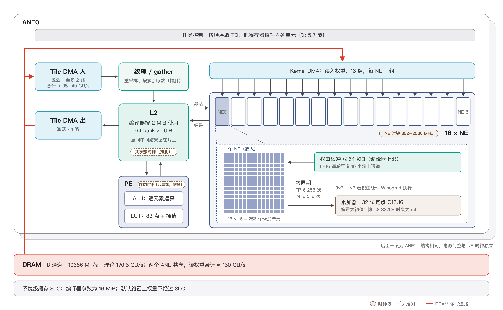

*图 4-1　M6 ANE 的硬件结构。展开绘制的是 ANE0，背后一层的 ANE1 结构相同；下部为两个 ANE 共享的 DRAM 与系统级缓存。红线为 DRAM 读写通路；橙色标签标出时钟域，虚线标签表示推测。放大框中的 16×16 网格只示意每个 NE 每周期 256 次 FP16 乘加，不代表乘加单元的物理排列。紫色表示计算，蓝色表示片上存储，绿色表示数据搬运，红色表示片外存储。*

在计算方面，16 个 NE 构成乘加阵列，每个 NE 每周期完成 256 次 FP16 乘加或 512 次 INT8 乘加。编译器为每个 NE 设定 64 KiB 的常驻权重上限，FP16 模式下每个 NE 每轮至多计算 16 个输出通道，16 个 NE 每轮至多 256 个；输出通道数从 256 增至 272 时需要多算一轮，耗时出现明显的台阶（第 7.3.2 节）。逐元素运算由独立的 PE 完成，在本文测试的程序中，PE 运算与乘加运算分属不同的 TD 时没有观察到重叠（第 6 章）；激活函数由 33 点查找表加线性插值实现。FP16 路径的累加器实际是 32 位定点数（Q15.16），INT8 路径的累加器是 32 位整数，这一点决定了 ANE 的若干数值行为，例如累加结果的绝对值达到 32768 时会变为无穷大（第 8 章）。

在数据搬运方面，Tile DMA 负责搬运激活值，每个 TD 至多有 2 路输入和 1 路输出，两路输入共享约 35–40 GB/s 的带宽。Kernel DMA 负责搬运权重，每个 NE 对应一组，读权重的带宽约为 150 GB/s。层间的中间结果保存在每个 ANE 的 L2 中，编译器把它按 2 MiB 使用；L2 分为 64 个 bank，编译器会对张量的行步长进行补齐，以避免 bank 冲突。L2 之下是系统级缓存（system-level cache，SLC）和 8 通道 DRAM；在 Core ML 的默认路径上，权重读取不使用 SLC（第 9.3.3 节）。

在双引擎协同方面，编译器为每个模型同时生成单 ANE（nonbonded）和双 ANE（bonded）两套程序，并根据成本模型决定是否把子图切分到两个 ANE 上，切分方式为按空间（按行，高度为 1 时按列）或按输出通道。在双 ANE 执行时，按行切分的两个 ANE 各读取一份完整的权重，按输出通道切分时各读取一半，两者共享 DRAM 带宽。因此，计算受限的网络可获得约 1.92 倍的加速，而读权重受限的网络加速有限：每层权重不同的卷积链约 1.4 倍，按行切分时则没有加速（第 10 章）。

在时钟与功耗方面，每个 ANE 的 NE 时钟有 32 档，实际工作范围为 852–2580 MHz，档位由 CLPC 选择。PE 的时钟独立于 NE 时钟调度，CLPC 中另有一个两个 ANE 共用的"共享簇"，我们推测 PE 与 L2 位于其中；这一时钟的绝对频率无法读取，已知它的升频较慢，并且在 GPU 繁忙时会被压低。SoC 互连有 5 档频率（第 11 章）。满载时，单 ANE 的功耗为 6.2 W，双 ANE 为 10.8 W；空闲时功耗为 0（第 13 章）。

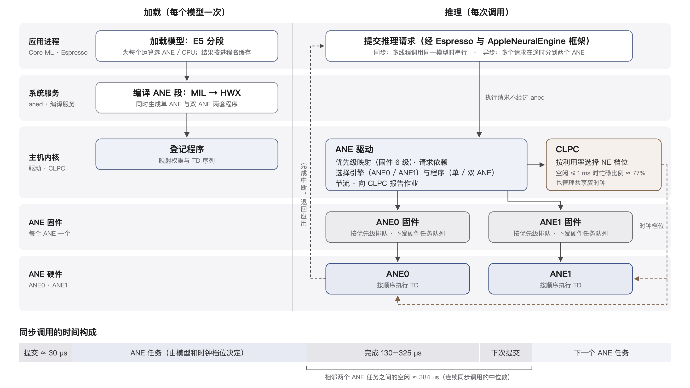

*图 4-2　从软件调用到硬件执行。左侧为每个模型一次的加载路径，其中 Espresso 的 E5 分段器先决定哪些运算交给 ANE；右侧为每次推理的执行路径，下方为同步调用的时间构成：相邻两个 ANE 任务之间约 384 µs 的空闲包含完成侧开销和下一次的提交开销。*

在控制路径上（图 4-2），模型首先经过 Core ML 的运行时框架 Espresso：加载时，Espresso 中的 E5 模块由分段器为每个运算选择 ANE 或 CPU 后端，只把 ANE 段交给守护进程 aned 的编译服务编译，编译结果按进程名缓存（第 5.9 节）；推理时，请求经 Espresso 和 AppleNeuralEngine 框架提交给内核驱动，据 maderix [4] 在 M4 上的观察不经过 aned（第 6.2 节）。ANE 编译器把网络的每一层翻译为一个或多个 TD。每个 TD 是一段带包头的寄存器写入序列，每个 ANE 的程序是一条由编译器排定顺序的 TD 序列（第 5 章）；在本文测试的程序中，互不依赖的 TD 之间也没有观察到重叠（第 6 章）。

推理请求到达内核驱动后，驱动负责映射请求的优先级，选择使用哪个 ANE 以及单 ANE 还是双 ANE 程序，并在必要时对请求节流。请求随后交给 ANE 内的固件；固件按 6 级优先级排队，并把任务放入硬件任务队列，每个队列有两个槽位；据固件字符串推断，高优先级任务可以抢占正在执行的低优先级任务。硬件从队列中取出 TD，解码后把寄存器值写入各功能单元的配置。每次调用都有固定的主机侧开销：提交约需 30 µs，完成通知约需 130–325 µs；在同步调用方式下，相邻两次调用之间 ANE 约有 384 µs 处于空闲（第 6 章）。决定 ANE 时钟档位的 CLPC 不在 ANE 内，而在主机内核中（第 12 章）。

### 4.6 与 M4 的比较

表 4-5 比较了 M4 与 M6 的 ANE。M4 一列的数据取自 maderix [4] 和本文在 M4 上的对照实验。

*表 4-5　M4 与 M6 的 ANE 对比*

| 项目          | M4                                         | M6                                                                         |
| ----------- | ------------------------------------------ | -------------------------------------------------------------------------- |
| 架构          | h16g（Mach-O subtype 7）                     | h18g（Mach-O subtype 11）                                                    |
| 引擎数         | 1                                          | 2，位于同一裸片                                                                   |
| 每个引擎的 NE 数  | 16（Apple 的口径）；maderix 认为是 8 个计算组           | 16（ioreg、参数表、权重切分三方一致）                                                     |
| 编译产物        | 一套程序                                       | 单 ANE 与双 ANE 两套程序                                                          |
| TD 布局版本     | v17                                        | v24                                                                        |
| NE 频率表（编译器） | 26 档，最高 2364 MHz                           | 32 档，最高 2508 MHz（硬件实际最高 2580 MHz）                                          |
| DRAM        | 8 通道，约 7467 MT/s                           | 8 通道，约 10656 MT/s                                                          |
| FP16 吞吐     | 约 18.5 TFLOPS（48 层，1024 通道，64×64，含调用开销）[4] | 相近口径（512 通道，32×32）48 层 25.6 TFLOPS（表 7-12）；斜率法单 ANE 20.6、双 ANE 39.5 TFLOPS |

M6 相对于 M4 最大的变化是增加了一个完整的引擎，以及由此产生的"一个模型、两套程序"的编译方式。其余部分，包括 TD 机制、每个引擎 16 个 NE 以及定点累加器，均与 M4 一脉相承。我们在 M4 上重复了第 8 章中 FP16 乘加路径的基本数值测试，结果与 M6 相同。各代产品的完整比较见第 15 章。

### 4.7 小结

M6 的 ANE 由两个结构相同、各有电源门控的引擎组成，每个引擎包含 16 个 NE，二者位于同一裸片并共用一个地址翻译单元。编译器以 `2026BaseLine` 参数集描述这一平台，其中的 NE 频率表与硬件实际的频率表在最高的 8 档上不一致。

本章只给出结构上的轮廓，其中两点在后续各章中反复出现，值得先指出。第一，两个引擎并不意味着两倍的速度：单个请求能否用上第二个引擎由编译器决定（第 5 章），多个请求如何分配由驱动决定（第 6 章），实际能得到多少加速则取决于负载是否受两个引擎共享的资源限制（第 10 章）。第二，ANE 的运行速度在很大程度上取决于主机侧：时钟档位由主机内核中的 CLPC 选择，主机提交请求越稀疏，ANE 被分配的档位越低（第 12 章）。本文的测量全部在一台 16 GB 内存的 M6 和一个 macOS 版本上完成；在其他内存配置或系统版本下，DRAM 档位和编译器策略都可能不同。由这些结构特点导出的使用建议见第 15.2 节。

## 5. 编译器与程序格式

本章按模型经过的顺序研究编译：先由 Core ML 的分段器决定哪些运算交给 ANE，再由 ANE 编译器把它们翻译为可在硬件上执行的程序，其中包括两个引擎之间的切分，最后是编译的代价。我们读取分段器写出的分析文件，并以只编译、不执行的方式获得各编译目标的产物，通过逐字节比较产物和反汇编编译器确定程序的格式。本章的主要结论有四点。第一，每段 ANE 要付 0.25–0.375 ms 的固定代价，小模型和小段因此被分段器放到 CPU；int32 运算、部分数学函数和序列类运算不能上 ANE。第二，每个编译产物同时包含单 ANE 和双 ANE 两套程序；程序由任务描述符序列构成，每个任务描述符是一串寄存器写入包，不含指令或分支。第三，是否把子图切分到两个 ANE，由一个假设两个引擎互不干扰、也不考虑两块大小不等的延迟模型决定，切分规则使部分模型的两个引擎工作量不均。第四，生成双 ANE 程序的步骤使编译时间随逐元素层数超线性增长，在所测的 1×1 卷积链上从 387 层起使编译器崩溃，并使大模型的磁盘占用与层数成正比。

### 5.1 方法

在本章中，本文通过直接调用编译接口 `ANECCompile`（[anecc.m](../tools/common/anecc.m)），输入 MIL 文件、目标名和编译选项，生成 HWX 格式的编译产物并进行分析。该接口只进行编译，不访问硬件，因此可以把同一个模型分别编译为 h16g（M4）、h17s（M5）、h18、h18g（M6）和 h19 （A20）五个目标，并对产物逐字节比较。需要说明的是，h17s 并不是 M5 实际使用的编译目标：在搭载 M5 芯片的 MacBook Air 上从 IORegistry 中 ANE 驱动服务的设备属性读得其编译目标为 h17〔ioreg〕，而 Bryngelson [5] 把 M5 记为 H17s。本文选用 h17s 只是为了代表 H17 一代的编译器参数，本章（表 5-4、表 5-17）和第 7.4.1 节中 h17s 的结果不能直接视为 M5 的行为；h17 与 h17s 的差别，本文没有系统比较。编译选项以字典形式传入，其中包括若干控制双 ANE 行为的开关（例如 `EnableForcedMaximalBondedSplit` 和 `ForceAllToANE0OnBondedProcedure`），本章利用它们构造对照实验。

本章内模型的执行一律通过 Core ML 完成，不加载、也不执行任何经过修改的 HWX。这一约束使本文的方法与 maderix [4] 不同：maderix 修改 HWX 中的字段后在硬件上执行，以输出和耗时的变化来确认字段含义；本文则只能通过"改变模型的一个属性，观察产物中哪些字发生变化"，并结合编译器的反汇编来推断字段含义。编译器的反汇编通过以下方式获得：在 M6 上把 ANECompiler 框架加载进自己的进程，用符号表定位未导出的函数，导出其机器码后用系统工具反汇编（工具：[syms.c](../tools/re/syms.c)、[fnbytes.c](../tools/re/fnbytes.c)、[xref.c](../tools/re/xref.c)）。因此，本章关于字段含义的结论均标注为〔HWX〕或〔编译器〕，没有经过执行层面的直接验证。

本章使用的基准模型为一个 3 层 64 通道 1×1 卷积网络，每层卷积后使用 relu 作为激活函数，输入张量形状为 [1, 64, 64, 64]，数据类型为 FP16（MIL 源文件：[model.mil](../data/03_compile/hwx/model.mil)；生成脚本：[mk.py](../data/03_compile/hwx/mk.py)）。各目标的编译产物保存在 [data/03_compile/hwx/](../data/03_compile/hwx/)，解析工具为 [hwx_parse.py](../tools/lib/hwx_parse.py)。本章其余各节还使用了若干专门构造的模型，在用到时说明。

### 5.2 Core ML 的算子分派

通过 Core ML 加载模型时，其运行时框架 Espresso 负责完整算子的指派。Core ML 的运行时框架 Espresso 中，编译与执行模块 E5 先使用一个分段器（segmenter）为每个运算选择后端，即 ANE、BNNS（Accelerate 框架中的 CPU 神经网络实现）或经典的 CPU 实现，再把图切成若干段，只有被分到 ANE 的段才交给 ANE 编译器。这一步决定了一个模型实际在多大程度上使用 ANE，也决定了哪些运算根本不会进入后文所述的编译路径。

我们为每个被测算子生成两个模型，一个只含该运算，另一个在其前后各接两层 3×3 卷积或线性层，另有一组边界扫描模型。每个模型在独立的缓存目录中加载一次，读取分段器写在 E5 缓存中的分析文件 `analytics.mil`；这个文件为每个运算记录了可用的后端、各后端的估计耗时和选中的后端，与公开接口 `MLComputePlan` 报告的首选设备逐运算一致，没有差别。除个别不能解析或被折叠的模型外，共得到 482 个模型的分析文件（工具：[opdispatch_gen.py](../tools/03_compile/opdispatch_gen.py)、[opd_all.sh](../tools/03_compile/opd_all.sh)、[opd_ana.sh](../tools/03_compile/opd_ana.sh)、[computeplan.swift](../tools/common/computeplan.swift)；数据：[opdispatch/](../data/03_compile/opdispatch/)）〔编译器〕。这组实验是在 M4（Mac16,12）上通过 Core ML 完成的，它们对 M6 的适用性在本节最后讨论。

分段器的决策可以用一个很简单的模型复现。每个运算取分段器自己给出的各后端估计耗时；一段 ANE 固定加 0.125 ms 的启动代价，相邻两段后端不同时再加 0.125 ms 的切换代价，图的输出落在 ANE 上时再加 0.125 ms；按这一模型求代价最小的分段，再与实际选择比较。若把 BNNS 与经典 CPU 实现合并为 CPU 一类，只比较每个运算落在 ANE 还是 CPU，482 个模型中有 440 个与实际选择完全一致，41 个是代价相同的平局，只有 1 个不一致；若区分三种后端，则只有 261 个完全一致，平局增至 220 个，不一致仍为 1 个，多出的 179 个平局都是在两种 CPU 后端之间的选择上与实际不同、而按模型计算的代价相同（工具：[opdispatch_fit.py](../tools/03_compile/opdispatch_fit.py)）〔编译器〕。因此，这一模型复现的是运算在 ANE 与 CPU 之间的分派，而不是两种 CPU 后端之间的选择。此外，模型把分析文件中的运算按出现顺序当作一条链来求最短路径，对含有多输入或分支的图只是近似〔推断〕。启动与切换两类常数写在分析文件的函数头中，在所有模型中都是 2⁻³ ms；图输出一项在函数头中没有对应的字段，是拟合时加入的，其数值与切换代价相同〔编译器，推断〕。由此可以推出，一段 ANE 位于图首或图尾时，它必须比 CPU 省下至少 0.25 ms 的估计耗时才会被选中，位于图中间时则要省下至少 0.375 ms〔推断〕。表 5-1 列出了几种运算的估计耗时。

*表 5-1　分段器对单个运算的估计耗时（M4，µs）*

| 运算                           | ANE  | CPU（BNNS） |
| ---------------------------- | ---- | --------- |
| 3×3 卷积，64 → 64 通道，32×32      | 4.67 | 100.06    |
| 1×1 卷积，同上                    | 1.17 | 21.62     |
| 矩阵乘，1×128×256 与 256×128      | 2.24 | 11.12     |
| 双线性上采样 ×2                    | 3.31 | 499.64    |
| 按通道拼接                        | 2.62 | 22.79     |
| 缩放点积注意力，1×8×128×64           | 7.18 | 8.62      |
| softmax、layer_norm（64×32×32） | 3.59 | 4.31      |
| relu                         | 2.62 | 2.62      |

与这些估计相比，0.25–0.375 ms 的固定代价相当大，因此小模型和网络中的小段几乎都会被放到 CPU。例如，64 通道、32×32 的 3×3 卷积单独一层时只能省下约 0.095 ms，整层放在 CPU；四层可以省下约 0.38 ms，超过 0.25 ms，才被放到 ANE；两层卷积之间夹一个只能在 CPU 上执行的运算时，分段器要在"切换两次"与"整图放 CPU"之间选择，网络不大时整个图都放在 CPU〔编译器，推断〕。以访存为主的运算在两个后端上的估计只差约 17%，单独出现时总是留在 CPU 段。因此，在上下文模型中被放到 CPU 的运算，并不都是不能在 ANE 上执行的运算。

ANE 不支持的运算主要有四类〔编译器〕。第一类是任何 int32 张量上的运算，包括 int32 的加法、乘法和矩阵乘，与 int32 之间的类型转换，输出 int32 的 argmax 和 argsort，以及动态索引的 gather、scatter 所需的整套索引预处理。第二类是部分数学函数：asin、acos、tan、sinh、cosh、atanh、mod、reduce_prod 和 cumsum。第三类是序列与结构类运算：lstm、gru、rnn、band_part、one_hot、non_zero、range_1d、random_normal、sliding_windows、crop_resize 和起点为动态的切片。第四类是尺寸上限，如表 5-2 所示。这些运算在分段这一步就不含 ANE 选项，会被放到 CPU，其余部分再按上述代价规则分段。分段器并不直接调用 ANE 编译器导出的全部 50 个层校验函数：Espresso 只导入了其中 23 个（卷积、矩阵乘、池化、softmax、归约、gather、topk 等），缩放点积注意力、layer_norm、逐元素运算和激活函数等没有导入对应的校验函数，却同样能放到 ANE 上，它们的判断走的是另一条路径，本文没有追查〔编译器〕。常见的 CNN 和 Transformer 运算都能放到 ANE 上，包括各种卷积（一维、三维、分组、空洞、转置和动态权重）、矩阵乘（含批量、广播和动态输入）、缩放点积注意力、layer_norm、instance_norm、softmax、三种 GELU、topk、静态索引的 gather、除 reduce_prod 以外的归约、各种上采样与缩放、各种填充、像素重排、转置和拼接；FP32 输入会被插入类型转换后放到 ANE 上〔编译器〕。

*表 5-2　ANE 的尺寸上限（Core ML 在 M4 上的判断；h16g、h18g 直接编译的结果与之一致，只有 16×16 方核因编译内存超过 8 GB 而未能确认）*

| 项目             | 支持                | 不支持       |
| -------------- | ----------------- | --------- |
| 方形卷积核 K×K      | ≤ 16（16 只有分段器的判断） | 17        |
| 横向卷积核 1×K      | ≤ 15              | 16        |
| 纵向卷积核 K×1      | ≤ 31              | 32        |
| max_pool 核 K×K | ≤ 8               | 9         |
| 矩阵乘的内积维        | ≤ 32768           | 40000 及以上 |
| 张量的单个维度        | ≤ 65536           | 65537     |

这些上限来自 ANE 编译器本身。我们用 `ANECCompile` 把 62 个边界与对照模型分别编译为 h16g 和 h18g，除 topk 外两个目标的成败逐个相同，h16g 的成败又与 Core ML 在 M4 上的判断一致；16×16 方核在两个目标上都因编译内存超过 8 GB 被中止，它能否编译只有分段器的判断，横向核宽 15 的上限则与第 7.4.1 节由配置字得到的结果一致（工具：[opd_arch.sh](../tools/03_compile/opd_arch.sh)；数据：[arch_h16g_h18g.tsv](../data/03_compile/opdispatch/arch_h16g_h18g.tsv)）〔编译器〕。查询分派本身也可能很昂贵：对一层 16×16 卷积（64 通道，32×32）调用 `MLComputePlan` 时，查询会触发完整的 ANE 编译，用了 212–229 s，编译服务各进程合计的内存峰值约 11.4 GiB；13×13 的卷积只需 2–23 s〔计时〕。

topk 是唯一的例外。直接编译单个 topk 时，h16g 在 RCAS 的校验中失败，h18g 则能编过，这与第 5.7.8 节中 RCAS 字段只在 topk 中出现的观察一致〔编译器〕。Core ML 在 M4 上仍把 topk 放进 ANE 段：在前后各接 4 层 256 通道 3×3 卷积的模型中，分段器把整个图放在一个 ANE 段里，而 topk 使调用耗时比同形状的对照多出 6.0 ms（沿宽度，k = 4）和 10.1 ms（沿通道，k = 256），分段器的估计只有 0.03 和 0.06 ms，低估了约 170–200 倍；结果整图放在 ANE 上反而比只用 CPU 更慢（8.00 对 6.23 ms，12.59 对 11.08 ms）（工具：[topk_ctx.py](../tools/03_compile/topk_ctx.py)、[predict.swift](../tools/common/predict.swift)；数据：[topk_timing.txt](../data/03_compile/opdispatch/topk_timing.txt)）〔计时，推断〕。这组计时只预热一次、取 20 次调用的中位数，没有按第 3.4 节的规范连续预热并读取中断数，因此 topk 是否全部在 ANE 上执行、多出的时间来自哪里，都没有直接确认；topk 在 M6 上是否同样慢，本文也没有测量。

上述分派结论可以推广到 M6，但这一推广依据的是编译器而不是 M6 上的实测。Espresso 内置一个提前编译（ahead-of-time，AOT）驱动，可以指定任意 E5 平台；E5 的平台名写作 H16G、H18G 等，与 ANE 编译目标 h16g、h18g 对应，其中 H18G 即 M6 的 t8152。我们在本文自己的进程中以只做分段、不调用 ANE 编译器的模式运行这一驱动，以 H16G 和 H18G 为目标分别处理全部 490 个模型（其中两个 nms 模型无法解析，没有输出），并用一个动态库截取分段器写入系统日志的逐运算估计（第 3.2 节；工具：[aotdrv.cpp](../tools/common/aotdrv.cpp)、[oslogtap.c](../tools/common/oslogtap.c)、[opd_aotcost.sh](../tools/03_compile/opd_aotcost.sh)；数据：[aotfull/](../data/03_compile/opdispatch/aotfull/)、[aotcost/](../data/03_compile/opdispatch/aotcost/)）〔编译器〕。两个目标的逐运算估计和分段结果逐字节相同。

作为对照，我们在其中 16 个模型上比较了其他平台：H13G、H17G 和 H19 都有部分运算的估计与 H16G 不同，以卷积和矩阵乘为主，例如上表中 3×3 卷积的 ANE 估计在 H13G、H16G 与 H18G、H17G、H19 上分别为 6.52、4.67、8.77 和 5.43 µs，说明代价模型确实按平台区分，只是 H18G 沿用了 H16G 的参数〔编译器〕。M4 上 Core ML 实际编译所得的 6489 个非零估计中，有 6483 个出现在 AOT 驱动以 H16G 为目标的输出中，没有出现的 6 个都是输入侧类型转换的估计，说明 AOT 驱动的结果能代表实际行为〔编译器〕。

据此可以推断，Core ML 在 M6 上的分派与 M4 相同〔编译器，推断〕；这一推断还隐含了 M6 运行时使用 H18G 平台这一前提，我们没有在 M6 上直接确认。由于分段器并不知道 M6 有两个引擎、时钟更高，仍按 M4 的估计决定哪些运算放到 ANE 上，对 M6 而言这一门槛偏保守，一些在 M6 的 ANE 上已经划算的小段仍会被放到 CPU〔推断〕。

### 5.3 ANE 编译器的流程

在编译流程中，守护进程 aned 派生的编译服务负责将被分段器分到 ANE 的段交给 ANE 编译器。本章其余各节研究的就是此步：编译器把交给它的程序翻译成什么，以及双引擎芯片带来了哪些额外的步骤和代价。此类实验绕过分段，直接调用编译接口（第 5.1 节），以便控制交给 ANE 编译器的程序。

ANE 编译器使用 Core ML 的中间表示 MIL（Model Intermediate Language）作为输入。MIL 程序是一种带类型的静态单赋值形式，以 `program(1.3)` 和 `func main<ios18>` 声明版本，张量布局为 NCHW。编译器首先用一组校验函数检查每个运算能否映射到 ANE 的硬件层。M6 上的编译器导出了 50 个此类函数（`_ANECValidate*Layer`），覆盖卷积、矩阵乘、逐元素运算、归约、softmax、层归一化、缩放点积注意力（SDPA）、gather、排序、Top-K 和各类形状变换；激活函数类型（`ZinIrNeuronType`）共 33 种，包括 relu 的各种变体、sigmoid、tanh、gelu、swish、exp、log2、sin、cos、rsqrt 等（清单：[compiler_layers_neurons_m6.txt](../data/03_compile/compiler_layers_neurons_m6.txt)）〔编译器〕。

通过校验后，编译器把相邻的运算融合为硬件层（例如把卷积、偏置加和 relu 融合为一层），按硬件参数表中的容量限制对层进行合法化与分块，为张量分配 L2 和 DRAM 空间，然后生成 TD 序列，最后打包为 HWX 文件。对于 h18g 目标，编译器在分块之后还要执行一组双 ANE 专有的步骤，包括切分子图的识别（`BondedSplitSubgraphIdentification`）、并行分支的搜索（`ZinMirFindInherentParallelism`）、切分延迟的估计（`LatencyInfo::ComputeSplitLatencyBonded`）和双引擎异步组的代码生成（`CodegenAsyncGroupsForBonded`），这些步骤的作用和代价分别在第 5.8 节和第 5.9 节讨论〔编译器〕。

HWX 文件的 `LC_IDENT` 加载命令记录了编译器版本和实际使用的编译选项。本文所用编译器的版本为 `zin_ane_compiler v10.26.6`；为 h18g 编译时，记录的选项包括 `-t h18g`、`--fno-fold-scale=true`、`--fdram-allocator=ffreuse` 和 `--fdram-tensor-priority=sizebyliverange`。通过 Core ML 加载模型时，内核日志中还能看到 `--ne-frequency=-1.000000`、`--pstate-soc=-1` 等选项，其中 −1 表示由编译器采用架构的默认值〔HWX，内核〕。

### 5.4 编译目标与硬件参数表

编译器中的每个编译目标对应一个目标类（例如 `TargetH18g`），目标类在构造时选定一张硬件参数表（即第 3.5 节所述的 HAL 参数表）和一组 SoC 参数。HAL 参数表是每代 ANE 的静态常量表，每张 0xa10 字节，记录了容量上限、对齐要求、功能开关和性能模型常数。我们在进程内调用各代的 `GetParams()` 函数导出了这些表，并以反汇编追踪了 3233 个以该表为参数的函数中对表的读取，为 293 个偏移找到了读取者（工具：[dump2.c](../tools/re/dump2.c)、[hal_readers.py](../tools/re/hal_readers.py)）。由于参数表和反汇编属于 Apple 二进制的派生内容，原始导出不随仓库公开，读者可以用上述工具在自己的机器上重新生成〔HAL〕。

本版编译器的参数表布局与 Bryngelson [5] 所描述的布局不同：编译器在表中插入了新字段，使书中的偏移在不同区段需要加上 0x8 至 0xb8 不等的位移。表 5-3 列出了与后续各章相关的字段，并给出书中的偏移以便对照。

*表 5-3　HAL 参数表中与本文相关的字段（h18g 使用的 2026BaseLine 表）*

| 本版偏移  | 书中偏移 [5] | 值       | 主要读取者                                       | 含义                         |
| ----- | -------- | ------- | ------------------------------------------- | -------------------------- |
| 0x008 | —        | 11      | —                                           | HWX CPU subtype，决定 TD 布局版本 |
| 0x00c | —        | 16      | `DetermineNumNesToUse`                      | 每个 ANE 的 NE 数              |
| 0x014 | 0x0c     | 8       | `ComputeMaxOcgSize`、`HasAccDoubleBuffering` | 每个 NE 的累加器深度               |
| 0x1d8 | 0x1b8    | 2 MiB   | `HandleL2Config`、`LowerNEMatMulToNEConv`    | 单个操作数的片上驻留上限               |
| 0x1e0 | 0x1c0    | 16      | `GetL2Alignment`                            | DRAM 与 L2 的访问对齐（字节）        |
| 0x1e8 | 0x1c8    | 64      | `ZinMirBankConflictOptimizer`               | L2 bank 数                  |
| 0x210 | 0x1f0    | 256 KiB | —                                           | L2 驻留阈值                    |
| 0x220 | 0x200    | 64 KiB  | `GetKernelTensorBatchSplitFactor` 等         | 每个 NE 的常驻权重上限              |
| 0x230 | 0x210    | 16 MiB  | `OptimizeCoutBatchtoFitInKBuf`              | 流式读入权重的上限                  |
| 0x2a0 | —        | 64      | `PERasterization::GetWorkunitSize`          | PE 工作单元                    |
| 0x330 | —        | 16      | `SetChainBufferNEWorkUnit`                  | NE 工作单元                    |

我们比较了各代参数表后发现，同一代 ANE 的各个变体（例如 H16、H16g、H16s、H16c）的参数表在数值上逐字节相同，只有表头的名字指针和若干 vector 的地址不同。因此，在本版编译器中，区分同代变体的信息（例如 NE 数和引擎数）已不在这张表中；是否生成双 ANE 程序由编译选项（`EnableBondedNetworks` 等）控制，而不是由参数表的变体区分；参数表只提供能力开关，例如双 ANE 切分要求偏移 0x73c 置位（第 5.8.3 节）〔HAL，编译器〕。

从 H17（M5 一代）到 H18，参数表中与乘加阵列规模、L2 容量和带宽相关的数值保持不变，其变化集中在执行模式与数据格式上（双 Int8 模式等其他开关见第 15.3 节）：一是工作单元的划分更灵活，新增了"半工作单元"模式（偏移 0x55c，读取者 `CanUseHalfWorkUnitMode`）和非 2 的幂的工作单元候选值 16 与 20（偏移 0x5a0 和 0x5a8）；二是支持的数据格式更多，原生支持的权重格式从 13 种增加到 21 种（偏移 0x8a0 处的 vector），3 位调色板权重不再需要升格为 4 位，并新增了输入输出与权重的数据格式开关（偏移 0x5ff 和 0x600）〔HAL〕。长度至多为 4 的向量调色板（偏移 0x72f 和 0x730）则早在 H17 一代就已出现〔HAL〕。

我们逐字节比较了 2026BaseLine、H18 和 H19 三张表：2026BaseLine 与 H19 除表头的名字指针和各 vector 的地址之外完全相同，各 vector 的内容也完全相同；而它与同代的单引擎目标 H18 在若干字段上不同（2026BaseLine 并不是 H18 的变体，而是一张独立的表，因此不违背上文同代变体逐字节相同的规律），例如多调色板模式（偏移 0x5c7 和 0x5c8）、双倍速率模式（偏移 0x5f7）、FIFO 缓冲大小（偏移 0x888）以及 gather 与纹理运算的维度上限（偏移 0x1a8–0x1b8），这些字段在 2026BaseLine 和 H19 中都已启用或放宽，在 H18 中则没有〔HAL〕。也就是说，在编译器看来，M6 的硬件参数就是 H19 的参数；两者在编译器中的区别只在 SoC 参数（频率表、DRAM 通道数等，第 4.4 节）上。这与第 5.7.7 节中 h18g 与 h19 使用同一 TD 布局（v24）、指令流几乎逐字相同的结果一致。

### 5.5 HWX 格式与两套程序

HWX 是 Mach-O 格式的文件。表 5-4 比较了基准模型在五个目标上的编译产物（数据：[data/03_compile/hwx/](../data/03_compile/hwx/)）〔HWX〕。

*表 5-4　五个编译目标的产物格式*

| 目标           | CPU subtype | 文件大小   | 加载命令数 | 格式                  | 双 ANE 程序 |
| ------------ | ----------- | ------ | ----- | ------------------- | -------- |
| h16g（M4）     | 7           | 96 KB  | 14    | 传统格式                | 无        |
| h17s（H17 一代） | 9           | 96 KB  | 14    | 传统格式                | 无        |
| h18          | 10          | 96 KB  | 14    | 传统格式                | 无        |
| h18g（M6）     | 11          | 128 KB | 8     | 新格式，含 `__RUNTIME` 段 | 有        |
| h19          | 11          | 128 KB | 8     | 新格式，含 `__RUNTIME` 段 | 有        |

M4 的 HWX 采用 maderix [4] 所描述的传统格式：`__TEXT` 段存放一段 TD 序列，`__KERN_0` 段存放权重，两个 `__FVMLIB` 段描述输入和输出。M6 的 HWX 采用新格式，新增了一个 `__RUNTIME` 段，并且 `__TEXT` 段中包含三段 TD 序列，如表 5-5 所示。

*表 5-5　h18g 编译产物的段布局（基准模型）*

| 段                | 虚拟地址       | 内容                                          |
| ---------------- | ---------- | ------------------------------------------- |
| `__RUNTIME`      | 0x30000000 | 运行时操作图（RTGraph），0x102c 字节                   |
| `__TEXT`         | 0x30004000 | 单 ANE 程序：只使用 ANE0                           |
|                  | 0x30008000 | 双 ANE 程序中由 ANE0 执行的部分                       |
|                  | 0x3000c000 | 双 ANE 程序中由 ANE1 执行的部分                       |
| `__TEXT,__const` | —          | 常量                                          |
| `__KERN_0`       | 0x30014000 | 权重，0x6c00 字节；两套程序、两个 ANE 共用同一份              |
| `LC_IDENT`       | —          | 编译器版本与编译选项                                  |
| `LC_NOTE`        | —          | 源模型信息（`src model info`）与运行时版本（`rt.version`） |
| `LC_SYMTAB`      | —          | 111 个符号                                     |

`__RUNTIME` 段描述了执行每套程序时运行时需要完成的操作，其内容可以从符号名直接读出。`main__nonbonded` 过程依次映射权重、映射输入和输出、映射 ANE0 的 TD 序列，然后通过 `rt_op_ane_kick_…_ane_0` 启动 ANE0 一次。`main__bonded` 过程把同一份权重分别映射给 ANE0 和 ANE1，再分别映射两者的输入输出和 TD 序列，最后通过 `rt_op_ane_kick_…_ane_1` 和 `rt_op_ane_kick_…_ane_0` 启动两个 ANE 各一次。`main` 过程为整段编译程序的入口〔HWX〕。

在五个编译目标中，只有 h18g 和 h19 的产物采用这种新格式。因此推断，h18g 与 h19 属于同一代 ANE。然而 h18 的产物仍为传统格式，不含双 ANE 程序。由此可见，"两套程序"是双引擎版本芯片专有的编译路径，而不是这一代 ANE 的共同特性〔HWX〕。

需要指出的是，选择执行哪一套程序发生在运行时，而双 ANE 程序中每一段子图的切分方式（切分到两个 ANE 上或全部留在 ANE0）则在编译时已经确定。如果编译器决定不切分，双 ANE 程序中就没有 ANE1 的 TD 序列，运行时即使选择双 ANE 程序，这一请求也只会使用 ANE0。第 6.3.2 节的中断计数表明，只要双 ANE 程序中存在 ANE1 的 TD 序列，Core ML 就会选择执行双 ANE 程序。

### 5.6 权重的切分

在基准模型的产物中，每一层的权重在 `__KERN_0` 段中被切分为 16 块，符号名依次为 `K<sha256>_ne_0` 至 `K<sha256>_ne_15`，每块 0x240（576）字节。这一大小可以由层的形状推出：64 个输出通道平均分给 16 个 NE，每个 NE 负责 4 个输出通道；4 个输出通道 × 64 个输入通道 × 2 字节等于 512 字节，加上 bias 并按 64 字节对齐后为 576 字节。每个 TD 中还有 16 个连续的配置字（例如 `00000021`、`00010021`），其个数与 NE 数相同，推测是 16 个 NE 各自的权重 DMA 配置〔推断〕。这些事实表明，硬件按输出通道把一层的计算分配给 16 个 NE，与 ioreg 中 `NumANECores = 16` 的记录一致〔HWX〕。

当每个 NE 所需的权重超过 64 KiB 时，编译器有两种处理方式。输入较大时，它把该层按输出通道拆分为多个 TD，使每个 TD 中每个 NE 的权重不超过 64 KiB，每层的 TD 数约为 ⌈每个 NE 的权重 ÷ 64 KiB⌉。我们统计了 16×32 输入上多种卷积核形状的产物（256 通道），多数符合这一关系：例如 3×3 卷积每个 NE 需要约 72 KiB 权重，每层 2 个 TD；5×5 卷积约 200 KiB，每层 4 个 TD；1×9 卷积改写后（第 7.4.1 节）约 154 KiB，每层 3 个 TD，这三个 TD 的输出通道数分别为 64、96 和 96。32×32 输入上的 1×9 卷积同样为每层 3 个 TD。也有例外：7×7 卷积约 392 KiB，按上式应为 7 个 TD，实为 8 个；改写后的 1×15 卷积约 256 KiB，应为 4 个，实为 6 个（表 7-6）〔HWX〕。我们推测这是因为编译器按整组输出通道切分，每个 TD 往往用不满 64 KiB〔推断〕。

输入较小时，编译器也可以把全部输出通道放在一个 TD 中，在执行过程中连续读入权重。我们在 288 个形状的产物中观察到两种情况（数据：[bsdecide.txt](../data/08_bonded/bsdecide.txt)）：4×32 输入上，包括 3×3、5×5、15×1 在内的全部卷积核每层都只有 1 个 TD，尽管其中多数的每 NE 权重超过 64 KiB；8×32 输入上，原生执行的核仍符合上述规则（3×3 和 9×1 为 2 个 TD，5×5 为 4 个 TD），而改写后的 1×9 至 1×15 卷积每层只有 1 个 TD〔HWX〕。编译器在两种方式之间如何选择，本文没有确定；第 7.4.2 节表明，两种方式下这些层每层都要重新读入权重，耗时都由读权重相关的环节决定。

64 KiB 这一界限与 HAL 参数表偏移 0x220 处"常驻权重上限"字段的值（64 KiB）一致，也与第 7 章由输出通道分组得到的结果一致。据此可以确定编译器按每个 NE 64 KiB 使用权重缓冲；物理容量是否更大，本文无法直接读取〔HWX，HAL，推断〕。这一容量决定了大卷积核的输出通道分组随输入通道数减小（第 7.3.1 节）；而第 7.3.2 节中输出通道数从 256 增至 272 时的台阶，来自 16 个 NE 每轮至多 256 个输出通道的上限，与权重容量无关。

图 5-1 概括了本节所述的两种切分：一层的权重按输出通道均分给 16 个 NE；每个 NE 的权重超过 64 KiB 时，输入较大的层再按输出通道拆分为多个 TD。

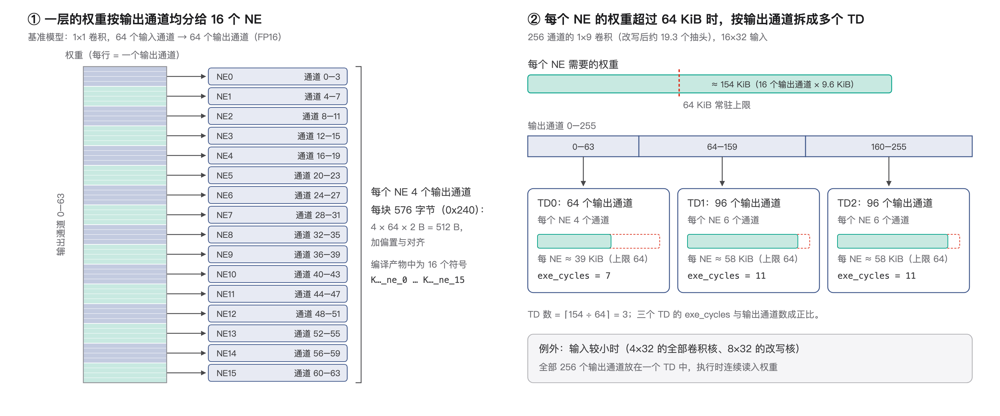

*图 5-1　权重的切分。左：基准模型（1×1 卷积，64 → 64 通道）的权重按输出通道均分给 16 个 NE，每个 NE 一块 576 字节。右：256 通道、16×32 输入的 1×9 卷积改写后每个 NE 约需 154 KiB 权重，按输出通道拆成 64、96、96 通道的三个 TD；输入较小时（4×32 的全部卷积核和 8×32 的改写核）则全部输出通道放在一个 TD 中。*

### 5.7 任务描述符的格式

maderix [1] 观察到，编译产物中存放的是配置参数而不是指令。本文的分析进一步表明，一个 TD 实际上是一串寄存器写入包。每段 TD 序列以 4 个字的序列头（值为 1、0、0、0）开始；每个 TD 以 12 个字的任务头开始，其后是若干个由包头和数据组成的写入包，末尾是若干个地址包。图 5-2 示意了这一结构。本节依次讨论任务头、写入包的编码、寄存器的分组、卷积配置字、逐元素运算的操作码、地址包和布局版本。

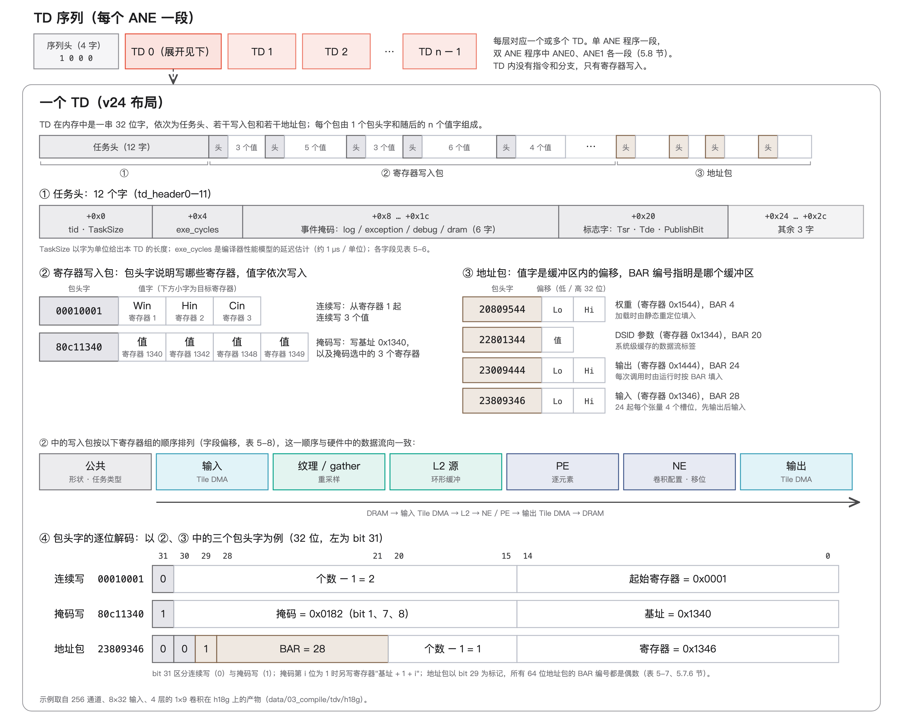

*图 5-2　TD 的结构（v24 布局）。最上为一个 ANE 的 TD 序列；其下展开一个 TD：①任务头，②按寄存器组排列的写入包，③末尾的地址包；写入包所属的寄存器组按数据流向排列；④以②、③中的三个包头字为例给出包头字的位格式。示例取自 256 通道、8×32 输入、4 层的 1×9 卷积在 h18g 上的产物。*

#### 5.7.1 任务头

编译器的断言字符串把任务头的 12 个字依次称为 `td_header0` 至 `td_header11`。我们反汇编了 v24 布局的字段读取函数（`ZinGetRegisterProgramming<24>`）和写入任务头的函数（`HandleTdHeader`、`SetEventFlags` 等），并与产物中的实际取值对照，得到了表 5-6 所列的字段含义〔编译器，HWX〕。

*表 5-6　TD 任务头（v24）*

| 偏移    | 字段                                        | 写入者                                     | 观测值与说明                                                                                                                               |
| ----- | ----------------------------------------- | --------------------------------------- | ------------------------------------------------------------------------------------------------------------------------------------ |
| +0x0  | `tid`（低 16 位）；`TaskSize`（bits 16–26，单位为字） | `SetField`                              | TD 编号与长度。例如 `0x006d0000` 表示 0 号 TD、长 109 字                                                                                           |
| +0x4  | `exe_cycles`（低 16 位）                      | `HandleTdHeader` → `CalculateExeCycles` | 编译器对该层延迟的估计，单位约 1 µs，上限 0xffff；输入从 L2 链式读入的层为 0                                                                                      |
| +0x8  | `log_events`                              | `SetEventFlags`                         | 第一个 TD 为 0x68，最后一个 TD 为 0x04000000，其余为 0                                                                                             |
| +0xc  | `exception`                               | —                                       | 0                                                                                                                                    |
| +0x10 | `debug_log_events`                        | `SetEventFlags`                         | 0x00fff800；第一个 TD 和最后一个 TD 的低位另有置位                                                                                                   |
| +0x14 | `debug_exception`                         | —                                       | 0                                                                                                                                    |
| +0x18 | `dram_log_events`                         | `SetEventFlags`                         | 0                                                                                                                                    |
| +0x1c | `dram_log_events`（第二个字）                   | `SetField`                              | 分段变化的掩码，如 0x1ff、0x1ff0                                                                                                               |
| +0x20 | 标志字                                       | `SetLdtid`、`SetPublishBit` 等            | bit 0 为 `Tsr`，bit 1 为 `Tde`，bit 3 只在最后一个 TD 置位，bit 4 为性能追踪使能，bit 5 为 `Xtde`，bit 6 为 `PublishBit`；bits 16–18 在卷积 TD 中为 5，在逐元素 TD 中为 0 |

在后续章节中，我们结合两个字段展开进一步的分析。第一个是 `exe_cycles` 字段。它由函数 `CalculateExeCycles` 写入，单位约为 1 µs：例如，256 通道、16×32 输入的 1×9 卷积每层三个 TD 的取值分别为 7、11 和 11，与三者的输出通道数 64、96 和 96 成正比；1×1 FP16 卷积 TD 的取值与按 20.6 TFLOPS 折算的时间一致。对稠密层，`exe_cycles` 与编译器性能模型的逐 TD 估计一致；对剪枝后的稀疏层则不一致，其算法本文没有查明（第 7.8 节）。第二个是三组事件掩码，它们决定固件在 TD 执行的哪些时刻记录哪些事件。由于第一个 TD 和最后一个 TD 的掩码与其余 TD 不同，我们能够在 kdebug 追踪中得到每次调用的任务开始和结束时间戳；第 6 章用它们分解调用时间，第 11 章用它们反推时钟频率〔编译器，HWX〕。

#### 5.7.2 写入包的编码

任务头之后的内容由三种包组成，其编码如表 5-7 所示〔HWX，编译器〕。

*表 5-7　TD 中的三种包*

| 类型  | 编码                                                                                                        | 示例                                                                                          |
| --- | --------------------------------------------------------------------------------------------------------- | ------------------------------------------------------------------------------------------- |
| 连续写 | bit 31 为 0；低 15 位为起始寄存器的字地址；bits 15–30 为写入个数减 1；包头之后紧跟相应个数的值                                              | `00010001`：从寄存器 1 起写入 3 个值（Win、Hin、Cin）；`000f1559`：从寄存器 0x1559 起写入 31 个值，其中包括 16 个 NE 的权重偏移 |
| 掩码写 | bit 31 为 1；低 15 位为基址；bits 15–30 为 16 位掩码；写入基址本身，以及掩码第 i 位为 1 时的寄存器"基址 + 1 + i"；包头之后紧跟 1 + popcount(掩码) 个值 | `80c11340`：基址 0x1340，掩码 0x182，写入 0x1340、0x1342、0x1348、0x1349 四个寄存器                          |
| 地址包 | 格式与连续写相同，另以 bit 29 为标记；bits 21–28 为 BAR 编号                                                                | 见第 5.7.6 节                                                                                  |

卷积 TD 中位于输入通道数之后的一个字就是掩码写包头。它的取值随模型变化：1×1、1×3 等多数卷积为 `0x91498005`，1×8 卷积和膨胀卷积为 `0x93498005`，W8A8 模式下的 3×3 卷积为 `0xb3498005`（样本：[xword_samples.txt](../data/03_compile/xword_samples.txt)）。按掩码写的格式解码，`0x91498005` 表示以寄存器 5（Wout）为基址、掩码为 0x2293，依次写入 Wout、Hout、Cout、卷积配置字、TileHeight、任务信息字和寄存器 19 共 7 个寄存器。由此可知，这个字并不是寄存器的值，而是序列化时根据哪些字段需要写入而生成的包头。不同模型之间的差别由此可以解释：W8A8 模式下需要多写一个寄存器（基址 + 15，即寄存器 20），掩码中就多出 bit 29 对应的一位；同一层被拆成多个 TD 时，寄存器 16 在某些 TD 中写入、在另一些 TD 中省略，掩码中 bit 25 对应的一位就随 TD 变化〔HWX，编译器〕。TD 的解析工具为 [tdpkt.py](../tools/lib/tdpkt.py)。

#### 5.7.3 寄存器分组与流水线

编译器为每一版 TD 布局定义一个类 `ZinAneTdHw_vN`，字段读取函数为 `ZinGetRegisterProgramming<N>::GetXxx`，每个函数从 TD 对象的某个偏移读取一个字并截取若干位。我们反汇编了全部读取函数，得到了各字段的偏移和位宽（汇总：[td_field_offsets.txt](../data/03_compile/td_field_offsets.txt)）。按偏移排列，各组字段的顺序如表 5-8 所示〔编译器〕。

*表 5-8　TD 中各组字段的顺序（按 v31 / v36 的对象偏移排列）*

| 顺序  | 字段组           | 代表性字段                                                                          |
| --- | ------------- | ------------------------------------------------------------------------------ |
| 1   | 任务头           | `TaskSize`、`Tsr`、`Tde`、`PublishBit`                                            |
| 2   | 公共：形状与任务类型    | Win、Hin、Cin、Din、Wout、Hout、Cout、Dout（各 17 位）；`NumGroups`；广播与转置；`CommonTaskType` |
| 3   | 输入 Tile DMA   | Src1 / Src2 的使能、`DoubleRate`、格式、交织、压缩、纵向裁剪偏移                                   |
| 4   | 纹理与 gather 单元 | `TextureMode`；gather 的索引维度；纹理源尺寸                                               |
| 5   | L2 源与环形缓冲     | Src1 / Src2 的 `Ephemeral` 与 L2 DMA `DoubleRate`；结果的 `Ephemeral`；环形缓冲配置         |
| 6   | PE            | `PEIndexingEnabled`                                                            |
| 7   | NE            | `NEAccBiasShift`（bit 11 起）；`NEPostRightShift`（bits 19–23）                      |
| 8   | 输出 Tile DMA   | 使能、格式、交织、压缩、纵向裁剪偏移                                                             |

这一顺序与数据在硬件中的流向一致：数据由输入 Tile DMA 从 DRAM 读入，经 L2 进入 NE 和 PE，再由输出 Tile DMA 写回 DRAM。它也与 Bryngelson [5] 根据 M1 寄存器分组得出的数据流（DRAM → L2 → NE → L2 → PE → DRAM）相符。NE 字段组中包含"累加器偏置移位"字段和一个 5 位的"输出右移"字段，这正是定点累加器所需要的配置：累加在定点格式中进行，输出时右移并转换为 FP16；第 8 章以构造的输入直接测得累加器为 Q15.16 定点格式，与这些字段相符。输入 Tile DMA 和 L2 DMA 的 `DoubleRate` 字段自 v24 起就已存在；参数表中的 `CanEnableDoubleRateMode` 开关（偏移 0x5f7）应当是启用该字段的条件，它在 H18 中为 0，在 M6 所用的 2026BaseLine 和 H19 中为 1。尽管如此，本文使用的 FP16 和 INT8 模型均未触发双倍速率模式〔编译器，HAL，推断〕。

#### 5.7.4 卷积配置字

卷积的几何参数集中编码在一个 32 位的配置字中（编译器对象偏移 0x2a0，寄存器 10）。我们反汇编了写入该字的 13 个函数（`ZinAneTd<31>::SetCommonConvCfg*` 等），得到了表 5-9 所列的位定义。三维卷积的参数另有一个配置字（偏移 0x2a4），其中 Kd 占 bits 0–4，Sz 占 bits 6–7，Pz 占 bits 8–11，Oz 占 bits 13–14〔编译器〕。

*表 5-9　卷积配置字的位定义*

| 位   | 0–5 | 6–11 | 12  | 13–14 | 15–16 | 17–21   | 22–26  | 27  | 28–29 | 30–31 |
| --- | --- | ---- | --- | ----- | ----- | ------- | ------ | --- | ----- | ----- |
| 字段  | Kw  | Kh   | 保留  | Sx    | Sy    | PadLeft | PadTop | 保留  | Ox    | Oy    |

例如，1×3 卷积的配置字为 `0x5002a043`，解码为 Kw = 3、Kh = 1、Sx = 1、Sy = 1、PadLeft = 1、Ox = 1、Oy = 1；3×3 卷积的配置字为 `0x5042a0c3`。在全部编译产物中，bit 12 和 bit 27 均为 0，写入该字的函数也不修改这两位，因此它们是保留位。Ox 和 Oy 表示每个输入步长产生的输出像素数；字段跟踪（第 5.7.8 节）显示，转置卷积和上采样的 Ox、Oy 为 2，即以普通卷积加"隔一个写一个"的交错输出实现〔编译器，HWX〕。核宽字段虽然有 6 位，但编译器以步长 1 直接编码的核宽最大为 8；核宽为 9–15 时，编译器把卷积改写为 Sx = 2、Ox = 2 的形式，把输出宽度字段设为实际宽度的一半，并把权重存为两套错开一个位置的卷积核；第 7.4.1 节比较了不同核宽的配置字和权重量，给出这一改写规则的完整依据（数据：[convcfg_scan.txt](../data/03_compile/convcfg_scan.txt)；工具：[convcfg.py](../tools/03_compile/convcfg.py)）〔编译器，HWX〕。

#### 5.7.5 逐元素运算的操作码

maderix [4] 报告 ALU 运算由一个操作码字节控制，共 256 种。为了在 M6 上确认操作码的编码，我们编译了"1×1 卷积后接一个双输入逐元素运算"的融合层，分别使用加、减、乘、取大和取小五种运算。五个产物的 TD 序列长度相同（0x294 字节），实质差别只在序列内偏移 0x240 处的一个字，如表 5-10 所示〔HWX〕。

*表 5-10　逐元素运算的编码*

| 运算      | 该字的值       | bits 2–3 | bit 18 |
| ------- | ---------- | -------- | ------ |
| add     | 0x00080000 | 0        | 0      |
| sub     | 0x000c0000 | 0        | 1      |
| mul     | 0x00080004 | 1        | 0      |
| maximum | 0x00080008 | 2        | 0      |
| minimum | 0x0008000c | 3        | 0      |

由表 5-10 可知，在这种融合层中，运算类型由一个 2 位字段编码（0 为加，1 为乘，2 为取大，3 为取小），减法通过加法加上第二个输入取反（bit 18）实现。除法（real_div）的 TD 序列更长（0x338 字节），推测被拆分为"倒数（查找表与区间归约）"和"乘法"两步。本实验只覆盖了这一种融合层，其他层类型可能使用更多的编码，因此本文的结果与 maderix 所说的 256 种操作码并不矛盾〔HWX，推断〕。

#### 5.7.6 地址包与 BAR

地址包位于每个 TD 的末尾，每个地址包把一个缓冲区内的偏移写入一个基址寄存器，并以 BAR 编号指明该偏移相对于哪一个缓冲区。我们统计了 1600 多个地址包，发现它们只写 5 组寄存器（工具：[hwxreloc.py](../tools/03_compile/hwxreloc.py)）。为了确定每组寄存器对应的缓冲区，我们构造了一个两输入、两输出的模型：o1 = relu(conv(x) + y)，o2 = relu(conv(y))（生成脚本：[io2.py](../tools/03_compile/io2.py)；产物：[l2hwx/io2](../data/03_compile/l2hwx/io2/)）。表 5-11 给出了分析结果〔HWX，编译器〕。

*表 5-11　地址包写入的寄存器及其 BAR 编号*

| 寄存器                  | 编译器中的字段名                       | BAR 编号 | 说明                                        |
| -------------------- | ------------------------------ | ------ | ----------------------------------------- |
| 0x1544 / 0x1545      | `KernelSrcBaseAddrLo / Hi`     | 4      | 权重；`__TEXT` 段中有指向 `__KERN_0` 的 8 字节静态重定位项 |
| 0x1346 / 0x1347      | Tile DMA `Src1BaseAddrLo / Hi` | 按张量分配  | 第一输入；io2 模型中 x 为 32                       |
| 0x134c / 0x134d      | Tile DMA `Src2BaseAddrLo / Hi` | 按张量分配  | 第二输入；io2 模型中 y 为 36                       |
| 0x1444 / 0x1445      | Tile DMA `DstBaseAddrLo / Hi`  | 按张量分配  | 输出；io2 模型中 o1 为 24，o2 为 28                |
| 0x1344、0x1345、0x1442 | Src1、Src2、Dst 的 DSID           | 20     | 系统级缓存的数据流标签                               |

由表 5-11 可以归纳出 BAR 的编号规则：4 号槽位为权重，20 号槽位为 DSID 参数；从 24 号起依次分配给各个张量，先输出、后输入，每个张量占 4 个槽位。所有 64 位地址包的编号都是偶数，这与编译器中的断言字符串"64-bit relocation, BarIdx must be even"一致。权重的基址在加载时通过静态重定位确定；输入和输出的基址没有重定位项，而是由运行时在每次调用时按 BAR 编号填入，`__RUNTIME` 段中的 `x`、`o1@output` 等映射项描述了这一对应关系。地址包中的值是缓冲区内的偏移，例如在双 ANE 程序中，ANE1 的输入地址包携带的偏移指向第 32 行（第 5.8.1 节）。h18（v20 布局）的产物中，同一寄存器使用不同的 BAR 编号（例如权重为 28），说明 BAR 的布局随版本变化〔HWX〕。

#### 5.7.7 布局版本

TD 的寄存器布局随架构变化。我们沿以下路径确定了各目标的布局版本：`ZinAneTd<N>` 的构造函数被内联到函数 `CodegenCreateInstructions<N>` 中；后者唯一的调用者 `arch_dispatch<CodegenCreateInstructionsDispatcher>` 以 `AneArchEnum − 1` 为索引查一张 36 项的跳转表，表中第 N 项跳转到 `CodegenCreateInstructions<N>`，由此可知模板参数 N 就是 `AneArchEnum` 的值；而 `AneArchEnum` 由函数 `ZinCpuSubtypeToArchValue` 从 HWX 的 CPU subtype 查表得到（工具：[adrref.c](../tools/re/adrref.c)、[jtab.c](../tools/re/jtab.c)、[tblread.c](../tools/re/tblread.c)）。表 5-12 列出了查表结果中与本文相关的部分〔编译器〕。

*表 5-12　CPU subtype 与 TD 布局版本的对应*

| CPU subtype | 布局版本        | 编译目标              |
| ----------- | ----------- | ----------------- |
| 4           | v7          | H13（M1）、T1        |
| 6           | v8          | H15               |
| 7           | v17         | H16 全系（M4 为 h16g） |
| 9           | v19         | H17 全系（M5 为 h17）  |
| 10          | v20         | h18               |
| 11          | v24         | h18g（M6）、h19      |
| 12、14、16    | v31、v36、v28 | 本版编译器中没有对外的目标名    |
| 17          | v26         | M12（编译器内部的目标名）    |

为验证表 5-12，我们把同一个模型（256 通道 1×9 卷积，8×32，4 层）编译到全部可用目标，并比较各目标写入的寄存器地址（数据：[data/03_compile/tdv/](../data/03_compile/tdv/)）。结果表明，寄存器布局的变化与版本号的变化一一对应：v17 / v19 相对于 v8 改变了 DMA 寄存器组；v20 相对于 v19 在 L2 相关的寄存器组中插入了两个寄存器；v24 相对于 v20 在第一个 NE 寄存器之后插入了一个寄存器（NE 组的写入地址由 0x1240、0x1241、0x1244 变为 0x1240、0x1242、0x1245）。h18g 与 h19 的 TD 序列几乎逐字相同（共 17948 字节，差别只在任务头的一个字段和一处 TD 末尾的命令字）。此外，形状字段、卷积配置字、TileHeight、TileOverlap 和任务信息字的位置与位定义在 v19、v20、v24 和 v31 中完全相同，因此第 5.7.4 节由 v31 函数得到的解码结果同样适用于 M6〔编译器，HWX〕。

表 5-12 中比 v24 编号更大的四个布局版本里，v26 对应编译器内部名为 M12 的目标（不应与 M 系列芯片混淆），其代际比较值与 v24 相同，更可能是同一代架构在另一条产品线上的变体；v28、v31 和 v36 才是比 M6 更新的架构，第 15.3 节讨论它们新增的字段〔编译器，推断〕。本文的查表结果与 Bryngelson [5] 有两处不一致。第一，Bryngelson 把 M1 的布局记为 v10，而本文的查表结果是 H13（M1）使用 v7；在本版编译器中，v10 属于目标 M11，其代际比较值与 H15 的 v8 相同。第二，Bryngelson 认为 M5 使用 v20 布局，而本文的查表结果是 H17（M5 一代）使用 v19、h18 使用 v20。两处差异可能都来自编译器版本的不同：布局版本号是编译器内部的模板参数，不同版本的编译器可能对同一架构采用不同的编号。由于缺乏对应版本的编译器和设备，本文在此没有进一步核实；第 15 章的比较表统一采用本文的查表结果，并注明文献中的记法。

#### 5.7.8 字段的动态跟踪

通过动态追踪字段函数的调用，我们可以进一步了解各字段实际的读取与赋值行为。为此，我们在 M4 上用同版本的编译器以 h18g 为目标编译一批小模型，并用 lldb 在 v24 布局的 TD 类 `ZinAneTd<24>` 的 403 个字段设置函数上设断点，记录每次调用的参数和调用者，以及调用前后 TD 对象中各寄存器的变化（第 3.2 节；工具：[tdtrace_gen.py](../tools/03_compile/tdtrace_gen.py)、[tdtrace_lldb.py](../tools/03_compile/tdtrace_lldb.py)、[tdtrace.sh](../tools/03_compile/tdtrace.sh)、[tdtrace_fit.py](../tools/03_compile/tdtrace_fit.py)）〔编译器〕。寄存器地址与对象偏移的对应关系取自 `ZinAneTdHw_v24::GetRegisterValueFromAddress` 的反汇编。第一批 35 个模型覆盖各种卷积核、步长、膨胀、分组、转置卷积、激活函数、归一化、稀疏与量化权重、矩阵乘、逐元素运算、池化、归约、softmax、拼接、转置、填充、上采样和双 ANE 程序：226 个设置函数共被调用 47508 次，由跟踪还原的寄存器值与 HWX 中的实际值有 89% 一致，不一致的集中在 TD 生成之后才由地址分配和重定位改写的地址类寄存器。我们再从反汇编中提取每个设置函数清零和置位的位（[tdstatic.py](../tools/re/tdstatic.py)），与跟踪结果和 HWX 的实际值按"寄存器 → 位段"合并（[tdmanual.py](../tools/03_compile/tdmanual.py)），得到 312 个位段：104 个随模型取值不同，86 个恒定，122 个在这批模型中没有出现。针对这 122 个位段，我们按字段名设计了第二批 32 个模型，并加上若干编译选项的变体，使没有出现的位段降至 79 个〔编译器，HWX〕。由于这份字段表是从编译器派生的，本文只给出字段名和取值规律，不随本文分发字段表本身。表 5-13 列出了与本文其他章节相关的字段。

*表 5-13　由动态跟踪确定的部分字段（v24 布局）*

| 寄存器与位             | 设置函数                                | 取值规律                                                                                          |
| ----------------- | ----------------------------------- | --------------------------------------------------------------------------------------------- |
| 0x000f，bits 4–7   | `SetCommonTaskType`                 | 任务类型：卷积 0，池化 1，拼接等数据搬运 2，逐元素加乘 3，归约（layernorm、reduce_mean）4–6                                 |
| 0x000f，bit 27     | `Set1DWinogradMode`                 | 在所跟踪的模型中，普通 3×3 和分组 3×3 卷积为 1（1×3 卷积的产物中同样为 1）；深度卷积、5×5、膨胀卷积、步长 2 卷积和剪枝后的 3×3 都为 0（第 7.4.3 节） |
| 0x0010，bits 0–2   | `SetNEOcgSize`                      | 输出通道组大小的 log₂（第 7.3.1 节）：深度卷积 0，分组卷积 1，W8A8 为 3                                               |
| 0x0010，bit 6      | `SetNEHalfWUMode`                   | 只在 W8A8 中为 1                                                                                  |
| 0x000a，bits 28–31 | `SetCommonConvCfgOx`、`Oy`           | 转置卷积、上采样为 2；核宽 9–15 的改写核 Ox = 2（第 7.4.1 节）                                                    |
| 0x0013，bits 21–28 | `SetNID`                            | 纯 PE 运算（逐元素、池化）为 0，其余为 1，推测表示是否使用 NE                                                          |
| 0x1240，bit 8      | `SetKernelSparseFmt`                | 剪枝权重，以及核宽 9–15 的改写核、膨胀卷积、步长 2 卷积和双线性上采样为 1（第 7.4.2 节）                                         |
| 0x1240，bit 16     | `SetKernelAlignmentFormat`          | 双输入矩阵乘和 softmax 为 1，即把一个激活张量当作权重送入 NE                                                         |
| 0x1240，bit 28     | `SetKernelDetectZeros`              | 零权重检测（第 7.5 节）                                                                                |
| 0x1242            | `SetNENonLinearMode`                | 无激活 0，ReLU 1，sigmoid、tanh、GELU 等都为 2（查表，第 8.5.1 节）                                            |
| 0x1242            | `SetNEBinaryPoint`、`SetNEPostScale` | 二进制小数点 FP16 为 −4、Int8 为 0；后缩放只在 Int8 中使用                                                      |
| 0x1340 起          | Tile DMA 源                          | 缓存提示默认 2，双 ANE 程序为 4；双 ANE 程序中 ANE1 的纵向裁剪偏移指向它负责的起始行                                          |
| 0x1540，bit 6      | `SetKernelDmaSrcEnable`             | 有权重时为 1；逐元素、池化、layernorm 为 0                                                                  |

第二批模型还揭示了几项本文其他章节没有涉及的硬件功能〔编译器，推断〕。gather 类运算（gather、沿轴 gather、embedding）会写入整组纹理字段（0x1372–0x137a，`TextureMode` = 1），即 ANE 的 gather 借用了纹理采样单元，这与第 15.3 节中 2026BaseLine 参数表新加的"加速纹理采样"开关对应。名为 RCAS 的一组字段（0x1246）只在 topk 中出现，结合编译器中 `rcas_kernel`、`ne_supports_rcas` 等字符串，推测是 NE 内部的比较与选择硬件。大尺寸的镜像（reflect）填充使用循环寻址字段（0x1059–0x105a）实现；3D 卷积使用深度维的形状字段和第 5.7.4 节所述的三维配置字，是原生支持的运算。编译选项 `ForcePerfTracerRegisters` 会为 L2、PE、NE、Tile DMA 源与目标和权重 DMA 写出 7 组性能跟踪配置，说明硬件具有分部件的性能计数器，但本文的约束之下无法读取它们（第 16.1 节）。

仍未出现的 79 个位段大多属于这版编译器在 h18g 上默认不使用的功能：激活压缩（约 30 个位段；编译选项 `EnableIntermediateCompression` 也没有使它们出现）、权重系数 DMA（约 12 个）、多调色板（5 个）、静态循环寻址与 L2、PE 的索引寻址（约 15 个），以及 `TileOverlap` 和随机舍入（`StochasticRound`）。也就是说，TD 布局中预留了这些功能的字段，但现有的编译器和 coremltools 模型都不会用到它们，这与第 15.3 节中"参数表打开的能力不一定被用上"的观察一致〔编译器，推断〕。

### 5.8 双 ANE 程序

本节关注双 ANE 程序的三个特性：两个 ANE 的 TD 序列与单 ANE 程序有何不同；需要交换数据时两个 ANE 如何共享数据与同步；编译器依据什么决定是否切分。本节只讨论编译器的决策；运行时如何在两套程序之间选择见第 6.3.2 节，切分实际带来的加速见第 10 章。

图 5-3 概括了本节的主要内容。

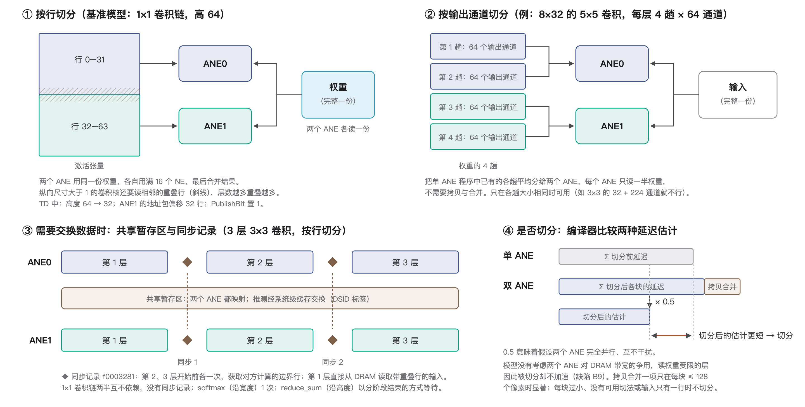

*图 5-3　双 ANE 程序的切分、同步与切分决策。① 按行切分：两个 ANE 各处理一半的行，各读一份完整的权重（第 5.8.1 节）；② 按输出通道切分：把单 ANE 程序中已有的各趟平均分给两个 ANE（第 5.8.3 节）；③ 需要交换数据时，两个 ANE 映射同一块共享暂存区，并在相应层之前插入同步记录（第 5.8.2 节）；④ 编译器比较切分前后的延迟估计决定是否切分，其中 × 0.5 假设两个 ANE 互不干扰（第 5.8.3 节）。*

#### 5.8.1 TD 层面的差异

对于基准模型，单 ANE 程序和双 ANE 程序中两个 ANE 的 TD 序列各有 3 个 TD，每段约 0x4ac 字节。逐字比较三段序列，可以得到表 5-14 所列的差异〔HWX〕。

*表 5-14　基准模型中单 ANE 与双 ANE 程序 TD 的差异*

| 位置                      | 单 ANE      | 双 ANE，ANE0 | 双 ANE，ANE1 | 解释                  |
| ----------------------- | ---------- | ---------- | ---------- | ------------------- |
| 各 TD 中的高度字段             | 64         | 32         | 32         | 输出高度减半              |
| 各 TD 中的数据量字段            | 0x82000    | 0x41000    | 0x41000    | 数据量减半               |
| 各 TD 中的计数字段             | 4 / 2 / 6  | 2 / 1 / 3  | 2 / 1 / 3  | 计数减半                |
| 输入地址包的偏移                | —          | —          | 32 行       | ANE1 从第 32 行开始读     |
| 输出地址包的偏移                | —          | —          | 32 行       | ANE1 从第 32 行开始写     |
| 标志字 bit 6（`PublishBit`） | 0          | 1          | 1          | 只在双 ANE 程序中置位       |
| 16 个 NE 配置字             | 0x00000021 | 0x00010021 | 0x00010021 | bit 16 在双 ANE 程序中置位 |
| `tid`                   | 从 0 起      | 从 0x70 起   | 从 0x75 起   | 两个 ANE 的 TD 编号互不重叠  |

由表 5-14 可知，对于这种逐点卷积链，双 ANE 程序把张量按高度切为上下两半：ANE0 计算第 0–31 行，ANE1 计算第 32–63 行，两者使用同一份权重，并且各自用满 16 个 NE。逐点卷积的每一行只依赖输入的同一行，两个 ANE 之间不需要交换数据，因此 TD 序列中没有跨 ANE 的同步记录〔HWX〕。

#### 5.8.2 共享暂存区与同步记录

为研究需要交换数据的情形，我们编译了四个用例：3 层 64 通道 1×1 卷积、3 层 64 通道 3×3 卷积、沿高度的 reduce_sum 和沿宽度的 softmax（生成脚本：[bonded_cases.py](../tools/lib/bonded_cases.py)；汇总工具：[hwx_bonded.py](../tools/lib/hwx_bonded.py)；产物：[hwx_cases/](../data/03_compile/hwx_cases/)）。除 1×1 卷积外，其余三个用例的双 ANE 过程都多出三类运行时操作：`rt_op_alloc_bss_for_ane16383_P_main__bonded` 分配一块暂存区，其中 16383（0x3fff）应为表示"所有 ANE"的掩码；`rt_op_map_shared_bss__ane0` 和 `__ane1` 把这块暂存区分别映射给两个 ANE；`rt_param_main__bonded_ane_{0,1}_hi_replaceable_dsid_usage_dsid_relocation` 为每个 ANE 提供一个 DSID 重定位参数。由于 DSID 是 SoC 的系统级缓存为数据流分配的标签，并且编译器中还有名为 `McacheHiBondedKernelReadDSID` 的符号，我们推断两个 ANE 之间的数据交换与系统级缓存有关〔HWX，推断〕；是否另有专用通道，以及 DSID 在交换中的具体作用，本文无法确定（第 16.2 节）。在沿高度归约的用例中，输入和输出只映射给 ANE0；ANE1 只映射共享暂存区和自己的 TD 序列，即 ANE1 计算一半的部分和并写入共享暂存区，由 ANE0 完成最终的合并。

在这些用例的 TD 序列中，我们统计了最高 4 位为 0xf 的字。`ffc01540` 出现在每个卷积 TD 的固定位置，属于 TD 的固定字段；`f0003211` 出现在每段序列的末尾，在单 ANE 和双 ANE 程序中都存在，应为阶段结束记录；`f0003281` 只出现在需要交换数据的双 ANE 序列中。表 5-15 列出了 `f0003281` 的出现次数〔HWX〕。

*表 5-15　跨 ANE 同步记录的出现次数*

| 用例             | 每个 ANE 中 `f0003281` 的个数 | 说明                                             |
| -------------- | ----------------------- | ---------------------------------------------- |
| 1×1 卷积，3 层     | 0                       | 两半互不依赖                                         |
| 3×3 卷积，3 层     | 2                       | 第 2、3 层开始前需要获取对方计算的边界行；第 1 层直接从 DRAM 读取带重叠行的输入 |
| softmax，沿宽度    | 1                       | —                                              |
| reduce_sum，沿高度 | 0                       | ANE0 有 3 个 `f0003211`，ANE1 有 1 个；以分阶段结束的方式等待   |

`f0003281` 的出现次数与两个 ANE 之间需要交换数据的次数一致。该记录前后的字具有固定的格式：`c0301440 010N00e1 00000400 00010000 f0003281`，其中 N 是同步点的序号，低字节 0xe1 标示跨 ANE 同步；普通结束记录的对应字低字节为 0x21。ANE1 的这两类记录之后都多出两个字 `00001457 00000020`，推测是 ANE1 通知 ANE0 时所用的信号量编号和计数。据此我们推断，`f0003281` 是跨 ANE 的同步记录，对应 maderix [4] 和 Bryngelson [5] 所称的 WAIT_EXT。由于我们没有执行经过修改的程序，这一结论仅基于该记录出现的位置和次数〔HWX，推断〕。

#### 5.8.3 切分的成本模型

在生成双 ANE 程序时，编译器需要对每段子图决定是切分到两个 ANE 上，还是全部留给 ANE0。负责这一决策的是空间切分步骤（`ZinMirSpatialSplitter` 与 `BondedSplitSubgraphIdentification`）：它首先找出可切分的子图，再用 `ClusterSplitCostModel::FindOptimalSplit` 评估候选的切分方式，最后用 `IsCurrentGraphMinLatencyInBonded` 比较切分前后的延迟。我们反汇编了后者及其调用的 `LatencyInfo::ComputeSplitLatencyBonded`，得到的判据如下：

```
切分后延迟 = (Σ 切分后各块的计算延迟 + Σ 拷贝与合并延迟) × 0.5
当且仅当 Σ 切分前延迟 > 切分后延迟，且不劣于进一步细分时，执行切分
```

式中三项都是按层存储的性能模型估计值，分别位于子图切分信息对象的偏移 0x150、0x168 和 0x1b0 处，求和时逐层累加。系数 0.5 意味着模型假设两个 ANE 完全并行、互不干扰；三项中没有任何一项考虑两个 ANE 对 DRAM 带宽的争用，也没有任何一项考虑两块的大小不等：判据只看各块延迟之和，而不看较大的一块〔编译器〕。

为了在实际产物上验证这一判据，我们利用 TD 头中的 `exe_cycles`（这些形状都是稠密层，`exe_cycles` 与性能模型的估计一致）。单 ANE 程序中各 TD 的 `exe_cycles` 之和等于"切分前延迟"；以 `EnableForcedMaximalBondedSplit` 选项强制切分时，双 ANE 程序中各 TD 的 `exe_cycles` 之和等于"切分后各块的计算延迟"；再结合是否实际发生了切分，即可反推出"拷贝与合并延迟"一项的取值范围。我们对 256 通道、高宽分别为 4×32、8×32 和 16×32、深度为 2–24 层的 288 种形状进行了这一分析（工具：[bsdecide.py](../tools/08_bonded/bsdecide.py)；数据：[bsdecide.txt](../data/08_bonded/bsdecide.txt)），主要结果如下〔编译器，HWX〕。

在 8×32、256 通道、卷积核为 1×2 至 1×8 的链上，切分与否存在一个清晰的阈值：单 ANE 程序的 `exe_cycles` 之和不超过 44 时不切分，达到 48 时切分。例如，1×4 卷积 4 层时该和为 24，不切分；8 层时为 48，切分。1×7 卷积 4 层时为 44，不切分；8 层时为 88，切分。由此反推，这类形状的拷贝与合并延迟介于 44 与 48 之间，约为 45。1×1 卷积链在 16 层时即被切分，尽管其 `exe_cycles` 之和只有 17；原因是 1×1 链中多数层从 L2 链式读入，其 `exe_cycles` 记为 0，总和严重低估了实际延迟。

进一步的实验表明，是否计入拷贝与合并延迟取决于切分后每一块的像素数（不超过 128 个像素时才计入），计入时其大小约与激活的字节数成正比，如表 5-16 所示（工具：[bs_split3.py](../tools/08_bonded/bs_split3.py)、[ioch.py](../tools/common/ioch.py)）〔编译器，HWX〕。

*表 5-16　反推的拷贝与合并延迟（1×4 卷积链）*

| 模型                   | 激活大小       | 切分后每块       | 每块像素数     | 拷贝与合并延迟           |
| -------------------- | ---------- | ----------- | --------- | ----------------- |
| 8×32，160–384 通道      | 80–192 KiB | 4×32        | 128       | 约 30–70，与通道数大致成正比 |
| 4×64，256 通道          | 128 KiB    | 2×64        | 128       | 34–46             |
| 8×33，256 通道          | 132 KiB    | 4×33        | 132       | 小于 6              |
| 9×32，256 通道          | 144 KiB    | 5×32 与 4×32 | 160 与 128 | 小于 8              |
| 8×64，128 通道          | 128 KiB    | 4×64        | 256       | 不超过 8             |
| 8×64 或 16×32，256 通道  | 256 KiB    | 4×64 或 8×32 | 256       | 小于 14             |
| 8×32，512 通道（按输出通道切分） | 256 KiB    | —           | —         | 约为 0              |

由表 5-16 可知，只有当切分后每一块都不超过 128 个像素时，模型才计入数值可观的拷贝与合并延迟，其大小约为每 KiB 激活 0.35 个单位；只要有一块超过 128 个像素，该项就接近于零，1–2 层的链即被切分。我们排除了以下几种解释：合并张量是否命中系统缓存（阈值为 16 MiB，远大于这些张量）、子图的输入与输出之和是否超过 HAL 中 256 KiB 的 L2 驻留阈值、激活是否不超过 128 KiB，以及每个 NE 的权重是否超过 64 KiB。

编译器采用两种切分方式。第一种是按行切分：整条卷积链被融合为若干"切块"，每个 ANE 在自己负责的若干行上执行全部层，最后合并结果；当张量的高度为 1 时，编译器改为沿宽度切分，例如 1×256 的张量被切为两个 1×128。按行切分的代价是，纵向尺寸大于 1 的卷积核需要读取相邻的重叠行（halo），层数越多，重叠越多；并且两个 ANE 各自读取一份完整的权重。例如，16×32 的 3×1 卷积链被切分后，每个 ANE 读取 9–10 行输入，输出 8–9 行。第二种是按输出通道切分：如果某一层在单 ANE 程序中已经因权重缓冲容量而拆分为若干趟，且各趟大小相同，编译器就把这些趟平均分给两个 ANE。例如，8×32 的 13×1 卷积在单 ANE 程序中每层分 2 趟、每趟 128 个通道，切分后每个 ANE 各执行 1 趟；5×5 卷积每层 4 趟、每趟 64 个通道，切分后每个 ANE 各执行 2 趟。这种方式不需要拷贝和合并〔HWX〕。

我们进一步反汇编了空间切分的流程，并在本文自己的编译进程中用 lldb 核对（第 3.2 节），得到了切分的具体规则〔编译器〕。只有"全局细化"路径会生成双 ANE 切分：`ZinMirSpatialSplitter::Tile` 在顶层选项 `GlobalRefinementInSpatialSplit` 打开（默认）时进入 `TileWithGlobalRefinement`，并且要求程序是双 ANE、HAL 参数表偏移 0x73c 置位（2026BaseLine 为 1）；关掉这一选项时，编译器只用单引擎的切块判据，不做任何双 ANE 切分，双 ANE 程序退化为全部在 ANE0 上执行（第 5.9 节）。

空间上的切分分为两个层次〔编译器，推断〕。中间张量需要按 L2 容量切块的子图（第 9.2.2 节），先得到一张 T 块的切块网格，再按块分给两个 ANE：子图中的层都没有指定引擎时，第 i 块分给编号为 (i ≥ T/2) 的 ANE，T/2 向下取整，因此块数为奇数时多出的一块必然分给 ANE1，这正是第 10.5 节中工作划分不均（缺陷 B8）的直接原因。其余子图由双 ANE 切分步骤沿一个维度恒切为 2 块，高度为 1 的张量沿宽度切，否则沿高度切。切点对齐到 256 字节，即 FP16 的 128 列（宽度太小时为 64 列）；第 0 块取宽度的一半，向上取整到 128 的倍数，若剩下的部分不足 128 列则改为向下取整，例如宽度 300 切为 128 与 172，375 切为 128 与 247，640 切为 384 与 256。

细化采用基于子图工作表的迭代方式：若当前整体切分方案已达到更优结果，则停止进一步细化；否则，按照候选切点将子图继续划分，并将新生成的子图重新加入工作表，直至工作表为空。此外，为限制编译时间，当切分增益低于 2%，且层数与块数之积超过预设阈值时，编译器会提前终止细化〔编译器，推断〕。值得注意的是，该判据并未显式考虑负载不均衡，因此即使切分带来的收益很小，编译器仍可能接受该方案。这一行为可以从 512 通道、高度为 1 的 16 层 1×1 卷积链中观察到。当输入宽度为 128 时，未切分与切分方案的估计延迟分别为 0.0550 ms 和 0.1022 ms，切分反而显著增加延迟，因此编译器选择保持单 ANE 执行；当宽度增至 256 时，两种方案的估计延迟分别为 0.10454 ms 和 0.10374 ms。尽管切分仅带来约 0.8% 的估计性能提升，编译器仍接受该方案，将计算划分至两个 ANE。由此可以解释第 10 章中的现象：宽度为 128 的模型仅使用单个 ANE，而宽度为 256 时则启用两个 ANE。

#### 5.8.4 不切分的情形

在 288 种形状中，不切分的情形都可以由上述判据解释。第一类是切分后每块过小：4×32 的所有形状都不切分，因为每个 ANE 只能分到 2 行，增益被拷贝与合并延迟抵消。第二类是没有可用的切分方式：8×32 的 1×9 至 1×15 卷积在单个 TD 内流式读入权重，不存在可以分配的"趟"，而按行切分又不会更快；3×3 和 9×1 卷积的两趟分别为 32 和 224 个通道，大小极不均匀，无法按通道切分，而按行切分又需要重叠行；11×1 卷积的两趟分别为 96 和 160 个通道，情况相同；3×1 至 7×1 卷积每个 NE 的权重不超过 64 KiB，只有一趟，按行切分同样需要重叠行。第三类是空间尺寸过小：空间像素很少的张量（例如 1×64 和 1×1）以及常量权重的矩阵乘（M = 1、K = N = 2048，和 M = 64、K = N = 1024），双 ANE 程序中都只有 ANE0 的 TD 序列。M = 1 的矩阵乘正是大语言模型解码阶段的典型形状，这意味着单个小批量的矩阵乘不会因为 M6 有两个 ANE 而变快〔HWX〕。决定是否切分的是张量的大小，而不是行数：512 通道、高度为 1 的 1×1 卷积链在宽度为 64 和 128 时不切分，宽度达到 256 时沿宽度切分；同样包含 4096 个像素的形状（1×4096、2×2048 直至 64×64）都被切分〔HWX〕。

上述成本模型也没有考虑两个 ANE 共享读权重的环节：按行切分时两个 ANE 各自读取一份完整的权重，模型却预期切分后延迟减半。第 10.4 节表明，在受读权重限制的层上，这样的切分不带来加速（缺陷 B9）。

### 5.9 编译代价

生成双 ANE 程序需要执行第 5.3 节所列的额外步骤。h18 与 h18g 属于同一代 ANE，二者在编译流程上的主要差别是是否生成双 ANE 程序，因此两者编译时间之差可以近似视为生成双 ANE 程序的代价；两者的硬件参数表虽然不同（第 5.4 节），但差别主要在能力开关和少数上限字段上。表 5-17 给出了三种模型在五个目标上的编译时间和产物大小（数据：[h7_compile_time.txt](../data/03_compile/h7_compile_time.txt)）〔计时〕。

*表 5-17　五个目标的编译时间*

| 模型                         | h16g   | h17s   | h18    | h18g   | h19    | 产物大小（h18 → h18g） |
| -------------------------- | ------ | ------ | ------ | ------ | ------ | ---------------- |
| 1×1 卷积链，64 通道，宽 1024，256 层 | 0.67 s | 0.68 s | 0.68 s | 1.19 s | 1.19 s | 160 KB → 352 KB  |
| 逐元素运算 64 步（128 个逐元素层）      | 0.09 s | 0.09 s | 0.09 s | 1.10 s | 1.10 s | 80 KB → 144 KB   |
| 两层 1×1 卷积，中间张量 16 MB       | 0.03 s | 0.03 s | 0.03 s | 0.05 s | 0.05 s | 176 KB → 224 KB  |

三个单引擎目标的编译时间相同，h18g 与 h19 的编译时间也相同，说明编译时间的增加只来自生成双 ANE 程序，与 ANE 的代际无关。为了确定编译时间随规模的变化规律，我们构造了逐元素运算链 y ← y·u + u，每步包含一个乘法和一个加法，改变步数 n 并分别编译为 h18 和 h18g，结果如表 5-18 所示；表 5-18 与表 5-17 来自不同轮次的测量，同一模型的用时相差在 0.03 s 以内〔计时〕。

*表 5-18　逐元素运算链的编译时间*

| 步数  | 逐元素层数 | h18    | h18g    | 比值  |
| --- | ----- | ------ | ------- | --- |
| 32  | 64    | 0.06 s | 0.18 s  | 3   |
| 64  | 128   | 0.10 s | 1.13 s  | 11  |
| 96  | 192   | 0.14 s | 4.57 s  | 33  |
| 128 | 256   | 0.18 s | 13.1 s  | 73  |
| 192 | 384   | 0.28 s | 61.3 s  | 219 |
| 256 | 512   | 0.39 s | 178.6 s | 458 |

单引擎版本的编译时间随步数线性增长，每步约 1.5 ms。h18g 的编译时间约与步数的 3.5–3.8 次方成正比：步数从 64 增至 128 时编译时间增加 11.6 倍，从 128 增至 256 时增加 13.6 倍。与之相比，卷积链的编译时间增长缓慢，256 层只比单引擎多 0.5 s。这说明是逐元素层触发了双 ANE 步骤中某个复杂度超线性的搜索过程〔计时，推断〕。图 5-4 以双对数坐标画出了这一差别。

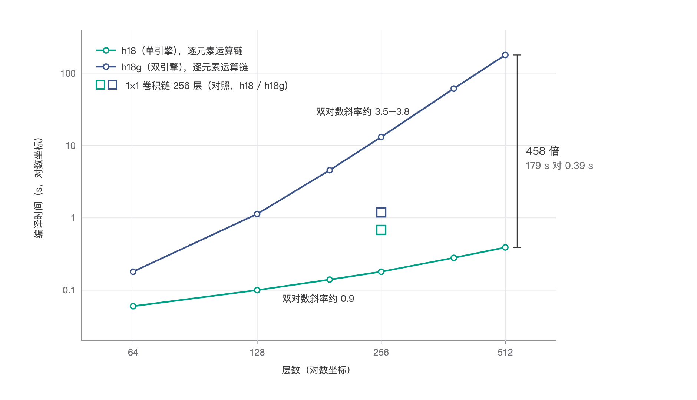

*图 5-4　编译时间随层数的变化（双对数坐标）。圆点为逐元素运算链 y ← y·u + u（每步两个逐元素层）分别编译为 h18（单引擎）与 h18g（双引擎）的用时，方块为 256 层 1×1 卷积链的对照。h18 的用时近似与层数成正比，h18g 则约与层数的 3.5–3.8 次方成正比，512 层时相差 458 倍；卷积链在 h18g 上只多约 0.5 s（数据：[h7_compile_time.txt](../data/03_compile/h7_compile_time.txt)）。*

通过 Core ML 首次加载模型时，编译还要再慢约 2.7 倍。我们用一个只计时 `MLModel` 加载过程的工具（[cmload.m](../tools/common/cmload.m)），配合编译服务的系统日志和 IOReport 中各 CPU 核的忙碌时间，比较了不同方式下 128 步逐元素运算链的编译用时，结果如表 5-19 所示（数据：[cm_load_vs_compile.txt](../data/03_compile/cm_load_vs_compile.txt)）〔计时，IOReport〕。

*表 5-19　不同方式下的编译用时（128 步逐元素运算链，h18g）*

| 方式                                                                       | 用时          | 编译运行的核                           |
| ------------------------------------------------------------------------ | ----------- | -------------------------------- |
| 进程内直接编译，默认优先级                                                            | 12.65 s     | 未记录（单线程，推断为 S 核）                 |
| 进程内直接编译，`taskpolicy -c utility`                                          | 12.66 s     | 未记录（推断为 S 核）                     |
| 进程内直接编译，`taskpolicy -b`（后台）                                              | 83.9 s      | E 核（低频）                          |
| Core ML 首次加载，客户端 QoS 为 default、utility、user-initiated 或 user-interactive | 33.7–34.3 s | E 核：6 个 E 核合计忙碌约 30 s，S 核约 0.2 s |
| Core ML 首次加载，客户端 QoS 为 background                                        | 98.8 s      | E 核（低频）                          |

编译服务的日志显示，Core ML 加载过程中只进行了一次编译，用时 34.05 s，加载的其余步骤合计不到 0.3 s。34.05 s 与 12.65 s 之比为 2.7，与 S 核和 E 核单线程性能之比相当，因此编译变慢的主要原因是编译服务运行在 E 核上，而不是编译选项不同〔计时，推断〕。其机制如下：守护进程 aned 的 launchd 配置为 `ProcessType = Adaptive`，空闲时处于后台优先级；编译服务（`ANECompilerService.xpc`）由 aned 派生并继承这一角色，编译时虽然被客户端请求提升了优先级（日志中 `clientQos=21 threadQos=21`），但线程仍被调度到 E 核上。编译服务的可执行文件中没有绑定 CPU 簇或主动降低优先级的代码，因此这是系统对守护进程派生的 XPC 服务所采用的调度策略；客户端调整 QoS 只能使编译更慢，而不能使其运行在 S 核上〔计时，推断〕。编译结果会被缓存，因此上述开销只发生在首次加载时。

实际模型的编译代价更为突出。我们以 WhisperKit 发布的 Whisper large-v3-turbo Core ML 包为例，用 [cmload.m](../tools/common/cmload.m) 在新的进程名下强制首次加载它的四个子模型（Core ML 与 aned 的编译缓存按进程名区分），同时每秒记录磁盘可用空间和编译服务的 CPU 占用（工具：[whisper_load.sh](../tools/03_compile/whisper_load.sh)、[whisper_tmp.sh](../tools/03_compile/whisper_tmp.sh)；数据：[whisper_compile/](../data/03_compile/whisper_compile/)）。在 M6 上，梅尔频谱（0.39 s）、上下文预填充（0.04 s）和 328 MB 的文本解码器（2.29 s）都很快编译完成，以同一进程名再次加载时编译结果可以复用（0.01–0.08 s）；1.2 GB 的音频编码器却在 438 s 时仍未编译完，磁盘占用已增加约 44 GB，我们因可用空间低于 15 GB 而中止了它。编译期间，以 root 身份运行的编译服务在 aned 的缓存目录中写入名为 `anecompiler.swap.*` 的交换文件，编译服务的 CPU 占用约为 200%。同一个编码器在 M4（h16g）上经 Core ML 首次加载只需 80 s，磁盘占用的峰值约为 1.3 GB，没有出现交换文件；两台机器都是 16 GB 内存〔计时〕。

为了排除 Core ML 的影响，我们在编译开始后从缓存目录中取出 Core ML 交给 ANE 编译器的模型（15849 个运算，其中 5120 个 einsum，WhisperKit 为适应 ANE 把注意力按头、按块拆开），再用 `anecc` 在自己的进程中直接编译（工具：[whisper_capture.sh](../tools/03_compile/whisper_capture.sh)、[whisper_anecc.sh](../tools/03_compile/whisper_anecc.sh)）。编译为 h16g 和单引擎的 h18 时都是 41 s、磁盘峰值 3.8 GB；编译为 h18g 时，`anecc` 在输出目录中写入同样的交换文件，约 220 s 后磁盘占用已达 44 GB，内存峰值却只有约 6 GB〔计时〕。我们又把模型截成前 N 个编码器层（[whisper_trunc.py](../tools/03_compile/whisper_trunc.py)），结果如表 5-20 所示。

*表 5-20　截成前 N 层的 Whisper 编码器的编译代价（`anecc`）*

| 编码器层数           | 1      | 2      | 4       | 8       | 16      |
| --------------- | ------ | ------ | ------- | ------- | ------- |
| h18g 用时         | 12 s   | 21 s   | 47 s    | 88 s    | 182 s   |
| h18g 磁盘峰值       | 2.7 GB | 4.7 GB | 10.0 GB | 19.4 GB | 39.0 GB |
| h18 用时（磁盘占用为 0） | 5 s    | 6 s    | 8 s     | 13 s    | 23 s    |

h18g 的磁盘占用与层数成正比，每层约 2.4 GB，约为该层权重（约 39 MB）的 60 倍；按此推算，完整的 32 层编码器约需 78 GB。经 Core ML 编译还要更慢：测评中经 Core ML 加载约 24 分钟，约为 `anecc` 推算用时（约 6 分钟）的 3–4 倍，大于上文测得的 2.7 倍〔计时，推断〕。16 层的模型最终编译完成，说明这是一个与层数成正比的资源问题，而不是死循环；编译过程中内存在 5–6 GB 封顶而磁盘持续增长，说明编译器有意把这部分数据放在文件中，而不是内存不足时由系统换出。

对 4 层模型的 h18g 编译进行调用栈采样，97% 的样本位于 `ZinMirSplitSpatially → ZinMirSpatialSplitter::TileWithGlobalRefinement → MirOpt::MergeConvolutions → MirOpt::CreateMergedNEConvLayer` 中〔编译器〕。为了查明交换文件中存放的是什么，我们在 M4 上用同版本的编译器以 h18g 为目标编译 1 层编码器：模型图取自 M6 上抓出的真实模型，权重则按 MIL 的存储格式生成假数据（真实权重只保存在 M6 上），所得 HWX 的大小（73,089,024 字节）和剩余磁盘空间的下降峰值（2725 MB）都与 M6 上的结果一致。我们再用 lldb 记录编译进程的文件创建、删除、扩容和内存映射调用及其调用栈（工具：[swaptrace_lldb.py](../tools/03_compile/swaptrace_lldb.py)、[whisper_fakeweights.py](../tools/03_compile/whisper_fakeweights.py)；数据：[swaptrace/](../data/03_compile/whisper_compile/swaptrace/)）〔编译器〕。

结果表明，该交换文件来自编译器的文件后备分配器 ZinIrFileBacking。编译开始后，编译器首先在输出目录中创建 anecompiler.swap.* 文件，随后立即删除其目录项，但仍保留已打开的文件句柄，并通过文件扩容与内存映射持续分配空间。该空间主要用于存放转换为 float32 的常量数据，因此 FP16 权重在转换后会占用约两倍的存储空间。该分配器仅支持空间分配，不提供对已分配区域的独立释放机制，因此后备文件在整个编译过程中持续增长：共发生 104 次扩容，文件大小从 8 MB 增至 2656 MB，直至编译结束后才统一释放。由于文件创建后其目录项即被删除，这部分空间占用不会显示在输出目录中，只能通过系统剩余磁盘空间的变化观察到〔编译器〕。在 2644 MB 的映射中，2372 MB 来自 `MirOpt::CreateMergedNEConvLayer`：一层编码器在全局细化中生成了 101 个合并卷积层，每个新建 3 块约 7.7 MB 的 float32 权重。大量卷积合并源于此前的权重分片：大卷积首先沿输出通道被拆分为多个权重分片，而在全局细化过程中，这些分片又被作为独立子图进一步切分。图结构改写后，同一空间块内会出现多个共享输入的小卷积，MergeConvolutions 随后将其重新合并为一个较大的卷积，并生成对应的拼接权重。这一过程造成了显著的权重数据膨胀：对于 1 层编码器，每套程序中合并后生成的权重约为 307 MB，而原始权重仅约 39 MB〔编译器，推断〕。相比之下，单引擎 h18 不经过全局细化，因此不会触发上述卷积合并，也不会产生相应的交换文件。

全局细化又是这个模型能被切分到两个 ANE 的必要步骤：把顶层编译选项 `GlobalRefinementInSpatialSplit` 设为 false 后，4 层模型的 h18g 编译回到 8 s、磁盘占用为 0，但编出的双 ANE 程序只剩 ANE0 的 TD 序列，即编译器放弃了切分，因此关掉它并不能解决问题〔HWX〕。即使在默认设置下，切分本身也不均衡：按编译器自己估计的 `exe_cycles` 之和，ANE1 是 ANE0 的 1.36–1.48 倍（1 层为 7074 对 4783，4 层为 20244 对 14875），比完全均分时的关键路径长 15–19%〔HWX〕。这是第 5.8.3 节的几条规则叠加的结果，而不是有意的分工：注意力部分每块宽 375，按 128 列对齐只能切成 128 与 247；宽 1500 的张量切成 3 块时，多出的一块分给 ANE1，变成 512 与 988。而编译器的成本模型并未显式考虑这种切分不均衡：一个注意力头组在单引擎执行时的估计增益为 −14%，但在双 ANE 切分评估中，该成本被简单乘以 0.5，因而仍被判定为具有切分收益〔编译器〕。

经 Core ML 加载时，还有两个周边问题把编译代价放大为整台机器不可用：结束加载进程并不会停止编译服务，交换文件会继续增长，只有以 root 结束 `ANECompilerService` 才会释放；编译器也不检查剩余的磁盘空间。测评中，编译服务把系统盘写到只剩 121 MB，系统随后清除了 ANE 的编译缓存，此后所有模型的下一次加载都要重新编译（第 14.4 节）。我们把全局细化的磁盘代价记为缺陷 A3，把编译服务在客户端退出后继续运行并写满磁盘记为缺陷 A4（附录 D）。

### 5.10 卷积链的编译深度上限

在本文测试的一种卷积链上，双 ANE 编译路径还会使编译器在层数较多时崩溃。我们沿用 maderix [4] 的设置，使用 64 通道、宽 1024 的 1×1 卷积链（每个张量 128 KiB，各层共享权重），改变层数后分别用 `ANECCompile` 编译为三个目标，结果如表 5-21 所示（数据：[h9_depth_compile.txt](../data/03_compile/h9_depth_compile.txt)；生成脚本：[chain.py](../tools/common/chain.py)）〔计时〕。

*表 5-21　不同深度下的编译结果*

| 层数              | h16g      | h18       | h18g               |
| --------------- | --------- | --------- | ------------------ |
| 384、386         | 成功，208 KB | 成功，208 KB | 成功，512 KB          |
| 387、388、400、512 | 成功        | 成功        | 崩溃，返回码 138（SIGBUS） |

崩溃报告显示，异常发生在线程栈的保护页上，即栈溢出。调用栈表明，`ZinIrOpLayerGraphScheduler::Schedule` 对网络的每一层递归一次，最终在 `ZinIrScheduleGraph::CompressAttentionBlockBranches` → `ZinIrParallelExecutionOpportunityFinder::FindIntraANEParallelism` → `FindAllAttentionBranchesInRegion` → `ZinIrNgraph::TopologicalSortImpl` 这一调用链中耗尽了线程栈。搜索并行注意力分支的这一步骤只在 h18g 上执行，因此 h16g 和 h18 编译到 512 层仍不会崩溃。由此可以确定，这一卷积链在 M6 上的 386 层上限源于编译器的递归实现，而不是硬件限制〔计时，编译器〕。这一上限并不是对所有图都成立的层数界限：第 5.9 节表 5-18 中含 512 个逐元素层的链在 h18g 上可以编译。崩溃发生在搜索并行注意力分支的步骤中，递归能走多深可能取决于图的结构和所走的编译路径，而不只是层数〔推断〕。

*表 5-22　经 Core ML 加载时的行为*

| 层数           | M6                                                    | M4                     |
| ------------ | ----------------------------------------------------- | ---------------------- |
| 64–386       | 在 ANE 上执行（两个 ANE 均有中断），每次调用 191–330 µs                | 383、384、386 层在 ANE 上执行 |
| 387、392      | 加载永久挂起：调用进程等待超过 11 分钟，CPU 占用为 0，编译服务空闲，既不报错也不退回 CPU   | 387 层在 ANE 上执行         |
| 388、400–1024 | 静默退回 CPU 执行（ANE 中断数为 0），每次调用 27–70 ms，比 ANE 慢 100 倍以上 | 388、400、448 层在 ANE 上执行 |

通过 Core ML 加载同一组模型时，系统的表现并不一致。表 5-22 比较了 M6 与 M4 在同一 macOS 版本下加载同一 `.mlmodelc` 的结果（数据：[d5_depth_run.txt](../data/04_schedule/d5_depth_run.txt)、[d5_depth_m4.txt](../data/04_schedule/d5_depth_m4.txt)）〔计时，IOReport〕。编译服务崩溃或被终止后，aned 会一直等待它的回复，此后所有进程的 ANE 模型加载都被阻塞，只有重启 aned 才能恢复。上述两个问题分别记为缺陷 A1 和 A2（附录 D）。

### 5.11 与 M4 的比较

表 5-23 比较了 M4 与 M6 的编译产物和编译行为。

*表 5-23　M4 与 M6 的编译产物和编译行为*

| 项目                           | M4（h16g）                                                       | M6（h18g）                                                                          |
| ---------------------------- | -------------------------------------------------------------- | --------------------------------------------------------------------------------- |
| HWX 结构                       | 一段 TD 序列与权重                                                    | 运行时操作图、三段 TD 序列与共用的权重                                                             |
| TD 布局版本                      | v17                                                            | v24                                                                               |
| 每 NE 的常驻权重上限                 | 64 KiB（HAL）                                                    | 64 KiB（HAL）；输入较大时每层 TD 数约为 ⌈每个 NE 的权重 ÷ 64 KiB⌉（个别形状多 1–2 个），输入较小时可在一个 TD 内连续读入权重 |
| 逐元素 512 层的编译时间               | 未测；表 5-17 中 h16g 与 h18 用时相同，推测与 h18 的 0.39 s 同量级               | 178.6 s                                                                           |
| 1×1 卷积链的编译深度上限（64 通道，宽 1024） | maderix [4]：383 个块可以执行，384 个块时编译服务断开连接；本文在 macOS 27 上：至少 448 层 | 386 层（编译器栈溢出）；512 个逐元素层的链可以编译                                                     |

maderix [4] 在较早的系统版本上报告 M4 在 384 个块时编译服务断开连接，可能是同类的编译器崩溃；在本文使用的 macOS 27 上，同一个模型在 M4 上至少可以达到 448 层，在 M6 上则在 387 层起因双 ANE 路径的递归过深而编译失败。

### 5.12 小结

本章回答了编译如何安排：哪些运算交给 ANE，ANE 程序是什么样子，以及两个引擎各做什么。Core ML 的分段器按固定代价为每个运算选择后端，一段 ANE 至少要省下 0.25–0.375 ms 才会被选中，据提前编译驱动推断 M6 沿用 M4 的代价模型。ANE 编译器为每个模型生成共用一份权重的单 ANE 和双 ANE 两套程序；程序由不含指令和分支的 TD 序列构成，每层的权重按输出通道均分给 16 个 NE，超出每 NE 64 KiB 时拆分为多个 TD 或在一个 TD 内连续读入。是否把子图切分到两个 ANE，由一个假设两个 ANE 互不干扰、也不考虑两块大小不等的延迟模型决定；切点按 128 列对齐，奇数块中多出的一块分给 ANE1；需要交换数据时，两个 ANE 通过共享暂存区和推断为跨 ANE 同步记录的专门字协作。编译代价方面，双 ANE 的编译路径带来了超线性的编译时间、387 层起的编译器崩溃和与层数成正比的磁盘占用（缺陷 B1、A1、A3）。

本章只确定了编译器的安排，留下的问题由后续章节回答：这些程序在运行时如何被选择和提交（第 6 章）；切分的成本模型忽略了共享资源和工作量不均，实际损失多少（第 10 章）。由本章结论导出的部署建议集中在第 15.2 节（表 15-1）。

## 6. 调度与执行

第 5 章说明了编译器生成的程序，以及编译器如何决定两个引擎各做什么；本章研究运行时 Espresso 如何提交、安排和完成请求，以及每次调用的开销。这些安排实际带来多少加速，留到第 10 章检验。我们结合三类数据：对 kernelcache 和 ANE 固件的只读分析给出调度的结构，kdebug 中的固件与驱动事件给出各阶段的时间戳，Core ML 计时与 IOReport 中断计数给出并发的行为。本章的主要结论有四点。第一，调度分为三层：主机内核中的 ANE 驱动负责优先级、引擎与程序变体的选择以及节流，ANE 固件负责按优先级排队并下发任务，时钟档位由主机内核中的 CLPC 决定。第二，同步调用时，每次调用在 ANE 任务之外约有 30 µs 的提交侧开销和 130–325 µs 的完成侧开销，后者取决于等待结果的 CPU 睡得多深，与程序的层数无关。第三，在所测程序中，互不依赖的支路之间没有重叠（整图计时无法区分这是编译器的安排还是硬件的限制），每层的固定开销不超过约 13 ns。第四，在单个请求内部，只要双 ANE 程序中有 ANE1 的工作，运行时就执行它；在多个请求之间，多个线程同步调用同一程序时请求被串行化，而不同程序、不同进程的请求以及同一程序的多个异步请求，都会被分配到两个 ANE 上。

### 6.1 方法

本章使用四种方法分析程序的调度与执行。

第一种是 kdebug 事件。macOS 内核的 kdebug 追踪设施中，类 0x06、子类 0x1b 的事件由 ANE 驱动和固件产生。我们在以 root 身份启动的追踪会话中只记录这一子类的事件（脚本：[d1b_ktrace.sh](../tools/04_schedule/d1b_ktrace.sh)、[sw_ktrace.sh](../tools/07_memory/sw_ktrace.sh)）。通过与调用时序对照，我们确定了表 6-1 所列事件的含义。事件名称是本文根据其出现的时刻和参数给出的，Apple 没有公开这些事件的定义〔kdebug，推断〕。

*表 6-1　本章使用的 kdebug 事件（类 0x06，子类 0x1b）*

| 事件 ID     | 含义       | 说明                                                   |
| --------- | -------- | ---------------------------------------------------- |
| `61b01a9` | 驱动收到提交   | 每次调用一次                                               |
| `61b0125` | ANE 任务开始 | 单 ANE 程序在部分实验中缺失（见下文）；CPU 列为 36 表示 ANE0，为 33 表示 ANE1 |
| `61b0126` | ANE 任务结束 | 单 ANE 与双 ANE 程序中都出现                                  |
| `61b00b8` | 固件发出消息   | 其次数与中断次数相同                                           |
| `61b0020` | 中断处理     | —                                                    |
| `61b00a0` | 完成标记     | 取第一个参数为 1 的事件                                        |
| `61b0170` | 驱动完成处理结束 | —                                                    |
| `61b0024` | 用户线程返回   | Core ML 的同步调用返回                                      |

在部分实验中，单 ANE 程序的任务开始事件没有被记录或大量缺失，原因尚未查明（第 11、12 章的实验中这一事件是齐全的）；为了统一口径，对单 ANE 程序我们把一次调用拆分为"提交到任务结束"和"任务结束到下次提交"两段，前一段包含提交延迟和任务本身。

第二种是 IOReport 的中断计数。IOReport 的 `Interrupt Statistics` 组为两个 ANE 各提供一个子组（`ane` 与 `ane1`），其中的一级中断处理计数可以在不需要 root 的情况下读取。我们用它判断请求被分配到哪个 ANE，以及模型是否确实在 ANE 上执行（工具：[bondrun.m](../tools/common/bondrun.m)、[mtrun.m](../tools/common/mtrun.m)）〔IOReport〕。本文通过一组对照实验对 ANE 中断计数器进行校准。首先，在 0.5 s 的空闲窗口内，两个 ANE 的中断计数均为 0。对于编译后仅在 ANE0 上包含一段 TD 序列的双 ANE 程序（如 1×64 的 1×1 卷积），每次模型调用对应 ANE0 约 3.8 次中断，而 ANE1 始终为 0；对于在两个 ANE 上均包含 TD 序列的程序，两侧中断计数基本一致，每次调用约为 2–3.5 次。作为进一步对照，当 Core ML 将模型完全置于 CPU 上执行时（如常量权重、M = 1 的矩阵乘），两个 ANE 的中断计数均保持为 0。上述结果表明，该计数器能够有效反映两个 ANE 的实际活动，可用于判断模型执行过程中各 ANE 是否参与计算〔IOReport〕。原始数据见 bond_calib_run.txt。由此可见，这一计数器能够可靠地区分两个 ANE。IOReport 的计数是全系统的，因此在多进程实验中，各进程读到的是所有进程合计的中断数。

第三种是 Core ML 计时。所有模型都通过 Core ML 的公开接口执行，计算单元设为 `CPUAndNeuralEngine`。每个模型先连续调用至少 1 s 进行预热，然后连续调用 500–1000 次，取中位数或第 10 百分位数；每个点至少测量两轮〔计时〕。

第四种是静态分析。我们从 M6 的系统文件中提取了 kernelcache 和 ANE 固件映像，其中固件是 RTKit 格式的 Mach-O 文件。分析主要依据其中的文本字符串，包括驱动和固件的日志格式串与断言信息；对于需要确认数据结构或判断条件的地方，再对相关函数进行反汇编（工具：[kcdis.py](../tools/re/kcdis.py)、[fwref.py](../tools/re/fwref.py)、[fwfunc.py](../tools/re/fwfunc.py)）。固件与 kernelcache 属于 Apple 的二进制文件，不随仓库分发〔固件，内核〕。

### 6.2 软件栈与三层调度结构

一次 Core ML 推理在主机侧依次经过 Core ML、Core ML 的运行时框架 Espresso、AppleNeuralEngine 框架和内核中的 ANE 驱动。Espresso 中的 E5 模块在加载时为每个运算选择后端并切段（第 5.2 节），推理时按切好的执行计划依次调用各段，ANE 段经 AppleNeuralEngine 框架提交。模型的编译与加载经由守护进程 aned 及其派生的编译服务完成（第 5 章），E5 的编译结果缓存在以进程名区分的目录中，因此以新的进程名加载同一模型会重新编译（第 5.9 节）；maderix [4] 在 M4 上观察到，执行请求不经过 aned，而是由客户端进程直接提交给内核驱动。驱动通过邮箱（mailbox）把请求交给 ANE 内的固件，固件再把任务下发给硬件。表 6-1 中的事件正好覆盖了这条路径上的各个节点。

根据对 kernelcache 和固件的分析，M6 的调度可以分为三层，如表 6-2 所示〔内核，固件〕。

*表 6-2　M6 ANE 的三层调度结构*

| 层     | 组件                                                                                             | 职责                                                                        |
| ----- | ---------------------------------------------------------------------------------------------- | ------------------------------------------------------------------------- |
| 主机内核  | ANE 驱动（`H11ANEInUserClient`，驱动包 `AppleH16ANEInterface`）                                        | 优先级映射；选择引擎（ANE0 或 ANE1）与程序变体（双 ANE 或单 ANE）；处理请求间的依赖；执行节流；控制电源；向 CLPC 报告工作 |
| 主机内核  | CLPC（`AppleCLPC` 中的 `ane_job_tracking`、`ane_perf_sampler`、`ane_forced_idle_limiter` 等模块）       | 决定 ANE 的时钟档位和节流比例                                                         |
| ANE 内 | 固件（源码路径 `sne/aneEngine/exeLoop`、`sne/drivers/tm`、`itq`、`PowerControlService`、`CLoadMonitor` 等） | 按优先级排队；把请求下发到硬件任务队列；动态电源门控；上报固件处理器自身的负载                                   |

这一结构与 Bryngelson [5] 对早期产品的描述基本一致，但有一点重要的区别：M6 的 IORegistry 中并不存在 Bryngelson 所描述的多引擎仲裁组件 `AppleANELoadBalancer`，引擎的选择由 ANE 驱动自身完成（第 6.3 节）。下面依次讨论驱动和固件两层；CLPC 的行为在第 12 章专门讨论。

### 6.3 驱动：优先级、引擎选择与节流

ANE 驱动处于客户端与两个计算引擎之间，是连接上层请求与底层执行资源的中间层，因此能够掌握所有待执行请求及两个引擎的运行状态。一个请求进入驱动之后，驱动负责决定如下几个问题：该请求应当以什么优先级执行；它应当交给哪一个引擎、执行哪一个程序变体；在执行过程中，它是否需要因为功耗、温度或固件负载而受到限制。此外，驱动还负责把每个请求的执行情况报告给 CLPC，作为调频的依据。本节按照这一顺序分析驱动的机制。本节的证据主要是驱动中的函数名、日志格式串和断言，它们能够说明驱动有哪些机制、各机制考虑哪些因素，但通常不能给出具体的权重和阈值。

#### 6.3.1 优先级的确定

每个请求携带一个逻辑优先级和一个 QoS 值，驱动的日志格式 `programHandle … priority: %u, qos: %u` 记录了这两个值。逻辑优先级是面向客户端的抽象，而固件中仅维护了其自身的 6 级优先级体系（第 6.4 节），因此驱动首先要通过 `applyFirmwarePriorityMapping` 把逻辑优先级映射为固件优先级。映射表随 SoC 而不同：如果某个逻辑优先级在当前 SoC 上没有对应的固件优先级，驱动会记录 `Logical priority %u has no firmware mapping for this SoC`，并把请求截断到可用的最高一级。在 M6 上，最高的固件优先级 `kANEFirmwareProgramPriority0` 被标注为固件尚未支持，使用这一级的请求会退回到较低的一级。较高的优先级并不对所有客户端开放：实时优先级和系统保留优先级分别需要授权 `com.apple.ane.realtime-priority-client` 和 `com.apple.ane.allow-system-reserved-priorities`，普通应用通过 Core ML 提交的请求不具备这些授权〔内核〕。

严格按优先级调度可能使低优先级请求长期得不到执行，因此驱动同时实现了防饥饿机制。驱动为低优先级请求设置一个饥饿阈值（日志 `Low-priority starvation threshold set to %u ms`）；当低优先级请求的等待时间超过该阈值时，函数 `shouldYieldToLowerPriorityRequest` 会让高优先级请求暂时让位。为了支持这一判断，驱动按优先级分别统计已提交请求的个数和执行时间〔内核〕。

#### 6.3.2 请求的放置：依赖、引擎与程序变体

确定优先级之后，驱动需要进一步决定请求何时可以下发以及由哪个引擎执行。其中，请求之间的依赖关系首先决定了后续请求的下发时机。驱动支持两种依赖（fence）方式：在 `LocalFast` 方式下，后一个请求可以在前一个请求仍在执行时就提交给固件；在 `LocalStrict`  方式下，后一个请求在驱动中挂起，直到前一个请求完成后才提交〔内核〕。

其次是引擎的选择。驱动的函数 `SelectBestANECore` 在每次放置请求时为每个引擎计算一个综合分，并选择得分最好的引擎。其日志列出了参与计算的六个分项，如表 6-3 所示〔内核〕。

*表 6-3　驱动选择引擎时使用的分项*

| 分项           | 含义                                      | 所属因素  |
| ------------ | --------------------------------------- | ----- |
| `WRK`        | 该引擎上已排队的工作量                             | 负载    |
| `HOL`        | 该优先级在该引擎上的队头阻塞比例（由 `holRatio` 归一化并加权得到） | 负载    |
| `CLPC`       | CLPC 推荐的可用簇（`allowedClusters`）          | 功耗管理  |
| `THROT`      | 该引擎当前被节流的百分比                            | 功耗管理  |
| `PWR`        | 该引擎是否已上电                                | 功耗管理  |
| `clientPref` | 客户端对 ANE0 或 ANE1 的偏好提示                  | 客户端意愿 |

这六个分项可以归为三类因素。`WRK` 和 `HOL` 反映引擎的负载，倾向于把请求放到较空闲的引擎上；`CLPC`、`THROT` 和 `PWR` 反映功耗管理的状态，倾向于使用 CLPC 允许的、未被节流且已经上电的引擎，从名称看意在避免不必要地唤醒另一个引擎（但第 12.5 节观察到，只用一个 ANE 时另一个也会被短暂上电）〔推断〕；`clientPref` 则允许客户端表达偏好。客户端只能提供偏好，最终的选择由驱动综合负载和功耗状态作出。

选定引擎之后，驱动通过 `ANEProcedureVariantSelector` 从编译产物中选择执行双 ANE 程序还是单 ANE 程序（第 5.5 节）。如果客户端要求只使用一个指定的 ANE，而程序没有单 ANE 变体，驱动会报告 `requires program to have single-ANE variant`〔内核〕。由此推测，M6 的编译产物中同时保留单 ANE 程序，用途之一是在请求被限定于单个引擎时仍有程序可用〔推断〕。

运行时 Espresso 对两套程序的实际选择情况，可通过第 6.1 节所述的中断计数进行验证。在全部测试的模型中，凡是双 ANE 程序包含 ANE1 序列的，执行时两个 ANE 都产生了相同数量的中断；凡是双 ANE 程序只有 ANE0 序列的，执行时 ANE1 的中断数为 0〔HWX，IOReport〕。由此可以得出结论：在单个请求内部，只要双 ANE 程序中确实存在 ANE1 的工作，Core ML 运行时就执行双 ANE 程序，一次请求同时用上两个 ANE；否则，每个请求只在一个 ANE 上执行，同步调用时总是 ANE0。因此，一个模型能否在单个请求内用上两个 ANE，取决于编译器的切分决策（第 5.8.3 节、第 5.8.4 节）。多个请求之间如何分配是另一层机制，见下文与第 6.7 节。

上述机制可以解释第 6.7 节的并发实验。两个进程同时提交单 ANE 模型的请求时，ANE0 上已有排队的工作，`WRK` 与 `HOL` 两项应当使驱动把另一个进程的请求放到 ANE1 上，这与两个引擎并行工作的观测相符〔推断〕。同一进程内多个线程同步调用同一程序时，请求始终在 ANE0 上依次执行，这一串行化的位置见第 6.7.2 节。

#### 6.3.3 执行过程中的限制

请求放置之后，驱动还可能因为两类原因限制它的执行。

第一类是功耗或温度引起的节流。节流的比例由 CLPC 决定，由驱动执行：驱动先向 CLPC 查询当前的节流百分比，查询结果带有缓存和过期时间；然后把这一百分比换算为占空比窗口，其日志格式为 `Duty cycle windows calculated: throttle=%d%% active=%ums inactive=%ums period=%llums`。在每个周期内，驱动允许 ANE 工作 active 毫秒，然后停止下发 inactive 毫秒；停止与恢复由脉冲计时器 `ANEHWThrottlePulseTimer` 控制，并配合一个自适应预算，预算耗尽时驱动记录 `budget exhausted … setting inactive` 并进入停止阶段〔内核〕。因此，M6 上的 ANE 节流有两种手段：一是由 CLPC 降低时钟档位，二是由驱动按占空比让 ANE 间歇停顿。在本文的实验中，连续 5 分钟满载没有触发任何节流（第 12.6 节的持续负载测试中，调用耗时的变化不到 0.3%，IOReport 中各类降频事件的计数都为 0），所以我们没有观察到占空比节流的实际效果。

第二类是固件处理器的负载。ANE 固件运行在一个通用处理器上，如果主机下发命令过快，这个处理器本身可能成为瓶颈。固件通过 `CLoadMonitor` 模块向驱动报告该处理器的 CPU 负载，驱动据此运行 `ANECPULoadThrottler`：负载高于高水位时，驱动暂停高优先级通道的下发；负载处于中等水平时，驱动把并发下发的请求数限制为 1；负载较低时不加限制〔内核，固件〕。这一机制的作用是防止固件处理器在短时间内接收到过量的任务，与 NE 的时钟档位无关。

#### 6.3.4 与 CLPC 的交互

CLPC 通过两类信息感知 ANE 的运行负载：一是驱动报告的每个作业的起止，二是 CLPC 自己的 `ane_perf_sampler` 模块对 ANE 性能计数器和降频计数的采样。驱动在启动时注册为 CLPC 的性能控制客户端（日志 `Registering with PerfControl with %u tokens`；注册失败时记录 `running without CLPC`）。此后，驱动对每个请求依次调用 `submitWorkToPerfController`、`workBeginForThrottling` 和 `notifyPerfController`，分别报告工作的提交、开始和结束；对于已知即将到来的工作，驱动还可以通过 `notifyPerfControllerOfFutureWork` 提前预告〔内核〕。CLPC 的 `ane_job_tracking` 模块跟踪这些作业，并据此估计 ANE 的利用率、选择时钟档位（第 12 章）。

客户端也可以通过驱动向 CLPC 传递信息。驱动接受会话开始、结束和中止的提示（`kANEClientHintTypeSessionStart`、`Stop`、`Abort`），以及把负载标记为节能负载的提示（`ANEClientEnergyEfficientWorkload`）；客户端还可以设置引擎空闲后的断电计时器，传入 0 则禁用该计时器（日志 `Client passed 0 … disabling sleep timer`）〔内核〕。从名称推测，会话提示用于让 CLPC 提前为一段连续的推理调整档位，节能提示用于让 CLPC 选择较低的档位，但本文没有通过实验验证这些提示的效果〔推断〕。我们没有在 Core ML 的公开接口中找到与这些提示对应的设置，普通应用能否使用它们尚不清楚。

综上所述，驱动在请求的整个生命周期中都处于决策位置：它决定请求的优先级、执行的引擎和程序变体，执行节流，并向 CLPC 提供调频所需的负载信息。使用者能够直接影响的主要是请求的提交方式，例如同步还是异步、使用一个进程还是多个进程；驱动所支持的各种提示，在 Core ML 层面没有找到对应的接口。

### 6.4 固件：队列、槽位与抢占

ANE 固件运行在每个 ANE 附带的 RTKit 协处理器上。固件中的断言表明，固件优先级共 6 级（`fwPriority < 6`）；作业队列共 8 个，另有 1 个队列专供图像信号处理器使用的 ANE 网络（AFPP），断言写作 `foundQueue == 8 + 1`〔固件〕。

固件维护一张按队列编号索引的调度信息表（`scheduleInfo[queueId]`），按优先级找到可用的队列和槽位后，把请求放入硬件任务队列（task queue，TQ）。每个 TQ 有两个槽位（`reqRunning[index][0/1]`，日志 `check HW slot … [0]=%d, [1]=%d`）：一个槽位中的请求正在执行，另一个槽位中可以预先放入下一个请求。这相当于固件层面的双缓冲，使两个请求在硬件上可以首尾相接〔固件〕。然而，第 6.5 节将表明，在 Core ML 的同步调用方式下，下一个请求总是在前一个请求返回之后才提交，这一双缓冲实际上没有被利用。

固件支持在不同优先级的请求之间切换。相关的字符串包括 `Clear switched out req`、`should not have switched out request when ANE is idle` 和 `Pending deprioritize commands present for dsid`；硬件任务管理器的驱动类名为 `CSneTMDrvH18g`。驱动会向固件下发"上下文切换延迟阈值"（`CSNE_CMD_ANE_DEFAULT_SETTING_SET for setting Ctx Switch Latency Threshold`），内核还维护一个上下文切换延迟的直方图。据此推断，高优先级请求到来时，固件可以在 TD 边界把正在执行的低优先级请求换下〔固件，内核，推断〕。此外，固件中有一条低延迟的直通路径，其断言为 `Direct path should be executed when everything is idle`，即只在引擎完全空闲时使用〔固件〕。

固件不选择 NE 的时钟档位。我们在固件中只找到了 RTKit 通用的电源状态投票接口（`_getPowerStateVote`），它用于 ANE 自身各电源域的开关；一个由驱动写入的 `PerfMode` 属性；以及一个把延迟要求换算为档位编号的查表函数（失败时输出 `Latency to P State Translation Failed`），其表格在运行时填充，我们没有发现它与 NE 时钟相连。固件中也没有 NE 的频率表〔固件〕。结合第 6.3 节的驱动分析和第 12 章的实测，我们没有发现固件参与选档的证据，NE 的时钟档位应当由主机侧的 CLPC 决定〔推断〕。

### 6.5 单次调用的时间分解

#### 6.5.1 总体构成

我们首先用 kdebug 测量了三个模型在连续调用时的 ANE 任务时长和任务以外的时间，结果如表 6-4 所示（工具：[d1_trace.sh](../tools/04_schedule/d1_trace.sh)；数据：[d1_out/](../data/04_schedule/d1_out/)）〔kdebug〕。

*表 6-4　每次调用的时间构成*

| 模型                              | 每次调用    | ANE 任务时长        | 任务以外   | 任务以外所占比例 |
| ------------------------------- | ------- | --------------- | ------ | -------- |
| 1×1 卷积，512 通道，1×128，16 层，单 ANE  | 218 µs  | 58 µs           | 160 µs | 73%      |
| 同上，384 层，单 ANE                  | 1605 µs | 1269 µs         | 336 µs | 21%      |
| 1×1 卷积，512 通道，1×256，384 层，双 ANE | 1676 µs | 1310 µs（两个引擎同时） | 367 µs | 22%      |

ANE 任务时长随层数的斜率为每层 3.29 µs，与第 10 章用计时斜率法得到的边际成本（3.26 µs）一致，说明斜率法测得的正是 ANE 的执行时间。对于小模型，任务以外的时间占每次调用的大部分；双 ANE 程序的任务以外时间比单 ANE 程序多约 30 µs，推测是两个引擎之间的启动和同步开销。每次调用产生 2–3.8 次中断，具体次数随主机 CPU 的空闲深度和模型而变（第 6.5.3 节）；表中两个 384 层模型的每个引擎各产生 2 次〔kdebug，IOReport〕。

表 6-4 中任务以外的时间从 160 µs 增加到 336 µs。这一增加可能与层数有关，也可能与任务时长有关；为了区分两者，我们设计了一组对照实验。

#### 6.5.2 层数与任务时长的分离

我们构造了两组单 ANE 的 1×1 卷积链（宽 128，各层共享权重）。A 组为 512 通道、16–384 层；B 组为 1024 通道、4–96 层，每层的计算量是 A 组的 4 倍。因此，两组模型的任务时长范围相同，而相同任务时长下的层数相差 4 倍。如果存在每层的固定开销，A 组在相同计算量下应当比 B 组慢；如果开销只与任务时长有关，两组应当一致。表 6-5 给出了测量结果（工具：[d1b_ktrace.sh](../tools/04_schedule/d1b_ktrace.sh)、[d1b_stages.py](../tools/04_schedule/d1b_stages.py)；数据：[d1b_kt/](../data/04_schedule/d1b_kt/)、[d1b_stages.txt](../data/04_schedule/d1b_stages.txt)）〔kdebug〕。

*表 6-5　两组模型的调用时间分解（单位：µs；A 组 / B 组；各列分别取中位数，两部分之和与"每次调用"可能相差数微秒）*

| 计算量         | 模型               | 每次调用        | 提交 → 任务结束       | 任务结束 → 下次提交 | 其中驱动完成处理  | 其中用户线程返回  |
| ----------- | ---------------- | ----------- | --------------- | ----------- | --------- | --------- |
| 1.07 GFLOP  | A 16 层 / B 4 层   | 227 / 212   | 80.2 / 80.9     | 147 / 131   | 21 / 21   | 81 / 64   |
| 2.15 GFLOP  | A 32 层 / B 8 层   | 263 / 268   | 134.6 / 136.4   | 128 / 129   | 32 / 32   | 51 / 50   |
| 4.29 GFLOP  | A 64 层 / B 16 层  | 371 / 422   | 243.7 / 252.3   | 127 / 167   | 32 / 33   | 47 / 88   |
| 6.44 GFLOP  | A 96 层 / B 24 层  | 503 / 550   | 351.2 / 361.3   | 153 / 183   | 41 / 55   | 60 / 81   |
| 8.59 GFLOP  | A 128 层 / B 32 层 | 710 / 752   | 448.4 / 472.2   | 255 / 278   | 88 / 92   | 111 / 134 |
| 12.88 GFLOP | A 192 层 / B 48 层 | 992 / 1012  | 664.4 / 692.8   | 326 / 317   | 109 / 108 | 156 / 155 |
| 17.18 GFLOP | A 256 层 / B 64 层 | 1200 / 1233 | 869.1 / 912.6   | 325 / 320   | 109 / 109 | 156 / 155 |
| 25.77 GFLOP | A 384 层 / B 96 层 | 1618 / 1676 | 1292.8 / 1358.2 | 324 / 318   | 106 / 105 | 157 / 154 |

表 6-5 支持以下三点结论。

第一，ANE 一侧没有可测的每层固定开销（上界见第 6.6.2 节）。"提交 → 任务结束"一段与计算量呈严格的线性关系：A 组为 30.8 µs + 49.0 µs/GFLOP（折合 20.4 TFLOPS），B 组为 27.5 µs + 51.6 µs/GFLOP（折合 19.4 TFLOPS），残差均在 ±5 µs 以内。

第二，任务结束之后的开销随任务时长变化，与层数无关，并且存在饱和。任务时长不超过约 350 µs 时，这部分开销约为 127–183 µs（B 组的 16 层和 24 层偏高）；任务时长继续增加时，开销随之上升；任务时长达到约 660 µs 以上时，开销稳定在约 320 µs。在相同的任务时长下，A 组与 B 组的开销几乎相同：A 组的 192、256、384 层均约为 325 µs，B 组的 48、64、96 层均约为 318 µs（图 6-2）。

第三，增长全部发生在主机侧。我们把"任务结束 → 下次提交"进一步拆分为表 6-6 所列的六个阶段。

*表 6-6　任务结束之后的阶段（A 组，单位：µs）*

| 阶段     | 起止事件            | 16 层 | 64 层 | 128 层 | 384 层 |
| ------ | --------------- | ---- | ---- | ----- | ----- |
| 固件发出消息 | `0126` → `00b8` | 7.4  | 18.5 | 20.5  | 19.9  |
| 中断处理   | `00b8` → `0020` | 22.3 | 15.0 | 14.2  | 17.6  |
| 完成标记   | `0020` → `00a0` | 7.5  | 4.9  | 7.5   | 11.4  |
| 驱动完成处理 | `00a0` → `0170` | 20.9 | 32.4 | 87.8  | 105.5 |
| 用户线程返回 | `0170` → `0024` | 81.2 | 46.5 | 111.3 | 157.0 |
| 下次提交   | `0024` → `01a9` | 7.0  | 6.8  | 7.7   | 7.8   |

固件发出消息、中断处理和完成标记三段合计约 35–50 µs，基本不随任务时长变化；驱动完成处理从约 21–32 µs 增加到约 106 µs，用户线程返回从约 50 µs 增加到约 157 µs。这两段都是主机 CPU 上执行的代码，我们推测它们的变慢是因为等待结果的 CPU 在任务执行期间进入了更深的空闲状态，唤醒所需的时间更长〔推断〕；下一小节讨论这一情况。

#### 6.5.3 主机 CPU 空闲深度的影响

为验证上述解释，我们在后台运行 12 个优先级为 nice 20 的空转进程，使 CPU 无法进入深度空闲，然后重复测量 A 组的 16、96 和 384 层模型。在这一条件下，384 层模型任务结束之后的开销从 324 µs 降至 215 µs，其中驱动完成处理从 106 µs 降至 41 µs；用户线程返回只从 157 µs 降至 126 µs，这是因为空转进程与测试线程争抢 CPU。对于任务时长在阈值以下的 16 层和 96 层模型，开销本来就处于浅空闲的水平，空转进程不能使它进一步下降，96 层模型的用户线程返回反而从 60 µs 增至 108 µs，同样是争抢 CPU 的结果（图 6-2；数据：[d1b_stages.txt](../data/04_schedule/d1b_stages.txt)）〔kdebug〕。另一组实验得到了一致的结果：对于任务时长约 370 µs、略高于阈值的模型，空转进程从 0 个增加到 12 个时，每次调用的第 10 百分位耗时从 580 µs 降至 519 µs，每次调用的中断数从 2.0 次回到 3.2 次，即回到了浅空闲状态的特征（数据：[sw_spinner.txt](../data/07_memory/sw_spinner.txt)）〔计时，IOReport〕。

在接近阈值的任务时长下，CPU 的空闲状态并不确定。CPU 空闲调度器根据最近几次空闲的长短预测下一次空闲的长度，并据此选择睡眠深度；当任务时长接近约 350 µs 时，两种选择会来回翻转，因此同一个模型在不同轮次的测量中可能分别落在快、慢两种状态。例如，任务时长约 355 µs 的模型每次调用平均产生 2.4–2.6 次中断，介于浅空闲状态（3 次）与深空闲状态（2 次）之间，说明它的调用在两种状态之间混合；任务时长约 343 µs 和约 370 µs 的模型则分别稳定在 3 次和 2 次（数据：[sw_ktrace_sum.txt](../data/07_memory/sw_ktrace_sum.txt)）〔kdebug，IOReport，推断〕。因此，在任务时长接近约 350 µs 的区间，计时斜率会混入主机侧的状态切换（第 9.3.2 节）。

综合以上结果，同步调用方式下的单次调用时间可以写为：

```
每次调用 ≈ 30 µs（提交侧）+ ANE 任务时长 + 130–325 µs（完成侧，任务时长在约 350–660 µs 之间增加时随之增大）
```

这一开销对 ANE 的利用率有直接影响。以第 12 章所用的模型（单次任务约 1.27 ms）连续同步调用时，相邻两个 ANE 任务之间的空闲间隙中位数为 384 µs，这一数值随任务时长而变化（数据：[gov_kt/](../data/10_clpc/gov_kt/)），并且在任何一个任务结束之前，下一个请求都没有被提交〔kdebug〕。这意味着固件的双槽位任务队列在同步调用方式下从未被填满，ANE 在两次调用之间必然空闲，忙碌比例的上限约为 77%；这一空闲如何影响时钟档位，见第 12.2 节。图 6-1 给出了一次同步调用的时间线。

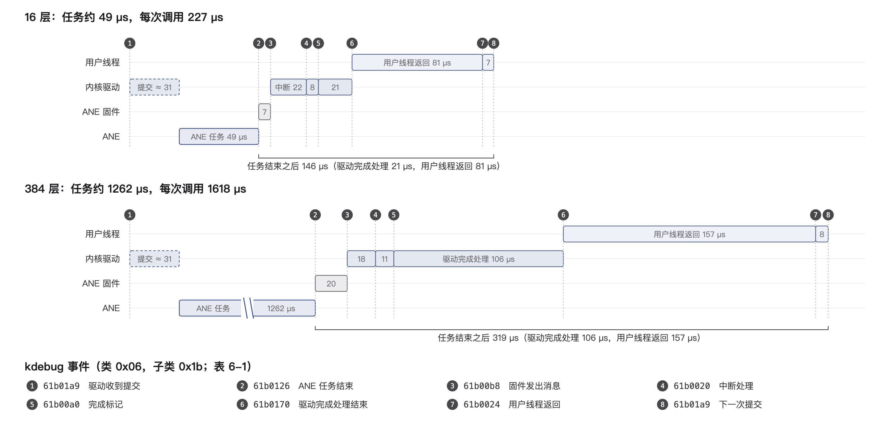

*图 6-1　一次同步调用的时间线（单 ANE，1×1 卷积，512 通道，1×128；数据：[d1b_stages.txt](../data/04_schedule/d1b_stages.txt)）。上为 16 层，下为 384 层；圆圈编号为 kdebug 事件，横向长度按时间比例绘制（384 层的任务段截断）；提交段按"提交到任务结束"对任务时长的线性拟合截距绘出（虚线框，约 31 µs）。任务结束之后的开销从 146 µs 增至 319 µs，增长集中在驱动完成处理和用户线程返回两段，即主机侧。*

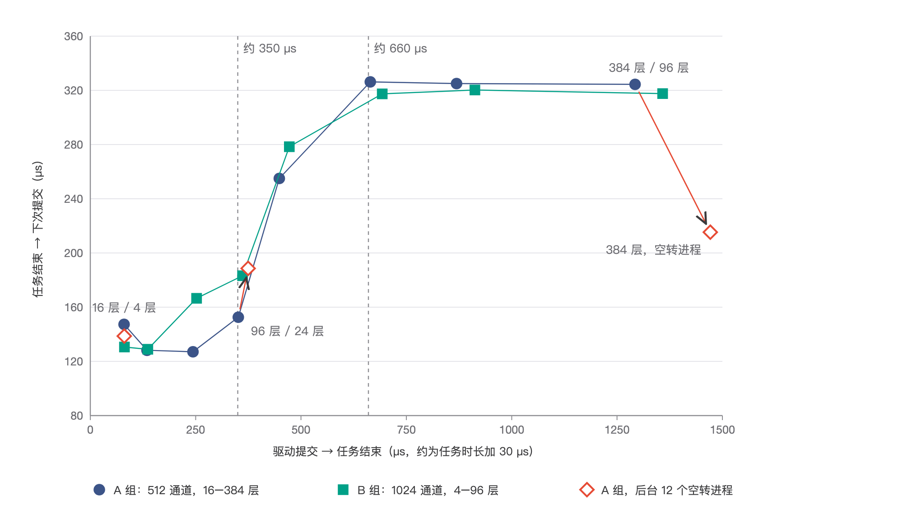

*图 6-2　任务结束之后的主机开销与任务时长（各点为中位数）。横轴为驱动提交到任务结束的时间，约为任务时长加约 30 µs 的提交侧开销；纵轴为任务结束到下次提交的时间。A 组为 512 通道、16–384 层，B 组为 1024 通道、4–96 层，计算量相同的一对模型层数相差 4 倍，标注给出几对的层数。两组的开销都随任务时长变化，在约 350 µs 以上开始上升、约 660 µs 以上稳定在约 320 µs，与层数无关。空心菱形为后台运行 12 个空转进程、阻止 CPU 进入深度空闲时的 A 组：384 层的开销从 324 µs 降至 215 µs；16 层与 96 层本来处于浅空闲，空转进程不能使开销下降，96 层反而因争抢 CPU 而略有增加（数据：[d1b_stages.txt](../data/04_schedule/d1b_stages.txt)）。*

### 6.6 程序内部的执行顺序

#### 6.6.1 独立支路的执行顺序

为了检验互不依赖的工作在一个程序中能否并行执行，我们在同一个模型中放置两条互不依赖的支路，并与每条支路单独执行的耗时比较。除 D 外，各支路张量的形状均为 [1, 512, 1, 128]。支路共四种：A 为 1×1 卷积链，主要占用乘加阵列；B 为逐元素运算链 y ← y·u + u，主要占用 PE；T 为双线性上采样 2 倍后再平均池化，推测占用重采样单元；D 为对 32 MB 输入的一次转置，几乎不含计算，主要占用 DMA（模型生成：[overlap.py](../tools/04_schedule/overlap.py)、[texprobe.py](../tools/04_schedule/texprobe.py)）。每次调用约有 150 µs 的固定开销，因此两条支路完全串行时的预测耗时为 X + Y − 150 µs，完全重叠时的预测耗时为 max(X, Y)。表 6-7 给出了两轮测量的结果，每轮每个模型调用 500 次（数据：[d3_overlap_run.txt](../data/04_schedule/d3_overlap_run.txt)、[d3_overlap_run2.txt](../data/04_schedule/d3_overlap_run2.txt)）〔计时〕。

*表 6-7　两条独立支路并列时的耗时（单位：µs，第 10 百分位）*

| 组合                  | 支路 X 单独 | 支路 Y 单独 | 完全重叠的预测 | 完全串行的预测 | 实测        |
| ------------------- | ------- | ------- | ------- | ------- | --------- |
| 乘加 + PE（A64 + B64）  | 374     | 224     | 374     | 448     | 486–490   |
| 乘加 + 重采样（A64 + T64） | 374     | 305     | 374     | 529     | 542–583   |
| DMA + PE（转置 + B64）  | 1167    | 224     | 1167    | 1241    | 1277–1341 |
| DMA + 乘加（转置 + A64）  | 1167    | 374     | 1167    | 1391    | 1387–1391 |

在所有组合中，实测耗时都等于或略高于完全串行的预测，没有一组接近完全重叠的预测；DMA + 乘加一组与串行预测的差别在 4 µs 以内。部分组合比串行预测更慢，可能是因为并列结构多出了一个需要写回的输出，或者并列后编译器改变了双 ANE 的切分方式（B64 和 T64 单独执行时使用两个 ANE，组合后只使用一个）。作为对照，把 A64 的输出接给 B64 构成真正串行的结构时，实测为 455–456 µs，与完全串行的预测一致。

我们还检验了 Bryngelson [5] 根据编译器推测的"乘加阵列与 PE 可以同时运行"的情形，即 softmax 与卷积并行。由于单独的 softmax 链会被 Core ML 放到 CPU 上执行，我们以"卷积链的输出接给 softmax"的串行结构为基线。两轮测量中，并列结构与串行结构的第 10 百分位耗时分别为 446.0 µs 和 445.6 µs，完全相同（数据：[group1_run.txt](../data/04_schedule/group1_run.txt)）〔计时〕。在本文测试的结构中，没有观察到这种同时并行。

上述结果的解释需要区分实验能够直接支持的结论与无法进一步确定的机制。它们直接说明的是所测试程序的执行方式：在这些程序中，两条独立支路的耗时等于各自耗时之和，彼此没有重叠。造成这一结果的可能有两个层次。一是编译器的调度：每个 ANE 的程序是一条线性的 TD 序列（第 5.7 节），编译器把两条支路排进同一条序列时，就已经决定了它们的先后，而本文没有找到让编译器生成并列 TD 的选项。二是硬件的能力：即使 TD 序列中两个相邻的 TD 互不依赖，硬件也可能只能逐个执行。整图计时无法区分这两种情形，因此本节的实验不能确定硬件同一时刻只能执行一个 TD，也不能排除其他程序结构或其他编译方式下存在跨 TD 的并行；固件的双槽位任务队列（第 6.4 节）只说明一个请求执行时可以预先放入下一个请求，是请求之间首尾相接的机制，同样不能说明程序内部的 TD 能否并行〔推断〕。

可以确定的是，在本文测试的所有程序中，同一程序内没有观察到跨 TD 的重叠，而可以观察到的重叠都发生在单个 TD 内部的流水线上：卷积、偏置加和 relu 被融合为一个硬件层；读取权重的 DMA 与计算重叠（依据见第 7.4.2 节：4×32 上的 3×3 卷积每层都要重新读入权重，读权重速率达到 148–150 GB/s，同时乘加效率仍约 90%，若二者串行，效率应只有一半左右）；长链按块融合，中间结果不写回 DRAM。这一结果与 maderix [4] 在 M4 上的测量一致，后者发现独立支路只节省约 1.1% 的时间；两者都是整图计时，因而有相同的局限。

#### 6.6.2 每层的固定开销

为了估计每执行一个 TD 的固定开销，我们构造了计算量可以忽略的卷积链：1×1 卷积、32 通道、空间尺寸 1×32、各层共享权重，每层的计算量为 65.5 KFLOP，按单 ANE 约 21 TFLOPS 计算只需约 3 ns。表 6-8 给出了不同层数下的每次调用耗时（数据：[d6_tiny.txt](../data/04_schedule/d6_tiny.txt)）〔计时，IOReport〕。64 层的模型被 Core ML 放到 CPU 上执行（ANE0 中断数为 0），因此没有列出。

*表 6-8　计算量可忽略的卷积链的耗时*

| 层数  | 每次调用中位数（两轮）      | ANE0 中断（次/调用） |
| --- | ---------------- | ------------- |
| 128 | 163.6 / 164.1 µs | 1.93          |
| 256 | 166.0 / 166.4 µs | —             |
| 384 | 167.5 / 167.5 µs | 2.01          |

从 128 层到 384 层，每次调用只增加 3.4 µs，即每层的边际耗时约为 13 ns，其中计算本身约 3 ns 或更多（32 个输出通道无法用满 16 个 NE）。按满载时钟 2.58 GHz 换算，每层的固定开销不超过约 34 个周期，与 Bryngelson [5] 从 M1 编译器成本模型中读出的 44 个周期处于同一量级。由于这类模型的 ANE 大部分时间处于空闲，时钟可能不在最高档，因此以时间表示的上限（约 13 ns）比以周期表示的上限更可靠。

### 6.7 并发

#### 6.7.1 多进程

实验选用一个仅在 ANE0 上执行的模型：该模型由 384 层 1×1 卷积组成，输入尺寸为 1×128、通道数为 512，各层共享权重；其编译生成的双 ANE 程序中也仅包含 ANE0 的 TD 序列。随后，在两个独立进程中同时调用该模型，结果如表 6-9 所示（数据：[d2_concurrency.txt](../data/04_schedule/d2_concurrency.txt)）〔计时，IOReport〕。

*表 6-9　两个进程同时调用单 ANE 模型*

| 情况                         | 每次调用中位数        | ANE0 中断（次/调用） | ANE1 中断（次/调用） |
| -------------------------- | -------------- | ------------- | ------------- |
| 单个进程                       | 1598 µs        | 2.00          | 0             |
| 两个进程，同一个模型文件               | 1795 / 1799 µs | 约 2.84        | 约 2.83        |
| 两个进程，两份模型文件                | 1796 / 1799 µs | 约 2.84        | 约 2.84        |
| 两个进程，两个不同的模型（384 层与 256 层） | 1825 / 1388 µs | 有             | 有             |

单独执行时，该模型的请求全部由 ANE0 处理，ANE1 的中断数为 0；两个进程同时执行时，ANE1 出现了与 ANE0 同样多的中断，而每次调用只慢约 12%。两个进程的合计吞吐约为单个进程的 1.78 倍（2 × 1598 / 1797）。这说明驱动把来自不同进程的请求分配到了两个引擎上并行执行。这一模型的权重常驻片上，读权重受限的模型上能得到多少增益，见第 10.7 节。每次调用慢 12% 的具体开销比例，即主机侧开销、DRAM 争用或固件开销各占多少，本文没有分解。

#### 6.7.2 同一进程内的多线程

我们进一步在同一进程内用多个线程同时调用，每个线程可以共用一个 `MLModel` 对象，也可以各自加载一份。所有线程先各自预热 1 s，然后同时开始，连续调用 5 s。使用的模型有三个：A 为上述单 ANE 模型（384 层，单独执行 1619 µs）；C 为同一结构的 256 层模型（单 ANE，1195 µs）；B 为宽 256、384 层的模型，其双 ANE 程序使用两个 ANE（1691 µs）。结果如表 6-10 所示，每种情况测两轮，两轮之差小于 0.5%（工具：[mtrun.m](../tools/common/mtrun.m)；数据：[h15_mt.txt](../data/04_schedule/h15_mt.txt)、[h15_mt2.txt](../data/04_schedule/h15_mt2.txt)）〔计时，IOReport〕。

*表 6-10　同一进程内的并发*

| 情况             | 合计吞吐（次/s）       | 每次调用中位数        | ANE1 中断   |
| -------------- | --------------- | -------------- | --------- |
| A，1 个线程        | 616             | 1619 µs        | 0         |
| A，2 个线程，共用一个对象 | 616             | 3237 µs        | 0         |
| A，2 个线程，各自一个对象 | 617             | 3237 µs        | 0         |
| A，4 个线程，各自一个对象 | 617             | 6476 µs        | 0         |
| B，1 个线程        | 587             | 1691 µs        | 与 ANE0 相同 |
| B，2 个线程        | 587             | 3390 µs        | 与 ANE0 相同 |
| A 与 C，各 1 个线程  | 1249（541 + 708） | 1823 / 1371 µs | 与 ANE0 相当 |
| B 与 A，各 1 个线程  | 762（381 + 381）  | 2626 / 2626 µs | 多于 ANE0   |
| 对照：两个进程各运行 A   | 1117（2 × 558）   | 1781 µs        | 与 ANE0 相同 |

表 6-10 表明，在同一进程内，多个线程同步调用同一个编译后的程序时，同一时刻只执行一个请求。无论增加线程数，还是让每个线程各自加载一份 `MLModel` 对象，合计吞吐都保持不变，每次调用的耗时按线程数成倍增加，全部请求都在 ANE0 上执行，各线程完成的调用数相差不到 1 次。与之相对，同一进程内的两个不同程序（A 与 C）可以并行执行，合计吞吐为两者单独执行时（616 + 843 次/s）的 86%，每次调用各慢约 13%，与多进程实验中的 12% 一致。不同进程中的同一个模型也可以并行执行，合计吞吐为单进程的 1.81 倍。

由此看来，多个线程同步调用同一个程序时，请求被串行化了。不过，第 10.7 节的实验表明，同一进程对同一个 `MLModel` 对象的异步调用（`predictionFromFeatures:completionHandler:`）在保持 2 个以上请求在途时会被分配到两个引擎上并行执行。因此，串行化并不是驱动对"同一程序"的限制，而是发生在同步调用的路径上，具体位置本文没有查明〔推断〕。这一行为记为缺陷 B3（附录 D）。

双 ANE 模型与单 ANE 模型混合执行时（B 与 A），合计吞吐为 762 次/s，比两者单独执行时（587 和 616 次/s）高约 25–30%，并且 ANE1 的中断数多于 ANE0。这说明单 ANE 模型的部分请求被分配到了 ANE1 上，推测填补了双 ANE 程序两个 ANE 工作量不对称所留下的空闲，以及任务之间的固件开销〔计时，IOReport，推断〕。

### 6.8 与 M4 及其他产品的比较

表 6-11 把本章的结果与文献中其他产品的数据进行比较。

*表 6-11　调度开销与并发行为的比较*

| 项目        | M1（Bryngelson [5]）      | M4（maderix [2–4]）                            | M5 Pro（ANEForge [6]） | M6（本文）                                                                                                  |
| --------- | ----------------------- | -------------------------------------------- | -------------------- | ------------------------------------------------------------------------------------------------------- |
| 每次调用的固定开销 | 约 190 µs，其中固件往返约 130 µs | 约 90 µs（Part 4）；95 µs（Part 2）；160 µs（Part 3） | 下限约 70 µs            | 提交侧约 30 µs，完成侧 130–325 µs                                                                               |
| 每层固定开销    | 44 个周期（编译器成本模型）         | —                                            | —                    | 不超过约 13 ns（约 34 个周期）                                                                                    |
| 独立支路的重叠   | —                       | 约节省 1.1%                                     | —                    | 所测程序中无重叠                                                                                                |
| 两个请求同时提交  | 1.04 倍                  | 节省约 16%                                      | 只暴露一条硬件通道            | 多线程同步调用同一程序：1.00 倍；两个进程：1.78–1.81 倍（相对单进程）；同一进程的两个不同程序：两者单独运行之和的 86%；同一程序异步调用：最高 2.8 倍（相对同步调用，第 10.7 节） |

各产品的每次调用开销在数量级上一致，都在约 0.07–0.36 ms 之间。各研究对开销的定义和测量方式不同，因此这些数值不宜直接比较大小：maderix 直接调用私有接口并以主机时间计时，Bryngelson 给出的是各阶段的分解，本文则以固件时间戳把开销分为提交部分和完成部分，并发现完成部分的开销取决于主机 CPU 的空闲深度。在并发方面，M6 与单引擎产品的根本区别在于：只要同时有多个请求在途，驱动就可以把它们分配到第二个 ANE 上（由此得到的吞吐随负载而异，见第 10.7 节）；这既适用于不同程序或不同进程的请求，也适用于同一进程对同一程序的异步请求（第 10.7 节）。只有多个线程同步调用同一程序时，请求才被串行化（第 6.7.2 节），这与 M1 上"同一时刻只有一个命令在执行"的观察相似。

### 6.9 小结

本章分析了 ANE 的运行时执行与调度机制，并得到三个支撑后续分析的基本结论。其一，调度决策都在主机一侧：ANE 驱动选择优先级、引擎与程序变体并执行节流，CLPC 决定时钟档位，固件负责排队和下发，我们没有发现它参与选档。其二，同步调用在 ANE 任务之外有约 0.16–0.36 ms 的主机开销，其中完成侧随主机 CPU 的睡眠深度而变，与层数无关；这一开销使 ANE 在两次调用之间必然空闲。其三，单个请求能否用上两个引擎取决于编译器，多个请求之间则由驱动分配，只有多个线程同步调用同一程序时请求被串行化；在所测程序中，同一程序内互不依赖的支路没有重叠。

本章确定的是请求如何被安排，而不是这些安排带来多少收益：请求分到两个引擎后吞吐能提高多少、为什么在读权重受限的负载上远低于两倍，留给第 10 章检验；两次调用之间的空闲如何影响时钟档位，留给第 12 章。仍未查明的是同步调用路径上串行化发生的具体位置（缺陷 B3）、固件上下文切换的阈值与抢占的实际延迟，以及独立支路不重叠究竟是编译器调度的结果还是硬件的限制。由本章结论导出的部署建议集中在第 15.2 节（表 15-1）。

## 7. 计算阵列

本章研究 ANE 的计算部分，即由 16 个 NE 组成的乘加阵列和负责逐元素运算的 PE：每个 NE 每周期能完成多少次乘加，哪些因素限制阵列的利用率，卷积核形状、数据精度和网络深度如何影响实际吞吐。证据有三类：Core ML 计时的斜率法和 kdebug 固件时间戳给出的实测吞吐，编译产物中 TD 的形状字段与输出通道分组，以及编译器性能模型的参数。本章的主要结论有六点。第一，每个 NE 每周期完成 256 次 FP16 或 512 次 INT8 乘加，单 ANE 的 FP16 直接卷积峰值为 21.1 TFLOPS，实测边际吞吐为 20.6 TFLOPS。第二，编译器为每个 NE 设定 64 KiB 的常驻权重上限，FP16 时每轮至多计算 16 个输出通道，输出通道数从 256 增至 272 时耗时出现台阶。第三，核宽 9–15 的卷积被改写为步长 2 的形式，耗时与权重元素的数量成正比；3×3 卷积由硬件 Winograd 执行，有效吞吐可达直接卷积峰值的 1.47 倍。第四，W8A8 在计算密集的卷积上约为 FP16 的 1.8–2 倍（3×3 卷积恰为 2 倍），在 1×1 卷积链上受激活通路限制；只量化权重不提高乘加峰值；压缩后的权重以压缩格式读入，计算阵列跳过零权重的乘加，但不跳过零激活。第五，PE 位于独立的时钟域，单输入运算的吞吐为每个 ANE 约 61 G 元素/s。第六，编译器的性能模型对稠密、计算受限的层误差约 5%，但不考虑 Winograd 和稀疏跳零，对读权重和激活 DMA 的带宽也偏乐观。

### 7.1 测试方法

本章的测量对象是乘加阵列和 PE 的性能，但通过 Core ML 只能观测到每次调用的总耗时。而总耗时除了计算本身，还包含一两百微秒的固定开销，其中既有提交与完成通知的主机侧时间，也有第 6 章所述的、随任务时长变化的 CPU 唤醒时间；层数较少时，这些开销还可能与计算部分重叠。如果直接用单个模型的总耗时除以计算量，得到的吞吐会被固定开销严重拉低，并且随模型大小而变化。因此，我们需要一种能够把每层的计算时间从 Core ML 接口所提供的总耗时中分离出来的方法。

我们采用斜率法进行测试：具体而言，在测试中固定每一层网络的形状，只改变层数，用每次调用耗时对层数的斜率作为每层的边际耗时，再由每层的乘加次数算出边际吞吐。由于固定开销与层数无关，它在求斜率时被消去。为了使测得的边际耗时只反映计算，除非另行说明，模型中各层共享同一份权重，使权重常驻片上，从而排除读权重带宽的影响（模型生成：[chain.py](../tools/common/chain.py)；计时：[runall.sh](../tools/common/runall.sh)、[bondrun.m](../tools/common/bondrun.m)）〔计时〕。

不过，斜率法只有在一组测量点都处于同一执行状态时才成立，而在 ANE 上，以下四种情况都会破坏这一前提，需要在实验中逐一排除。第一，每次调用约有 160 µs 的耗时下限，总工作量低于这一下限的模型，其耗时几乎不随层数变化，求出的斜率没有意义，因此我们只使用总工作量明显超过下限的层数。第二，ANE 从空闲到满速需要一段升频时间（第 11.2.3 节测得 NE 时钟从 852 MHz 升至 2448 MHz 以上约需 124–146 ms 的 ANE 执行时间，第 12 章说明其由 CLPC 控制），若在升频过程中采样，不同层数的模型会处于不同的时钟档位，因此每次测量前都至少连续调用 1 s 进行预热。第三，改变层数时，编译器可能在单 ANE 与双 ANE 程序之间切换（第 5.8 节），切换前后的两个点不能放在一起求斜率，因此我们用 IOReport 中两个 ANE 各自的中断计数确认每个点使用的引擎数。第四，Core ML 有时会把整个模型或其中的部分运算放到 CPU 上执行，而且不给出任何提示，因此我们把 ANE 中断数为 0 作为识别标志，剔除这些点〔IOReport〕。

即使满足了上述条件，计时斜率中仍可能混入主机侧的时间：第 6.5 节表明，任务结束后的主机唤醒开销会随任务时长增加，而任务时长又随层数增加，于是这部分开销也会表现为每层的耗时。对于这类测量，我们改用 kdebug 中由固件记录的时间戳，取 ANE 任务结束事件之间的间隔或"提交 → 任务结束"的时长（表 6-1），直接得到 ANE 自身的执行时间〔kdebug〕。本章中凡是以固件时间戳得到的结果，都在正文中注明。

实测能够告诉我们阵列运行得多快，却不能直接说明它为什么是这个速度。为了解释实测结果，我们进一步从编译器一侧收集了两类证据。第一类是编译产物本身：从 HWX 的每个卷积 TD 中，可以读出输入输出的形状、输出通道分组的大小和 `exe_cycles`（第 5 章），它们反映了编译器如何把一层分配给 16 个 NE。第二类是编译器内置的逐 TD 性能模型。这个模型的估计结果本来只在 Apple 内部版本的系统上才能输出：编译选项 `DebugMask` 在解析之前要经过一道 `os_variant_has_internal_content("com.apple.ane")` 检查，零售版系统上该检查为假，选项因此被忽略。我们编写了一个动态库（[anevariant.c](../tools/common/anevariant.c)），通过 `DYLD_INSERT_LIBRARIES` 只在我们自己的编译进程中把这一检查视为真，从而得到每个 TD 的性能模型估计（工具：[perfcsv.py](../tools/05_compute/perfcsv.py)；数据：[perfcsv/](../data/05_compute/perfcsv/)）〔编译器〕。

这两方面的证据在本章中配合使用。编译器一侧给出硬件的结构参数和编译器对性能的预期，实测一侧检验这些参数和预期是否成立。只有两方面一致的结论，我们才作为硬件的性质陈述；只在编译器中出现、无法通过 Core ML 实测验证的内容，例如第 7.2.3 节所述的高乘加档位，我们明确标出其证据仅来自编译器。

### 7.2 每个 NE 每周期的乘加次数

#### 7.2.1 FP16

我们以 1×1 卷积链（512 通道，空间 1×128，各层共享权重）测量单 ANE 的 FP16 吞吐。该形状不会被切分到两个 ANE，权重常驻 NE 的权重缓冲，激活留在 L2 中，因此吞吐只受乘加阵列限制。层数从 256 增至 384 时，每层的边际耗时为 3.26 µs，对应的边际吞吐为 20.6 TFLOPS；把宽度加倍到 256 后，编译器把每层切分到两个 ANE 上，每个 ANE 的工作量与单 ANE 时相同，每层边际耗时为 3.40 µs，边际吞吐为 39.5 TFLOPS，是单 ANE 的 1.92 倍（数据：[bond_ksweep_run.txt](../data/08_bonded/bond_ksweep_run.txt)；第 10 章）〔计时〕。用 kdebug 测得的 ANE 任务时长与计算量的关系为每 GFLOP 49.0 µs，折合 20.4 TFLOPS，与计时斜率一致（第 6.5.2 节）〔kdebug〕。

由实测吞吐量推算每个 NE 的每周期乘加次数，还需要确定 ANE 的满载频率。系统没有提供 ANE 的频率读数，我们在第 11.2.2 节用另一组独立的测量得到这一数值：让 ANE 从空闲开始连续执行同一个模型，记录 kdebug 任务时长在升频过程中的台阶，只用两张频率表中完全相同的最低 5 个档位拟合"时长 = 常数 ÷ 频率 + 固定项"，并以独立估计的固定项（限定在 5–12 µs）约束拟合，再外推满载档位，得到 2578–2584 MHz。这一拟合只用到任务时长与频率的反比关系，不依赖本节对乘加宽度的任何假设，因此用它换算乘加宽度不构成循环论证。取 2.58 GHz，可以换算每个 NE 每周期的乘加次数：20.6 × 10¹² ÷ (2 × 16 × 2.58 × 10⁹) ≈ 249.5。这一数值与 256 相差 2.5%，而与其他候选值（例如 128 或 512）相差甚远，因此我们推断每个 NE 每周期完成 256 次 FP16 乘加，单 ANE 的直接卷积峰值为 16 × 256 × 2 × 2.58 GHz = 21.1 TFLOPS，实测达到其 97.5%〔计时，kdebug，推断〕。编译器一侧的估计与此一致：在第 7.2.3 节所述的基础档位上，性能模型假定每个 NE 每周期 256 次 FP16 乘加；1×1、512 通道、64×64 的 FP16 TD 的 `exe_cycles` 为 104，按实测的 20.6 TFLOPS 折算正好约 104 µs〔编译器〕。

#### 7.2.2 INT8

INT8 的乘加宽度可以从以下三方面推断。

第一，编译器性能模型中存在函数 `perfmodel::GetNumOutputChannelsPerAccumulator`，其返回每个累加器同时计算的输出通道数。我们反汇编了这一函数及为其提供参数的 `ToPerfHwParams`，得到表 7-1 所列的逻辑〔编译器〕。

*表 7-1　每个累加器同时计算的输出通道数（编译器性能模型）*

| 条件               | 取值来源      | 值      |
| ---------------- | --------- | ------ |
| 非卷积类运算           | HAL 0x440 | 1      |
| 小输入模式 3 / 2      | HAL 0x420 | 16 / 8 |
| 小输入模式 1          | HAL 0x430 | 4      |
| Int8 格式，或半工作单元模式 | HAL 0x430 | 2      |
| 其他（FP16 卷积）      | HAL 0x440 | 1      |

由表 7-1 可知，FP16 卷积时每个累加器计算 1 个输出通道，INT8 卷积时同时计算 2 个。这些参数在 H16、H17、H18 和 H19 上取值相同。

第二，编译产物中 TD 的 `exe_cycles` 与 TD 形状给出了相同的比例。我们把同一个单层卷积（3×3，512 通道，64×64）分别编译为 FP16、W8（只量化权重）和 W8A8 三个版本，计算每个卷积 TD 中"每单位 `exe_cycles` 的乘加次数"。FP16 与 W8 均为 10.3 M，W8A8 为 20.8 M，近似为前者的 2 倍（工具：[macw.py](../tools/05_compute/macw.py)、[macw_td.py](../tools/05_compute/macw_td.py)；数据：[macw_td.txt](../data/05_compute/macw_td.txt)）〔编译器，HWX〕。W8 与 FP16 相同，说明只量化权重时，Int8 权重在进入乘加阵列之前被转换为 FP16。

第三，实测吞吐超过了 FP16 的上限。为了避免硬件 Winograd 和激活带宽的干扰，我们只选用 1×1 卷积（通道数不少于 1024，使每字节激活对应足够多的乘加）和膨胀率为 2 的 3×3 卷积（不使用 Winograd），并按引擎数、16 个 NE 和 2.58 GHz 换算每个 NE 每周期的乘加次数。结果如表 7-2 所示（工具：[mac3.py](../tools/05_compute/mac3.py)、[mac3_fit.py](../tools/05_compute/mac3_fit.py)；数据：[mac3_run.txt](../data/05_compute/mac3_run.txt)）〔计时〕。

*表 7-2　FP16 与 W8A8 的每 NE 每周期乘加次数（实测）*

| 形状                    | FP16：引擎数，每层耗时，每 NE 每周期 | W8A8：引擎数，每层耗时，每 NE 每周期 | W8A8 ÷ FP16 |
| --------------------- | ---------------------- | ---------------------- | ----------- |
| 1×1，2048 通道，16×16     | 双，77.6 µs，168          | 单，60.8 µs，428          | —           |
| 1×1，1024 通道，32×32     | 双，71.2 µs，183          | 双，40.4 µs，322          | 1.76        |
| 3×3 膨胀 2，512 通道，32×32 | 双，171.4 µs，171         | 双，91.6 µs，319          | 1.87        |
| 1×1，2048 通道，32×32     | 双，257.5 µs，202         | 双，212.4 µs，245         | 1.21        |

其中最关键的是第一行：W8A8 版本只使用一个 ANE，达到每 NE 每周期 428 次乘加（单 ANE 35.4 TOPS）。1×1 卷积不使用 Winograd，FP16 的上限为 256，因此 INT8 的乘加宽度必然大于 256；428 次相当于 512 的 84%。最后一行只快 1.21 倍，原因是编译器把 W8A8 版本按约 1 : 2 分给两个 ANE（双 ANE 程序中两个 ANE 的 `exe_cycles` 之和分别为 434 和 880），按工作量较多的 ANE1 计算，每 NE 每周期为 326 次；两个 ANE 的 DRAM 读带宽分别只有 7.8 和 15.6 GB/s，不受带宽限制（缺陷 B8）〔HWX，计时〕。在两个 ANE 都参与、且切分均匀的两组形状上，W8A8 是 FP16 的 1.76–1.87 倍，两者相对各自上限（512 和 256）的利用率也相近（62–63% 和 67–72%）。

综合三方面的证据，我们推断 INT8 时每个 NE 每周期完成 512 次乘加，即乘加阵列的"格子"数不变，每个累加器在 INT8 时同时计算两个输出通道。由此，单 ANE 的 INT8 直接卷积峰值为 42.3 TOPS，双 ANE 为 84.5 TOPS〔编译器，HWX，计时，推断〕。这一结论与 Bryngelson [5] 的描述"Int8 打包时每核每周期输出 8 个通道，FP16 输出 4 个"在比例上一致。

#### 7.2.3 性能模型中的高档位

性能模型的 CSV 显示，编译器在某些形状上假定更高的乘加宽度：FP16 每 NE 每周期 512 次，INT8 每 NE 每周期 1024 次。我们分析了 56 个单层卷积和若干链式模型的 CSV 后发现，档位取决于编译器为该 TD 选择的工作单元（work unit，WU）大小：每个 NE 每周期的乘加次数约等于每个 WU 的像素数的 2 倍，FP16 与 INT8 相同。FP16 的 WU 为 128 个像素时为 256 次，为 256 个像素时为 512 次；INT8 的 WU 为 256 个像素时为 512 次，为 512 个像素时为 1024 次。空间尺寸越大，编译器越可能选择大的 WU（数据：[perfcsv/](../data/05_compute/perfcsv/)）〔编译器〕。

我们尝试在实测中验证高档位，结果是否定的。用 kdebug 测量 ANE 自身的任务时长，FP16 2×2 卷积（256 通道，32×64）为每 NE 每周期 257 次，INT8 同形状为 413 次（数据：[hi_kt/](../data/05_compute/hi_kt/)；工具：[hi_fit.py](../tools/05_compute/hi_fit.py)）〔kdebug〕。原因在于，这些模型在运行时执行的都是双 ANE 程序，并且按行切分，每个 ANE 只分到一半的行，WU 随之减半；CSV 中双 ANE 程序对应的行给出的正是基础档位（FP16 256，INT8 512），与实测相符。我们没有找到能让 Core ML 执行单 ANE 程序的大 WU 形状：这些形状切分后每块都超过 128 个像素，按第 5.8.3 节的成本模型，编译器总是选择切分。两个进程同时执行同一模型时，驱动让两个进程轮流使用两个 ANE，仍执行双 ANE 程序，也没有改派单 ANE 程序（数据：[hi2_kt/](../data/05_compute/hi2_kt/)）〔kdebug〕。因此，高档位只存在于单 ANE 程序的大 WU 形状上，在 M6 上通过 Core ML 实际执行的程序都落在基础档位。

### 7.3 权重缓冲与输出通道分组

#### 7.3.1 输出通道分组

每个 NE 每轮计算的输出通道数称为输出通道组（Output Channel Group，OCG）大小。一个 TD 可以执行多轮，因此 OCG 与 TD 的输出通道数不同。我们反汇编了 v24 布局中设置 NE 配置的函数，确定寄存器 0x10 是 NE 配置寄存器，其 bits 0–2 以 2 的对数形式记录 OCG 大小，bit 6 为半工作单元模式；字段跟踪表明，半工作单元模式只在 W8A8 中打开，深度卷积和分组卷积的 OCG 分别为 1 和 2（表 5-13）。随后，我们编译了核形状为 1×1、1×3、3×1、2×2、3×3、5×5 和 7×7，输入通道为 16–512，精度为 FP16 和 W8A8 的单层卷积（空间 32×32），读出每个 TD 的 OCG。表 7-3 给出了 FP16 的结果（工具：[ocg.py](../tools/05_compute/ocg.py)；数据：[ocg_table.txt](../data/05_compute/ocg_table.txt)）〔编译器，HWX〕。

*表 7-3　FP16 卷积的 OCG 大小*

| 卷积核               | Cin = 16 | 64  | 256 | 512 |
| ----------------- | -------- | --- | --- | --- |
| 1×1、3×1、2×2       | 16       | 16  | 16  | 16  |
| 5×5               | 16       | 16  | 4   | 2   |
| 7×7               | 16       | —   | 2   | 1   |
| 3×3、1×3（Winograd） | 1        | 1   | 2   | 2   |

除 Winograd 卷积外，表 7-3 中的 OCG 都满足以下关系：

```
OCG = min(16, 使 OCG × Cin × kH × kW × 2 B ≤ 64 KiB 的最大 2 的幂)
```

例如，2×2、512 通道的卷积恰好有 16 × 512 × 4 × 2 B = 64 KiB。W8A8 的 OCG 同样受 64 KiB 的限制，只是每个权重按 1 字节计算。这是"每个 NE 有 64 KiB 权重缓冲"的又一条独立证据，与第 5.6 节由较大输入的 TD 数得到的结论和 HAL 参数表中 64 KiB 的"常驻权重上限"一致。Winograd 卷积的 OCG 很小（1–2），而且不受权重缓冲的限制（3×3、256 通道变换后的权重每 NE 每轮只有 2 × 256 × 16 × 2 B = 16 KiB），我们推测它受累加器容量的限制，因为每个输出要在变换域中累加一个 4×4 的块〔推断〕。

OCG 的上限 16 与 HAL 中的 NE 工作单元（16）一致。由此可以推测，每个 NE 每周期的 256 次乘加可能是 16 个输出通道 × 16 个输入通道（或 16 个像素）的组织方式，但本文无法区分这两种可能〔推断〕。Bryngelson [5] 给出的"累加器文件深度为 8"在 M6 的 OCG 上没有直接的对应，两者的单位可能不同。

#### 7.3.2 输出通道数的台阶

由于 OCG 上限为 16，且每个 ANE 包含 16 个 NE，单轮计算最多可覆盖 256 个输出通道。当输出通道数超过 256 时，计算需要分多轮完成，并在每一轮重新读取输入数据。为验证这一点，我们测量了 1×1 卷积链（空间 1×128，单 ANE，各层共享权重）在通道数 C 从 192 到 1024、每 16 一档时的调用耗时，每个通道数测 32 层和 160 层两个模型（数据：[b2b_run.txt](../data/05_compute/b2b_run.txt)）〔计时〕。这两个层数的模型往往处于第 6.5 节所述的两种不同的主机唤醒状态（每次调用的中断数一个约为 2 次、一个约为 3 次），用两点之差求每层耗时会把状态切换带来的开销差计入其中，所得的绝对值偏大，例如 512 通道时为 4.69 µs，而第 7.2.1 节以同一形状在两点都处于同一状态的 256–384 层区间测得 3.26 µs。因此，我们不用两点之差，而只比较同一状态下的测量点：C 从 192 到 352 时，160 层模型每次调用的中断数都约为 3 次，处于同一状态，其调用耗时如表 7-4 所示。

*表 7-4　160 层 1×1 卷积链的调用耗时与通道数（同一主机唤醒状态）*

| C   | 调用耗时     | 相对上一档的增量 | 每次调用的中断数 |
| --- | -------- | -------- | -------- |
| 192 | 217.1 µs | —        | 3.16     |
| 208 | 253.0 µs | +35.9 µs | 3.02     |
| 224 | 262.6 µs | +9.6 µs  | 3.03     |
| 240 | 293.8 µs | +31.2 µs | 3.04     |
| 256 | 302.7 µs | +8.9 µs  | 3.02     |
| 272 | 359.7 µs | +57.0 µs | 3.06     |
| 288 | 371.6 µs | +11.9 µs | 3.01     |
| 304 | 383.5 µs | +11.9 µs | 3.05     |
| 320 | 394.9 µs | +11.4 µs | 3.04     |
| 336 | 411.5 µs | +16.6 µs | 3.04     |
| 352 | 423.1 µs | +11.6 µs | 3.04     |

表 7-4 中，C 从 256 增至 272 时，调用耗时增加 57.0 µs，是 352 以内最大的增量：272 至 352 的各档每 16 个通道只增加 11–17 µs，256 以下的增量在约 9 µs 与 31–36 µs 之间交替。这一台阶的位置正好对应每轮 256 个输出通道的上限，并且与编译产物中的输出通道分组（第 7.3.1 节）一致。不过，256 以下的增量本身就在约 9 µs 与 31–36 µs 之间交替，这一交替的来源本文尚未进行解释，272 处的增量是否部分来自同一交替，现有数据不能完全排除；因此，台阶与每轮 256 个通道的对应仍属推断〔计时，HWX，推断〕。由于现有数据给不出准确的每层耗时，本文不给出台阶幅度的百分比。Bryngelson [5] 报告 M1 上输出通道数从 192 增至 256 时耗时变为 3 倍，M6 上没有这样陡峭的台阶；我们推测原因是该形状的输入张量很小（C = 1024 时只有 256 KB），完全留在 L2 中，多读一遍输入的代价较小〔推断〕。图 7-1 给出了 160 层模型的调用耗时随通道数的变化。

352 以上的情况无法用同样的方法判断。368 至 400 三档仍处于同一唤醒状态（中断数 3.00–3.26），但增量普遍增大，352 → 368 为 +51.4 µs，384 → 400 为 +68.1 µs，比 256 → 272 还大，原因本文暂未给出相关分析；因此只能说 256 → 272 的台阶在 352 以内是突出的，而不能说它是整个范围内唯一的台阶〔计时〕。400 → 416 时 160 层模型的中断数由 3.00 降为 2.03，此后基本处于另一种唤醒状态（C = 832 一点例外，中断数为 3.01），跨越这次切换的增量不能直接比较。512 → 528 和 768 → 784 两处也出现了较大的增量，但 160 层的模型恰好在这两处处于两种状态之间（中断数分别为 2.34 和 2.08，C = 960 也有类似的情况），无法确认是否为真实的台阶。

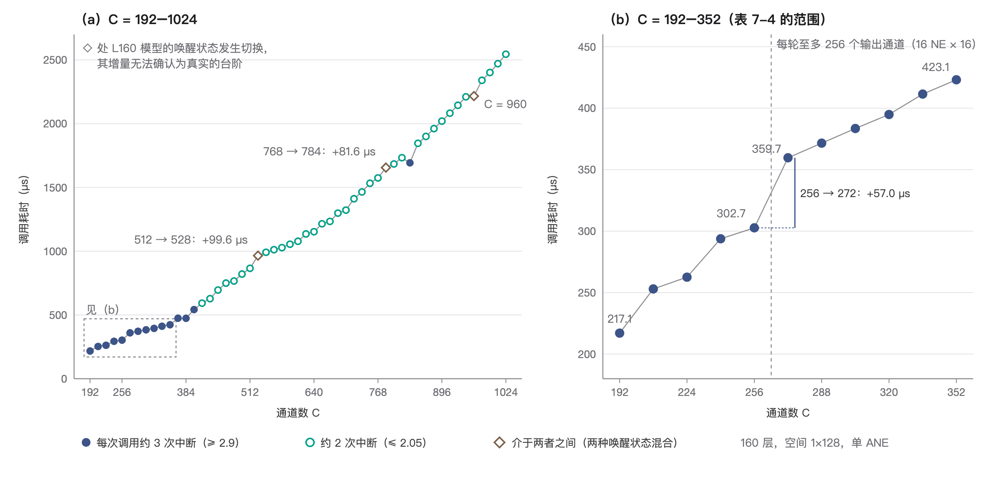

*图 7-1　160 层 1×1 卷积链（1×128，单 ANE）的调用耗时随通道数 C 的变化。（a）C = 192–1024，标记按每次调用的中断数区分主机唤醒状态，菱形处两种状态混合，其两侧的增量无法确认为真实的台阶；（b）表 7-4 范围的放大，C 由 256 增至 272 时调用耗时增加 57.0 µs（数据：[b2b_run.txt](../data/05_compute/b2b_run.txt)）。*

#### 7.3.3 输出通道较少时的利用率

编译器按输出通道把一层分给 16 个 NE。我们在空间尺寸很大（1×8192，切分到两个 ANE）的 1×1 卷积链上测量了 32–256 通道的边际吞吐：32 通道时为 14.3 TFLOPS，64 通道时为 23.6 TFLOPS，96 通道时为 31.6 TFLOPS，192 通道时为 35.7 TFLOPS（数据：[group1_run.txt](../data/04_schedule/group1_run.txt)）〔计时〕。编译产物表明，16、32 和 64 通道时权重都被切分为 16 份，16 通道时每个 NE 分到 1 个输出通道。也就是说，只要输出通道数不少于 16，16 个 NE 就全部启用；通道数少时吞吐低，我们推测原因是每个 NE 分到的工作量少、累加长度短，而不是有 NE 闲置〔HWX，计时，推断〕。

对于通道数较少而空间尺寸较大的层，阵列利用率通常较低，因此可以考虑通过数据重排，将空间维度转换为通道维度，以提高阵列利用率。space_to_depth（S2D）正是这样的重排。表 7-5 比较了 64 通道、128×128 的 32 层 1×1 卷积链在变换前后的吞吐，并与 maderix [4] 在 M4 上的结果对照（工具：[s2d.py](../tools/05_compute/s2d.py)；数据：[b8_s2d_run.txt](../data/05_compute/b8_s2d_run.txt)）〔计时〕。

*表 7-5　space_to_depth 对吞吐的影响（32 层 1×1 卷积链）*

| 模型                              | 耗时      | M6 吞吐       | M4 吞吐 [4]    |
| ------------------------------- | ------- | ----------- | ------------ |
| 64 通道，128×128，直接执行              | 450 µs  | 9.5 TFLOPS  | 3.92 TFLOPS  |
| S2D(4) → 1024 通道，32×32 → D2S(4) | 2168 µs | 31.7 TFLOPS | 16.37 TFLOPS |
| 直接输入 1024 通道，32×32              | 2149 µs | 32.0 TFLOPS | —            |
| S2D(2) → 256 通道，64×64 → D2S(2)  | 876 µs  | 19.6 TFLOPS | —            |
| 直接输入 256 通道，64×64               | 874 µs  | 19.7 TFLOPS | —            |

S2D(4) 把吞吐提高到原来的 3.3 倍；与直接输入变换后形状的模型相比，S2D 与 D2S 的开销在 block = 4 时约为 0.9%，在 block = 2 时约为 0.2%。maderix [4] 报告 M4 的编译器把 S2D(2) 实现为一个 one-hot 权重的卷积，开销为 2.8–3.1%；M6 上没有出现这一问题。

表 7-5 中变换前后的模型并不等价。S2D(4) 之后的 1×1 卷积作用于 1024 个通道，每层的计算量是原模型的 16 倍（1024² × 32² 对 64² × 128²），权重量是 256 倍，模型的语义也随之改变：它在每个 4×4 的像素块内混合了全部通道，而原模型只在单个像素内混合。因此，吞吐提高 3.3 倍的同时，总耗时从 450 µs 增至 2168 µs。若要用 S2D 精确地实现原模型，变换后的卷积权重必须是由 16 个相同的 64×64 块组成的块对角矩阵，按普通卷积执行时仍要付出 16 倍的计算量，总耗时不会缩短；改用分组卷积可以保持计算量不变。所以，表 7-5 支持的结论是：在 ANE 上，通道多、空间小的形状比通道少、空间大的形状更能利用乘加阵列，并且 S2D 与 D2S 本身的开销可以忽略；它不能说明给已有模型插入 S2D 就能提速。这一结论对模型设计更有意义，例如在设计网络时把早期的大分辨率、少通道阶段替换为分块嵌入（patch embedding）一类先降分辨率、再增加通道的结构〔计时，推断〕。

### 7.4 卷积核形状

#### 7.4.1 直接编码的核宽与编译器改写

我们从卷积配置字（表 5-9）中读出了不同核形状下的 Kw、Sx 和 Ox 字段，结果如表 7-6 所示（工具：[convcfg.py](../tools/03_compile/convcfg.py)；数据：[convcfg_scan.txt](../data/03_compile/convcfg_scan.txt)、[ks4_hwx/](../data/05_compute/ks4_hwx/)）〔HWX〕。表中的每层 TD 数针对 16×32 输入；在 4×32 和 8×32 等较小的输入上，改写后的核每层只有 1 个 TD（第 5.6 节）。

*表 7-6　不同核形状的编码方式（256 通道，16×32）*

| 卷积核          | 配置字中的 Kw | Sx  | Ox  | 每层 TD 数 | 处理方式 |
| ------------ | -------- | --- | --- | ------- | ---- |
| 1×3 至 1×8    | 3–8      | 1   | 1   | 1       | 原生执行 |
| 1×9          | 10       | 2   | 2   | 3       | 改写   |
| 1×11         | 12       | 2   | 2   | 4       | 改写   |
| 1×15         | 16       | 2   | 2   | 6       | 改写   |
| 1×16、1×17    | —        | —   | —   | —       | 编译失败 |
| 7×1、9×1、15×1 | 1        | 1   | 1   | 1、2、2   | 原生执行 |
| 3×3、5×5、7×7  | 3、5、7    | 1   | 1   | 2、4、8   | 原生执行 |

由表 7-6 可知，编译器以步长 1 直接编码的核宽最大为 8（下文把这类核称为"原生核"）。核宽为 9–15 时，编译器把卷积改写为横向步长 2 的形式：配置字中的 Kw 取"核宽 + 1 后补成偶数"（9 → 10，10 → 12，……，15 → 16），Sx = 2，Ox = 2，即每走一步产生两个相邻的输出像素；输出宽度字段相应地变为实际宽度的一半，权重存为两套错开一个位置的卷积核。改写后每对输入输出通道的权重量约为 2 × (核宽 + 1)，例如 1×9 卷积改写后折合约 19.3 个抽头；这一数值是权重段字节数除以 (输入通道数 × 输出通道数 × 2 B) 得到的平均值，不是整数个抽头。1×9、1×10 和 1×12 的这一数值（19.3、21.5、25.8）都低于 2 × Kw（20、24、28），说明在这些核宽上两套错开的核并未完整存储；1×15 为 32.05，与 2 × 16 相当〔HWX〕。这是因为改写后的卷积核采用稀疏权重格式，填充产生的零值无需在权重段中实际存储（第 7.4.2 节）。核宽达到 16 时，改写后的 Kw 将超过 16，`ANECCompile` 对 1×16 和 1×17 卷积返回错误。通过 Core ML 执行时，分段器在分段这一步就判定这类卷积不能放到 ANE（第 5.2 节），把它们放到 CPU 上，加载时并不报错；本节由这类卷积组成的测试模型因此整个在 CPU 上执行，每层耗时是 1×15 卷积的 4–7 倍〔HWX，计时〕。Bryngelson [5] 所说的"FP16 卷积核宽度上限为 15"，在编译产物中体现为"步长 1 直接编码最多到 8，借助步长 2 的改写最多到 15"。纵向没有这一限制，核高到 15 都以步长 1 直接编码，17×1 卷积也能编译。M4 的编译目标 h16g 和 H17 一代的 h17s 同样把 1×9 卷积改写为 Sx = 2、Ox = 2 的形式，只是配置字中的 Kw 写为 9（`0x6008c049`），h18 起才写为 10（`0x6008c04a`）（数据：[tdv/](../data/03_compile/tdv/)）〔HWX〕。

上述上限都是从编译器的编码方式得出的。8 和 16 这两个界限说明编译器认为硬件在步长 1 时不支持宽于 8 的核、在步长 2 时不支持 Kw 超过 16，但我们没有执行 Kw 大于 8、步长为 1 的程序，因此不能排除硬件本身支持更宽的核而编译器出于效率等原因选择改写的可能〔编译器，推断〕。

#### 7.4.2 核形状与效率

为了确定核形状对效率的影响，我们对 24 种卷积核（1×1 至 1×15、3×1 至 15×1 的奇数核、3×3 和 5×5）在 4×32、8×32、16×32 和 32×32 四种空间尺寸上测量了 2–24 层的链（256 通道，各层共享权重）。由于这组单 ANE 实验中固件的任务开始事件没有被记录，我们统一以"提交 → 最后一个任务结束"计时，并且只用引擎模式相同的层数点拟合斜率（工具：[ks4_ktrace.sh](../tools/05_compute/ks4_ktrace.sh)、[ks4_fit.py](../tools/05_compute/ks4_fit.py)；数据：[ks4_fit.txt](../data/05_compute/ks4_fit.txt)、[ks4_kt/](../data/05_compute/ks4_kt/)）〔kdebug〕。表 7-7 列出了部分核形状相对直接卷积峰值（单 ANE 21.1 TFLOPS，双 ANE 42.3 TFLOPS）的效率。

*表 7-7　不同核形状的效率（相对直接卷积峰值）*

| 卷积核  | 单 ANE，4×32 | 单 ANE，8×32 | 双 ANE，16×32 | 双 ANE，32×32 |
| ---- | ---------- | ---------- | ----------- | ----------- |
| 1×1  | 91%        | —          | 75%         | 78%         |
| 3×1  | 94%        | 94%        | 61%         | 79%         |
| 1×3  | 136%       | 130%       | 132%        | 121%        |
| 1×5  | 94%        | 88%        | 91%         | 96%         |
| 1×8  | 94%        | 84%        | 97%         | 99%         |
| 1×9  | 42%        | 85%        | 43%         | 86%         |
| 1×12 | 42%        | 85%        | 76%         | 88%         |
| 1×15 | 42%        | 85%        | 42%         | 86%         |
| 9×1  | 91%        | 92%        | 73%         | 83%         |
| 15×1 | 91%        | —          | 96%         | 98%         |
| 3×3  | 90%        | 131%       | 79%         | 114%        |
| 5×5  | 90%        | —          | 97%         | 95%         |

表 7-7 表明，核形状本身并不降低效率：原生执行的核（核宽不超过 8 的横向核，以及核高到 15 的纵向核）在 4×32 的单 ANE 形状上效率都在 90–95%，在 8×32 上为 84–98%。效率超过 100% 的 1×3 和 3×3 卷积使用了硬件 Winograd（第 7.4.3 节）。1×1 和 3×1 卷积在双 ANE 下效率较低（61–79%）。与单 ANE 按行数折算的理想值相比，16×32 的双 ANE 形状每层多出约 0.4 µs（1×1）和 2.8 µs（3×1），远大于第 10.3 节的约 0.14 µs，因此不能用一般的协同开销解释；可能的来源包括纵向核按行切分后读取的重叠行（第 5.8.3 节），以及每层计算量小时的其他开销〔推断〕；9×1 和 3×3 在 16×32 的双 ANE 形状上也只有 73% 和 79%。表中的"—"表示该形状在这一引擎模式下没有测量点（编译器选择了另一种模式）。

改写后的核（1×9 至 1×15）表现出完全不同的规律：每层耗时与权重量成正比，而与行数无关。例如，1×9 卷积在 4×32 和 8×32 上的每层耗时相同（17.00 µs 和 16.89 µs），因此 4×32 的效率只有 8×32 的一半。按每层耗时和 150 GB/s 的读权重带宽反推每对通道的抽头数，1×9、1×11 和 1×15 分别为 19.3、23.5 和 32.0，与从编译产物中读出的权重量相差不到 0.5%。改写使每层的权重量翻倍，达到 2.5–4.2 MB，远超每 NE 64 KiB 的常驻上限，每层都需要重新读入权重。

但这些层并不受 DRAM 读权重带宽限制：把 1×9 卷积的权重量化为 Int8 后，每层耗时没有缩短（第 7.5 节）。因此，改写后的核的耗时与权重元素的数量成正比，而与权重的字节数无关，其瓶颈是某个按权重元素计量的环节，速率约为每秒 750 亿个权重；"FP16 权重字节 ÷ 150 GB/s"与实测相符，只是因为这一速率按 FP16 折算恰好接近读权重带宽〔kdebug，HWX，推断〕。第 10.4 节和第 10.7 节表明，两个引擎同时执行这类层时会相互拖慢，说明它由两个引擎共享。

原生核在权重超过 64 KiB 时同样需要每层重读，例如 4×32 上的 3×3、5×5 和 11×1 至 15×1 卷积，反推的读权重速率也是 148–150 GB/s；对于原生核，第 7.5 节的 2048 通道 1×1 卷积证实耗时确实随权重字节数变化。这些形状的效率恰好在 90% 左右，原因是 4×32（128 个像素）正好处于计算与读权重的平衡点：每读 1 个 FP16 权重做 128 次乘加，满速计算需要约 165 GB/s 的读权重带宽。

字段跟踪和编译器的反汇编为这一瓶颈提供了一个可能的解释。编译器在决定权重格式时，会计算改写所补出的零的比例，超过 1/7 就改用稀疏权重格式（另有膨胀卷积这类由上游直接标记为"必须压缩"的情形）：按编译器函数 `CalculateSparsityFromPadding` 的估算，步长 2 卷积改写后的补零比例为 0.4375，核宽 9 的改写核为 0.55，都超过阈值；这是编译器由改写方式推算的比例，按编译产物中权重段的大小反推，改写核实际存储的元素中补出的零只占约 6–10%（1×9 为 20 个元素中的 2 个），可见决策依据的是这一估算值，而不是实际存储的零；普通的 3×3、5×5 卷积没有补零，不使用稀疏格式〔编译器〕。也就是说，核宽 9–15 的改写核、膨胀卷积、步长 2 卷积和双线性上采样，在硬件上执行的都是稀疏权重，依靠第 7.5 节所述的跳零硬件省去补出来的零。这解释了改写核的两个现象：其权重段比两套完整的核小，以及膨胀卷积的吞吐明显低于普通 3×3 卷积（第 7.4.3 节）。我们进一步推测，上文按权重元素计量的共享环节就是稀疏权重的解码环节：它以元素为单位处理压缩后的权重，因此量化为 Int8 不能使其加快，而两个 ANE 同时使用时会相互争用〔推断〕。这一推测与第 7.5 节剪枝实验中"加速达不到非零比例"的现象相容。编译器在这一决策中只看改写补出的零，不扫描权重本身的零，因此以普通常量写入的零权重不会使用稀疏格式（第 7.5 节）。

在双 ANE 下，改写后的核的效率取决于切分方式：16×32 的 1×9、1×10、1×11 和 1×15 卷积被按行切分，两个 ANE 各读一份完整的权重并共享上述瓶颈，效率只有 42–43%；1×12 至 1×14 卷积被按输出通道切分，效率为 73–77%（第 10.4 节，缺陷 B9）。

#### 7.4.3 硬件 Winograd

在 512 通道、16×16 的 3×3 卷积链上，单 ANE 的 FP16 边际吞吐达到 31.0 TFLOPS，是直接卷积峰值的 1.47 倍；而不能使用 Winograd 的膨胀率为 2 的 3×3 卷积，每个 ANE 只有 14.6 TFLOPS，约为直接卷积峰值的 70%（数据：[h10_w8a8_k3.txt](../data/05_compute/h10_w8a8_k3.txt)、[h10_dilation.txt](../data/05_compute/h10_dilation.txt)）〔计时〕。编译产物中的权重段大小恰为 512 × 512 × 9 × 2 字节，即存储的是原始的 3×3 权重，Winograd 变换在硬件中完成，这与 Bryngelson [5] 反编译得出的"Winograd 变换矩阵固化在硬件中"一致〔HWX〕。F(2×2, 3×3) 理论上把乘法次数减少到 1/2.25，实测达到了这一理论加速的约 65%。1×3 卷积同样超过了直接卷积峰值，对应 TD 任务信息字中的一维 Winograd 位（`1DWinograd`，bit 27）〔HWX〕。

编译器的性能估计模型未将 Winograd 变换纳入考虑：512 通道、16×16 的 3×3 卷积 TD 的 `exe_cycles` 为每层 58，性能模型的估计为每层 58.8 µs，而本节与第 7.5 节两轮测量的实测为每层 39–44 µs，快约 1.3–1.5 倍，与 Winograd 的加速相当（第 7.8 节）〔编译器，计时〕。此外，Winograd 并非对所有 3×3 卷积都启用。字段跟踪显示，在所跟踪的 3×3 类卷积中，任务信息字中的 Winograd 位只在普通 3×3 和分组 3×3 卷积中为 1，深度卷积、5×5、膨胀卷积和步长 2 卷积都为 0（表 5-13），与上文膨胀卷积的实测相符〔编译器，计时〕。但在 256 通道、8×16 的 3×3 卷积链上，边际吞吐只有 15.3 TFLOPS，说明即使是普通 3×3 卷积，某些形状也不使用 Winograd；这一形状下的取值条件本文没有确定。

### 7.5 低精度与压缩权重

我们用 coremltools 生成了两种低精度模型：W8A8 模型以 `linear_quantize_activations` 对激活进行校准量化，同时把权重量化为 Int8；W8 模型只把权重量化为 Int8，激活仍为 FP16（工具：[w8a8.py](../tools/05_compute/w8a8.py)）。表 7-8 给出了三种形状上 W8A8 与 FP16 的边际吞吐（数据：[h10_w8a8_slope.txt](../data/05_compute/h10_w8a8_slope.txt)、[h10_w8a8_k3.txt](../data/05_compute/h10_w8a8_k3.txt)）〔计时，IOReport〕。

*表 7-8　W8A8 与 FP16 的边际吞吐*

| 形状               | 引擎  | FP16                   | W8A8      | W8A8 ÷ FP16 | W8A8 时每个 ANE 的 DRAM 读带宽 |
| ---------------- | --- | ---------------------- | --------- | ----------- | ----------------------- |
| 1×1，512 通道，1×128 | 单   | 20.6 TFLOPS（17.6–18.4） | 27.5 TOPS | 1.34（1.5）   | 22–28 GB/s              |
| 1×1，512 通道，1×256 | 双   | 39.5 TFLOPS（第 10.3 节）  | 38.6 TOPS | 0.98        | 23.5 GB/s               |
| 3×3，512 通道，16×16 | 单   | 31.0 TFLOPS            | 62.1 TOPS | 2.0         | 20–27 GB/s              |

在计算密集的 3×3 卷积中，W8A8 的吞吐恰为 FP16 的 2 倍，与第 7.2.2 节推断的 INT8 乘加宽度一致；计入 Winograd 后，单 ANE 的 W8A8 有效吞吐达到 62.1 TOPS。然而，这一 2 倍优势并未延续到 1×1 卷积链：单 ANE 下 W8A8 相对 FP16 仅快约 1.3–1.5 倍，双 ANE 下则基本与 FP16 持平。单 ANE 加速比的范围来自拟合区间的差异。W8A8 的吞吐斜率由 128–384 层的数据拟合得到，而前文 20.6 TFLOPS 的 FP16 吞吐采用 256–384 层的数据，对应约 1.3 倍的加速；若统一采用 128–384 层拟合，同一数据文件中的 FP16 吞吐为 17.6–18.4 TFLOPS（表中括号值），对应约 1.5 倍。由于 128 层与 384 层的测量点处于不同的主机唤醒状态（第 6.5.3 节），两种口径均存在一定误差，但得到的加速比都明显低于理想的 2 倍（数据：h10_w8a8_slope.txt）。IOReport 的带宽数据为这一差异提供了线索。FP16 测试中的 DRAM 读带宽几乎为 0，表明激活张量能够驻留在片上缓存中；相比之下，W8A8 卷积链中每个 ANE 持续产生约 22–28 GB/s 的 DRAM 读流量。由于各层共享权重，且权重总量仅约 260 KB，这部分流量不太可能主要来自权重读取。进一步按读带宽与单层执行时间折算，每个 ANE 每层约读取 64–81 KB，与其负责处理的一层 Int8 激活数据（64 KB）处于同一量级。编译产物进一步显示，每个 W8A8 层均被拆分为“输入量化（PE）→ 卷积 → 输出反量化”三类 TD。结合上述带宽特征，我们推断量化与反量化过程破坏了 FP16 卷积链中的片上激活驻留，使激活数据在层间经过 DRAM，因此 1×1 卷积的性能逐渐受到激活数据搬运的限制，而无法充分体现 INT8 乘加阵列的 2 倍吞吐优势〔计时，IOReport，HWX，推断〕。

不过，这一解释在数量上尚不能完全闭合。实测 22–28 GB/s 的读带宽仍低于第 9.4.2 节测得的激活通路上限（每个 ANE 约 35–40 GB/s），且 IOReport 中的写流量接近底噪，与激活数据需要完整写回 DRAM 的简单模型并不完全一致。因此，现有证据能够支持 W8A8 1×1 卷积受到额外数据搬运开销影响，但尚不足以确定这些流量的完整路径及其具体瓶颈。

只量化权重（W8）不提高乘加峰值：编译器性能模型中 W8 与 FP16 的乘加效率相同（第 7.2.2 节），因此，在计算受限的层上，W8 不带来加速。在 512 通道、32×32 的 1×1 卷积链上（每个 NE 的权重约 32 KiB，常驻片上），W8 与 FP16 的耗时几乎相同（48 层均为 1011–1012 µs），这与上述性能模型以及 maderix [4] 在 M4 上的结论（Int8 权重 260.4 µs，FP16 权重 260.5 µs）一致（数据：[b6_q8_run.txt](../data/05_compute/b6_q8_run.txt)）〔计时〕。W8 的作用在于减少读权重的字节数和权重缓冲的占用：3×3、512 通道的卷积在 W8 下每个 TD 可容纳 224 个输出通道，FP16 下只能容纳 96 个。W8 时每个 NE 每趟 14 × 512 × 9 × 1 B = 63 KiB，仍在 64 KiB 以内；FP16 时每个 NE 每趟只有 6 个输出通道（54 KiB），而按 64 KiB 本可容纳 7 个〔HWX〕。然而，"不提高乘加峰值"并不等于"不提高模型速度"：对于读权重受限的层，较窄的权重格式可能按字节数成比例地缩短读权重的时间。

为了直接测量这一收益，我们构造了一个读权重受限的原生形状：1×1 卷积，输入输出各 2048 通道，空间 32 个像素，各层的权重互不相同。每层的 FP16 权重约 8.4 MB，每个 NE 分到 512 KiB，远超 64 KiB 的常驻上限；按约 150 GB/s 计算，读权重约需 56 µs，而计算只需约 13 µs。我们用 coremltools 从同一份 FP16 权重生成 W8、6/4/3/2 位调色板、分组调色板（4 位）、int4 分块量化和向量调色板（`cluster_dim` 为 2 和 4）几个版本，每个版本取 16 层和 32 层，以 kdebug 任务时长之差得到每层耗时（工具：[wfmt_gen.py](../tools/05_compute/wfmt_gen.py)、[wfmt.sh](../tools/05_compute/wfmt.sh)、[wfmt_fit.py](../tools/05_compute/wfmt_fit.py)、[hwx_kern.py](../tools/05_compute/hwx_kern.py)；数据：[wfmt.txt](../data/05_compute/wfmt/wfmt.txt)）。结果如表 7-9 所示〔kdebug，HWX〕。

*表 7-9　权重格式对读权重受限层的影响（1×1 卷积，2048 通道，32 像素，各层权重不同）*

| 权重格式           | 每层权重（HWX）                   | 每层耗时    | 相对 FP16 | 按权重字节折算的读带宽 | 使用的引擎         |
| -------------- | --------------------------- | ------- | ------- | ----------- | ------------- |
| FP16           | 8.39 MB                     | 52.8 µs | 1.00    | 159 GB/s    | ANE0          |
| W8             | 4.20 MB                     | 30.8 µs | 0.58    | 136 GB/s    | ANE0          |
| 6 位调色板         | 3.15 MB                     | 23.6 µs | 0.45    | 134 GB/s    | ANE0          |
| 4 位调色板         | 2.10 MB                     | 16.8 µs | 0.32    | 125 GB/s    | ANE0          |
| 4 位分组调色板       | 2.11 MB                     | 16.7 µs | 0.32    | 126 GB/s    | 两个 ANE        |
| 3 位调色板         | 3.15 MB（两个 ANE 各一份 1.57 MB） | 12.0 µs | 0.23    | 见正文         | 两个 ANE        |
| 2 位调色板         | 2.10 MB（两个 ANE 各一份 1.05 MB） | 8.4 µs  | 0.16    | 见正文         | 两个 ANE        |
| int4 分块量化      | 编译失败                        | —       | —       | —           | 整个模型在 CPU 上执行 |
| 向量调色板（2 维、4 维） | 编译失败                        | —       | —       | —           | 整个模型在 CPU 上执行 |

表 7-9 表明，在读权重受限的原生层上，硬件直接读入压缩后的权重。编译产物中的权重保持压缩格式，单个 ANE 所存的一份权重恰好按位数缩小；每层耗时随权重字节数下降，在只用一个 ANE 的格式上，按字节折算的读带宽在 125–159 GB/s 之间，与第 9.3 节测得的读权重带宽相当，说明权重没有在读入之前被展开为 FP16。与 FP16 相比，W8 使每层耗时缩短 42%，4 位调色板缩短 68%，2 位调色板缩短 84%〔kdebug，HWX〕。压缩格式的等效带宽（125–136 GB/s）略低于 FP16（159 GB/s），说明压缩格式每层还有少量与字节数无关的额外时间，可能来自查表或反量化，本文没有进一步分解〔推断〕。2 位、3 位和分组调色板的模型被编译器切分到两个 ANE 上，而同一形状的 FP16、W8、4 位和 6 位模型只使用 ANE0。其中 2 位和 3 位调色板的产物为每个引擎各存了一份完整的权重，每层权重段因此是单份的两倍；分组调色板的权重段则没有加倍，推测是按输出通道切分的（数据：[kern_all_h18g.txt](../data/05_compute/wfmt/kern_all_h18g.txt)）〔HWX，推断〕。

这带来一个尚未解开的矛盾：如果两个引擎都从 DRAM 读入各自的完整一份，2 位和 3 位调色板每层 8.4 µs 和 12.0 µs 对应的合计读取速率为 250–262 GB/s，超过了 DRAM 的理论带宽 170.5 GB/s（第 9.5 节），这是不可能的。因此，要么每个引擎只读取自己那份权重中的一部分，要么其中一份读取由片上存储或 SLC 提供，本文没有查明是哪一种。若按单份权重折算，两者的等效带宽为 125–131 GB/s，与单引擎的压缩格式相当〔kdebug，推断〕。

int4 分块量化和向量调色板的模型在 Core ML 一层可以正常生成，但 ANE 编译器无法编译，Core ML 因此把整个模型放到 CPU 上执行，每层约 66 µs，比 FP16 在 ANE 上还慢；HAL 参数表虽然为 M6 启用了向量调色板（第 15.3 节），但以我们采用的生成参数无法使用它，其他块大小或参数能否编译，本文没有穷尽〔HWX，计时〕。

作为对照，我们对第 7.4.2 节的改写核（1×9 卷积，256 通道，4×32）做了同样的比较。W8 把每层权重从 2.54 MB 减至 1.33 MB，IOReport 的 DRAM 读带宽下限也近乎减半，但每层耗时从 17.0 µs 变为 17.8 µs，没有缩短（数据同上）〔kdebug，IOReport〕。这说明改写核的瓶颈并不是 DRAM 的字节带宽，第 7.4.2 节讨论了这一结果的含义。

我们还检验了稀疏的效果，分三个问题：剪枝后的权重是否以压缩格式读入；计算阵列是否跳过零权重的乘加；是否跳过零激活。模型从同一份 FP16 基准权重出发，用 coremltools 的 `prune_weights` 生成非结构化剪枝 50%、75%、90% 和结构化 2:4、1:4 的版本，读权重受限的 m2048 另加"剪枝 50% 再 4 位调色板"的联合压缩；计算受限的形状为权重常驻片上的 1×1 卷积链（512 通道，1×128）和 3×3 卷积链（512 通道，16×16）。M6 以 kdebug 中"驱动提交 → 任务结束"的时长求斜率，M4 以调用耗时求斜率，两台机器各测两轮（工具：[sparse_gen.py](../tools/05_compute/sparse_gen.py)、[sparse.sh](../tools/05_compute/sparse.sh)、[sparse_fit.py](../tools/05_compute/sparse_fit.py)、[sparse_err.py](../tools/05_compute/sparse_err.py)；数据：[sparse.txt](../data/05_compute/sparse/sparse.txt)）〔kdebug，HWX，计时〕。

第一，剪枝后的权重以压缩格式存放和读入。编译产物中的权重段由"非零值加每元素 1 位的掩码"组成，剪枝 50%、75%、90% 时分别为稠密的 0.56、0.31 和 0.16 倍。在读权重受限的 m2048 上，每层耗时与压缩后的字节数成正比，按字节折算的读带宽在 M6 上约为 150 GB/s，在 M4 上约为 67 GB/s，恰好是两者各自的读权重上限；M6 上剪枝 90% 后每层耗时为稠密的 0.16 倍，剪枝 50% 再加 4 位调色板为 0.24 倍，两种压缩可以叠加〔HWX，kdebug〕。图 7-2 把各种权重格式的每层耗时与压缩后的字节数画在一起：量化、调色板与剪枝的点都落在同一条读权重上限的直线附近，而改写核不在其上。

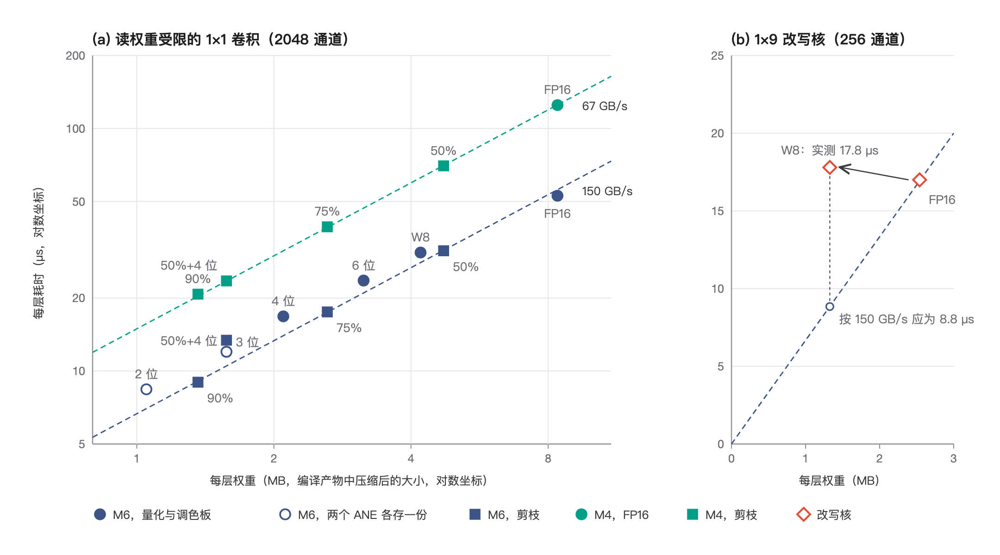

*图 7-2　读权重受限层的每层耗时与每层权重字节数。(a) 1×1 卷积（2048 通道，32 像素，各层权重不同），双对数坐标；横轴为编译产物中每层压缩后的权重段大小，虚线为按读权重上限（M6 约 150 GB/s，M4 约 67 GB/s）预测的耗时。2、3 位调色板被拆到两个 ANE，两个引擎各存一份完整权重，横轴取单份大小（空心点）。(b) 1×9 改写核（256 通道，4×32）：W8 使权重字节数减半，耗时却不变，与按字节预测的 8.8 µs 相差一倍（第 7.4.2 节）。M6 的耗时来自 kdebug（量化与调色板取固件任务时长，剪枝取驱动提交到任务结束的时长），M4 取 Core ML 调用耗时，都是 16 层与 32 层的斜率（数据：[wfmt.txt](../data/05_compute/wfmt/wfmt.txt)、[sparse.txt](../data/05_compute/sparse/sparse.txt)）。*

第二，M6 和 M4 的计算阵列都会跳过零权重的乘加。表 7-10 列出了权重常驻片上的 1×1 卷积链的结果。

*表 7-10　剪枝对计算受限的 1×1 卷积链的影响（512 通道，1×128，权重常驻片上；稠密版本每层 3.45 µs，比第 7.2.1 节的 3.26 µs 慢约 6%，两者来自不同轮次，计时口径也不同，这里取 kdebug 中提交到任务结束的时长对 32 与 128 层的斜率）*

| 权重           | M6 每层耗时      | 相对稠密 | 按稠密乘加数折算    | M4 相对稠密 | M4 按稠密乘加数折算 |
| ------------ | ------------ | ---- | ----------- | ------- | ----------- |
| FP16 稠密      | 3.45 µs      | 1.00 | 19.5 TFLOPS | 1.00    | 15.5 TFLOPS |
| 剪枝 50% 或 2:4 | 2.27–2.28 µs | 0.66 | 29.5 TFLOPS | 0.68    | 22.7 TFLOPS |
| 剪枝 75% 或 1:4 | 1.43–1.44 µs | 0.42 | 46.8 TFLOPS | 0.44    | 约 35 TFLOPS |
| 剪枝 90%       | 1.25 µs      | 0.36 | 53.6 TFLOPS | 0.33    | 约 47 TFLOPS |

按原始稠密乘加数折算，M6 在 75% 和 90% 剪枝率下的等效吞吐分别达到 46.8 和 53.6 TFLOPS，相当于单引擎直接卷积峰值 21.1 TFLOPS 的 2.2 倍和 2.5 倍。由于该测试中的权重常驻片上，性能提升无法由权重读取量减少解释，因此表明计算阵列本身能够跳过零权重对应的乘加。跳零效率与剪枝是否结构化无明显关系：50% 剪枝时，2:4 与非结构化剪枝的性能基本相同；75% 剪枝时，1:4 与非结构化剪枝同样如此。另一方面，加速并不与非零权重比例成反比：非零比例从 0.5 降至 0.25 和 0.1 时，相对耗时仅从 0.66 降至 0.42 和 0.36。这一偏离可能来自各 NE 所分配压缩权重长度的不均衡、每层固定开销以及稀疏权重的解码吞吐限制〔推断〕。

编译产物进一步印证了硬件的跳零机制。卷积 TD 中的寄存器 0x1240 为权重配置字；根据编译器中各字段的写入函数逐位核对，第 0–1 位指定权重数据类型，第 2 位及第 4–7 位控制调色板及其位数，第 8 位 KernelSparseFmt 表示采用稀疏权重格式，第 28 位 KernelDetectZeros 则控制运行时零权重检测。剪枝后，该寄存器由 0x10000082 变为 0x182，即 KernelSparseFmt 被置位而 KernelDetectZeros 被清除；权重 DMA 配置寄存器 0x1540 中也同时出现了对应的稀疏格式标志。这说明剪枝模型并非在稠密权重上动态检测零值，而是在编译阶段将权重编码为稀疏格式，再由硬件直接执行压缩后的权重流。

这一变化也反映在权重布局和执行周期中：稠密模型为 16 个 NE 分别分配固定的 32 KiB 权重，而剪枝后各 NE 获得长度不同的压缩权重段；与此同时，TD 头中的 exe_cycles 从每层 3 降至 1，尽管性能模型给出的逐 TD 估计并未随之变化（第 7.8 节）〔HWX，编译器〕。

跳过零权重的前提是权重以稀疏格式交给编译器，coremltools 的剪枝接口会生成这种格式。若权重中的 0 以普通的稠密常量写入模型，即使 50%–100% 为 0，编译器也不会改用稀疏格式，权重段、0x1240 和估计周期都与随机权重相同（工具：[kfmt_gen.py](../tools/05_compute/kfmt_gen.py)）〔HWX，编译器〕。稠密格式的层另有零权重检测位，由编译器按层决定：在 M6 的目标 h18g 上，权重常驻片上的稠密卷积（包括 W8 和调色板）打开这一位，每层权重不同、从 DRAM 读取的 m2048 则不打开；在 M4 的目标 h16g 上，编译器对所有卷积都不打开这一位。决定这一点的是 HAL 参数表中偏移 0x72c 的开关，它自 H17（M5 一代）起为 1（第 15.3 节）〔HWX，编译器〕。我们在 M4 上测得，权重 50%–100% 为 0 的稠密模型每层只比随机权重快 4–8%，而剪枝 75% 的稀疏格式快约一半〔计时〕；由于 M4 不打开零权重检测，这一结果只说明没有零权重检测时稠密零权重几乎不加速。

3×3 卷积的情况不同。剪枝后编译器不再使用 Winograd（任务信息字中的 Winograd 位被清除，输出通道分组由 2 变为 16，每层的 TD 数从 6 个变为 2 个），改为直接卷积加跳零，因此剪枝 50% 反而比稠密慢 5–15%，剪枝 75% 以上才有收益（剪枝 90% 时为稠密的 0.32–0.34 倍，按稠密乘加数折算约 87 TFLOPS）〔HWX，kdebug〕。3×3 卷积链的部分权重需要从 DRAM 读取，少数任务的执行时间显著偏长，使平均任务时长高 5–25%。以上比较取中位数；按平均值比较，各版本的快慢顺序不变〔kdebug〕。

图 7-3 把两种卷积在 M6 与 M4 上的结果画在一起。

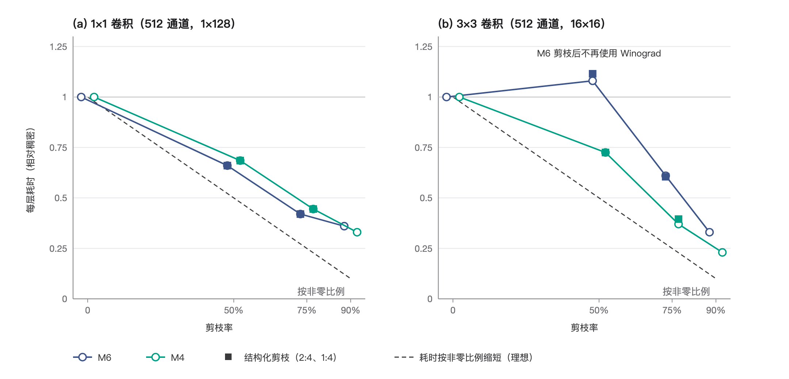

*图 7-3　剪枝率与每层相对耗时（权重常驻片上的计算受限层，第二轮两遍的平均）。(a) 1×1 卷积链：M6 与 M4 都随剪枝率缩短耗时，非结构化剪枝（圆点）与结构化剪枝（方块）几乎重合，但都慢于按非零比例缩短的理想情形（虚线）。(b) 3×3 卷积链：M6 剪枝后不再使用硬件 Winograd，剪枝 50% 反而比稠密慢 5–15%，剪枝 75% 以上才有收益；M4 上剪枝从 50% 起就有收益（M4 的稠密 3×3 卷积是否使用 Winograd，本文没有确定）（数据：[sparse.txt](../data/05_compute/sparse/sparse.txt)）。*

第三，计算阵列不跳过零激活（但零激活会大幅降低功耗，见第 13.3 节）。只改输入无法测量这一点，因为输入中的 0 经过第一层卷积后就被混合掉了；为此，我们在每层卷积后引入一个各层共享的固定掩码，通过掩码直接控制下一层输入中零值的比例，同时保持图结构和权重不变。乘掩码本身使每层多出约 1 µs 的固定开销（M6 的 1×1 链每层约 4.4–4.5 µs，而表 7-10 的稠密版本为 3.45 µs），因此掩码模型只在彼此之间比较。每层输入中 0 的比例从 0% 增至 90%，或一半通道整体为 0，耗时都相同：M6 的 1×1 链只在"有 0"与"没有 0"之间相差约 2.4%，且与比例无关；M4 和 3×3 链的差别都在测量噪声之内〔kdebug〕。3×3 链对测量的先后顺序较为敏感，为减小测量顺序引起的系统性漂移，我们分别按正序和倒序执行完整测试序列，以消除测量顺序带来的漂移〔kdebug〕。所有剪枝模型在 ANE 上的输出都与 CPU 上运行同一剪枝模型的结果一致，误差不大于稠密版本。

综上，只量化权重、调色板压缩和剪枝都不提高乘加阵列的稠密峰值，但在受 DRAM 读权重带宽限制的原生层上，它们都能按压缩后的字节数近似成比例地缩短耗时；剪枝还能在计算受限的层上跳过零权重的乘加，并且不要求结构化的稀疏模式。对于大语言模型解码这类负载，降低每个权重的位数或剪去部分权重，可以按字节数缩短读权重受限层的耗时；但整机解码还受调用次数和主机开销的限制（第 14.3 节），这只是提速的途径之一。

### 7.6 平面引擎

#### 7.6.1 吞吐

为了测量 PE 的吞吐，我们构造了只含逐元素运算的链，并确认数据全部留在 L2 中：编译产物中除第一层外的 TD 都不带 DMA 地址包，运行时两个 ANE 的 DRAM 读写只有约 0.5 GB/s 的底噪。由于这些模型都被切分到两个 ANE，我们用 kdebug 测量每个 ANE 的任务时长。表 7-11 给出了 256 通道、五种空间尺寸下的结果（工具：[pe_ktrace.sh](../tools/05_compute/pe_ktrace.sh)、[pe_kt.py](../tools/05_compute/pe_kt.py)；数据：[pe_kt/](../data/05_compute/pe_kt/)、[pe_kt_fit.txt](../data/05_compute/pe_kt_fit.txt)）〔kdebug〕。单输入运算（abs、乘以 −1、relu）每两个被编译器合并为一个任务。

*表 7-11　PE 运算的任务时长（每个 ANE）*

| 每个 ANE 的元素数    | 单输入：每个任务（两个运算） | 双输入 x + y：每层 |
| -------------- | -------------- | ------------ |
| 131 072（32×32） | 2.38 µs        | 4.55 µs      |
| 204 800（40×40） | 3.88 µs        | 4.39 µs      |
| 294 912（48×48） | 5.22 µs        | 5.19 µs      |
| 401 408（56×56） | 6.86 µs        | 11.94 µs     |
| 524 288（64×64） | 8.98 µs        | 18.49 µs     |

单输入运算的任务时长与元素数呈很好的线性关系（最大残差 0.17 µs）：每个任务有约 0.35 µs 的固定部分，按每个任务处理的元素数计（每个任务含两个运算），吞吐为每个 ANE 约 61 G 元素/s。每个元素读 2 字节、写 2 字节，折合 L2 读写约 243 GB/s。加法与乘法的耗时相同，两者交替也相同，说明吞吐不受运算类型限制。

双输入运算未表现出线性特性：32×32 至 48×48 时每层停留在 4.4–5.2 µs，56×56 和 64×64 时跃升至 11.9 µs 和 18.5 µs，这一段的边际吞吐远低于单输入运算。HAL 参数表中有一个字段（偏移 0x5f6，读取者为 `ZinMirInterleaveInitializer::IsDualInputsPEWithSingleDMAEngine`）在 H16 至 H19 上都为 1，从名称看表示"双输入 PE 运算只有一个 DMA 引擎"；我们推测，在数据留在 L2 的情况下，两路输入同样由一个引擎先后读取。这与双输入运算单位元素成本更高的观测相符；从 56×56 起，每个 ANE 上三个张量各约 0.75–1 MiB，合计超过编译器使用的 2 MiB L2，可能还有额外的限制〔HAL，kdebug，推断〕。

#### 7.6.2 时钟与宽度

PE 的时钟独立于 NE 的时钟，并且很可能位于两个 ANE 共用的共享簇中，第 11.3 节给出了完整的论证。这里只用到其中的频率估计：PE 时钟从最低档到满载的比值为 2.63，以编译器 L2 频率表的低端 684–720 MHz 为起点，推得满载的 PE 时钟约为 1.8–1.9 GHz（第 11.3.2 节）〔推断〕。

按这一频率，PE 每个周期处理约 61 G ÷ 1.8–1.9 GHz ≈ 32 个 FP16 元素，即每周期读 64 字节、写 64 字节，与 HAL 中"PE 工作单元为 64"（以字节计）相符〔推断〕。需要强调，这一宽度依赖于借用编译器 L2 频率范围推得的时钟，并非直接测量的结果。

在第 6.6.1 节测试的程序中，PE 运算与乘加运算分属不同的 TD 时没有重叠；硬件能否让两者在不同 TD 之间并行，本文无法确定。融合在卷积之后的激活函数由 NE 配置中的查表模式以 33 点查找表加线性插值实现（第 8.5.1 节），其数值行为在第 8 章讨论。

### 7.7 吞吐与网络深度

maderix [4] 给出了 M4 上吞吐随链深度变化的数据。为了便于比较，我们在 M6 上使用相近的形状（512 通道，32×32，各层权重不同），并采用与 maderix 相同的口径，即包含每次调用固定开销的整体吞吐。该形状在 M6 上被切分到两个 ANE。结果如表 7-12 所示（数据：[chains_run2.txt](../data/05_compute/chains_run2.txt)、[b6_q8_run.txt](../data/05_compute/b6_q8_run.txt)）〔计时〕。

*表 7-12　吞吐与链深度（含每次调用的固定开销）*

| 层数  | M6 FP16    | M6 W8A8  | M4 FP16 [4]         | M4 W8A8 [4]         |
| --- | ---------- | -------- | ------------------- | ------------------- |
| 1   | 2.8 TFLOPS | 2.6 TOPS | 5.4                 | 5.9                 |
| 4   | 8.9        | 9.8      | 9.8                 | 12.4                |
| 8   | 12.6       | 13.7     | 12.3                | 18.6                |
| 16  | 21.0       | 22.7     | 11.7                | 22.4                |
| 32  | 19.1       | 37.5     | 16.1                | 27.4                |
| 48  | 25.6       | 35.5     | 18.5（1024 通道，64×64） | 36.0（1024 通道，64×64） |

在 8 层以内，M6 并不比 M4 快，原因是总时间受每次调用的固定开销支配。FP16 从 16 层起 M6 明显更快；W8A8 则只在 32 层明显更快（37.5 对 27.4 TOPS），16 层时两者基本相同。48 层时 M4 的两个数据点都是 1024 通道、64×64，与 M6 的形状不同，FP16 的 25.6 对 18.5 TFLOPS 和 W8A8 的 35.5 对 36.0 TOPS 都只能作参考。扣除固定开销后，FP16 在 36 层以上的耗时可以用一条直线描述，每层约 13.1 µs，折合约 40.9 TFLOPS（见下文）；16 层的测量点因主机侧开销不同而偏离这条直线，因此不宜用 16 层与 48 层两点相减求边际吞吐。图 7-4 给出了 M6 与 M4 的吞吐随链深度的变化。

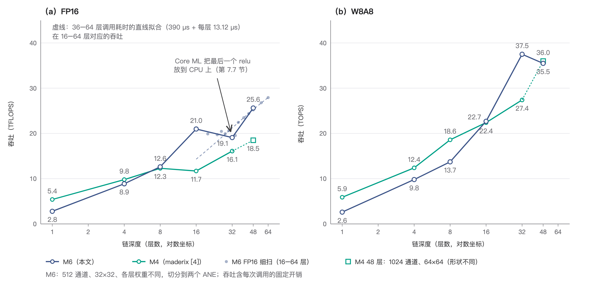

*图 7-4　M6 与 M4 的整体吞吐（含每次调用的固定开销）随链深度的变化：（a）FP16，（b）W8A8。M6 为 512 通道、32×32 的 1×1 卷积链（各层权重不同），M4 数据取自 maderix [4]，其 48 层一点为 1024 通道、64×64；（a）中的散点为 16–64 层的细扫，虚线为 36 层以上调用耗时的直线拟合所对应的吞吐（数据：[chains_run2.txt](../data/05_compute/chains_run2.txt)、[b6_q8_run.txt](../data/05_compute/b6_q8_run.txt)、[b6x_sweep.txt](../data/05_compute/b6x_sweep.txt)）。*

表 7-12 中 FP16 的 32 层出现了一个异常：其吞吐低于 16 层。我们在 16–64 层之间以更细的步长重新测量后发现，36 层及以上的调用耗时可以用一条直线描述（约 390 µs + 每层 13.12 µs，取每个层数两轮中较小的值做最小二乘拟合；改用任务时长一列时为约 376 µs + 每层 13.21 µs），而 36 层以下的测量点偏离了这条直线（数据：[b6x_sweep.txt](../data/05_compute/b6x_sweep.txt)、[b6_kt/](../data/05_compute/b6_kt/)、[effA_kt/](../data/05_compute/effA_kt/)）〔计时，kdebug〕。偏离来自两个相互独立的原因：层数较少的模型比直线预测更快，而 32 层和 34 层的模型比直线预测更慢。

对于前者，16 层的模型比直线预测快 184 µs。固件时间戳显示，ANE 的任务时长始终在直线上，差别全部来自任务结束后的主机侧开销，它从 16 层的约 166 µs 逐渐增至 28 层以上的约 355 µs，这正是第 6.5 节所述的主机 CPU 空闲深度效应。

对于后者，32 层和 34 层的模型比直线预测慢约 100 µs。Core ML 的 E5 缓存中的执行计划（第 5.2 节）表明，在本实验的 28 个模型中，只有 FP16 的 32 层和 34 层模型的计划包含一个 CPU 段，其内容是"类型转换 → 最后一层 relu → 类型转换"，即 Core ML 把最后一个 relu 放到了 CPU 上执行，执行计划为 `AneInference → Cast → CpuInference → Cast`（数据：[b6_sample_top.txt](../data/05_compute/b6_sample_top.txt)、[b6_pcpu.txt](../data/05_compute/b6_pcpu.txt)）〔计时，推断〕。用 `ANECCompile` 直接编译完整的 32 层模型没有任何问题，因此这一划分是 Core ML 的分段器作出的，而不是 ANE 编译器拒绝了该运算。按第 5.2 节的代价规则，最后一个 relu 在 ANE 与 CPU 上的估计耗时相同，放在 ANE 上要付图输出的 0.125 ms，放在 CPU 上要付一次切换的 0.125 ms，两种选择的总代价相等，属于平局，平局时运算落在哪一侧并不确定；这一现象可能与此有关，但两侧估计相等是按 M4 上 64 通道 relu 的数据推得的，而且平局本身不能说明为何只有 32 层和 34 层、只有 FP16 出现这一划分〔推断〕。W8 和 W8A8 的 32 层模型不受这一效应影响。

### 7.8 编译器性能模型与实测的对照

第 7.1 节所述的性能模型 CSV 逐个 TD 列出了权重读取、激活读取和激活写回的字节数、NE 的周期数和估计耗时。我们用稀疏实验和字段跟踪实验中的模型，在 M4 上以 h18g 为目标重新导出了这些 CSV（数据：[perfcsv2/](../data/05_compute/perfcsv2/)），逐个 TD 反推了编译器的耗时公式〔编译器〕。计算部分按 NE 周期数除以 2.508 GHz 估计（编译器频率表的最高档，实测满载为 2.58 GHz，第 11 章）；读权重与计算并行，取两者中的较大者，权重按 167.4 GB/s 计，所有读权重受限的 TD 反推得到的都恰好是这一数值，接近 DRAM 的理论带宽 170.5 GB/s；激活的读取与写回分别按 116.0 GB/s 和 83.7 GB/s 计，逐元素加、池化、softmax 这类只搬运数据的 TD 反推得到的都恰好是这两个数值。只有一个工作单元的 TD，激活读写与计算直接相加；工作单元较多的大 TD，激活读写几乎完全被计算掩盖；介于两者之间的情形，确切规则我们没有拆解出来〔编译器〕。表 7-13 把这一估计与 M6 上的实测对照。

*表 7-13　编译器性能模型的每层估计与 M6 实测*

| 场景                           | 编译器估计             | M6 实测                          | 偏差及原因                                                   |
| ---------------------------- | ----------------- | ------------------------------ | ------------------------------------------------------- |
| 读权重受限（m2048，FP16，每层 8.39 MB） | 50.1 µs           | 52.8–55.5 µs                   | 乐观 5–10%：按 167 GB/s 读权重，两轮实测为 151–159 GB/s（表 7-9 与稀疏实验） |
| 同上，剪枝 75%（每层 2.62 MB）        | 15.7 µs           | 17.5 µs                        | 乐观约 11%：权重按压缩后的字节计，与实测一致，但带宽同样偏高                        |
| 计算受限（512 通道 1×1，FP16）        | 3.27 µs           | 3.45 µs                        | 乐观约 5%：按每 NE 每周期 256 次乘加和 2.508 GHz 计                   |
| 同上，剪枝 75%                    | 3.27 µs           | 1.44 µs                        | 悲观 2.3 倍：NE 周期数完全不计跳零（第 7.5 节）                          |
| 3×3，FP16                     | 58.8 µs           | 39–44 µs                       | 悲观约 1.4 倍：按直接卷积计，不计硬件 Winograd（第 7.4.3 节）               |
| 3×3，剪枝 50% / 90%             | 66.2 / 62.5 µs    | 46 / 13.9 µs                   | 悲观 1.4 / 4.5 倍：不计跳零，却计入了剪枝后失去 Winograd 的代价              |
| 激活读写                         | 读 116、写 83.7 GB/s | 每个 ANE 约 35–40 GB/s（第 9.4.2 节） | 乐观约 3 倍                                                 |

表 7-13 说明，编译器的性能模型对计算受限、不使用 Winograd 的稠密卷积相当准确，误差约 5%；对读权重偏乐观约 10%，对激活 DMA 偏乐观约 3 倍；而对 M6 的两项加速功能，即硬件 Winograd 和稀疏跳零，它完全没有考虑，系统性地高估了 3×3 卷积和剪枝层的耗时〔编译器，kdebug〕。这些偏差会直接影响编译器的决策：双 ANE 切分和全局细化（第 5.8.3 节）都以这套估计为依据，3×3 层和剪枝层的切分判断建立在偏大 1.4–4.5 倍的耗时之上，而对激活 DMA 的乐观估计则使编译器低估了切分后拷贝与合并的代价〔推断〕。另需说明，HWX 的 TD 头中的 `exe_cycles` 与 CSV 的估计不是同一个量：剪枝后的 1×1 卷积每层 `exe_cycles` 约为 1（稠密时为 3），而 CSV 的估计仍为 3.27 µs，`exe_cycles` 的算法本文没有查明。

### 7.9 与 M4 的比较

表 7-14 汇总了 M4 与 M6 计算阵列的比较。

*表 7-14　M4 与 M6 的计算阵列*

| 项目                  | M4                                      | M6                                                    |
| ------------------- | --------------------------------------- | ----------------------------------------------------- |
| 每个引擎的 NE 数          | 16（maderix 认为是 8 个计算组 [4]）              | 16                                                    |
| 每 NE 每周期乘加          | 未测                                      | FP16 256，INT8 512                                     |
| NE 满载时钟             | 未测（编译器表最高 2364 MHz）                     | 2580 MHz（编译器表最高 2508 MHz）                             |
| FP16 峰值（单引擎）        | 约 19 TFLOPS [4]                         | 直接卷积 21.1 TFLOPS（实测 20.6）；3×3 Winograd 有效 31.0 TFLOPS |
| INT8 / W8A8 峰值（单引擎） | 约 38 TOPS（W8A8）[4]                      | 直接卷积 42.3 TOPS；3×3 有效 62.1 TOPS                       |
| 零权重跳过               | 是（本文在 M4 上测得，剪枝 90% 为稠密的 0.33 倍）；不跳过零激活 | 是（剪枝 90% 为稠密的 0.36 倍）；不跳过零激活                          |
| 只量化权重               | 不加速 [4]                                 | 乘加峰值不变，计算受限的层不加速；读权重受限的原生层上 W8 缩短 42%，4 位调色板缩短 68%    |
| 每 NE 权重缓冲           | 64 KiB 常驻（HAL）[4]                       | 64 KiB（HAL、较大输入的 TD 数、OCG 三方一致）                       |
| S2D(2)              | one-hot 卷积，开销 2.8–3.1% [4]              | 开销约 0.2%                                              |

M4 与 M6 的 HAL 参数表在乘加阵列和权重缓冲相关的字段上取值相同（第 5.4 节），两代的计算阵列在结构上应当一致；M6 单引擎峰值的提高应主要来自更高的 NE 时钟，整体峰值的翻倍则来自第二个引擎〔HAL，推断〕。

### 7.10 小结

本章分析了 ANE 计算阵列的峰值计算能力及其实现条件。每个 ANE 有 16 个 NE，每个 NE 每周期完成 256 次 FP16 或 512 次 INT8 乘加，在 2.58 GHz 的满载时钟下，单 ANE 的直接卷积峰值为 21.1 TFLOPS（FP16）和 42.3 TOPS（INT8）。能否接近峰值取决于形状和精度：每个 NE 64 KiB 的常驻权重上限决定了输出通道的分组，输出通道数刚超过 256 时耗时出现台阶；核宽 9–15 被改写为权重量翻倍的形式，16 以上放到 CPU；3×3 和 1×3 卷积由硬件 Winograd 执行，有效吞吐可达直接卷积峰值的约 1.47 倍；W8A8 在计算密集的卷积上约为 FP16 的 1.8–2 倍（3×3 卷积恰为 2 倍）；压缩权重以压缩格式读入，读权重受限的层按字节数缩短耗时，计算阵列跳过以稀疏格式存放的零权重，但不跳过零激活。PE 位于独立的时钟域，单输入运算约 61 G 元素/s。编译器的性能模型对稠密计算受限的层误差约 5%，但不计 Winograd 和跳零。

本章的单引擎峰值是第 10 章评价双引擎扩展、第 14 章写出预期的基准。仍未确定的是 256 次乘加的组织方式（16 个输出通道乘以 16 个输入通道还是 16 个像素）、性能模型中的高乘加档位能否达到、改写核的瓶颈究竟位于哪个环节，以及剪枝的加速比为何低于非零权重的比例（第 16.2 节）。由本章结论导出的部署建议集中在第 15.2 节（表 15-1）。

## 8. 数值行为

第 7 章关注 ANE 的计算性能，本章则转向其数值精度与内部运算行为。ANE 的输入和输出都是 FP16，但这只是数据在 DRAM 和 L2 中的存储格式，不能说明乘加阵列内部以什么格式累加、溢出时如何处理、结果如何舍入，而这些细节决定了一个网络在 ANE 上能否得到与 CPU 一致的结果。我们构造特定的输入和权重，比较 ANE 与 CPU 的输出，逐项确定了这些行为。本章的主要结论有四点。第一，FP16 卷积和矩阵乘的累加器是 32 位定点数（Q15.16），累加过程中任何时刻绝对值达到 32768 即变为无穷大，并且不会恢复。第二，偏置是这个定点累加器的初值，而不是在输出端以浮点数相加的。第三，INT8 路径使用独立的 32 位整数累加器，逐元素运算走浮点路径，二者都没有 32768 的限制。第四，激活函数由 33 点查找表加线性插值实现，部分函数的表值经过拟合，而不是函数的精确采样值。FP16 乘加路径的基本行为在 M4 上复测，结果与 M6 完全相同（第 8.1 节）。

### 8.1 测试方法

要确定累加器的行为，需要能够精确控制参与累加的每一个乘积。我们为此设计了一个 1×1 测试卷积，其输入 x 的形状为 [1, 64, 1, 256]，即 64 个输入通道、宽 256 列。对于 1×1 卷积，第 j 列第 0 个输出通道的值等于该列 64 个输入值与第 0 个输出通道的 64 个权重逐一相乘后的和，即 Σ_c x[c, j] · w[c]，与其他列无关。因此，我们只需把第 0 个输出通道的权重设为待测的数值，再在每一列中填入不同的输入，每一列就构成一个独立的测试用例，一个模型可以同时检验 256 个用例（工具：[numerics2.py](../tools/06_numerics/numerics2.py) 至 [numerics6.py](../tools/06_numerics/numerics6.py)）。

然而，这样小的卷积会被 Core ML 放到 CPU 上执行，测到的就不再是 ANE 的行为。为了让模型确实在 ANE 上执行，我们把输出通道补零到 2048，并在模型中加入一条与测试无关的"陪跑"支路（4 层卷积加 relu），使整个模型被 Core ML 分配给 ANE；测试卷积的原始输出作为一个单独的模型输出读出。我们用两种方法确认模型确实在 ANE 上执行：一是在运行期间观察到 ANE 的中断（工具：[anewho.c](../tools/common/anewho.c)），二是用同一个模型在 `CPU_ONLY` 模式下再执行一次，结果与 ANE 的结果不同〔IOReport，数值〕。

每个用例的期望值由 CPU 的 FP16 结果和 float64 的精确值共同给出。逐元素运算采用同样的方法测试。INT8 路径和激活函数的测试方法在第 8.3 节和第 8.5 节分别说明。全部数值实验都在 M6 上完成；其中检验 FP16 乘加路径范围、溢出、非规格化输入、舍入与刻度的一组基本测试，在 M4 上以同一程序重复执行了一次（数据：[numerics2_m6.txt](../data/06_numerics/numerics2_m6.txt)、[numerics2_m4.txt](../data/06_numerics/numerics2_m4.txt)）。

### 8.2 FP16 乘加路径：定点累加器

#### 8.2.1 范围与溢出

我们首先测试累加结果的范围。表 8-1 列出了代表性的用例（数据：[numerics2_m6.txt](../data/06_numerics/numerics2_m6.txt)、[numerics3_m6.txt](../data/06_numerics/numerics3_m6.txt)）〔数值〕。

*表 8-1　FP16 乘加路径的范围与溢出*

| 用例                                     | ANE   | CPU   |
| -------------------------------------- | ----- | ----- |
| 32752（单个输入，权重为 1）                      | 32752 | 32752 |
| 32768                                  | inf   | 32768 |
| 16384 + 16376（和为 32760，FP16 舍入为 32768） | 32768 | 32768 |
| 16384 + 16384                          | inf   | 32768 |
| 16384 + 16384 − 16384 − 16384 + 1      | inf   | 1     |
| 16384 + 2⁻¹⁶ − 16384                   | 2⁻¹⁶  | 0     |
| 16384 + 2⁻¹⁸ − 16384                   | 0     | 0     |

表 8-1 说明了累加器的三个性质。第一，累加结果的绝对值上限为 2¹⁵：和为 32760 的用例能够正确输出（输出时舍入为 FP16 的 32768），而和恰为 32768 的用例变为无穷大。第二，溢出具有不可恢复性：一旦累加过程中某一时刻的值达到 32768，即使后续的乘积把它减回较小的值，最终结果仍为无穷大。第三，累加器保留了 FP16 无法表示的精度：在 16384 上加 2⁻¹⁶ 再减去 16384，ANE 得到 2⁻¹⁶，而 FP16 的 CPU 计算得到 0，这说明累加过程中的分辨率达到 2⁻¹⁶，远高于 FP16 在 16384 附近的分辨率（16）。

这三个性质共同指向一个 32 位定点累加器：1 位符号、15 位整数、16 位小数，最低有效位（LSB）为 2⁻¹⁶，可表示的绝对值范围小于 2¹⁵。为了确认这一刻度是固定的，我们把权重分别设为 1、16、256 和 4096 重复上述测试，溢出点始终为 32768，LSB 始终为 2⁻¹⁶。这说明编译器不按层调整累加器的刻度〔数值〕。第 5.7.3 节指出，TD 的 NE 字段组中有"累加器偏置移位"和 5 位的"输出右移"字段；这些字段可能用于其他数据格式，在本文测试的 FP16 卷积中，刻度没有变化〔编译器，推断〕。

我们还检验了累加过程中是否存在 FP16 的部分和。Bryngelson [5] 报告 M1 的归约树第一级以 radix-4 在 FP16 下求和。如果 M6 也是这样，那么在 ±2048 之间插入的 +1 会在 FP16 部分和中被舍去（FP16 在 2048 附近的分辨率为 2）。实测中，无论 +1 放在哪个位置都不会被舍去，这表明 M6 的累加过程中不存在以 FP16 精度保存的中间部分和〔数值〕。图 8-1 给出了 FP16 乘加路径的数据格式。

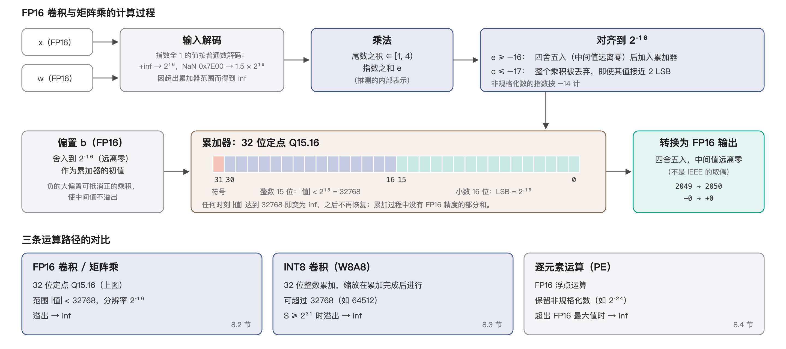

*图 8-1　FP16 乘加路径的数据格式。上两行为 FP16 卷积与矩阵乘的计算过程：输入解码、乘法、按指数之和对齐到 2⁻¹⁶、以偏置为初值的 Q15.16 定点累加和输出舍入；"尾数之积与指数之和"是根据实测推测的内部表示。下一行对比 FP16 乘加、INT8 乘加与逐元素运算三条路径的数值格式。*

#### 8.2.2 微小乘积的对齐

定点累加器只能表示 2⁻¹⁶ 的整数倍，因此每个乘积在加入累加器之前必须对齐到 2⁻¹⁶。我们发现，对齐时是否保留一个乘积，并不取决于乘积的实际大小，而取决于两个因子的指数之和。为了区分这两种可能，我们专门构造了指数之和为 −17、但尾数乘积接近 2 的用例，结果如表 8-2 所示（工具：[numerics5.py](../tools/06_numerics/numerics5.py)、[numerics6.py](../tools/06_numerics/numerics6.py)；数据：[numerics5_m6.txt](../data/06_numerics/numerics5_m6.txt)、[numerics6_m6.txt](../data/06_numerics/numerics6_m6.txt)）〔数值〕。

*表 8-2　指数之和较小的乘积的处理（乘积的实际值在 2 LSB 以内）*

| 权重 w        | 输入 x               | 指数之和 | 乘积的实际值   | ANE 输出 |
| ----------- | ------------------ | ---- | -------- | ------ |
| 1.875 × 2⁻³ | 1.875 × 2⁻¹⁴       | −17  | 1.76 LSB | 0      |
| 1.99 × 2⁻³  | 1.99 × 2⁻¹⁴        | −17  | 1.98 LSB | 0      |
| 1.5 × 2⁻⁴   | 1.9 × 2⁻¹³         | −17  | 1.43 LSB | 0      |
| 0.2         | 0.99 × 2⁻¹⁴（非规格化数） | −17  | 0.79 LSB | 0      |
| 0.125       | 1.5 × 2⁻¹³         | −16  | 1.5 LSB  | 2 LSB  |
| 0.25        | 0.5 × 2⁻¹⁴（非规格化数）  | −16  | 0.5 LSB  | 1 LSB  |

表 8-2 表明，规则是按指数判断的：当 x 与 w 的指数之和（非规格化数的指数按 −14 计）不小于 −16 时，乘积按四舍五入（中间值远离零）对齐到 2⁻¹⁶；当指数之和不大于 −17 时，整个乘积被丢弃，即使它的实际值接近 2 LSB。我们推测，乘法器输出的是尾数之积（位于 [1, 4) 区间）和指数之和，对齐移位器只为指数之和不小于 −16 的乘积保留舍入位，更小的乘积被直接移出〔推断〕。这一规则意味着，非常小的激活与较小的权重相乘时会被截去，截去的量最多接近 2 LSB（约 3 × 10⁻⁵），比"小于半个 LSB 才舍去"的常规舍入更粗。

#### 8.2.3 偏置

卷积的偏置可以在两个位置加入：作为累加器的初值，或者在累加完成、转换为 FP16 之后以浮点数相加。两种方式在溢出和舍入上的表现不同，因此可以通过实验区分。我们把权重全部设为 1，使第 0 个输出通道等于 Σx + bias，结果如表 8-3 所示（数据：[numerics5_m6.txt](../data/06_numerics/numerics5_m6.txt)）〔数值〕。

*表 8-3　偏置的加入位置*

| bias   | 输入            | ANE   | CPU        | 说明                  |
| ------ | ------------- | ----- | ---------- | ------------------- |
| −16384 | 16384 + 16384 | 16384 | 16384      | 未溢出：偏置在累加开始时已在累加器中  |
| −16384 | 16384 × 3     | inf   | 32768      | 最终值达到 32768 时仍然溢出   |
| +32    | 32736         | inf   | 32768      | 偏置与乘积一起受 ±32768 的限制 |
| 2⁻²⁰   | 0             | 0     | 9.5 × 10⁻⁷ | 偏置先被量化到 2⁻¹⁶        |
| 2⁻¹⁷   | 0             | 2⁻¹⁶  | 2⁻¹⁷       | 0.5 LSB 远离零舍入       |
| 2⁻¹⁷   | 2⁻¹⁷（权重为 1）   | 2⁻¹⁵  | 2⁻¹⁶       | 两者各自舍入为 1 LSB 后相加   |

第一行最能说明问题：两个 16384 之和本应在累加器中溢出，但当偏置为 −16384 时，结果正确，没有溢出。这只有在偏置先于乘积进入累加器时才可能发生。后几行进一步表明，偏置在进入累加器之前被以远离零的方式舍入到 2⁻¹⁶。由此可以确定，偏置是定点累加器的初值〔数值〕。这一设计带来两个后果：大的偏置与大的激活同时出现时更容易溢出；反过来，一个负的大偏置能够抵消一部分正的乘积，使中间值不溢出。

#### 8.2.4 输入解码与输出舍入

累加完成后，定点结果被转换为 FP16 输出。这一转换采用"四舍五入、中间值远离零"的方式，而不是 IEEE 754 默认的"中间值取偶"：2049 输出为 2050，−2049 输出为 −2050，4098 输出为 4100，1 + 2⁻¹¹ 输出为 1 + 2⁻¹⁰。按"中间值取偶"，这些值应分别为 2048、−2048、4096 和 1。−0 的输出为 +0〔数值〕。

输入的解码同样有一个非标准之处：FP16 中指数域全为 1 的值（即 inf 与 NaN）被当作普通的数来解码。+inf 被解码为 2¹⁶，NaN 0x7E00 被解码为 1.5 × 2¹⁶，0x7FFF 被解码为 131008。这些解码后的值超出了累加器的范围，因而使结果溢出为 inf。Bryngelson [5] 报告"NaN 在 ANE 上变为 +inf"，上述解码方式解释了这一现象的成因。另一方面，正常范围内的大输入不会先于累加器溢出：65504 × 2⁻⁴ 得到正确的 4094〔数值〕。

### 8.3 INT8 路径：32 位整数累加器

INT8 路径的累加器无法用第 8.1 节的方法测试，因为 coremltools 的激活量化需要校准，缩放因子不受控制。我们改为在 MIL 中手工构造"量化 → 反量化 → 以 Int8 权重卷积"的结构，使输入和权重量化后全部为同一个 Int8 值（127 或 −128），这样每个输出点的整数累加和 S 可以精确算出；输入与权重的缩放因子都取 2⁻ᵏ，输出的理论值为 S × 2⁻²ᵏ。每个模型同时以 `CPU_AND_NE` 和 `CPU_ONLY` 执行，整组运行期间以 IOReport 中断数确认 ANE 参与了计算（工具：[numerics_i8.py](../tools/06_numerics/numerics_i8.py)；数据：[numerics_i8/](../data/06_numerics/numerics_i8/)）〔数值，IOReport〕。中断数是按整组统计的，不能说明每个模型各在哪个设备上执行，而 ANE 与 CPU 输出相同也不能作为模型落到 CPU 的判据，因为正确的 ANE 结果可能恰好与 CPU 相同。表 8-4 只列出 ANE 输出与 `CPU_ONLY` 输出不同的模型，它们的结果不可能来自 CPU，因而确实由 ANE 计算。对没有列入的模型，判断依据是第 5.2 节的分派规则而不是输出：输入通道数 N 为 120000 以上的模型，张量的单个维度超过表 5-2 中 65536 的上限，不能放到 ANE；N 不超过 1024 的模型计算量很小，按分段器的代价规则会被放到 CPU〔推断〕。N = 2080 的模型则是输出相同而未必在 CPU 上执行的例子：ANE 与 CPU 都输出 2048，正是理论值 2047.6 的正确舍入，它很可能就由 ANE 计算，只是结果恰好与 CPU 相同；表 8-4 的结论不依赖这几个点。此外，为了在 ANE 上达到 S = 2³¹ 而不受通道数上限的限制，我们改用 N = 65536 的 kh×1 卷积。表 8-4 给出了结果〔数值〕。

*表 8-4　INT8 路径的累加范围*

| 卷积                            | 整数累加和 S     | 缩放          | 理论输出         | ANE 输出      |
| ----------------------------- | ----------- | ----------- | ------------ | ----------- |
| 1×1，N = 4096–16384，127 × 127  | 2²⁶–2²⁸     | 2⁻¹²        | 16129–64516  | 16128–64512 |
| 1×1，N = 65536，(−128) × (−128) | 2³⁰         | 2⁻¹⁶ / 2⁻¹⁸ | 16384 / 4096 | 准确          |
| 2×1，N = 65536                 | 2³¹         | 2⁻¹⁶ / 2⁻¹⁸ | 32768 / 8192 | inf         |
| 3×1，正负交替（部分和不超过约 2³⁰）         | 1.008 × 2³⁰ | 同上          | 16512 / 4128 | 准确          |

表 8-4 表明，INT8 路径的累加器是 32 位有符号整数：S = 2³⁰ 时结果准确，S = 2³¹（即 int32 最大值加 1）时溢出。溢出与输出值的大小无关：缩放取 2⁻¹⁸ 时，S = 2³¹ 对应的输出只有 8192，仍然溢出。与 FP16 路径一样，溢出的结果是无穷大而不是饱和。第一行的输出达到 64512，超过了 FP16 路径的 32768 上限，说明 INT8 路径的累加在整数域中完成，缩放在最后进行，不经过 FP16 路径的定点累加器〔数值〕。一个 Int8 × Int8 乘积的最大值为 2¹⁴，一个输出点需要累加约 13 万个最大乘积才会溢出，常见网络中输入通道数与卷积核面积之积远小于这一数量，因此 INT8 路径的溢出在实际中几乎不会发生。

### 8.4 逐元素运算：浮点路径

逐元素运算由 PE 执行。我们用第 8.1 节的方法测试了加法和乘法，结果如表 8-5 所示（数据：[numerics3_m6.txt](../data/06_numerics/numerics3_m6.txt)、[numerics4_m6.txt](../data/06_numerics/numerics4_m6.txt)）〔数值〕。

*表 8-5　逐元素运算的数值行为*

| 用例            | ANE   | CPU   | 说明                 |
| ------------- | ----- | ----- | ------------------ |
| 2048 + 1      | 2050  | 2048  | 舍入方式与乘加路径相同：中间值远离零 |
| 65504 + 0     | 65504 | 65504 | 没有 32768 的限制       |
| 16384 + 16384 | 32768 | 32768 | —                  |
| 2⁻²⁴ + 0      | 2⁻²⁴  | 2⁻²⁴  | 保留非规格化数            |
| 2⁻¹² × 2⁻¹²   | 2⁻²⁴  | 2⁻²⁴  | —                  |
| 256 × 256     | inf   | inf   | 超过 FP16 范围时才溢出     |
| NaN + 1       | inf   | NaN   | 输入解码方式与乘加路径相同      |

表 8-5 显示，逐元素运算的结果在两个方面与乘加路径不同。在范围上，逐元素加法的结果可以超过 32768，例如 65504 + 0 得到正确的 65504，只有当结果超出 FP16 的最大值时才溢出为无穷大。在精度上，2⁻²⁴ 这样的非规格化数能够被完整保留，而乘加路径的分辨率只有 2⁻¹⁶。这两点都不符合 Q15.16 定点累加器的特征，而与 FP16 浮点运算的特征一致。由此推断，PE 以 FP16 浮点格式进行运算，它与乘加阵列使用的是不同的运算单元〔数值，推断〕。这与 Bryngelson [5] 所描述的"NE 负责乘加、PE 负责逐元素运算"的分工一致。另一方面，两条路径的舍入方式（中间值远离零）和输入解码方式（inf 与 NaN 按普通数解码）相同，推测二者共用相同的格式转换逻辑〔推断〕。

### 8.5 激活函数

#### 8.5.1 查找表的结构

maderix [4] 在 M4 上发现，sigmoid 等激活函数由存放在 `__KERN_0` 段中的 33 个 FP16 采样点加线性插值实现。为了得到 M6 上每个函数的完整实现方式，我们为每个激活函数编译了一个"1×1 卷积 + 激活函数"的小模型，从编译产物的 `__KERN_0` 段中读出非权重的数据（工具：[opvariants.py](../tools/06_numerics/opvariants.py)；产物：[opv_hwx/](../data/06_numerics/opv_hwx/)）。sigmoid 等函数的表位于段首偏移 0x8 处；sqrt、rsqrt、inverse、log 和 floor 的表有单独的符号 `K<哈希>_actlut`。字段跟踪表明，NE 配置中的非线性模式只区分"无""ReLU"和"查表"三类，sigmoid、tanh、GELU 等都写成同一个"查表"值（表 5-13），具体是哪个函数完全由表的内容决定〔编译器〕。表 8-6 汇总了各函数的表内容〔HWX〕。

*表 8-6　激活函数查找表的内容（各 33 个 FP16 值）*

| 函数                   | 表的内容                                                      | 实现方式                                   |
| -------------------- | --------------------------------------------------------- | -------------------------------------- |
| relu、abs、sign、square | 无表                                                        | ALU 直接计算                               |
| sigmoid              | σ(−8), σ(−7.5), …, σ(8)                                   | [−8, 8] 等距 33 点，存精确采样值                 |
| tanh                 | tanh(0), tanh(0.125), …, tanh(4)                          | 只存正半轴，利用奇对称                            |
| erf                  | erf(0), erf(1/16), …, erf(2)                              | 只存正半轴，利用奇对称                            |
| sin                  | sin(0), sin(π/64), …, sin(π/2)                            | 只存四分之一周期，其余由对称性得到                      |
| exp                  | 2^(0/32), 2^(1/32), …, 2^(32/32)                          | 换算为 2 的幂：整数部分写入浮点指数，表只覆盖 [0, 1] 内的小数部分 |
| log                  | 4 个特殊值，后接 log₂(0.5) 至 log₂(0.9375)，间距 1/64                | 区间归约：log₂(尾数) 加指数，再乘以 ln 2             |
| sqrt、rsqrt           | 4 个特殊值，后接自变量 0.5 至 2.0、间距 1/16 的 25 个函数值，其余位置为 0          | 区间归约，按指数的奇偶拆分                          |
| inverse              | 4 个特殊值，后接 1/0.5 至 1/0.9375，间距 1/64                        | 区间归约                                   |
| gelu                 | [−4, 4]，间距 0.25；值为拟合值（例如 gelu(0.25) 应为 0.1497，表中为 0.1436） | 为降低整体误差而拟合                             |
| silu                 | [−8, 8]，间距 0.5；值为拟合值（silu(0.5) 应为 0.311，表中为 0.296）        | 为降低整体误差而拟合                             |
| floor                | 表头为 −inf、inf，其余为 0                                        | 机制不同于普通查表                              |

所有查表函数均采用 33 个采样点进行线性插值，但各函数使用的采样网格并不相同。编译器用两种手段让有限的 33 个点覆盖尽可能高的精度：对于具有对称性的函数（tanh、erf、sin），只存储一部分区间，其余由对称性得到；对于 exp、log、sqrt、rsqrt 和 inverse，先把输入归约到一个倍频程内，指数部分单独处理，表只覆盖归约后的区间。此外，gelu 和 silu 的表值不是函数的精确采样值，而是为了使整个区间上的误差最小而拟合的结果〔HWX〕。

#### 8.5.2 误差

我们在每个函数的定义域上取约 1.6–2.0 万个不同的 FP16 输入（正值函数用对数网格），以 float64 的精确值为参考，比较 ANE 与 CPU（FP16）的误差，结果如表 8-7 和图 8-2 所示（工具：[lut_err.py](../tools/06_numerics/lut_err.py)、[lut_plot.py](../tools/06_numerics/lut_plot.py)；数据：[f3_lut_m6.txt](../data/06_numerics/f3_lut_m6.txt)、[lut_m6/](../data/06_numerics/lut_m6/)）〔数值〕。

*表 8-7　激活函数的误差（以 float64 精确值为参考）*

| 函数            | 测试区间         | 不同输入点数 | ANE 最大绝对误差 | ANE 最大相对误差（ulp） | CPU 最大绝对误差 | ANE 与 CPU 结果不同的点 |
| ------------- | ------------ | ------ | ---------- | --------------- | ---------- | ---------------- |
| sigmoid       | [−12, 12]    | 18092  | 3.4 × 10⁻³ | 811             | 7.0 × 10⁻⁴ | 81.9%            |
| tanh          | [−6, 6]      | 18092  | 1.6 × 10⁻³ | 11.0            | 9.6 × 10⁻⁴ | 85.0%            |
| gelu（EXACT）   | [−8, 8]      | 18432  | 6.2 × 10⁻³ | 12632           | 1.7 × 10⁻³ | 81.0%            |
| gelu（TANH 近似） | [−8, 8]      | 18432  | 6.2 × 10⁻³ | 12632           | 3.9 × 10⁻³ | 92.6%            |
| silu          | [−12, 12]    | 18092  | 1.5 × 10⁻² | 28560           | 4.8 × 10⁻³ | 88.7%            |
| erf           | [−4, 4]      | 18432  | 8.6 × 10⁻⁴ | 3.0             | 9.8 × 10⁻⁴ | 58.0%            |
| sin           | [−8, 8]      | 18432  | 6.3 × 10⁻⁴ | 45.3            | 2.4 × 10⁻⁴ | 34.8%            |
| exp           | [−12, 10]    | 18084  | 1.0 × 10²  | 9.1             | 1.0 × 10¹  | 47.9%            |
| log           | [2⁻¹⁰, 1000] | 20433  | 6.6 × 10⁻³ | 91.0            | 2.0 × 10⁻³ | 51.2%            |
| sqrt          | [2⁻¹⁰, 1000] | 20433  | 1.8 × 10⁻² | 1.2             | 7.8 × 10⁻³ | 22.8%            |
| rsqrt         | [2⁻⁶, 1000]  | 16337  | 8.1 × 10⁻³ | 2.1             | 2.2 × 10⁻² | 79.2%            |
| inverse       | [2⁻⁶, 1000]  | 16337  | 4.4 × 10⁻¹ | 13.5            | 5.9 × 10⁻¹ | 78.4%            |

表中同时给出绝对误差和 ulp 误差。绝对误差直接表示 ANE 输出与精确值之差的绝对值；ulp 误差则将这一差值除以精确值所在指数区间内相邻两个 FP16 可表示数之间的距离，用于衡量误差相当于多少个 FP16 表示间隔。具体而言，当 |精确值| ∈ [2ᵉ, 2ᵉ⁺¹) 时，1 ulp = 2ᵉ⁻¹⁰；当 |精确值| < 2⁻¹⁴ 时，1 ulp = 2⁻²⁴。因而 ulp 的大小随指数区间分段变化，与 NumPy spacing 对 FP16 的定义一致（工具：lut_ulp.py；数据：lut_ulp_m6.txt）。两种指标反映的误差尺度不同，需要根据函数的输出特性对照解读。对于输出有界且在部分区间趋近于零的函数（sigmoid、gelu、silu），精确值接近零时 FP16 的 ulp 极小，即使绝对误差很小，也可能对应数百甚至数千 ulp，因此绝对误差更能反映实际偏差。例如，sigmoid 的最大误差达到 811 ulp，出现在 x ≈ −9.94 处；此时精确值仅约 4.8 × 10⁻⁵，而 ANE 对超出 [−8, 8] 的输入直接饱和，输出为 0。相反，对于输出动态范围较大的函数（exp、sqrt、rsqrt、inverse），输出幅值增大时 FP16 的表示间隔也随之增大，因此较大的绝对误差未必意味着较低的数值精度，此时 ulp 误差更具有可比性。例如，exp 的最大绝对误差可达 100，但折算后仅为 9.1 ulp。

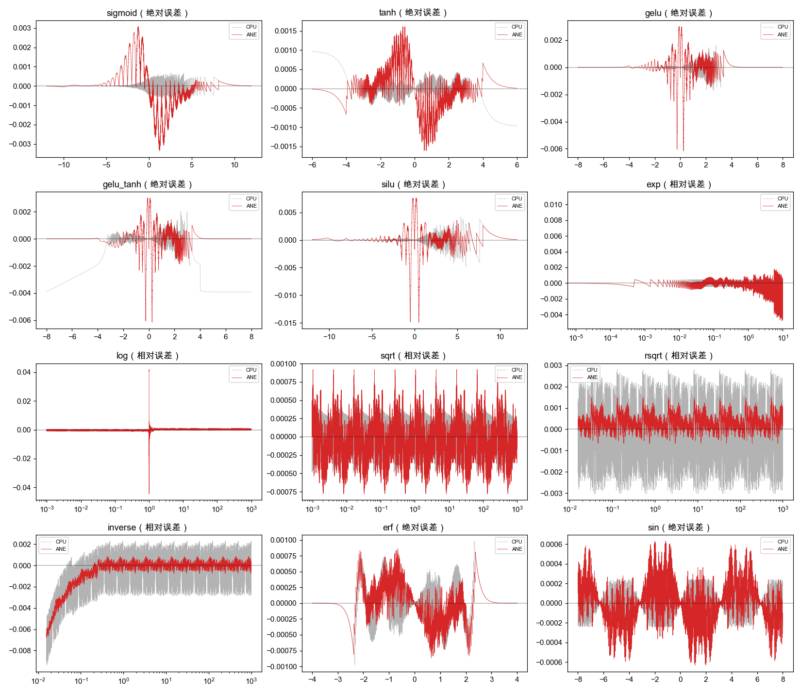

*图 8-2　各激活函数在 ANE 上的误差（工具：[lut_plot.py](../tools/06_numerics/lut_plot.py)；数据：[lut_m6/](../data/06_numerics/lut_m6/)）。*

误差的分布与表 8-6 的结构相互印证，图 8-3 放大了其中四个函数的误差曲线。sigmoid 的误差在每个采样点处降到最低，采样点处的误差只有相邻区间中点的 4–11%，这是等距采样加线性插值的典型特征；输入超出 ±8 后，输出直接饱和。tanh 在 ±4 处的不连续，正是因为表只覆盖 [0, 4]，超出部分直接饱和。silu 在 ANE 上的输出与"x 乘以 ANE 的 sigmoid(x)"只有 38% 的点相同，说明它使用自己的查找表，而不是由 sigmoid 组合而成。gelu 和 silu 的误差零点不在等距网格上，这是表值为拟合值的结果。sqrt 和 rsqrt 的误差分别不超过 1.2 和 2.1 ulp，maderix [4] 据此类误差认为它们由专用硬件计算；本文的结果表明，区间归约本身足以使 33 点查表达到这一精度，不一定需要专用硬件〔HWX，数值，推断〕。还有一点值得注意：在 ANE 上，gelu 的 EXACT 模式与 TANH 近似模式使用同一张表，输出逐位相同，而在 CPU 上两种模式有 78% 的点不同。因此，在 ANE 上选择哪一种 gelu 模式不影响结果。

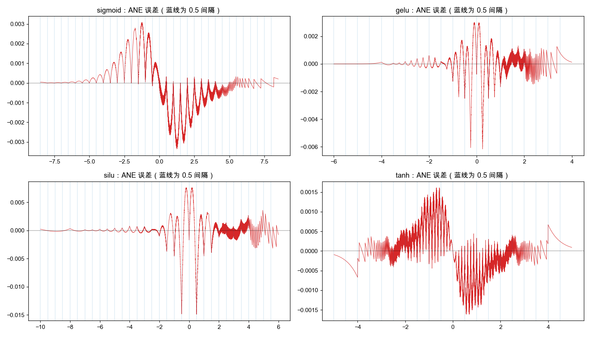

*图 8-3　sigmoid、gelu、silu 和 tanh 在 ANE 上的绝对误差近景（ANE 输出减 float64 精确值）。浅蓝竖线为 0.5 的间隔，与 sigmoid 和 silu 查找表的网格对应；tanh 与 gelu 的网格分别为 0.125 和 0.25（工具：[lut_plot.py](../tools/06_numerics/lut_plot.py)；数据：[lut_m6/](../data/06_numerics/lut_m6/)）。*

### 8.6 与 M4 及文献的比较

我们在 M4（h16g）上重复了 FP16 乘加路径的基本测试，包括单个输入与两数之和的溢出点、非规格化输入的保留与丢弃、输出舍入以及不同权重下的刻度，结果与 M6 逐项相同（数据：[numerics2_m4.txt](../data/06_numerics/numerics2_m4.txt)）〔数值〕。这说明 Q15.16 定点累加器和舍入方式至少从 H16 一代起没有变化；inf 与 NaN 的解码方式没有在 M4 上单独测试。偏置、微小乘积的指数规则、INT8 路径、逐元素运算和激活函数只在 M6 上测试过。表 8-8 把本文的结果与 Bryngelson [5] 的描述对照。

*表 8-8　数值行为与文献的对照*

| 项目          | Bryngelson [5]             | M6 与 M4（本文）               |
| ----------- | -------------------------- | ------------------------- |
| 累加器         | FP32 级的宽累加器                | 32 位定点，Q15.16             |
| 32768 附近的行为 | M1 和 A14 饱和于 32768，M5 不饱和  | 达到 32768 即变为 inf，并保持为 inf |
| 归约顺序        | M1 第一级为 radix-4 的 FP16 部分和 | 没有 FP16 部分和               |
| 非规格化数       | M1 清零，M5 保留                | 乘加路径按指数之和决定是否保留；逐元素路径保留   |
| 输出舍入        | 中间值取偶                      | 中间值远离零                    |
| NaN 输入      | 变为 +inf                    | 按普通数解码为大数，使累加器溢出为 inf     |

两者的差别可能有两个来源：一是不同代产品的硬件确实不同，二是测试方法不同。例如，Bryngelson 所说的"在 32768 饱和"与本文的"在 32768 溢出为 inf"指向同一个上限 2¹⁵，而这一上限正是 Q15.16 定点格式整数部分的上限。

### 8.7 小结

本章回答了 ANE 在不同运算路径上如何计算数值。FP16 卷积和矩阵乘使用 32 位定点累加器（Q15.16），绝对值达到 32768 即溢出为无穷大，分辨率为 2⁻¹⁶，偏置是累加器的初值，最终结果以中间值远离零的方式舍入为 FP16；INT8 卷积使用 32 位整数累加器，缩放在累加完成后进行；逐元素运算使用保留非规格化数的 FP16 浮点运算。三条路径的溢出结果都是无穷大而不是饱和。激活函数由 33 点线性插值的查找表实现，常用激活函数的最大误差在 10⁻³ 至 10⁻² 量级。FP16 乘加路径的基本行为在 M4 上复测，结果完全相同。

本章的结论都在单个算子上测得：累加测试使用 64 个输入通道的 1×1 卷积，在一趟内完成累加，对需要多趟或多个 TD 才能完成累加的层，部分和是否经 FP16 中转没有测试；这些数值行为在完整网络中如何累积，本文也没有评估。第 14 章中一次处理一张图像时与 GPU 的 top-1 不一致，本章的结论只能排除单趟累加中的求和顺序这一原因。M1 与 M5 是否同样使用定点累加器，以及与文献中"FP32 级累加器"的差别来自硬件还是测法，仍待验证（第 16.2 节）。由本章结论导出的部署建议集中在第 15.2 节（表 15-1）。

## 9. 存储层次与数据搬运

第 7 章在权重常驻、激活留在片上的条件下测量了计算阵列的能力；实际网络中，数据往往需要在 DRAM 与片上存储之间搬运，数据通路的容量和带宽同样决定性能。ANE 搬运的数据分为两类。权重（weights）是模型的参数，在编译时确定，每次推理时由 Kernel DMA 从 DRAM 读入各 NE 的权重缓冲。激活（activations）是在网络中流动的张量，随每次推理的输入而变化：网络的输入和输出位于 DRAM 中，由 Tile DMA 在 DRAM 与 L2 之间搬运；层与层之间的中间结果，在 L2 容量允许、且编译器能把相邻的层连在一起执行时留在 L2 中，否则要写回 DRAM，再由下一层读回。本章依次研究 L2、权重通路、激活通路和 DRAM。主要结论有四点。第一，编译器把每个 ANE 的 L2 当作恰好 2 MiB 使用；中间张量超过 2 MiB 时被切分为若干块，每块连续执行完整条链，中间结果不离开片上。第二，原生核读权重的带宽约为 150 GB/s，与每层权重的大小和卷积核形状无关（改写核受另一个按权重元素计量的环节限制，第 7.4.2 节）；单个 ANE 已接近 DRAM 带宽的上限，两个 ANE 合计也无法明显超过。第三，激活通路的带宽每个 ANE 只有约 35–40 GB/s，每个 TD 至多读 2 个、写 1 个 DRAM 张量。第四，DRAM 的理论带宽为 170.5 GB/s，ANE 单独使用时可达约 150–159 GB/s，与 GPU 同时使用时两者大致平分。

### 9.1 测试方法

本章的问题可以分为两类，所用的方法也不同。第一类问题是片上存储的容量和组织，例如 L2 有多大、中间张量如何切块、bank 如何映射。这些信息直接体现在编译器的内存分配上，而计时实验难以提供有效信息：后面将会看到，中间张量从 0.5 MB 增至 16 MB，每像素的耗时不升反降，没有任何拐点。因此，对这类问题，我们主要比较编译产物：改变张量大小或编译选项，观察 TD 序列的长度、块数和地址寄存器如何变化（工具：[anecc.m](../tools/common/anecc.m)、[td_widths.py](../tools/lib/td_widths.py)）〔HWX，HAL〕。

第二类问题是各条数据通路的带宽。对这类问题必须进行实测，但需要把搬运时间与计算时间、主机开销分开。对于权重通路，我们构造计算量很小的模型（例如宽度只有 16 的 1×1 卷积链），使读权重的时间远大于计算时间，再比较"每层权重各不相同"与"所有层共享一份权重"两个版本：后者的权重常驻片上，两者的耗时之差就是读权重的代价。对于激活通路，我们构造只含逐元素运算、张量足够大的模型，使激活的读写成为瓶颈。第 6 章表明，Core ML 的调用总耗时中含有随任务时长变化的主机唤醒开销，这一开销会混入计时斜率，使带宽被低估；因此，本章的带宽数字以 kdebug 固件时间戳得到的 ANE 任务时长为准，以计时得到的结果只作为参照〔kdebug，计时〕。此外，我们用 IOReport 中的 DRAM 带宽与频率档位统计观察内存控制器的状态，并让 GPU 同时读取内存，测量 ANE 与 GPU 共享 DRAM 的情况〔IOReport〕。

### 9.2 L2

#### 9.2.1 容量

L2 的物理容量无法直接读取，但编译器如何使用 L2 可以通过编译选项来探测。`ANECCompile` 接受一个名为 `L2Size` 的选项（单位为 kB，1 kB 按 1024 字节计），它被传给编译器参数对象的 `setL2Size`。我们用不同的取值编译同一个模型，并比较所得的 TD 序列；之所以只比较 TD 序列而不比较整个文件，是因为文件中的版本信息会记录编译选项本身。表 9-1 给出了结果（数据：[l2sz/](../data/07_memory/l2sz/)；模型生成：[l2res.py](../tools/07_memory/l2res.py)）〔HWX〕。

*表 9-1　不同 `L2Size` 取值下 TD 序列的变化*

| 模型                    | ≤ 1024 kB | 1280 kB | 1536–2047 kB | 2048 kB | ≥ 2049 kB |
| --------------------- | --------- | ------- | ------------ | ------- | --------- |
| 1×1 卷积链，4 MiB 张量      | 序列变长      | 序列变长    | 与默认相同        | 与默认相同   | 与默认相同     |
| 残差块，1 MiB 张量，多个张量同时存活 | 序列变长      | 序列变长    | 长度相同，内容不同    | 与默认逐字相同 | 与默认逐字相同   |
| 残差块，2 MiB 张量          | —         | 序列变长    | 长度相同，内容不同    | 与默认逐字相同 | 与默认逐字相同   |

表 9-1 中有两点值得注意。其一，在多个张量同时存活的残差块上，只有取值不小于 2048 kB 时，TD 序列才与默认编译逐字相同，2047 kB 时就已不同，说明默认值恰为 2048 kB；单一的卷积链在 1536 kB 以上即与默认相同，不足以区分。其二，取值从 2049 kB 一直增大到 4 GB，TD 序列都与默认相同，说明有效值被限制在 2 MiB，或者分配器无法利用更大的空间。

比较默认编译与 `L2Size = 2047` 的残差块产物，可以看出编译器确实用到了 2 MiB 的顶端。两者共有 48 个字不同，主要位于 0x10xx 一组地址寄存器（如 0x1044、0x1052、0x1053）中，我们推断这组寄存器描述的是 L2 内的地址与跨步〔推断〕。默认编译时，一个 0.5 MiB 的缓冲区被放在偏移 0x180000 处，即占据 [1.5 MiB, 2 MiB) 的区间，正好顶到 0x200000；当 L2 容量减少 1 kB 后，该地址区间已无法容纳这一缓冲区，编译器因此将其重新分配至偏移 0x080000 处〔HWX〕。这一结果与另外两方面的证据一致：v24 布局中 L2 地址与跨步字段从 bit 4 起共 17 位，按 16 字节的粒度计算，可寻址的上限正好是 2²¹ 字节，即 2 MiB；HAL 参数表中单个操作数的片上上限为 2 MiB（偏移 0x1d8），L2 的最大跨步为 2 MiB − 16（偏移 0x218）〔编译器，HAL〕。

综合以上证据，我们得出结论：编译器把每个 ANE 的 L2 当作恰好 2 MiB 来使用，并且会用满这一空间；两个 ANE 合计 4 MiB。maderix [2] 曾根据 M4 上 24–32 MB 附近的性能下降推断"片上 SRAM 约 32 MB"，后来在 Part 4 [4] 中改用 2 MiB 的单操作数阈值来描述；本文的结果与后者一致。

#### 9.2.2 中间张量的切块

对于超过 2 MiB 的中间张量，下述实验揭示了编译器的切块行为。我们首先用计时测量了 1×1 卷积链（256 通道，高度为 1，宽度 1024–32768，中间张量 0.5–16 MB）的每层耗时，结果如表 9-2 所示（数据：[c12_run.txt](../data/07_memory/c12_run.txt)）〔计时〕。

*表 9-2　中间张量大小与每层耗时（256 通道 1×1 卷积链，双 ANE）*

| 中间张量   | 每层耗时     | 每千像素耗时  | 边际吞吐        |
| ------ | -------- | ------- | ----------- |
| 0.5 MB | 5.4 µs   | 5.27 µs | 24.9 TFLOPS |
| 2 MB   | 19.0 µs  | 4.63 µs | 28.3 TFLOPS |
| 4 MB   | 32.7 µs  | 3.99 µs | 32.9 TFLOPS |
| 8 MB   | 61.5 µs  | 3.75 µs | 34.9 TFLOPS |
| 16 MB  | 114.0 µs | 3.48 µs | 37.7 TFLOPS |

张量越大，每个像素的耗时反而越短，在 2 MiB 处没有出现任何拐点。如果 16 MB 的中间张量每层都写回 DRAM 再读出，所需带宽约为 280 GB/s，超过了 DRAM 能够提供的带宽。这说明中间结果并没有进入 DRAM。

编译产物揭示了其中的机制。我们把同一组模型分别做成单层和两层两个版本，只编译、不执行，比较 TD 序列的长度（数据：[c1_hwx/](../data/03_compile/c1_hwx/)）。单层模型的 TD 序列长度始终为 0x1d8 字节，与张量大小无关，说明单层模型的输入和输出直接位于 DRAM，不需要切块。两层模型则不同：中间张量为 0.5 MB 和 1 MB 时，单 ANE 程序的 TD 序列长 0x340 字节；从 2 MB 起，每增加 2 MiB，序列就增加 0x320 字节，即两层各多出一个 TD。由此推得块数为

```
块数 = ⌊中间张量大小 ÷ 2 MiB⌋ + 1
```

即每一块都必须严格小于 2 MiB：2 MB 的张量切为 2 块，4 MB 切为 3 块，16 MB 切为 9 块（每块约 1.78 MB）〔HWX〕。这一规则来自只有一个中间张量的两层模型。在更长的链中，一层的输入和输出两个中间张量需要同时驻留在 L2 中，块也就更细：第 10.5 节表 10-4 中宽 6144、8192、12288 和 14336 的 256 通道链（中间张量 3–7 MiB）每层分别切为 4、5、7 和 8 块，符合"块数 = ⌊中间张量大小 ÷ 1 MiB⌋ + 1"〔HWX，推断〕。块宽是 128 列的整数倍，并且尽量均分。切块之后，每一块连续执行完整条链的所有层，再处理下一块，中间结果始终留在 L2 中。这正是计时实验中看不到拐点的原因：切块只是改变了执行的顺序，而不需要额外的 DRAM 读写。这一规则与 HAL 参数表中 2 MiB 的单操作数上限一致，也与 maderix [4] 所说的"超过 2 MiB 就分块流式处理"一致。图 9-1 给出了中间张量的切块。

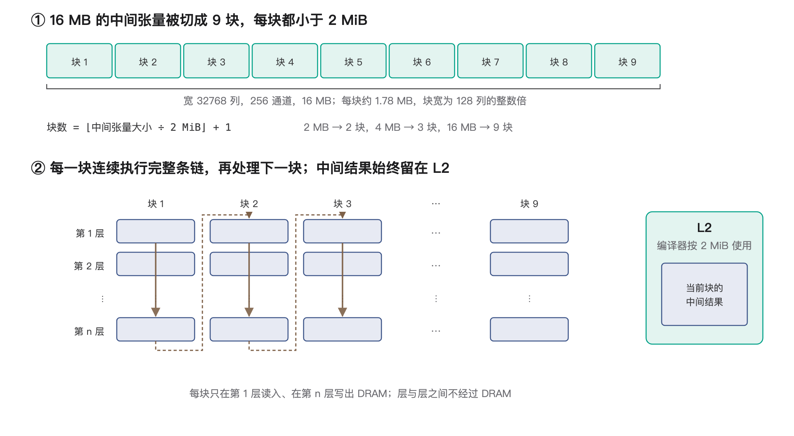

*图 9-1　中间张量的切块。① 16 MB 的中间张量（256 通道，宽 32768 列）被切成 9 块，每块约 1.78 MB；② 每一块连续执行完整条链，中间结果留在 L2 中，只在第一层读入、在最后一层写出 DRAM。*

在双 ANE 程序中，编译器沿用单 ANE 时的切块网格，再按整块把块列表分给两个 ANE。块数为奇数时，两个 ANE 的工作量无法均分，多出的一块总是分给 ANE1，这使双 ANE 的执行时间由 ANE1 决定，在所测的宽度中，执行时间最多比均分长约 19%，相当于吞吐降低约 16%。这一问题在第 10 章详细讨论。

#### 9.2.3 bank 与行步长

maderix [4] 在 M4 上发现，SRAM 由 64 个 bank 组成，以 16 字节交错，编译器会选择合适的行步长以避免 bank 冲突。为了在 M6 上验证这一点，我们编译了 3×3 卷积链（64 或 128 通道，高 16，宽 8–136），每个模型分别以默认选项和关闭 bank 冲突优化（`DisableL2BankConflictOpt=true`）编译一次，比较 L2 张量的跨步寄存器（工具：[l2bank.py](../tools/07_memory/l2bank.py)；数据：[l2bank_table.txt](../data/07_memory/l2bank_table.txt)）〔HWX〕。

关闭优化时，0x1044、0x1053 等寄存器（我们推断它们是 L2 张量的通道跨步）的值都是 1024 字节的整数倍；默认编译时，编译器在这些值上再加 512 或 768 字节，二者随宽度交替出现。1024 字节恰好等于 64 个 bank × 16 字节，即 bank 映射循环一周的长度：如果每个通道平面的跨步是 1024 字节的整数倍，所有平面都会从同一个 bank 开始，相邻通道的访问就会冲突；加上 512 或 768 字节后，平面的起点被错开 32 或 48 个 bank。这一结果与 HAL 参数表中 bank 数（64，偏移 0x1e8）和访问粒度（16 字节，偏移 0x1e0）一致，为"64 个 bank、16 字节交错"的结构提供了 M6 编译产物上的证据〔HWX，HAL〕。两种编译的 `exe_cycles` 完全相同，说明编译器的性能模型在这些形状上没有为 bank 冲突计算惩罚。

### 9.3 权重通路

#### 9.3.1 权重的存放

第 5.6 节和第 7.3.1 节已经说明，编译器为每个 NE 设定 64 KiB 的常驻权重上限，16 个 NE 合计 1 MiB。超出这一容量的权重必须在每次调用时从 DRAM 读入。为了确认这一点，我们在 512 通道、宽 16 的 1×1 卷积链上比较了"每层权重各不相同"与"所有层共享一份权重"两个版本（每层权重 0.5 MB），结果如表 9-3 所示（数据：[c2b_run.txt](../data/07_memory/c2b_run.txt)）〔计时〕。

*表 9-3　独立权重与共享权重的耗时（512 通道，宽 16，单 ANE）*

| 层数  | 总权重   | 独立权重   | 共享权重   | 差值     |
| --- | ----- | ------ | ------ | ------ |
| 16  | 8 MB  | 195 µs | 163 µs | 33 µs  |
| 32  | 16 MB | 264 µs | 164 µs | 100 µs |
| 64  | 32 MB | 382 µs | 195 µs | 187 µs |
| 128 | 64 MB | 733 µs | 271 µs | 462 µs |

总权重为 8 MB 时，独立权重的版本已经比共享权重的版本慢 33 µs，并且差值随总权重增长，大致与之成正比（每 MB 约 4–7 µs；这一计时含主机侧影响，读权重带宽的准确值见第 9.3.2 节的固件时间戳）。这说明权重不能整体驻留在片上，每次调用都要从 DRAM 流式读入；HAL 参数表中 16 MiB 的"流式权重上限"（偏移 0x230）应当描述的是编译器一次流式读入的上限，而不是片上容量〔计时，HAL，推断〕。

#### 9.3.2 带宽

表 9-3 中的差值来自 Core ML 的调用耗时，其中混有随任务时长变化的主机唤醒开销（第 6.5 节），直接用它计算会低估权重通路的带宽。因此，我们以 kdebug 记录的 ANE 任务时长为依据来确定这一带宽。在表 9-3 所用的形状上，ANE 任务时长随权重量平滑增长，每 MiB 约 6.9 µs，即约 152 GB/s，在 48 MiB 至 52 MiB 之间没有任何台阶（数据：[sw_ktrace_sum.txt](../data/07_memory/sw_ktrace_sum.txt)）〔kdebug〕。

上述测量只覆盖了 48–52 MiB 一个较窄的范围。为了确认这一带宽在权重量大得多时仍然成立，我们又选用了一种权重量很大、且在实际应用中受读权重带宽限制的结构：大语言模型解码阶段的多层感知机。在解码阶段，每生成一个词元都要把全部权重读一遍，而计算量很小，因此它是 ANE 上典型的读权重受限负载。我们按 2560 → 9216 → 2560 的形状构造多层感知机，每对线性层的权重约 94 MB，把 1–4 对串联起来，总权重为 94–377 MB。这组模型的每次调用耗时都在 1 ms 左右或更长，按第 6.5.2 节的结果，此时主机侧的完成开销已经饱和、不再随任务时长变化，因此可以直接用计时斜率求带宽。耗时对权重量的斜率给出 152 GB/s，与固件时间戳的结果一致（数据：[bw_mlp_run.txt](../data/07_memory/bw_mlp_run.txt)）〔计时〕。这组模型的权重总量远超片上存储和 16 MiB 的系统级缓存，因此约 150 GB/s 反映的是从 DRAM 读取权重的速度。

以 Core ML 计时斜率测得的读权重带宽在总权重较小时只有约 130 GB/s，并在 48–50 MiB 附近出现一个约 55 µs 的台阶。固件时间戳表明，ANE 任务本身在台阶前后没有任何变化，台阶和偏低的斜率全部来自第 6.5 节所述的主机唤醒开销：任务时长超过约 350 µs 后，等待结果的 CPU 进入更深的空闲状态，每次调用的完成侧开销随之增加，这部分开销随层数增长并混入了计时斜率。

读权重的带宽与每层权重的大小和卷积核的形状都无关。在总权重相同的条件下，把每层权重从 128 KB 改为 8 MB（64 倍），计时斜率给出的带宽都在 127–133 GB/s 之间，四种切法的总耗时也几乎相同（数据：[bw_blocksize_run.txt](../data/07_memory/bw_blocksize_run.txt)）。在 8×8 的小空间尺寸上，每层 4.5 MB 权重的 3×3、9×1 和 1×1（1536 通道）卷积都受读权重限制，每层耗时都约为 33.4 µs（数据：[bw_kshape_run.txt](../data/07_memory/bw_kshape_run.txt)）〔计时〕。由此可见，128 KB 的权重块已经足以使通路达到满速。

#### 9.3.3 权重与系统级缓存

M6 的 SoC 中存在一个由 CPU、GPU 和 ANE 共享的 SLC（编译器中称为 MCache，参数表中的容量为 16 MiB）。权重是否经过 SLC，会影响读权重的带宽和与其他处理器的相互干扰。两方面的证据表明，在 Core ML 的默认路径上，权重不使用 SLC。其一，内核日志中记录的 Core ML 运行时编译参数包含 `--disable-cache-prefetch-mask=1` 和 `--enable-memcache-kernel-allocation=false`，即关闭了权重的缓存预取和缓存分配；驱动中虽然实现了完整的 SLC 预取逻辑，但在这一路径上没有启用〔内核〕。其二，如果总权重小于 SLC 容量（16 MiB）时能够命中 SLC，小权重量的模型应当读得更快；而实测中没有观察到这样的迹象：计时斜率在 8–32 MB 区间并不高于更大的权重量〔计时〕。双 ANE 程序在两个 ANE 之间交换数据时，编译器为每个 ANE 设置了 DSID 参数，我们推测在这种情况下数据交换经过 SLC（第 5.8.2 节），但这并不代表权重可以由 SLC 读取。

#### 9.3.4 两个 ANE 共享权重带宽

在双 ANE 程序中，两个 ANE 各自读取一份权重（第 5.8.3 节）。如果两个 ANE 各有独立的读权重带宽，双 ANE 程序在读权重受限时也应获得接近两倍的加速，实测不支持这一点。首先，单个 ANE 读权重时已经达到约 150–159 GB/s（第 9.3.2 节、第 7.5 节），约为 DRAM 理论带宽 170.5 GB/s（第 9.5 节）的 90%，第二个引擎即使有独立的通路，也只能分到剩余的很小一部分。其次，在原生核上，把卷积链改为每层使用不同的权重后，双 ANE 时两个引擎合计的读权重速率约为 140 GB/s，相对单 ANE 的加速从共享权重时的约 1.9 倍降至约 1.4 倍（第 10.4 节）〔计时〕。最后，每个 ANE 在 IOReport 中有两条 DRAM 链路（L0 和 L1），读权重时两条链路各承担一半，比例不随负载变化（数据：[pmp_L96.txt](../data/07_memory/pmp_L96.txt)、[pmp_L100.txt](../data/07_memory/pmp_L100.txt)）〔IOReport〕。因此，读权重的瓶颈不在单个 ANE 的链路上，而在 DRAM 一侧或两个 ANE 共用的通路上〔推断〕。

另有两组实验不能用来判断 DRAM 带宽的共享。核宽 9–15 的改写核按行切分后，每个 ANE 只处理一半的行，每层耗时却是单 ANE 处理同样行数时的 2 倍，整体吞吐与单 ANE 相同（第 7.4.2 节、第 10.4 节、第 10.7 节），但这类核的瓶颈是一个按权重元素计量的环节，它说明的是两个引擎共享这一环节；第 7.5 节中被切分到两个 ANE 上的 2 位和 3 位调色板模型，两个引擎各存一份完整的权重，而每个引擎实际从 DRAM 读取多少尚不清楚。

### 9.4 激活通路

#### 9.4.1 每个 TD 的输入与输出

Tile DMA 在 DRAM 与 L2 之间搬运激活张量。第 5.7.6 节指出，Tile DMA 的寄存器分为第一输入（Src1）、第二输入（Src2）和输出（Dst）三组。这一寄存器结构意味着一个 TD 至多直接读写三个 DRAM 张量。为了确认编译器如何处理更多的输入和输出，我们编译了一组逐元素运算模型，并逐个 TD 列出它所写的 Tile DMA 地址包，结果如表 9-4 所示（工具：[tdma.py](../tools/07_memory/tdma.py)）〔HWX〕。

*表 9-4　逐元素运算模型的 TD 结构*

| 模型                       | TD 结构                                                                 |
| ------------------------ | --------------------------------------------------------------------- |
| a + b、a × b、a + a        | 1 个 TD：Src1、Src2、Dst                                                  |
| x × 1.5                  | 1 个 TD：Src1、Dst                                                       |
| a + b + c                | 每个通道块 2 个 TD：第一个读 a、b，结果留在 L2；第二个以 Src2 读 c，另一个操作数从 L2 链式读入，再以 Dst 写出 |
| a + b + c + d            | 每个通道块 3 个 TD，依次读入 a 与 b、c、d，最后一个 TD 写出                                |
| o1 = a + b，o2 = a − b    | 2 个 TD，各有一个 Dst                                                       |
| o1 = a + b，o2 = relu(o1) | 2 个 TD，第二个以 Src1 把 o1 从 DRAM 读回                                       |

表 9-4 表明，每个 TD 至多从 DRAM 读 2 个张量、写 1 个张量，这是编译器始终遵循的一个限制，推测来自硬件的结构〔HWX，推断〕。输入超过两个时，编译器把运算拆成多个 TD，中间结果经 L2 链式传递；输出超过一个时，必须另起 TD。

#### 9.4.2 带宽

为了测量 Tile DMA 的带宽，我们以 [1, 256, H, W] 的 FP16 张量（H = W = 128、192、256，即 8、18、32 MB）构造逐元素运算模型，并用 kdebug 测量每个 ANE 的任务时长。这些模型都被按行切分到两个 ANE，每个 ANE 处理一半，两个任务完全重叠。表 9-5 给出了每个 ANE 的读写总带宽（工具：[tdma_ktrace.sh](../tools/07_memory/tdma_ktrace.sh)；数据：[tdma_kt/](../data/07_memory/tdma_kt/)）〔kdebug〕。

*表 9-5　每个 ANE 的激活读写带宽*

| 模型               | 8 MB    | 18 MB   | 32 MB   | 18 → 32 MB 的斜率 |
| ---------------- | ------- | ------- | ------- | -------------- |
| x × 1.5（读 1 写 1） | 79 GB/s | 52 GB/s | 42 GB/s | 33.7 GB/s      |
| a + b（读 2 写 1）   | 56 GB/s | 41 GB/s | 38 GB/s | 35.7 GB/s      |
| a × b            | 56 GB/s | 41 GB/s | 39 GB/s | 35.8 GB/s      |
| a + a（按读两次计）     | 62 GB/s | 50 GB/s | 43 GB/s | 35.9 GB/s      |

以 18 MB 到 32 MB 的斜率计，单输入与双输入运算每个 ANE 的读写总带宽都在 34–36 GB/s 之间，几乎相同。如果两路输入各有独立的通路，a + b 的耗时应当与 x × 1.5 接近；实测中，a + b 的耗时是 x 的 1.6–2.1 倍，高于两者读写字节数之比（1.5 倍）。这说明两路输入并不叠加带宽，"单个 TD 可以有两个输入"只是编译器层面的结构，并不对应两份独立的带宽。HAL 参数表中有一个字段（偏移 0x5f6，读取者为 `IsDualInputsPEWithSingleDMAEngine`）在 H16 至 H19 上都为 1，表明双输入运算只有一个 DMA 引擎，两路输入由它分时服务〔kdebug，HAL〕。a + a 的结果还说明，同一个张量作为两个输入时会被读取两次，编译器没有合并这两次读取。

小张量的带宽明显更高（8 MB 时单输入运算达到 79 GB/s），我们推测这是因为输入刚由 CPU 写入，仍有一部分位于 SLC 中；张量越大，带宽越接近 35–40 GB/s〔推断〕。由此可知，Tile DMA 的带宽每个 ANE 约为 35–40 GB/s，两个 ANE 合计约 70–80 GB/s，远低于权重通路的约 150 GB/s，也低于 DRAM 能够提供给 ANE 的带宽，因此限制在 Tile DMA 通路本身，而不在 DRAM。涉及多个 TD 的运算（两路输出或多路输入）在 32 MB 时带宽也进一步下降至 14–27 GB/s。

这一结果与第 7.5 节中 W8A8 的 1×1 卷积链得不到加速相容（但在数量上尚未闭合，见第 7.5 节）：W8A8 链中每层的激活都要经过 DRAM，而激活通路的带宽只有权重通路的约四分之一，于是 1×1 卷积这类计算密度低的层受激活带宽限制。它也说明了层融合与切块（第 9.2.2 节）的重要性：只要中间结果留在 L2 中，就不受 Tile DMA 带宽的限制。

### 9.5 DRAM

#### 9.5.1 结构与频率

我们从设备树中读取了 M6（16 GB）的内存结构。内存为美光的产品，系统报告的类型为 LPDDR5（仅代表我们使用的测试机器）；由于 10656 MT/s 超出了 LPDDR5 标准的最高速率，它更可能属于 LPDDR5X 一类，系统报告的类型名称没有细分〔推断〕。内存由 1 个内存控制器（AMCC）管理；控制器下有 8 个 DCS 通道，全部启用；每个通道各有一颗 DRAM 裸片的 ID，16 GB 除以 8 等于每通道一颗 2 GB 的裸片，即单 rank 配置；ECC 处于启用状态〔ioreg〕。DRAM 有 8 个可用的电压与频率档（设备树 `voltage-states2`，对应 IOReport 中的 DCS F2 至 F9），但设备树中的频率字段被隐去。编译器的 SoC 参数、CLPC 驱动的常量区和 PMP（Power Measurement Processor，按 Asahi Linux 文档的写法 [28]）的固件中各有一张 DRAM 频率表，三者一致，最高档为 5328 MHz，即 10656 MT/s〔编译器，内核，固件〕。

在 ANE 单独读权重、GPU 单独读内存以及两者同时运行三种负载下，IOReport 显示 DCS F9 档的驻留比例都在 99.8% 以上（工具：[dramco.sh](../tools/07_memory/dramco.sh)；数据：[dramco/](../data/07_memory/dramco/)）〔IOReport〕。因此，满载时 DRAM 运行在最高档 10656 MT/s，8 个 16 位通道的理论带宽为 170.5 GB/s。

#### 9.5.2 带宽与共享

表 9-6 给出了 ANE 与 GPU 单独以及同时读取内存时的带宽。ANE 的带宽由固件时间戳得到，GPU 的带宽由一个 Metal 只读内核测量（工具：[membw.swift](../tools/common/membw.swift)、[bwco_ktrace.sh](../tools/07_memory/bwco_ktrace.sh)；数据：[bwco_kt/](../data/07_memory/bwco_kt/)、[membw64_alone.txt](../data/07_memory/membw64_alone.txt)、[membw64_co.txt](../data/07_memory/membw64_co.txt)）〔kdebug，计时〕。

*表 9-6　ANE 与 GPU 的 DRAM 带宽*

| 情况     | ANE 读权重    | GPU 读          | 合计             |
| ------ | ---------- | -------------- | -------------- |
| ANE 单独 | 约 153 GB/s | —              | 约 153 GB/s     |
| GPU 单独 | —          | 约 143–146 GB/s | 约 145 GB/s     |
| 同时运行   | 约 78 GB/s  | 约 85–90 GB/s   | 约 163–168 GB/s |

两者同时运行时，合计带宽达到约 163–168 GB/s，为理论值的约 96–99%，说明内存通道本身没有降速；但单个处理器只能用到理论带宽的约 84–90%，在这一组实验中 ANE 最多约 153 GB/s，GPU 约 143–146 GB/s。两者同时运行时大致平分总带宽。同时运行一行中 ANE 与 GPU 的数据来自两次不同的运行，因此合计值只给出一个区间。32 GB 版本的 M6 每通道有两个 rank，交错访问可能提高单个处理器的访问效率，但本文没有 32 GB 的机器，无法验证〔推断〕。

这一结果对 ANE 的使用有直接的影响：ANE 与 GPU 同时执行读带宽受限的工作负载时，ANE 的读权重带宽会降至约一半。

### 9.6 与 M4 及文献的比较

表 9-7 把本章的结果与 maderix [4] 在 M4 上的结果以及 Bryngelson [5] 的数据对照。

*表 9-7　存储与搬运参数的比较*

| 项目        | M4（maderix [4]，另注者除外）         | M5（Bryngelson [5]） | M6（本文）                                                               |
| --------- | ----------------------------- | ------------------ | -------------------------------------------------------------------- |
| 单操作数片上上限  | 2 MiB（HAL）                    | —                  | 2 MiB（HAL、编译产物；L2 按 2 MiB 使用）                                        |
| L2 bank   | 64 个，16 字节交错                  | —                  | 64 个，16 字节交错；跨步补 512 或 768 字节                                        |
| 超过上限时     | 分块流式处理，双缓冲                    | 计时拐点约 4.72 MB      | 两层模型中块数 = ⌊大小 ÷ 2 MiB⌋ + 1，更长的链约为 ⌊大小 ÷ 1 MiB⌋ + 1；每块连续执行完整条链，计时上无拐点 |
| 每 NE 常驻权重 | 64 KiB；最多 16 MiB 分 16 块流式读入   | —                  | 64 KiB；超出部分每次调用从 DRAM 读入                                             |
| 读权重带宽     | 约 67 GB/s（本文在 M4 上测得，第 7.5 节） | 约 145 GB/s         | 约 150 GB/s（两个 ANE 共享）                                                |
| 激活带宽      | 每多一个输入平面慢约 995 µs             | 约 24 GB/s          | 每个 ANE 约 35–40 GB/s                                                  |
| DRAM      | 120 GB/s（Apple 公布的规格）         | —                  | 8 通道，10656 MT/s，理论 170.5 GB/s                                        |

M4 与 M6 的片上存储组织（2 MiB 的操作数上限、64 个 bank、64 KiB 的常驻权重上限）在编译器参数上完全一致，与第 5.4 节中 HAL 参数表相关字段没有变化的结论相符。M6 的变化主要在 L2 之外：DRAM 带宽从 120 GB/s 提高到 170.5 GB/s，单个 ANE 的读权重带宽约为 150 GB/s。maderix 报告"每多一个独立输入平面慢约 995 µs"，并在文末指出这一数字反映的是编译器的调度，而不是 DMA 的宽度；本文的表 9-4 为此提供了解释：每个 TD 至多有两个输入，更多的输入必须拆分为额外的 TD。

### 9.7 小结

本章回答了数据存放在哪里、经过哪些通路搬运、带宽各是多少。从编译器的使用方式看，存储层次由每个 NE 64 KiB 的常驻权重空间、每个 ANE 按 2 MiB 使用的 L2、系统级缓存和 8 通道 DRAM 组成；中间张量超过 2 MiB 时，编译器把它切块，每块连续执行完整条链，中间结果不离开片上。权重与激活经由两条不同的通路搬运：读权重带宽约为 150 GB/s，单个 ANE 已接近 DRAM 带宽的上限，两个 ANE 合计也无法明显超过；激活通路每个 ANE 只有约 35–40 GB/s，每个 TD 至多读 2 个、写 1 个 DRAM 张量。DRAM 运行在 10656 MT/s，ANE 与 GPU 同时使用时两者大致平分带宽。

两个引擎共享读权重带宽这一结论，是第 10 章解释双引擎加速不足的主要依据。仍未确定的是片上存储的物理容量、bank 冲突对实际耗时的影响、需要多个 TD 的运算在大张量时激活带宽下降的原因，以及其他内存配置机型的带宽（第 16.2 节）。由本章结论导出的部署建议集中在第 15.2 节（表 15-1）。

## 10. 双引擎协同

与 M4 相比，M6 在架构上的一个主要变化是在同一裸片上集成了两个完整的 ANE（第 4.3 节）。第 5、6 章已经说明了第二个 ANE 被利用的两种机制：在单个请求内部，编译器将部分子图切分至两个 ANE，并生成相应的双 ANE 程序（第 5.8 节）；在多个并发请求之间，驱动则负责将请求分配至两个引擎，而对于已经生成的双 ANE 程序，运行时会执行其中分配给 ANE1 的工作（第 6.3.2 节、第 6.7 节）。本章不再讨论这些机制本身，而是考察它们带来的实际性能收益，重点回答两个问题：第二个 ANE 能够带来多大的加速，以及实际加速为何低于理想的两倍。为此，我们首先根据前述机制推导预期性能（第 10.2 节），随后通过实验逐项验证，并结合前文得到的编译、调度和硬件结构解释预测与实测之间的差异。

本章得到四点主要结论。第一，对于计算受限的网络，双 ANE 的性能基本符合预期：其边际吞吐达到单 ANE 的 1.92 倍，与理想两倍之间的差距主要对应每层约 0.14 µs 的双引擎协同开销。第二，对于读权重受限的网络，实际性能与理想情况偏离最为明显。两个 ANE 共享约 150 GB/s 的权重读取带宽，而编译器的成本模型未计入这一限制；采用按行切分时，两个引擎还需要分别读取一份完整权重。因此，每层使用不同权重的卷积链仅获得约 1.4 倍加速，而按行切分的改写核几乎没有加速。第三，编译器以完整计算块为单位向两个 ANE 分配工作，无法进一步拆分单个块；当块数为奇数时，由此产生的负载不均衡使执行时间较理想均分增加 12.5–19%，吞吐则降低 11–16%。第四，请求级并发的收益同样取决于瓶颈所在：对于权重常驻的模型，两个引擎能够带来接近两倍的吞吐；对于读权重受限的模型，总吞吐仅提高约 1.4 倍，而且这一收益主要来自填补同步调用之间的主机侧空闲，第二个引擎本身仅额外贡献约 4% 的处理能力。本章所称的“读权重受限”包括两种情形：一是原生算子受到 DRAM 权重读取带宽的限制，二是改写核受到两个引擎共享的权重数据通路限制（第 7.4.2 节）。

### 10.1 方法

本章通过 IOReport 的中断计数确定每次调用实际参与执行的 ANE，其校准方法见第 6.1 节（工具：[bondrun.m](../tools/common/bondrun.m)）〔IOReport〕。对于需要知道每个引擎执行时长的实验，我们使用 kdebug 的任务开始与结束事件，这两个事件的 CPU 列为 36 时表示 ANE0，为 33 时表示 ANE1（表 6-1）〔kdebug〕。

本章的实验面临一个方法上的限制：我们无法让同一个模型分别以单 ANE 和双 ANE 的方式执行，因为执行哪一套程序由运行时决定，而 Core ML 没有提供相应的选项。因此，我们比较的是位于编译器切分阈值两侧、形状相近的两个模型。具体做法是固定通道数和层的结构，只改变宽度：1×1 卷积链（512 通道，高度为 1）宽度为 128 时，双 ANE 程序只有 ANE0 一段序列；宽度为 256 时，编译器把每层沿宽度切成两半，每个 ANE 恰好负责 128 列，与宽度 128 的单 ANE 模型的工作量完全相同（工具：[bond_sweep.py](../tools/08_bonded/bond_sweep.py)；数据：[bond_wsweep_run.txt](../data/08_bonded/bond_wsweep_run.txt)）〔计时，IOReport〕。这样，两个模型中每个引擎的工作量相同，耗时的差别就反映了双引擎协同的开销。两个模型的吞吐量使用斜率法进行测量（第 7.1 节），每个点调用 600–1000 次，测量两轮，两轮之差小于 1%。

### 10.2 预期的加速

由第 5、6 章的机制可以写出本章要检验的预期。在程序级，编译器以"切分后延迟 = (Σ 各块延迟 + Σ 拷贝与合并延迟) × 0.5"决定是否切分（第 5.8.3 节），即预期切分后的子图耗时减半；运行时只要双 ANE 程序中有 ANE1 的工作就执行它（第 6.3.2 节），所以编译器一旦决定切分，这一预期就会在每个请求上兑现或落空。在请求级，驱动把同时在途的请求分配到两个引擎上（第 6.3.2 节、第 6.7 节），如果两个引擎互不干扰，合计吞吐应为单个引擎的两倍。

这两个预期都建立在若干隐含的假设之上，本章检验其中四项；第四项因缺少对照模型，留作未决。第一，两个引擎协同本身的开销可以忽略（第 10.3 节）。第二，两个引擎互不争用共享的资源。第三，两个引擎分到的工作量相等；而成本模型只看各块延迟之和，不看较大的一块（第 10.5 节）。第四，需要交换数据时，同步的代价不大（第 10.6 节）。第五，请求级并行的增益全部来自第二个引擎；而同步调用时单个引擎本身就有约 23% 的时间在等待主机（第 6.5 节），两部分需要分开（第 10.7 节）。

### 10.3 计算受限时的扩展效率

本节检验第一个假设。如果协同本身没有开销，双 ANE 程序的边际吞吐应为单 ANE 的两倍。表 10-1 比较了宽度 128（单 ANE）与宽度 256（双 ANE）的 1×1 卷积链在不同层数下的耗时。两组模型的各层共享同一份权重，权重常驻片上，因此吞吐只受计算限制（数据：[bond_ksweep_run.txt](../data/08_bonded/bond_ksweep_run.txt)）〔计时〕。

*表 10-1　单 ANE 与双 ANE 的耗时（512 通道 1×1 卷积链，共享权重，中位数）*

| 层数  | 单 ANE（宽 128） | 双 ANE（宽 256） |
| --- | ------------ | ------------ |
| 16  | 229 µs       | 227 µs       |
| 48  | 330 µs       | 388 µs       |
| 128 | 718 µs       | 806 µs       |
| 256 | 1178 µs      | 1234 µs      |
| 384 | 1595 µs      | 1669 µs      |

在层数最多、线性最好的 256 至 384 层区间，单 ANE 每层的边际耗时为 3.26 µs，对应 20.6 TFLOPS；双 ANE 每层为 3.40 µs，由于每层的计算量是单 ANE 的两倍，对应 39.5 TFLOPS，是单 ANE 的 1.92 倍，即加速比为 1.92，双引擎的扩展效率（加速比 ÷ 引擎数）约为 96%。双 ANE 每层比单 ANE 多 0.14 µs（约 4%）。两组模型中每个引擎的工作量相同，这部分是两个引擎协同时额外付出的时间；它只是两组模型边际耗时之差，本文没有把它分解。这条卷积链按宽度切分后，两个引擎之间不需要交换数据，TD 序列中也没有跨 ANE 的同步记录（第 5.8.2 节、第 10.6 节），因此这部分时间不宜归为层间同步；可能的来源包括两个引擎对共享资源的竞争，以及两种程序下 NE 时钟档位的差异（3.40 ÷ 3.26 ≈ 1.04，约 4% 的频率差即可解释）〔计时，推断〕。第 6.5.1 节的固件时间戳还表明，双 ANE 程序每次调用在任务以外的时间比单 ANE 程序多约 30 µs，推测用于两个引擎的启动和完成同步。这两项开销都很小，因此在计算受限的网络上，双 ANE 程序能够得到接近理想的两倍加速。图 10-1 给出了单 ANE 与双 ANE 程序的耗时随层数的变化。

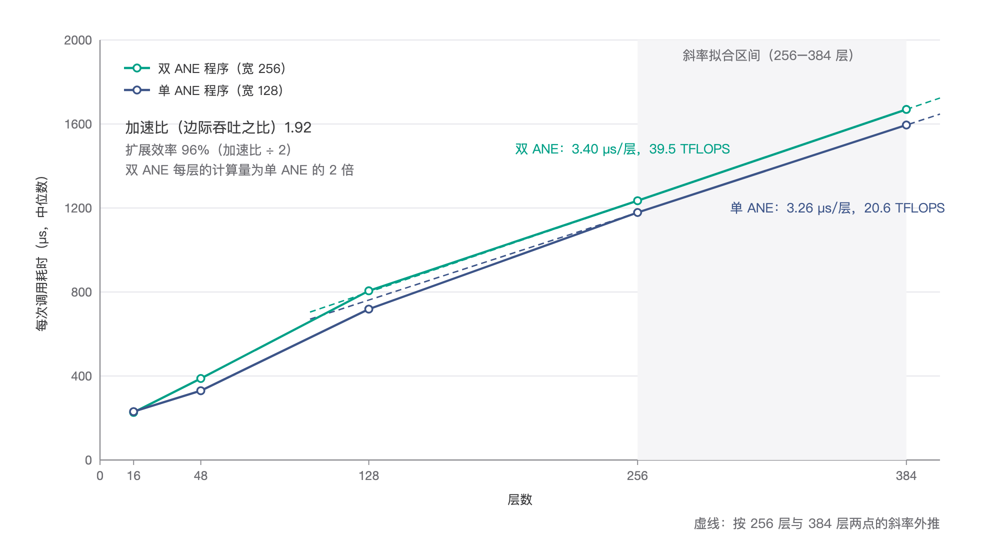

*图 10-1　单 ANE 程序（宽 128）与双 ANE 程序（宽 256）的 512 通道 1×1 卷积链（共享权重）每次调用耗时随层数的变化。虚线为 256 与 384 层两点斜率的外推；双 ANE 每层的计算量为单 ANE 的 2 倍，耗时只多 0.14 µs，按边际吞吐之比计算的加速比为 1.92（数据：[bond_ksweep_run.txt](../data/08_bonded/bond_ksweep_run.txt)）。*

层数较少时，表 10-1 中两组模型的耗时差别不能直接解释为协同开销。例如 16 层时双 ANE 与单 ANE 的耗时几乎相同，48 层时双 ANE 反而慢 58 µs。这一区间的每次调用耗时只有几百微秒，第 6.5 节所述的主机唤醒开销正处于随任务时长变化的阶段，而两组模型的任务时长不同，这部分开销混入了耗时的差别。因此，本节只以 256 层以上的斜率作为扩展效率的依据。

### 10.4 读权重受限时的扩展效率

编译器的成本模型预期切分后延迟减半，但它没有计入两个 ANE 共享的读权重环节（第 5.8.3 节）。第 9.3.4 节指出，单个 ANE 读权重时已达 DRAM 带宽的约 90%，第二个引擎即使有独立的通路，也只能分到剩余的很小一部分；按行切分时两个 ANE 又各读一份完整的权重，权重流量因此翻倍。本节的两组实验分别检验改写核与原生核上的这一推断。由此可以预期，当网络受读权重限制时，第二个引擎带来的计算能力只能很有限地转化为加速，按行切分时尤其如此。

第 7.4.2 节的长条形卷积核实验为此提供了最直接的证据。在 16×32、256 通道的 1×9 卷积链上，编译器选择按行切分，每个 ANE 负责 8 行和全部 256 个输出通道。固件时间戳显示，两个 ANE 的任务同时开始、同时结束，并且忙碌时间相等，但每层耗时为 33.0 µs，恰好是单 ANE 处理同样行数时的两倍；按"两份权重 ÷ 150 GB/s"计算的预测值为 33.7 µs，与实测相差约 2%。也就是说，两个引擎完全并行，但整体吞吐与单 ANE 相同，第二个引擎没有带来任何加速；按第 7.4.2 节的分析，这里两个引擎共享的是改写核的按权重元素计量的瓶颈，对原生核而言，共享则来自 DRAM 带宽的上限（第 9.3.4 节）（数据：[ks4_fit.txt](../data/05_compute/ks4_fit.txt)；工具：[ks4_engines.py](../tools/05_compute/ks4_engines.py)）〔kdebug，HWX〕。同一空间尺寸的 1×12 至 1×14 卷积被按输出通道切分，每个 ANE 只读一半的权重，每层耗时为 24.9–30.4 µs，相对双 ANE 直接卷积峰值的效率为 73–77%。在 32×32 的形状上，行数增加使计算量与读权重量大致平衡，按行切分的效率回到 86–89%（1×9 至 1×15 的全部形状，表 7-7 只列出了其中一部分；数据：[ks4_fit.txt](../data/05_compute/ks4_fit.txt)）。这一现象记为缺陷 B9（附录 D）。

这一趋势在常规卷积链中同样存在。我们把第 10.3 节的两组模型改为每层使用不同的权重（每层 0.5 MB），在 48 至 128 层之间，单 ANE 的每层边际耗时从共享权重时的 4.85 µs 变为 5.1 µs，几乎不变；双 ANE 则从 5.2 µs 增至 7.3 µs（数据：[bond_dsweep_run.txt](../data/08_bonded/bond_dsweep_run.txt)）〔计时〕。双 ANE 时两个引擎各读 0.5 MB，每层合计 1 MB，在 7.3 µs 内读完对应约 140 GB/s，已接近读权重带宽的上限。按每层的计算量折算，双 ANE 相对单 ANE 的加速从共享权重时的约 1.9 倍降至约 1.4 倍。这一区间的计时斜率可能混有主机唤醒开销，具体倍数只作参考，而结论的方向与上一段的固件时间戳结果一致。

这些结果说明，对于读权重受限的负载，例如大语言模型的解码阶段，使用两个 ANE 的收益很有限；如果编译器选择了按行切分，两个 ANE 各读一份权重，第二个引擎不但不带来加速，还会额外消耗 DRAM 带宽。对这类负载，编译器更好的选择是按输出通道切分，使每个 ANE 只读一半的权重，或者干脆不切分，以节省第二个引擎的功耗（第 13 章测得第二个引擎满载时约增加 4.6 W）；由于使用者无法控制编译器的切分，这一改进只能由编译器实现。

### 10.5 切块时的工作划分

编译器的成本模型以切分后各计算块的延迟之和进行评估，而未考虑其中最大块所决定的关键路径（第 5.8.3 节）。即默认两个引擎分到的工作量相等。第 9.2.2 节指出，中间张量超过 2 MiB 时，编译器把张量切分为若干块，每块连续执行完整条链。在双 ANE 程序中，这一切块方式与两个引擎之间的工作划分相互作用，使这一默认不再成立，并产生了一个可以测量的损失。

我们用 kdebug 分别测量了两个 ANE 的任务时长。模型为 256 通道、高度为 1 的 1×1 卷积链，各层共享权重，宽度为 6144 至 16384。表 10-2 给出了 40 层时的结果（工具：[asym_ktrace.sh](../tools/08_bonded/asym_ktrace.sh)、[asym_split.py](../tools/08_bonded/asym_split.py)；数据：[asym_kt/](../data/08_bonded/asym_kt/)）〔kdebug〕。

*表 10-2　切块时两个 ANE 的任务时长（256 通道 1×1 卷积链，40 层；各列分别取中位数）*

| 宽度    | ANE0 任务 | ANE1 任务 | ANE1 ÷ ANE0 | ANE1 比 ANE0 晚结束 |
| ----- | ------- | ------- | ----------- | --------------- |
| 6144  | 845 µs  | 846 µs  | 1.00        | −0.5 µs         |
| 8192  | 913 µs  | 1341 µs | 1.47        | 427 µs          |
| 12288 | 1478 µs | 1903 µs | 1.29        | 420 µs          |
| 16384 | 2041 µs | 2466 µs | 1.21        | 421 µs          |

两个 ANE 的任务起始时间基本一致，但宽度达到 8192 以后，ANE1 的任务明显长于 ANE0，调用的总耗时由 ANE1 决定。为了找出原因，我们用 [td_widths.py](../tools/lib/td_widths.py) 统计了 8 层模型中每个引擎的 TD 数和每层处理的列数，结果如表 10-3 所示（数据：[align_hwx.txt](../data/07_memory/align_hwx.txt)）〔HWX〕。

*表 10-3　两个 ANE 分到的工作量（8 层模型）*

| 模型             | ANE0 的 TD 数 | ANE1 的 TD 数 | 列数合计 ÷ 8（ANE0 / ANE1） | 列数之比 | 实测时间之比    |
| -------------- | ----------- | ----------- | --------------------- | ---- | --------- |
| 256 通道，宽 6144  | 28          | 28          | 7680 / 7680           | 1.00 | 1.00      |
| 256 通道，宽 8192  | 28          | 42          | 8320 / 12160          | 1.46 | 1.41–1.47 |
| 256 通道，宽 12288 | 42          | 56          | 13440 / 17280         | 1.29 | 1.28–1.29 |
| 128 通道，宽 24576 | 42          | 56          | 26880 / 34560         | 1.29 | 1.23–1.29 |

表中的"列数合计 ÷ 8"是各引擎全部 TD 处理的列数之和除以层数，由于部分 TD 一次处理两个块的列数（例如 3328 = 2 × 1664），它不等于每层的宽度，只用于比较两个引擎的相对工作量。两个 ANE 分到的列数之和等于单 ANE 程序的总量，但分配并不均衡：宽度 12288 时 ANE0 与 ANE1 分别承担约 44% 和 56%，宽度 8192 时分别承担约 41% 和 59%。列数之比与实测的时间之比相符，因此时间上的不对称完全由工作量的不对称解释。

各引擎的块宽分布进一步揭示了负载不均衡的来源：双 ANE 程序沿用了单 ANE 程序的切块网格，只在块的边界上把块列表分成两组。以宽度 12288 为例，单 ANE 程序的块宽分布等于 ANE0 与 ANE1 两者的块宽分布之和。当一层的块数为奇数时，块列表无法均分，多出的一块总是分给 ANE1；编译器中对应的分配规则是第 i 块分给编号为 (i ≥ T/2) 的 ANE（第 5.8.3 节）。表 10-4 列出了不同宽度下每层的切法和分配〔HWX〕。图 10-2 给出了双 ANE 程序的切块分配。

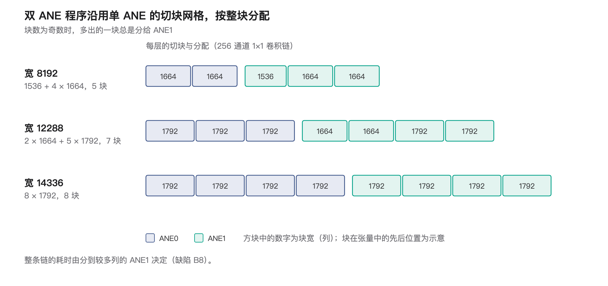

*图 10-2　双 ANE 程序的切块分配（256 通道 1×1 卷积链）。双 ANE 程序沿用单 ANE 的切块网格，按整块把块列表分给两个 ANE；块数为奇数时多出的一块总是分给 ANE1。方块中的数字为块宽（列），块在张量中的先后位置为示意。*

*表 10-4　每层的切块与两个 ANE 的分配*

| 宽度    | 每层切法                | 块数  | ANE0 / ANE1 | 预测的时间之比 | 实测        |
| ----- | ------------------- | --- | ----------- | ------- | --------- |
| 6144  | 4 × 1536            | 4   | 2 / 2 块     | 1.00    | 1.00      |
| 8192  | 1536 + 4 × 1664     | 5   | 2 / 3 块     | 1.46    | 1.41–1.47 |
| 10752 | 6 × 1792            | 6   | 3 / 3 块     | 1.00    | 两边 TD 数相同 |
| 12288 | 2 × 1664 + 5 × 1792 | 7   | 3 / 4 块     | 1.29    | 1.29      |
| 14336 | 8 × 1792            | 8   | 4 / 4 块     | 1.00    | 两边 TD 数相同 |

上述分配规则意味着，块数的奇偶性会直接影响两个 ANE 的负载均衡：偶数块可以均分，而奇数块必然使其中一个引擎承担额外的计算块。实测证实了这一预测：宽度 14336（8 块）的计算量比宽度 12288（7 块）多 17%，每层耗时却少 2%（49.3 µs 对 50.3 µs），吞吐高约 19%（数据：[bsplit_even.txt](../data/08_bonded/bsplit_even.txt)）〔计时〕。理想情况下，双 ANE 的耗时应为总工作量的一半；实际耗时由 ANE1 的份额决定，宽度 12288 时 ANE1 承担 56.25% 的列数，耗时比均分长 12.5%，相应的吞吐为理想值的 1 ÷ 1.125，即降低约 11%；宽度 8192 时 ANE1 承担 59.4% 的列数，耗时比均分长约 19%，吞吐降低约 16%。编译选项 `DisableNetworkImbalanceAnalysis` 和 `EnableForcedMaximalBondedSplit` 都不改变这一划分（数据：[bsplit_flags.txt](../data/08_bonded/bsplit_flags.txt)）。这一问题记为缺陷 B8（附录 D）。更极端的例子出现在 2048 通道、32×32 的 W8A8 1×1 卷积链上，编译器把工作按约 1 : 2 分给两个 ANE，使 W8A8 相对 FP16 的加速从均衡形状的 1.76–1.87 倍降至 1.21 倍（表 7-2）。

### 10.6 两个引擎之间的数据交换

不同算子在双 ANE 切分后的跨引擎通信需求并不相同：逐点卷积链按行切分后，各引擎可以独立执行，无需交换中间数据；而 3×3 卷积、沿高度的归约和 softmax 等运算则需要跨引擎的数据交换。双 ANE 程序为此使用两个 ANE 共享的暂存区和跨 ANE 的同步记录，例如 3 层 3×3 卷积的每个 ANE 在第 2、3 层开始之前各同步一次（第 5.8.2 节）。

这种数据交换的代价本文没有直接测量。原因在于，对于需要交换数据的运算，我们找不到工作量相同、但不需要交换数据的对照模型；而且这类运算在双 ANE 程序中的切分方式与单 ANE 程序不同（例如 3×3 卷积切分后每个 ANE 要多读一行重叠的输入），耗时的差别无法单独归因于同步。第 10.3 节中不需要交换数据的卷积链每层只多出约 0.14 µs，但那是两组模型边际耗时之差，没有分离出同步本身，也无法推广到需要交换数据的运算，因此不能作为数据交换开销的下限。

### 10.7 两种并行方式的比较

第 6.7 节表明，驱动会把不同进程、不同程序的请求分配到两个引擎上。按第 10.2 节的预期，两个引擎互不干扰时合计吞吐应为两倍；第 6.7 节测得的 1.78–1.81 倍接近这一预期，但它来自权重常驻片上的 1×1 卷积链，这类负载几乎不从 DRAM 读取权重。为了确定请求级并发能否绕过第 9.3.4 节所述的共享读权重带宽，我们按第 6.7 节的方法，在两个进程中同时调用读权重受限的模型，并以 kdebug 记录两个引擎的任务时间（工具：[d2_wbound.sh](../tools/04_schedule/d2_wbound.sh)、[d2_wbound_fit.py](../tools/04_schedule/d2_wbound_fit.py)；数据：[d2_wbound.txt](../data/04_schedule/d2_wbound.txt)）。测试模型为 256 通道 1×9 卷积的 80 层链，输入为 4×32 或 8×32；这两种形状都不被切分到两个 ANE（第 5.8.4 节），每层在一个 TD 内重新读入 2.54 MB 权重。严格地说，这类改写核受一个两个引擎共享、按权重元素计量的环节限制，而不是 DRAM 的字节带宽（第 7.4.2 节）；但它与 DRAM 读权重受限的原生层一样，两个引擎同时运行时合计速率不增加，本章把两者统称为读权重受限。对照组为第 6.7 节的原模型。结果如表 10-5 所示〔计时，kdebug，IOReport〕，两个进程的请求确实分到了两个引擎上：两个引擎每次调用各有约 2 次中断，两个进程使用同一个模型文件或各用一份文件的结果相同。对照组的合计吞吐为 1.89 倍，复现了第 6.7 节的结果（略高于 1.78 倍，主要因为这一轮单进程的耗时偏长）。读权重受限的两个模型则只有 1.36 倍。8×32 的结果与 4×32 几乎完全相同，说明在这一层数下两者同样完全受读权重限制，而不是计算与读权重各占一半的中间情形。


*表 10-5　读权重受限的模型在两个进程中同时调用*

| 模型                              | 单进程每次调用 | 两进程每次调用        | 合计吞吐   | 单个任务时长（单进程 → 两进程） | 按 FP16 权重字节折算的平均速率 |
| ------------------------------- | ------- | -------------- | ------ | ----------------- | ------------------ |
| 1×9，4×32，80 层                   | 1821 µs | 2686 / 2678 µs | 1.36 倍 | 1391 → 2103 µs    | 111 → 151 GB/s     |
| 1×9，8×32，80 层                   | 1826 µs | 2682 / 2683 µs | 1.36 倍 | 1397 → 2104 µs    | 111 → 151 GB/s     |
| 对照：1×1，512 通道，1×128，384 层（权重常驻） | 1749 µs | 1853 / 1851 µs | 1.89 倍 | 1326 → 1334 µs    | —                  |


kdebug 的任务时间说明了 1.36 倍的来源。以下速率都按 FP16 权重字节折算；第 7.4.2 节表明，1×9 改写核的瓶颈实际上是一个按权重元素计量的共享环节，而不是 DRAM 的字节带宽，这些数字反映的是该环节的速率。单个引擎独占时，每个任务按 2.54 MB × 80 层折算的速率约为 145 GB/s；两个引擎的任务重叠时，每个引擎只有约 76–78 GB/s，合计约 150–156 GB/s，只比单个引擎独占时高约 3–8%，因此单个任务的时长从约 1390 µs 增至约 2100 µs。合计吞吐之所以仍高于 1.0 倍，是因为单进程时 ANE 有约 23% 的时间在等待主机提交下一个请求（第 6.5 节）；两个进程互相填补了这些空隙，两个引擎都空闲的时间降到 0–2%。按权重折算的平均读带宽因此从 111 GB/s 升至 151 GB/s，其比值 1.36 与合计吞吐完全一致〔kdebug，推断〕。换言之，增益主要来自消除主机一侧的空闲，而不是第二个引擎带来的额外处理能力。对于受 DRAM 读权重带宽限制的原生层，由于单个引擎已接近 DRAM 带宽的上限（第 9.3.4 节），可以预期同样的结果〔推断〕。对照组的权重常驻片上，两个引擎同时运行时单个任务的时长几乎不变，因此合计吞吐接近 2 倍。

既然增益来自消除主机空闲，那么在单个进程内保持多个请求在途，应当得到同样的效果。为验证这一点，我们用 [asyncrun.m](../tools/common/asyncrun.m) 在一个进程内以三种方式调用同一个 `MLModel` 对象：同步逐个调用；以 `predictionFromFeatures:completionHandler:` 异步调用并保持 K 个请求在途；以 `predictionsFromBatch:` 每次提交 B 个输入。每种方式连续运行 8 s，测量两轮，并以 kdebug 记录两个引擎的任务（工具：[d2_async.sh](../tools/04_schedule/d2_async.sh)、[d2_async_fit.py](../tools/04_schedule/d2_async_fit.py)；数据：[d2_async.txt](../data/04_schedule/d2_async.txt)）。表 10-6 列出了主要结果〔计时，kdebug，IOReport〕。

*表 10-6　单进程内不同提交方式的吞吐（两轮的范围）*

| 模型                     | 提交方式           | 吞吐（相对同步）          | 两个引擎的忙碌比例       | 单个任务时长       |
| ---------------------- | -------------- | ----------------- | --------------- | ------------ |
| 1×9，4×32，80 层（读权重受限）   | 同步             | 1.00（521–526 次/s） | 77–78% / 0%     | 1396–1398 µs |
|                        | 异步，2 个在途       | 1.40–1.41         | 79% / 79%       | 约 2115 µs    |
|                        | 异步，4 个在途       | 1.41–1.42         | 100% / 100%     | 2660–2671 µs |
|                        | 批量，每批 8 个      | 1.35–1.37         | 83–85% / 84–85% | 约 2660 µs    |
|                        | 两个进程，各异步 2 个在途 | 1.41–1.42         | 100% / 100%     | 2667–2674 µs |
| 1×1，512 通道，384 层（权重常驻） | 同步             | 1.00（523 次/s）     | 77% / 0%        | 1326 µs      |
|                        | 异步，2 个在途       | 2.05–2.06         | 72% / 72%       | 约 1333 µs    |
|                        | 异步，4 个在途       | 2.82–2.83         | 100% / 100%     | 1328–1338 µs |
|                        | 批量，每批 8 个      | 2.46              | 76–78% / 78%    | 约 1330 µs    |
|                        | 两个进程，各异步 2 个在途 | 2.82              | 100% / 100%     | 1330–1342 µs |

图 10-3 把两种模型、七种提交方式的吞吐与两个引擎的忙碌比例画在一起。

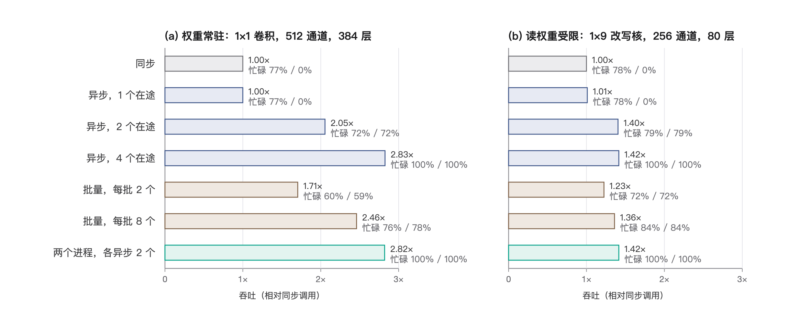

*图 10-3　单进程内不同提交方式的吞吐（相对同步调用，两轮平均，两轮之差不超过 0.05 倍）。(a) 权重常驻的 1×1 卷积链；(b) 读权重受限的 1×9 改写核。条右侧第二行为 ANE0 / ANE1 的忙碌比例。同步调用时只有 ANE0 工作，且约有 23% 的时间等待主机；保持 2 个以上请求在途后，两个引擎都开始工作。权重常驻时吞吐可达同步的约 2.8 倍，读权重受限时只有约 1.4 倍，两个引擎都已 100% 忙碌，增益几乎全部来自消除主机空闲（数据：[d2_async.txt](../data/04_schedule/d2_async.txt)）。*

表 10-6 有三点值得注意。第一，异步调用时，同一进程、同一个 `MLModel` 对象的请求被分配到了两个引擎上：只要有 2 个以上的请求在途，两个引擎就都有任务。这与第 6.7.2 节中多个线程同步调用同一模型时请求串行化的结果不同，说明那里的串行化发生在同步调用的路径上（缺陷 B3）。第二，在读权重受限的模型上，单进程异步与两个进程的饱和吞吐完全相同（约每秒 742 次，按 FP16 权重字节折算约 150 GB/s），再增加一个进程不会更快；饱和时两个引擎都 100% 忙碌，各自只分到约一半的速率（约 76 GB/s），单个任务的时长因此从 1.40 ms 增至 2.66 ms。与单个引擎独占时的约 145 GB/s 相比，两个引擎合计只多出约 4%（表 10-5 两个进程的实验中为 3–8%）；若一个引擎独占且没有主机空闲，吞吐约为同步的 1.37 倍，实测为 1.41 倍。因此，1.4 倍左右的增益几乎全部来自消除主机空闲〔kdebug，推断〕。这一组的同步基线（每秒 521–526 次）比表 10-5 所在的实验慢约 5%，不同时段的同步吞吐会波动 5–8%，而饱和时的绝对吞吐每次都相同，所以这里的 1.41 倍与表 10-5 的 1.36 倍并不矛盾。

第三，在权重常驻的模型上，单进程异步保持 4 个请求在途即可达到同步的 2.82–2.83 倍。若任务执行速度不变，两个引擎满载相对于一个引擎忙碌 77%，只应得到 2 ÷ 0.77 ≈ 2.60 倍；多出的部分来自同步调用时任务本身偏慢。表 10-6 中的任务时长是中位数，而忙碌比例是任务时长之和占时间窗口的比例，相当于用均值计算。我们按 [d2_async_fit.py](../tools/04_schedule/d2_async_fit.py) 的配对方法，从同一份 kdebug 记录、同一时间窗口（每段丢弃前 1.5 s 后的约 7.5 s）重新统计：同步调用时任务数折合每秒 524 次，与 `asyncrun` 测得的 523 次一致；任务时长的中位数为 1326 µs，均值却为 1472 µs，p90 达到 1887 µs，即约有一成任务明显偏慢；异步保持 4 个在途时，均值为 1353 µs，与中位数（1329–1336 µs）接近。于是 2.83 ≈ (2 ÷ 0.77) × (1472 ÷ 1353) ≈ 2.60 × 1.09，两项分别对应消除主机空闲和任务变快〔kdebug〕。

读权重受限的模型也满足同样的关系：同步时任务均值 1473 µs、中位数 1396 µs，异步饱和时均值约 2695 µs，(2 ÷ 0.77) × (1473 ÷ 2695) ≈ 1.42，与实测的 1.41–1.42 倍一致。

异步并发下单个任务执行时间的缩短，可以由第 12 章分析的 CLPC 调频机制解释：CLPC 把 ANE 的忙碌比例稳定在约 77% 的前提是任务之间存在主机造成的空闲，同步调用时偏慢的任务很可能运行在较低的档位上；异步保持 2 个以上的请求在途后，任务首尾相接，均值与中位数相差不到 2%，说明任务几乎都运行在同一档位上〔kdebug，推断〕。

批量提交的效果不如异步，每批 8 个时只有 2.46 倍，按任务时长之和计两个引擎仍有约 20% 的空闲；批量提交时约一成任务缺少固件的开始事件，配对后的任务时长偏短，这一比例可能偏高〔计时，kdebug〕。

表 10-7 汇总了使用两个 ANE 的各种方式，并把实测与第 10.2 节的预期对照。

*表 10-7　使用两个 ANE 的方式：预期、实测与差距*

| 方式                         | 条件              | 预期                    | 实测                     | 差距的主要原因                                         |
| -------------------------- | --------------- | --------------------- | ---------------------- | ----------------------------------------------- |
| 双 ANE 程序，计算受限              | 编译器决定切分；空间维度足够大 | 2 倍                   | 1.92 倍（边际；扩展效率约 96%）   | 每层约 0.14 µs 的协同时间（第 10.3 节）                     |
| 双 ANE 程序，读权重受限且按行切分（改写核）   | 同上              | 2 倍                   | 约 1.0 倍                | 两个引擎共享改写核按权重元素计量的环节，且各读一份权重（第 7.4.2 节、第 10.4 节） |
| 双 ANE 程序，读权重受限（原生核，每层权重不同） | 同上              | 2 倍                   | 约 1.4 倍（计时斜率，含主机侧影响）   | 两个引擎共享读权重的通路（第 9.3.4 节、第 10.4 节）                |
| 双 ANE 程序，需要交换数据            | 同上              | 同步代价不大                | 未测量                    | 缺少工作量相同的对照模型（第 10.6 节）                          |
| 双 ANE 程序，切块数为奇数            | 中间张量超过 2 MiB    | 2 倍                   | 比理想值低 11–16%           | 按整块分配，ANE1 多分一块（第 10.5 节）                       |
| 两个进程运行同一模型，权重常驻            | 驱动把请求分配到两个 ANE  | 2 倍                   | 1.78–1.89 倍            | 每次调用慢约 6–12%（不同轮次），本文未分解（第 6.7.1 节、表 10-5）      |
| 两个进程运行同一模型，读权重受限           | 同上              | 2 倍                   | 1.36 倍                 | 两个引擎合计仍约 150 GB/s；增益几乎全部来自填补主机空闲                |
| 同一进程内的两个不同程序               | 同上              | 两者单独运行之和              | 两者单独运行之和的 86%          | 每次调用各慢约 13%，本文未分解（第 6.7.2 节）                    |
| 同一进程内多线程同步调用同一程序           | 请求在同步调用路径上串行    | —                     | 1.0 倍                  | 串行化（第 6.7.2 节，缺陷 B3）                            |
| 同一进程内异步调用同一程序，保持 2 个以上在途   | 请求被分到两个 ANE     | 相对同步约 2.6 倍（2 ÷ 0.77） | 权重常驻 2.8 倍；读权重受限 1.4 倍 | 权重常驻：同步时部分任务偏慢；读权重受限：两个引擎共享的权重环节（改写核）           |
| 双 ANE 程序与单 ANE 程序混合        | 单 ANE 程序的请求填补空闲 | —                     | 比两者单独运行高 25–30%        | —                                               |

表中"实测"一栏除注明外均为相对单个引擎的吞吐；异步调用一行相对同步调用（数据：第 6.7 节与本章）〔计时，IOReport〕。

双 ANE 程序与请求级并行分别面向单次调用延迟和整体吞吐两种不同的优化目标。双 ANE 程序适用于单个请求的延迟敏感、而网络计算受限的场合，例如单张图像的卷积网络推理；它能把单次调用的计算时间缩短近一半，但使用者无法控制编译器是否切分，读权重受限的网络也只能得到有限的加速。请求级的并行适用于吞吐敏感的场合，例如同时处理多路输入；它不依赖编译器，在单个进程内以异步方式保持多个请求在途即可实现，不需要多个进程，但单次调用的延迟不会缩短。对于读权重受限的网络，请求级并行面临与双 ANE 程序相同的限制：表 10-5 和表 10-6 表明，两个引擎同时读权重时合计速率仍约为 150 GB/s，约 1.4 倍的增益几乎全部来自消除主机一侧的空闲。

### 10.8 与文献的比较

maderix [4] 在缺少 M6 实机的情况下，根据公开的双 16 核引擎和 170 GB/s 内存带宽等信息，推测 M6 的峰值计算能力为 38 TFLOPS（FP16）和 76 TOPS（W8A8），同时提出了三个尚无法确认的问题：两个引擎是否共享 SRAM、一次推理需要一次还是两次调度，以及单张计算图能否跨两个引擎执行。本章的实验对这些推测和问题给出了进一步的实测结果。性能方面，两个引擎合计的直接卷积理论峰值为 42.3 TFLOPS（FP16）和 84.5 TOPS（INT8），均高于 maderix 的推测，这一差异可能主要来自本文测得的约 2.58 GHz NE 工作频率〔推断〕；实际测得的 FP16 边际吞吐为 39.5 TFLOPS。存储方面，两个引擎各自拥有由编译器独立分配的 2 MiB L2，而跨引擎交换数据时使用运行时分配的共享暂存区。调度方面，编译器可以将同一张计算图划分至两个引擎，并生成相应的双 ANE 程序；执行一次此类程序时，运行时分别启动 ANE0 和 ANE1 各一次。因此，单张计算图可以跨两个引擎执行，但其跨引擎划分由编译阶段决定。

Bryngelson [5] 根据早期产品的内核驱动推测，多裸片产品以整个提交为单位把请求派给最空闲的裸片，裸片之间不交换张量；编译器中虽然有集合通信的实现，但在所有目标上都没有启用。M6 的情况与之不同：两个 ANE 位于同一裸片上，并且通过双 ANE 程序在一次提交内协同执行、交换数据；同时，驱动也以整个提交为单位把不同程序的请求派给不同的引擎（第 6.3.2 节）。也就是说，M6 同时具备 Bryngelson 所描述的请求级分配和一种新的程序级协同。

### 10.9 小结

本章以实测检验了第 5、6 章所述的双引擎机制。在理想情况下，两种双引擎利用方式都应带来两倍的性能：编译器的成本模型假设切分后延迟减半，而请求级并行则预期通过两个引擎使合计吞吐加倍。实测与预期的差距取决于负载。在计算受限的网络上，双 ANE 程序的边际吞吐是单个引擎的 1.92 倍，差距只有约 4%，即每层约 0.14 µs 的协同时间；请求级并行在权重常驻的模型上也接近两倍，同一进程内的异步调用保持 4 个请求在途时可达同步调用的 2.8 倍。差距最大的是读权重受限的网络：两个 ANE 共享约 150 GB/s 的读权重带宽，编译器的成本模型却没有计入这一点，按行切分时两者又各读一份权重，因此每层权重不同的卷积链只有约 1.4 倍，按行切分的改写核没有加速；请求级并行在这类模型上同样只有约 1.4 倍，而且增益几乎全部来自消除主机一侧的空闲。另一个差距来自工作划分：编译器沿用单引擎的切块网格按整块分配，块数为奇数时 ANE1 多分一块，耗时比均分长 12.5–19%，吞吐比理想值低 11–16%。总的来看，这些差距都来自机制中的同一类简化：编译器把两个引擎当作互不干扰、工作量相等的资源，而两者实际上共享读权重通路，分到的工作量也不一定相等。

本章与第 5、6 章一起完成了对双引擎的论证：第 5 章说明编译如何安排，第 6 章说明运行如何执行，本章给出实际的收益及其与预期的差距。留下的问题是，需要交换数据的运算的同步代价，以及每层约 0.14 µs 的协同时间来自资源竞争还是时钟档位的差异；前者需要工作量相同、只有交换次数不同的对照模型，后者需要读出两种程序下的时钟档位（第 16.2 节）。第二个引擎的功耗代价见第 13 章。由本章结论导出的部署建议集中在第 15.2 节（表 15-1）。

## 11. 时钟域

前文在论证过程中借用了以下两项假设：第 7 章换算峰值时使用了 2.58 GHz 的满载时钟，第 7.6 节借用了 PE 时钟独立于 NE 时钟的结论，本章给出它们的论证。本章研究 ANE 有几个独立的时钟域、各有哪些档位、满载时实际运行在什么频率，以及编译器对频率的假设与硬件是否一致。系统没有为 ANE 提供"当前频率"的读数，我们只能从任务时长的变化中反推频率。本章的主要结论有四点。第一，每个 ANE 的 NE 时钟有 32 个档位，工作范围为 852–2580 MHz，满载时运行在 2580 MHz，而不是编译器频率表的最高档 2508 MHz。第二，PE 位于一个独立调度的时钟域中，它升频缓慢，GPU 同时工作时会被反复压回低档，若沿用编译器的映射表，满载时约为 1.8–1.9 GHz（这一估计并不独立，见第 11.3.2 节）；我们推测这一时钟域就是两个 ANE 共用的共享簇，L2 很可能也位于其中。第三，我们推断编译器中被称为"DMA 频率表"的 5 个档位实际描述的是 SoC 互连的频率；ANE 没有自己的调压域，而是向 SoC 电压域投票来获得所需的电压。第四，DRAM 在 ANE 满载时运行在最高档 10656 MT/s。

### 11.1 测量方法

ANE 的时钟频率没有可直接读取的系统接口，因此需要通过间接方法进行测量。我们检查了所有可能的来源：IORegistry 中 ANE 驱动节点只记录电源状态；IOReport 的 8288 个通道中，内存控制器、CPU 和 GPU 都有各档位的驻留时间，而 ANE 只有 PLL 的开关、时钟开启的总时间和降频事件的计数；ANE 有硬件性能计数器，但只能通过私有接口在提交请求时附带统计缓冲区读取，这超出了本文的约束〔ioreg，IOReport，内核〕。因此，我们只能间接地测量频率。

间接测量利用了固定工作量任务的执行时间与时钟频率之间的反比关系：对于一个计算量固定、数据全部留在片上的任务，其执行时长 T 与时钟频率 f 满足 T = C / f + D，其中 C 是任务所需的时钟周期数，D 是与频率无关的固定时间。如果能够在不同的时钟档位上测得任务时长，并且知道这些档位的频率，就可以拟合出 C 和 D，再反过来由满载时的任务时长推得满载频率。ANE 从空闲开始工作时，时钟会从低档逐档升到高档（这一行为由 CLPC 控制，第 12 章研究其规律），这一过程恰好提供了在多个档位上测量同一任务的机会。任务时长由 kdebug 中固件记录的任务开始与结束事件得到（表 6-1），时间分辨率为 24 MHz 计时器的一个周期〔kdebug〕。

档位的频率值来自三个相互独立的静态来源：设备树中电源管理节点的频率表、编译器内置的 SoC 参数（第 4.4 节），以及 kernelcache 中 CLPC 与电源管理驱动的常量区〔ioreg，编译器，内核〕。对于没有频率表的时钟域，我们通过比较不同功能单元的任务时长随时间的变化，判断它们是否属于同一时钟域，并用 IOReport 中 SoC 电压域的档位统计观察互连的状态〔kdebug，IOReport〕。

### 11.2 NE 时钟

#### 11.2.1 频率表

设备树中电源管理节点的 `voltage-states8` 和 `voltage-states29` 两个属性各列出 32 个档位的频率，二者内容相同〔ioreg〕。表 11-1 列出了这 32 个频率。

*表 11-1　设备树中的 ANE 频率表（MHz）*

| 档位 1–8 | 档位 9–16 | 档位 17–24 | 档位 25–32 |
| ------ | ------- | -------- | -------- |
| 804    | 1188    | 1716     | 2280     |
| 828    | 1248    | 1788     | 2352     |
| 852    | 1308    | 1872     | 2364     |
| 960    | 1368    | 1908     | 2436     |
| 996    | 1404    | 1968     | 2448     |
| 1032   | 1476    | 2052     | 2484     |
| 1092   | 1548    | 2112     | 2508     |
| 1128   | 1632    | 2196     | 2580     |

设备树中各电压表与性能域的对应关系记录在 `perf-domains` 属性中：`voltage-states8` 对应 ANE0，`voltage-states29` 对应 ANE1。这与第 4.3 节所述 CLPC 中两个 ANE 各有一个性能域（8 和 29）一致〔ioreg〕。也就是说，每个 ANE 的 NE 时钟是一个独立的性能域，各有一张 32 档的频率表；而 ANE 的其他部分在设备树中没有自己的电压表。kernelcache 中 CLPC 使用的 ANE 频率表（`_anePerfStateFrequenciesMHz`，32 档）由电源管理驱动在运行时提供，与设备树一致〔内核〕。

编译器的 NE 频率表（`Soc2026BaseLine`，第 4.4 节）同样有 32 档，其前 24 档与设备树逐项相同，后 8 档则不同：设备树为 2280 至 2580 MHz，编译器为 2244 至 2508 MHz，编译器的最高档 2508 MHz 只是设备树的第 31 档〔编译器，ioreg〕。

#### 11.2.2 满载频率

我们用一个单 ANE、各层共享权重、不读取 DRAM 的模型（1×1 卷积，512 通道，1×128，384 层）进行测量。每一轮先让 ANE 空闲 2.5 s，使时钟降到低档，然后连续调用 800 次，记录时钟从低档升到满载的全过程；共测量 6 轮，得到 4920 个任务（工具：[freq_ktrace.sh](../tools/09_clock/freq_ktrace.sh)、[freq_fit.py](../tools/09_clock/freq_fit.py)；数据：[freq_kt/](../data/09_clock/freq_kt/)）〔kdebug〕。

每一轮的任务时长都从约 3809 µs 开始，经过一串台阶，最后稳定在 1267.5 µs；稳定段占全部任务的 79%，6 轮稳定段的中位数相差不超过 ±0.7 µs。为了避免预先假定哪一张频率表正确，我们只用最低的 5 个主要台阶进行拟合（任务数很少的约 1188 MHz 台阶未用），因为这些台阶对应的档位在两张表中完全相同。拟合结果如表 11-2 所示。

*表 11-2　低档台阶的拟合（T = C / f + D）*

| 台阶时长      | 任务数 | 对应档位     | 拟合偏差   |
| --------- | --- | -------- | ------ |
| 3809.1 µs | 25  | 852 MHz  | +0.29% |
| 2382.1 µs | 24  | 1368 MHz | +0.06% |
| 2108.3 µs | 45  | 1548 MHz | −0.02% |
| 1904.7 µs | 43  | 1716 MHz | −0.11% |
| 1748.9 µs | 27  | 1872 MHz | −0.22% |

这一拟合需要先限定固定时间 D 的范围。若 D 不受限制，5 个台阶的拟合偏差随 D 增大而持续减小（D 约 27 µs 时只有 0.02%），解并不唯一；而那样的解会把满载的 1267.5 µs 换算为约 2598 MHz，不在任何一张频率表中。D 的取值可以由另一项独立的测量估计：第 6 章第一轮实验中，同一形状 16 层与 384 层模型的平均任务时长分别为 58.1 µs 和 1269.5 µs，按直线外推到 0 层的截距约为 5.4 µs（数据：[d1_out/](../data/04_schedule/d1_out/)）〔kdebug〕。我们以这一截距为下限，并把上限放宽到约其 2 倍，即把 D 限定在 5–12 µs；上限是为容纳截距的测量误差而取的，并非另有依据。在这一范围内，最优拟合的均方根偏差为 0.17–0.24%，解是唯一的（次优解的偏差为 0.57%），每个任务约 3.24–3.26 × 10⁶ 个周期，随 D 在这一范围内的取值略有变化〔kdebug，推断〕。

按这一拟合，满载任务的时长在 2580 MHz 时应为 1269.5 µs，在 2508 MHz 时应为 1305.6 µs；实测为 1267.5 µs，反推得满载频率为 2578–2584 MHz。这一结果不能用"满载时受到其他瓶颈限制"来解释，因为受限只会使任务比预测更长，而实测比 2508 MHz 的预测短了约 3%。

按任务时长聚类可以看出，6 轮升频经过的台阶多于第 11.2.3 节所列典型轨迹中的 10 个：部分轮次还经过约 1034、1128、1509、1786、2045 MHz 等档位，各轮的路径并不完全相同。我们用其中任务数不少于 20 的 13 个台阶分别检验了两张频率表（其中 1390.8、1397.7、1409.0 µs 三个台阶都对应 2352 MHz，1493.9、1505.7 µs 都对应 2196 MHz，1267.5、1275.6 µs 都对应 2580 MHz，实际涉及的档位少于 13 个）：D 取小值时，设备树频率表加 2580 MHz 的均方根偏差为 0.62%，编译器频率表加 2508 MHz 为 1.13%；作为对照，随机选取台阶时偏差的 1% 分位数为 0.8%。若允许 D 取到约 60 µs，编译器频率表的偏差可以降到 0.41%，反而低于设备树频率表；但 60 µs 的固定时间与上文约 5.4 µs 的截距相差一个数量级，我们认为不成立。因此，在 D 为个位数微秒这一前提下，满载时 NE 时钟运行在设备树频率表的最高档 2580 MHz〔kdebug，推断〕。图 11-1 给出了从空闲开始连续调用时任务时长的台阶。

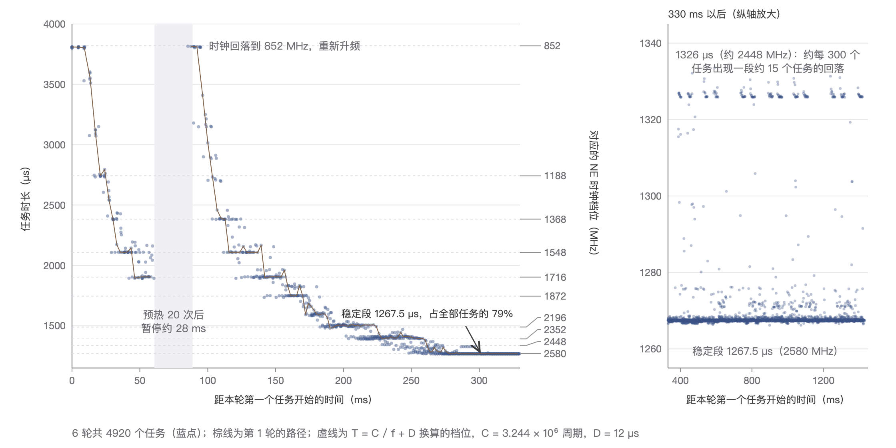

*图 11-1　每轮空闲 2.5 s 后连续调用同一模型（1×1 卷积，512 通道，1×128，384 层）时 kdebug 任务时长随时间的变化（6 轮，4920 个任务）。左栏为前 330 ms，其右侧刻度为按 T = C / f + D 换算的设备树档位；预热 20 次后约 28 ms 的暂停使时钟回落到 852 MHz，此后逐档升至 2580 MHz（1267.5 µs）。右栏为 330 ms 以后的稳定段，纵轴放大，可见约每 300 个任务一段的短暂回落（约 1326 µs）（数据：[freq_kt/](../data/09_clock/freq_kt/)）。*

这一结果也给出了第 7.2.1 节所用的换算：该模型每层需要约 8450–8480 个周期、完成 3355 万次乘加，即每周期约 3960–3970 次，每个 NE 每周期约 247–248 次，为 256 的约 97%；第 7.2.1 节按计时斜率得到 249.5 次（97.5%），两者分别来自周期数拟合和计时斜率两种方法及不同轮次的测量，相差不到 1%。

#### 11.2.3 工作范围

升频过程中出现的档位依次为 852、约 1188、1368、1548、1716、1872、2196、2352、2448 和 2580 MHz〔kdebug〕。每一轮开头，测量工具先执行 20 次预热调用（约 60 ms，时钟只升到约 1716 MHz），随后为建立计时窗口停顿约 28 ms，时钟在停顿中回落到 852 MHz。此后的完整升频中，从 852 MHz 升至 2448 MHz 需要 69–85 个任务、124–146 ms 的 ANE 执行时间（墙钟 152–181 ms），升至 2580 MHz 需要 158–189 ms 的墙钟时间〔kdebug〕。这与第 12.3 节在相同的主机空闲下测得的阶跃升频一致；第 12.3 节还表明，升频的快慢取决于调用之间的主机空闲。进入稳定段后，约每 300 个任务还会出现一段约 15 个任务、落在约 2448 MHz（1326 µs）的短暂回落〔kdebug〕。值得注意的是，升频的起点是第 3 档（852 MHz），而不是表中最低的 804 MHz。第 12.2 节在调用前睡眠 400 µs 以上时测量稳态档位，发现 CLPC 选择的最低档位同样是 852 MHz。因此，NE 时钟的实际工作范围是 852–2580 MHz，最低的两档（804 和 828 MHz）在本文的实验中从未出现。

IOReport 显示，每个 ANE 有两个 PLL。ANE 空闲时两个 PLL 都关闭；开始工作后约 0.1 s 内打开，满载期间一直保持打开〔IOReport〕。升频过程中 PLL 已经处于打开状态，说明升频是在频率表内逐档进行的，而不是 PLL 从关闭到打开的过程。

### 11.3 共享簇的时钟

#### 11.3.1 PE 不在 NE 时钟域中

编译器的性能模型把 PE 放在一个与 NE 不同的时钟域中：纯 PE 的 TD 的估计耗时等于 PE 周期数除以 1.812 GHz。编译器为此内置了一张"NE 频率到 L2 频率"的映射表（`GetMapNEToL2Frequencies`），M6 的映射表有 32 项，与 NE 频率表一一对应，L2 频率约为 NE 频率的 0.72–0.85 倍，NE 为 2508 MHz 时对应 1812 MHz（数据：[socfreq_ne2l2.txt](../data/09_clock/socfreq_ne2l2.txt)；工具：[socfreq_map.c](../tools/re/socfreq_map.c)）〔编译器〕。按这张映射表，PE 的时钟应当与 NE 的时钟同步变化。

实测否定了这一假设。我们让卷积模型和 PE 模型交替从空闲状态开始执行，记录两者的任务时长：卷积任务从 3810 µs 降至 1267.5 µs，比值 3.01 与 NE 时钟 2580 MHz 与 852 MHz 之比（3.03）相符；PE 部分（96 层与 32 层之差，即 64 个 PE 运算）从 754.5 µs 降至 287.2 µs，比值只有 2.63；三个进程交错执行时，还出现了卷积已满载而 PE 仍在最低档、以及卷积仍在低档而 PE 已经提速的情形（数据：[pefreq_kt/](../data/09_clock/pefreq_kt/)、[pefreq_kt2/](../data/09_clock/pefreq_kt2/)、[pefreq_kt3/](../data/09_clock/pefreq_kt3/)；工具：[pefreq_fit.py](../tools/09_clock/pefreq_fit.py)、[pefreq_fit3.py](../tools/09_clock/pefreq_fit3.py)）〔kdebug〕。由此可以确定，PE 的时钟是独立调度的，编译器的映射表只是其性能模型的假设。

kernelcache 中 CLPC 驱动的符号和字符串为这一结论提供了旁证。CLPC 除两个 ANE 的性能域之外，还管理一个"ANE 共享簇"（`ANE Shared Cluster`、`aneshared`、`SharedANEClusterMask`），把两个 ANE 共用的部分作为一个独立的簇调频；各簇的频率表由电源管理驱动在运行时提供（`dvfm table provided by PMGR for %s cluster %u`）〔内核〕。我们推测，PE 与 L2 就位于这一共享簇中〔推断〕。

#### 11.3.2 频率与调度行为

与 NE 时钟不同，系统中没有可用于确定共享簇绝对频率的直接读数。我们在设备树、编译器、电源管理驱动、CLPC 驱动、ANE 固件和 PMP 固件中都没有找到它的频率表；设备树中有三张电压表（`voltage-states0`、`2`、`11`）的频率字段被隐去，其中 0 对应 SoC 电压域，2 对应 DRAM，11 对应显示，都不是 ANE 的共享簇〔ioreg，内核，固件〕。因此，我们只能对其频率作出估计：PE 时钟从最低档到满载的比值为 2.63；编译器 L2 频率映射表的低端为 684–720 MHz，以此为起点乘以 2.63，得到满载时约 1.8–1.9 GHz〔推断〕。需要指出，这一估计并不独立于映射表：映射表自身从低端到高端（1812 MHz）的比值约为 2.5–2.65，与实测的 2.63 相近，因此所得结果实际上接近沿用映射表的高端值。可以确定的实测事实只有 2.63 倍的升频比，绝对频率仍属未知。

虽然绝对频率无法确定，共享簇的动态调频行为仍可通过 PE 任务时长间接观察。同时，我们还需要排除另一种可能：PE 变慢也许不是因为共享簇的时钟被降低，而是因为 SoC 的供电电压不足。SoC 电压域共有 5 个电压档，最低为 VMIN，最高为 VOVD2。SoC 上的各个部件可以分别"投票"，请求电压不低于某一档；IOReport 既报告电压域的实际档位，也报告各项投票以及汇总后的下限。实际档位不低于这一下限，但可能更高，例如空闲时下限为 VMIN，实际档位却多在 VMAX。为此，我们编写了一个采样工具，每隔约 25 ms 读取一次 SoC 电压域的实际档位、所有投票汇总后的下限，以及 ANE 为互连带宽所投的票；同时用 kdebug 记录每个 PE 任务的时长，再按系统时基把两组数据对齐，比较 PE 的速度与 SoC 电压的变化顺序（工具：[socsamp.c](../tools/common/socsamp.c)、[socpe_ktrace.sh](../tools/09_clock/socpe_ktrace.sh)、[socpe_fit.py](../tools/09_clock/socpe_fit.py)；数据：[socpe_kt/](../data/09_clock/socpe_kt/)）〔kdebug，IOReport〕。结果表明以下三点。

第一，共享簇升频很慢。只执行 PE 模型时，冷启动后 PE 任务在最低档的时长（约 1193 µs）上停留约 0.4–0.5 s 才开始提速；提速过程中，任务时长在 496–1012 µs 之间来回摆动，约 0.8 s 后才稳定在满载的 466 µs。作为对照，NE 时钟在同样条件下约 150–200 ms 即可升满（第 11.2.3 节）。

第二，GPU 同时工作时，共享簇会被反复压回低档。我们先让 GPU 读取内存 1.5 s，再冷启动 PE 模型。PE 同样先在慢档上停留 0.3–0.7 s；提速后又被压回慢档，反复多次，整轮测量（约 1 s）都没有稳定在满载。

第三，SoC 电压域的档位并不决定 PE 的速度。在第二种情形中，SoC 电压域从头到尾都处于最高档 VOVD2，PE 仍然被压在慢档；在第一种情形中，SoC 电压域是在 PE 提速之后才升到 VOVD2 的。这说明 SoC 电压的升高不是 PE 提速的原因，更可能是其结果〔推断〕。图 11-2 把这三点画在一起。

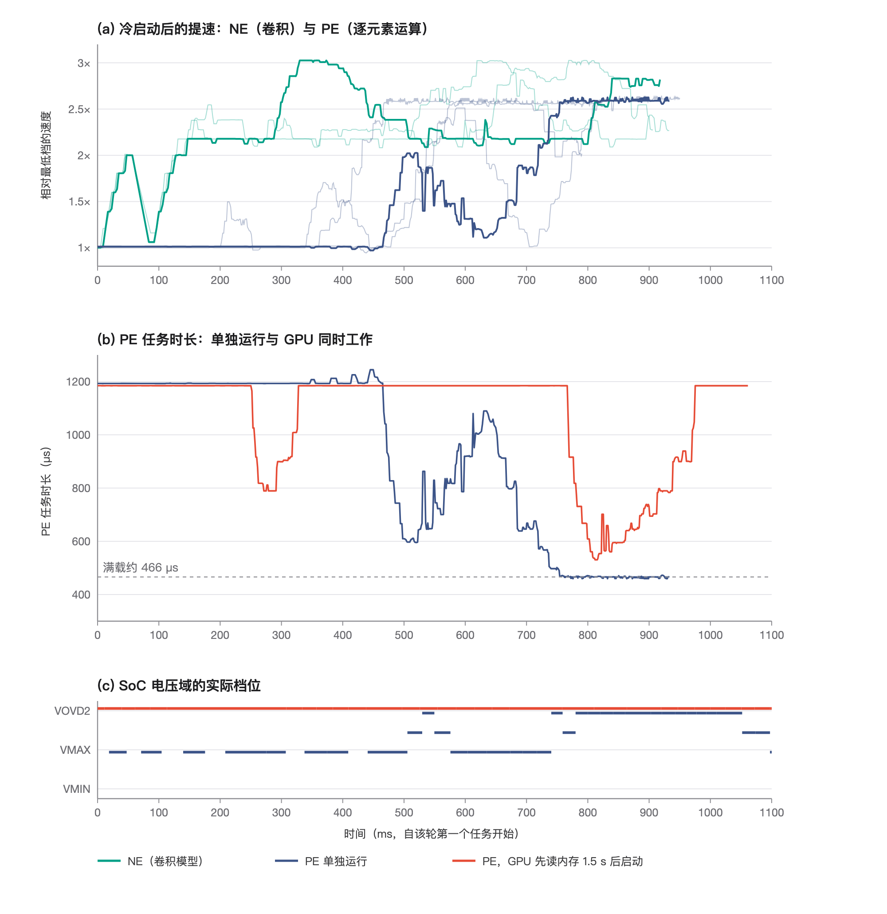

*图 11-2　共享簇（PE）的调频行为。(a) 冷启动后的提速，速度以该轮首个任务（最低档）的时长为基准：NE 为卷积模型，约 150 ms 内升到 2 倍以上，此后随 CLPC 在 2.2–3 倍之间调整；PE 为只含逐元素运算的模型，在最低档停留约 0.45 s，约 0.8 s 后才稳定在满载的 466 µs。粗线为代表轮，细线为同类的其余各轮。(b) PE 任务时长：单独运行时约 0.8 s 后稳定在满载；GPU 先读内存 1.5 s 后再启动时，PE 两次提速都被压回最低档，整轮没有稳定在满载。(c) 与 (b) 对齐的 SoC 电压域实际档位（约 25 ms 一次采样，空白为该窗口内没有驻留记录）：GPU 同时工作时电压始终处于最高档 VOVD2，PE 仍被压在慢档；单独运行时，电压在 PE 提速之后才升到 VOVD2。各曲线为 5 个任务的滑动中位数（数据：[socpe_kt/](../data/09_clock/socpe_kt/)）。*

这些行为与 CLPC 中共享簇的独立调度，以及互连功耗限制器（`fabric_power_limiter`、`FabricComputePowerRatio`）的存在相符；我们推测，GPU 同时工作时互连的功耗预算被 GPU 占用，共享簇因而被限制在低档〔内核，推断〕。其实际影响是：持续时间短于约 0.5 s 的推理，其 PE 部分（逐元素运算、激活函数、归一化等）基本运行在慢档；在 ANE 与 GPU 同时工作的应用中，PE 部分在本文的测量中慢至约 2.6 倍，而 NE 上的卷积和矩阵乘不受影响。这一问题记为缺陷 B10（附录 D）。

### 11.4 SoC 互连与电压

编译器的 SoC 参数中有一张 5 档的频率表（534、712、1068、1150 和 1308 MHz），编译器的函数名称它为"DMA 频率"（`GetValidDMAFrequencies`）。我们在 CLPC 驱动的常量区中找到了完全相同的 5 个值，它们位于互连调频模块（`Fabric DVFM`，源文件 `fabric_dvfm_table.cpp`）的表中，紧邻 DRAM 的传输速率表〔内核〕。SoC 电压域恰好也有 5 个电压档（VMIN 至 VOVD2）。由此我们推断，编译器所谓的"DMA 频率表"实际描述的是 SoC 互连的 5 个频率档，每个频率档对应 SoC 电压域的一个电压档〔推断〕。

ANE 没有自己的调压域。PMP 固件管理的调压域只有 DRAM（DCS）、SoC 和显示三个；ANE 通过 IOReport 中可见的投票项向 SoC 电压域请求电压下限〔ioreg，IOReport，固件〕。我们比较了三种负载下 SoC 电压域的状态，结果如表 11-3 所示（工具：[iorlist.c](../tools/common/iorlist.c)）〔IOReport〕。

*表 11-3　不同负载下 SoC 电压域的状态*

| 项目                                          | 空闲      | PE 链（256 × 64²）  | 卷积链（1×1，512 通道，384 层） |
| ------------------------------------------- | ------- | ---------------- | --------------------- |
| SoC 实际档位                                    | 多为 VMAX | VOVD2，93–99% 的时间 | VMAX，97% 的时间          |
| ANE 互连带宽投票（`ANE0-AF-BW`、`ANE1-AF-BW`）       | VMIN    | VOVD2，89% 的时间    | VNOM，97–98% 的时间       |
| ANE 自身的 SoC 下限投票（`SOC Floor / ANE0`、`ANE1`） | 0       | 0                | 0                     |

ANE 本身对 SoC 电压下限的直接投票始终为 0，实际抬高电压下限的是 ANE 与 SoC 互连之间的带宽投票。两类负载表现出明显差异：PE 链的 DRAM 读写流量仅约 0.5 GB/s，却足以将 SoC 电压推至最高档；相比之下，卷积链只将电压下限推至中间的 VNOM 档。由此推断，PE 链会持续使用 ANE 与 SoC 互连之间的数据通路，而卷积计算对该通路的依赖明显较弱。结合前文的结构分析，这一现象进一步支持 L2 与 PE 的数据通路连接至 SoC 互连，或 L2 本身位于互连一侧的推测〔IOReport，推断〕；同时也与 PE 和 L2 属于 ANE 共享簇、而非分别位于两个 ANE 内部的结构判断相一致。

### 11.5 DRAM

第 9.5.1 节已经说明，ANE 单独读权重、GPU 单独读内存以及两者同时运行时，DRAM 的 F9 档驻留比例都在 99.8% 以上，F9 对应 5328 MHz，即 10656 MT/s。编译器、CLPC 驱动和 PMP 固件中的 DRAM 频率表一致，最低一档（732 MHz）对应从不使用的 F1。因此，在 ANE 满载时，DRAM 不构成频率上的限制〔IOReport，编译器，内核，固件〕。

### 11.6 编译器的频率假设

上述结果表明，编译器性能模型所用的频率与硬件在两处不一致。其一，编译器以 2508 MHz 作为 NE 的最高频率，而硬件满载时运行在 2580 MHz，编译器的估计因此偏慢约 3%。由于第 5.8.3 节的切分决策比较的是同一模型下切分前后的延迟，两者以同一比例偏差，这一差别对切分决策的影响应当很小；它可能只是性能模型的保守取值或构建模型时的输入错误〔推断〕。这一问题记为缺陷 B6（附录 D）。其二，编译器假定 L2 与 PE 的频率随 NE 频率按固定映射变化，而实际上共享簇独立调度，并且可能在 NE 已经满载时仍处于低档。在这种情况下，编译器对 PE 类运算的耗时估计会明显偏乐观。

通过 Core ML 加载模型时，内核日志记录的编译选项中包含 `--ne-frequency=-1.000000`、`--pstate-soc=-1` 和 `--pstate-dcs=-1`，即 NE 频率、SoC 和 DRAM 的档位都采用架构的默认值〔内核〕。我们在直接调用 `ANECCompile` 时把 `NeFrequency` 设为 1308 MHz，同一个 TD 的 `exe_cycles` 从 176 增至 338，说明这一选项确实进入了性能模型〔编译器〕。也就是说，编译器的性能模型以固定的满载频率估计延迟，而不考虑运行时 CLPC 实际选择的档位。

### 11.7 与 M4 及文献的比较

maderix [4] 在 M4 上没有测量时钟频率，并把"乘加阵列的通道数和时钟频率"列为未解决的问题。编译器为 M4（H16g）内置的 NE 频率表有 26 档，最高 2364 MHz（第 4.4 节）；如果 M4 的硬件也像 M6 一样运行在高于编译器表的频率上，那么按编译器表推算的每 NE 每周期乘加次数会偏高，这一点在 M4 上尚待验证。Bryngelson [5] 报告 ANE 固件中没有温度或降频逻辑，这些都由 SoC 的电源管理负责；本文在 M6 的固件中同样没有找到频率表和选档逻辑（第 6.4 节），NE 时钟和共享簇时钟都由主机内核中的 CLPC 管理，与之一致。

### 11.8 小结

M6 的 ANE 涉及四类时钟域。每个 ANE 的 NE 时钟各是一个独立的性能域，有 32 个档位，实际工作范围为 852–2580 MHz，在任务的固定时间为数微秒这一前提下，满载时运行在设备树频率表的最高档 2580 MHz，比编译器假定的 2508 MHz 高约 3%。实测表明 PE 位于一个独立调度的时钟域中；我们推测它就是 CLPC 中两个 ANE 共用的共享簇，L2 很可能也在其中〔推断〕；其绝对频率无法读取，若沿用编译器的映射表，满载时约 1.8–1.9 GHz；它升频缓慢，并在 GPU 同时工作时被反复压回慢档。SoC 互连有 5 个频率档，对应 SoC 电压域的 5 个电压档，ANE 通过互连带宽投票间接影响它。DRAM 在 ANE 满载时运行在最高档 10656 MT/s。上述时钟都由主机内核中的 CLPC 和电源管理驱动管理，我们没有发现 ANE 固件参与的证据。

NE 时钟档位由谁、按什么规律选择，是第 12 章的问题。仍未确定的是共享簇的绝对频率，以及 PE 每周期处理的元素数（第 16.2 节）。由本章结论导出的部署建议集中在第 15.2 节（表 15-1）。

## 12. 动态调频

第 11 章确定了 NE 时钟的档位，第 6 章的静态分析表明档位由主机内核中的 CLPC 选择。本章研究 CLPC 选档的规律：它根据什么信号调频，稳态时把 ANE 维持在哪一档，负载变化时多快作出反应，ANE 空闲后又如何降频和断电。CLPC 的代码不公开，我们把它当作黑箱，通过控制主机提交请求的节奏、观察 ANE 的时钟档位来确定它的行为。本章的主要结论有四点。第一，CLPC 根据利用率调频：每次调用之间的空闲不超过约 1 ms 时，它把 ANE 的忙碌比例稳定在约 77%；空闲更长时，忙碌比例随空闲长度单调下降，而档位远未到下限。这一行为可以用时间常数约 6.5 ms、目标约 80% 的指数平均利用率近似描述。第二，同步调用时升频与降频的速度相当，从下限升至 2448 MHz 以上通常需要 100–200 ms，调用之间的主机空闲越短，升得越快。第三，ANE 空闲后约 100 ms 降至下限，最后一次推理结束约 5.7 s 后两个 ANE 同时断电，再次调用需要约 50 ms 重新启动固件。第四，连续满载 5 分钟没有触发任何降频或节流。

### 12.1 测量方法

为了将 CLPC 当作黑箱来研究，我们需要构建两个测量值：一个可以由我们改变、并且会影响 CLPC 决策的量，作为实验的输入；一个能够反映 CLPC 决策结果的量，作为实验的输出。CLPC 本身的输入无法直接设定，但可以间接影响。第 6.3.4 节指出，CLPC 获知 ANE 负载的主要途径是驱动报告的每个作业的提交、开始和结束；因此，CLPC 看到的"利用率"应当取决于主机提交请求的节奏，而这一节奏是我们可以控制的。具体做法是：在每次 Core ML 同步调用之前让调用线程睡眠一段固定的时间 G，通过改变 G 来改变 ANE 两次任务之间的空闲时间（工具：[gov_sweep.sh](../tools/10_clpc/gov_sweep.sh)；计时程序为 [bondrun.m](../tools/common/bondrun.m)）。所用模型与第 11.2.2 节相同（单 ANE，1×1 卷积，512 通道，1×128，384 层，各层共享权重），其任务时长只取决于 NE 的时钟频率。

CLPC 的输出是 NE 的时钟档位。系统没有提供档位的读数，但第 11.2.2 节已经为这个模型建立了任务时长与频率的关系 T = C / f + D，因此可以由每个任务的时长反推它运行在哪一档。任务时长和任务之间的空闲间隙都由 kdebug 的固件事件得到，ANE 的忙碌比例定义为任务时长之和除以总时间（工具：[gov_ktrace.sh](../tools/10_clpc/gov_ktrace.sh)、[gov_fit.py](../tools/10_clpc/gov_fit.py)）〔kdebug〕。为了观察动态响应，我们让 G 在两个值之间周期性地切换，记录档位随时间的变化（工具：[gov_step.sh](../tools/10_clpc/gov_step.sh)、[gov_step_fit.py](../tools/10_clpc/gov_step_fit.py)）。对于空闲后的降频和断电，我们一方面在空闲不同时长后测量第一次调用的耗时，另一方面用 IOReport 记录 ANE 固件处理器的电源状态，并用系统日志记录驱动的事件（工具：[coldwake.m](../tools/common/coldwake.m)）〔计时，IOReport，内核〕。

### 12.2 稳态：利用率目标

我们首先只用计时观察 G 对调用耗时的影响，结果如表 12-1 所示（数据：[gov/](../data/10_clpc/gov/)）〔计时〕。

*表 12-1　调用前睡眠时间与每次调用耗时*

| 睡眠时间 G  | 每次调用中位数 | 第 10–90 百分位  | 状态        |
| ------- | ------- | ------------ | --------- |
| 0       | 1651 µs | 1645–1665 µs | 满载        |
| 50 µs   | 1567 µs | 1558–1581 µs | 满载        |
| 100 µs  | 1541 µs | 1536–1553 µs | 满载        |
| 150 µs  | 2126 µs | 1643–2456 µs | 在中间档位之间摆动 |
| 200 µs  | 3240 µs | 1915–3672 µs | 摆动，多数在低档  |
| 300 µs  | 3551 µs | 2552–4299 µs | 摆动，多数在低档  |
| 400 µs  | 4312 µs | 3664–4363 µs | 低档        |
| 1000 µs | 4563 µs | —            | 低档        |
| 3000 µs | 4582 µs | —            | 低档        |

调用之间多出的睡眠时间只要超过约 150 µs，每次调用的耗时就明显上升；睡眠时间达到 400 µs 以上时，每次调用稳定在约 4.3–4.6 ms，比满载时慢约 2.8 倍。G 为 50 µs 和 100 µs 时调用反而略快于 G 为 0 时，推测是短暂的睡眠使调用线程更快地响应完成通知，这与第 6.5 节的主机唤醒效应一致〔推断〕。

然而，计时结果只能说明"睡眠稍长就降频"，不能说明 CLPC 依据什么作出判断。为此，我们用 kdebug 测量了每种 G 下 ANE 的任务时长、档位和忙碌比例，结果如表 12-2 所示（数据：[gov_kt/](../data/10_clpc/gov_kt/)）〔kdebug〕。

*表 12-2　不同睡眠时间下 ANE 的档位与忙碌比例（与表 12-1 来自不同轮次的测量；G 为名义睡眠时间，实际睡眠可能更长，因此两表在同一 G 下的周期不完全一致）*

| 睡眠时间 G  | 任务数  | 任务时长中位数   | 档位中位数    | 档位分布（前三位）                  | 任务间空闲中位数 | ANE 忙碌比例 |
| ------- | ---- | --------- | -------- | -------------------------- | -------- | -------- |
| 0       | 1529 | 1267.5 µs | 2580 MHz | 2580：84%；2448：5%；2112：2%   | 384 µs   | 77%      |
| 100 µs  | 1425 | 1267.5 µs | 2580 MHz | 2580：81%；2448：6%           | 433 µs   | 75%      |
| 150 µs  | 1558 | 1789 µs   | 1788 MHz | 1872：42%；1548：12%；1716：10% | 517 µs   | 77%      |
| 200 µs  | 1561 | 2695 µs   | 1188 MHz | 1188：37%；1548：14%；1368：12% | 808 µs   | 77%      |
| 300 µs  | 1504 | 3171 µs   | 1032 MHz | 1032：65%；852：19%           | 975 µs   | 77%      |
| 400 µs  | 1465 | 3807 µs   | 852 MHz  | 852：63%；1032：31%           | 1132 µs  | 76%      |
| 1000 µs | 1143 | 3807 µs   | 852 MHz  | 852：95%                    | 2270 µs  | 62%      |

表 12-2 没有包含表 12-1 中 G 为 3000 µs 的情形：这一组实验的追踪会话固定只记录 75 s，G 为 3000 µs 的那一段在第 74 秒才开始，追踪结束时它还处于开头 1 s 的连续调用预热阶段，以 3000 µs 间隔调用的阶段一个任务也没有被记录下来，因此只有计时数据，无法计算空闲长度和忙碌比例。

比较表 12-2 中档位与忙碌比例两列的变化，可以发现一个明显的规律：G 从 150 µs 增至 400 µs 时，档位从约 1.8 GHz 一路降至 852 MHz，ANE 的忙碌比例却几乎不变，始终保持在 76–77%。这说明 CLPC 是一个利用率控制器：当任务之间的空闲变长、利用率下降时，它降低时钟档位，使每个任务变长，从而把利用率拉回约 77%〔kdebug〕。第 12.4 节将表明，这一结论只在每次空闲不超过约 1 ms 时成立。忙碌比例只在两种情况下偏离这一目标：G 不超过 100 µs 时，即使运行在最高档 2580 MHz，利用率也只能达到约 77%，此时档位已到上限；G 为 1000 µs 时，档位已降到下限 852 MHz，无法再降，忙碌比例只有 62%。下限 852 MHz 是设备树频率表的第 3 档，与第 11.2.3 节中升频的起点一致；表中最低的 804 MHz 和 828 MHz 两档在实验中从未被选用。即使在稳态下，档位也会在相邻的几档之间跳动，例如 G 为 150 µs 时 1548–1872 MHz 的各档都有出现，这是闭环控制的正常抖动。

表 12-2 还揭示了一个重要的事实：G 为 0 时，相邻两个任务之间仍有约 384 µs 的空闲。这一空闲来自同步调用方式下的主机侧开销（第 6.5 节）：在全部测量中，下一个请求都没有在当前任务结束之前提交。因此，对于单次任务约 1.3 ms 的模型，即使主机不插入任何额外的等待，ANE 的利用率也只有约 77%，恰好处于 CLPC 的目标附近。这一巧合使"连续同步调用"能够维持最高档；但对于单次任务更短的模型，384 µs 的固定空闲所占的比例更大，利用率低于 77%，CLPC 就会降频。换言之，主机侧的开销越大，ANE 被分配的档位越低。

### 12.3 动态响应

稳态行为说明了 CLPC 的目标，动态响应则说明它达到目标的速度。我们让 G 每隔约 1.5 s 在两个值之间切换，并记录每个任务的档位（数据：[gov_step/](../data/10_clpc/gov_step/)）〔kdebug〕。

测量程序按调用次数切换 G（A 组每个来回为 G = 1000 µs 的 270 次与 G = 0 的 900 次，共 6 个来回；B 组为 G = 200 µs 的 440 次与 G = 0 的 900 次，共 5 个来回），而每次调用恰好对应一个任务，因此切换时刻可以按任务序号精确确定（工具：[gov_step_fit.py](../tools/10_clpc/gov_step_fit.py)；结果：[fit.txt](../data/10_clpc/gov_step/fit.txt)）。

在 G 从 1000 µs 切换到 0 的升频过程中（6 次），档位从 852 MHz 出发，升至 2448 MHz 以上分别用了 55、101、202、149、148 和 138 ms（中位数约 143 ms），升至 2580 MHz 用了 59–259 ms〔kdebug〕。6 次的中位轨迹为：5 ms 后约 1032 MHz，20 ms 后 1368 MHz，30 ms 后 1548 MHz，50 ms 后 1716 MHz，100 ms 后约 2052 MHz，150 ms 后约 2484 MHz，200 ms 后 2580 MHz。前段几毫秒就升一档，越接近最高档升得越慢。第 1 次切换明显快于其余 5 次，而这一次的主机空闲也明显较短：切换后每两个任务之间的主机空闲中位数为 192 µs，其余 5 次为 387–391 µs〔kdebug〕。这一差别可以用利用率目标解释。主机空闲约 390 µs 时，ANE 在 852 MHz 的忙碌比例约为 91%，在 2448 MHz 和 2580 MHz 分别只有约 77% 和 76%，已经与约 77% 的目标相当，越接近最高档，促使 CLPC 升频的偏差越小；主机空闲为 192 µs 时，2580 MHz 下的忙碌比例仍有约 87%，偏差始终较大，升频因而快得多〔计时，推断〕。

在 G 从 0 切换到 1000 µs 的降频过程中（6 次），CLPC 先在 2448 MHz 以上保持 17–48 ms（有一次切换前只有约 2112 MHz，没有这一保持段），然后逐档下降，中位轨迹为 30 ms 后约 2406 MHz、50 ms 后约 2238 MHz、75 ms 后约 1794 MHz、100 ms 后 1548 MHz，约 150 ms 时降至 852 MHz，最后一步常常从约 1548 MHz 直接跳到下限。降到下限共需 138–167 ms（切换前不在最高档的那一次为 94 ms）〔kdebug〕。因此在这一组条件下，降频与升频的速度相当。

当目标档位位于中间时，收敛更慢。在 G 从 0 切换到 200 µs 的过程中，档位先在 2448 MHz 以上保持 160–230 ms（5 次中有 1 次只保持了约 29 ms），然后才下降，经过数百毫秒大致稳定在 1188–1548 MHz 之间，其间来回摆动并偶尔越出这一范围；从中间档位回到 2448 MHz 以上需要 125–141 ms〔kdebug〕。

我们还测量了 ANE 完全空闲后档位的变化。具体做法是让 ANE 满载运行后空闲一段时间，再恢复连续调用，观察恢复后第一个任务的档位，结果如表 12-3 所示〔kdebug〕。

*表 12-3　空闲后恢复调用时的档位*

| 空闲时长            | 恢复后第一个任务的档位 | 回到 2448 MHz 以上所需时间 |
| --------------- | ----------- | ------------------ |
| 14 ms（预热结束后的间隙） | 2508 MHz    | 立即                 |
| 30 ms           | 2196 MHz    | 约 110 ms           |
| 60 ms           | 1968 MHz    | 约 190 ms           |
| 111 ms          | 852 MHz     | 约 0.29–0.36 s      |
| 212 ms          | 852 MHz     | 约 0.25 s           |

表 12-3 表明，ANE 空闲期间档位同样在下降：约 30 ms 降 8 档（2580 → 2196 MHz），约 100 ms 降至下限。值得注意的是，空闲之后的升频比上文的阶跃升频更慢：空闲 111 ms 和 212 ms 后同样从 852 MHz 起步，却需要约 0.25–0.36 s 才回到 2448 MHz 以上，而阶跃升频的中位数约为 0.14 s。这一差别的原因本文没有查明：第 12.4 节时间常数约 6.5 ms 的近似模型中，100–200 ms 空闲的影响在约 20 ms 内就已衰减，不能解释恢复为何慢约 2 倍〔推断〕。

综合以上结果，CLPC 对 ANE 是一个以利用率为目标的控制器，升频与降频的速度都取决于实际利用率与目标的偏差，而不是固定的步长；目标位于中间档位时，收敛需要数百毫秒，并伴有摆动。具体的增益和平滑常数我们没有从代码中读出。图 12-1 和图 12-2 分别给出了不同睡眠时间下 ANE 的档位与忙碌比例，以及升频与降频的阶跃响应。

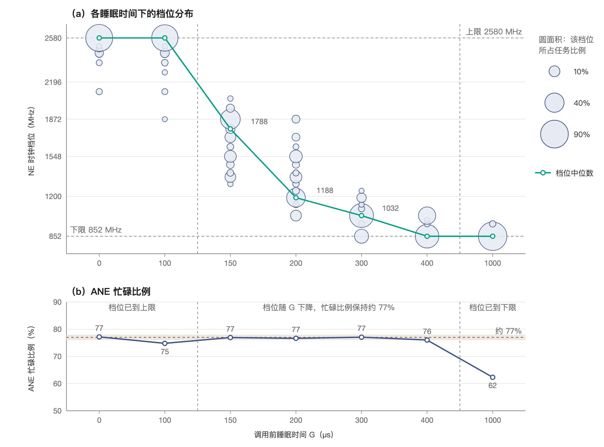

*图 12-1　不同调用前睡眠时间 G 下 ANE 的档位与忙碌比例。（a）各档位所占任务比例（圆面积）与档位中位数；（b）ANE 忙碌比例。G 为 150–400 µs 时档位由约 1.8 GHz 降至 852 MHz，忙碌比例保持在 76–77%；G ≤ 100 µs 时档位已到上限，G 为 1000 µs 时已到下限，忙碌比例降至 62%（数据：[gov_kt/](../data/10_clpc/gov_kt/)）。*

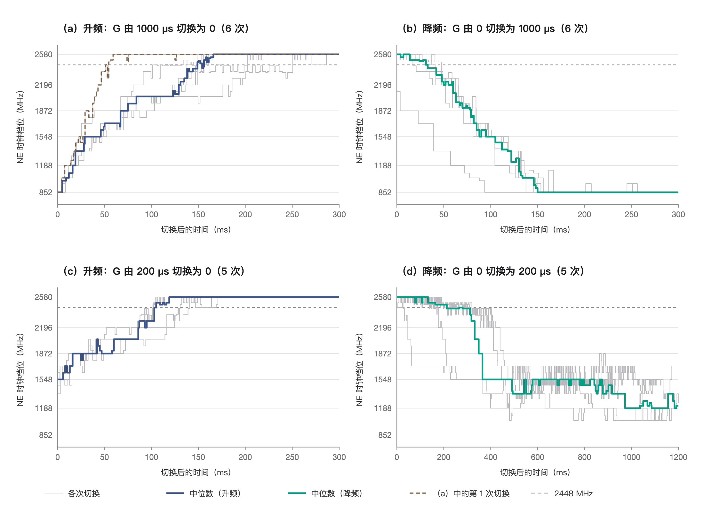

*图 12-2　CLPC 的阶跃响应。（a）（b）调用前睡眠时间 G 在 1000 µs 与 0 之间切换时的升频与降频（各 6 次）；（c）（d）G 在 200 µs 与 0 之间切换时的升频与降频（各 5 次）。细线为各次切换后的档位轨迹，粗线为其中位数，橙色虚线为（a）中的第 1 次切换，灰色虚线为 2448 MHz（数据：[gov_step/](../data/10_clpc/gov_step/)）。*

### 12.4 长空闲下的偏离与近似模型

第 12.2 节的实验只覆盖了一种模型（单次任务约 1.3 ms）和较短的空闲（不超过约 2.3 ms）。为了检验约 77% 的目标是否普遍成立，我们又进行了三轮实验，所用模型覆盖了单 ANE 与双 ANE、权重常驻片上与每次从 DRAM 读取两种情况，满频时的单次任务时长为 1.3–5.3 ms，调用前的睡眠时间则延长到十余毫秒（工具：[gov_target.sh](../tools/10_clpc/gov_target.sh)、[gov_target2.sh](../tools/10_clpc/gov_target2.sh)、[gov_target3.sh](../tools/10_clpc/gov_target3.sh)、[gov_target_fit.py](../tools/10_clpc/gov_target_fit.py)、[gov_target2_fit.py](../tools/10_clpc/gov_target2_fit.py)；数据：[gov_tg/](../data/10_clpc/gov_tg/)、[gov_tg2/](../data/10_clpc/gov_tg2/)、[gov_tg3/](../data/10_clpc/gov_tg3/)）。每段固定运行 12–16 s，丢弃前 4 s。表 12-4 按每次空闲的长度汇总了结果，其中排除了档位已到上限 2580 MHz 或下限 852 MHz 的点〔kdebug〕。

*表 12-4　每次空闲的长度与 ANE 的忙碌比例（三轮实验）*

| 每次空闲（含主机开销）       | 忙碌比例      | 涉及的模型                                            |
| ----------------- | --------- | ------------------------------------------------ |
| 不超过约 1 ms         | 75–78%    | 全部模型，降档后的任务时长 1.9–3.7 ms                         |
| 2.6–2.9 ms        | 65–68%    | 单 ANE 读 DRAM（2.7 ms）；双 ANE（2.6 ms、5.2 ms）        |
| 3.5–4.1 ms        | 60–64%    | 单 ANE 读 DRAM（2.7 ms、5.3 ms）；双 ANE（2.6 ms、5.2 ms） |
| 4.7–5.3 ms        | 58–59%    | 单 ANE 读 DRAM（5.3 ms）；双 ANE（5.2 ms）               |
| 约 7 ms            | 56%       | 同上                                               |
| 约 10 ms / 约 14 ms | 53% / 50% | 双 ANE（5.2 ms），此时等效档位约为 1221 / 1009 MHz           |

表 12-4 表明，约 77% 的忙碌比例只在每次空闲不超过约 1 ms 时成立。在这一范围内，无论单 ANE 还是双 ANE、读不读 DRAM、任务长短如何，忙碌比例都稳定在 75–78%，第 12.2 节的结论成立。空闲更长时，忙碌比例随空闲长度单调下降，而时钟档位远没有到达下限：例如，满频时单次任务 5.2 ms 的双 ANE 模型，在每次空闲约 7 ms 时忙碌比例只有 56%，按任务时长折算的等效档位仍约为 1505 MHz。一个单纯把忙碌比例压到 77% 的控制器，在这种情况下应当继续降频，而 CLPC 没有这样做。

我们排除了两种可能的解释。第一，偏离不是由读取 DRAM 引起的：权重常驻片上的双 ANE 模型与读取 DRAM 的单 ANE 模型，偏离的程度相同。第二，偏离主要取决于空闲的绝对长度，而不是空闲与任务时长之比；在空闲相同的条件下，任务越长，忙碌比例略高。按驱动报告的作业区间计算，忙碌比例同样不恒定：空闲较短时为 79–82%，空闲变长后降至约 57%；驱动报告的区间比固件记录的任务长约 80–180 µs。

为了描述这一行为，我们提出一个近似模型。假设 CLPC 以时间常数 τ 对 ANE 的忙碌状态作指数平均，并且在每个作业结束的时刻读取这一平均值，与目标值比较以决定升频还是降频。对于周期性地忙碌 d、空闲 g 的负载，作业结束时刻的平均值为

```
r = (1 − e^(−d/τ)) / (1 − e^(−(d+g)/τ))
```

当 g 远小于 τ 时，r 接近真实的忙碌比例 d / (d + g)；当 g 与 τ 相当或更长时，空闲期间累积的"不忙"大部分已经衰减，作业结束时读到的值明显高于真实的忙碌比例。以 τ = 6.5 ms 为例，忙碌 1.27 ms、空闲 0.38 ms 时，真实忙碌比例为 77%，r 为 79%；忙碌 8.9 ms、空闲 7.0 ms 时，真实忙碌比例只有 56%，r 却仍为 82%。因此，空闲越长，CLPC 读到的利用率越偏高，它就越早停止降频。我们用后两轮实验（gov_tg2、gov_tg3）中 33 个档位未到上下限、主机调用线程没有停顿的点对这一模型进行联合拟合，得到目标约为 80%、τ 约为 6.5 ms，均方根误差为 2.9%；作为对照，把真实忙碌比例本身当作被控量时，均方根误差为 9.0%；把目标固定为 77% 时，最优的 τ 约为 8.2 ms，均方根误差为 3.2%〔kdebug，推断〕。图 12-3 给出了各点与模型的对照。

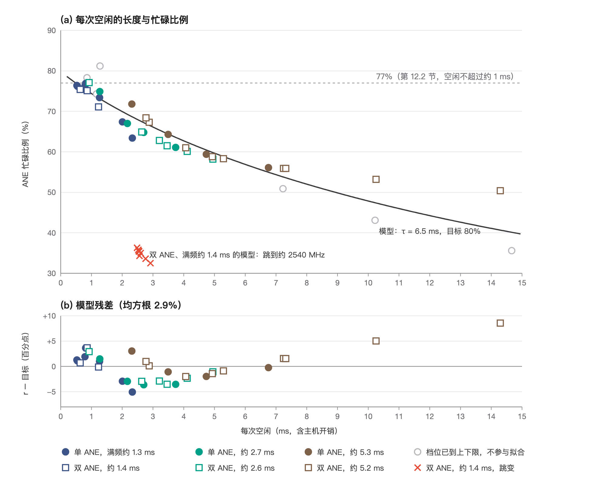

*图 12-3　每次空闲的长度与 ANE 忙碌比例（后两轮实验）。(a) 颜色表示满频时的任务时长，实心为单 ANE，空心为双 ANE；灰色空心点的档位已到上限 2580 MHz 或下限 852 MHz，不参与拟合；红叉为满频约 1.4 ms 的双 ANE 模型在空闲超过约 2.5 ms 后跳到约 2540 MHz 的工作状态，单独标出，也不参与拟合。虚线为第 12.2 节的 77%，只在空闲不超过约 1 ms 时成立；实线为作业结束时采样的指数平均模型（τ = 6.5 ms、目标 80%）给出的稳态忙碌比例。(b) 各拟合点的模型读数 r 与目标之差：短空闲时残差在 ±5 个百分点以内，空闲约 10 ms 和 14 ms 的两点为 +5 和 +8.5，说明模型在很长的空闲下仍有未解释的部分（数据：[gov_tg2/](../data/10_clpc/gov_tg2/)、[gov_tg3/](../data/10_clpc/gov_tg3/)）。*

这一模型只是方向正确的近似，而不是 CLPC 的确切算法。空闲为 10 ms 和 14 ms 的两个点，模型的残差分别为 +5% 和 +8.5%，即在很长的空闲下，真实 CLPC 的读数没有模型预测的那么偏高，说明其中还有模型没有包含的成分。另外，我们还观察到一种模型无法解释的工作状态：满频时单次任务约 1.4 ms 的双 ANE 模型，在每次空闲超过约 2.5 ms 时按任务时长折算稳定在接近满频的约 2540 MHz，忙碌比例只有 32–36%；四种睡眠时间下都是如此，其中一种重复了三次，结果相同。而在空闲约 2.4 ms 时，同一模型按任务时长折算约运行在 910 MHz，忙碌比例为 58%。其他模型在类似的空闲下都没有这种跳变，其原因尚不清楚。

这些结果可以从 CLPC 的设计取舍来理解〔推断〕。在空闲较短时，约 20% 的余量可以理解为控制器察觉负载增加的需要与降频节能的需要之间的折中：如果利用率被压到 100%，"负载刚好够用"与"负载已经超出处理能力"在利用率上无法区分；而任务之间只有数百微秒的空闲时，ANE 仍处于上电状态，降频降压比快速完成任务再空等更省电（第 13.4 节测得低档时每次推理的 ANE 能耗约为最高档的三分之一）。Linux 内核的 schedutil 调频器采用了类似的做法：它按"利用率 × 1.25"选择频率，相当于把利用率目标设在约 80% [11]。在空闲较长时，在作业结束时刻采样的指数平均使 CLPC 对间歇性的负载保持较高的档位，这有利于每一次推理的延迟，但牺牲了一部分节能的机会。从使用者的角度看，这意味着对于每次间隔数毫秒的间歇推理，CLPC 不会把档位降得像稳态利用率所暗示的那样低。

### 12.5 空闲与断电

档位降到下限之后，如果 ANE 继续空闲，驱动最终会关闭 ANE 的电源。我们在空闲不同时长后测量第一次调用的耗时，同时用 IOReport 记录 ANE 固件处理器（IOP）的电源状态，结果如表 12-5 所示（数据：[e2_coldwake.txt](../data/10_clpc/e2_coldwake.txt)、[e2_coldwake_states.txt](../data/10_clpc/e2_coldwake_states.txt)）〔计时，IOReport〕。

*表 12-5　空闲后第一次调用的耗时（单 ANE，384 层，稳态约 1.6 ms）*

| 空闲时长   | 第 1 次调用      | 第 2 次调用      | 第 1 次 ÷ 稳态 | 空闲期间 IOP 状态 |
| ------ | ------------ | ------------ | ---------- | ----------- |
| 2 ms   | 1.73–1.84 ms | 1.64 ms      | 1.08–1.15  | 运行          |
| 30 ms  | 1.89–2.01 ms | 1.79–1.91 ms | 1.2–1.3    | 运行          |
| 100 ms | 5.4–5.7 ms   | 3.9–4.4 ms   | 3.4–3.5    | 运行          |
| 1 s    | 5.9–6.1 ms   | 4.6–4.7 ms   | 3.7–3.8    | 运行          |
| 3 s    | 6.1–6.4 ms   | 4.8 ms       | 3.8–4.0    | 运行          |
| 10 s   | 53–56 ms     | 4.0–4.3 ms   | 32–35      | 部分时间断电      |

空闲时长与第一次调用的代价可以分为三档。空闲不超过约 30 ms 时，代价很小，第一次调用只慢 8–30%。空闲 0.1–3 s 时，固件处理器一直处于运行状态，但档位已降至下限，第一次调用多约 4 ms，此后还要连续运行约 0.25–0.36 s 才能回到 2448 MHz 以上（表 12-3）。空闲约 6 s 以上时，固件处理器断电，下次调用需要等待固件重新启动，第一次调用多约 50 ms。

为了确定断电的确切时刻，我们以 100 ms 的间隔记录空闲期间两个 ANE 固件处理器的状态，并同时抓取内核驱动的日志（数据：[h16_iop_trace.txt](../data/10_clpc/h16_iop_trace.txt)、[h16_stream_raw.txt](../data/10_clpc/h16_stream_raw.txt)）。日志显示，驱动有两个计时器，都从最后一次推理完成时起算〔内核，IOReport〕。第一个是断电计时器：空闲 5.68 s 时触发（日志 `HWDevicePowerOffTimerTimeOut`），两个 ANE 同时被反初始化，固件处理器断电。第二个是调度器的维护计时器：空闲 10.20 s 时触发，两个 ANE 重新上电（日志记录的固件启动约 25 ms），驱动撤下空闲的程序，然后记录 `Not re-enabling maintenance timer`；约 15.9 s 时（即维护计时器触发后再过约 5.7 s）断电计时器再次触发，此后 ANE 一直保持断电。在 40 s 的观测窗口内，维护唤醒只发生了一次，不是周期性的。

这两个计时器把空闲后第一次调用的耗时进一步分为四段，如表 12-6 所示（数据：[h16_idle_sweep.txt](../data/10_clpc/h16_idle_sweep.txt)）〔计时〕。

*表 12-6　空闲时长与第一次调用耗时的细分（同一模型，稳态约 1.68 ms）*

| 空闲时长    | 状态                    | 第一次调用      | ÷ 稳态    |
| ------- | --------------------- | ---------- | ------- |
| 4–5.5 s | 固件处理器运行，程序仍在固件中       | 6.6–6.8 ms | 4.0     |
| 6–9 s   | 固件处理器断电               | 47–60 ms   | 28–36   |
| 11–14 s | 固件处理器已被维护计时器唤醒，程序已被撤下 | 9.1–9.6 ms | 5.4–5.7 |
| 16–25 s | 固件处理器再次断电             | 53–58 ms   | 32–35   |

表 12-6 表明，真正昂贵的是固件断电后的冷启动：第一次调用多约 50 ms，其中日志记录的固件启动本身约 25 ms；程序被撤下后重新准备只需约 3 ms。两个 ANE 的计时器是同步的：即使模型只使用 ANE0，ANE1 也在同一时刻断电、上电和撤下程序；空闲期间 ANE1 的上电比例也与 ANE0 几乎相同〔IOReport，内核〕。

### 12.6 持续负载与节流

第 6.3.3 节指出，驱动支持两种节流手段：由 CLPC 降低时钟档位，以及按占空比让 ANE 间歇停顿。为了检验持续满载是否会触发节流，我们以双 ANE 模型（1×1 卷积，512 通道，1×256，384 层，每次调用约 1.68 ms）连续调用 18 万次，共约 302 s，并每 10 s 采样一次 IOReport 中的降频事件计数和温度区间计数（数据：[e4_sustained_series.txt](../data/10_clpc/e4_sustained_series.txt)、[e4_sustained_ioreport.txt](../data/10_clpc/e4_sustained_ioreport.txt)）〔计时，IOReport〕。

在整个 5 分钟内，每 10 s 一段的调用耗时中位数都在 1674–1678 µs 之间，变化不到 0.3%；最慢的一次调用为 2.2 ms。IOReport 中九类降频事件（软件、硬件、ADCLK、DITHER、PPT 以及四路外部触发）的计数在全部 31 个采样窗口中都为 0。温度区间计数显示，SoC 在第一个窗口中有 2.3 s 处于区间 1，之后一直处于区间 2，没有进入区间 3。由此可见，在这台 M6 上、室温下，ANE 连续满载 5 分钟既不降频，也没有触发任何节流，其持续性能等于峰值性能。这一结论只适用于 5 分钟的时长和室温条件，更长时间或更高环境温度下的行为没有测量。

### 12.7 与文献的比较

Bryngelson [5] 报告，M1 的 ANE 在空闲 5 s 后第一次调用约需 260 ms，在约 100 ms 空闲后多约 0.5 ms，并且连续运行 210 s 不降频。M6 的冷启动代价约为 50 ms，明显小于 M1；空闲约 100 ms 后的代价约为 4 ms，大于 M1，原因是 M6 的 CLPC 在约 100 ms 的空闲内就把档位降到了下限；持续负载下不降频的结论与 M1 一致。maderix [1, 2] 报告 ANE 空闲时功耗为 0 且整块断电，并列出了 ANE_ADCLK_TRIG、ANE_DITHR_TRIG 和 ANE_PPT_* 等调频触发源；本文在 M6 的 IOReport 中看到了同名的计数器，并确认它们在持续满载下保持为 0。两位作者都没有测量 CLPC 的调频规律；本文的结果表明，ANE 的时钟档位并不是由 ANE 的负载本身决定的，而是由主机提交请求的节奏通过利用率间接决定的。

### 12.8 小结

M6 的 NE 时钟档位由主机内核中的 CLPC 选择，CLPC 根据利用率调频，工作范围为 852–2580 MHz：每次调用之间的空闲不超过约 1 ms 时，它把 ANE 的忙碌比例稳定在约 77%；空闲更长时，忙碌比例随空闲长度单调下降至 50% 左右，档位却远未到下限。这一行为可以用"在每个作业结束时读取、时间常数约 6.5 ms 的指数平均利用率，与约 80% 的目标比较"近似描述，但很长的空闲和短任务双 ANE 模型的高档位状态表明，真实算法还有其他成分。在同步调用方式下，它升频和降频的速度相当（升至 2448 MHz 以上通常需要 100–200 ms，从最高档降至下限约需 140–170 ms），升频的快慢取决于主机空闲，目标位于中间档位时需要数百毫秒才能收敛；ANE 空闲时档位约 100 ms 降至下限。最后一次推理结束 5.68 s 后两个 ANE 同时断电，再次调用需要约 50 ms 重启固件；10.2 s 时维护计时器会唤醒 ANE 一次并撤下程序。连续满载 5 分钟不触发任何节流。

本章把 CLPC 当作黑箱，得到的是近似模型而不是真实算法：10 ms 以上空闲时近似模型的残差、空闲 0.1–0.2 s 后升频较慢的原因，以及短任务双 ANE 模型在较长空闲下的高档位状态，都没有解释（第 16.2 节）。档位对每次推理能耗的影响见第 13.4 节。由本章结论导出的部署建议集中在第 15.2 节（表 15-1）。

## 13. 功耗与能效

本章分析 ANE 的功耗特性及其主要能耗来源。与前几章相比，本章面临一个更基本的困难：M6 上没有只为 ANE 供电、可以单独读取的电源轨。因此我们先建立测量方法，再把功耗分解到乘加、逐元素运算、数据搬运和两个 ANE 共用的部分。本章的主要结论有六点。第一，SMC 电源轨 PP0b 同时为 ANE 和 CPU 的 S 核与 P 核供电，扣除 CPU 簇的功耗后，单 ANE 满载约 6.2 W，双 ANE 满载约 10.8 W，空闲时为 0。第二，两个 ANE 之间有约 1.6 W 的共用开销；扣除这部分后，FP16 乘加约为 0.58 pJ，INT8 乘加约为其 70–80%。第三，逐元素运算每个元素约 50–60 pJ，从 DRAM 读取数据约为 42 pJ/B。第四，CLPC 选择低档时，每次推理的 ANE 能耗约为最高档的三分之一。第五，高频调用小模型时，主要的能耗在主机 CPU 一侧，而不是 ANE 本身。第六，卷积的激活全为 0 时，ANE 功耗在 M6 和 M4 上都降低约 58%，耗时不变；部分为 0 时，省电随零值比例单调增加，但低于预期。

### 13.1 测量方法

#### 13.1.1 寻找 ANE 的电源轨

`powermetrics` 在本文所用的 M6 与 macOS 版本上无法给出 ANE 的功耗：满载时它报告的 CPU 功耗为 0 mW，也没有 ANE 一项；IOReport 的能耗模型组中同样只有 GPU 的能耗〔IOReport〕。因此，我们转而读取 SMC 中的电源轨。SMC 提供 59 个以 P 开头的功率键，可以在不需要 root 的情况下通过 AppleSMC 用户客户端读取（工具：[smcpower.c](../tools/common/smcpower.c)）〔SMC〕。比较空闲与双 ANE 满载两种状态，PP0b 一路在空闲时为 0.00 W，在双 ANE 满载时为 11.3 W，随 ANE 负载显著变化。

但 PP0b 并不是 ANE 的专用电源轨。我们在 ANE 空闲时让若干个 CPU 线程空转，同时读取 PP0b、IOReport 中 CPU 簇的能耗直方图以及每个核的活跃度，结果如表 13-1 所示〔SMC，IOReport〕。

*表 13-1　CPU 空转时 PP0b 的读数（ANE 空闲）*

| 空转线程数    | 线程实际所在的核         | PACC0 簇功耗 | PP0b   | PP0b − PACC0 |
| -------- | ---------------- | --------- | ------ | ------------ |
| 0        | —                | 1.1 W     | 0.0 W  | −1.1 W       |
| 1        | S 核              | 8.6 W     | 7.5 W  | −1.1 W       |
| 2        | 2 个 S 核          | 11.7 W    | 10.3 W | −1.4 W       |
| 3        | 2 个 S 核与 1 个 P 核 | 12.6 W    | 10.8 W | −1.8 W       |
| 4        | 2 个 S 核与 2 个 P 核 | 15.2 W    | 13.0 W | −2.2 W       |
| 6        | 2 个 S 核与 4 个 P 核 | 16.4 W    | 14.4 W | −2.0 W       |
| 6（后台优先级） | 6 个 E 核          | 1.2 W     | 0.0 W  | —            |

在 ANE 完全空闲的情况下，只要有一个线程在 S 核上空转，PP0b 就达到 7.5 W；线程被限制在 E 核上时，PP0b 保持为 0。这说明 PP0b 同时为 ANE 和 CPU 的 `PACC0` 簇供电。M6 的 CPU 包含 2 个 S 核、4 个 P 核和 6 个 E 核，其中 S 核与 P 核同属 `PACC0` 簇，E 核属于另一个簇，不在这一电源轨上。其他 SMC 键中也没有只随 ANE 变化的一路。我们在 M4 上做了同样的检验，结果相同：PP0b 同时为 ANE 和 P 核簇供电〔SMC，IOReport〕。

#### 13.1.2 扣除 CPU 簇的功耗

据此，我们采用如下方法计算 ANE 的净功耗：每秒同时读取 PP0b 和 IOReport 中 `PACC0` 簇的功耗直方图（按各档的驻留时间加权平均），先求两者之差，再减去 ANE 断电后同一差值的基线（约 −1.1 至 −1.2 W）（工具：[pclus.c](../tools/common/pclus.c)、[power_parts.py](../tools/11_power/power_parts.py)、[power_parts_fit.py](../tools/11_power/power_parts_fit.py)）：

```
ANE 净功耗 = (PP0b − PACC0 簇功耗) − ANE 断电时的同一差值
```

这一方法有两个误差来源。其一，IOReport 的功耗直方图以 1 W 为一档，单次读数的误差约为 ±0.5 W，长时间平均后误差显著减小。其二，表 13-1 显示 PP0b 与 `PACC0` 之差并不是常数：只有 S 核忙碌时约为 −1.1 至 −1.4 W，P 核也忙碌时约为 −2 W。在 ANE 满载、调用线程大部分时间处于阻塞状态时，`PACC0` 簇的功耗只有 1.2–1.4 W，基线的误差在 ±0.3 W 以内；如果 ANE 运行期间 CPU 也很忙，基线的误差可能达到约 1 W。本章在报告每种负载的结果时，同时给出 `PACC0` 簇的功耗，以便读者判断误差的大小。

此外，我们还读取了两路辅助电源轨：PP2b 与 PP4b 之和在读取 DRAM 时明显上涨（读权重受限时约 2 W，计算受限时不足 0.1 W；PE 负载是例外，见第 13.3 节），我们推测它为内存控制器和 DRAM 供电，下文称为内存电源轨；PSTR 为整机功率〔SMC，推断〕。SMC 的读数大约每 1 s 才刷新一次，因此每种负载连续运行约 12 s，取负载开始 4 s 后至结束前 0.3 s 的平均值。本章还用到另一组只读取 PP0b 的测量，其间 CPU 簇保持接近空闲，下文称为 PP0b 直读测量。每次乘加的能耗定义为 ANE 净功耗除以有效乘加速率，有效速率按模型的计算量除以每次调用的耗时（含主机开销）计算，因此它是摊到每次有效乘加上的 ANE 全部能耗，包含 ANE 内部所有部件。

### 13.2 各类负载的功耗

表 13-2 给出了扣除 CPU 簇功耗后各类负载的 ANE 净功耗（数据：[power_parts4/](../data/11_power/power_parts4/)）〔SMC，IOReport〕。

*表 13-2　各类负载的功耗*

| 负载                          | 每次调用    | ANE 净功耗 | PACC0 簇 | 内存电源轨  | 整机     | 有效速率               |
| --------------------------- | ------- | ------- | ------- | ------ | ------ | ------------------ |
| 单 ANE，FP16 卷积，共享权重（384 层）   | 1650 µs | 6.21 W  | 1.25 W  | 0.07 W | 9.9 W  | 7.81 TMAC/s        |
| 同上，第二轮                      | 1652 µs | 6.12 W  | 1.24 W  | 0.12 W | 10.0 W | 7.80 TMAC/s        |
| 双 ANE，FP16 卷积，共享权重（384 层）   | 1728 µs | 10.77 W | 1.28 W  | 0.16 W | 16.8 W | 14.91 TMAC/s       |
| 单 ANE，W8A8 卷积，每次读 100 MB 权重 | 1045 µs | 7.31 W  | 1.33 W  | 2.19 W | 18.1 W | 12.34 T Int8 MAC/s |
| 单 ANE，读权重受限（每次 100 MB）      | 1042 µs | 2.19 W  | 1.33 W  | 1.83 W | 11.0 W | 0.77 TMAC/s        |
| 双 ANE，PE 逐元素加（数据在 L2 内）     | 2218 µs | 2.47 W  | 1.36 W  | 1.14 W | 7.8 W  | 45.4 G 元素/s        |
| 同上，输入全为 0                   | 2220 µs | 2.04 W  | 1.35 W  | 0.68 W | 6.0 W  | 45.4 G 元素/s        |
| 双 ANE，PE 逐元素乘               | 1626 µs | 2.65 W  | 1.44 W  | 1.11 W | 7.9 W  | 41.3 G 元素/s        |
| 单 ANE，FP16 卷积，16 层          | 268 µs  | 2.08 W  | 7.29 W  | 0.35 W | 14.0 W | 2.00 TMAC/s        |
| 空闲（ANE 断电）                  | —       | 0 W     | —       | 0.02 W | 1.3 W  | —                  |

除 16 层的小模型外，各负载运行期间 `PACC0` 簇的功耗都只有 1.2–1.4 W，接近空闲水平，因此这些行的 ANE 净功耗误差在 ±0.3 W 以内。单 ANE 计算受限时 ANE 功耗约为 6.2 W，双 ANE 约为 10.8 W；按有效速率计算，单 ANE 的能效约为 2.5 TFLOPS/W，双 ANE 约为 2.8 TFLOPS/W。空闲时 ANE 的功耗为 0，与第 12.5 节所述的断电行为一致。

我们用 PP0b 直读测量比较了 W8A8 与 FP16 在同一网络（48 层，512 通道，32×32，各层权重不同，双 ANE，即表 7-12 中 48 层的网络）上的能效：这一轮中 W8A8 的吞吐比 FP16 高 54%（表 7-12 中同一网络为 39%，两者来自不同轮次，存在一定误差），PP0b 只高约 10%，能效约为 FP16 的 1.4 倍（3.4 TOPS/W 对 2.45 TFLOPS/W）（数据：[power_smc.txt](../data/11_power/power_smc.txt)）〔SMC〕。这些负载运行期间 CPU 簇接近空闲，按第 13.1.2 节的分析，PP0b 与 ANE 净功耗之差在 ±0.3 W 以内，因此这一比较仍然成立。

### 13.3 功耗的分解

由于 ANE 内部没有可读的分部件功耗，我们通过比较不同负载之间的差值来分解功耗。以下各项都是基于差值的推算〔SMC，推断〕。

首先考察两个 ANE 之间的共用开销。双 ANE 满载的功耗（10.77 W）小于单 ANE 满载功耗（6.21 W）的两倍，差值约为 1.6 W。这说明只要有一个 ANE 在工作，就有约 1.6 W 的功耗是两个 ANE 共用的，第二个 ANE 不需要再付一次。我们推测这部分来自两个 ANE 共用的互连、时钟或 CLPC 中的共享簇（第 11.3 节），但没有分部件的功耗读数可以证实。扣除共用开销后，每个 ANE 的计算部分约为 4.6 W，摊到每次 FP16 乘加约为 0.58 pJ；若不扣除，单 ANE 整体约为 0.79 pJ/MAC，双 ANE 约为 0.72 pJ/MAC。

其次考察 INT8 乘加。W8A8 负载每次调用要从 DRAM 读取约 100 MB 权重，因此需要先扣除读权重的功耗。读权重受限的负载以相近的速率读取相同的权重量，其 ANE 净功耗约为 2.2 W；从 W8A8 负载中扣除这部分后剩下约 5.1 W。两个负载都只用一个 ANE，按上文的模型，共用开销在两者中都存在，相减时已经抵消，因此这 5.1 W 只是 INT8 计算本身的功耗，摊到 12.34 T Int8 MAC/s 约为 0.42 pJ/MAC，应与扣除共用开销后的 FP16 值 0.58 pJ/MAC 比较，约为其 71%。读权重受限的负载本身也含有少量计算（0.77 TMAC/s），相减时连带扣掉了这部分计算的功耗；按 FP16 每次乘加 0.58 pJ 补回约 0.45 W 后，INT8 约为 0.45 pJ/MAC，即 FP16 的 77%。PP0b 直读测量按同样的口径（补回读权重负载中的计算）也得到约 77%。作为交叉检验，不做任何扣除时，W8A8 负载的 ANE 净功耗摊到每次乘加为 0.59 pJ，FP16 为 0.79 pJ，比值约为 75%。综合起来，我们给出 INT8 每次乘加的能耗约为 FP16 的 70–80% 的估计。INT8 的吞吐是 FP16 的约 1.58 倍，而功耗只高约 18%，能效约为 FP16 的 1.3 倍，与上文 W8A8 能效约为 FP16 1.4 倍的结果相近（两组负载不同）。

读取 DRAM 的功耗可以从读权重受限的负载中分离出来。读权重受限的负载以约 96.6 GB/s 的速率读取权重，ANE 净功耗与内存电源轨之和约为 4.0 W，折合每字节约 42 pJ，其中内存电源轨约 19 pJ/B，ANE 净功耗（含 DMA 和少量计算）不超过约 23 pJ/B。

逐元素运算的功耗测量需要单独处理。实验中，PE 逐元素加法的输入和输出数据均驻留在 L2 中，不产生显著的 DRAM 流量。这一行的 ANE 净功耗按同一轮相邻运行的断电基线计算，因为这次运行自身记录到的断电基线（−1.71 W）明显偏离同一轮其他运行（−1.12 至 −1.20 W）〔SMC〕。每个元素的能耗按"满载读数减去同一次运行中上电空闲的读数"计算，两者共用同一个基线，不受这一异常影响：逐元素加法每个元素约 53 pJ，逐元素乘法约 61 pJ。每个元素要从 L2 读两个操作数、写回一个结果，因此这一能耗主要来自片上的数据搬运，按扣除共用开销后的 0.58 pJ 计，约相当于 90–105 次 FP16 乘加。PE 负载还使内存电源轨增加约 1.1 W，而 IOReport 显示此时的 DRAM 读带宽几乎为 0，原因尚不清楚；结合第 11.4 节中 PE 负载会推高 SoC 互连电压的观察，这部分功耗可能来自互连或系统级缓存的流量〔推断〕。

输入数据的取值同样影响功耗。PE 的输入全为 0 时，ANE 功耗降低约 0.42–0.45 W（约 17%），这一数值在 [power_parts2/](../data/11_power/power_parts2/) 的两次交替测量和 power_parts4 中一致；内存电源轨同时降低约 40%。这符合"数据不翻转则动态功耗降低"的规律〔SMC〕。

测量卷积的零激活效果时，模型的偏置必须为 0：偏置不为 0 且层间有 ReLU 时，激活经过几十层后会收敛到由偏置决定的同一组值，全 0 输入只影响前几层。我们因此使用偏置为 0 的 1×1 卷积链（512 通道，1×128，128 层，输入全为 0 时每一层的输入都是 0），把随机输入、全 0 输入和"每个通道一个非 0 常数"的输入交替各测两轮，功耗的计算方法与表 13-2 相同（数据：[power_zero/](../data/11_power/power_zero/)）〔SMC，IOReport〕。随机输入时每次调用约 690 µs、ANE 净功耗 5.11 W；全 0 输入时耗时不变，功耗降至 2.15–2.18 W，降低约 58%，折合每次乘加从约 0.82 pJ 降至约 0.35 pJ；每个通道一个非 0 常数时，功耗为 5.0–5.2 W，与随机输入相同。可见，ANE 遇到零操作数时动态功耗大幅降低，但并不跳过这些乘加（第 7.5 节），即零激活省电而不省时；省电来自零值本身，而不是激活在空间上不变〔SMC，计时〕。

我们在 M4 上重复了这一测量（数据：[power_gate_m4/](../data/11_power/power_gate_m4/)）。M4 的 SMC 读数约每秒更新一次且为瞬时值，在稳定负载下波动很大，因此每段测量延长到 60 秒，两遍按相反的顺序交替，测量期间防止机器睡眠，并逐段检查调用耗时以排除降频；两段异常的断电基线按同一轮的正常值计算〔SMC，计时〕。结果与 M6 相同：随机输入时 ANE 净功耗为 5.08–5.32 W，全 0 输入时为 2.14–2.18 W，降低约 58%；输入全为 −0（位模式 0x8000）时同样降低约 58%；每个通道一个非 0 常数时与随机输入相同〔SMC〕。

当激活仅部分为 0 时，ANE 功耗总体随 0 的比例增加而下降。我们采用第 7.5 节的掩码模型，固定每层输入中 0 的比例及其空间排列（数据：[power_gate_m4/](../data/11_power/power_gate_m4/)、[power_pair_m4/](../data/11_power/power_pair_m4/)）。由于掩码操作使每层额外增加一次乘法，这组模型的绝对功耗高于前述全 0 实验；但各模型具有完全相同的图结构和权重，且各段单次调用时间均为 718–738 µs，因此可以直接比较不同 0 比例下的功耗。对于随机分布的 0，当每层输入中 0 的比例分别为 0、50%、75% 和 90% 时，ANE 净功耗约为 8.24 W、5.99 W、4.33 W 和 3.03 W，外推至全 0 时约为 2.0 W。若以 0% 与全 0 之间的功耗差作为可节省部分，则 50%、75% 和 90% 三种情况下分别实现了约 36%、63% 和 83% 的可省功耗，均低于按 0 比例线性缩放的预期值（50%、75% 和 90%）。实测节能比例较线性预期低约 7–14 个百分点，且这一偏差在 0 比例较低时更为明显〔SMC〕。

为了检验省电是否需要相邻的 0 成对出现，我们在每层 50% 为 0 的条件下改变 0 的排列：沿通道或宽度方向让 0 两两成对，并分别按对齐（2k, 2k+1）和错开一位（2k+1, 2k+2）两种方式排列。若硬件以两个元素为单位门控，对齐的成对 0 应比错开的约省 1 W；若只有相邻两个周期的操作数都为 0 时电路才不翻转，成对的 0 应明显比随机分布省电。实测对齐与错开只差 0.04–0.14 W，成对排列（5.78–5.92 W）也只比随机位置（5.99 W）低 1–4%，两种机制都可以排除〔SMC，推断〕。因此，零激活的省电大体是逐元素的，每个 0 各自省下一份，与相邻的元素无关；只有 0 成大块出现时才有额外的节省，一半通道整体为 0 时为 5.07 W，比随机一半为 0 时低约 0.9 W，我们推测此时上游的数据通路或 L2 读取也省了电〔推断〕。逐元素省电的具体机制，可能是硬件检测到 0 后关闭那一路的时钟，也可能是乘数为 0 时乘法器内部本来就很少翻转，仅凭功耗测量无法区分；编译器在权重一侧有专门的零权重检测（第 7.5 节），在激活一侧我们没有找到对应的字段〔编译器，推断〕。

最后考察 ANE 上电而没有任务的情形。负载结束后、固件处理器断电之前（第 12.5 节），ANE 处于上电但没有任务的状态。这一状态下 ANE 净功耗的读数在 0 至 0.6 W 之间，处于测量误差范围内；在 PP0b 直读测量中，这一读数不超过 0.05 W（数据：[power_parts2/](../data/11_power/power_parts2/)）。我们推测计算阵列在任务之间会很快关闭时钟或电源，固件处理器本身的功耗则低于 SMC 的分辨率〔推断〕。图 13-1 给出了 ANE 功耗的分解。

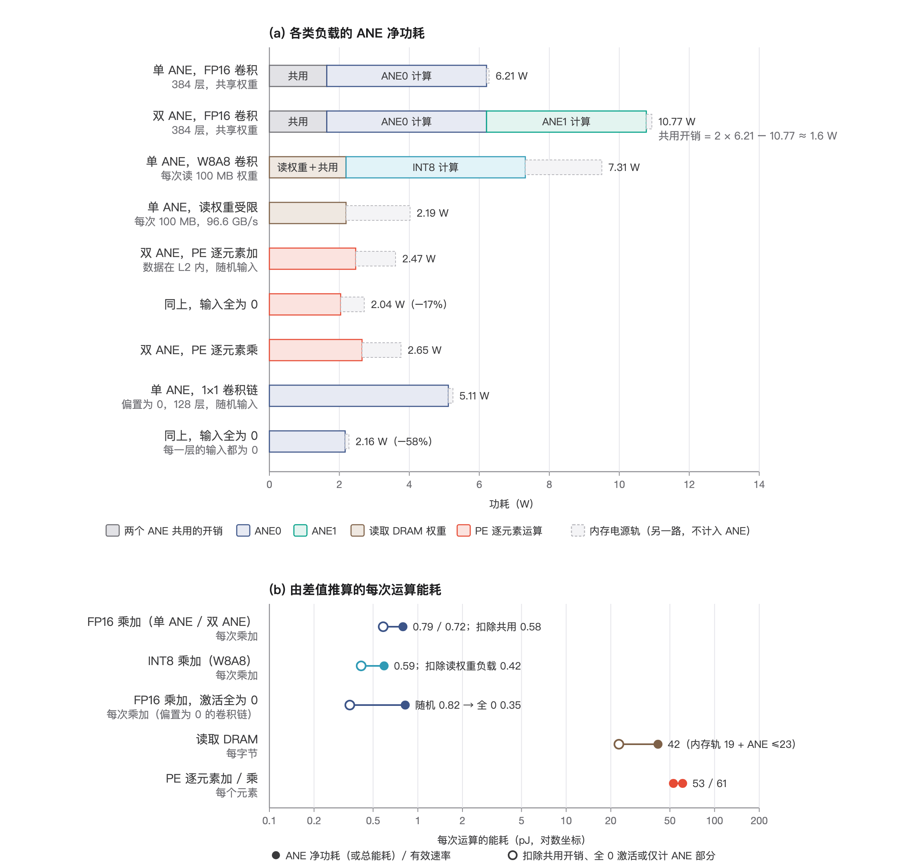

*图 13-1　ANE 功耗的分解。（a）各类负载扣除 CPU 簇后的 ANE 净功耗，虚线浅灰段为同时段内存电源轨的增量；FP16 卷积按双 ANE 与单 ANE 两倍之差拆出约 1.6 W 的共用开销；（b）由负载间差值推算的每次乘加、每字节 DRAM 读取和每个 PE 元素的能耗（数据：[power_parts4/](../data/11_power/power_parts4/)、[power_zero/](../data/11_power/power_zero/)）。*

### 13.4 档位与每次推理的能耗

第 12 章表明，主机在调用之间插入空闲时，CLPC 会降低 ANE 的时钟档位。表 13-3 给出了同一个单 ANE 模型（每次推理 1.29 × 10¹⁰ 次乘加）在不同睡眠时间下的功耗和每次推理的能耗。这一组数据来自 PP0b 直读测量；我们在扣除 CPU 簇后的复测中测量了睡眠 3200 µs 一点，ANE 净功耗为 0.43 W，与表中的 0.46 W 一致（数据：[power_parts/](../data/11_power/power_parts/)、[power_parts2/](../data/11_power/power_parts2/)、[power_parts4/](../data/11_power/power_parts4/)）〔SMC〕。

*表 13-3　调用前睡眠时间与每次推理的 ANE 能耗*

| 睡眠时间    | 每次调用    | ANE 功耗 | 整机     | 每次推理的 ANE 能耗 |
| ------- | ------- | ------ | ------ | ------------ |
| 0       | 1647 µs | 6.29 W | 10.0 W | 10.4 mJ      |
| 100 µs  | 1539 µs | 6.17 W | 9.8 W  | 10.1 mJ      |
| 300 µs  | 3696 µs | 1.00 W | 2.8 W  | 4.0 mJ       |
| 800 µs  | 4790 µs | 0.71 W | 2.3 W  | 4.0 mJ       |
| 1600 µs | 4562 µs | 0.61 W | 2.6 W  | 3.7 mJ       |
| 3200 µs | 4577 µs | 0.46 W | 2.1 W  | 3.5 mJ       |
| 6400 µs | 4615 µs | 0.31 W | 1.8 W  | 3.4 mJ       |

调用之间只要空出约 300 µs 以上，CLPC 就不再把 ANE 推到最高档：每次调用变慢 2.2–2.9 倍，每次推理的 ANE 能耗则降至最高档时的 1/2.6 至 1/3.1。按第 12.2 节的测量，睡眠 300 µs 时 ANE 约运行在 1032 MHz，睡眠更长时运行在下限 852 MHz。按动态功耗与频率和电压平方之积成正比的规律，每次推理的能耗主要取决于电压，低档时能耗下降主要来自电压的降低；能耗下降的倍数与延迟增加的倍数相近，只是数值上的巧合〔推断〕。这一结果还说明 ANE 的静态功耗很小：如果静态功耗占比较大，以低档长时间运行就会因为静态功耗的累积而抵消降压带来的节省，"快速完成再断电"会更省电；实测则相反。图 13-2 给出了每次推理的 ANE 能耗与调用间隔。

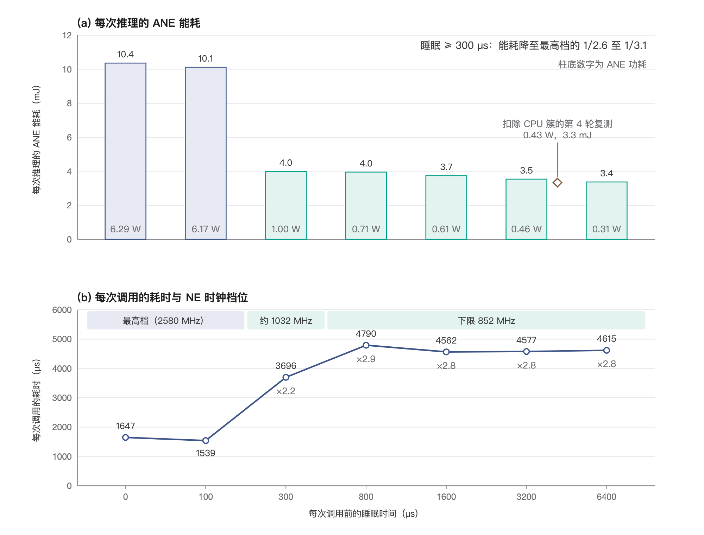

*图 13-2　每次推理的 ANE 能耗与调用间隔。同一单 ANE FP16 模型在每次调用前睡眠 0–6400 µs：（a）每次推理的 ANE 能耗，即 ANE 功耗 ×（每次调用耗时 + 睡眠时间），菱形为扣除 CPU 簇后对睡眠 3200 µs 的复测；（b）每次调用的耗时及对应的 NE 时钟档位（数据同表 13-3）。*

### 13.5 每次调用的固定能耗

小模型高频调用时，能耗的分布与大模型完全不同。表 13-2 中 16 层的小模型每次调用只有 268 µs，每秒约 3700 次调用；此时 ANE 净功耗只有 2.08 W，而 `PACC0` 簇的功耗高达 7.29 W。也就是说，Core ML 调用线程使 CPU 簇比空闲时多出约 6 W，摊到每次调用约 1.6 mJ。另一方面，按表 13-2 中 384 层模型的约 0.79 pJ/MAC 计算，16 层模型每次调用的计算约需 0.43 mJ，而 ANE 每次调用的实际能耗约为 0.56 mJ，因此 ANE 本身每次调用的固定开销约为 0.13 mJ〔SMC，IOReport〕。该测量点的 CPU 簇处于高负载状态，按第 13.1.2 节，扣除 CPU 簇时基线的误差可能达到约 1 W，摊到每次调用约 ±0.27 mJ，大于 0.13 mJ 本身；因此这一数值只能说明 ANE 的固定开销不超过约 0.4 mJ。

由此可见，高频小调用之所以耗电，主要原因不在 ANE，而在主机 CPU 一侧的调用开销：每次调用中，CPU 需要准备请求、等待完成通知并唤醒调用线程（第 6.5 节），这些工作的能耗至少是 ANE 固定开销的约 4 倍。

### 13.6 编译器的功耗模型

第 7.1 节所述的性能模型 CSV 中有一列 `power(W)`。我们反汇编了生成这一列的函数 `perfmodel::EnginePerf::ComputePowerMetric`，发现它只计算内存访问的能耗：功率等于三路 Tile DMA 与 Kernel DMA 访问的字节数乘以每字节能耗，再除以估计的执行时间；每字节能耗只有两档，某一路的数据量不超过系统级缓存容量（16 MiB）且缓存标志打开时按 10 pJ/B 计（视为缓存命中），否则按 50 pJ/B 计（视为访问 DRAM）。这两个常数来自 HAL 参数表的偏移 0x890〔编译器，HAL〕。我们用 CSV 中的具体行核对了这一公式，结果都正好是 50.0 pJ/B。由此可知，编译器没有为乘加阵列、L2 和 PE 建立功耗模型，`power(W)` 一列不能用来分解 ANE 的功耗。另一方面，它所用的 50 pJ/B 与本文实测的读取 DRAM 总能耗（约 42 pJ/B）在量级上相符。

### 13.7 比较

本节从三个层次比较 M6 ANE 的能效：与上一代的 M4 ANE 比较，与同一芯片上的 CPU 和 GPU 比较，以及与其他厂商的 NPU 和加速器比较。三者的可比性依次降低，需要注意每一项比较所用的测量口径。

#### 13.7.1 与 M4 的比较

maderix [4] 报告 M4 的 ANE 空闲时功耗为 0，FP16 满载时为 4.57 W（4.1 TFLOPS/W），W8A8 满载时为 12.25 W（2.9 TOPS/W），即 W8A8 的吞吐为 FP16 的 1.95 倍，而功耗为 2.7 倍。M6 的结果在两方面与之不同。其一，M6 上 W8A8 的能效高于 FP16（约 1.4 倍），而 M4 上 W8A8 的能效低于 FP16。其二，M6 单 ANE 的 FP16 能效约为 2.5 TFLOPS/W，低于 maderix 报告的 M4 数值。由于本文在 M4 上发现 PP0b 同样为 ANE 和 CPU 簇供电，而不同研究所用的功耗来源和扣除方法不同，这些数值不宜直接比较。作为参照，M4 的 ANE 净功耗随负载不同在约 5–9 W 之间：第 13.3 节的卷积模型为 5.1–8.2 W，另一个形状不同的 FP16 卷积负载约为 8.7 W，同一时段 `powermetrics` 报告的 ANE 功耗为 9.6 W〔SMC，IOReport〕。maderix 早期在 Part 2 和 Part 3 中报告的 2.8 W 功耗，后来在 Part 4 中被更正为开启低功耗模式下的读数 [2–4]，这也说明 ANE 的功耗对系统状态非常敏感。

#### 13.7.2 与同一芯片上的 CPU 和 GPU 的比较

在同一块芯片上，以相同的方法测量 CPU 和 GPU 完成同样运算的能耗，是最有说服力的对比，因为它消除了工艺、封装和测量口径的差别。作为参照，已有研究在 M1–M4 上用 `powermetrics` 测得 GPU 执行 FP32 矩阵乘的能效为 0.21–0.46 TFLOPS/W [22]，即每次 FP32 乘加约 4–10 pJ。这一数字与 M6 ANE 的 FP16 能效（约 2.5 TFLOPS/W）相差约 5–12 倍，但精度不同（FP32 与 FP16），测量方法也不同，只能说明量级。

#### 13.7.3 与其他 NPU 和加速器的比较

表 13-4 汇总了公开资料中其他 NPU 和加速器的能效。表中数据均来自一手资料，包括学术会议论文、厂商数据手册和厂商发表的论文，并把所有数值换算为 TOPS/W 和 pJ/MAC（1 次乘加计为 2 次运算，pJ/MAC = 2 ÷ TOPS/W）。表中"口径"一列区分两类数据：一类是峰值吞吐除以额定功耗或热设计功耗（TDP），另一类是实测功耗。

*表 13-4　M6 ANE 与其他 NPU 和加速器的能效*

| 器件                          | 工艺    | 精度             | 能效                          | pJ/MAC      | 口径                            | 功耗范围                    | 来源            |
| --------------------------- | ----- | -------------- | --------------------------- | ----------- | ----------------------------- | ----------------------- | ------------- |
| M6 ANE，单 ANE                | 2 nm  | FP16           | 2.5 TFLOPS/W                | 0.79        | 实测吞吐 ÷ 实测功耗                   | PP0b 扣除 PACC0 簇，不含 DRAM | 本文            |
| M6 ANE，双 ANE                | 2 nm  | FP16           | 2.8 TFLOPS/W                | 0.72        | 同上                            | 同上                      | 本文            |
| M6 ANE，扣除共用开销               | 2 nm  | FP16           | 3.4 TFLOPS/W                | 0.58        | 差值推算                          | 同上                      | 本文            |
| M6 ANE，最低档（852 MHz）         | 2 nm  | FP16           | 7.2 TFLOPS/W                | 0.28        | 实测吞吐 ÷ 实测功耗                   | 同上                      | 本文            |
| M6 ANE，双 ANE                | 2 nm  | INT8（W8A8）     | 3.4 TOPS/W                  | 0.59        | 实测吞吐 ÷ 实测功耗                   | PP0b（未扣除 CPU 簇）         | 本文            |
| M4 ANE                      | —     | FP16 / W8A8    | 4.1 TFLOPS/W / 2.9 TOPS/W   | 0.49 / 0.69 | 实测                            | 未说明扣除方法                 | maderix [4]   |
| 三星 Exynos 9820 NPU          | 8 nm  | INT8，利用稀疏      | 11.5 TOPS/W                 | 0.17        | 芯片实测，最佳工作点                    | NPU 核心                  | Song 等 [14]   |
| 联发科 5G SoC APU              | 7 nm  | INT8 等         | 3.4–13.3 TOPS/W             | 0.15–0.59   | 芯片实测，随电压与负载变化                 | NPU 核心                  | Lin 等 [15]    |
| 三星 Exynos 2100 NPU          | 5 nm  | INT8，利用稀疏      | 13.6 TOPS/W                 | 0.15        | 芯片实测（Inception-v3）            | NPU 核心                  | Jang 等 [16]   |
| Google Edge TPU             | —     | INT8           | 2 TOPS/W                    | 1.0         | 峰值 ÷ 额定功耗（4 TOPS，2 W）         | 模块                      | 数据手册 [17]     |
| NVIDIA Jetson AGX Orin 64GB | 8 nm  | INT8，稠密        | 约 2.3 TOPS/W                | 约 0.87      | 峰值 ÷ 最大功耗（约 138 TOPS，60 W）    | 整个模块，含 CPU 与 DRAM       | 数据手册 [18]     |
| Google TPU v1               | 28 nm | INT8           | 2.3 TOPS/W                  | 0.87        | 峰值 ÷ 实测忙碌功耗（92 TOPS，40 W）     | 芯片                      | Jouppi 等 [12] |
| Google TPU v4               | 7 nm  | BF16           | 1.6 TFLOPS/W                | 1.23        | 峰值 ÷ 实测平均功耗（275 TFLOPS，170 W） | 芯片与 HBM                 | Jouppi 等 [13] |
| NVIDIA A100 SXM             | 7 nm  | FP16 / INT8，稠密 | 0.78 TFLOPS/W / 1.56 TOPS/W | 2.56 / 1.28 | 峰值 ÷ TDP（400 W）               | 整卡                      | 数据手册 [19]     |
| NVIDIA H100 SXM             | 4 nm  | FP16 / INT8，稠密 | 1.41 TFLOPS/W / 2.83 TOPS/W | 1.42 / 0.71 | 峰值 ÷ TDP（700 W）               | 整卡                      | 数据手册 [20]     |
| Eyeriss                     | 65 nm | 16 位定点         | —                           | 约 12        | 芯片实测（AlexNet 卷积层）             | 芯片                      | Chen 等 [21]   |

笔记本和手机平台的主流 NPU，包括 Qualcomm Snapdragon X Elite 的 Hexagon NPU（45 TOPS）、Intel Lunar Lake 的 NPU 4（48 TOPS）、AMD Ryzen AI 300 的 XDNA 2（50 TOPS）以及联发科天玑 9400 的 NPU，厂商只公布了 INT8 的峰值吞吐和相对于前代或竞品的能效倍数，没有公布 NPU 的绝对功耗，因此无法折算为 TOPS/W，未列入表中。Google 也没有公布 Tensor 芯片中 TPU 的吞吐和功耗。MLPerf Mobile 基准不报告能耗，同样无法用于比较。

表 13-4 中的数值在口径上差异很大，比较时需要注意以下四点。第一，峰值与实测的差别。本文的 M6 数据是真实负载下的有效吞吐除以实测的电源轨功率；厂商数据手册的数值则是峰值吞吐除以额定功耗或 TDP，前者高估了吞吐，后者通常高估了功耗，两者的偏差方向相反，净效果不确定。在数据中心加速器中，口径最接近本文的是 TPU v1 和 TPU v4，它们使用实测功耗，但吞吐仍是峰值；表中的 ISSCC 芯片同时实测了吞吐和功耗，但测量范围只限于 NPU 核心。第二，稀疏与稠密的差别。NVIDIA 数据手册中醒目位置给出的 TOPS 通常按结构化稀疏计算，表中已换算为稠密值；三星 ISSCC 和 ISCA 论文中的 TOPS/W 计入了跳过的零值运算，应视为最佳情况。第三，功耗边界的差别。ISSCC 论文给出的是 NPU 核心在最佳电压点的功耗，Jetson 是整个模块的功耗，TPU v4 包括 HBM，而本文的 ANE 净功耗（PP0b 扣除 PACC0 簇）不包括 DRAM。相对于 TPU v4 和 Jetson，本文的口径对 M6 有利；相对于只计核心的 ISSCC 数据，则对 M6 不利。第四，精度与工艺的差别。移动 NPU 厂商大多只给出 INT8 数据，FP16 的可比数据很少；从 65 nm 的 Eyeriss 到 4–8 nm 的现代 NPU，每次乘加的能耗下降了一个数量级以上，其中大部分来自工艺的进步。

在上述限制下，我们可以得出两点有保留的结论。

其一，M6 ANE 在最高档时的 FP16 能效约为 2.5–2.8 TFLOPS/W，与数据中心的 H100（1.41 TFLOPS/W）和 TPU v4（1.6 TFLOPS/W）处于同一量级，高于 A100（0.78 TFLOPS/W）。但是，三篇移动 NPU 芯片论文报告的 INT8 能效普遍高于 M6 在最高档时的 INT8 实测值（约 3.4 TOPS/W）：Song 等 [14] 在 ISSCC 2019 上报告，三星 Exynos 9820 的 NPU 达到 11.5 TOPS/W；Lin 等 [15] 在 ISSCC 2020 上报告，联发科一款 7 nm 5G 手机 SoC 中的深度学习加速器为 3.4–13.3 TOPS/W；Jang 等 [16] 在 ISCA 2021 上报告，三星 Exynos 2100 的 NPU 在 Inception-v3 上达到 13.6 TOPS/W。这三个数值都只计 NPU 核心的功耗，其中两篇三星论文还计入了跳过的零值运算，因此它们与 M6 的差距有一部分来自口径。

其二，ISSCC 论文中的能效往往以一个区间给出，例如 Lin 等 [15] 的 3.4–13.3 TOPS/W。这一区间反映的是同一款加速器在不同工作电压、负载和数据精度下的能效变化。M6 也有类似的现象：在最低档（852 MHz）时，M6 的 FP16 能效约为 7.2 TFLOPS/W，是最高档时的约三倍（第 13.4 节）。这一数值落在 Lin 等 [15] 的区间之内，但 M6 的数值是 FP16 精度下的结果，而该区间中的数值未必是同一精度，两者不能简单地等同。由此可见，不同 NPU 之间能效的比较，在很大程度上取决于比较的是哪一个工作点和哪一种精度。因此，在与其他 NPU 比较时，应同时给出 M6 在最高档和最低档的能效，并注明精度。

### 13.8 小结

M6 上没有 ANE 专用的可读电源轨，SMC 的 PP0b 同时为 ANE 和 CPU 的 S 核、P 核供电，ANE 的功耗需要扣除 CPU 簇的功耗后才能得到。按这一方法，单 ANE 满载约 6.2 W，双 ANE 满载约 10.8 W，两者之间有约 1.6 W 的共用开销，空闲时为 0。扣除共用开销后，FP16 乘加约为 0.58 pJ，INT8 乘加约为其 70–80%；PE 逐元素运算每个元素约 50–60 pJ，主要来自片上数据搬运；从 DRAM 读取数据约为 42 pJ/B。卷积的激活全为 0 时，ANE 功耗在 M6 和 M4 上都降低约 58%，耗时不变；部分为 0 时，省电随 0 的比例单调增加（低于按比例的预期），与 0 是否成对无关，0 成大块出现时还有额外的节省。CLPC 选择低档时，每次推理的能耗约为最高档的三分之一，说明 ANE 的静态功耗很小。高频小调用时，主要的能耗在主机 CPU 一侧，每次调用约 1.6 mJ，至少是 ANE 固定开销的约 4 倍。编译器的功耗模型只计算内存访问的能耗，不能用于分解 ANE 的功耗。

仍未确定的是约 1.6 W 共用开销的组成，以及零激活省电来自关闭时钟还是乘法器少翻转，这些都需要分部件的功耗读数（第 16.2 节）；在同一芯片上比较 CPU、GPU 与 ANE 完成相同运算的能耗，也留待后续工作（第 16.3 节）。由本章结论导出的部署建议集中在第 15.2 节（表 15-1）。

## 14. 实际应用测试

前面各章以专门构造的微基准研究了 M6 ANE 的各个部分，并由此可以对实际负载作出若干推论。本章用实际的应用负载检验这些推论。数据来自我们在 M6 与 M4 两台 Mac mini 上进行的一组整机测评，涵盖大语言模型、图像分类和文字识别三类任务；语音转文字的速度数据受一次临时系统状态的影响，不予采用，只保留其编译方面的观察。整机测评只记录了调用耗时、ANE 忙碌比例、读内存速率和功耗，没有记录固件时间戳和每个引擎的中断数；而且比较的是两代芯片，时钟、带宽和主机 CPU 等代际差别混在一起。因此，本章能够检验的是结果是否符合预期的方向和大致幅度。与机制相容的现象并不等于对机制的验证，凡是没有分离的因素，我们都逐项指出。

本章先由前面各章的结论写出五类可观察的预期（第 14.2 节），再逐组报告结果，每组回答三个问题：符合哪个预期，能解释到什么程度，还有什么没有分离出来。本章的主要结论有四点。第一，计算密集、每次调用工作量较大的任务上，M6 的 ANE 比 M4 快 1.8–2.7 倍，远高于单个引擎约 1.1 倍的峰值之比，符合第二个引擎主要使计算密集任务受益的预期；但文字检测的 2.69 倍超出了双引擎的峰值之比（约 2.2 倍），超出部分本文无法解释。第二，每次调用工作量很小的任务提速明显缩小，一次处理一张图像时只快 1.42 倍，方向符合主机开销占比变大的预期；按与任务时长相应的主机开销计算，可以解释 M6 多出耗时的约三分之二，其余约 0.15 ms 没有分离。第三，大语言模型的解码在 M6 上快 1.86 倍，但两代的引擎数之比与读权重带宽之比都约为 2，这一倍数本身不能说明解码受哪一方限制；按读权重量折算，M6 只用到读权重上限的约 60%，低于 M4 的约 70%，减少调用次数后速度提高 31%，这与解码同时受读权重和调用次数限制的预期相符，但定制模型同时改变了权重位数，调用次数的作用没有单独分离。第四，减少调用次数的模型主机 CPU 功耗约 0.3 W，低于标准模型的约 1 W，符合频繁调用时能耗偏向主机的预期；此外，ANE 在测得功耗的各项任务上都比同一台机器上的 GPU 更省电。

### 14.1 测试设置

测评在两台 16 GB 内存、256 GB 存储的 Mac mini 上进行，系统均为 macOS 27.0.1（26A434）。两台机器皆关闭其他应用和 iCloud 同步，使用同一份经 SHA256 核对的模型文件。速度测试不开启监控；需要 ANE 忙碌比例、读内存带宽和功耗时另行运行一次带监控的测试，监控数据来自 anemon [27]、`powermetrics`、SMC 电源轨和 IORegistry。小模型任务以 Core ML 运行，计算单元设为 `CPU_AND_NE`；功耗对比时另以 `CPU_AND_GPU` 运行同一模型文件作为参照。

功耗数据需要谨慎解读。如第 13 章所述，M6 上没有 ANE 专用的可读电源轨，测评中 M6 的 ANE 功耗是由 SMC 电源轨推算得到的；而 PP0b 同时为 CPU 的 S 核和 P 核供电，当主机一侧的运行器占用较多 CPU 时，这一数值会偏高。此外，作为日常用机的 M4 在测试时常有后台程序运行，整机待机功耗在 7–15 W 之间变化。因此，第 14.5 节比较能效时以"整机功耗减去待机功耗"为主要依据。本章的测评数据保存在我们的测评记录中，目前只有图 14-1 所用的 ANE 资源曲线整理进了代码仓库（附录 B.3）。

### 14.2 可检验的预期

基于各章的结论，在此对各类实际负载有五类预期。为了与两代芯片的比较对照，我们尽量给出 M6 相对 M4 的量级。

预期一：计算密集、每次调用工作量较大的任务最能从第二个引擎受益。M6 单个引擎的 FP16 直接卷积峰值为 21.1 TFLOPS，M4 约为 19 TFLOPS（表 7-14），只高约 10%；两个引擎合计为 42.3 TFLOPS，在计算受限的网络上扩展效率约为 96%（第 10.3 节）。因此，如果编译器把这类任务切分到两个引擎上，M6 相对 M4 应快约 2 倍，上限约为峰值之比 2.2 倍；如果没有切分，则只应快约 1.1 倍。

预期二：每次调用的工作量越小，提速越小。每次同步调用在 ANE 任务之外约有 0.16–0.36 ms 的主机开销，并随任务时长增加（第 6.5 节），双 ANE 程序还要多约 30 µs（第 10.3 节）；这部分开销不随 ANE 变快而缩短，任务越短，所占比例越大。

预期三：大语言模型的解码受读权重限制，同时受每个词元的调用次数限制。解码每生成一个词元都要读入全部权重，而第二个引擎不增加可用的读权重带宽（第 9.3.4 节、第 10.4 节、第 10.7 节），所测的 M = 1 矩阵乘也不会被切分到两个引擎（第 5.8.4 节）。因此，解码的速度应由读权重带宽决定（M4 约 67 GB/s，M6 约 145–150 GB/s，第 9.6 节），并被每次调用的主机开销压低；减少每个词元的调用次数，应当提高 ANE 的忙碌比例。

预期四：部分运算留在 CPU 上的模型，ANE 的提速会被稀释。Core ML 把 ANE 不支持的运算放到 CPU 上（第 5.2 节），整体的提速受 CPU 部分的限制。

预期五：频繁调用时，相当一部分能耗花在主机 CPU 上（第 13.5 节）；减少调用次数应当降低主机一侧的功耗。

需要注意的是，预期一和预期三在两代比较上给出的倍数都约为 2，单凭 M6 与 M4 之比无法区分计算受限与读权重受限，需要借助 ANE 忙碌比例和读内存速率等辅助指标。下面各节逐组检验。

### 14.3 大语言模型

#### 14.3.1 标准模型

测试模型由 Qwen3.5-4B 转换为 Core ML 格式，并采用 4 位和 6 位调色板量化存储权重，每生成一个词元需读取约 2.56 GB 权重。模型按 8 段、每段 4 层切分，每段各有逐词元解码（decode）和 128 词元一批的预填充（prefill，即一次处理一批输入词元）两个函数。表 14-1 比较了两代 ANE 的速度。

*表 14-1　Qwen3.5-4B 在 ANE 上的速度（词元/秒）*

| 测试                          | M4 ANE | M6 ANE | M6 ÷ M4 |
| --------------------------- | ------ | ------ | ------- |
| 预填充，512 词元（128 词元一批）        | 556.1  | 1016.4 | 1.83    |
| 预填充，4096 词元（128 词元一批）       | 569.5  | 1044.0 | 1.83    |
| 解码，128 词元（原生取最大值）           | 18.63  | 34.72  | 1.86    |
| 解码，128 词元（每个词元把输出传回 Python） | 16.07  | 27.51  | 1.71    |

预填充阶段一次处理 128 个词元，计算密集，M6 的 ANE 比 M4 快 1.83 倍。解码阶段每次只处理一个词元，按原生方式取最大值时 M6 快 1.86 倍；若每个词元都把 248320 维的 logits 向量传回 Python 处理，两台机器都更慢，M6 的提速也降至 1.71 倍，这说明主机一侧的处理直接影响 ANE 的解码速度。

测评记录的 ANE 资源曲线揭示了解码阶段的瓶颈，如表 14-2 所示。

*表 14-2　Qwen3.5-4B 的 ANE 资源曲线（预填充 3072 词元、解码 384 词元）*

| 机器  | 阶段  | 用时     | ANE 忙碌比例           | ANE 读内存    | ANE 功耗  |
| --- | --- | ------ | ------------------ | ---------- | ------- |
| M4  | 预填充 | 5.5 s  | 81%（稳定段约 91%）      | 19.3 GB/s  | 3.2 W   |
| M4  | 解码  | 24.9 s | 76%（在 35–93% 之间跳动） | 44.1 GB/s  | 1.6 W   |
| M6  | 预填充 | 3.1 s  | 68%（稳定段约 84%）      | 21.7 GB/s  | 约 5.5 W |
| M6  | 解码  | 11.4 s | 85%（平稳）            | 至少 82 GB/s | 约 3.2 W |

解码阶段，每生成一个词元，运行器要依次调用 8 段模型和输出层，并由主机写回键值缓存，即每个词元有 9 次 ANE 调用。第 6.5 节表明，每次同步调用在 ANE 任务之外还有数百微秒的主机开销，这些开销使 ANE 在调用之间空闲；M4 的 ANE 在解码时约有四分之一的时间处于空闲，并且忙碌比例大幅跳动，可能正是这一原因〔推断〕。

对照第 14.2 节的预期，预填充符合预期一：1.83 倍远高于单个引擎约 1.1 倍的峰值之比，说明第二个引擎起了作用；读内存只有约 20 GB/s 而 ANE 忙碌比例较高，也说明这一阶段受计算限制。但它低于预期的约 2 倍。表 14-2 中 M6 预填充的 ANE 忙碌比例（68%，稳定段约 84%）低于 M4（81%，稳定段约 91%），这与 M6 变快之后调用之间的主机开销占比变大（预期二）相容；测评没有记录每个引擎的中断数，预填充的各段是否都被切分到两个引擎上，本文无法确认。

解码阶段的性能提升不能仅由读权重带宽解释。1.86 倍与读权重带宽之比（约 2.2）的量级相当，但也与引擎数之比相当，单凭这一倍数无法区分两种解释。更有信息量的是按读权重量折算的速率：每个词元读 2.56 GB，M4 的 18.63 词元/秒对应约 48 GB/s，约为其读权重上限的 70%；M6 的 34.72 词元/秒对应约 89 GB/s，只有上限的约 60%。M6 离上限更远，而 ANE 忙碌比例（85%）却高于 M4（76%），说明 M6 解码时有一部分时间 ANE 处于忙碌状态，却没有以满带宽读权重；这部分时间可能来自键值缓存的读写、输出层与较小的层的开销〔推断〕。因此，解码的结果与预期三相容，但不能把 1.86 倍直接当作读权重受限的证据。图 14-1 给出了两代芯片在预填充与解码过程中的忙碌比例和读内存速率曲线。

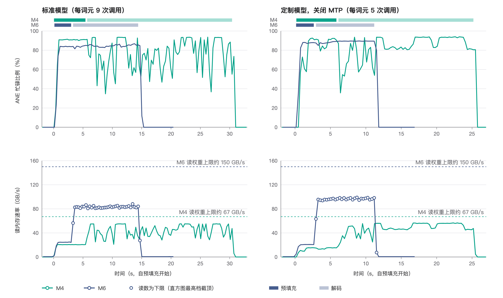

*图 14-1　Qwen3.5-4B 在 ANE 上运行时的资源曲线（预填充 3072 词元、解码 384 词元，anemon 约每 0.25–0.3 s 采样一次）。左列为标准模型，右列为定制模型（关闭 MTP）；上行为 ANE 忙碌比例（M6 为两个 ANE 的平均），下行为读内存速率；上方色条标出两台机器各自的预填充（深色）与解码（浅色）时段，横轴从预填充开始计时。M6 的读带宽来自 IOReport 直方图，解码时部分采样落在最高档，空心点表示读数只是下限。M4 解码时忙碌比例在 35–93% 之间大幅跳动，M6 则平稳；M6 解码时的读内存速率仍远低于其读权重上限（数据：[ane_curve/](../data/12_apps/ane_curve/)；提取：[ane_curve_extract.py](../tools/12_apps/ane_curve_extract.py)）。*

#### 14.3.2 为 M6 定制的模型

我们还为 M6 的 ANE 专门优化了一个版本，用来考察 ANE 运行大语言模型的上限。与标准模型相比，它把模型切为 4 段、每段 8 层，使每个词元的 ANE 调用从 9 次减少到 5 次；权重全部量化为 4 位；预填充阶段的计算图按 32 词元分段；并加入了多词元预测（MTP）的投机解码，每次调用验证 3 个候选词元。这一版本的输出质量较低：与原始 BF16 模型的一致率为 80.0%，困惑度上升 9.6%。表 14-3 给出了它的速度。

*表 14-3　定制模型在 ANE 上的速度（词元/秒）*

| 测试                           | M4 ANE | M6 ANE | M6 ÷ M4 |
| ---------------------------- | ------ | ------ | ------- |
| 预填充，512 词元                   | 530.9  | 1093.1 | 2.06    |
| 预填充，4096 词元                  | 568.6  | 1164.5 | 2.05    |
| 普通解码                         | 22.62  | 45.64  | 2.02    |
| MTP 解码（真实中文提示，平均每步 1.76 个词元） | 31.54  | 60.24  | 1.91    |

与标准模型相比，定制模型在 M6 上的普通解码速度从 34.72 提高到 45.64 词元/秒，提高 31%；在 M4 上提高 21%。资源曲线显示，M6 上定制模型解码时 ANE 的忙碌比例约为 89%，读内存至少 95 GB/s，开启 MTP 后同样 384 个词元的用时从 8.4 s 降至 4.1 s，约减半，而 ANE 功耗基本不变；这一测试的提示与表 14-3 不同，表 14-3 中 MTP 的提速为 1.32 倍，差别来自投机解码的猜中率随内容而变化。这些结果与第 15.2 节"让 ANE 保持忙碌"的部署原则相容：减少每个词元的调用次数，就减少了调用之间的主机开销和空闲，ANE 的利用率随之提高，CLPC 也更容易把时钟维持在高档（第 12 章）。减少每个权重的位数（第 7.5 节）和以投机解码在一次调用中完成多个词元的工作，则是另外两种手段。需要指出的是，定制模型解码时 ANE 读内存至少约 95 GB/s，约为读权重上限的 63%，与标准模型的约 60% 相近，因此不能说瓶颈已经转向读权重带宽。对照预期三，减少调用次数后 M6 解码时 ANE 的忙碌比例从约 85% 升至约 89%（图 14-1），速度提高 31%，方向符合预期；但定制模型同时把权重全部量化为 4 位并改变了分段方式。一个较弱的线索是：权重位数的变化在两台机器上相同，若解码只受读权重限制，两者的提速应当相近，而实际上 M6 提高 31%、M4 只提高 21%；M6 更快，调用开销所占的比例更大，减少调用次数的收益也应更大，这与调用次数起作用相容〔推断〕。定制模型的预填充和解码在 M6 上都比 M4 快约 2 倍，略高于标准模型的 1.8 倍，更接近预期一与预期三给出的约 2–2.2 倍，这与"调用越少，两代硬件的差别越能完整体现"的解释相容〔推断〕。

### 14.4 视觉与语音模型

表 14-4 汇总了三类小模型任务在两代 ANE 上的速度。

*表 14-4　视觉与语音模型在 ANE 上的速度*

| 任务                          | M4 ANE | M6 ANE      | M6 ÷ M4   |
| --------------------------- | ------ | ----------- | --------- |
| ResNet-50 图像分类，一次 16 张（张/秒） | 606.4  | 1412.2      | 2.33      |
| ResNet-50 图像分类，一次 1 张（张/秒）  | 585.6  | 830         | 1.42      |
| EasyOCR 文字检测，CRAFT（张/秒）     | 22.7   | 61.0        | 2.69      |
| EasyOCR 文字识别，16 行一批（行/秒）    | 177.8  | 251.2       | 1.41      |

表 14-4 中的任务可以分为两类。第一类是每次调用工作量较大的任务。文字检测网络对 736×1280 的整幅图像做卷积，63 个算子全部在 ANE 上执行，运行时 ANE 的忙碌比例在 90% 以上，M6 比 M4 快 2.69 倍；ResNet-50 一次处理 16 张图像时，M6 比 M4 快 2.33 倍。这类任务形状固定、计算密集，每次调用的计算量足以掩盖调用开销。文字识别网络中有 2 个双向 LSTM 只能在 CPU 上执行，ANE 的忙碌比例只有 13–21%，提速只有 1.41 倍。

对照预期一，文字检测和一次 16 张的 ResNet-50 的提速远高于单个引擎约 1.1 倍的峰值之比，符合第二个引擎使计算密集任务受益的预期。但两者都高于双引擎的预期：ResNet-50 的 2.33 倍略高于峰值之比 2.2 倍，文字检测的 2.69 倍则明显超出。峰值之比已经包含了时钟的提高，因此超出的部分不能再用时钟解释。可能的原因是 M4 在这些形状上本身没有达到峰值（例如受切块或读权重的限制，第 9 章），或 M6 的硬件 Winograd 在 3×3 卷积上提供了额外的有效吞吐（第 7.4.3 节）。文字识别的结果符合预期四。

第二类是每次调用工作量很小的任务。ResNet-50 一次处理 1 张图像时，复测中 M6 的每次调用约 1.2 ms，每秒 830 张；M4 约 1.7 ms，每秒 586 张。M6 只快 1.42 倍，远小于一次 16 张时的 2.33 倍，这一方向符合预期二：每次调用的工作量越小，固定的调用开销在总时间中所占的比例越大，计算阵列和第二个引擎的优势越难体现〔计时〕。

不过，幅度只得到部分解释。按一次 16 张的吞吐折算，M6 处理一张图像约需 0.71 ms，M4 约需 1.65 ms。一次只处理 1 张时，M4 每次调用多出约 0.06 ms，不超过文献中 M4 每次调用 0.09–0.16 ms 的固定开销（表 6-11）；M6 每次调用的中位数多出约 0.5 ms，若按每秒 640 张的平均吞吐计算则多出约 0.85 ms，差别来自少数偏慢的调用（见下文）。主机开销随任务时长增加（第 6.5.3 节），对单次约 1.2 ms 的调用，任务以外的时间约为 0.34–0.37 ms（表 6-4），扣除一次 16 张时分摊到每张的部分后约为 0.34 ms，可以解释中位数多出部分的约三分之二，剩余约 0.15 ms。这一剩余可能来自双 ANE 程序的启动与同步（一次 1 张的模型被切分到两个 ANE 上，见下文），也可能来自小批量下各层效率的下降。

另一个与上述临时状态无关、并且可以稳定复现的现象是：M6 一次处理 1 张时，分类结果的 top-1 与 GPU 的结果有 5.9% 不一致，而一次 16 张以及 M4 上的各种情况都完全一致。M6 把一次 1 张的模型切分到两个 ANE 上执行〔IOReport〕，我们推测切分改变了部分层的执行方式，例如运算的融合、是否使用 Winograd，或中间结果是否经 DRAM 并做类型转换，从而在少数接近决策边界的样本上改变了 top-1 的结果〔推断〕；由第 8 章，单趟内的定点累加与求和顺序无关；但多趟累加是否经 FP16 中转没有测试，因此也不能完全排除累加方面的原因。确认这一点，需要逐层比较 ANE 与 GPU 的输出差异。这一现象不在第 14.2 节的任何预期之中；第 8 章的数值结论只能排除单趟累加中的求和顺序，不能给出原因。

测评还遇到了第 5 章所述的编译问题。M6 上每个新的进程名都要为 Whisper 的 ANE 程序重新编译 20 多分钟；第 5.9 节的复测表明，耗时几乎全部来自 1.2 GB 的音频编码器，原因是双 ANE 空间切分的全局细化把权重副本写成交换文件，每个编码器层约 2.4 GB，完整编码器约需 78 GB，而 M4 编译同一编码器只需 80 s、约 1.3 GB（缺陷 A3）。中途结束程序后，编译服务仍会继续运行并写入交换文件，测评中把系统盘写到只剩 121 MB，系统随后清除了 ANE 的编译缓存，此后每次加载都要重新编译（缺陷 A4）。以同一进程名再次加载时编译结果本来可以复用，测评中每次加载都重新编译，正是缓存被清除所致。大语言模型同样受编译代价影响：约 4B 参数的模型首次编译需要约 80 分钟。这些现象对应第 5.9 节和第 5.10 节所述的双引擎编译路径的超线性代价、编译服务只在 E 核上运行，以及编译服务失控后的阻塞（缺陷 A2、A3、A4、B1、B2）。它们是第 5 章所述缺陷在实际负载上的重现，而不是对上述预期的检验。

### 14.5 功耗

表 14-5 给出了几个任务在 ANE 上运行时的功耗，并以同一台机器上 GPU 运行同一模型的结果作为能效参照。由于 M6 上 ANE 本身的功耗只能由电源轨推算（第 14.1 节），表中以整机功耗减去待机功耗计算的能效为主。

*表 14-5　ANE 的功耗与能效（以 GPU 为参照）*

| 任务                      | 机器  | ANE 功耗   | ANE 整机能效（扣除待机） | ANE 能效 ÷ GPU 能效 |
| ----------------------- | --- | -------- | -------------- | --------------- |
| Qwen3.5-4B 解码（标准模型）     | M4  | 1.39 W   | 1.91 词元/J      | 1.5             |
|                         | M6  | 约 1.85 W | 2.55 词元/J      | 1.09            |
| Qwen3.5-4B 解码（定制模型，MTP） | M4  | 1.95 W   | 4.55 词元/J      | 3.6             |
|                         | M6  | 约 2.65 W | 5.32 词元/J      | 2.3             |
| ResNet-50，一次 16 张       | M4  | 2.4 W    | 85.6 张/J       | 8.3             |
|                         | M6  | 约 2.9 W  | 82.0 张/J       | 2.1             |
| EasyOCR 文字检测            | M4  | —        | 3.06 张/J       | 11.8            |
|                         | M6  | —        | 3.32 张/J       | 4.3             |

在这些任务中，ANE 的整机能效都高于同一台机器上的 GPU，在 M4 上是 GPU 的 1.5–11.8 倍，在 M6 上是 GPU 的 1.09–4.3 倍。表 14-5 的 ANE 功耗来自专门的功耗对比测试，表 14-2 的功耗来自带 anemon 监控的资源曲线测试，两者的负载段和测量窗口不同，数值不宜直接比较。M6 上 ANE 的能效优势小于 M4，一方面是因为 M6 的 GPU 能效有较大提高（按表 14-5 的比值折算，M6 的 GPU 整机能效在这四项任务上约为 M4 的 1.8–3.8 倍），另一方面，M4 的测试受后台程序影响，待机功耗较高，对"扣除待机"的计算也有影响。ANE 运行大语言模型解码时功耗只有约 1.4–3.2 W；定制模型由于每个词元的 ANE 调用更少，主机一侧的 CPU 功耗只有约 0.3 W（标准模型约 1 W）。不过，整机能效的提高主要来自速度：按表 14-5 推算，M6 上标准模型与定制模型（MTP）解码时扣除待机后的整机功耗分别约为 13.6 W 和 11.3 W，只降低约 17%，而速度提高约 1.7 倍；ANE 与主机 CPU 只占这一功耗的一小部分，其余来自内存、互连等系统部分。ANE 相对 GPU 的能效优势不在第 14.2 节的预期之中，这里只作为观察报告。

### 14.6 预期与测评结果的对照

图 14-2 先把各项任务的 M6 ÷ M4 加速比放在一起，表 14-6 再把第 14.2 节的五类预期与测评结果逐项对照。

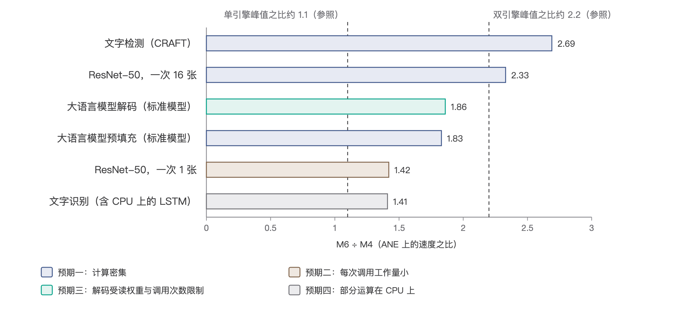

*图 14-2　各项实际任务在 ANE 上的 M6 ÷ M4 加速比（标准模型）。颜色对应第 14.2 节的预期。两条虚线只是参照值：单引擎 FP16 峰值之比约 1.1，双引擎峰值之比约 2.2（M4 的峰值本身是约数，表 7-14）。计算密集的任务落在双引擎参照值附近，文字检测还超出了它；每次调用工作量小、部分运算在 CPU 上的任务则接近单引擎参照值（数据：表 14-1、表 14-4）。*

*表 14-6　预期与测评结果的对照*

| 预期                                            | 测评结果                                                         | 符合的程度                                                         | 没有分离的因素                                          |
| --------------------------------------------- | ------------------------------------------------------------ | ------------------------------------------------------------- | ------------------------------------------------ |
| 预期一：计算密集的任务最能从第二个引擎受益（第 7.9 节、第 10.3 节）       | 预填充 1.83 倍；ResNet-50 一次 16 张 2.33 倍；文字检测 2.69 倍              | 方向相符，都远高于单个引擎的约 1.1 倍                                         | 预填充低于约 2 倍的部分；文字检测超出峰值之比 2.2 倍的部分；各任务是否全部切分到两个引擎 |
| 预期二：每次调用工作量越小，提速越小（第 6.5 节）                   | 一次 1 张时只快 1.42 倍；M6 预填充的忙碌比例低于 M4                         | 方向相符；M6 一次 1 张多出约 0.5 ms（中位数），与任务时长相应的主机开销（约 0.34 ms）可解释约三分之二 | 剩余约 0.15 ms：双 ANE 程序的启动与同步、小批量下的层效率              |
| 预期三：解码受读权重与调用次数共同限制（第 6.5 节、第 9.3 节、第 10.4 节） | 标准模型 1.86 倍；按权重量折算，M6 约用到读权重上限的 60%，M4 约 70%；减少调用后 M6 提速 31% | 相容；倍数本身不能区分计算受限与读权重受限                                         | 调用次数与权重位数各自的作用；解码是否只用一个引擎；ANE 忙碌但未满带宽的时间         |
| 预期四：部分运算留在 CPU 时提速被稀释（第 5.2 节）                | 文字识别的 LSTM 留在 CPU 上，ANE 忙碌 13–21%，提速 1.41 倍                  | 方向相符                                                          | 两代 CPU 部分的差别                                     |
| 预期五：频繁调用时能耗偏向主机（第 13.5 节）                     | 定制模型主机 CPU 约 0.3 W，标准模型约 1 W                                 | 方向相符                                                          | 调用次数与权重位数各自的作用                                   |
| 预期之外                                          | M6 一次 1 张时 top-1 与 GPU 有 5.9% 不一致                            | 第 8 章只排除了单趟累加中的求和顺序                                           | 切分改变了哪些层的执行方式                                    |
| 第 5 章缺陷的重现                                    | 大模型首次编译数十分钟；编译服务失控；编译缓存被清除                                   | 与第 5.9 节、第 5.10 节一致                                           | —                                                |

表 14-6 之外，测评记录中还有几项 ANE 硬件峰值的数字，与本文的测量口径不同，需要加以说明。其一，测评以 anebench 在最快的形状上测得 M6 的 ANE FP16 算力为 50.1 TFLOPS、INT8 约为 90 TOPS（M4 分别为 18.8 TFLOPS 和 38.2 TOPS）。M6 的 FP16 数值超过了本文的 FP16 直接卷积理论峰值（双 ANE 42.3 TFLOPS，第 7.2 节），最可能的解释是计入了硬件 Winograd 的加速（第 7.4.3 节），即测评所选的最快形状使用了 3×3 卷积；若测评模型的权重含有大量零值，零权重跳过也可能起作用（见下文）〔推断〕。

测评还发现，M6 在全 0 输入下的结果会虚高到 FP16 55.6 TFLOPS、INT8 106 TOPS，而 M4 不受影响。计算阵列不跳过零激活（第 7.5 节），因此这不是激活零值的效果。一个候选解释是零权重检测：稠密存放的零权重会触发这一功能，而它在 M6 上打开、在 M4 上不打开（第 7.5 节、第 15.3 节），若测评工具在这一模式下的权重也全为 0，就能解释两台机器的差别；以稀疏格式存放的零权重则不能解释，因为 M4 同样会跳过它们〔推断〕。

其二，测评以 anemon 的矩阵乘向量负载推算的 ANE 读内存带宽，M4 约为 66 GB/s，M6 约为 133 GB/s。M4 的数值与本文在 M4 上测得的约 67 GB/s（第 7.5 节）一致；M6 的数值低于本文由固件任务时长测得的约 150 GB/s（第 9.3.2 节），原因是前者按调用总耗时计算，包含了主机开销。其三，测评记录中"ANE 片上缓存 M4 约 14 MB、M6 约 32 MB"的估计，与本文由编译器得到的"每个 ANE 的 L2 按 2 MiB 使用"不同；我们认为前者反映的是某种负载在性能曲线上的拐点，而不是片上存储的容量，这与 maderix 早期由性能下降推断 SRAM 容量、后来又更正的情况相同（第 2.1 节）。

### 14.7 小结

本章用实际应用负载检验了前面各章的推论。测评结果在方向上与五类预期都相容，其中预期一、二的证据较有力，预期三至五还不能与其他解释区分：计算密集的任务（预填充、批量图像分类、文字检测）在 M6 上比 M4 快 1.8–2.7 倍，远高于单个引擎的约 1.1 倍，最可能的来源是第二个引擎；每次调用工作量很小时，提速缩小到约 1.4 倍；大语言模型的解码受读权重和调用次数共同限制，为 M6 定制的模型减少调用次数并降低权重位数后，ANE 的普通解码速度比标准模型提高约 31%（45.64 对 34.72 词元/秒），再加上投机解码（MTP）后约为标准模型的 1.7 倍（60.24 词元/秒）；部分运算留在 CPU 上时，ANE 的提速被稀释；减少调用次数也降低了主机一侧的功耗。按整机功耗计算，ANE 在这些任务上都比同一台机器上的 GPU 更省电。

但整机测评只能检验方向和量级。在两代比较中，引擎数之比与读权重带宽之比都约为 2，解码的倍数本身不能区分两种限制；文字检测的 2.69 倍超出了峰值之比，M6 一次处理 1 张时多出的耗时只有约三分之二能由主机开销解释，这两处本文没有完全解释；定制模型同时改变了调用次数和权重位数，两者的作用没有分离；一次处理 1 张时与 GPU 的 top-1 不一致，则在预期之外。要把这些相容的现象变成对机制的验证，需要在实际模型上记录固件时间戳和每个引擎的中断数，并逐次只改变一个因素。

## 15. 讨论

第 4–13 章沿着一次推理调用的生命周期，分别研究了 M6 ANE 的编译、调度、计算、数值、存储、双引擎协同、时钟、调频和功耗；第 14 章又在实际应用负载上检验了这些结论。本章不再重复各章的结论，而是把它们放在一起讨论三个问题：从这些结果中可以看出 M6 ANE 在设计上有哪些整体特点；这些特点对在 ANE 上部署模型意味着什么；与前几代产品相比，M6 改变了什么、沿袭了什么。最后，本章归纳实验中发现的缺陷和未写进文档的行为，并分析它们的共同根源。

### 15.1 M6 ANE 的设计特点

综合各章的实验结果，第 1.3 节提出的整体判断得到了支持。M6 的 ANE 可以概括为三个相互关联的系统特征。这里的划分并非与第 1.3 节的三个方面逐项对应，而是根据实验结果重新组织：第一，编译器的静态安排与主机侧的动态管理共同决定 ANE 的实际执行方式，因此将二者作为 ANE 之外的决策机制统一讨论；第二，两个 ANE 并非完全独立，而是共享部分关键资源；第三，编译器对硬件性能的建模存在偏差，使静态调度本身也可能成为性能损失的来源。

第一，ANE 是一个由编译器静态调度、由主机动态管理的配置引擎。在执行层面，ANE 几乎没有自主决策：程序是编译时确定的寄存器写入序列，没有指令和分支（第 5 章）；执行顺序由编译器排定的任务描述符序列决定，在本文测试的程序中，各功能单元之间可观察到的并行只发生在单个任务的流水线内部（第 6 章；整图计时无法判断硬件能否在任务之间并行）；在双引擎程序中，切分方式和两个引擎各自的工作量也在编译时确定（第 5、10 章）。在管理层面，决策同样不在 ANE 内部：请求的优先级、执行的引擎和程序变体由主机驱动选择，时钟档位和节流比例由主机内核中的 CLPC 决定，ANE 固件只负责排队和下发（第 6、12 章）。这种分工使硬件可以保持简单，但也意味着 ANE 的实际性能在很大程度上取决于两个外部因素：编译器的决策质量，以及主机提交请求的方式。

第二，两个引擎在计算上独立，在资源上共享。每个 ANE 有自己的 16 个 NE、编译器按 2 MiB 使用的 L2 和独立的 NE 时钟性能域，在计算受限的负载上可以达到 1.92 倍的加速比，扩展效率约 96%（第 10 章）。但两个引擎共享的资源比它们的结构图所显示的更多：读权重的带宽（约 150 GB/s）由两者共享，PE 所在的时钟域独立于两个 NE 时钟调度，我们推测它就是 CLPC 中两个 ANE 共用的共享簇，按差值推算约有 1.6 W 的功耗为两者共用，来源未知，驱动的断电与维护计时器也对两者同步作用（第 9、11、12、13 章）。因此，"两个 ANE"更接近"一个内存系统上的两套计算阵列"，而不是两个完全独立的加速器。凡是受共享资源限制的负载，例如读权重受限的大语言模型解码，从第二个引擎中获得的收益都很有限：双 ANE 程序上每层权重不同的卷积链约 1.4 倍（计时斜率，含主机侧影响），按行切分的改写核没有加速；请求级并发约 1.4 倍，而且几乎全部来自消除主机空闲。

第三，编译器的成本模型与硬件的实际行为之间存在系统性的差距。编译器假定 NE 的最高频率为 2508 MHz，而硬件运行在 2580 MHz；假定 L2 与 PE 的频率随 NE 按固定比例变化，而实测中 PE 的时钟独立调度；假定两个 ANE 在切分后完全并行、互不干扰，而实际上它们共享读权重带宽；性能模型中不计入硬件 Winograd 和稀疏跳零，使 3×3 层和剪枝层的估计耗时偏大 1.4–4.5 倍，对激活 DMA 的带宽估计则偏乐观约 3 倍（第 5、7、9、11 章，表 7-13）。其中，"两个 ANE 互不干扰"这一假设的后果最为严重：它使编译器在读权重受限的层上选择按行切分，导致第二个引擎完全不带来加速（缺陷 B9）。这些差距说明，编译器的成本模型更像是一个简化的估计，在不同环节上偏差的方向并不一致，而不是硬件的精确模型。

### 15.2 对模型部署的建议

各章的结论可以归结为三条部署原则：让 ANE 保持忙碌，让数据留在片上，让计算落在硬件擅长的形状和精度上。表 15-1 汇总了由这三条原则导出的具体建议及其依据。

*表 15-1　部署建议汇总*

| 原则               | 建议                                                                                                                                        | 依据                                                   |
| ---------------- | ----------------------------------------------------------------------------------------------------------------------------------------- | ---------------------------------------------------- |
| 让 ANE 保持忙碌       | 以异步方式保持 2 个以上的请求在途，或把多次推理合并为一次调用，减少两次任务之间的空闲；异步调用优于批量提交                                                                                   | 第 6.5 节、第 10.7 节、第 12.2 节                            |
|                  | 吞吐优先时，以异步调用使请求分到两个引擎，而不是在一个进程内多线程同步调用同一模型；M = 1 的矩阵乘和像素很少的小张量在单个请求内不会切分，只能以此用上第二个引擎；读权重受限的网络以此只能得到约 1.4 倍                                 | 第 5.8.4 节、第 6.7 节、第 9.3.4 节、第 10.7 节                 |
|                  | 在所测程序中，互不依赖的计算放进同一个模型没有并行执行；要获得并行，应使用多个程序、多个进程或同一程序的多个异步在途请求                                                                              | 第 6.6.1 节、第 6.7 节                                    |
|                  | 大语言模型减少模型的分段数，以降低每个词元的 ANE 调用次数                                                                                                           | 第 6.5 节、第 12.2 节、第 14.3.2 节                          |
|                  | 延迟敏感的应用避免空闲超过约 5.7 s，必要时提前发起预热调用                                                                                                          | 第 12.5 节                                             |
|                  | 单次计算量过小的模型会被 Core ML 整体放到 CPU，应把多次推理合并为计算量更大的一次调用                                                                                         | 第 5.2 节                                              |
|                  | 性能测试至少连续预热 1 s，不在调用之间插入空闲，并使用足够深的网络；以 PE 为主的模型需要更长的预热；任务时长接近约 350 µs 的模型应多轮测量，并区分 ANE 时间与主机时间；测量 ANE 功耗时须扣除 CPU 簇的功耗                      | 第 6.5.3 节、第 7.1 节、第 7.7 节、第 11.3 节、第 12.3 节、第 13.1 节 |
| 让数据留在片上          | 使相邻的层能够被编译器融合，避免在网络中间插入会强制写回 DRAM 的运算                                                                                                     | 第 9.2 节、第 9.4 节                                      |
|                  | 双 ANE 切块时，使每层的块数为偶数                                                                                                                       | 第 10.5 节                                             |
|                  | 读权重受限的负载只能从第二个 ANE 得到有限的收益，按行切分时没有收益                                                                                                      | 第 9.3 节、第 10.4 节                                     |
|                  | 逐元素运算的输入不超过两个                                                                                                                             | 第 9.4 节                                              |
|                  | ANE 与 GPU 同时执行读带宽受限的负载时两者大致平分 DRAM 带宽；两者同时工作时 PE 类运算可能处于慢档，对延迟敏感的应用宜错开两者的高负载阶段                                                            | 第 9.5.2 节、第 11.3.2 节                                 |
| 让计算落在硬件擅长的形状和精度上 | 输出通道数避免刚刚超过 256（例如 272；在所测的单 ANE 1×1 链上观察到，机制尚未完全确认）                                                                                      | 第 7.3 节                                              |
|                  | 横向卷积核宽度不超过 8；宽度达到 16 时该层会被放到 CPU，网络不大时整个模型都留在 CPU                                                                                         | 第 7.4 节、第 5.2 节                                      |
|                  | 设计模型时，若 3×3 卷积与 1×1 卷积在计算量和精度上相当，优先选择 3×3 卷积以利用硬件 Winograd（注意 Winograd 并非对所有形状启用）                                                         | 第 7.4 节                                              |
|                  | 设计模型时优先采用通道多、空间小的形状；S2D 本身开销可以忽略，但给已有模型插入 S2D 会改变语义和计算量，不能直接提速                                                                            | 第 7.3 节                                              |
|                  | 3×3 等计算密集的层采用 W8A8 量化（1×1 卷积链受激活通路限制，收益很小或没有，缺陷 B4）；读权重受限的层采用 W8、调色板或剪枝压缩权重，耗时约按字节数成比例缩短；避免 int4 分块量化和向量调色板，它们会使模型退回 CPU                  | 第 7.5 节、第 9.3 节、第 13.3 节                             |
|                  | 剪枝在 1×1 层上同时减少读权重时间和乘加次数，非结构化剪枝即可，不必采用 2:4 等结构化模式；剪枝须通过 coremltools 的剪枝接口以稀疏格式写入模型，直接把权重置 0 时编译器不会改用稀疏格式；3×3 层剪枝后失去 Winograd，剪枝率宜在 75% 以上 | 第 7.5 节                                              |
|                  | 卷积与矩阵乘的中间累加值（含偏置）不得达到 ±32768，必要时先缩放激活；激活范围较大的层，W8A8 在累加溢出方面比 FP16 更安全                                                                     | 第 8.2 节、第 8.3 节                                      |
|                  | 比较 ANE 与 CPU 的结果时，乘加与逐元素运算允许 1 个 FP16 ulp 的舍入差别；常用激活函数的误差在 10⁻³ 至 10⁻² 量级（silu 最大），精度敏感的应用应评估其影响                                          | 第 8.2.4 节、第 8.5.2 节                                  |
|                  | 很深的网络（本文测试的 1×1 卷积链超过 386 层，即 387 层起）可能使编译器崩溃并退回 CPU，应检查是否在 ANE 上执行，必要时拆分为多段                                                              | 第 5.10 节                                             |
|                  | 含大量逐元素运算的模型在 M6 上首次加载可能需要数分钟，应在应用启动阶段加载并利用编译缓存；含大量卷积分片的大模型首次编译需预留数十 GB 磁盘空间，且不应在编译中途结束加载进程                                                | 第 5.9 节                                              |
|                  | 避免在网络中间使用 int32 运算、asin 等数学函数和 lstm 等序列运算，它们会把网络切成多段，网络不大时还会使整个网络留在 CPU                                                                   | 第 5.2 节                                              |

在三条原则中，第一条最容易被忽视，影响也最大。直觉上，ANE 的速度应当由模型本身决定；但第 12.2 节表明，同步调用之间固有的主机侧空闲会使单次任务短于约 1.3 ms 的模型即使连续调用，也难以维持最高档。换言之，同一个模型在 ANE 上跑多快，取决于主机如何调用它。第 13 章又表明，高频小调用的主要能耗在 CPU 一侧。两方面的结论指向同一个方向：减少调用次数、增大每次调用的工作量，既能提高速度，也能降低能耗。

另一方面，能效与延迟之间存在明确的取舍。CLPC 选择低档时，每次推理的 ANE 能耗约为最高档的三分之一，而延迟约增加 2.2–2.9 倍（第 13.4 节）。对于延迟要求宽松、能耗敏感的应用，例如后台处理或电池供电下的持续推理，允许 ANE 运行在低档反而是更好的选择。应用无需为此做任何事情：只要请求之间有足够的空闲，CLPC 就会自动降档。

### 15.3 与前代产品的比较

表 15-2 汇总了 M6 与 M1、M4、M5 在结构、计算、存储、调度、数值和电源六个方面的比较。M1 与 M5 的数据来自 Bryngelson [5]，M4 的数据来自 maderix [4] 和本文在 M4 上的对照实验，M6 的数据来自本文。不同来源的测量方法不同，尤其是吞吐和功耗的口径，横向比较时需要参考备注。

*表 15-2　M1、M4、M5 与 M6 的 ANE 比较*

| 方面  | 项目             | M1                           | M4                           | M5                 | M6                                       |
| --- | -------------- | ---------------------------- | ---------------------------- | ------------------ | ---------------------------------------- |
| 结构  | 编译目标           | h13                          | h16g                         | h17                | h18g                                     |
|     | 引擎数            | 1                            | 1                            | 1                  | 2，同一裸片                                   |
|     | TD 布局版本        | v7（文献 [5] 记为 v10，见第 5.7.7 节） | v17                          | v19（文献 [5] 记为 v20） | v24                                      |
|     | 编译产物           | 一套程序                         | 一套程序                         | 一套程序               | 单 ANE 与双 ANE 两套程序                        |
| 计算  | NE 时钟          | 约 1.14 GHz [5]               | 编译器表最高 2.364 GHz             | 约 1.89 GHz [5]     | 实测 2.58 GHz                              |
|     | FP16 吞吐        | 约 12 TFLOPS（斜率）[5]           | 18.5 TFLOPS（48 层，含开销）[4]     | —                  | 单 ANE 20.6、双 ANE 39.5 TFLOPS（斜率）         |
|     | W8A8 吞吐        | —                            | 36.0 TOPS（48 层，含开销）[4]       | —                  | 35.5 TOPS（48 层，含开销）；3×3 单 ANE 有效 62 TOPS |
|     | 只量化权重          | 不加速 [5]                      | 不加速 [4]                      | —                  | 计算受限的层不加速；读权重受限的原生层缩短 42%                |
| 存储  | 片上切块阈值         | 计时拐点 2.28–2.34 MB [5]        | 2 MiB 规则 [4]                 | 计时拐点 4.72 MB [5]   | 每块小于 2 MiB；计时无拐点                         |
|     | 读权重带宽          | 51 GB/s [5]                  | 约 67 GB/s                    | 约 145 GB/s [5]     | 约 150 GB/s                               |
|     | 激活带宽           | 约 24 GB/s [5]                | —                            | 约 24 GB/s [5]      | 每个 ANE 约 35–40 GB/s                      |
| 调度  | 每次调用固定开销       | 约 190 µs [5]                 | 约 90 µs [4]                  | 约 70 µs（M5 Pro）[6] | 提交侧约 30 µs，完成侧 130–325 µs                |
|     | 两个请求并发         | 1.04 倍 [5]                   | 节省约 16% [4]                  | —                  | 两个进程 1.78–1.81 倍；同一进程的两个不同程序为单独运行之和的 86% |
|     | 1×1 卷积链的编译深度上限 | —                            | 383 个块 [4]；本文测得至少 448 层      | —                  | 386 层（逐元素链 512 层仍可编译）                    |
| 数值  | 累加器            | FP32 级 [5]                   | Q15.16 定点                    | FP32 级 [5]         | Q15.16 定点                                |
|     | 32768 附近       | 饱和 [5]                       | 溢出为 inf                      | 不饱和 [5]            | 溢出为 inf                                  |
|     | 输出舍入           | 中间值取偶 [5]                    | 中间值远离零                       | —                  | 中间值远离零                                   |
| 电源  | 冷启动代价          | 约 260 ms [5]                 | —                            | —                  | 约 50 ms                                  |
|     | 持续负载降频         | 210 s 不降频 [5]                | —                            | —                  | 5 分钟不降频                                  |
|     | 功耗             | —                            | FP16 4.57 W，W8A8 12.25 W [4] | —                  | 单 ANE 6.2 W，双 ANE 10.8 W（扣除 CPU 簇）       |

从表 15-2 可以看出，M6 的变化集中在两个方面。一是规模的扩大：增加了第二个引擎，NE 时钟提高到 2.58 GHz，DRAM 带宽提高到 170.5 GB/s，并由此带来了单 ANE 与双 ANE 两套程序的编译方式。二是围绕第二个引擎的软件机制：编译器新增了切分与同步的步骤，驱动新增了引擎选择与变体选择。与此同时，ANE 内部的核心设计基本没有变化：每个引擎 16 个 NE、每个 NE 64 KiB 的权重缓冲、2 MiB 的单操作数上限、64 个 L2 bank 以及 Q15.16 定点累加器，都与 M4 一致，激活函数也同为 33 点查找表的结构（M4 据 maderix [4]）；HAL 参数表中与乘加阵列、L2 和带宽相关的常数从 H16 到 H18 也没有变化（第 5.4 节）。H17 到 H18 的参数表变化集中在工作单元划分的灵活性和支持的权重格式上，下文单独讨论。

表中有几项差异需要谨慎解读。M1 与 M5 的累加器被描述为"FP32 级"，而 M4 与 M6 被本文测得为 Q15.16 定点；由于两者的测试方法不同，并且 Bryngelson 所报告的"在 32768 处饱和"恰好对应 Q15.16 的整数部分上限，我们无法判断这是代际的真实变化，还是测量口径的差别（第 8.6 节）。每次调用的固定开销在各代之间也不能直接比较，因为各研究对开销的定义和计时方式不同（第 6.8 节）。功耗方面，本文在 M4 上发现 PP0b 同样为 ANE 和 CPU 簇供电，不同研究采用的功耗来源和扣除方法不同，M4 与 M6 的功耗数值同样不宜直接比较（第 13.7 节）。

在计算阵列和存储结构保持不变的同时，ANE 所支持的数据格式和执行模式随代际不断增加，这是贯穿各代的另一条主线。表 15-3 列出了 HAL 参数表中能够反映这一趋势的字段在各代的取值（数据来自各代参数表的原始导出，见第 5.4 节）〔HAL〕。

*表 15-3　HAL 参数表中与数据格式和执行模式相关的字段*

| 参数表          | 对应产品         | 原生权重格式数（0x8a0） | 可与反量化融合的类型数（0x6a8） | 向量调色板（0x72f/0x730） | 半工作单元与非 2 的幂工作单元（0x55c、0x5a0） | 新数据格式开关（0x5ff/0x600） | 多调色板（0x5c7/0x5c8） | 双倍速率（0x5f7） |
| ------------ | ------------ | -------------- | ------------------ | ------------------ | ----------------------------- | -------------------- | ----------------- | ----------- |
| M9、H11       | 早期产品         | 7              | 3                  | 无                  | 无                             | 无                    | 无                 | 无           |
| H12          | —            | 7              | 4                  | 无                  | 无                             | 无                    | 无                 | 无           |
| H13、H14、H15  | M1（H13）及其后两代 | 13             | 4                  | 无                  | 无                             | 无                    | 无                 | 无           |
| H16          | M4 一代        | 13             | 5                  | 无                  | 无                             | 无                    | 无                 | 无           |
| H17          | M5 一代        | 13             | 5                  | 有，长度至多 4           | 无                             | 无                    | 无                 | 无           |
| H18          | 单引擎 h18      | 21             | 6                  | 有，长度至多 4           | 有                             | 有                    | 无                 | 无           |
| H19          | h19（尚无产品）    | 21             | 6                  | 有，长度至多 4           | 有                             | 有                    | 有，至多 16 个         | 有           |
| 2026BaseLine | M6（h18g）     | 21             | 6                  | 有，长度至多 4           | 有                             | 有                    | 有，至多 16 个         | 有           |

表中前两列字段以列表形式存储，表中给出的是列表的长度。偏移 0x8a0 处的列表由函数 `NeedsUpcastingFrom3bitPaletteTo4bitPalette` 等读取，我们推断它是硬件原生支持的权重格式编号；偏移 0x6a8 处的列表由 `HandleL2Config` 和 `IsFusableToDequant` 读取，我们推断它是可以与反量化运算融合的权重类型〔HAL，推断〕。其余各列是参数表中的能力开关，含义由读取它们的函数名推断。

表 15-3 显示出三点规律。第一，各项能力只增不减：两个列表的长度在各代之间从不减少，并且新一代的列表包含了上一代的全部元素；原生权重格式从早期的 7 种增至 H13 的 13 种，再增至 H18 的 21 种，可与反量化融合的类型从 3 种逐步增至 6 种。从读取函数的名字可以看出新增格式的一个具体后果：在 H18 之前，3 位调色板权重需要先升格为 4 位调色板才能执行，H18 起不再需要这一步。第二，新能力是逐代分批加入的：向量调色板出现在 H17，半工作单元、非 2 的幂的工作单元和新的数据格式开关出现在 H18，多调色板和双倍速率出现在 H19。除表中所列之外，H19 还放宽了 FIFO 缓冲的大小（偏移 0x888）和 gather 与纹理运算的维度上限（偏移 0x1a8–0x1b8）。第三，M6 所用的 2026BaseLine 参数表在所有这些字段上都与 H19 相同，而不是与同代的单引擎目标 H18 相同（第 5.4 节）。因此，在编译器参数上，M6 已经与 H19 一代相同，具备其全部数据格式和执行模式的开关；这些能力在硬件上能否全部使用，见下文。

这些变化的共同作用是让 ANE 在实际使用中越来越灵活。更多的原生权重格式意味着更多的压缩模型可以不经升格、直接在 ANE 上执行，从而减少权重的存储量和读取量；第 9 章和第 10 章表明，读权重带宽正是大语言模型解码这类负载的瓶颈，因此权重格式的扩展对这类负载的意义大于计算吞吐的提高。更灵活的工作单元划分则使形状不规则、尺寸较小的张量能够更充分地利用 16 个 NE。第 7.5 节的实测为这一判断提供了直接的依据：在读权重受限的层上，W8 和 6/4/3/2 位调色板都以压缩后的格式被读入，每层耗时近似按字节数成比例缩短，2 位调色板只需 FP16 的 16%。不过，并非参数表中启用的每一种格式都能用上：以本文采用的生成参数，int4 分块量化和向量调色板都无法被 ANE 编译器编译，双倍速率模式也没有被触发（第 5.7.3 节），而 MX 格式的字段只出现在更新的 v36 布局中，M6 的 v24 布局里没有对应字段，它们在硬件上的实际收益仍有待测量。

表 15-3 是按字段逐列比较的。为了完整地看出从 M4 到 M6 的变化，我们还逐字节比较了 M4 所用的 H16g 参数表与 M6 所用的 2026BaseLine 参数表：两者有 81 个 8 字节的字不同，除去表名和列表地址等指针，有 41 个字段的读取函数已在第 5.4 节确定，另有 24 个没有〔HAL〕。我们编写了一个按偏移扫描编译器全部代码、寻找"基址寄存器加该偏移"形式的加载指令的工具（[immscan2.c](../tools/re/immscan2.c)），为其中 14 个字段找到了读取函数〔HAL，推断〕。除表 15-3 已列出的格式与执行模式之外，这些差异还包括三批开关：H17（M5 一代）加入了零权重检测（偏移 0x72c，读取函数为 `EnableOnTheFlySparseEncodingIfPossible`）、多播（0x72b）和新的事件格式，并去掉了 M4 的几项硬件勘误绕行；H18 加入了双 Int8 模式（0x55d，读取函数为 `CanUseDoubleInt8Mode`）；2026BaseLine 加入了加速纹理采样（0x7a0）和一组新的缓存预取 DMA 参数（0x668–0x688 及两个新的配置列表）〔HAL，推断〕。

字段的含义通常只能由读取函数的名字推断，对零权重检测我们则做了因果检验（第 3.2 节）。在 M4 上以 h18g 为目标编译时，把进程内参数表中与 M4 不同的数值字段改回 M4 的值，卷积 TD 的零权重检测位（第 7.5 节）就由 1 变为 0；逐组、逐字节二分后，只有偏移 0x72c 这一个字节决定这一结果（工具：[halpatch_lldb.py](../tools/re/halpatch_lldb.py)）〔编译器〕。因此，零权重检测自 H17 起启用，M4 不启用，这与第 7.5 节中两种目标的编译结果一致。其他字段与实测行为的对应还不能确定。例如，双 Int8 模式只在 H18 及以后的参数表中打开，但 M4 上 48 层、1024 通道链的 W8A8 实测吞吐（36.0 TOPS）同样约为同一形状 FP16（18.5 TFLOPS）的 2 倍（表 7-12，maderix [4]），所以这一模式并不是 INT8 吞吐翻倍的原因，它的实际作用本文没有测出；偏移 0x72d、0x820、0x830 和 0x610 等字段的含义也仍不清楚。

编译器还透露了 M6 之后的硬件将支持什么。如第 5.7.7 节所述，本版编译器除 M6 与 H19 所用的 v24 布局外，还实现了 v26、v28、v31 和 v36 四版 TD 布局；按编译器内部的代际比较值，v24 与 v26 为 10，v28 为 11，v31 为 12，v36 为 14，即 v28、v31 和 v36 都是比 M6 更新的架构，而 v26 与 M6 属于同一代。其中 v26 对应编译器内部的目标 M12，v28、v31 和 v36 则既没有对外的目标名，也没有对应的 HAL 参数表〔编译器〕。本版编译器中没有名为 H20 的目标，因此我们无法确定其中哪一版对应 H20。不过，编译器为每一版布局定义了一组字段读取函数（`ZinGetRegisterProgramming<N>::GetXxx`，第 5.7.3 节），比较各版之间读取函数的增减，可以看出新布局增加了哪些硬件字段。表 15-4 列出了比较结果。

*表 15-4　编译器中各版 TD 布局的字段读取函数*

| 布局  | 代际比较值 | 对应目标         | 读取函数数 | 相对于前一版新增的字段                                                                                  |
| --- | ----- | ------------ | ----- | -------------------------------------------------------------------------------------------- |
| v20 | 9     | h18          | 53    | —                                                                                            |
| v24 | 10    | h18g（M6）、h19 | 61    | 任务头的 `Tsr`、`Tde`、`PublishBit`；双输入 PE 任务；L2 与 Tile DMA 的双倍速率（`DoubleRate`）                    |
| v26 | 10    | M12          | 58    | 无新增；不含 v24 任务头的三个字段                                                                          |
| v28 | 11    | 无            | 61    | 输出的 X 方向裁剪偏移（`CropOffsetDstX`）；输出 Tile DMA 的原子写数据类型（`TileDmaDstAtomicDataType`）；名为 `ENE` 的字段 |
| v31 | 12    | 无            | 61    | 与 v24 相同                                                                                     |
| v36 | 14    | 无            | 67    | 输入、第二输入和输出的 MX 格式（`IsMxInFmt`、`IsMxSrc2InFmt`、`IsMxOutFmt`）；三路 Tile DMA 的使能位                 |

由表 15-4 可以对后续硬件作出三点推断〔编译器，推断〕。第一，最新的 v36 布局包含微缩放（MX）数据格式的字段，并且输入、第二输入和输出可以分别指定格式，据此推测对应的硬件将支持 MX 格式。MX 是开放计算项目（OCP）定义的一族块缩放格式，包括 MXFP8、MXFP6、MXFP4 和 MXINT8 等，每一小块元素共享一个缩放因子。结合表 15-3 中原生权重格式逐代增加的趋势，如果这一推测成立，后续 ANE 将能够直接以 8 位及以下的浮点格式进行计算和读写，而不只是以低位宽格式存储权重；但编译器中的字段只说明代码生成已经为此做了准备，硬件是否实现、何时推出，目前无从确认。第二，v28 布局为输出 Tile DMA 增加了原子写的数据类型，推测后续硬件可以以原子方式把结果累加到 DRAM 中的输出张量上。第 5.8.2 节表明，M6 的双 ANE 程序在沿高度归约时，需要由 ANE1 把部分和写入共享暂存区、再由 ANE0 汇总；如果输出可以原子累加，这类跨引擎的归约就不必再由一个引擎集中完成。v28 还增加了输出在 X 方向的裁剪偏移，这与 H18 参数表中新增的"X 方向不对齐的输出裁剪"能力相对应。`ENE` 字段的含义无法从名称判断。第三，v28 新增的三个字段没有出现在更新的 v31 和 v36 中，而 v31 的读取函数集合与 v24 完全相同。这说明这几版布局并不是严格按顺序演进的，v28 可能属于另一条产品线，而 v31 与 v36 更可能是 M6 所在产品线的后继。

需要强调的是，读取函数只覆盖编译器需要读回的字段，并不等于硬件寄存器的全部，因此表 15-4 只能说明新布局至少增加了哪些字段，不能说明没有增加其他字段。同时，这些布局对应的 HAL 参数表尚未出现在编译器中，后续硬件在计算阵列、存储容量和带宽上是否有变化，目前无从得知。

综合表 15-2 至表 15-4，可以从 Apple 的设计取舍的角度概括 ANE 从 M1 到 M6 的演进。以下是基于本文与已有文献数据的解读，Apple 并未公开其设计意图〔推断〕。

第一，Apple 始终保持计算核心的稳定，而把性能的提升放在核心之外。自 H13（M1 一代）起，HAL 参数表中每个引擎的 NE 数一直是 16，每个 NE 的常驻权重上限一直是 64 KiB，单操作数的片上上限一直是 2 MiB，L2 一直分为 64 个 bank；M4 与 M6 的定点累加器行为相同，激活函数都采用 33 点查找表的结构（M4 据 maderix [4]），任务描述符的机制基本相同（布局版本分别为 v17 和 v24）。在此期间，性能的增长主要来自三个方面：NE 时钟从 M1 的约 1.14 GHz [5] 提高到 M5 的约 1.89 GHz [5] 和 M6 的 2.58 GHz；读权重的带宽从 M1 的 51 GB/s [5] 提高到 M5 的约 145 GB/s [5] 和 M6 的约 150 GB/s；以及 M6 增加的第二个引擎。保持核心不变有两个明显的好处：一是经过验证的设计可以逐代复用，降低硬件风险；二是编译器的大部分优化（分块、bank 分配、输出通道分组、性能模型）可以沿用，每一代的变化只需体现在 TD 布局的若干寄存器上，由编译器吸收（第 5.7.7 节）。

第二，Apple 选择以复制引擎而不是加宽阵列的方式扩展算力。M6 没有把一个引擎的 NE 数从 16 增加到 32，而是放置了两个完整的 16-NE 引擎，并在编译器中增加切分与同步的步骤，在驱动中增加引擎选择。这一方式与 Apple 在 CPU 和 GPU 上以复制核心或复制裸片扩展规模的做法一致，好处是单个引擎的时序、功耗和编译器模型都不必改变，缺点则如第 10 章所示：两个引擎共享读权重带宽和部分功耗，第二个引擎的收益取决于负载是否计算受限，而编译器的双引擎路径尚不成熟。从功耗上看，两个引擎在设备树中有各自的电源门控（第 4.3 节），轻负载时原则上只需点亮一个，这对以电池供电的设备有意义；不过实测中，只使用一个引擎时另一个也会被短暂上电，两者的断电计时也是同步的（第 12 章），这一潜力在当前的软件中没有被充分利用。

第三，Apple 越来越重视数据格式，而不是峰值算力。原生支持的权重格式从早期的 7 种增至 M1 一代的 13 种、M6 一代的 21 种，调色板、向量调色板、多调色板等压缩方式逐代加入，编译器中已经出现 MX 格式的 TD 字段，预示后续可能支持这类格式（表 15-3、表 15-4）；第 7.5 节实测表明，M6 已能直接读入 2–8 位的压缩权重，并按字节数缩短读权重的时间。与此同时，乘加阵列的宽度没有变化，在 M4 和 M6 上，INT8 的峰值都约为 FP16 的两倍。这一取向与端侧生成式模型的需求相符：第 9、10 章表明，大语言模型解码这类负载受读权重带宽限制，减少每个权重的位数比增加乘加单元更能提高速度、降低能耗。

第四，Apple 把调度与调频的决策留在主机一侧。从 M1 到 M6，ANE 固件始终只负责排队与下发，时钟档位由主机的电源管理决定（第 6、11、12 章；Bryngelson [5] 对 M1 的观察相同）。到了 M6，这一点进一步体现为 CLPC 以利用率为目标统一管理两个引擎和共享簇的时钟。这种设计使 ANE 能够与 CPU、GPU 纳入同一套功耗与温度预算，代价是 ANE 的实际性能对主机的调用方式和系统负载十分敏感（第 12 章）。

总体而言，M1 到 M6 的 ANE 走的是一条"核心稳定、外围扩展"的路线：在保持计算核心和编程模型不变的前提下，逐代提高时钟和带宽，扩展数据格式，并在 M6 上以复制引擎的方式使算力翻倍。这条路线降低了硬件和软件的迭代成本，但也把更多的复杂性转移到了编译器和主机软件上；本文发现的多数缺陷（第 15.4 节）正是出现在这些新增的软件环节中。

### 15.4 缺陷与未写进文档的行为

本文在实验中发现了 14 项疑似缺陷或有争议的设计，以及 10 项未写进文档、但开发者很可能遇到的行为。前者按严重程度分为两类：A 类是崩溃、卡死或静默出错，显然不是设计意图；B 类是功能正常、但代价大或调用方无法控制的行为。表 15-5 列出了全部 A 类和 B 类条目；C 类条目以及每一项的复现方法列在附录 D 中。

*表 15-5　疑似缺陷与有争议的设计*

| 编号  | 内容                                                      | 章节       |
| --- | ------------------------------------------------------- | -------- |
| A1  | 双 ANE 编译路径编译 1×1 卷积链时在 387 层起因栈溢出而崩溃                    | 5.10     |
| A2  | 编译服务崩溃后，Core ML 的加载结果不确定，可能永久挂起并阻塞其他进程                  | 5.10     |
| A3  | 双 ANE 空间切分的全局细化把权重副本写成交换文件，用量与层数成正比（Whisper 编码器约 78 GB） | 5.9      |
| A4  | 客户端退出后编译服务继续运行，把系统盘写满，随后 ANE 编译缓存被清除                    | 5.9      |
| B1  | 双 ANE 程序的编译时间随逐元素层数超线性增长                                | 5.9      |
| B2  | Core ML 首次加载时，编译只在 E 核上运行，慢约 2.7 倍                      | 5.9      |
| B3  | 多个线程同步调用同一个编译后的程序时请求串行，异步调用则不受影响                        | 6.7、10.7 |
| B4  | W8A8 的 1×1 卷积链中激活每层都经过 DRAM，双 ANE 下与 FP16 持平            | 7.5      |
| B5  | ANE 任务变长时，主机侧的唤醒开销逐步增加，最多约 195 µs                       | 6.5      |
| B6  | 编译器性能模型的最高 NE 频率与硬件不符                                   | 11.6     |
| B7  | Core ML 在某些深度把最后一个运算悄悄放到 CPU 上                          | 7.7      |
| B8  | 切块时双 ANE 的工作划分不均，ANE1 承担 56–59% 的工作，吞吐降低 11–16%         | 10.5     |
| B9  | 读权重受限的层被按行切分，第二个 ANE 不带来加速                              | 10.4     |
| B10 | 共享簇的时钟升频慢，并在 GPU 同时工作时被反复压回慢档                           | 11.3     |

这些问题虽然分散在各章，但大多可以归结为三个共同的根源。

第一个根源是双 ANE 编译路径的不成熟。A1、A3、B1、B8 和 B9 都出现在只有 h18g 目标才执行的双 ANE 编译步骤中：并行分支的搜索以递归方式实现，导致栈溢出（A1）；空间切分的全局细化把合并卷积新建的 float32 权重副本存放在只分配、不释放的交换文件中（A3）；双 ANE 编译步骤中某个过程随逐元素层数超线性增长，具体步骤未确定（B1）；工作划分沿用单引擎的切块网格（B8）；成本模型忽略了两个引擎对读权重带宽的争用（B9）。同代的单引擎目标 h18 不执行这些步骤，也没有这些问题。这说明双引擎的编译支持是在单引擎编译器之上增加的一层，尚未经过与单引擎路径同等程度的优化。

第二个根源是主机侧的策略与 ANE 的负载特征不匹配。B2、B5 和 B10 都不是 ANE 硬件或编译器的问题，而是主机操作系统的调度与电源管理策略作用于 ANE 时产生的副作用：编译服务继承了守护进程的后台调度角色，因而只运行在 E 核上（B2）；等待 ANE 结果的 CPU 按通用的空闲预测进入深度空闲，唤醒变慢（B5）；共享簇的时钟由 CLPC 独立调度，升频缓慢，并受互连功耗预算的限制（B10）。第 12 章所述的"主机开销越大，ANE 档位越低"也属于这一类。这些策略对 CPU 和 GPU 可能是合理的，但对于每次只运行一两毫秒、需要主机频繁介入的 ANE 负载，它们会显著影响性能。

第三个根源是 Core ML 对开发者不够透明。A2、A4、B3 和 B7 以及多项 C 类行为的共同点是，系统在不给出任何提示的情况下改变了执行方式：编译失败的模型被静默地退回 CPU 或永久挂起（A2）；编译服务没有超时和磁盘预算，客户端退出后仍继续运行并可能写满磁盘（A4）；多线程同步调用同一模型时请求被串行化（B3）；个别运算被放到 CPU 上执行（B7）；卷积核宽度达到 16 时该层被放到 CPU（C9）。开发者只能通过 IOReport 中断计数、执行计划缓存或采样等间接手段发现这些情况。对于以 ANE 为部署目标的开发者而言，这种不透明比性能问题本身更难应对。

### 15.5 小结

M6 的 ANE 是一个由编译器静态调度、由主机动态管理的配置引擎，其两个引擎在计算上独立、在资源上共享，编译器的成本模型与硬件之间存在系统性的差距。由此导出的部署原则是：让 ANE 保持忙碌，让数据留在片上，让计算落在硬件擅长的形状和精度上；其中，主机的调用方式对 ANE 的速度和能耗影响最大，也最容易被忽视：以异步方式保持多个请求在途，既能消除主机空闲，也能让同一模型的请求分到两个引擎。与前几代相比，M6 的变化集中在第二个引擎及其软件支持上，ANE 内部的核心设计与 M4 基本一致；与此同时，编译器参数表显示，ANE 原生支持的权重格式从早期的 7 种增至 M6 一代的 21 种，工作单元的划分也更加灵活，使 ANE 在实际使用中能够直接执行更多种类的压缩模型；第 7.5 节的实测进一步表明，压缩和剪枝后的权重都按压缩字节读入，计算阵列还会跳过零权重的乘加，这些能力对读权重受限的负载比稠密峰值更重要。实验中发现的缺陷大多源于三个方面：双引擎编译路径尚不成熟，主机侧的调度与电源管理策略与 ANE 的负载特征不匹配，以及 Core ML 对执行方式的改变缺乏透明度。

## 16. 局限与未解决问题

前面各章在陈述结论时，已经分别注明了证据的类别和推断的成分。本章把这些局限集中起来讨论：首先说明本文的方法在根本上能做到什么、做不到什么，然后列出尚未确定的硬件参数和行为，最后提出能够回答这些问题的后续工作。

### 16.1 方法的局限

本文的方法受到三方面的限制，它们决定了哪些结论能够直接测得，哪些只能间接推断。

第一是研究约束带来的限制。本文只通过 Core ML 的公开接口执行模型，不使用私有的执行接口，也不加载或执行任何经过修改的编译产物（第 3 章）。这一约束使研究不依赖于可能随系统更新而失效的私有接口，也避免了执行经过修改的程序可能导致的系统不稳定，但它带来了三个后果。其一，任务描述符中各字段的含义只能通过"改变模型的一个属性、观察产物中哪些字发生变化"并结合反汇编来推断，而不能像 maderix [4] 那样修改字段后上机验证（第 5 章）。其二，同一个模型执行单 ANE 程序还是双 ANE 程序由运行时决定，我们无法让同一个模型分别以两种方式执行，只能比较编译器切分阈值两侧形状相近的模型（第 10 章）。其三，编译器为单 ANE 程序估计的高乘加档位只出现在 Core ML 不会执行的程序中，硬件能否达到这些档位无法验证（第 7.2.3 节）。

第二是观测手段的限制。ANE 没有向用户态开放逐个任务描述符的性能计数器；TD 中虽有分部件的性能跟踪配置（第 5.7.8 节），但只能由编译选项写入，其结果无法通过 Core ML 读出；kdebug 只能给出每个任务的开始与结束时刻，并且在部分实验中任务开始事件没有被记录或大量缺失（第 6 章）。因此，凡是任务内部的行为，例如乘加阵列、PE 和 DMA 在一个任务内部各占多少时间，本文都只能通过构造不同的模型、比较总时长来推断。系统也没有为 ANE 提供时钟频率的读数，NE 的频率是由任务时长反推的，共享簇的频率则只能估计（第 11 章）。功耗方面，M6 没有 ANE 专用的可读电源轨，ANE 的功耗需要从同时为 CPU 供电的 PP0b 中扣除 CPU 簇的功耗；SMC 的读数约每秒刷新一次，CPU 簇的功耗直方图以 1 W 为一档，这些都限制了功耗测量的精度和时间分辨率（第 13 章）。

第三是样本的限制。除 M4 上的对照实验外，本文的全部测量都只在 16 GB 内存的 M6 上完成，系统版本为 macOS 27.0.1，编译器版本为 `zin_ane_compiler v10.26.6`。不同内存配置的机器可能有不同的 DRAM 通道组织，不同版本的编译器可能有不同的切分策略和图深度上限，这些都可能改变本文的部分数值。持续负载的测试只进行了 5 分钟，并且在室温下进行，更长时间或更高环境温度下的行为没有测量。与前代的比较中，M4 的数据部分来自本文在一台 M4 上的对照实验，M1 和 M5 的数据则全部来自文献，测量方法与本文不同（第 15.3 节）。第 14 章的整机测评是跨代比较，没有记录固件时间戳和每个引擎的中断数，数据也只有资源曲线整理进了代码仓库，因此只能检验结论的方向和量级。

此外，静态分析也有其局限。对 kernelcache 和 ANE 固件的分析主要依据字符串和函数名，只对少量关键函数进行了反汇编；HAL 参数表中字段的含义是由读取它们的函数名推断的，而用于寻找读取者的线性扫描不跟踪分支和经由内存中转的读取，可能遗漏部分读取者（第 5.4 节）。这些推断在正文中都标注为〔推断〕。

### 16.2 尚未确定的问题

表 16-1 汇总了本文没有能够确定的硬件参数和行为，按研究对象分组，并注明已经知道的部分、仍然未知的部分以及可能的解决途径。

*表 16-1　尚未确定的问题*

| 对象          | 已知                                                                                                   | 未知                                                                                                       | 可能的解决途径                                             |
| ----------- | ---------------------------------------------------------------------------------------------------- | -------------------------------------------------------------------------------------------------------- | --------------------------------------------------- |
| NE 内部组织     | 每 NE 每周期 256 次 FP16 乘加；FP16 每轮至多 16 个输出通道（第 7.2、7.3 节）                                               | 256 次乘加是"16 个输出通道 × 16 个输入通道"还是"16 个输出通道 × 16 个像素"；HAL 中"累加器深度 8"与 OCG 的关系                               | 设计输入通道数与像素数分别变化的微基准，比较耗时的台阶位置                       |
| 片上存储的物理容量   | 编译器把 L2 当作 2 MiB 使用，每个 NE 的常驻权重上限为 64 KiB（第 9.2 节）                                                   | 物理 SRAM 是否更大（例如用于双缓冲）；NE 内部的输入行缓冲容量                                                                      | 需要能直接访问片上存储或执行定制程序，超出本文约束                           |
| 编译器的高乘加档位   | 性能模型在大工作单元的单 ANE 程序中假定 FP16 512、INT8 1024 次乘加（第 7.2.3 节）                                             | 硬件能否达到这些档位                                                                                               | 需要执行单 ANE 程序，超出本文约束                                 |
| 共享簇的时钟      | 独立调度；最低档到满载为 2.63 倍（第 11.3 节）                                                                        | 绝对频率；PE 每周期处理的元素数（约 32 个依赖于估计的频率）                                                                        | 找到共享簇的频率表或读数                                        |
| 新的格式与模式     | W8 与 2–6 位调色板在读权重受限层上按字节数缩短耗时（第 7.5 节）；参数表启用了向量调色板、多调色板与双倍速率（第 15.3 节）                               | 向量调色板与 int4 分块量化在何种参数下能够编译；双倍速率的触发条件；压缩格式的输出误差                                                           | 扫描 coremltools 的块大小与向量维度等参数，检查编译结果并比较输出             |
| L2 bank 冲突  | 编译器补齐跨步以避免冲突（第 9.2.3 节）                                                                              | 冲突对实际耗时的影响                                                                                               | 需要执行关闭优化的程序，超出本文约束                                  |
| 双 ANE 的数据交换 | 共享暂存区与同步记录的结构（第 5.8.2 节）                                                                             | 交换数据的实际代价；DSID 与系统级缓存在交换中的作用                                                                             | 构造工作量相同、仅交换次数不同的模型                                  |
| 双 ANE 成本模型  | 判据公式；"拷贝与合并"开销只在切分后每块不超过 128 像素时出现（第 5.8.3 节）                                                        | 这一条件在性能模型中的具体位置                                                                                          | 进一步反汇编性能模型                                          |
| 激活通路        | 每个 ANE 约 35–40 GB/s（第 9.4 节）                                                                         | 需要多个 TD 的运算在大张量时降至 14–27 GB/s 的原因                                                                        | 用固件时间戳分别测量各 TD                                      |
| PE          | 单输入运算约 61 G 元素/s（第 7.6 节）                                                                            | 双输入运算在大尺寸时的非线性；PE 负载使内存电源轨增加约 1.1 W 的原因                                                                  | 结合 IOReport 互连带宽统计进一步测量                             |
| CLPC        | 空闲不超过约 1 ms 时忙碌比例约 77%；更长空闲下的偏离可由"作业结束时采样、时间常数约 6.5 ms 的指数平均"近似；升降速度取决于利用率与目标的偏差（第 12.2–12.4 节）      | 确切的控制算法与增益；10 ms 以上空闲时近似模型的残差；空闲 0.1–0.2 s 后升频比阶跃升频慢约 2 倍的原因；短任务双 ANE 模型在空闲超过约 2.5 ms 时稳定在约 2540 MHz 的原因 | 更细地扫描空闲长度与任务时长；进一步分析 CLPC 驱动                        |
| 固件调度        | 6 级优先级、双槽位任务队列、存在优先级切换机制（推断在 TD 边界切换，第 6.4 节）                                                        | 上下文切换的延迟阈值；抢占的实际延迟                                                                                       | 构造不同优先级的并发负载并测量                                     |
| Core ML 的分段 | 分段器的代价规则（每段 ANE 0.125 ms，换后端与图输出在 ANE 上各 0.125 ms）、ANE 支持的算子与尺寸上限；提前编译驱动对 H18G 与 H16G 的估计相同（第 5.2 节） | 估计耗时所用决策树的内容；M6 运行时的分派是否与之相同；topk 在 M6 上的速度                                                              | 在 M6 上重复第 5.2 节的分派实验与 topk 计时                       |
| 功耗细节        | 共用开销约 1.6 W；卷积的激活真正全为 0 时功耗降低约 58%（M6 与 M4 相同），耗时不变；省电随零值比例单调增加，但低于按比例的预期（第 13.3 节）                  | 共用开销的组成；逐元素省电来自零值检测后关闭时钟，还是乘法器本身少翻转；整块为 0 时额外节省的来源                                                       | 需要分部件的功耗读数                                          |
| 稀疏          | 剪枝权重以压缩格式读入，计算阵列跳过零权重，不跳过零激活（第 7.5 节）                                                                | 加速比低于非零权重比例的原因；M6 上零权重检测对稠密零权重的速度与功耗的影响；测评中全 0 输入下算力虚高的原因                                                | 比较各 NE 压缩权重长度与耗时；在 M6 上测量稠密零权重模型；回查测评工具所用的权重        |
| 内存配置        | 16 GB 机型为 8 通道单 rank（第 9.5 节）                                                                        | 32 GB 等机型的单处理器带宽是否更高                                                                                     | 在其他内存配置的机器上重复测量                                     |
| 跨代的数值行为     | M4 与 M6 均为 Q15.16 定点累加器（第 8.6 节）                                                                     | M1、M5 是否也是如此，与文献"FP32 级累加器"的差别来自硬件还是测法                                                                   | 在 M1、M5 上运行第 8 章的测试                                 |
| 改写核的瓶颈      | 核宽 9–15 的改写核耗时与权重元素数成正比，量化为 Int8 不加快，两个引擎共享这一环节（第 7.4.2 节）                                           | 这一按元素计量的环节是什么（推测为稀疏权重的解码）                                                                                | 比较同一权重量下稀疏格式与稠密格式的层的耗时                              |
| 实际应用中的未解释部分 | 测评结果在方向和量级上与第 14.2 节的预期相容（第 14.6 节）                                                                  | 文字检测超出峰值之比的部分；M6 一次处理 1 张时多出的约 0.15 ms；调用次数与权重位数各自的作用；一次处理 1 张时 top-1 与 GPU 不一致的原因                       | 在实际模型上记录固件时间戳与每个引擎的中断数，逐次只改变一个因素；逐层比较 ANE 与 GPU 的输出 |
| 事件与字段       | 任务头三组事件掩码的位置（第 5.7.1 节）                                                                              | 各事件位的含义；v28 布局中 `ENE` 字段的含义                                                                              | 进一步反汇编固件与编译器                                        |

在这些问题中，有三个对使用者的影响最大。其一是新格式与新模式的实际收益：第 7.5 节已经表明，调色板压缩能按字节数缩短读权重受限层的耗时，但向量调色板、int4 分块量化和双倍速率在 M6 上能否使用、能带来多少收益，仍不清楚，而这直接影响端侧大模型的部署方式。其二是 CLPC 的控制细节：第 12 章表明，ANE 的实际速度在很大程度上取决于主机的调用方式，而更精确的控制模型能够帮助开发者预测不同调用方式下的性能。其三是双 ANE 的数据交换代价：它决定了哪些类型的网络能够从双 ANE 程序中获益。

### 16.3 后续工作

根据表 16-1，以下几项工作可以在本文的约束之内完成，并有望回答其中的主要问题。第一，在第 7.5 节的基础上扫描 coremltools 的块大小、向量维度等参数，确定向量调色板和 int4 分块量化在何种条件下能被 ANE 编译，并检查各种压缩格式的输出误差，以完整评估 M6 新增的数据格式的实际收益。第二，在更宽的范围内扫描任务时长和空闲长度，尤其是满频单次任务约 1.4 ms 的双 ANE 模型在空闲 2.4–2.5 ms 附近的跳变，以完善第 12.4 节的近似模型，并查明接近满频的高档位状态的触发条件。第三，在 M1 与 M5 上运行第 8 章的数值测试，确认定点累加器是否贯穿各代。第四，在 32 GB 内存的 M6 上重复第 9.5 节的带宽测量，以及在更长时间和更高环境温度下重复第 12.6 节的持续负载测试。第五，用字段跟踪的方法继续确定 TD 中尚未出现的 79 个位段，尤其是激活压缩和多调色板的启用条件，并检验"改写核的瓶颈是稀疏权重的解码环节"这一推测，例如比较同一权重量下稀疏格式与稠密格式的层的耗时。第六，在 M6 上以 Accelerate 和 Metal 的矩阵乘分别测量 CPU 簇和 GPU 完成与第 13.2 节相当的运算量时的能耗，与 ANE 在同一芯片上直接比较（第 13.7.2 节）。第七，在新版本的系统和编译器发布后，检查 v28、v31 和 v36 布局是否获得了对外的目标名和 HAL 参数表，以了解后续 ANE 在计算阵列和存储上的变化。第八，在第 14 章的实际模型上补测固件时间戳与每个引擎的中断数，并逐次只改变调用次数或权重位数，把整机测评中相容的现象变成对机制的检验；同时逐层比较一次处理 1 张时 ANE 与 GPU 的输出，查明 top-1 不一致的来源。

另一些问题，例如物理 SRAM 的容量、高乘加档位能否达到以及 bank 冲突的实际代价，需要直接执行定制的程序或访问 ANE 的硬件计数器才能回答，超出了本文所采用的约束。maderix [4] 的方法表明，在接受相应风险的前提下，修改编译产物并上机执行能够直接验证字段的含义；将这种方法与本文的编译器分析和固件时间戳结合，有望解决表 16-1 中的大部分问题。

### 16.4 小结

本文的结论受到研究约束、观测手段和样本三方面的限制：不执行修改过的程序，使字段含义只能推断；没有逐任务的硬件计数器、频率读数和专用电源轨，使任务内部的行为、共享簇的频率和 ANE 的功耗只能间接测量；只有一台机器和一个系统版本，使部分数值可能随配置和版本而变化。在这些限制下，仍有一批硬件参数和行为没有确定，其中新数据格式的实际收益、CLPC 的控制细节和双 ANE 的数据交换代价对使用者的影响最大，这三项都可以在本文的约束之内通过后续实验进一步回答。

## 17. 结论

本文以 Apple M6 为对象，在只通过 Core ML 公开接口执行模型、不执行任何修改过的程序的约束下，结合编译产物分析、kdebug 固件时间戳、IOReport 计数器、SMC 电源轨测量和对编译器、驱动与固件的只读分析，沿着一次推理调用的生命周期，系统地刻画了 M6 神经网络引擎的微体系结构。结果支持引言提出的判断：ANE 的实际表现由编译器的静态安排、两个引擎的共享资源和主机的动态管理共同决定，而不只由计算阵列决定。

在结构上，M6 在同一块裸片上集成了两个完整的 ANE，每个引擎包含 16 个 NE，两个引擎各有电源门控但同步上下电，时钟来源相同而各为独立的性能域。编译器为每个模型同时生成单 ANE 和双 ANE 两套程序；程序由任务描述符序列构成，每个任务描述符是一串寄存器写入包，不含指令和分支。在编译器看来，M6 的硬件参数与下一代 H19 完全相同。

在计算与存储上，每个 NE 每周期完成 256 次 FP16 乘加或 512 次 INT8 乘加；满载时 NE 时钟为 2.58 GHz，单个引擎的 FP16 直接卷积峰值为 21.1 TFLOPS，实测边际吞吐为 20.6 TFLOPS，两个引擎协同时为 39.5 TFLOPS。编译器为每个 NE 设定 64 KiB 的常驻权重上限，并把每个引擎的 L2 按 2 MiB 使用，片上存储的物理容量未知；读权重的带宽约为 150 GB/s，由两个引擎共享，激活的带宽每个引擎只有约 35–40 GB/s。FP16 乘加使用 Q15.16 定点累加器，累加值达到 32768 即溢出为无穷大，这一行为在 M4 上相同。

在权重格式上，ANE 的收益来自减少读取的字节，而不是提高稠密峰值。W8、2–6 位调色板和剪枝后的权重都以压缩格式存放和读入，在读权重受限的层上，耗时近似按压缩后的字节数缩短：4 位调色板为 FP16 的 0.32 倍，剪枝 90% 为 0.16 倍，两种压缩还可以叠加。计算阵列会跳过零权重的乘加，在权重常驻片上的 1×1 卷积上，剪枝 90% 时按稠密乘加数折算达到 53.6 TFLOPS，是直接卷积峰值的 2.5 倍，并且非结构化剪枝与 2:4 结构化剪枝一样快；这一能力在 M4 上同样存在。计算阵列不跳过零激活，但卷积的激活全为 0 时 ANE 功耗降低约 58%（M4 相同），且省电大体按元素计，不要求 0 成对出现。3×3 卷积剪枝后会失去 Winograd，int4 分块量化和向量调色板以本文采用的生成参数无法编译，这些是使用压缩格式时需要避开的情形。

在双引擎协同上，编译器决定两个引擎各做什么，运行时决定请求交给哪个引擎，实测给出这些安排的收益。编译器的切分成本模型假设两个引擎互不干扰、工作量相等；运行时只要双 ANE 程序中有 ANE1 的工作就执行它，并把同时在途的多个请求分到两个引擎，同一进程对同一模型的异步调用也是如此，而多个线程同步调用同一模型时请求会被串行化。在计算受限的网络上，这些安排接近预期，加速比为 1.92，扩展效率约 96%。差距来自成本模型忽略的两点：两个引擎共享读权重的通路，读权重受限的负载因此收益有限：双 ANE 程序上每层权重不同的卷积链约 1.4 倍，按行切分的改写核没有加速；请求级并发约 1.4 倍，且几乎全部来自消除主机空闲；切块时按整块分配工作，块数为奇数时吞吐降低 11–16%。

在调度、调频与功耗上，ANE 的实际性能在很大程度上由主机决定。同步调用在 ANE 任务之外有约 0.16–0.36 ms 的主机开销，而 CLPC 按利用率选择时钟档位，在调用间隔较短时把 ANE 的忙碌比例稳定在约 77%，因此主机开销越大，ANE 运行的档位越低；以异步方式保持多个请求在途，可以在应用层面绕开这一限制。在功耗方面，本文发现 SMC 电源轨 PP0b 同时为 ANE 和 CPU 的 S 核、P 核供电，扣除 CPU 簇后，单个引擎满载约 6.2 W，两个引擎约 10.8 W，FP16 每次乘加约 0.58 pJ（扣除共用开销；不扣除时为 0.72–0.79 pJ）；低档时每次推理的能耗约为最高档的三分之一。

基于这些结果，本文为在 ANE 上部署模型归纳出三条原则：让 ANE 保持忙碌，让数据留在片上，让计算落在硬件擅长的形状和精度上。本文还整理了 14 项疑似缺陷或有争议的设计和 10 项未写进文档的行为，它们大多源于双引擎编译路径尚不成熟、主机侧的调度与电源策略与 ANE 的负载特征不匹配，以及 Core ML 对执行方式的改变缺乏透明度。其中影响最大的一项出现在实际模型上：为 h18g 生成双引擎程序时，空间切分的全局细化把权重副本写成交换文件，Whisper large-v3-turbo 的音频编码器因此需要约 78 GB 的磁盘空间，经 Core ML 编译要 20 分钟以上，而 M4 只需 80 s；编译服务在客户端退出后仍继续运行，可能把系统盘写满。

实际应用测试在方向和量级上符合由上述结论得出的预期。在大语言模型的预填充、批量图像分类和文字检测等计算密集的任务上，M6 的 ANE 比 M4 快 1.8–2.7 倍；在一次处理一张图像这类每次调用工作量很小的任务上，只快约 1.4 倍；为 ANE 减少调用次数、降低权重位数的定制模型，普通解码速度比标准模型提高约 31%，加上投机解码后约为标准模型的 1.7 倍。整机测评无法分离的因素，例如文字检测超出峰值之比的部分、调用次数与权重位数各自的作用，见第 14.6 节。测评还发现，M6 一次处理一张图像时，分类结果的 top-1 与 GPU 有 5.9% 不一致，原因尚未查明。

从 M1 到 M6，ANE 走的是一条"核心稳定、外围扩展"的路线：计算核心与编程模型基本保持不变，时钟、带宽和支持的数据格式逐代提高，M6 则以复制引擎的方式使算力翻倍。在稠密峰值之外，ANE 至少从 M4 起就具备读入压缩权重和跳过零权重的能力，对读权重受限的端侧生成式模型而言，这些能力比增加乘加单元更有价值。编译器中已经出现的新布局含有 MX 格式的字段，据此推测后续的 ANE 将支持 MX 等更低位宽的数据格式。随着端侧生成式模型对读权重带宽和数据格式提出越来越高的要求，ANE 的演进重点很可能继续从峰值算力转向存储、格式与系统协同；本文的方法和公开的工具，可以为研究后续各代 ANE 提供基础。

## 致谢

Anthropic 的 Claude Opus 5.5 在本研究中发挥了重要作用，参与了实验工具与分析脚本的编写、数据分析、编译器与固件的只读分析，以及全文的撰写与审校。文中的全部结论由作者核对并负责。

## 参考文献

[1] maderix. Inside the M4 Apple Neural Engine, Part 1. https://maderix.github.io/articles/inside-the-m4-ane-part-1/, 2026.

[2] maderix. Inside the M4 Apple Neural Engine, Part 2. https://maderix.github.io/articles/inside-the-m4-ane-part-2/, 2026.

[3] maderix. Inside the M4 Apple Neural Engine, Part 3. https://maderix.github.io/articles/inside-the-m4-ane-part-3/, 2026.

[4] maderix. Inside the M4 Apple Neural Engine, Part 4: The Complete Machine. https://maderix.github.io/articles/inside-the-m4-ane-part-4/, 2026.

[5] S. H. Bryngelson. Apple Neural Engine: Architecture, Programming, and Performance. arXiv:2606.22283, 2026.

[6] S. H. Bryngelson. ANEForge: Python for direct computation on the Apple Neural Engine. arXiv:2606.17090, 2026.

[7] R. Kumaresan. Orion: Characterizing and Programming Apple's Neural Engine for LLM Training and Inference. arXiv:2603.06728, 2026.

[8] M. Hollemans. neural-engine: Everything we actually know about the Apple Neural Engine (ANE). https://github.com/hollance/neural-engine

[9] E. Yoon. ane: Reverse engineered Linux driver for the Apple Neural Engine (ANE). https://github.com/eiln/ane

[10] D. Johnson. Apple G13 GPU Architecture. https://github.com/dougallj/applegpu

[11] The Linux Kernel Documentation. Schedutil. https://docs.kernel.org/scheduler/schedutil.html

[12] N. P. Jouppi et al. In-Datacenter Performance Analysis of a Tensor Processing Unit. ISCA 2017. arXiv:1704.04760

[13] N. P. Jouppi et al. TPU v4: An Optically Reconfigurable Supercomputer for Machine Learning with Hardware Support for Embeddings. ISCA 2023. arXiv:2304.01433

[14] J. Song et al. An 11.5TOPS/W 1024-MAC Butterfly Structure Dual-Core Sparsity-Aware Neural Processing Unit in 8nm Flagship Mobile SoC. ISSCC 2019.

[15] C.-H. Lin et al. A 3.4-to-13.3TOPS/W 3.6TOPS Dual-Core Deep-Learning Accelerator for Versatile AI Applications in 7nm 5G Smartphone SoC. ISSCC 2020, paper 7.1.

[16] J.-W. Jang et al. Sparsity-Aware and Re-configurable NPU Architecture for Samsung Flagship Mobile SoC. ISCA 2021.

[17] Coral. M.2 Accelerator datasheet, v1.5. https://coral.ai/docs/m2/datasheet/, 2019.

[18] NVIDIA. Jetson AGX Orin Series Modules Data Sheet, DS-10662-001, 2022. See also: Jetson AGX Orin Technical Brief, TB_10749-001. https://www.nvidia.com/content/dam/en-zz/Solutions/gtcf21/jetson-orin/nvidia-jetson-agx-orin-technical-brief.pdf, 2022.

[19] NVIDIA. NVIDIA A100 Tensor Core GPU datasheet. https://www.nvidia.com/content/dam/en-zz/Solutions/Data-Center/a100/pdf/nvidia-a100-datasheet-nvidia-us-2188504-web.pdf, 2022.

[20] NVIDIA. NVIDIA H100 Tensor Core GPU datasheet. https://resources.nvidia.com/en-us-gpu-resources/h100-datasheet-24306, 2022.

[21] Y.-H. Chen et al. Eyeriss: An Energy-Efficient Reconfigurable Accelerator for Deep Convolutional Neural Networks. ISSCC 2016.

[22] P. Hübner, A. Hu, I. Peng, S. Markidis. Apple vs. Oranges: Evaluating the Apple Silicon M-Series SoCs for HPC Performance and Efficiency. arXiv:2502.05317, 2025.

[23] mdaiter. ane: Reverse engineered the Apple Neural Engine, with working Python and Objective C samples. https://github.com/mdaiter/ane, 2026.

[24] A. Orhon et al. Deploying Transformers on the Apple Neural Engine. Apple Machine Learning Research, 2022. https://machinelearning.apple.com/research/neural-engine-transformers

[25] Apple. ml-ane-transformers. https://github.com/apple/ml-ane-transformers

[26] G. Hotz et al. tinygrad, extra/accel/ane. https://github.com/tinygrad/tinygrad

[27] 751K. apple-neural-engine-monitor（anemon）. https://github.com/751K/apple-neural-engine-monitor

[28] Asahi Linux. Introduction to Apple Silicon. https://asahilinux.org/docs/platform/introduction/

[29] Apple. Deploying Attention-Based Vision Transformers to Apple Neural Engine. Apple Machine Learning Research, 2024. https://machinelearning.apple.com/research/vision-transformers

## 附录 A　工具与复现

本附录列出本文各实验所用的工具、对应的数据目录和是否需要 root 权限，并给出几个典型实验的复现流程。所有实验都在第 3.1 节所述的环境中完成：macOS 27.0.1（26A434），ANE 编译器 `zin_ane_compiler v10.26.6`，测试模型由 coremltools 9.0 与 PyTorch 2.7 生成（权重格式实验的生成脚本 [wfmt_gen.py](../tools/05_compute/wfmt_gen.py) 不需要 PyTorch）。本文实验中所使用的 Python 版本为 v3.12.9；分析脚本使用 numpy v2.0.1，激活函数误差图的绘制另需 matplotlib。C 与 Objective-C 工具需要用 clang 在 M6 上编译，编译命令写在各源文件的开头；模型生成脚本调用 `xcrun coremlcompiler` 把 `.mlpackage` 编译为 `.mlmodelc`，因此还需要安装 Xcode 命令行工具。

工具的执行遵守第 3.2 节的约束。测试模型一律通过 Core ML 的公开接口 `MLModel` 执行；[anecc.m](../tools/common/anecc.m) 调用的 `ANECCompile` 只编译，所得编译产物只被读取和比较，不被加载或执行；IOReport、SMC 和 IORegistry 只被读取；[tools/re/](../tools/re/) 中的工具只读取本机已安装的编译器、kernelcache 与固件，不修改它们；其中 [halpatch_lldb.py](../tools/re/halpatch_lldb.py) 在本文自己的编译进程中改写个别 HAL 字段（第 3.2 节），所得产物同样只读不执行。需要 root 权限的工具有以下几类。第一类是各章的 kdebug 采集脚本（文件名多为 `*_ktrace.sh`，另有 `d1_trace.sh` 与 `gov_step.sh`、`gov_target*.sh`），它们以 `ktrace trace -t -N -f S0x061b` 只记录类 0x06、子类 0x1b 的事件，并以 `sudo -u "$SUDO_USER"` 降权运行负载，结束后把结果文件的属主改回普通用户。其中 [d2_wbound.sh](../tools/04_schedule/d2_wbound.sh) 和 [wfmt.sh](../tools/05_compute/wfmt.sh) 会检查当前是否为 root，不以 root 运行时照常执行负载，只是不记录 kdebug 事件。第二类是以 `log stream` 读取内核日志和在编译服务崩溃后结束 `aned` 进程，这两项操作没有对应的脚本，由实验者在终端中手工执行。此外，[perfcsv_lldb.txt](../tools/05_compute/perfcsv_lldb.txt) 是一个以 `sudo lldb` 观察本文自己的 `anecc` 进程的调试脚本，只下断点和读取寄存器；[tdtrace_lldb.py](../tools/03_compile/tdtrace_lldb.py)、[swaptrace_lldb.py](../tools/03_compile/swaptrace_lldb.py) 和 [halpatch_lldb.py](../tools/re/halpatch_lldb.py) 也调试本文自己的 `anecc` 进程，但只要求它带有 `get-task-allow` 签名，不需要 root；[power_suite.sh](../tools/11_power/power_suite.sh) 以 root 调用 `powermetrics`，由于 `powermetrics` 在 M6 上不能给出 ANE 功耗，该脚本及其数据已经作废（第 13.1 节）。其余工具都不需要 root。

仓库中的工具按章节分目录存放，而在实际运行时，全部工具被平铺在同一个工作目录中运行，以避免导入问题，脚本以 `./bondrun` 等相对路径相互调用。[deploy_m6.sh](../tools/deploy_m6.sh) 负责把仓库中的工具平铺同步到 M6；对于存在本地依赖的 Python 脚本，我们在脚本中添加了搜索路径，以保证其在两种布局下都能运行。下文的命令均假定在这一平铺的工作目录中执行。

### A.1 共用工具

表 A-1 列出 [tools/common/](../tools/common/) 与 [tools/lib/](../tools/lib/) 中的工具。前者是各章共用的运行器、采样器和模型生成脚本，后者是编译产物的解析库。表中没有列出 `tools/common/` 下的六个模型清单文件（`b2.list`、`b2b.list`、`b4.list`、`b6.list`、`c1.list`、`c2.list`），它们只是若干组 [chain.py](../tools/common/chain.py) 模型名的列表。

*表 A-1　共用工具*

| 工具                                              | 作用                                                                                                                              | 需要 root |
| ----------------------------------------------- | ------------------------------------------------------------------------------------------------------------------------------- | ------- |
| [bondrun.m](../tools/common/bondrun.m)          | 以 Core ML 反复调用一个模型，输出每次调用耗时的中位数、p10 与 p90，并用 IOReport 记录两个 ANE 各自的中断数和 DRAM 链路带宽；通过环境变量可设置预热时长、输入全零、调用前插入间隔或冲刷缓存、逐次耗时序列与阶跃式调用间隔 | 否       |
| [runall.sh](../tools/common/runall.sh)          | 对一组模型逐个运行 `bondrun`，每个模型输出一行：中位数、p10、两个 ANE 每次调用的中断数、计算时钟开启时间                                                                   | 否       |
| [mtrun.m](../tools/common/mtrun.m)              | 在同一进程内以多个线程并发调用一个或多个模型，输出各组的吞吐、中位耗时和两个 ANE 的中断数                                                                                 | 否       |
| [asyncrun.m](../tools/common/asyncrun.m)        | 在同一进程内以同步、异步（保持 K 个请求在途）或批量方式调用同一个 `MLModel` 对象，输出吞吐、延迟、两个 ANE 的中断数与读带宽直方图                                                      | 否       |
| [cmload.m](../tools/common/cmload.m)            | 只计时 Core ML 的首次加载（含 ANE 编译），可指定计算单元与发起线程的 QoS                                                                                   | 否       |
| [coldwake.m](../tools/common/coldwake.m)        | 空闲给定时长后测量第一次及随后几次调用的耗时，并从 IOReport 读取两个 ANE 的 IOP 电源状态与时钟开启时间                                                                   | 否       |
| [anecc.m](../tools/common/anecc.m)              | 在本进程内调用 `ANECCompile`，把 `.mlmodelc` 中的 MIL 编译为指定目标的 HWX，编译选项以 `键=值` 形式传入                                                        | 否       |
| [anevariant.c](../tools/common/anevariant.c)    | 动态库；只在本文自己的 `anecc` 进程中把 `os_variant_has_internal_content("com.apple.ane")` 视为真，以导出编译器性能模型的逐 TD CSV                             | 否       |
| [anewho.c](../tools/common/anewho.c)            | 运行一条命令，报告其运行期间两个 ANE 各自的中断数和计算时钟开启时间，用于确认命令实际使用的 ANE                                                                            | 否       |
| [iorlist.c](../tools/common/iorlist.c)          | 列出名称含给定关键字的 IOReport 通道，并采样给出非零值                                                                                                | 否       |
| [socsamp.c](../tools/common/socsamp.c)          | 以毫秒级周期采样 SoC 调压域档位、PMP 汇总的 SoC 下限和 ANE0 的带宽投票，时间戳与 kdebug 同一时基                                                                  | 否       |
| [smcpower.c](../tools/common/smcpower.c)        | 列出 SMC 中的功率键，或按 100 ms 周期采样给定键并输出平均值与最大值                                                                                        | 否       |
| [pclus.c](../tools/common/pclus.c)              | 同时采样 IOReport 中 `PACC0` 簇（S 核与 P 核）的功耗与 SMC 电源轨，用于从 PP0b 中扣除这部分功耗                                                               | 否       |
| [membw.swift](../tools/common/membw.swift)      | 以 Metal 在 GPU 上测量 DRAM 的只读带宽与拷贝带宽，用作与 ANE 共享 DRAM 的对照负载                                                                         | 否       |
| [chain.py](../tools/common/chain.py)            | 按模型名（核、通道、空间尺寸、层数，`_u` 表示各层权重不同）生成 conv + bias + relu 链，并编译为 `.mlmodelc`                                                        | 否       |
| [ioch.py](../tools/common/ioch.py)              | 生成输入与输出通道数可变的 1×4 卷积链，用于检验双 ANE 切分开销与子图输入输出大小的关系                                                                                | 否       |
| [mk.py](../tools/common/mk.py)                  | 生成第 5 章的基准模型（3 层 64 通道 1×1 卷积 + relu）                                                                                           | 否       |
| [hwx_parse.py](../tools/lib/hwx_parse.py)       | 解析 HWX 的头部与各 load command（段、节、符号表等）                                                                                             | 否       |
| [hwx_bonded.py](../tools/lib/hwx_bonded.py)     | 总结 HWX 中单 ANE 与双 ANE 两套程序的运行时操作序列、各 ANE 的 TD 流长度与差异                                                                             | 否       |
| [tdpkt.py](../tools/lib/tdpkt.py)               | 按包头格式解析 TD 中的寄存器写入包                                                                                                             | 否       |
| [tdwalk.py](../tools/lib/tdwalk.py)             | 按 TD 头的长度字段逐个遍历 v24 指令流，输出头部各字、标志字与地址包                                                                                          | 否       |
| [td_widths.py](../tools/lib/td_widths.py)       | 从 TD 流中读出每个片上切块的列数，并比较 ANE0 与 ANE1 两条流（只适用于 H = 1 的 1×1 卷积链等简单模型）                                                               | 否       |
| [bonded_cases.py](../tools/lib/bonded_cases.py) | 生成一组小 MIL 程序，用于观察 h18g 双 ANE 模式对不同运算的切分                                                                                         | 否       |

### A.2 按章节列出的实验

表 A-2 按章节列出各实验的工具、数据和是否需要 root。"编号"一栏对应笔记中的实验编号（第 3.3 节）：A 组为静态结构，B 组为计算阵列，C 组为存储与带宽，D 组为调度，E 组为电源，F 组为数值，G 组为汇总，H 组为计划外的补充实验；没有编号的实验是在编号体系之外进行的后续实验。实验编号一律带"实验"二字，以区别于附录 D 中同样以字母和数字编号的缺陷与行为（如缺陷 B9 与实验 B9 无关）。工具目录与章节的对应关系为：`03_compile` 对应第 5 章，`04_schedule` 对应第 6 章，`05_compute` 对应第 7 章，`06_numerics` 对应第 8 章，`07_memory` 对应第 9 章，`08_bonded` 对应第 10 章，`09_clock` 对应第 11 章，`10_clpc` 对应第 12 章，`11_power` 对应第 13 章。少数工具因历史原因放在其他章节的目录中，表中按其实际用途归入相应章节。"可选"表示脚本在 root 下额外记录 kdebug 事件，不以 root 运行时也能得到计时结果。

*表 A-2　各章实验的工具与数据*

| 章节   | 编号                        | 实验                                               | 工具                                                                                                                                                                                                                                                                                                                                                                                                                                                                                                                                                                                                                                                                 | 数据                                                                                                                                                                                                                                                                                                             | root                          |
| ---- | ------------------------- | ------------------------------------------------ | ------------------------------------------------------------------------------------------------------------------------------------------------------------------------------------------------------------------------------------------------------------------------------------------------------------------------------------------------------------------------------------------------------------------------------------------------------------------------------------------------------------------------------------------------------------------------------------------------------------------------------------------------------------------ | -------------------------------------------------------------------------------------------------------------------------------------------------------------------------------------------------------------------------------------------------------------------------------------------------------------- | ----------------------------- |
| 4    | 实验 A1                     | 设备树中的 ANE 节点、频率表与电源域                             | `ioreg`                                                                                                                                                                                                                                                                                                                                                                                                                                                                                                                                                                                                                                                            | [m6_ioreg_ane_20261002.md](../data/02_overview/m6_ioreg_ane_20261002.md)                                                                                                                                                                                                                                       | 否                             |
| 4、11 | 实验 A2、实验 H27–H29          | 编译器的硬件参数表与 SoC 参数                                | [dump2.c](../tools/re/dump2.c)、[socfreq.c](../tools/re/socfreq.c)、[socfreq_map.c](../tools/re/socfreq_map.c)                                                                                                                                                                                                                                                                                                                                                                                                                                                                                                                                                       | [data/09_clock/](../data/09_clock/) 中的 `socfreq*.txt`；参数表原始导出不分发                                                                                                                                                                                                                                               | 否                             |
| 5    | 实验 A3、实验 A5               | HWX 格式、两套程序、多目标对比                                | [mk.py](../tools/common/mk.py)、[anecc.m](../tools/common/anecc.m)、[hwx_parse.py](../tools/lib/hwx_parse.py)、[hwx_bonded.py](../tools/lib/hwx_bonded.py)、[bonded_cases.py](../tools/lib/bonded_cases.py)                                                                                                                                                                                                                                                                                                                                                                                                                                                            | [hwx/](../data/03_compile/hwx/)、[hwx_cases/](../data/03_compile/hwx_cases/)                                                                                                                                                                                                                                    | 否                             |
| 5    | 实验 H40、实验 H46、实验 H47      | TD 写入包、地址包与 BAR 编号                               | [tdpkt.py](../tools/lib/tdpkt.py)、[tdwalk.py](../tools/lib/tdwalk.py)、[xword.py](../tools/03_compile/xword.py)、[hwxreloc.py](../tools/03_compile/hwxreloc.py)、[io2.py](../tools/03_compile/io2.py)                                                                                                                                                                                                                                                                                                                                                                                                                                                                 | [xword_samples.txt](../data/03_compile/xword_samples.txt)、[td_1x8_full.txt](../data/03_compile/td_1x8_full.txt)、[l2hwx/io2/](../data/03_compile/l2hwx/io2/)                                                                                                                                                    | 否                             |
| 5    | 实验 H38、实验 H41             | 卷积配置字；TD 布局版本                                    | [convcfg.py](../tools/03_compile/convcfg.py)、[tddump.py](../tools/03_compile/tddump.py)、[jtab.c](../tools/re/jtab.c)、[xref.c](../tools/re/xref.c)                                                                                                                                                                                                                                                                                                                                                                                                                                                                                                                  | [convcfg_scan.txt](../data/03_compile/convcfg_scan.txt)、[ox_tddump.txt](../data/03_compile/ox_tddump.txt)、[tdv/](../data/03_compile/tdv/)、[td_field_offsets.txt](../data/03_compile/td_field_offsets.txt)                                                                                                      | 否                             |
| 5    | 实验 A6、实验 H8               | 硬件层清单；FP16、W8、W8A8 在 h18g 与 h19 上的产物差异           | [syms.c](../tools/re/syms.c)、[chain.py](../tools/common/chain.py)、[w8a8.py](../tools/05_compute/w8a8.py)、[anecc.m](../tools/common/anecc.m)                                                                                                                                                                                                                                                                                                                                                                                                                                                                                                                        | [compiler_layers_neurons_m6.txt](../data/03_compile/compiler_layers_neurons_m6.txt)、[h8/](../data/03_compile/h8/)                                                                                                                                                                                              | 否                             |
| 5    | 实验 H48、实验 H49             | 双 ANE 切分判据与成本模型                                  | [bsdecide.py](../tools/08_bonded/bsdecide.py)、`bs_split*.py`、`bs_c128.py`、`bs_csweep.py`、`bs_io.py`、[ioch.py](../tools/common/ioch.py)                                                                                                                                                                                                                                                                                                                                                                                                                                                                                                                             | [bsdecide.txt](../data/08_bonded/bsdecide.txt)、[bsplit_flags.txt](../data/08_bonded/bsplit_flags.txt)                                                                                                                                                                                                          | 否                             |
| 5    | 实验 H7、实验 H35              | 编译代价；Core ML 首次加载与直接编译                           | [anecc.m](../tools/common/anecc.m)、[cmload.m](../tools/common/cmload.m)                                                                                                                                                                                                                                                                                                                                                                                                                                                                                                                                                                                            | [h7_compile_time.txt](../data/03_compile/h7_compile_time.txt)、[cm_load_vs_compile.txt](../data/03_compile/cm_load_vs_compile.txt)                                                                                                                                                                              | 否                             |
| 5    | —                         | 实际模型的编译代价与最小复现（Whisper large-v3-turbo，M6 与 M4）   | [whisper_load.sh](../tools/03_compile/whisper_load.sh)、[whisper_tmp.sh](../tools/03_compile/whisper_tmp.sh)、[whisper_capture.sh](../tools/03_compile/whisper_capture.sh)、[whisper_anecc.sh](../tools/03_compile/whisper_anecc.sh)、[whisper_trunc.py](../tools/03_compile/whisper_trunc.py)、[whisper_compile.sh](../tools/03_compile/whisper_compile.sh)、[swaptrace_lldb.py](../tools/03_compile/swaptrace_lldb.py)、[whisper_fakeweights.py](../tools/03_compile/whisper_fakeweights.py)、[cmload.m](../tools/common/cmload.m)                                                                                                                                       | [whisper_compile/](../data/03_compile/whisper_compile/)                                                                                                                                                                                                                                                        | 部分需要（以 root 监视并结束编译服务、取出编译输入） |
| 5    | —                         | TD 字段的动态跟踪与寄存器位段合成（在 M4 上以 h18g 为目标）             | [tdtrace_gen.py](../tools/03_compile/tdtrace_gen.py)、[tdtrace_lldb.py](../tools/03_compile/tdtrace_lldb.py)、[tdtrace.sh](../tools/03_compile/tdtrace.sh)、[tdtrace_fit.py](../tools/03_compile/tdtrace_fit.py)、[tdmanual.py](../tools/03_compile/tdmanual.py)、[tdstatic.py](../tools/re/tdstatic.py)                                                                                                                                                                                                                                                                                                                                                                | 字段表由编译器派生，不随本文分发                                                                                                                                                                                                                                                                                               | 否                             |
| 5    | 实验 D5、实验 H9               | 卷积链的编译深度上限                                       | [chain.py](../tools/common/chain.py)、[anecc.m](../tools/common/anecc.m)、[bondrun.m](../tools/common/bondrun.m)                                                                                                                                                                                                                                                                                                                                                                                                                                                                                                                                                     | [h9_depth_compile.txt](../data/03_compile/h9_depth_compile.txt)、[d5_depth_run.txt](../data/04_schedule/d5_depth_run.txt)、[d5_depth_m4.txt](../data/04_schedule/d5_depth_m4.txt)                                                                                                                                | 否                             |
| 5    | —                         | Core ML 的算子分派与分段器代价模型（在 M4 上，含 AOT 驱动对 H18G 的核对） | [opdispatch_gen.py](../tools/03_compile/opdispatch_gen.py)、[opdispatch_run.sh](../tools/03_compile/opdispatch_run.sh)、[opd_all.sh](../tools/03_compile/opd_all.sh)、[opd_ana.sh](../tools/03_compile/opd_ana.sh)、[opd_sw2.sh](../tools/03_compile/opd_sw2.sh)、[opdispatch_fit.py](../tools/03_compile/opdispatch_fit.py)、[computeplan.swift](../tools/common/computeplan.swift)、[opd_arch.sh](../tools/03_compile/opd_arch.sh)、[opd_aotcost.sh](../tools/03_compile/opd_aotcost.sh)、[aotdrv.cpp](../tools/common/aotdrv.cpp)、[oslogtap.c](../tools/common/oslogtap.c)、[topk_ctx.py](../tools/03_compile/topk_ctx.py)、[predict.swift](../tools/common/predict.swift) | [opdispatch/](../data/03_compile/opdispatch/)                                                                                                                                                                                                                                                                  | 否                             |
| 6    | 实验 D1                     | 每次调用的固定开销（第一轮）                                   | [d1_trace.sh](../tools/04_schedule/d1_trace.sh)                                                                                                                                                                                                                                                                                                                                                                                                                                                                                                                                                                                                                    | [d1_out/](../data/04_schedule/d1_out/)                                                                                                                                                                                                                                                                         | 是                             |
| 6    | 实验 D1、实验 H42              | 调用的阶段拆分：层数与任务时长的分离                               | [chain.py](../tools/common/chain.py)、[d1b_ktrace.sh](../tools/04_schedule/d1b_ktrace.sh)、[d1b_stages.py](../tools/04_schedule/d1b_stages.py)                                                                                                                                                                                                                                                                                                                                                                                                                                                                                                                       | [d1b_kt/](../data/04_schedule/d1b_kt/)、[d1b_stages.txt](../data/04_schedule/d1b_stages.txt)、[d1b_warm.txt](../data/04_schedule/d1b_warm.txt)                                                                                                                                                                   | 是                             |
| 6、9  | 实验 H33                    | 任务结束后的主机侧开销与 CPU 空闲深度                            | [sw_ktrace.sh](../tools/07_memory/sw_ktrace.sh)、[sw_ktrace_sum.sh](../tools/07_memory/sw_ktrace_sum.sh)                                                                                                                                                                                                                                                                                                                                                                                                                                                                                                                                                            | [data/07_memory/](../data/07_memory/) 中的 `sw_*.txt`                                                                                                                                                                                                                                                            | 是                             |
| 6    | 实验 D3、实验 D4、实验 H6         | 独立支路与 MAC/PE 的重叠；退回 CPU 的运算                      | [overlap.py](../tools/04_schedule/overlap.py)、[texprobe.py](../tools/04_schedule/texprobe.py)                                                                                                                                                                                                                                                                                                                                                                                                                                                                                                                                                                      | [d3_overlap_run.txt](../data/04_schedule/d3_overlap_run.txt)、[d3_overlap_run2.txt](../data/04_schedule/d3_overlap_run2.txt)                                                                                                                                                                                    | 否                             |
| 6    | 实验 D6                     | 每层固定开销                                           | [chain.py](../tools/common/chain.py)、[bondrun.m](../tools/common/bondrun.m)                                                                                                                                                                                                                                                                                                                                                                                                                                                                                                                                                                                        | [d6_tiny.txt](../data/04_schedule/d6_tiny.txt)、[d5d6_run2.txt](../data/04_schedule/d5d6_run2.txt)                                                                                                                                                                                                              | 否                             |
| 6    | 实验 D2、实验 H15              | 多进程与同一进程内多线程的并发                                  | [bondrun.m](../tools/common/bondrun.m)、[mtrun.m](../tools/common/mtrun.m)                                                                                                                                                                                                                                                                                                                                                                                                                                                                                                                                                                                          | [d2_concurrency.txt](../data/04_schedule/d2_concurrency.txt)、[h15_mt.txt](../data/04_schedule/h15_mt.txt)、[h15_mt2.txt](../data/04_schedule/h15_mt2.txt)                                                                                                                                                       | 否                             |
| 6    | —                         | 驱动与固件的静态分析                                       | [kcdis.py](../tools/re/kcdis.py)、[fwref.py](../tools/re/fwref.py)、[fwfunc.py](../tools/re/fwfunc.py)、[im4p_extract.py](../tools/re/im4p_extract.py)                                                                                                                                                                                                                                                                                                                                                                                                                                                                                                                | 不分发                                                                                                                                                                                                                                                                                                            | 否                             |
| 7    | 实验 B1                     | 单 ANE 与双 ANE 的 FP16 边际吞吐                         | [bond_sweep.py](../tools/08_bonded/bond_sweep.py)、[bondrun.m](../tools/common/bondrun.m)                                                                                                                                                                                                                                                                                                                                                                                                                                                                                                                                                                           | [bond_ksweep_run.txt](../data/08_bonded/bond_ksweep_run.txt)                                                                                                                                                                                                                                                   | 否                             |
| 7    | 实验 B2、实验 B3、实验 H53        | 输出通道分组与台阶；少通道时的利用率                               | [chain.py](../tools/common/chain.py)、[runall.sh](../tools/common/runall.sh)、[ocg.py](../tools/05_compute/ocg.py)                                                                                                                                                                                                                                                                                                                                                                                                                                                                                                                                                   | [b2b_run.txt](../data/05_compute/b2b_run.txt)、[ocg_table.txt](../data/05_compute/ocg_table.txt)、[group1_run.txt](../data/04_schedule/group1_run.txt)                                                                                                                                                           | 否                             |
| 7    | 实验 H51                    | INT8 乘加宽度                                        | [macw.py](../tools/05_compute/macw.py)、[macw_td.py](../tools/05_compute/macw_td.py)、[mac3.py](../tools/05_compute/mac3.py)、[mac3_fit.py](../tools/05_compute/mac3_fit.py)                                                                                                                                                                                                                                                                                                                                                                                                                                                                                          | [macw_td.txt](../data/05_compute/macw_td.txt)、[mac3_run.txt](../data/05_compute/mac3_run.txt)                                                                                                                                                                                                                  | 否                             |
| 7    | 实验 H53                    | 编译器性能模型与高乘加档位                                    | [anevariant.c](../tools/common/anevariant.c)、[perfcsv.py](../tools/05_compute/perfcsv.py)、[hi_ktrace.sh](../tools/05_compute/hi_ktrace.sh)、[hi_fit.py](../tools/05_compute/hi_fit.py)、[hi2_ktrace.sh](../tools/05_compute/hi2_ktrace.sh)、[hi2_fit.py](../tools/05_compute/hi2_fit.py)                                                                                                                                                                                                                                                                                                                                                                              | [perfcsv/](../data/05_compute/perfcsv/)、[hi_kt/](../data/05_compute/hi_kt/)、[hi2_kt/](../data/05_compute/hi2_kt/)、[val_run.txt](../data/05_compute/val_run.txt)                                                                                                                                                | 是                             |
| 7    | 实验 B4、实验 H38、实验 H39       | 卷积核形状与效率                                         | [chain.py](../tools/common/chain.py)、`ks4_names.sh`、`ks4b_names.sh`、[ks4_ktrace.sh](../tools/05_compute/ks4_ktrace.sh)、[ks4_fit.py](../tools/05_compute/ks4_fit.py)、[ks4_engines.py](../tools/05_compute/ks4_engines.py)、[ks4_td.py](../tools/05_compute/ks4_td.py)、[kshape_fit.py](../tools/05_compute/kshape_fit.py)                                                                                                                                                                                                                                                                                                                                             | [data/05_compute/](../data/05_compute/) 中的 `ks4_*`、`kshape*`                                                                                                                                                                                                                                                   | 是                             |
| 7    | 实验 B5、实验 H10              | 硬件 Winograd；W8A8 的吞吐                             | [dilconv.py](../tools/05_compute/dilconv.py)、[w8a8.py](../tools/05_compute/w8a8.py)                                                                                                                                                                                                                                                                                                                                                                                                                                                                                                                                                                                | [h10_dilation.txt](../data/05_compute/h10_dilation.txt)、[h10_w8a8_k3.txt](../data/05_compute/h10_w8a8_k3.txt)、[h10_w8a8_slope.txt](../data/05_compute/h10_w8a8_slope.txt)                                                                                                                                      | 否                             |
| 7    | 实验 B6、实验 B7、实验 H36        | 吞吐与网络深度；只量化权重                                    | [chain.py](../tools/common/chain.py)、[w8a8.py](../tools/05_compute/w8a8.py)、[runall.sh](../tools/common/runall.sh)、[b6_ktrace.sh](../tools/05_compute/b6_ktrace.sh)、[b6_split.py](../tools/05_compute/b6_split.py)、[effA_ktrace.sh](../tools/05_compute/effA_ktrace.sh)、[effA_stages.py](../tools/05_compute/effA_stages.py)                                                                                                                                                                                                                                                                                                                                       | `b6_*`、`b6x_*`、`effA_*`、`chains_run*.txt`                                                                                                                                                                                                                                                                      | 是                             |
| 7    | 实验 B8                     | space_to_depth 变换                                | [s2d.py](../tools/05_compute/s2d.py)                                                                                                                                                                                                                                                                                                                                                                                                                                                                                                                                                                                                                               | [b8_s2d_run.txt](../data/05_compute/b8_s2d_run.txt)                                                                                                                                                                                                                                                            | 否                             |
| 7    | 实验 H53                    | 平面引擎吞吐                                           | [pe.py](../tools/05_compute/pe.py)、[pe_ktrace.sh](../tools/05_compute/pe_ktrace.sh)、[pe_kt.py](../tools/05_compute/pe_kt.py)                                                                                                                                                                                                                                                                                                                                                                                                                                                                                                                                       | [pe_kt/](../data/05_compute/pe_kt/)、[pe_kt_fit.txt](../data/05_compute/pe_kt_fit.txt)、[pe_run.txt](../data/05_compute/pe_run.txt)                                                                                                                                                                              | 是                             |
| 7    | —                         | 读权重受限层上的权重格式                                     | [wfmt_gen.py](../tools/05_compute/wfmt_gen.py)、[wfmt.sh](../tools/05_compute/wfmt.sh)、[wfmt_fit.py](../tools/05_compute/wfmt_fit.py)、[hwx_kern.py](../tools/05_compute/hwx_kern.py)                                                                                                                                                                                                                                                                                                                                                                                                                                                                                | [wfmt/](../data/05_compute/wfmt/)                                                                                                                                                                                                                                                                              | 可选                            |
| 7    | —                         | 权重稀疏与激活稀疏（M6 与 M4）                               | [sparse_gen.py](../tools/05_compute/sparse_gen.py)、[sparse.sh](../tools/05_compute/sparse.sh)、[sparse_fit.py](../tools/05_compute/sparse_fit.py)、[sparse_err.py](../tools/05_compute/sparse_err.py)、[kfmt_gen.py](../tools/05_compute/kfmt_gen.py)、[bondrun.m](../tools/common/bondrun.m)                                                                                                                                                                                                                                                                                                                                                                          | [sparse/](../data/05_compute/sparse/)                                                                                                                                                                                                                                                                          | 可选（kdebug）                    |
| 7    | —                         | 编译器性能模型与实测的对照                                    | [anevariant.c](../tools/common/anevariant.c)、[anecc.m](../tools/common/anecc.m)                                                                                                                                                                                                                                                                                                                                                                                                                                                                                                                                                                                    | [perfcsv2/](../data/05_compute/perfcsv2/)                                                                                                                                                                                                                                                                      | 否                             |
| 8    | 实验 F1、实验 F2、实验 H11、实验 H12 | FP16 累加器、舍入、偏置与小乘积                               | `numerics.py`–`numerics6.py`、[anewho.c](../tools/common/anewho.c)、[placement_probe.py](../tools/08_bonded/placement_probe.py)、[placement_probe2.py](../tools/08_bonded/placement_probe2.py)                                                                                                                                                                                                                                                                                                                                                                                                                                                                        | `numerics2_m6.txt`–`numerics6_m6.txt`、[numerics2_m4.txt](../data/06_numerics/numerics2_m4.txt)                                                                                                                                                                                                                 | 否                             |
| 8    | 实验 H50                    | INT8 累加器                                         | [numerics_i8.py](../tools/06_numerics/numerics_i8.py)                                                                                                                                                                                                                                                                                                                                                                                                                                                                                                                                                                                                              | [numerics_i8/](../data/06_numerics/numerics_i8/)                                                                                                                                                                                                                                                               | 否                             |
| 8    | 实验 F3、实验 A6、实验 H13        | 激活函数查找表与误差；逐元素操作码                                | [lut_err.py](../tools/06_numerics/lut_err.py)、[lut_plot.py](../tools/06_numerics/lut_plot.py)、[opvariants.py](../tools/06_numerics/opvariants.py)                                                                                                                                                                                                                                                                                                                                                                                                                                                                                                                  | [f3_lut_m6.txt](../data/06_numerics/f3_lut_m6.txt)、[lut_m6/](../data/06_numerics/lut_m6/)、[opv_hwx/](../data/06_numerics/opv_hwx/)                                                                                                                                                                             | 否                             |
| 9    | 实验 C1、实验 H22、实验 H37       | 片上中间张量的切块                                        | [chain.py](../tools/common/chain.py)、[anecc.m](../tools/common/anecc.m)、[td_widths.py](../tools/lib/td_widths.py)                                                                                                                                                                                                                                                                                                                                                                                                                                                                                                                                                  | [c1_hwx/](../data/03_compile/c1_hwx/)、[c12_run.txt](../data/07_memory/c12_run.txt)、[align_hwx.txt](../data/07_memory/align_hwx.txt)、[align_timing.txt](../data/07_memory/align_timing.txt)                                                                                                                     | 否                             |
| 9    | 实验 H45、实验 H53             | L2 容量与 bank                                      | [l2res.py](../tools/07_memory/l2res.py)、[anecc.m](../tools/common/anecc.m)、[l2bank.py](../tools/07_memory/l2bank.py)                                                                                                                                                                                                                                                                                                                                                                                                                                                                                                                                               | [l2sz/](../data/07_memory/l2sz/)、[l2hwx/](../data/03_compile/l2hwx/)、[l2bank_table.txt](../data/07_memory/l2bank_table.txt)                                                                                                                                                                                    | 否                             |
| 9    | 实验 C2、实验 H14、实验 H17–H21   | 读权重带宽；与系统级缓存的关系                                  | [chain.py](../tools/common/chain.py)、[bondrun.m](../tools/common/bondrun.m)、[ane_bw.py](../tools/07_memory/ane_bw.py)、[iorlist.c](../tools/common/iorlist.c)                                                                                                                                                                                                                                                                                                                                                                                                                                                                                                       | `bw_*.txt`、`c2b_run.txt`、`c2c_run.txt`、`h14_*.txt`、`switch_*.txt`、[slc_flush_run.txt](../data/07_memory/slc_flush_run.txt)、`ior96.txt`、`ior104.txt`、`pmp_L*.txt`                                                                                                                                               | 否                             |
| 9    | 实验 C3、实验 C4、实验 H52        | 激活通路与 Tile DMA                                   | [actbw.py](../tools/07_memory/actbw.py)、[tdma.py](../tools/07_memory/tdma.py)、[tdma_ktrace.sh](../tools/07_memory/tdma_ktrace.sh)、[ks4_engines.py](../tools/05_compute/ks4_engines.py)                                                                                                                                                                                                                                                                                                                                                                                                                                                                             | [tdma_kt/](../data/07_memory/tdma_kt/)、[tdma_run.txt](../data/07_memory/tdma_run.txt)；旧数据 `c3c4_run.txt`、`c4_run.txt`                                                                                                                                                                                          | 是                             |
| 9    | 实验 H43                    | DRAM 档位与 ANE、GPU 共享带宽                            | [dramco.sh](../tools/07_memory/dramco.sh)、[bwco_ktrace.sh](../tools/07_memory/bwco_ktrace.sh)、[membw.swift](../tools/common/membw.swift)                                                                                                                                                                                                                                                                                                                                                                                                                                                                                                                           | [dramco/](../data/07_memory/dramco/)、[bwco_kt/](../data/07_memory/bwco_kt/)、[membw64_alone.txt](../data/07_memory/membw64_alone.txt)、[membw64_co.txt](../data/07_memory/membw64_co.txt)                                                                                                                        | 部分（`bwco_ktrace.sh`）          |
| 10   | 实验 H3、实验 H4               | 运行时的程序选择（第 6.3.2 节）；计算受限与读权重受限的扩展                | [bond_sweep.py](../tools/08_bonded/bond_sweep.py)、[bonded_cases.py](../tools/lib/bonded_cases.py)、[bondrun.m](../tools/common/bondrun.m)                                                                                                                                                                                                                                                                                                                                                                                                                                                                                                                           | [bond_calib_run.txt](../data/08_bonded/bond_calib_run.txt)、[bond_sweep_run1.txt](../data/08_bonded/bond_sweep_run1.txt)、[bond_wsweep_run.txt](../data/08_bonded/bond_wsweep_run.txt)、[bond_dsweep_run.txt](../data/08_bonded/bond_dsweep_run.txt)、[bond_ksweep_run.txt](../data/08_bonded/bond_ksweep_run.txt) | 否                             |
| 10   | 实验 H37                    | 切块数为奇数时的工作划分                                     | [asym_ktrace.sh](../tools/08_bonded/asym_ktrace.sh)、[asym_ktrace2.sh](../tools/08_bonded/asym_ktrace2.sh)、[asym_split.py](../tools/08_bonded/asym_split.py)、[td_widths.py](../tools/lib/td_widths.py)                                                                                                                                                                                                                                                                                                                                                                                                                                                              | [asym_kt/](../data/08_bonded/asym_kt/)、[asym_kt2/](../data/08_bonded/asym_kt2/)、[asym_timing.txt](../data/08_bonded/asym_timing.txt)、[bsplit_even.txt](../data/08_bonded/bsplit_even.txt)                                                                                                                      | 是                             |
| 10   | —                         | 读权重受限模型在两个进程中同时调用                                | [d2_wbound.sh](../tools/04_schedule/d2_wbound.sh)、[d2_wbound_fit.py](../tools/04_schedule/d2_wbound_fit.py)                                                                                                                                                                                                                                                                                                                                                                                                                                                                                                                                                        | [d2_wbound.txt](../data/04_schedule/d2_wbound.txt)、[d2_wb/](../data/04_schedule/d2_wb/)                                                                                                                                                                                                                        | 可选                            |
| 10   | —                         | 单进程内的同步、异步与批量提交                                  | [d2_async.sh](../tools/04_schedule/d2_async.sh)、[d2_async_fit.py](../tools/04_schedule/d2_async_fit.py)、[asyncrun.m](../tools/common/asyncrun.m)                                                                                                                                                                                                                                                                                                                                                                                                                                                                                                                   | [d2_async.txt](../data/04_schedule/d2_async.txt)、[d2_as/](../data/04_schedule/d2_as/)                                                                                                                                                                                                                          | 可选                            |
| 11   | 实验 B9、实验 H34              | NE 的满载频率                                         | [freq_ktrace.sh](../tools/09_clock/freq_ktrace.sh)、[freq_fit.py](../tools/09_clock/freq_fit.py)                                                                                                                                                                                                                                                                                                                                                                                                                                                                                                                                                                    | [freq_kt/](../data/09_clock/freq_kt/)                                                                                                                                                                                                                                                                          | 是                             |
| 11   | 实验 H53                    | 共享簇的时钟与 SoC 电压档位                                 | `pefreq_ktrace*.sh`、[pefreq_fit.py](../tools/09_clock/pefreq_fit.py)、[pefreq_fit3.py](../tools/09_clock/pefreq_fit3.py)、[socpe_ktrace.sh](../tools/09_clock/socpe_ktrace.sh)、[socpe_fit.py](../tools/09_clock/socpe_fit.py)、[socsamp.c](../tools/common/socsamp.c)                                                                                                                                                                                                                                                                                                                                                                                                 | [pefreq_kt/](../data/09_clock/pefreq_kt/)、[pefreq_kt2/](../data/09_clock/pefreq_kt2/)、[pefreq_kt3/](../data/09_clock/pefreq_kt3/)、[socpe_kt/](../data/09_clock/socpe_kt/)                                                                                                                                      | 是                             |
| 12   | —                         | 利用率目标的黑盒扫描与 kdebug 测量                            | [gov_sweep.sh](../tools/10_clpc/gov_sweep.sh)、[gov_ktrace.sh](../tools/10_clpc/gov_ktrace.sh)、[gov_fit.py](../tools/10_clpc/gov_fit.py)                                                                                                                                                                                                                                                                                                                                                                                                                                                                                                                            | [gov/](../data/10_clpc/gov/)、[gov_kt/](../data/10_clpc/gov_kt/)                                                                                                                                                                                                                                                | 部分（`gov_ktrace.sh`）           |
| 12   | —                         | 阶跃响应                                             | [gov_step.sh](../tools/10_clpc/gov_step.sh)、[gov_step_fit.py](../tools/10_clpc/gov_step_fit.py)                                                                                                                                                                                                                                                                                                                                                                                                                                                                                                                                                                    | [gov_step/](../data/10_clpc/gov_step/)                                                                                                                                                                                                                                                                         | 是                             |
| 12   | —                         | 长空闲下对利用率目标的偏离                                    | [gov_target.sh](../tools/10_clpc/gov_target.sh)、[gov_target2.sh](../tools/10_clpc/gov_target2.sh)、[gov_target3.sh](../tools/10_clpc/gov_target3.sh)、[gov_target_fit.py](../tools/10_clpc/gov_target_fit.py)、[gov_target2_fit.py](../tools/10_clpc/gov_target2_fit.py)                                                                                                                                                                                                                                                                                                                                                                                              | [gov_tg/](../data/10_clpc/gov_tg/)、[gov_tg2/](../data/10_clpc/gov_tg2/)、[gov_tg3/](../data/10_clpc/gov_tg3/)                                                                                                                                                                                                   | 是                             |
| 12   | 实验 E1、实验 E2、实验 H16        | 空闲断电与冷唤醒                                         | [coldwake.m](../tools/common/coldwake.m)；内核日志以 `log stream` 手工读取                                                                                                                                                                                                                                                                                                                                                                                                                                                                                                                                                                                                   | [e2_coldwake.txt](../data/10_clpc/e2_coldwake.txt)、[e2_coldwake_states.txt](../data/10_clpc/e2_coldwake_states.txt)、`h16_*.txt`                                                                                                                                                                                | 部分（内核日志）                      |
| 12   | 实验 E4                     | 持续负载下的降频                                         | [bondrun.m](../tools/common/bondrun.m)、[iorlist.c](../tools/common/iorlist.c)                                                                                                                                                                                                                                                                                                                                                                                                                                                                                                                                                                                      | [e4_sustained_ioreport.txt](../data/10_clpc/e4_sustained_ioreport.txt)、[e4_sustained_series.txt](../data/10_clpc/e4_sustained_series.txt)                                                                                                                                                                      | 否                             |
| 13   | 实验 E3                     | 各类负载的功耗（第一轮）                                     | [power_smc.sh](../tools/11_power/power_smc.sh)、[smcpower.c](../tools/common/smcpower.c)                                                                                                                                                                                                                                                                                                                                                                                                                                                                                                                                                                            | [power_smc.txt](../data/11_power/power_smc.txt)                                                                                                                                                                                                                                                                | 否                             |
| 13   | —                         | 功耗的分解、档位与每次调用的能耗                                 | [power_parts.py](../tools/11_power/power_parts.py)、[power_parts_fit.py](../tools/11_power/power_parts_fit.py)、[pclus.c](../tools/common/pclus.c)、[smcpower.c](../tools/common/smcpower.c)                                                                                                                                                                                                                                                                                                                                                                                                                                                                          | [power_parts/](../data/11_power/power_parts/)、[power_parts2/](../data/11_power/power_parts2/)、[power_parts3/](../data/11_power/power_parts3/)、[power_parts4/](../data/11_power/power_parts4/)                                                                                                                  | 否                             |
| 13   | —                         | 零激活的功耗（M6 与 M4，含掩码模型）                            | [power_parts.py](../tools/11_power/power_parts.py)、[bondrun.m](../tools/common/bondrun.m)、[sparse_gen.py](../tools/05_compute/sparse_gen.py)                                                                                                                                                                                                                                                                                                                                                                                                                                                                                                                       | [power_zero/](../data/11_power/power_zero/)、[power_gate_m4/](../data/11_power/power_gate_m4/)、[power_pair_m4/](../data/11_power/power_pair_m4/)                                                                                                                                                                | 否                             |
| 15   | —                         | HAL 参数表的逐字节比较、读取函数扫描与字段的因果检验（在 M4 上）             | [dump2.c](../tools/re/dump2.c)、[hal_readers.py](../tools/re/hal_readers.py)、[immscan2.c](../tools/re/immscan2.c)、[halpatch_lldb.py](../tools/re/halpatch_lldb.py)                                                                                                                                                                                                                                                                                                                                                                                                                                                                                                  | 参数表与字段表由编译器派生，不随本文分发                                                                                                                                                                                                                                                                                           | 否                             |

表 A-2 中有三处需要说明。其一，[d1_trace.sh](../tools/04_schedule/d1_trace.sh) 依赖我们另行开发的 ANE 监控程序 anemon [27]。它不在本仓库中，需要从其 GitHub 仓库获取并放在脚本所要求的位置（`~/anemon-dev`），才能复现第 6 章第一轮固定开销测量；不过这一轮关于任务以外每层开销的结论已由 [d1b_ktrace.sh](../tools/04_schedule/d1b_ktrace.sh) 的测量更正（附录 C.8）；这一轮测得的任务时长不受该更正影响，第 6.5.1 节的表 6-4 和第 11.2.2 节仍使用这部分数据。其二，[l2scan.py](../tools/07_memory/l2scan.py) 采用的寄存器映射已被证实有误（文件开头已注明），只作为记录保留；由它得到的证据已经撤回，第 9.2.1 节的 L2 容量结论不依赖它。其三，[ane_bw.py](../tools/07_memory/ane_bw.py) 取自我们此前的另一个项目，其文件开头的用法说明对应原项目的目录结构；第 9.3.2 节只借用了其中的模型构造函数，计时改用 `bondrun`。

### A.3 典型复现流程

本节以三个实验为例说明复现的步骤。命令中的 `python` 指装有 coremltools 与 PyTorch 的解释器（第 3.1 节），`python3` 指只需 numpy 的解释器；所有命令都在平铺的工作目录中执行。

第一个例子是第 7.2.1 节的单 ANE FP16 边际吞吐。我们用 [bond_sweep.py](../tools/08_bonded/bond_sweep.py) 生成 512 通道、空间 1×128、各层共享权重的 1×1 卷积链，取 256 层和 384 层两个点。每层的乘加计算量为 2 × 512 × 512 × 128 ≈ 0.0671 GFLOP，乘以层数即每次调用的计算量（256 层为 17.18 GFLOP，384 层为 25.77 GFLOP），作为 `bondrun` 的第三个参数传入，用于输出每次调用的吞吐；`bondrun` 默认先连续调用 1 s 进行预热。

```bash
python bond_sweep.py sweep k1x1_512_h1w128_L256 k1x1_512_h1w128_L384
clang -fobjc-arc -O2 bondrun.m -framework Foundation -framework CoreML -o bondrun
./bondrun sweep/k1x1_512_h1w128_L256.mlmodelc 1000 17.18
./bondrun sweep/k1x1_512_h1w128_L384.mlmodelc 1000 25.77
```

输出中 ANE1 的中断数应为 0，以确认两个点都只使用了 ANE0。在我们的数据中（[bond_ksweep_run.txt](../data/08_bonded/bond_ksweep_run.txt)），两个点的中位耗时分别为 1178.0 µs 和 1595.8 µs，斜率为 (1595.8 − 1178.0) ÷ 128 ≈ 3.26 µs/层，折合 0.0671 GFLOP ÷ 3.26 µs ≈ 20.6 TFLOPS。把空间宽度改为 256（`k1x1_512_h1w256_L*`）即得到双 ANE 的对应结果。每个点应至少测量两轮。

第二个例子是第 6.5.2 节以 kdebug 拆分每次调用的各个阶段。模型由 [chain.py](../tools/common/chain.py) 按 [d1b_names.txt](../tools/04_schedule/d1b_names.txt) 中的名字生成，分为每层计算量相差 4 倍的两组。由于 `d1b_ktrace.sh` 在每个模型开始运行约 2.5 s 后只记录 2 s 的事件，模型需要先各运行一次，使首次加载时的编译不落入记录窗口。

```bash
python chain.py d1b $(cat d1b_names.txt)
for n in $(cat d1b_names.txt); do ./bondrun d1b/$n.mlmodelc 300 > /dev/null; done
sudo ./d1b_ktrace.sh
python3 d1b_stages.py d1b_kt
```

采集脚本在后台以普通用户身份运行 `bondrun`，同时以 `ktrace trace -t -N -f S0x061b -T 2` 记录 ANE 子类的事件，并只保留表 6-1 所列的事件；脚本最后在 12 个低优先级空转进程下重复三个模型，以对照 CPU 无法进入深度空闲时的情形。`d1b_stages.py` 把每次调用拆分为"提交 → 任务结束"和任务结束之后的各个阶段，输出各阶段的中位数（[d1b_stages.txt](../data/04_schedule/d1b_stages.txt)）。其他 kdebug 实验的流程与此相同，区别只在于所保留的事件和分析脚本；例如第 7.4.2 节的核形状实验用 `sudo ./ks4_ktrace.sh` 采集、用 `python3 ks4_fit.py ks4_kt` 分析，列表文件 [ks4_list.txt](../data/05_compute/ks4_list.txt) 每行给出模型名与调用次数。

第三个例子是第 5 章的编译与 TD 解析。[mk.py](../tools/common/mk.py) 生成基准模型 `conv3.mlpackage`，经 `coremlcompiler` 编译为 `.mlmodelc` 后，由 `anecc` 读取其中的 `model.mil` 并编译为指定目标的 HWX。`anecc.m` 的文件开头没有给出编译命令；它只依赖 Foundation 框架，下面的命令已验证可以编译通过。

```bash
python mk.py
xcrun coremlcompiler compile conv3.mlpackage .
clang -fobjc-arc -O2 anecc.m -framework Foundation -o anecc
./anecc conv3.mlmodelc out_h18g h18g
python3 hwx_parse.py out_h18g/model.hwx
python3 hwx_bonded.py out_h18g/model.hwx --diff
python3 tdwalk.py out_h18g/model.hwx nonbonded
python3 tdpkt.py out_h18g/model.hwx nonbonded 3
```

把目标名换成 `h16g`、`h17s`、`h18` 或 `h19`，即可得到第 5.1 节所比较的其他目标的产物；我们的产物保存在 [data/03_compile/hwx/](../data/03_compile/hwx/)。编译选项以 `键=值` 的形式附加在目标名之后，其中目标选项需写成 `all.键=值` 的形式。导出编译器性能模型的逐 TD CSV 时，需要先把 [anevariant.c](../tools/common/anevariant.c) 编译为动态库，再以 `DYLD_INSERT_LIBRARIES=./anevariant.dylib ./anecc <mlmodelc> <输出目录> h18g all.DebugMask=0x800` 编译；[perfcsv.py](../tools/05_compute/perfcsv.py) 封装了这一过程，并把 CSV 与 TD 逐行对齐。

逆向分析使用的 [tools/re/](../tools/re/) 中的工具除 `halpatch_lldb.py` 外都以只读方式工作：它们在本文自己的进程中加载编译器框架，按符号表定位函数，读取静态参数表或导出机器码，或者对本机提取的 kernelcache 与固件映像进行字符串和反汇编分析。这些工具的输出属于 Apple 二进制文件的派生内容，不随仓库分发，读者需要在自己的机器上重新生成。

## 附录 B　数据索引

本附录给出仓库 [data/](../data/) 目录的索引。`data/` 的子目录与 `tools/` 一样按章节划分，各章正文以相对链接引用其中的文件，各子目录的内容见表 B-1。仓库中的数据以文本为主，包括计时输出、IOReport 与 SMC 的采样、kdebug 事件的精简记录、拟合结果和编译产物的解析结果；体积较大的编译产物与 kdebug 原始记录以压缩包的形式另行发布（第 B.2 节）。`data/_obsolete/` 中保存的是已作废的数据，本附录不再列出。

### B.1 数据目录

*表 B-1　数据目录*

| 目录                                   | 对应章节                 | 内容                                                                                                                                                                                                              | 主要文件                                                                                                                                                                                                  |
| ------------------------------------ | -------------------- | --------------------------------------------------------------------------------------------------------------------------------------------------------------------------------------------------------------- | ----------------------------------------------------------------------------------------------------------------------------------------------------------------------------------------------------- |
| [02_overview/](../data/02_overview/) | 第 4 章                | M6 设备树与 IORegistry 中 ANE 相关节点的整理，包括 IOService 树、频率表与电源域                                                                                                                                                         | `m6_ioreg_ane_20261002.md`                                                                                                                                                                            |
| [03_compile/](../data/03_compile/)   | 第 5 章，部分用于第 9 章      | Core ML 算子分派的分析文件、AOT 驱动在 6 个平台上的估计与分段结果（`opdispatch/`）；各目标的基准模型产物与 MIL 源文件；按 37 个编译目标编译同一模型的产物与编译日志（其中 26 个目标产出 HWX）；h18g 与 h19 上 FP16、W8、W8A8 的产物；片上切块与 L2 实验的产物；编译耗时与图深度测试；TD 字段、卷积配置字和写入包的解析结果；编译器硬件层校验函数清单 | `hwx/`、`hwx_cases/`、`tdv/`、`h8/`、`c1_hwx/`、`l2hwx/`、`h7_compile_time.txt`、`h9_depth_compile.txt`、`cm_load_vs_compile.txt`、`convcfg_scan.txt`、`xword_samples.txt`、`td_field_offsets.txt`、`opdispatch/` |
| [04_schedule/](../data/04_schedule/) | 第 6 章，部分用于第 5、7、10 章 | 调用阶段拆分的 kdebug 记录与汇总；独立支路重叠、每层固定开销、图深度、多进程与多线程并发的计时；读权重受限模型在两个进程中同时调用的计时与 kdebug 记录                                                                                                                             | `d1b_kt/`、`d1b_stages.txt`、`d1_out/`、`d3_overlap_run*.txt`、`d6_tiny.txt`、`d5_depth_run.txt`、`d2_concurrency.txt`、`h15_mt*.txt`、`d2_wbound.txt`、`d2_wb/`                                               |
| [05_compute/](../data/05_compute/)   | 第 7 章                | 输出通道扫描、INT8 乘加宽度、编译器性能模型 CSV、高乘加档位验证、卷积核形状扫描、Winograd 与 W8A8、按深度的吞吐、space_to_depth、平面引擎吞吐和权重格式实验的计时、kdebug 记录与拟合结果；核形状实验的 HWX                                                                                   | `b2b_run.txt`、`ocg_table.txt`、`macw_td.txt`、`mac3_run.txt`、`perfcsv/`、`hi_kt/`、`hi2_kt/`、`ks4_kt/`、`ks4_hwx/`、`ks4_fit.txt`、`h10_*.txt`、`b6_*`、`effA_*`、`b8_s2d_run.txt`、`pe_kt/`、`wfmt/`             |
| [06_numerics/](../data/06_numerics/) | 第 8 章                | M6 与 M4 上 FP16 与 INT8 数值测试的输出；激活函数在稠密网格上的 ANE 与 CPU 输出（npz）及查找表采样点；只差一个运算的模型的 HWX                                                                                                                               | `numerics2_m6.txt`–`numerics6_m6.txt`、`numerics2_m4.txt`、`numerics_i8/`、`f3_lut_m6.txt`、`lut_m6/`、`opv_hwx/`                                                                                          |
| [07_memory/](../data/07_memory/)     | 第 9 章，部分用于第 6 章      | 片上切块的计时与产物比较；L2 容量扫描（不同 `L2Size` 选项的产物）与 bank 冲突表；读权重带宽的各项计时；主机空闲深度实验的计时、kdebug 汇总与系统日志；Tile DMA 与 DRAM 带宽的 kdebug 记录和 IOReport 采样；GPU 带宽对照                                                                     | `c12_run.txt`、`align_*.txt`、`l2sz/`、`l2bank_table.txt`、`bw_*.txt`、`h14_*.txt`、`slc_flush_run.txt`、`sw_*.txt`、`tdma_kt/`、`dramco/`、`bwco_kt/`、`membw64_*.txt`、`pmp_L*.txt`                             |
| [08_bonded/](../data/08_bonded/)     | 第 10 章，部分用于第 5、6、7 章 | 双 ANE 的校准、空间形状、宽度、深度与共享权重深度扫描的计时；切分决策表；切块不均的 kdebug 记录与计时                                                                                                                                                       | `bond_calib_run.txt`、`bond_sweep_run1.txt`、`bond_wsweep_run.txt`、`bond_dsweep_run.txt`、`bond_ksweep_run.txt`、`bsdecide.txt`、`bsplit_*.txt`、`asym_kt/`、`asym_kt2/`、`asym_timing.txt`                   |
| [09_clock/](../data/09_clock/)       | 第 11 章，部分用于第 4 章     | 编译器内置的各代 SoC 频率参数与 NE → L2 频率映射；升频过程中的 kdebug 任务时间戳；共享簇时钟与 SoC 电压档位的对齐记录                                                                                                                                        | `socfreq*.txt`、`freq_kt/`、`pefreq_kt/`、`pefreq_kt2/`、`pefreq_kt3/`、`socpe_kt/`                                                                                                                        |
| [10_clpc/](../data/10_clpc/)         | 第 12 章               | 调频的黑盒扫描序列；各调用间隔下的 kdebug 任务记录；阶跃响应；利用率目标的三轮测量；冷唤醒与空闲电源状态；持续负载的 IOReport 与逐次耗时                                                                                                                                   | `gov/`、`gov_kt/`、`gov_step/`、`gov_tg/`、`gov_tg2/`、`gov_tg3/`、`e2_coldwake*.txt`、`h16_*.txt`、`e4_sustained_*.txt`                                                                                      |
| [11_power/](../data/11_power/)       | 第 13 章               | SMC 电源轨的逐 100 ms 记录、负载起止标记和对应的计时输出，包括四轮功耗分解、M6 与 M4 的零激活功耗复测和成对零值的排列测试；第一轮功耗测试的汇总                                                                                                                               | `power_parts/`–`power_parts4/`、`power_zero/`、`power_gate_m4/`、`power_pair_m4/`、`power_smc.txt`                                                                                                        |
| [12_apps/](../data/12_apps/)         | 第 14 章               | 测评中 ANE 资源曲线的提取结果（忙碌比例与读内存速率），其余测评数据见附录 B.3 | `ane_curve/` |

使用这些数据时需要注意，部分早期数据在后续实验中被更正或重新解读，但原始文件仍按原样保留。例如，`power_smc.txt` 和 `power_parts/`–`power_parts3/` 中的 PP0b 没有扣除 `PACC0` 簇的功耗，第 13 章只采用其中大模型的行；`07_memory/` 中的 `c3c4_run.txt` 和 `c4_run.txt` 含有主机开销，其结论已由 Tile DMA 的 kdebug 测量更正。各文件被采用的范围以正文的引用为准。

### B.2 Release 附件（计划）

表 B-2 列出计划移出仓库、改以 GitHub Release 附件发布的大体积原始文件。这些附件目前尚未发布，表中的附件名只是建议；大小为目录在磁盘上的未压缩体积，其中少数 kdebug 记录已经是 `.gz` 格式。附件解压后应恢复到表中所列的原位置，使正文中的相对链接保持有效。

*表 B-2　计划发布的 Release 附件*

| 附件名（建议）                       | 内容                    | 大小       | 解压后位置                                                                                                                                                                                                 |
| ----------------------------- | --------------------- | -------- | ----------------------------------------------------------------------------------------------------------------------------------------------------------------------------------------------------- |
| `m6-ane-hwx.tar.gz`           | 全部编译产物（`*.hwx`）及其编译日志 | 约 131 MB | `data/03_compile/{c1_hwx,h8,hwx,hwx_cases,l2hwx,tdv}/`、`data/05_compute/ks4_hwx/`、`data/06_numerics/opv_hwx/`、`data/07_memory/l2sz/`                                                                  |
| `m6-ane-kdebug-ch6-7.tar.gz`  | 第 6、7 章的 kdebug 事件记录  | 约 165 MB | `data/04_schedule/{d1b_kt,d2_wb}/`、`data/05_compute/{b6_kt,effA_kt,hi_kt,hi2_kt,ks4_kt,pe_kt}/`、`data/05_compute/wfmt/trace.txt.gz`                                                                   |
| `m6-ane-kdebug-ch9-12.tar.gz` | 第 9–12 章的 kdebug 事件记录 | 约 22 MB  | `data/07_memory/{bwco_kt,tdma_kt}/`、`data/08_bonded/{asym_kt,asym_kt2}/`、`data/09_clock/{freq_kt,pefreq_kt,pefreq_kt2,pefreq_kt3,socpe_kt}/`、`data/10_clpc/{gov_kt,gov_step,gov_tg,gov_tg2,gov_tg3}/` |
| `m6-ane-logs.tar.gz`          | 系统日志与高频采样的原始输出        | 约 11 MB  | `data/07_memory/{sw_L96,sw_L100,pmp_L96,pmp_L100}.txt`、`data/10_clpc/{h16_stream_raw,e4_sustained_series}.txt`                                                                                        |

以上四个附件合计约 330 MB，约占当前 `data/` 目录体积（336 MB）的 98%。各目录中的汇总与拟合结果（例如 `ks4_fit.txt`、`d1b_stages.txt`、`gov_step/fit.txt` 等各 `fit.txt`）体积很小，建议继续保留在仓库中，使读者不下载附件也能核对正文中的数字。

### B.3 第 14 章的数据

第 14 章实际应用测试的数据目前只有一部分在代码仓库中：图 14-1 所用的四段 ANE 资源曲线（标准模型与关闭 MTP 的定制模型，M4 与 M6 各一段）由 [ane_curve_extract.py](../tools/12_apps/ane_curve_extract.py) 从测评记录中提取，保存在 [12_apps/ane_curve/](../data/12_apps/ane_curve/)。其余数据包括各模型在 M6 与 M4 上的速度测试结果、带监控运行时 ANE 的忙碌比例与读内存带宽，以及各单元与整机的功耗记录；其中忙碌比例与读带宽由 anemon [27] 采集，功耗由 `powermetrics` 与 SMC 采集（第 3.3 节）。anemon 是我们另行开发并单独公开的程序，不在本仓库中。我们计划在整理之后另行补充其余数据；在此之前，第 14 章的大部分结论无法仅凭本仓库和 anemon 复现。

## 附录 C　更正记录

本文正文只陈述最终结论。研究过程中，我们自己的若干早期结论后来被新的证据推翻或修正，这些过程反映了测量方法上容易出现的问题，因此集中记录于本附录。各条目按正文章节顺序排列，每条说明早期结论及其依据、推翻它的证据和更正后结论所在的正文小节。对文献结论的讨论见第 2 章及各章的比较小节，不在此列。

### C.1　M6 所用的参数集（第 4、5 章）

我们曾把编译器的 H18 参数集当作 M6 的参数，以"H17 → H18"描述 M5 到 M6 的变化，并据 H18 频率表推算 ANE 频率。逆向 `TargetH18g` 后确定，h18g 使用 `Soc2026BaseLine` 与 `ZinIrHal2026BaseLine`，后者与 H19 的参数表逐字节相同；H18 是同代的单引擎版本（第 4.2 节、第 5.4 节）。

### C.2　HAL 字段的归属与含义（第 5、13 章）

偏移 0x72a、0x72f/0x730（向量调色板）和 0x73b 曾被列为 H17 → H18 的变化，核对 H16g、H17 和 H17s 后确定它们在 H16 → H17 时已经变化（第 5.4 节）。偏移 0x890 处的 10 与 50 曾被推测为"50 GB/s 带宽常数"，反汇编性能模型后确定为每字节内存访问能耗（10 pJ/B 与 50 pJ/B，第 13.6 节）。

### C.3　每层 TD 数的规则（第 5 章）

根据 16×32 输入的产物，我们曾认为每层 TD 数普遍等于 ⌈每 NE 权重 ÷ 64 KiB⌉，笔记还把 8×32 的 1×9 改写核误记为 3 个 TD。288 个形状的统计表明，4×32 的全部核和 8×32 的改写核每层都只有 1 个 TD（数据：[bsdecide.txt](../data/08_bonded/bsdecide.txt)、[ks4_hwx/](../data/05_compute/ks4_hwx/)）。该规则只在输入较大时成立（第 5.6 节）。

### C.4　TD 字段的解读（第 5 章）

卷积 TD 中的 `0x93498005` 等字曾被当作配置字并尝试逐位解释，解出包格式后确定它是掩码写包头（第 5.7.2 节）。0x134x 寄存器组曾被认为属于 L2，地址包分析表明它是 Tile DMA 源寄存器（第 5.7.6 节）。

### C.5　TD 布局版本（第 5 章）

我们曾推测 M6 使用 v31 布局、H19 使用 v36。逆向编译器的分发跳转表后确定，h18g 与 h19 同为 subtype 11，使用 v24；由于相关字段在 v19 至 v31 中相同，由 v31 函数得到的解码仍然适用（数据：[tdv/](../data/03_compile/tdv/)；第 5.7.7 节）。

### C.6　编译所在的 CPU 核（第 5 章）

早期笔记把 IOReport 的 `PCPU0–1` 当作 P 核，记为"直接编译运行在 P 核上"。M6 实为 2 个 S 核（`PCPU0–1`）、4 个 P 核和 6 个 E 核；直接编译时各核的忙碌时间并未记录，运行在 S 核上只是推断。Core ML 加载时编译运行在 E 核上的结论不受影响（第 5.9 节）。

### C.7　Whisper 编码器的交换文件与双 ANE 不均衡（第 5 章）

我们曾根据调用栈采样推测，交换文件来自全局细化每生成一个合并结果就复制并哈希一次权重；并曾根据编译产物认为，Whisper 编码器的双 ANE 程序中 ANE1 的 TD 序列约为 ANE0 的 13 倍。复核发现，交换文件是只分配、不释放的 `ZinIrFileBacking`，存放的是合并卷积新建的 float32 权重副本，与权重的哈希去重无关；"约 13 倍"则是解析工具在读取最后一个 TD 序列（ANE1）时一直读到 `__TEXT` 段末尾、把其后其他节的数据也计入所致，修正工具后，按 `exe_cycles` 之和计算的比值为 1.36–1.48（数据：[swaptrace/](../data/03_compile/whisper_compile/swaptrace/)；工具：[td_widths.py](../tools/lib/td_widths.py)；第 5.8.3 节、第 5.9 节）。第 10.5 节表 10-3 中两个引擎的列数之和等于单 ANE 程序的总量，且列数之比与实测时间之比一致，不受这一问题影响。

### C.8　任务以外的每层开销（第 6 章）

由 16 层与 384 层两点连线，我们曾得出任务以外"每层约 0.48 µs"的开销。两组层数相差 4 倍、任务时长相同的模型表明，任务结束后的开销只随任务时长变化（数据：[d1b_stages.txt](../data/04_schedule/d1b_stages.txt)），该数值是连线跨过主机 CPU 深度空闲台阶造成的假象（第 6.5.2 节）。

### C.9　独立支路与单个 TD（第 6 章）

由独立支路耗时等于两者之和，我们曾推论硬件同一时刻只执行一个 TD。整图计时无法区分编译器的串行调度与硬件限制，第 6.6.1 节只保留"所测程序中没有重叠"的结论。

### C.10　同一程序请求串行化的位置（第 6 章）

多个线程同步调用同一模型时请求被串行化，我们曾据此推测串行化的单位是"进程与程序的组合"：aned 共用同一个已加载的程序，驱动为每个程序维护一个请求队列。单进程异步调用的实验表明，同一进程对同一个 `MLModel` 对象的异步请求在保持 2 个以上在途时会被分配到两个引擎（数据：[d2_async.txt](../data/04_schedule/d2_async.txt)），因此串行化只发生在同步调用的路径上，具体位置尚未查明（第 6.7.2 节、第 10.7 节）。

### C.11　高乘加档位（第 7 章）

性能模型中每 NE 每周期 512 次 FP16 乘加的档位曾被归于输入通道为 64 的小输入模式。链式模型的分析表明，档位取决于工作单元大小；kdebug 复测显示 Core ML 实际执行的双 ANE 程序都落在基础档，高档位能否达到未能验证（数据：[hi_kt/](../data/05_compute/hi_kt/)；第 7.2.3 节）。

### C.12　核宽上限与改写规则（第 7 章）

我们曾把步长 1 的核宽上限 8 表述为硬件上限，把改写规则记为"核宽补成偶数"，并把 1×16 处的耗时突增视为效率悬崖。更正后：8 与 16 是编译器编码所体现的界限，硬件能力未经验证；Kw 为"核宽 + 1 后补成偶数"；1×16 实为编译失败、整个模型退回 CPU（第 7.4.1 节）。

### C.13　改写核的抽头数（第 7 章）

1×9 改写核每对通道"19.3 个抽头"曾被当作实际存储的抽头数。它是权重段字节数 ÷ (Cin × Cout × 2 B) 的折算平均值；1×10、1×12 的对应值（21.53、25.78）明显低于 2 × Kw，说明两套错开的核并未完整存储（数据：[ks4_hwx/](../data/05_compute/ks4_hwx/)；第 7.4.1 节）。

### C.14　长条形核的效率（第 7 章）

早期测得 1×9 等长条形核的效率为 18–60%，其中混入了窄宽度按行计时的浪费和单、双 ANE 切换造成的斜率错误。用引擎模式固定的形状和固件时间戳重测，8×32 单 ANE 上的改写核约为 85%（数据：[ks4_fit.txt](../data/05_compute/ks4_fit.txt)；第 7.4.2 节）。

### C.15　改写核的瓶颈（第 7 章）

由于反推的抽头数与产物一致，我们曾认为 1×9 每层约 17 µs 由 DRAM 读权重带宽决定（2.54 MB ÷ 150 GB/s）。W8 使每层权重减至 1.33 MB，耗时却为 17.0 µs 对 17.8 µs，没有缩短（数据：[wfmt.txt](../data/05_compute/wfmt/wfmt.txt)）。瓶颈是按权重元素计量、由两个引擎共享的环节，其位置尚未确定（第 7.4.2 节、第 7.5 节）。

### C.16　PE 的宽度（第 7 章）

PE 吞吐曾按 NE 时钟 2.58 GHz 换算为每周期约 23.5 个元素。确认 PE 不在 NE 时钟域后，按推得的约 1.8–1.9 GHz 换算为每周期约 32 个元素，该值属于推断（第 7.6.2 节）。

### C.17　FP16 32 层的反常耗时（第 7 章）

FP16 链在 32 层时反常变慢，我们最初怀疑与权重有关。阶段拆分和执行计划表明，原因是主机唤醒开销增加，以及 32、34 层的执行计划把最后一个 relu 放到了 CPU 上（数据：[b6_kt/](../data/05_compute/b6_kt/)；第 7.7 节）。

### C.18　读权重的"两种状态"（第 9 章，兼及第 6 章）

Core ML 计时斜率显示读权重带宽在 48 MiB 以下约 130 GB/s、50 MiB 以上约 150 GB/s，其间有约 55 µs 的台阶，我们曾认为 ANE 在约 48 MiB 处切换了读取方式。固件时间戳显示 ANE 读权重一直约 152 GB/s（数据：[sw_ktrace_sum.txt](../data/07_memory/sw_ktrace_sum.txt)）；台阶位于主机侧，CPU 无法深度空闲时即消失（数据：[sw_spinner.txt](../data/07_memory/sw_spinner.txt)），其阈值对应约 350 µs 的任务时长（第 6.5.3 节、第 9.3.2 节）。

### C.19　激活带宽的早期估计（第 9 章）

"逐元素运算约 40 GB/s"和"每多一个 2 MB 输入多约 52 µs"曾由 Core ML 调用总耗时求得，其中主机开销占大头，与后来的测量值相近只是巧合。第 9.4.2 节以 kdebug 任务时长为准（数据：[tdma_kt/](../data/07_memory/tdma_kt/)）。

### C.20　ANE1 的额外时间（第 9、10 章）

切块时 ANE1 每层约多 10.6 µs，曾被先后解释为固定开销、与通道数成正比的开销和行起点不对齐。统计产物后发现，双 ANE 程序沿用单 ANE 的切块网格，块数为奇数时多出的一块总是分给 ANE1（数据：[align_hwx.txt](../data/07_memory/align_hwx.txt)；第 9.2.2 节、第 10.5 节）。

### C.21　NE 的满载频率（第 11 章）

我们先后按 H18 频率表推算约 1.74 GHz、按假定的乘加宽度推算 1.3–1.7 GHz，后又采用编译器表的最高档 2.508 GHz。由固件任务时长在升频台阶上拟合外推，满载频率为 2.58 GHz（数据：[freq_kt/](../data/09_clock/freq_kt/)；第 11.2.2 节）。

### C.22　PE 速度与 SoC 档位（第 11 章）

PE 负载会把 SoC 电压推到最高档，我们曾推论 PE 吞吐受 SoC 档位影响。按时间对齐的采样显示，SoC 在 PE 提速之后才升档，SoC 始终处于最高档时 PE 仍会停在慢档（数据：[socpe_kt/](../data/09_clock/socpe_kt/)）。PE 位于独立调度的时钟域（第 11.3 节、第 11.4 节）。

### C.23　CLPC 的判据（第 12 章）

仅凭计时结果，我们曾推测 CLPC 依据"任务结束时是否已有请求排队"调频。kdebug 显示同步调用下从不排队，且降档过程中忙碌比例保持在 76–77%，CLPC 是利用率控制器（数据：[gov_kt/](../data/10_clpc/gov_kt/)）。表 12-2 缺少 G = 3000 µs 一行，原先解释为任务被筛选丢弃，实际原因是追踪只录了 75 s（第 12.2 节）。

### C.24　CLPC 的利用率目标（第 12 章）

我们曾推断约 77% 的目标与任务长短无关，并认为按驱动作业区间计算目标恰为 80%。三轮实验表明，77% 只在每次空闲不超过约 1 ms 时成立，空闲更长时忙碌比例单调下降而档位未到下限；驱动口径在长空闲下同样降至约 57%（数据：[gov_tg2/](../data/10_clpc/gov_tg2/)、[gov_tg3/](../data/10_clpc/gov_tg3/)；第 12.4 节）。

### C.25　CLPC 升频与降频的速度（第 12 章，兼及第 11 章）

我们曾认为 CLPC "升频快、降频慢"：从下限约 50 ms 即可升到 2448 MHz 以上，降到下限则慢 2–3 倍；第 11 章也据此写成 852 MHz 升至 2448 MHz 只需 30–40 个任务、约 50 ms。复核发现，早先的分析脚本按"任务间隙减 384 µs"逐个判断每次调用前的睡眠时间，G = 0 段的主机空闲稍有波动就被误判为另一种睡眠，升频段因而被切成碎片，并从升频中途重新计时；第 11 章的估计则把预热调用之后约 28 ms 的停顿前后两段混在了一起。改为按调用次数确定切换时刻后，6 次阶跃升频中只有主机空闲较短的第 1 次约为 55 ms，其余 5 次为 101–202 ms，降频为 94–167 ms，两者速度相当；完整升频需要 69–85 个任务（数据：[gov_step/](../data/10_clpc/gov_step/)、[freq_kt/](../data/09_clock/freq_kt/)；第 11.2.3 节、第 12.3 节）。

### C.26　PP0b 所供电的部件（第 13 章）

PP0b 空闲时为 0 W、双 ANE 满载时为 11.3 W，我们最初把它当作 ANE 专用电源轨，后更正为"ANE 与 P 核簇"。按核统计活跃度后确定，PP0b 为 ANE 与 `PACC0` 簇（S 核与 P 核）供电，E 核不在其上；ANE 功耗改为扣除 `PACC0` 簇功耗后计算（数据：[power_parts4/](../data/11_power/power_parts4/)；第 13.1 节）。

### C.27　每次调用的固定能耗（第 13 章）

以 PP0b 直接作为 ANE 功耗时，我们曾得出"ANE 每次调用另有约 1.8 mJ 固定能耗"。扣除 `PACC0` 簇后，ANE 每次调用的固定开销只有约 0.13 mJ，其余约 1.6 mJ 来自 Core ML 调用线程占用的 CPU（第 13.5 节）。

### C.28　卷积输入全为 0 时的功耗（第 13 章）

我们曾测得卷积输入全为 0 时 ANE 功耗反而高约 6–7.5%，并推测全 0 激活触发了某种稀疏或旁路逻辑。复核发现，那个模型的偏置为随机值，激活在几十层后收敛到由偏置决定的同一组值，全 0 输入只让第一层为 0。改用偏置为 0 的模型后，激活真正全为 0 时 ANE 功耗降低约 58%，耗时不变；空间上不变但非 0 的输入与随机输入功耗相同；M4 上的复测给出同样的结果（数据：[power_zero/](../data/11_power/power_zero/)、[power_gate_m4/](../data/11_power/power_gate_m4/)；第 13.3 节）。

### C.29　M6 一次处理一张图像时的速度（第 14 章）

首轮测评（10 月 2 日）测得 M6 的 ANE 一次处理 1 张 ResNet-50 图像时每秒只有 222 张，是 M4 的 0.38 倍，我们曾把它作为"M6 在频繁调用的小任务上反而更慢"的例子，并讨论其与主机开销的关系。复测中 M6 每次调用约 1.2 ms，每秒 640–830 张，比 M4 快 1.1–1.4 倍；首轮多出的约 3.3 ms 是每次调用固定增加的临时延迟，一次 16 张的速度和与 GPU 的结果不一致率在两次测量中都相同，排除了前端、输入缓冲区、内核追踪和重启等原因后，其来源已无法追查。同一天测得的 Whisper 速度数据因此作废（第 14.4 节）。

## 附录 D　缺陷清单

本附录汇总本文在实验中发现的疑似缺陷、有争议的设计以及未写进文档的行为，并给出每一项的复现方法。此处再次强调，除 M4 上的对照实验外，本文的实验都在同一台 M6 设备上完成：SoC 为 T8152（编译目标 h18g），内存 16 GB，系统为 macOS 27.0.1（构建 26A434），ANE 编译器为 `zin_ane_compiler v10.26.6`。条目分为三类：A 类是崩溃、卡死或静默出错；B 类是功能正常、但代价大或调用方无法控制的行为；C 类是未写进文档、但开发者很可能遇到的行为。需要说明，这些条目是在本文的实验条件下观察到的疑似缺陷，均未经 Apple 确认；其中的原因分析凡标注为推测者，均未得到直接验证。

### A1　双 ANE 编译路径编译 1×1 卷积链时在 387 层起因栈溢出而崩溃

| 项目      | 内容                                                                                                                                                                                                                                                                                                                                       |
| ------- | ---------------------------------------------------------------------------------------------------------------------------------------------------------------------------------------------------------------------------------------------------------------------------------------------------------------------------------------- |
| 现象      | 64 通道、宽 1024 的 1×1 卷积链（各层共享权重）编译为 h18g 时，386 层及以下成功，387、388、400 和 512 层均崩溃，返回码 138（SIGBUS）；同一模型编译为 h16g 和 h18 时，512 层仍然成功。崩溃报告显示异常发生在线程栈的保护页上，调用栈表明 `ZinIrOpLayerGraphScheduler::Schedule` 对每一层递归一次，最终在只有 h18g 才执行的并行注意力分支搜索（`FindIntraANEParallelism` → `FindAllAttentionBranchesInRegion` → `ZinIrNgraph::TopologicalSortImpl`）中耗尽栈空间。 |
| 触发条件与复现 | 用 [chain.py](../tools/common/chain.py) 生成 387 层的上述卷积链，再用 [anecc.m](../tools/common/anecc.m) 以 h18g 目标调用 `ANECCompile`。                                                                                                                                                                                                                   |
| 影响      | 所测的卷积链在 M6 上最多只能编译到 386 层；这一上限源于编译器的递归实现，而不是硬件限制。它不是对所有图都成立的层数界限：512 个逐元素层的链可以编译（表 5-18），其他结构的图在多少层时崩溃，本文没有测量。                                                                                                                                                                                                                           |
| 规避方法    | 部署很深的网络时检查编译是否成功、是否在 ANE 上执行；遇到崩溃时把网络拆分为多段。                                                                                                                                                                                                                                                                                              |
| 数据与工具   | [h9_depth_compile.txt](../data/03_compile/h9_depth_compile.txt)；[chain.py](../tools/common/chain.py)、[anecc.m](../tools/common/anecc.m)                                                                                                                                                                                                  |
| 正文章节    | 第 5.10 节                                                                                                                                                                                                                                                                                                                                 |

### A2　编译服务崩溃后，Core ML 的加载结果不确定，可能永久挂起并阻塞其他进程

| 项目      | 内容                                                                                                                                                                                                                                                                                  |
| ------- | ----------------------------------------------------------------------------------------------------------------------------------------------------------------------------------------------------------------------------------------------------------------------------------- |
| 现象      | 通过 Core ML 加载 A1 中的同一组模型时，388 层及 400–1024 层静默退回 CPU 执行，ANE 中断数为 0，每次调用 27–70 ms，比 ANE 慢 100 倍以上；387 和 392 层的加载永久挂起，调用进程等待超过 11 分钟，CPU 占用为 0，编译服务空闲，既不报错也不退回 CPU。编译服务崩溃或被终止后，aned 会一直等待它的回复，此后所有进程的 ANE 模型加载都被阻塞，只有重启 aned 才能恢复。同一 `.mlmodelc` 在 M4 上 387、388、400 和 448 层均在 ANE 上执行。 |
| 触发条件与复现 | 以 Core ML 加载 387 层以上的 A1 模型，并读取 IOReport 中两个 ANE 的中断数，判断是否在 ANE 上执行。                                                                                                                                                                                                                |
| 影响      | 编译失败既可能表现为数量级的性能下降，也可能表现为无期限的挂起，并且会波及同一系统上的其他进程。                                                                                                                                                                                                                                    |
| 规避方法    | 与 A1 相同，检查很深的网络是否在 ANE 上执行，必要时拆分；出现阻塞时重启 aned。                                                                                                                                                                                                                                      |
| 数据与工具   | [d5_depth_run.txt](../data/04_schedule/d5_depth_run.txt)、[d5_depth_m4.txt](../data/04_schedule/d5_depth_m4.txt)                                                                                                                                                                     |
| 正文章节    | 第 5.10 节                                                                                                                                                                                                                                                                            |

### A3　双 ANE 空间切分的全局细化把权重副本写成交换文件

| 项目      | 内容                                                                                                                                                                                                                                                                                                                                                                                                     |
| ------- | ------------------------------------------------------------------------------------------------------------------------------------------------------------------------------------------------------------------------------------------------------------------------------------------------------------------------------------------------------------------------------------------------------ |
| 现象      | WhisperKit 的 Whisper large-v3-turbo 音频编码器（Core ML 转换后 15849 个运算，其中 5120 个 einsum）编译为 h18g 时，编译器在输出目录写入 `anecompiler.swap.*`，每个编码器层约 2.4 GB（约为该层权重的 60 倍），按截层实验推算完整的 32 层约 78 GB；用时约为单引擎 h18 的 8–9 倍。同一模型编译为 h18 或 h16g 只需 41 s、磁盘 3.8 GB。截到一层即可复现（h18g 12 s、2.7 GB；h18 5 s、0）。                                                                                                                         |
| 触发条件与复现 | 用 [whisper_capture.sh](../tools/03_compile/whisper_capture.sh) 取出 Core ML 交给 ANE 编译器的模型，用 [whisper_trunc.py](../tools/03_compile/whisper_trunc.py) 截成前 N 层，再用 [whisper_anecc.sh](../tools/03_compile/whisper_anecc.sh) 分别编译为 h18 与 h18g，记录用时与磁盘峰值。                                                                                                                                                     |
| 影响      | 这个编码器在 M6 上实际无法用上 ANE：经 Core ML 首次加载要 20 分钟以上，并可能写满小容量机型的系统盘。交换文件是只分配、不释放的文件后备分配器 `ZinIrFileBacking`，其中约 90% 是全局细化中合并卷积新建的 float32 权重副本，编译结束前不回收；文件创建后即删除目录项，只能从剩余磁盘空间看出。顶层选项 `GlobalRefinementInSpatialSplit=false` 能使编译回到 8 s、磁盘 0，但双 ANE 程序随之退化为只用 ANE0。                                                                                                                                            |
| 规避方法    | 把编码器放到 GPU 上运行；或以固定的进程名加载并预留约 80 GB 以上的系统盘空间，使编译只发生一次。                                                                                                                                                                                                                                                                                                                                                 |
| 数据与工具   | [whisper_compile/](../data/03_compile/whisper_compile/)（`anecc/`、`trunc/`、`swaptrace/`）；[whisper_capture.sh](../tools/03_compile/whisper_capture.sh)、[whisper_anecc.sh](../tools/03_compile/whisper_anecc.sh)、[whisper_trunc.py](../tools/03_compile/whisper_trunc.py)、[swaptrace_lldb.py](../tools/03_compile/swaptrace_lldb.py)、[whisper_fakeweights.py](../tools/03_compile/whisper_fakeweights.py) |
| 正文章节    | 第 5.9 节                                                                                                                                                                                                                                                                                                                                                                                                |

### A4　客户端退出后编译服务继续运行，并把系统盘写满

| 项目      | 内容                                                                                                                                                                                               |
| ------- | ------------------------------------------------------------------------------------------------------------------------------------------------------------------------------------------------ |
| 现象      | 经 Core ML 加载 A3 中的模型时，结束加载进程后 `ANECompilerService` 仍满负荷运行，继续在 `/Library/Caches/com.apple.aned/` 下写入交换文件。测评中系统盘因此只剩 121 MB，系统随后清除了 ANE 的编译缓存，所有模型的下一次加载都要重新编译。                                    |
| 触发条件与复现 | 以 root 运行 [whisper_tmp.sh](../tools/03_compile/whisper_tmp.sh) 或 [whisper_load.sh](../tools/03_compile/whisper_load.sh)，在新的进程名下加载该编码器，结束加载进程后观察编译服务与磁盘可用空间。                                      |
| 影响      | 一次失控的编译可以使整台机器的磁盘写满，并使其他应用的 ANE 编译缓存失效。编译服务没有超时、磁盘预算，也不响应客户端的退出，与 A2 属于同一类问题。                                                                                                                    |
| 规避方法    | 需要中止时以 root 结束 `ANECompilerService`，交换文件随之释放。                                                                                                                                                    |
| 数据与工具   | [whisper_compile/](../data/03_compile/whisper_compile/)（`wload_M6/`、`wtmp_Mac18_5/`）；[whisper_tmp.sh](../tools/03_compile/whisper_tmp.sh)、[whisper_load.sh](../tools/03_compile/whisper_load.sh) |
| 正文章节    | 第 5.9 节、第 14.4 节                                                                                                                                                                                 |

### B1　双 ANE 程序的编译时间随逐元素层数超线性增长

| 项目      | 内容                                                                                                                                                                                                                                                                   |
| ------- | -------------------------------------------------------------------------------------------------------------------------------------------------------------------------------------------------------------------------------------------------------------------- |
| 现象      | 逐元素运算链 y ← y·u + u 编译为 h18 时，编译时间随步数线性增长（每步约 1.5 ms，256 步 0.39 s）；编译为 h18g 时约与步数的 3.5–3.8 次方成正比，256 步（512 个逐元素层）需要 178.6 s，是单引擎的 458 倍。卷积链几乎不受影响，256 层只比单引擎多 0.5 s。                                                                                                  |
| 触发条件与复现 | 用 [anecc.m](../tools/common/anecc.m) 把不同步数的逐元素链分别编译为 h18 和 h18g，比较墙钟时间。                                                                                                                                                                                              |
| 影响      | 以逐元素运算为主的大模型在 M6 上的首次编译时间可能达到数分钟，经 Core ML 首次加载时还会与 B2 叠加。实际模型中更严重的编译代价见 A3。                                                                                                                                                                                         |
| 规避方法    | 本文未找到编译选项层面的规避方法；编译结果会被缓存，代价只发生在首次加载时。                                                                                                                                                                                                                               |
| 数据与工具   | [h7_compile_time.txt](../data/03_compile/h7_compile_time.txt)、[whisper_compile/](../data/03_compile/whisper_compile/)；[anecc.m](../tools/common/anecc.m)、[whisper_load.sh](../tools/03_compile/whisper_load.sh)、[whisper_tmp.sh](../tools/03_compile/whisper_tmp.sh) |
| 正文章节    | 第 5.9 节；具体是哪一个双 ANE 步骤的搜索复杂度超线性，本文没有确定。                                                                                                                                                                                                                              |

### B2　Core ML 首次加载时，编译只在 E 核上运行，慢约 2.7 倍

| 项目      | 内容                                                                                                                                                                                                     |
| ------- | ------------------------------------------------------------------------------------------------------------------------------------------------------------------------------------------------------ |
| 现象      | 128 步逐元素链（h18g）在进程内直接编译用时 12.65 s，单线程，推断运行在 S 核上；经 Core ML 首次加载时，编译服务日志记录的编译用时为 34.05 s，期间 6 个 E 核合计忙碌约 30 s，S 核约 0.2 s。客户端 QoS 取 default 至 user-interactive 时用时均为 33.7–34.3 s，取 background 时为 98.8 s。 |
| 触发条件与复现 | 用 [cmload.m](../tools/common/cmload.m) 计时 `MLModel` 的首次加载，同时记录编译服务的系统日志和 IOReport 中各 CPU 核的忙碌时间。                                                                                                       |
| 影响      | 34.05 s 与 12.65 s 之比为 2.7，与 S 核和 E 核单线程性能之比相当〔推断〕；客户端调整 QoS 只能使编译更慢，而不能使其运行在 S 核上。                                                                                                                     |
| 规避方法    | 客户端无法控制；编译结果会被缓存，开销只发生在首次加载时。                                                                                                                                                                          |
| 数据与工具   | [cm_load_vs_compile.txt](../data/03_compile/cm_load_vs_compile.txt)；[cmload.m](../tools/common/cmload.m)                                                                                               |
| 正文章节    | 第 5.9 节。我们推测其机制是：aned 的 launchd 配置为 `ProcessType = Adaptive`，编译服务继承了这一后台角色，虽被提升优先级（`clientQos=21 threadQos=21`），线程仍被调度到 E 核上。                                                                          |

### B3　多个线程同步调用同一程序时请求串行

| 项目      | 内容                                                                                                                                                                                                                                                                                    |
| ------- | ------------------------------------------------------------------------------------------------------------------------------------------------------------------------------------------------------------------------------------------------------------------------------------- |
| 现象      | 同一进程内以 2 或 4 个线程调用同一模型时，无论共用还是各自加载 `MLModel` 对象，合计吞吐都与单线程相同（616–617 次/s），每次调用的耗时按线程数成倍增加，全部请求在 ANE0 上执行。同一进程内的两个不同程序，或两个进程中的同一模型，则可以分到两个 ANE 上并行执行，后者的合计吞吐为单进程的 1.81 倍。                                                                                                               |
| 触发条件与复现 | 用 [mtrun.m](../tools/common/mtrun.m) 在一个进程内以多个线程同时调用同一模型，并读取两个 ANE 的中断数。                                                                                                                                                                                                              |
| 影响      | "一个服务进程、多个线程同步调用同一模型"这一常见用法只能用到一个 ANE。同一进程对同一模型的异步调用则会被分到两个 ANE（第 10.7 节），说明串行化发生在同步调用的路径上，具体位置未查明。                                                                                                                                                                                   |
| 规避方法    | 改用 `predictionFromFeatures:completionHandler:` 异步调用并保持 2 个以上请求在途；也可以把请求分到不同的进程，或使用不同的模型。                                                                                                                                                                                              |
| 数据与工具   | [h15_mt.txt](../data/04_schedule/h15_mt.txt)、[h15_mt2.txt](../data/04_schedule/h15_mt2.txt)、[d2_concurrency.txt](../data/04_schedule/d2_concurrency.txt)、[d2_async.txt](../data/04_schedule/d2_async.txt)；[mtrun.m](../tools/common/mtrun.m)、[asyncrun.m](../tools/common/asyncrun.m) |
| 正文章节    | 第 6.7 节、第 10.7 节                                                                                                                                                                                                                                                                      |

### B4　W8A8 的 1×1 卷积链中激活每层都经过 DRAM，双 ANE 下与 FP16 持平

| 项目      | 内容                                                                                                                                                                                                                   |
| ------- | -------------------------------------------------------------------------------------------------------------------------------------------------------------------------------------------------------------------- |
| 现象      | 在 512 通道的 1×1 卷积链上，FP16 测试的 DRAM 读带宽几乎为 0，W8A8 链的每个 ANE 持续读取 22–28 GB/s，折合每层约一层 Int8 激活的大小。W8A8 相对 FP16 在单 ANE 下只快约 1.3–1.5 倍，在双 ANE 下为 0.98 倍；而在计算密集的 3×3 卷积上恰为 2 倍。编译产物中 W8A8 的每一层被拆分为"量化输入（PE）→ 卷积 → 反量化输出"三类 TD。 |
| 触发条件与复现 | 用 [w8a8.py](../tools/05_compute/w8a8.py) 生成 FP16 与 W8A8 两个版本，测量边际吞吐，并以 IOReport 记录 DRAM 读带宽。                                                                                                                         |
| 影响      | 1×1 卷积受激活张量带宽限制，而不是受乘加阵列限制，W8A8 在这类层上的收益很小或没有收益。我们推测原因是每层的量化与反量化使激活经过 DRAM。                                                                                                                                          |
| 规避方法    | 本文未找到规避方法；W8A8 的收益集中在计算密集的层上。                                                                                                                                                                                        |
| 数据与工具   | [h10_w8a8_slope.txt](../data/05_compute/h10_w8a8_slope.txt)、[h10_w8a8_k3.txt](../data/05_compute/h10_w8a8_k3.txt)；[w8a8.py](../tools/05_compute/w8a8.py)                                                             |
| 正文章节    | 第 7.5 节                                                                                                                                                                                                              |

### B5　ANE 任务变长时，主机侧的唤醒开销逐步增加，最多约 195 µs

| 项目      | 内容                                                                                                                                                                                                                                                     |
| ------- | ------------------------------------------------------------------------------------------------------------------------------------------------------------------------------------------------------------------------------------------------------ |
| 现象      | 任务时长不超过约 350 µs 时，任务结束之后的开销约为 127–183 µs；任务时长继续增加时开销随之上升，达到约 660 µs 以上时稳定在约 320 µs。增长全部发生在主机侧：驱动完成处理从约 21–32 µs 增至约 106 µs，用户线程返回从约 50 µs 增至约 157 µs，固件时间戳显示 ANE 本身没有变慢。在后台运行 12 个 nice 20 的空转进程后，384 层模型的这部分开销从 324 µs 降至 215 µs。                     |
| 触发条件与复现 | 用 [d1b_ktrace.sh](../tools/04_schedule/d1b_ktrace.sh) 记录计算量相同、层数相差 4 倍的两组卷积链，再用 [d1b_stages.py](../tools/04_schedule/d1b_stages.py) 拆分任务结束之后的各阶段。                                                                                                      |
| 影响      | 原因是等待结果的 CPU 进入了更深的空闲状态。这一效应会混入计时斜率，曾被误读为读权重的"48 MiB 台阶"（附录 C.18）。                                                                                                                                                                                     |
| 规避方法    | 以异步方式提前提交下一次请求，或把多次推理合并为一次调用。                                                                                                                                                                                                                          |
| 数据与工具   | [d1b_stages.txt](../data/04_schedule/d1b_stages.txt)、[d1b_kt/](../data/04_schedule/d1b_kt/)、[sw_spinner.txt](../data/07_memory/sw_spinner.txt)；[d1b_ktrace.sh](../tools/04_schedule/d1b_ktrace.sh)、[d1b_stages.py](../tools/04_schedule/d1b_stages.py) |
| 正文章节    | 第 6.5 节                                                                                                                                                                                                                                                |

### B6　编译器性能模型的最高 NE 频率与硬件不符

| 项目      | 内容                                                                                                                                                             |
| ------- | -------------------------------------------------------------------------------------------------------------------------------------------------------------- |
| 现象      | 编译器为 h18g 使用的频率表 `Soc2026BaseLine` 有 32 档，前 24 档与设备树 `voltage-states8/29` 相同，后 8 档不同：编译器为 2244–2508 MHz，设备树为 2280–2580 MHz。硬件满载时运行在 2580 MHz，编译器的延迟估计因此偏慢约 3%。 |
| 触发条件与复现 | 比较编译器频率表与设备树频率表，并用 kdebug 测量时钟升满后的任务时长以反推满载频率。                                                                                                                 |
| 影响      | 切分决策比较的是同一模型切分前后的延迟，两者以同一比例偏差，影响应当很小；这一差别可能是性能模型的保守取值或输入错误。                                                                                                    |
| 规避方法    | 无需规避。                                                                                                                                                          |
| 数据与工具   | [freq_kt/](../data/09_clock/freq_kt/)；[freq_ktrace.sh](../tools/09_clock/freq_ktrace.sh)、[freq_fit.py](../tools/09_clock/freq_fit.py)                          |
| 正文章节    | 第 11.2 节、第 11.6 节                                                                                                                                              |

### B7　Core ML 在某些深度把最后一个运算悄悄放到 CPU 上

| 项目      | 内容                                                                                                                                                                                                                            |
| ------- | ----------------------------------------------------------------------------------------------------------------------------------------------------------------------------------------------------------------------------- |
| 现象      | 在 512 通道、32×32 的 1×1 卷积链（各层权重不同）上，28 个模型中只有 FP16 的 32 层和 34 层的执行计划包含 CPU 段，即 `AneInference → Cast → CpuInference → Cast`，最后一层 relu 在 CPU 上执行，这两个模型比线性拟合慢约 100 µs。用 `ANECCompile` 直接编译完整的 32 层模型没有任何问题；W8 和 W8A8 的 32 层模型不受影响。 |
| 触发条件与复现 | 按 [b6x_sweep.txt](../data/05_compute/b6x_sweep.txt) 的设置在 16–64 层之间扫描层数，检查 Core ML 缓存中的执行计划，并对调用进程采样。                                                                                                                          |
| 影响      | 拆分没有收益，且静默发生。按分段器的代价规则（第 5.2 节），最后一个 relu 放在 ANE 或 CPU 的总代价可能相同，属于平局，这一现象可能与此有关；但平局不能说明为何只在这两个深度出现〔推断〕。                                                                                                                       |
| 规避方法    | 本文未找到规避方法；可通过执行计划缓存中的 CPU 段或采样发现这一情况。                                                                                                                                                                                         |
| 数据与工具   | [b6x_sweep.txt](../data/05_compute/b6x_sweep.txt)、[b6_sample_top.txt](../data/05_compute/b6_sample_top.txt)、[b6_pcpu.txt](../data/05_compute/b6_pcpu.txt)                                                                     |
| 正文章节    | 第 7.7 节、第 5.2 节                                                                                                                                                                                                               |

### B8　切块时双 ANE 的工作划分不均

| 项目      | 内容                                                                                                                                                                                                                                                                                                                                                                                                  |
| ------- | --------------------------------------------------------------------------------------------------------------------------------------------------------------------------------------------------------------------------------------------------------------------------------------------------------------------------------------------------------------------------------------------------- |
| 现象      | 256 通道、高度为 1 的 1×1 卷积链在宽度达到 8192 以后需要切块，ANE1 承担 56–59% 的工作（宽度 12288 时为 56.25%，8192 时为 59.4%），调用耗时由 ANE1 决定，比均分长 12.5–19%，吞吐降低 11–16%。双 ANE 程序沿用单 ANE 程序的切块网格，只在块边界上把块列表分成两组，块数为奇数时多出的一块总是分给 ANE1。宽度 14336（8 块）的计算量比宽度 12288（7 块）多 17%，每层耗时却少 2%。                                                                                                                                                    |
| 触发条件与复现 | 用 [asym_ktrace.sh](../tools/08_bonded/asym_ktrace.sh) 测量两个 ANE 各自的任务时长，用 [td_widths.py](../tools/lib/td_widths.py) 统计每个引擎的 TD 数和列数。编译选项 `DisableNetworkImbalanceAnalysis` 和 `EnableForcedMaximalBondedSplit` 都不改变这一划分。                                                                                                                                                                              |
| 影响      | 更极端的例子出现在 W8A8 的 1×1 卷积链上，工作按 1 : 2 分给两个 ANE，W8A8 相对 FP16 的加速从 1.76–1.87 倍降至 1.21 倍。Whisper 编码器的双 ANE 程序也因同一规则和 128 列对齐而不均，ANE1 的估计工作量为 ANE0 的 1.36–1.48 倍（第 5.9 节）。编译器中的分配规则为第 i 块分给编号为 (i ≥ T/2) 的 ANE，成本模型只看各块延迟之和，看不到这种不均（第 5.8.3 节）。                                                                                                                                                           |
| 规避方法    | 使每层的块数为偶数。                                                                                                                                                                                                                                                                                                                                                                                          |
| 数据与工具   | [asym_kt/](../data/08_bonded/asym_kt/)、[align_hwx.txt](../data/07_memory/align_hwx.txt)、[bsplit_even.txt](../data/08_bonded/bsplit_even.txt)、[bsplit_flags.txt](../data/08_bonded/bsplit_flags.txt)、[mac3_run.txt](../data/05_compute/mac3_run.txt)；[asym_ktrace.sh](../tools/08_bonded/asym_ktrace.sh)、[asym_split.py](../tools/08_bonded/asym_split.py)、[td_widths.py](../tools/lib/td_widths.py) |
| 正文章节    | 第 10.5 节、第 7.2.2 节                                                                                                                                                                                                                                                                                                                                                                                  |

### B9　读权重受限的层被按行切分，第二个 ANE 不带来加速

| 项目      | 内容                                                                                                                                                                                                                         |
| ------- | -------------------------------------------------------------------------------------------------------------------------------------------------------------------------------------------------------------------------- |
| 现象      | 16×32、256 通道的 1×9、1×10、1×11 和 1×15 卷积链被按行切分，每个 ANE 负责 8 行和全部输出通道，各读一份完整的权重。两个 ANE 同时开始、同时结束，但 1×9 的每层耗时为 33.0 µs，恰为单 ANE 处理同样行数时的 2 倍，并行效率只有 42–43%；同一尺寸的 1×12 至 1×14 卷积被按输出通道切分，每个 ANE 只读一半权重，每层 24.9–30.4 µs，效率为 73–77%。 |
| 触发条件与复现 | 用 [ks4_fit.py](../tools/05_compute/ks4_fit.py) 和 [ks4_engines.py](../tools/05_compute/ks4_engines.py) 处理长条形卷积核链的 kdebug 记录，并从编译产物中读出切分方式。                                                                                  |
| 影响      | 对改写后的 1×9 等核，两个引擎共享一个按权重元素计量的瓶颈（第 7.4.2 节）；对原生核，共享来自 DRAM 带宽的上限（第 9.3.4 节）。编译器的成本模型（`LatencyInfo::ComputeSplitLatencyBonded`）把切分后的延迟乘以 0.5，没有考虑这类共享。                                                                       |
| 规避方法    | 读权重受限的负载从第二个 ANE 只能得到约 1.4 倍的有限收益，按行切分时没有收益；较好的切分方式是按输出通道切分，或者只使用一个 ANE。                                                                                                                                                   |
| 数据与工具   | [ks4_fit.txt](../data/05_compute/ks4_fit.txt)、[ks4_hwx/](../data/05_compute/ks4_hwx/)；[ks4_fit.py](../tools/05_compute/ks4_fit.py)、[ks4_engines.py](../tools/05_compute/ks4_engines.py)                                    |
| 正文章节    | 第 10.4 节、第 7.4.2 节、第 5.8.3 节、第 9.3.4 节                                                                                                                                                                                     |

### B10　共享簇的时钟升频慢，并在 GPU 同时工作时被反复压回慢档

| 项目      | 内容                                                                                                                                                                                                                             |
| ------- | ------------------------------------------------------------------------------------------------------------------------------------------------------------------------------------------------------------------------------ |
| 现象      | 只执行 PE 模型时，冷启动后 PE 任务在最低档的时长（约 1193 µs）上停留约 0.4–0.5 s 才开始提速，提速过程中在 496–1012 µs 之间来回摆动，约 0.8 s 后才稳定在满载的 466 µs；同样条件下 NE 时钟约 150–200 ms 即可升满。GPU 同时读取内存时，PE 提速后又被反复压回慢档，整轮测量（约 1 s）都没有稳定在满载，而 SoC 电压域始终处于最高档 VOVD2。              |
| 触发条件与复现 | 用 [socsamp.c](../tools/common/socsamp.c) 采样 SoC 电压域的档位与投票，用 [socpe_ktrace.sh](../tools/09_clock/socpe_ktrace.sh) 记录 PE 任务时长，再用 [socpe_fit.py](../tools/09_clock/socpe_fit.py) 按系统时基对齐。                                         |
| 影响      | 持续时间短于约 0.5 s 的推理，其 PE 部分基本运行在慢档；ANE 与 GPU 同时工作时，PE 部分在本文的测量中慢至约 2.6 倍，NE 上的卷积和矩阵乘不受影响。我们推测原因是 CLPC 对共享簇的独立调度以及互连功耗限制器。                                                                                                        |
| 规避方法    | 以 PE 为主的模型需要更长的预热。                                                                                                                                                                                                             |
| 数据与工具   | [socpe_kt/](../data/09_clock/socpe_kt/)、[pefreq_kt3/](../data/09_clock/pefreq_kt3/)；[socsamp.c](../tools/common/socsamp.c)、[socpe_ktrace.sh](../tools/09_clock/socpe_ktrace.sh)、[socpe_fit.py](../tools/09_clock/socpe_fit.py) |
| 正文章节    | 第 11.3 节                                                                                                                                                                                                                       |

### C 类：未写进文档的行为

表 D-1 列出了 10 项 C 类行为。它们不一定是缺陷，但都没有出现在公开文档中，并且会直接影响模型的正确性或性能。

*表 D-1　未写进文档的行为*

| 编号  | 行为                                                                                               | 对开发者的影响                                           | 章节                  |
| --- | ------------------------------------------------------------------------------------------------ | ------------------------------------------------- | ------------------- |
| C1  | Core ML 会把小模型、单独的 softmax 或 relu 以及部分采样类运算静默地放到 CPU 上执行，不给出任何提示                                  | 需要以 IOReport 中断数等手段确认模型确实在 ANE 上执行                | 第 3.4 节、第 5.2 节     |
| C2  | FP16 卷积与矩阵乘使用 Q15.16 定点累加器：中间值绝对值达到 32768 即变为 inf，之后即使减回较小的值仍为 inf；偏置是累加器的初值，与乘积受同一范围限制          | 中间累加值（含偏置）不得达到 ±32768，必要时先缩放激活                    | 第 8.2.1 节、第 8.2.3 节 |
| C3  | 指数域全为 1 的 FP16 输入（inf 与 NaN）被当作普通数解码，例如 NaN 0x7E00 解码为 1.5 × 2¹⁶，因而使累加器溢出为 inf                   | NaN 不会以 NaN 的形式传播，而是变为 inf                        | 第 8.2.4 节           |
| C4  | 实际值在 2 LSB 以内的微小乘积是否保留由两个因子的指数之和决定：指数之和不大于 −17 时整个乘积被丢弃，即使其实际值接近 2 LSB                           | 微小乘积的累加结果与按实际值舍入的预期不同                             | 第 8.2.2 节           |
| C5  | 定点结果转换为 FP16 时采用"四舍五入、中间值远离零"，而不是 IEEE 754 默认的"中间值取偶"                                            | 与 CPU 结果逐位比较时会出现系统性差异                             | 第 8.2.4 节           |
| C6  | gelu 的 EXACT 模式与 TANH 近似模式在 ANE 上使用同一张查找表，输出逐位相同；在 CPU 上两种模式有 78% 的点不同                           | 在 ANE 上选择哪一种 gelu 模式不影响结果                         | 第 8.5.2 节           |
| C7  | 空闲 5.68 s 时两个 ANE 同时断电，下次调用多约 50 ms；空闲 10.20 s 时维护计时器使 ANE 重新上电一次并撤下空闲的程序                        | 延迟敏感的应用应避免空闲超过约 5.7 s，必要时提前发起预热调用                 | 第 12.5 节            |
| C8  | coremltools 生成模型时默认加载一次模型，这次编译的缓存不会被之后的加载复用                                                      | 大模型会被编译两次；生成时应关闭默认的加载步骤                           | 第 3.4 节             |
| C9  | 横向卷积核宽度达到 16 时 ANE 编译器不支持，Core ML 的分段器把这类卷积放到 CPU，加载时不报错；由这类卷积组成的模型每层耗时是 1×15 卷积的 4–7 倍；核高没有这一限制 | 横向卷积核宽度不宜超过 8；达到 16 时该层会被放到 CPU，网络不大时整个模型都会留在 CPU | 第 7.4.1 节、第 5.2 节   |
| C10 | INT8（W8A8）卷积的累加器是 32 位有符号整数，整数累加和达到 2³¹ 时输出 inf 而不是饱和；FP16 路径则在 ±32768 处溢出，两条路径的上限不同             | 两种精度的溢出条件需要分别考虑；INT8 路径的溢出在实际网络中几乎不会发生            | 第 8.3 节             |

## 附录 E　术语表

本附录以表 E-1 汇总本文使用的主要术语与缩写，含义一列依照正文中的定义或说明给出，"首次出现"一列为正文首次给出该定义或说明的章节；凡正文仅为推断的含义，均注明"推断"。

*表 E-1　术语与缩写*

| 术语或缩写                   | 英文                                 | 含义                                                                                    | 首次出现       |
| ----------------------- | ---------------------------------- | ------------------------------------------------------------------------------------- | ---------- |
| 2026BaseLine            | —                                  | 编译器为 h18g 使用的参数集，其硬件参数表内容与 H19 相同。                                                    | 第 4.2 节    |
| AFPP                    | —                                  | 专供图像信号处理器使用的 ANE 网络，固件为其另设 1 个作业队列。                                                   | 第 6.4 节    |
| AMCC                    | —                                  | M6 的内存控制器，其下管理 8 个 DCS 通道。                                                            | 第 9.5.1 节  |
| ANE                     | Apple Neural Engine                | 神经网络引擎；M6 集成两个完整的 ANE（ANE0、ANE1），位于同一裸片。                                              | 第 1.1 节    |
| aned                    | —                                  | AppleNeuralEngine 框架的守护进程；编译服务崩溃后需结束该进程。                                              | 第 2.2.2 节  |
| BAR                     | base address register              | 基址寄存器槽位；地址包以其编号指明偏移所属的缓冲区。                                                            | 第 1.5 节    |
| BNNS                    | Basic Neural Network Subroutines   | Accelerate 框架中的 CPU 神经网络实现，是 Core ML 分段器的 CPU 后端之一。                                   | 第 5.2 节    |
| bonded                  | —                                  | 双 ANE 程序；子图按成本模型切分到两个 ANE，或全部留在 ANE0。                                                 | 第 4.5 节    |
| CLPC                    | closed-loop performance controller | 闭环性能控制器；位于主机内核，按利用率选择 ANE 的时钟档位。                                                      | 第 1.5 节    |
| DART                    | —                                  | 两个 ANE 共用的地址翻译单元节点 `dart-ane`，下设 9 个映射器。                                              | 第 4.3 节    |
| DCS                     | —                                  | 设备树中 DRAM 通道的名称；M6 有 8 个 DCS 通道，全部启用。                                                 | 第 4.4 节    |
| DSID                    | —                                  | TD 中 Src1、Src2、Dst 的系统级缓存数据流标签，占 BAR 20 号槽位。                                          | 第 5.7.6 节  |
| E5                      | —                                  | Core ML 运行时框架 Espresso 中新一代的编译与执行模块；其平台名写作 H16G、H18G 等，与 ANE 编译目标 h16g、h18g 对应。       | 第 5.2 节    |
| exe_cycles              | —                                  | TD 任务头字段，由 `CalculateExeCycles` 写入，单位约为 1 µs；稠密层与性能模型的估计一致，剪枝层不一致。                    | 第 5.7.1 节  |
| Fabric DVFM             | Fabric DVFM                        | 互连调频模块；其 5 档频率与编译器的"DMA 频率表"相同。                                                       | 第 4.4 节    |
| fence                   | fence                              | 驱动处理的请求间依赖，分 `LocalFast` 与 `LocalStrict` 两种方式。                                        | 第 6.3.2 节  |
| h18g                    | —                                  | M6 ANE 的架构名，也是编译目标名；对应 TD 布局 v24。                                                     | 第 4.2 节    |
| HAL                     | —                                  | 编译器内置的硬件参数表（如 `ZinIrHal2026BaseLine`），亦为证据类别。                                         | 第 3.5 节    |
| halo                    | halo                               | 重叠行；按行切分时纵向尺寸大于 1 的卷积核需额外读取的相邻行。                                                      | 第 5.8.3 节  |
| HWX                     | —                                  | ANE 的编译产物，Mach-O 格式；M6 的新格式含 `__RUNTIME` 段与三段 TD 序列。                                  | 第 3.5 节    |
| IOP                     | —                                  | ANE 固件处理器；IOReport 可记录其电源状态。                                                          | 第 12.5 节   |
| IORegistry              | IORegistry                         | 设备树；提供 ANE 设备节点、频率表、电源域与内存通道等属性。                                                      | 第 3.3 节    |
| IOReport                | IOReport                           | 系统计数器接口，提供中断数、DRAM 带宽、功耗直方图与频率电压档位。                                                   | 第 3.3 节    |
| kdebug                  | kdebug                             | 内核事件追踪，以 24 MHz 计时器记录固件与驱动事件，需要 root。                                                 | 第 3.3 节    |
| Kernel DMA              | Kernel DMA                         | 搬运权重的 DMA，每个 NE 对应一组，读权重带宽约 150 GB/s（各实验 145–159 GB/s）。                               | 第 4.5 节    |
| kernelcache             | kernelcache                        | 含 ANE 驱动与 CLPC 驱动的内核二进制，本文只作只读静态分析。                                                   | 第 1.4 节    |
| L2                      | —                                  | 每个 ANE 保存层间中间结果的片上缓冲，编译器按 2 MiB 使用，分 64 个 bank。                                       | 第 4.5 节    |
| LocalFast / LocalStrict | —                                  | 两种 fence 方式：前者可在前一请求执行时提交，后者须待其完成。                                                    | 第 6.3.2 节  |
| LSB                     | least significant bit              | 最低有效位；Q15.16 累加器的 LSB 为 2⁻¹⁶。                                                         | 第 8.2.1 节  |
| MCache                  | —                                  | 编译器对系统级缓存（SLC）的称呼，容量 16 MiB。                                                          | 第 4.4 节    |
| MIL                     | Model Intermediate Language        | Core ML 的中间表示，带类型的静态单赋值形式，是编译器的输入。                                                    | 第 5.3 节    |
| MTP                     | —                                  | 多词元预测；定制大语言模型中用于投机解码，每次调用验证 3 个候选。                                                    | 第 14.3.2 节 |
| MX                      | microscaling                       | 微缩放格式；OCP 定义的块缩放格式族，v36 布局含其字段（推断将支持）。                                                | 第 15.3 节   |
| NE                      | neural engine core                 | 神经引擎核；每个 ANE 16 个，每周期 256 次 FP16 或 512 次 INT8 乘加。                                     | 第 1.5 节    |
| nonbonded               | —                                  | 单 ANE 程序，只使用 ANE0。                                                                    | 第 4.5 节    |
| OCG                     | output channel group               | 输出通道组；每个 NE 每轮计算的输出通道数，FP16 下至多 16。                                                   | 第 7.3.1 节  |
| OCP                     | Open Compute Project               | 开放计算项目，MX 格式族的定义者。                                                                    | 第 15.3 节   |
| PACC0                   | —                                  | CPU 中 S 核与 P 核所在的簇，与 ANE 同由 PP0b 电源轨供电。                                               | 第 13.1.1 节 |
| PE                      | planar engine                      | 平面引擎；执行逐元素运算，其时钟不在 NE 时钟域中。                                                           | 第 1.2 节    |
| PMP                     | Power Measurement Processor        | SoC 上的协处理器（全称按 Asahi Linux 文档 [28]）；其固件含 DRAM 频率表，管理 DRAM、SoC 与显示三个调压域。               | 第 9.5.1 节  |
| PP0b                    | —                                  | SMC 电源轨，同时为 ANE 与 CPU 的 `PACC0` 簇供电。                                                  | 第 3.3 节    |
| Q15.16                  | —                                  | 32 位定点格式（1 位符号、15 位整数、16 位小数），FP16 乘加路径的累加器格式。                                        | 第 4.1 节    |
| RTGraph                 | —                                  | 运行时操作图，存于 `__RUNTIME` 段，描述执行每套程序所需的操作。                                                | 第 5.5 节    |
| RTKit                   | RTKit                              | ANE 固件协处理器所运行的固件，作业队列由其管理。                                                            | 第 4.3 节    |
| S2D                     | space_to_depth                     | 把空间维度重排到通道维度的变换，可提高通道少、空间大的层的利用率。                                                     | 第 7.3.3 节  |
| SDPA                    | —                                  | 缩放点积注意力，编译器校验函数覆盖的运算之一。                                                               | 第 5.3 节    |
| SLC                     | system-level cache                 | 系统级缓存；CPU、GPU 与 ANE 共享，权重读取不经过它。                                                      | 第 4.5 节    |
| SMC                     | —                                  | 提供电源轨功率读数的接口，约每秒刷新一次。                                                                 | 第 3.3 节    |
| T8152                   | —                                  | M6 的 SoC 型号。                                                                          | 第 3.1 节    |
| TD                      | task descriptor                    | 任务描述符；一段带包头的寄存器写入序列，编译器把每层译为一个或多个 TD。                                                 | 第 1.2 节    |
| TDP                     | —                                  | 热设计功耗，比较能效时用作额定功耗口径之一。                                                                | 第 13.7.3 节 |
| Tile DMA                | Tile DMA                           | 搬运激活的 DMA，每个 TD 至多 2 路输入、1 路输出。                                                       | 第 4.5 节    |
| TQ                      | task queue                         | 硬件任务队列；每个 TQ 有两个槽位；固件含优先级切换机制，推断高优先级任务可在 TD 边界换下低优先级任务。                               | 第 6.4 节    |
| ulp                     | unit in the last place             | 精确值所在指数区间内相邻两个 FP16 可表示数之间的距离，用作激活函数误差的单位。                                            | 第 8.5.2 节  |
| VMIN / VOVD2            | —                                  | SoC 电压域 5 个电压档中的最低档与最高档。                                                              | 第 11.3.2 节 |
| W8                      | —                                  | 只把权重量化为 8 位；不提高乘加峰值，但减少读权重的字节数。                                                       | 第 7.2.2 节  |
| W8A8                    | —                                  | 权重与激活均量化为 8 位；计算密集的 3×3 卷积上恰为 FP16 的 2 倍。                                             | 第 2.1.4 节  |
| Winograd                | Winograd                           | 硬件完成变换的快速卷积，用于 3×3 与 1×3 卷积，有效吞吐可超直接卷积峰值。                                             | 第 7.4.3 节  |
| WU                      | work unit                          | 工作单元；每 NE 每周期乘加数约为每个 WU 像素数的 2 倍。                                                     | 第 7.2.3 节  |
| 按行切分                    | —                                  | 双 ANE 程序的切分方式之一，两个 ANE 各算一半行并各读一份完整权重。                                                | 第 5.8.3 节  |
| 边际吞吐                    | —                                  | 固定形状、改变层数，由耗时对层数的斜率得到的吞吐，不含每次调用的固定开销。                                                 | 第 4.1 节    |
| 常驻权重上限                  | —                                  | 编译器为每个 NE 设定的 64 KiB 权重上限；超出后，层被拆分为多个 TD，或在一个 TD 内连续读入权重，每层都要重新读入权重。                  | 第 4.5 节    |
| 代际比较值                   | ArchCompareValue                   | 编译器内部用来比较布局代际的数值；v24 与 v26 为 10，v36 为 14。                                             | 第 5.7.7 节  |
| 地址包                     | —                                  | 位于 TD 末尾的包，把缓冲区内的偏移写入基址寄存器，并以 BAR 编号指明缓冲区。                                            | 第 5.7.2 节  |
| 读权重受限                   | —                                  | 耗时主要取决于读取权重的负载，包括受 DRAM 带宽限制的原生层和受共享权重环节限制的改写核；切分到两个 ANE 时加速有限，按行切分时没有加速。             | 第 10.4 节   |
| 分段器                     | segmenter                          | Espresso 的 E5 编译器中为每个运算选择后端（ANE、BNNS、经典 CPU）并把图切段的步骤；每段 ANE 有固定代价，小段因此留在 CPU。         | 第 5.2 节    |
| 分组调色板                   | —                                  | 按组分别建立调色板的压缩权重格式；4 位版本在 M6 上可由 ANE 执行。                                                | 第 7.5 节    |
| 共享簇                     | ANE Shared Cluster                 | CLPC 中两个 ANE 共用、独立调频的簇；推断 PE 与 L2 位于其中。                                               | 第 11.3.1 节 |
| 共享暂存区                   | —                                  | 双 ANE 程序中两个 ANE 共同映射、用于交换部分结果的缓冲区。                                                    | 第 5.8.2 节  |
| 固定开销                    | —                                  | 每次调用中与层数无关的开销，约 160–355 µs（提交侧加完成侧），以斜率法扣除。                                           | 第 3.4 节    |
| 节流                      | throttle                           | 由 CLPC 决定比例、驱动以占空比窗口执行的功耗或温度限制。                                                       | 第 6.3.3 节  |
| 卷积配置字                   | —                                  | 集中编码卷积几何参数的 32 位配置字（寄存器 10）。                                                          | 第 5.7.4 节  |
| 空闲深度                    | —                                  | 主机 CPU 等待期间进入的睡眠深度，决定每次调用的完成侧开销。                                                      | 第 6.5.3 节  |
| 扩展效率                    | —                                  | 双引擎加速比除以引擎数；计算受限时约为 96%。                                                              | 第 10.3 节   |
| 利用率目标                   | —                                  | 每次空闲不超过约 1 ms 时，CLPC 把 ANE 忙碌比例稳定在约 77%。                                              | 第 12.2 节   |
| 零权重检测                   | KernelDetectZeros                  | 卷积 TD 权重配置字 0x1240 的第 28 位，表示运行时检测稠密权重中的零值；由 HAL 偏移 0x72c 开启，H17 起启用，M4 不启用，M6 上作用未测。 | 第 7.5 节    |
| 忙碌比例                    | —                                  | ANE 任务时间在总时间中所占的比例，由 kdebug 的任务事件计算。                                                  | 第 12.2 节   |
| 切块                      | —                                  | 编译器把超过 2 MiB 的中间张量切块（两层模型中每块严格小于 2 MiB，更长的链中块更细），每块连续执行整条链。                           | 第 9.2.2 节  |
| 任务头                     | —                                  | 每个 TD 开头 12 个字的头部，含 `exe_cycles` 与事件掩码等字段。                                            | 第 5.7.1 节  |
| 提交侧 / 完成侧开销             | —                                  | 同步调用时 ANE 任务前约 30 µs、任务后 130–325 µs 的主机开销。                                            | 第 6.5 节    |
| 调色板                     | —                                  | coremltools 生成的 n 位调色板压缩权重；在 ANE 上以压缩格式读入。                                            | 第 7.5 节    |
| 同步记录                    | —                                  | 双 ANE 序列中协调两个 ANE 交换数据的记录（字 `f0003281`）。                                              | 第 5.8.2 节  |
| 向量调色板                   | —                                  | 以长度至多为 4 的向量为单位的调色板；以本文的生成参数在 M6 上编译失败，整个模型退回 CPU。                                    | 第 5.4 节    |
| 斜率法                     | —                                  | 固定层形状、只改变层数，以耗时对层数的斜率作为每层边际耗时的方法。                                                     | 第 3.4 节    |
| 写入包                     | —                                  | TD 中的寄存器写入包，分连续写与掩码写两种编码。                                                             | 第 5.7.2 节  |
| 性能域                     | —                                  | CLPC 中独立调频的单元；ANE0 为 8 号，ANE1 为 29 号。                                                 | 第 4.3 节    |
| 证据类别                    | —                                  | 句末以六角括号〔〕标注的结论来源，如计时、kdebug、HWX、HAL 与推断。                                              | 第 3.5 节    |
| 指数平均                    | —                                  | 近似模型假设 CLPC 在作业结束时读取忙碌状态的指数平均，与目标比较。                                                  | 第 12.4 节   |
