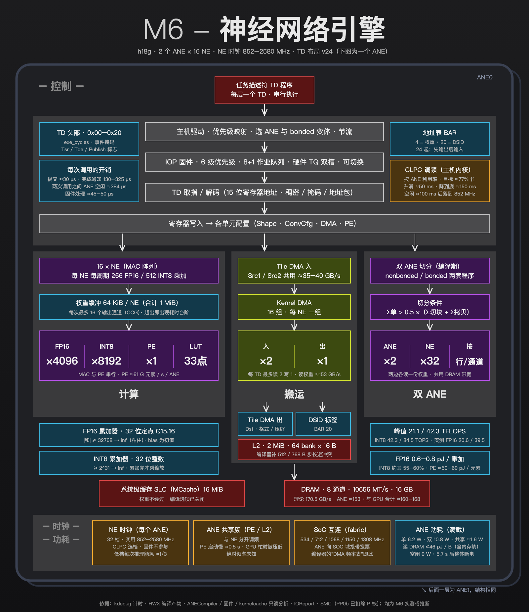

# Inside the M6 ANE：两个引擎、一套程序、一个调频器

> 机器：Apple M6（T8152，16 GB），macOS 27.0.1（26A434），ANE 编译器 `zin_ane_compiler v10.26.6`。
> 全文的结论都来自这台机器上的实测或只读分析，每条都标了证据来源（见第 1 章）。

<!-- 第 0 章 摘要：全文定稿后再写 -->
<!-- 第 1 章 方法与证据：全文定稿后再写 -->

## 2. 全景

**一句话**：M6 的神经网络引擎是**两个完整的 ANE**，每个有 16 个 NE。两者装在同一块芯片上，电源各自独立。编译器给每个模型生成单 ANE 和双 ANE 两套程序，执行时由内核驱动挑选。时钟档位既不由 ANE 自己决定，也不由固件决定，而是由主机内核里的性能控制器 CLPC 按利用率来调。

*图 1　M6 ANE 结构图。前面一层展开画的是 ANE0，后面错开的一层是结构相同的 ANE1。颜色：灰为控制，紫为计算，绿为数据搬运，蓝为片上缓冲与参数，红为存储，橙为时钟。*

### 2.1 关键数字

| 项目 | 数值 | 证据 | 详见 |
|---|---|---|---|
| 引擎 | 2 个 ANE（`ane`、`ane1`），同一个 die，各自电源门控 | 【ioreg】 | 2.3 |
| 每个引擎的 NE 数 | 16 | 【ioreg】【HAL】【HWX】 | 2.3、第 5 章 |
| 每 NE 每周期乘加 | FP16 256 次，INT8 512 次 | 【计时】【kdebug】【编译器】 | 第 5 章 |
| NE 时钟 | 32 档，实际使用 852–2580 MHz | 【ioreg】【kdebug】 | 第 9 章 |
| 峰值（直接卷积） | FP16 单 / 双 ANE 21.1 / 42.3 TFLOPS；INT8 42.3 / 84.5 TOPS | 由以上推算 | 第 5 章 |
| 实测边际吞吐 | FP16 单 / 双 ANE 20.6 / 39.5 TFLOPS（双 ANE 为单 ANE 的 1.92 倍） | 【计时】 | 第 5、8 章 |
| 片上存储 | 每个 NE 64 KiB 权重缓冲；每个 ANE 2 MiB L2（64 个 bank） | 【HAL】【HWX】【计时】 | 第 7 章 |
| 数据搬运 | 每个 TD 最多读 2 个、写 1 个 DRAM 张量；激活约 35–40 GB/s / ANE；读权重约 153 GB/s | 【kdebug】【计时】 | 第 7 章 |
| 内存 | 8 通道，10656 MT/s，理论 170.5 GB/s | 【ioreg】【IOReport】 | 第 7 章 |
| 累加器 | FP16 为 32 位定点 Q15.16；INT8 为 32 位整数 | 【数值】 | 第 6 章 |
| 调频 | CLPC 按利用率调，目标约 77% 忙；升满约 50 ms，降到底约 150 ms | 【kdebug】【内核】 | 第 10 章 |
| 功耗（满载） | 单 ANE 6.2 W，双 ANE 10.8 W；FP16 每次乘加 0.6–0.8 pJ | 【SMC】【IOReport】 | 第 11 章 |
| 空闲 | 0 W；最后一次推理 5.7 s 后整体断电 | 【SMC】【IOReport】【内核】 | 第 10 章 |

### 2.2 一个名字，五个代号

查 M6 的 ANE 会碰到好几个代号，它们指的是不同层次的东西：

| 代号 | 是什么 | 出现在哪里 |
|---|---|---|
| **M6** | 产品名 | — |
| **T8152** | SoC 型号 | 内核版本 `RELEASE_ARM64_T8152`、PMGR / CLPC 驱动名 `AppleT8152PMGR`、`AppleT8152CLPC` |
| **h18g** | ANE 的架构名，也是编译目标 | ioreg `ArchitectureTypeStr`、编译器目标 `TargetH18g` |
| **H18 / Soc2026BaseLine** | 编译器内部的参数集 | 硬件参数表用 `ZinIrHalH18`；频率、内存参数用 `Soc2026BaseLine`（不是 `H18()`，后者属于手机芯片） |
| **H11ANE / AppleH16ANEInterface** | 内核里的设备类名和驱动包名 | ioreg：`H11ANE`、`H11ANE1`，驱动 `com.apple.driver.AppleH16ANEInterface` |
| **TD v24** | 任务描述符的寄存器布局版本 | 编译器按 `ZinCpuSubtypeToArchValue` 查表；h18g 与 h19 同为 v24，h18 为 v20 |

驱动类名里的 H11 和 H16 是历史沿袭，不代表硬件代数。判断硬件代数要看 `ArchitectureTypeStr`（h18g）和 TD 布局版本（v24）。【ioreg】【编译器】

### 2.3 两个 ANE

在 IORegistry 里，M6 有两个并列的 ANE 设备，各自挂着一个固件处理器（RTKit，`RTBuddy(ANE)` / `RTBuddy(ANE1)`），共用一个驱动：【ioreg】

| 属性 | ANE0 | ANE1 |
|---|---|---|
| 设备节点 | `ane@19600000` | `ane1@81600000` |
| `ArchitectureTypeStr` | h18g | h18g |
| `NumANECores` | 16 | 16 |
| `die-id` / `die-ane-id` | 0 / 0 | 0 / 1 |
| `power-gates` | 0x1e、0x1f | 0x20、0x21 |
| `clock-ids` | 0x149、0x148、0x177 | 相同 |
| `BondedModeSupported` | 1 | 1 |

由此可以读出三点：

1. **两个 ANE 在同一个 die 上**（`die-id` 都是 0），不是两块芯片拼起来的。
2. **电源各自独立**（`power-gates` 不同）。实测中，只用一个 ANE 的模型运行时，另一个也会被短暂上电，两者的断电计时也是同步的（第 10 章）。
3. **时钟来源相同**（`clock-ids` 相同）。不过在性能控制器 CLPC 里，两者各有一个性能域（ANE → 8，ANE1 → 29），频率表也相同（设备树 `voltage-states8` / `voltage-states29`，各 32 档）。两个 ANE 能否跑在不同档位，我们没有测。

每个引擎 16 个 NE 有三方面的证据：
- ioreg 的 `NumANECores = 16`；
- 编译器参数表中"每个 ANE 的 NE 数"字段（偏移 0x00c）从 H13 起就是 16；
- 编译产物里的权重正好切成 16 份，每个 NE 一份（第 3 章）。【ioreg】【HAL】【HWX】

### 2.4 结构图导读

图 1 自上而下分为四部分，下面逐块说明，各对应后文的一章。

**控制（灰色）**——一次调用经过的路径（第 3、4 章）。
- 编译器把每一层变成一个**任务描述符（TD）**：一段带包头的寄存器写入序列，TD 之间串行执行。
- 请求先经过**主机驱动**：映射优先级，选用哪个 ANE、单 ANE 还是双 ANE 程序，必要时节流。
- 然后交给 **ANE 内的固件**：按 6 级优先级排队，放进带两个槽的硬件任务队列。高优先级的请求可以把正在执行的低优先级请求换下来。
- 硬件取出 TD、解码，再把寄存器值写进各单元的配置。
- 左侧是每次调用的固定开销：提交约 30 µs，完成通知 130–325 µs。同步调用时，两次调用之间 ANE 约空闲 384 µs。
- 右侧是 **CLPC**，它不在 ANE 里，而在主机内核里，决定 ANE 跑在哪一档（第 10 章）。

**计算（紫色）**——第 5、6 章。
- 16 个 NE 组成乘加阵列，每个 NE 每周期做 256 次 FP16 或 512 次 INT8 乘加。
- 每个 NE 有 64 KiB 权重缓冲，一次最多处理 16 个输出通道。超过时耗时出现台阶，例如通道数从 256 增加到 272 时多出约 32%。
- 逐元素运算由单独的 **PE（平面引擎）** 完成，与乘加阵列串行、不重叠。激活函数用 33 点查找表加线性插值。
- 下方两个蓝框是累加器：FP16 路径实际是 32 位定点（Q15.16），INT8 路径是 32 位整数。数值行为由此决定，比如绝对值超过 32768 就变成 inf。

**搬运（绿色）**——第 7 章。
- **Tile DMA** 搬运激活值：每个 TD 最多 2 路输入、1 路输出，两路输入共用约 35–40 GB/s 的带宽。
- **Kernel DMA** 搬运权重：每个 NE 一组，读权重最高约 153 GB/s。
- 中间结果放在每个 ANE 2 MiB 的 **L2** 里，L2 分 64 个 bank，编译器会给张量步长补齐，避开 bank 冲突。
- 再往下是系统级缓存（实测权重不经过它）和 8 通道 DRAM。

**双 ANE（紫色，右列）**——第 8 章。
- 编译器为每个模型同时生成单 ANE（nonbonded）和双 ANE（bonded）两套程序，按成本模型决定是否切分，按行或按输出通道切。
- 双 ANE 时两边各读一份权重，共用 DRAM 带宽。计算受限时提速 1.92 倍，读权重受限时几乎没有收益。

**时钟与功耗（橙、蓝，底部）**——第 9–11 章。
- **NE 时钟**：每个 ANE 32 档，实际在 852–2580 MHz 之间，由 CLPC 选档。
- **ANE 共享簇**：两个 ANE 共用的 PE / L2 部分，单独调频。它的绝对频率读不到，只知道它升频慢、GPU 忙时会被压低。
- **SoC 互连**：5 档，编译器里那张所谓的"DMA 频率表"就是它。
- **功耗**：满载时单 ANE 6.2 W、双 ANE 10.8 W，空闲时为 0。

### 2.5 和 M4 相比

| | M4（maderix） | M6（本文） |
|---|---|---|
| 架构 | H16g | h18g |
| 引擎数 | 1 | **2**，同一个 die |
| 每个引擎的 NE 数 | 16 核（苹果口径）；maderix 认为是 8 个计算组 | 16（ioreg、参数表、权重切分三方一致） |
| 编译产物 | 一套程序 | **单 ANE / 双 ANE 两套程序** |
| FP16 边际吞吐 | 约 18.5 TFLOPS（48 层，含开销） | 单 ANE 20.6、双 ANE 39.5 TFLOPS（斜率法，不含开销） |

最大的变化是**多了一个完整的引擎**，以及随之而来的"一个模型、两套程序"。其余部分，包括 TD 机制、16 个 NE、定点累加器，与 M4 一脉相承；M4 上的数值实验结果与 M6 相同（第 6 章）。各代的完整对照见第 14 章。

### 2.6 对使用者的意义

- **"两个 ANE"不等于"两倍速度"**：同一个模型在一个进程里永远串行执行，是否用上第二个 ANE由编译器的切分决定，用户无法强制。要同时占满两个引擎，需要两个不同的模型或两个进程（第 4、8 章）。
- **快慢由主机侧决定**：ANE 跑在哪一档，取决于主机提交请求是否足够密集，因为 CLPC 把利用率稳定在约 77%（第 10 章）。主机侧的开销越大，ANE 反而跑得越慢。
- 本文测的是一台 16 GB 的 M6、一个 macOS 版本。不同内存配置和系统版本下，DRAM 档位、编译器策略都可能不同。
